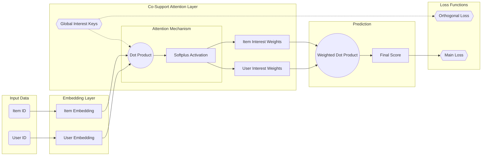

# RecSys Framework

이 프로젝트는 추천 시스템 모델을 쉽게 실험하고 평가하기 위해 설계된 유연하고 확장 가능한 프레임워크입니다.

## 🌟 주요 기능

- **다양한 모델 지원**: MF, LightGCN, CSAR 등 여러 최신 추천 모델을 기본으로 제공합니다.
- **쉬운 확장성**: 새로운 모델이나 데이터셋을 쉽게 추가할 수 있는 모듈식 구조.
- **설정 기반 실험**: YAML 설정 파일을 통해 데이터셋, 모델, 학습 파라미터를 쉽게 변경하고 관리할 수 있습니다.
- **자동화된 하이퍼파라미터 튜닝**: 그리드 서치를 통해 최적의 하이퍼파라미터 조합을 자동으로 탐색합니다.
- **실험 관리 및 결과 취합**: 여러 모델과 데이터셋에 대한 실험을 한 번에 실행하고, 결과를 단일 CSV 파일로 요약하여 비교 분석을 용이하게 합니다.

## 🧩 구현된 모델

- **MF (Matrix Factorization)**
- **LightGCN**
- **CSAR (C0-Support Attention RecSys)**
- **CSAR-R (CSAR with Residual connections)**
- **CSAR-BPR (CSAR with Bayesian Personalized Ranking loss)**

## 💾 사용 가능한 데이터셋

- **MovieLens 100K**
- **MovieLens 1M**
- **Amazon Music**
- **Amazon TV & Movie**

## 🚀 시작하기

### 1. 설치

```bash
# 1. 프로젝트 클론
git clone https://github.com/your-username/recsys_framework.git
cd recsys_framework

# 2. 가상환경 생성 및 활성화
uv venv --python 3.12.0
source .venv/bin/activate

# 3. 의존성 설치
uv pip install -r requirements.txt
```

### 2. 사용법

#### 단일 실험 실행

특정 모델과 데이터셋 설정으로 단일 실험을 실행합니다.

```bash
uv run python main.py --dataset_config configs/dataset/ml100k.yaml --model_config configs/model/mf.yaml
```

#### 하이퍼파라미터 그리드 서치

설정 파일에 정의된 하이퍼파라미터 목록을 조합하여 여러 실험을 자동으로 실행합니다. `configs/model/` 내의 YAML 파일에서 특정 파라미터 값을 리스트로 지정하면 해당 파라미터에 대한 그리드 서치가 수행됩니다.

```yaml
# 예시: configs/model/csar.yaml
model:
  name: "CSAR"
  embedding_dim: 64
  num_layers: [2, 3, 4] # num_layers를 2, 3, 4로 변경하며 실험
train:
  learning_rate: [0.001, 0.005] # learning_rate를 0.001, 0.005로 변경하며 실험
```

위와 같이 설정 후 아래 명령어를 실행합니다.

```bash
uv run python grid_search.py --dataset_config configs/dataset/ml100k.yaml --model_config configs/model/csar.yaml
```

#### 모든 실험 실행 및 결과 요약

지정된 데이터셋에 대해 `run_all_experiments.py`에 정의된 모든 모델의 그리드 서치를 실행하고, 최종 결과를 `results_summary.csv` 파일로 취합합니다.

```bash
# MovieLens 100K 데이터셋으로 모든 실험 실행
puv run ython run_all_experiments.py --dataset_config configs/dataset/ml100k.yaml
```

## ⚙️ 설정 (Configuration)

실험은 `configs` 디렉토리의 YAML 파일을 통해 제어됩니다.

- `configs/dataset/`: 데이터셋의 경로, 이름, 포맷 등 데이터 관련 설정을 정의합니다.
- `configs/model/`: 모델의 구조, 하이퍼파라미터, 학습 관련 설정을 정의합니다.

## 📁 프로젝트 구조

```
.
├── configs/              # 데이터셋 및 모델 설정 파일
│   ├── dataset/
│   └── model/
├── data/                 # 원본 데이터셋
├── src/                  # 소스 코드
│   ├── models/           # 추천 모델 구현체
│   ├── data_loader.py    # 데이터 로딩 및 전처리
│   ├── trainer.py        # 모델 학습 및 평가 로직
│   ├── evaluation.py     # 평가 지표 계산
│   └── utils.py          # 유틸리티 함수
├── trained_model/        # 학습된 모델과 결과가 저장되는 경로
├── main.py               # 단일 실험 실행 스크립트
├── grid_search.py        # 그리드 서치 실행 스크립트
└── run_all_experiments.py # 모든 실험 실행 및 결과 취합 스크립트
```

## 📊 결과

- 각 실험의 결과(학습된 모델, 로그, 최종 평가지표)는 `trained_model/{데이터셋명}/{실행명}/` 디렉토리에 저장됩니다.
- `run_all_experiments.py` 실행 시, 모든 실험의 최종 평가지표가 취합되어 루트 디렉토리의 `results_summary.csv` 파일로 생성됩니다.


## CSAR


