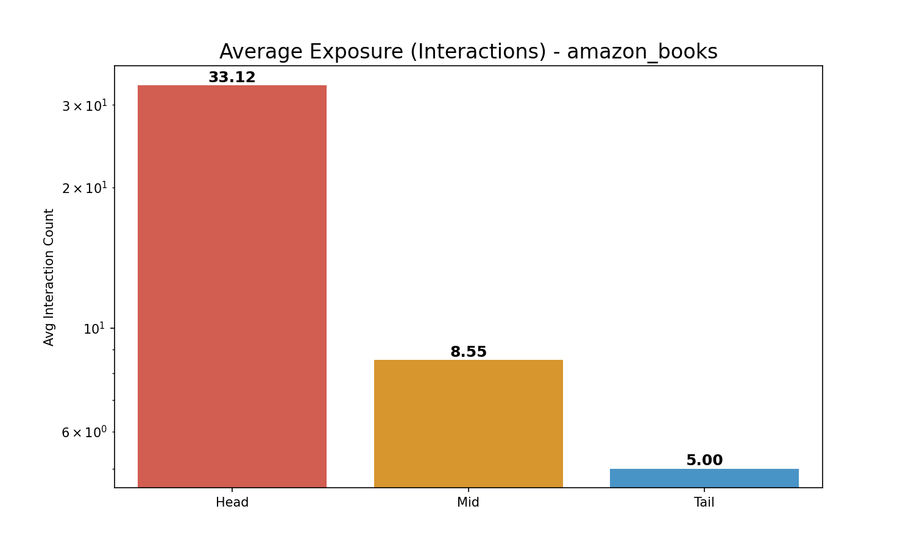
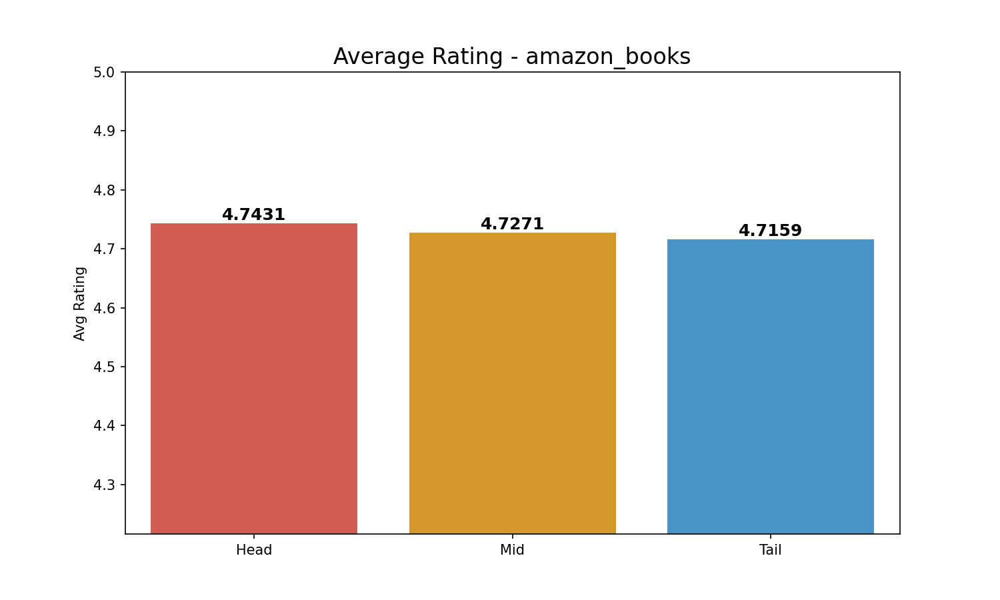

# Comprehensive Long-Tail Analysis (3-Group): amazon_books

**Split Criteria**:

- **Head (Top 20%)**: 7728 items

- **Mid (Middle 60%)**: 23186 items

- **Tail (Bottom 20%)**: 7729 items

## 1. Exposure (Interaction Count) Analysis

| Group   |   Avg Exposure |   Total Interactions |
|:--------|---------------:|---------------------:|
| Head    |        33.1193 |               255946 |
| Mid     |         8.5505 |               198252 |
| Tail    |         5      |                38645 |

> **Insight**: Head items (Top 20%) account for **51.9%** of all interactions.

## 2. Rating Analysis

| Group   |   Avg Rating |
|:--------|-------------:|
| Head    |      4.74309 |
| Mid     |      4.72709 |
| Tail    |      4.7159  |

*Average Exposure Comparison*

*Average Rating Comparison*
