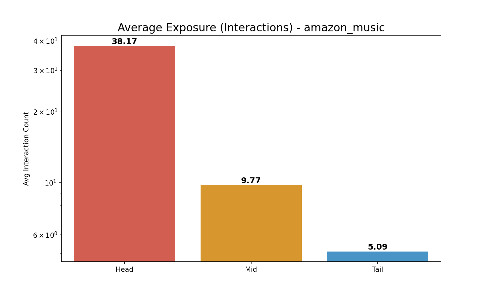
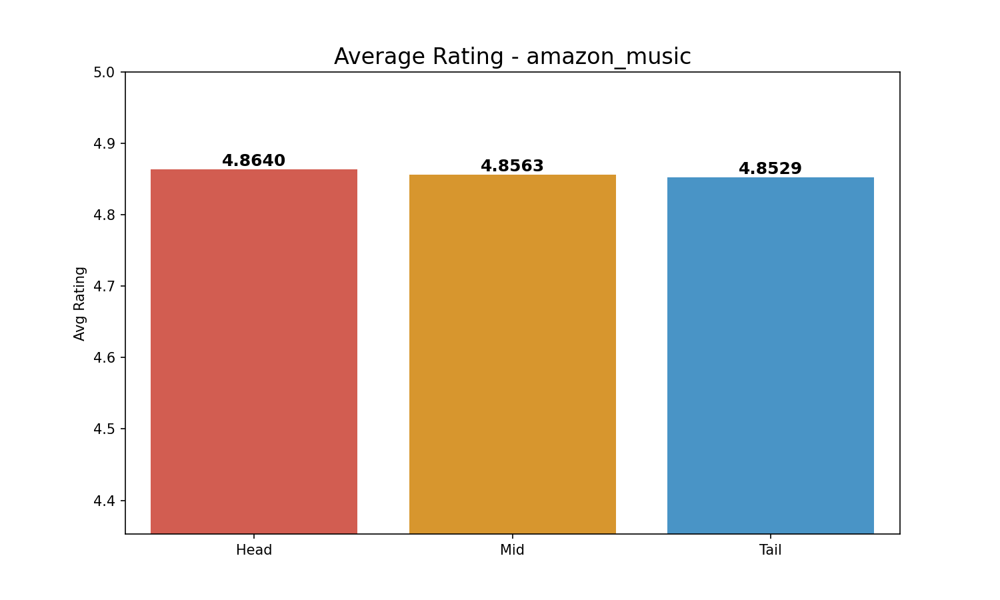

# Comprehensive Long-Tail Analysis (3-Group): amazon_music

**Split Criteria**:

- **Head (Top 20%)**: 2005 items

- **Mid (Middle 60%)**: 6016 items

- **Tail (Bottom 20%)**: 2006 items

## 1. Exposure (Interaction Count) Analysis

| Group   |   Avg Exposure |   Total Interactions |
|:--------|---------------:|---------------------:|
| Head    |       38.1721  |                76535 |
| Mid     |        9.76928 |                58772 |
| Tail    |        5.09272 |                10216 |

> **Insight**: Head items (Top 20%) account for **52.6%** of all interactions.

## 2. Rating Analysis

| Group   |   Avg Rating |
|:--------|-------------:|
| Head    |      4.86405 |
| Mid     |      4.85633 |
| Tail    |      4.85288 |

*Average Exposure Comparison*

*Average Rating Comparison*
