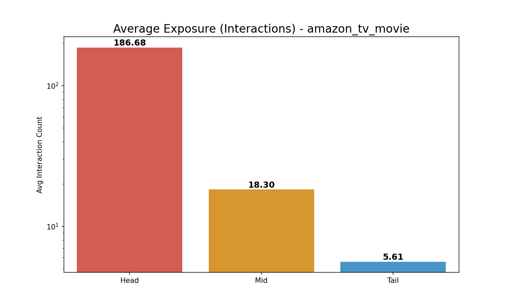
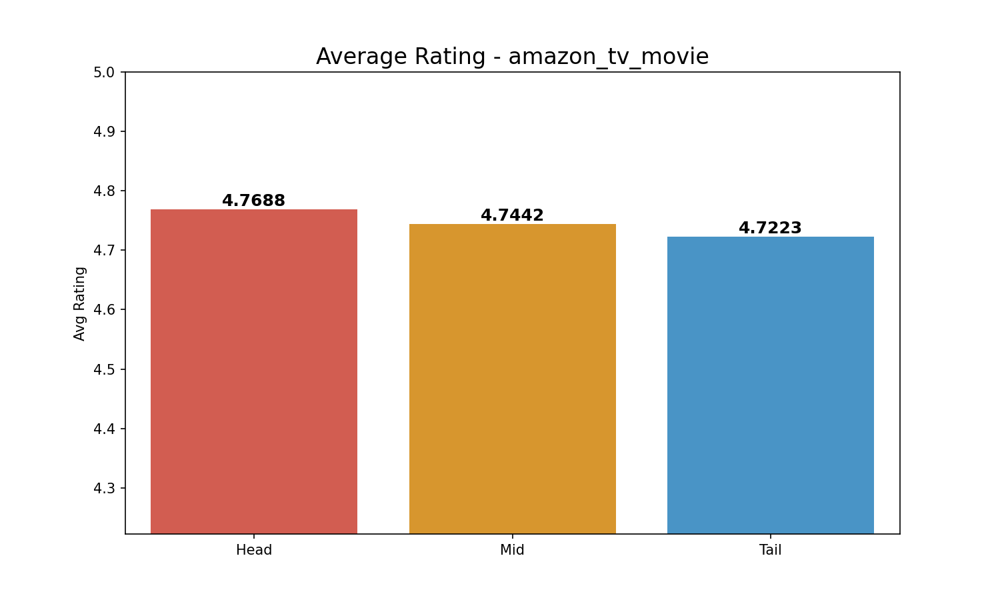

# Comprehensive Long-Tail Analysis (3-Group): amazon_tv_movie

**Split Criteria**:

- **Head (Top 20%)**: 9831 items

- **Mid (Middle 60%)**: 29493 items

- **Tail (Bottom 20%)**: 9831 items

## 1. Exposure (Interaction Count) Analysis

| Group   |   Avg Exposure |   Total Interactions |
|:--------|---------------:|---------------------:|
| Head    |      186.68    |              1835248 |
| Mid     |       18.3008  |               539746 |
| Tail    |        5.61113 |                55163 |

> **Insight**: Head items (Top 20%) account for **75.5%** of all interactions.

## 2. Rating Analysis

| Group   |   Avg Rating |
|:--------|-------------:|
| Head    |      4.76881 |
| Mid     |      4.7442  |
| Tail    |      4.72228 |

*Average Exposure Comparison*

*Average Rating Comparison*
