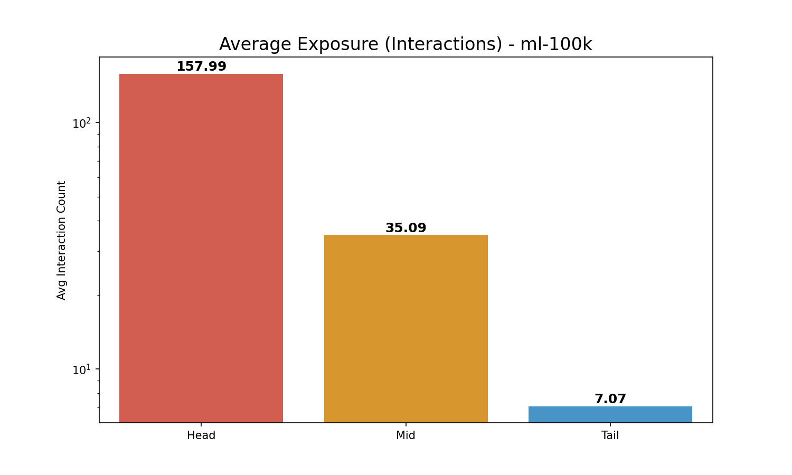
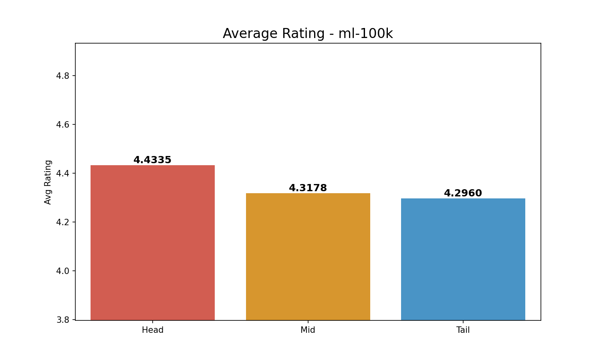

# Comprehensive Long-Tail Analysis (3-Group): ml-100k

**Split Criteria**:

- **Head (Top 20%)**: 201 items

- **Mid (Middle 60%)**: 605 items

- **Tail (Bottom 20%)**: 202 items

## 1. Exposure (Interaction Count) Analysis

| Group   |   Avg Exposure |   Total Interactions |
|:--------|---------------:|---------------------:|
| Head    |      157.99    |                31756 |
| Mid     |       35.0876  |                21228 |
| Tail    |        7.07426 |                 1429 |

> **Insight**: Head items (Top 20%) account for **58.4%** of all interactions.

## 2. Rating Analysis

| Group   |   Avg Rating |
|:--------|-------------:|
| Head    |      4.43349 |
| Mid     |      4.31783 |
| Tail    |      4.29601 |

*Average Exposure Comparison*

*Average Rating Comparison*
