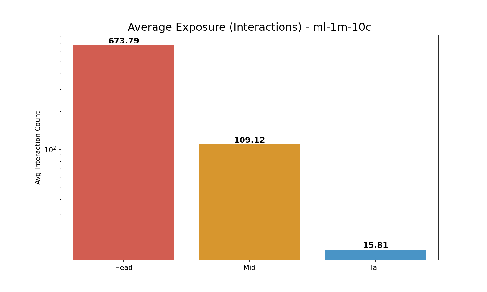
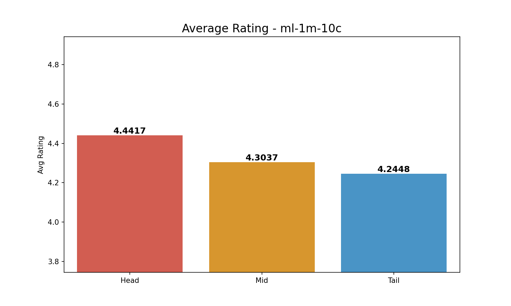

# Comprehensive Long-Tail Analysis (3-Group): ml-1m-10c

**Split Criteria**:

- **Head (Top 20%)**: 562 items

- **Mid (Middle 60%)**: 1686 items

- **Tail (Bottom 20%)**: 562 items

## 1. Exposure (Interaction Count) Analysis

| Group   |   Avg Exposure |   Total Interactions |
|:--------|---------------:|---------------------:|
| Head    |        673.794 |               378672 |
| Mid     |        109.12  |               183976 |
| Tail    |         15.806 |                 8883 |

> **Insight**: Head items (Top 20%) account for **66.3%** of all interactions.

## 2. Rating Analysis

| Group   |   Avg Rating |
|:--------|-------------:|
| Head    |      4.44173 |
| Mid     |      4.30366 |
| Tail    |      4.24485 |

*Average Exposure Comparison*

*Average Rating Comparison*
