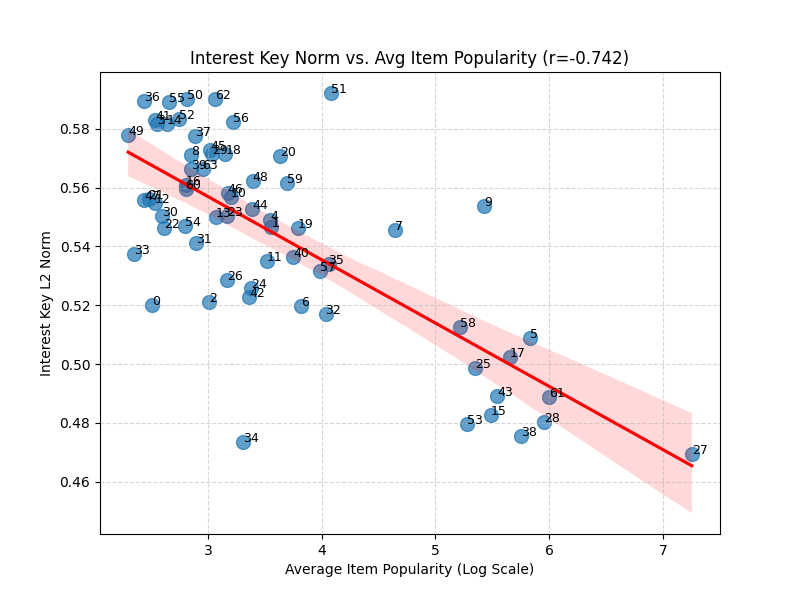

# Deep Semantic Analysis: csar-rec2__num_interests=64

# === Interest View Analysis ===

### Interest #0 Deep Analysis

- **Key Norm:** `0.5201`

**Top 20 Items**

|   Rank | Title                                          |   Year | Genres          | Director/Author    |   Weight |
|-------:|:-----------------------------------------------|-------:|:----------------|:-------------------|---------:|
|      1 | Alice and Martin (Alice et Martin)             |   1998 | Drama           | André Téchiné      |   9.6036 |
|      2 | Hanging Garden, The                            |   1997 | Drama           | Thom Fitzgerald    |   8.7887 |
|      3 | Star Maker, The (Uomo delle stelle, L')        |   1995 | Drama           | Giuseppe Tornatore |   8.2324 |
|      4 | Winter Guest, The                              |   1997 | Drama           | Alan Rickman       |   8.1738 |
|      5 | Niagara, Niagara                               |   1997 | Drama           | Oleksandr Vizyr    |   8.0801 |
|      6 | Head On                                        |   1998 | Drama           | Michael Grant      |   8.0572 |
|      7 | Chambermaid on the Titanic, The                |   1998 | Romance         | Bigas Luna         |   7.9527 |
|      8 | Edge of Seventeen                              |   1998 | Comedy, Drama   | David Moreton      |   7.9017 |
|      9 | Terrorist, The (Malli)                         |   1998 | Drama           |                    |   7.8457 |
|     10 | All Over Me                                    |   1997 | Drama           | Alex Sichel        |   7.8325 |
|     11 | Stonewall                                      |   1995 | Drama           | Roland Emmerich    |   7.8176 |
|     12 | City, The                                      |   1998 | Drama           | I V Sasi           |   7.7852 |
|     13 | Still Breathing                                |   1997 | Comedy, Romance | James F. Robinson  |   7.7284 |
|     14 | New Age, The                                   |   1994 | Drama           | Michael Tolkin     |   7.7125 |
|     15 | Ed's Next Move                                 |   1996 | Comedy          | John C. Walsh      |   7.699  |
|     16 | Aimée & Jaguar                                 |   1999 | Drama, Romance  | Max Färberböck     |   7.6712 |
|     17 | Solas                                          |   1999 | Drama           | Benito Zambrano    |   7.6384 |
|     18 | Portrait of a Lady, The                        |   1996 | Drama           | Jane Campion       |   7.6258 |
|     19 | Girl on the Bridge, The (La Fille sur le Pont) |   1999 | Drama, Romance  | Patrice Leconte    |   7.6177 |
|     20 | Afterglow                                      |   1997 | Drama, Romance  | Alan Rudolph       |   7.6164 |

**Significant Genres (p<0.05)**

| Feature   |   Count | Lift   |   p-value |
|:----------|--------:|:-------|----------:|
| Drama     |      17 | 2.9x   |    0      |
| Romance   |       6 | 3.0x   |    0.0097 |

**Significant Decades (p<0.05)**

|   Feature |   Count | Lift   |   p-value |
|----------:|--------:|:-------|----------:|
|      1990 |      20 | 1.8x   |    0.0002 |

**Significant Keywords (p<0.05)**

| Feature   |   Count | Lift   |   p-value |
|:----------|--------:|:-------|----------:|
| lgbt      |       4 | 17.9x  |         0 |
| gay theme |       3 | 12.3x  |         0 |

#### Qualitative Summary

Interest #0 captures ****Drama** genre, from the **1990s**, related to **'lgbt'****.

### Interest #1 Deep Analysis

- **Key Norm:** `0.5467`

**Top 20 Items**

|   Rank | Title                                   |   Year | Genres                | Director/Author   |   Weight |
|-------:|:----------------------------------------|-------:|:----------------------|:------------------|---------:|
|      1 | Quest for Camelot                       |   1998 | Adventure, Animation  | Frederik Du Chau  |   5.2114 |
|      2 | View to a Kill, A                       |   1985 | Action                | John Glen         |   5.1744 |
|      3 | Up at the Villa                         |   2000 | Drama                 | Philip Haas       |   4.9169 |
|      4 | Fire Down Below                         |   1997 | Action, Drama         | Robert Parrish    |   4.8881 |
|      5 | Mighty Morphin Power Rangers: The Movie |   1995 | Action, Children's    | Bryan Spicer      |   4.8844 |
|      6 | Live and Let Die                        |   1973 | Action                | Guy Hamilton      |   4.8359 |
|      7 | Steel                                   |   1997 | Action                | Kenneth Johnson   |   4.8231 |
|      8 | Candyman: Farewell to the Flesh         |   1995 | Horror                | Bill Condon       |   4.7887 |
|      9 | Spy Who Loved Me, The                   |   1977 | Action                | Lewis Gilbert     |   4.755  |
|     10 | For Your Eyes Only                      |   1981 | Action                | John Glen         |   4.7152 |
|     11 | Vampire in Brooklyn                     |   1995 | Comedy, Romance       | Wes Craven        |   4.6511 |
|     12 | Swan Princess, The                      |   1994 | Animation, Children's | Richard Rich      |   4.6401 |
|     13 | Operation Condor 2 (Longxiong hudi)     |   1990 | Action, Adventure     |                   |   4.6218 |
|     14 | World Is Not Enough, The                |   1999 | Action, Thriller      | Michael Apted     |   4.5942 |
|     15 | Phantom, The                            |   1996 | Adventure             | B. Reeves Eason   |   4.5889 |
|     16 | Knightriders                            |   1981 | Action, Adventure     | George A. Romero  |   4.5822 |
|     17 | Firestorm                               |   1998 | Action, Adventure     | Dean Semler       |   4.5681 |
|     18 | Man with the Golden Gun, The            |   1974 | Action                | Guy Hamilton      |   4.5151 |
|     19 | Adventures of Pinocchio, The            |   1996 | Adventure, Children's | Steve Barron      |   4.501  |
|     20 | Glimmer Man, The                        |   1996 | Action, Thriller      | John Gray         |   4.5004 |

**Significant Genres (p<0.05)**

| Feature   |   Count | Lift   |   p-value |
|:----------|--------:|:-------|----------:|
| Action    |      13 | 4.2x   |    0      |
| Adventure |       6 | 3.4x   |    0.0038 |

**Significant Directors (p<0.05)**

| Feature      |   Count | Lift   |   p-value |
|:-------------|--------:|:-------|----------:|
| John Glen    |       2 | 81.1x  |         0 |
| Guy Hamilton |       2 | 81.1x  |         0 |

**Significant Cast (p<0.05)**

| Feature     |   Count | Lift   |   p-value |
|:------------|--------:|:-------|----------:|
| Roger Moore |       5 | 99.7x  |         0 |

**Significant Keywords (p<0.05)**

| Feature                |   Count | Lift   |   p-value |
|:-----------------------|--------:|:-------|----------:|
| villain                |       4 | 7.8x   |         0 |
| london, england        |       4 | 9.0x   |         0 |
| england                |       5 | 21.3x  |         0 |
| british secret service |       4 | 66.3x  |         0 |
| snow skiing            |       3 | 111.9x |         0 |

#### Qualitative Summary

Interest #1 captures **films by **John Glen**, **Action** genre, related to **'villain'****.

### Interest #2 Deep Analysis

- **Key Norm:** `0.5209`

**Top 20 Items**

|   Rank | Title                                                   |   Year | Genres                | Director/Author      |   Weight |
|-------:|:--------------------------------------------------------|-------:|:----------------------|:---------------------|---------:|
|      1 | Pokémon the Movie 2000                                  |   2000 | Animation, Children's | Kunihiko Yuyama      |   6.8148 |
|      2 | Pokémon: The First Movie                                |   1998 | Animation, Children's | Kunihiko Yuyama      |   6.2371 |
|      3 | Teenage Mutant Ninja Turtles II: The Secret of the Ooze |   1991 | Action, Children's    | Michael Pressman     |   5.9241 |
|      4 | Thumbelina                                              |   1994 | Animation, Children's | Gary Goldman         |   5.4706 |
|      5 | Secret Adventures of Tom Thumb, The                     |   1993 | Adventure, Children's | Dave Borthwick       |   5.4469 |
|      6 | Shiloh                                                  |   1997 | Children's, Drama     | Chip Rosenbloom      |   5.4454 |
|      7 | Love & Human Remains                                    |   1993 | Comedy                | Denys Arcand         |   5.3752 |
|      8 | Casper                                                  |   1995 | Adventure, Children's | Brad Silberling      |   5.3616 |
|      9 | Alaska                                                  |   1996 | Adventure, Children's | Fraser Clarke Heston |   5.1815 |
|     10 | Lassie                                                  |   1994 | Adventure, Children's | Charles Sturridge    |   5.1203 |
|     11 | Borrowers, The                                          |   1997 | Adventure, Children's | Peter Hewitt         |   5.0767 |
|     12 | Baby... Secret of the Lost Legend                       |   1985 | Adventure, Sci-Fi     | Bill L. Norton       |   4.9306 |
|     13 | For the Love of Benji                                   |   1977 | Adventure, Children's | Joe Camp             |   4.8926 |
|     14 | Fly Away Home                                           |   1996 | Adventure, Children's | Carroll Ballard      |   4.7392 |
|     15 | Sesame Street Presents Follow That Bird                 |   1985 | Children's, Comedy    | Ken Kwapis           |   4.7309 |
|     16 | Simple Wish, A                                          |   1997 | Children's, Fantasy   | Michael Ritchie      |   4.6314 |
|     17 | Teenage Mutant Ninja Turtles III                        |   1993 | Action, Children's    | Stuart Gillard       |   4.5284 |
|     18 | Santa Claus: The Movie                                  |   1985 | Adventure, Children's | Jeannot Szwarc       |   4.5256 |
|     19 | Inspector General, The                                  |   1949 | Musical               | Henry Koster         |   4.4986 |
|     20 | Return of Jafar, The                                    |   1993 | Animation, Children's | Tad Stones           |   4.4945 |

**Significant Genres (p<0.05)**

| Feature    |   Count | Lift   |   p-value |
|:-----------|--------:|:-------|----------:|
| Children's |      17 | 8.9x   |    0      |
| Fantasy    |       5 | 9.5x   |    0      |
| Adventure  |       9 | 4.3x   |    0      |
| Animation  |       4 | 4.8x   |    0.0029 |

**Significant Directors (p<0.05)**

| Feature         |   Count | Lift   |   p-value |
|:----------------|--------:|:-------|----------:|
| Kunihiko Yuyama |       2 | 154.1x |         0 |

**Significant Keywords (p<0.05)**

| Feature        |   Count | Lift   |   p-value |
|:---------------|--------:|:-------|----------:|
| cartoon        |       3 | 15.3x  |    0      |
| based on comic |       3 | 11.9x  |    0      |
| rescue         |       3 | 18.3x  |    0      |
| villain        |       3 | 6.2x   |    0.0037 |

#### Qualitative Summary

Interest #2 captures **films by **Kunihiko Yuyama**, **Children's** genre, related to **'cartoon'****.

### Interest #3 Deep Analysis

- **Key Norm:** `0.5818`

**Top 20 Items**

|   Rank | Title                                                         |   Year | Genres           | Director/Author    |   Weight |
|-------:|:--------------------------------------------------------------|-------:|:-----------------|:-------------------|---------:|
|      1 | Arguing the World                                             |   1996 | Documentary      | Joseph Dorman      |   8.4643 |
|      2 | Flower of My Secret, The (La Flor de Mi Secreto)              |   1995 | Drama            | Pedro Almodóvar    |   7.6341 |
|      3 | Shaft's Big Score!                                            |   1972 | Action, Crime    | Gordon Parks       |   7.1262 |
|      4 | Sleepaway Camp                                                |   1983 | Horror           |                    |   6.9792 |
|      5 | Poison Ivy: New Seduction                                     |   1997 | Thriller         | Kurt Voss          |   6.5764 |
|      6 | Blue Hawaii                                                   |   1961 | Comedy, Musical  | Norman Taurog      |   6.5715 |
|      7 | Death Wish V: The Face of Death                               |   1994 | Action, Drama    | Allan A. Goldstein |   6.4227 |
|      8 | Decline of Western Civilization Part II: The Metal Years, The |   1988 | Documentary      | Penelope Spheeris  |   6.3917 |
|      9 | Switchblade Sisters                                           |   1975 | Crime            | Jack Hill          |   6.3524 |
|     10 | Shaft in Africa                                               |   1973 | Action, Crime    | John Guillermin    |   6.3379 |
|     11 | Slam                                                          |   1998 | Drama            | Miguel Martí       |   6.3072 |
|     12 | Friday the 13th Part 2                                        |   1981 | Horror           | Steve Miner        |   5.987  |
|     13 | Lawnmower Man 2: Beyond Cyberspace                            |   1996 | Sci-Fi, Thriller | Farhad Mann        |   5.98   |
|     14 | Panther                                                       |   1995 | Drama            | Mario Van Peebles  |   5.9077 |
|     15 | Mr. Jealousy                                                  |   1997 | Comedy, Romance  | Noah Baumbach      |   5.8529 |
|     16 | 'Til There Was You                                            |   1997 | Drama, Romance   | Scott Winant       |   5.8301 |
|     17 | Window to Paris                                               |   1994 | Comedy           | Yuri Mamin         |   5.8295 |
|     18 | Scarlet Letter, The                                           |   1926 | Drama            | Roland Joffé       |   5.814  |
|     19 | Great Day in Harlem, A                                        |   1994 | Documentary      | Jean Bach          |   5.7753 |
|     20 | Missing in Action 2: The Beginning                            |   1985 | Action, War      | Lance Hool         |   5.7695 |

**Significant Genres (p<0.05)**

| Feature     |   Count | Lift   |   p-value |
|:------------|--------:|:-------|----------:|
| Documentary |       3 | 7.5x   |    0.0008 |

**Significant Keywords (p<0.05)**

| Feature   |   Count | Lift   |   p-value |
|:----------|--------:|:-------|----------:|
| revenge   |       4 | 7.6x   |         0 |

#### Qualitative Summary

Interest #3 captures ****Documentary** genre, related to **'revenge'****.

### Interest #4 Deep Analysis

- **Key Norm:** `0.5490`

**Top 20 Items**

|   Rank | Title                               |   Year | Genres                | Director/Author          |   Weight |
|-------:|:------------------------------------|-------:|:----------------------|:-------------------------|---------:|
|      1 | Deep Rising                         |   1998 | Action, Horror        | Stephen Sommers          |   5.4044 |
|      2 | Near Dark                           |   1987 | Comedy, Horror        | Kathryn Bigelow          |   5.3455 |
|      3 | Thing From Another World, The       |   1951 | Sci-Fi                | Christian Nyby           |   5.2546 |
|      4 | Thumbelina                          |   1994 | Animation, Children's | Gary Goldman             |   5.2514 |
|      5 | Buddy                               |   1997 | Adventure, Children's | Michael Herbig           |   5.2269 |
|      6 | Nightwatch                          |   1997 | Horror, Thriller      | Ole Bornedal             |   5.2106 |
|      7 | Son of Dracula                      |   1943 | Horror                | Freddie Francis          |   5.2074 |
|      8 | I'll Do Anything                    |   1994 | Comedy, Drama         | James L. Brooks          |   5.1278 |
|      9 | Cold Fever (Á köldum klaka)         |   1994 | Comedy, Drama         | Fridrik Thor Fridriksson |   5.1185 |
|     10 | Re-Animator                         |   1985 | Horror                | Stuart Gordon            |   5.1091 |
|     11 | Tales from the Darkside: The Movie  |   1990 | Horror                | John Harrison            |   5.1042 |
|     12 | Howling, The                        |   1980 | Horror                | Joe Dante                |   5.0105 |
|     13 | Cemetery Man (Dellamorte Dellamore) |   1994 | Comedy, Horror        | Michele Soavi            |   4.9624 |
|     14 | House of Frankenstein               |   1944 | Horror                | Erle C. Kenton           |   4.9607 |
|     15 | Simple Twist of Fate, A             |   1994 | Drama                 | Gillies MacKinnon        |   4.947  |
|     16 | Relic, The                          |   1997 | Horror                | Peter Hyams              |   4.9258 |
|     17 | Close Shave, A                      |   1995 | Animation, Comedy     | Nick Park                |   4.8576 |
|     18 | Mute Witness                        |   1994 | Thriller              | Anthony Waller           |   4.8388 |
|     19 | Fright Night Part II                |   1989 | Horror                | Tommy Lee Wallace        |   4.7293 |
|     20 | Son of Frankenstein                 |   1939 | Horror                | Rowland V. Lee           |   4.7166 |

**Significant Genres (p<0.05)**

| Feature   |   Count | Lift   |   p-value |
|:----------|--------:|:-------|----------:|
| Horror    |      12 | 7.6x   |         0 |

**Significant Keywords (p<0.05)**

| Feature   |   Count | Lift   |   p-value |
|:----------|--------:|:-------|----------:|
| monster   |       3 | 12.2x  |         0 |

#### Qualitative Summary

Interest #4 captures ****Horror** genre, related to **'monster'****.

### Interest #5 Deep Analysis

- **Key Norm:** `0.5090`

**Top 20 Items**

|   Rank | Title                                  |   Year | Genres            | Director/Author      |   Weight |
|-------:|:---------------------------------------|-------:|:------------------|:---------------------|---------:|
|      1 | Star Trek IV: The Voyage Home          |   1986 | Action, Adventure | Leonard Nimoy        |   5.5923 |
|      2 | Star Trek: First Contact               |   1996 | Action, Adventure | Jonathan Frakes      |   5.574  |
|      3 | Johnny Mnemonic                        |   1995 | Action, Sci-Fi    | Robert Longo         |   5.5424 |
|      4 | Star Trek VI: The Undiscovered Country |   1991 | Action, Adventure | Nicholas Meyer       |   5.4973 |
|      5 | Star Trek: Insurrection                |   1998 | Action, Sci-Fi    | Jonathan Frakes      |   5.4693 |
|      6 | Forbidden Planet                       |   1956 | Sci-Fi            | Fred M. Wilcox       |   5.327  |
|      7 | Fifth Element, The                     |   1997 | Action, Sci-Fi    | Luc Besson           |   5.2036 |
|      8 | Tank Girl                              |   1995 | Action, Comedy    | Rachel Talalay       |   5.1042 |
|      9 | Dark City                              |   1998 | Film-Noir, Sci-Fi | Alex Proyas          |   5.0779 |
|     10 | Free Enterprise                        |   1998 | Comedy, Romance   | Robert Meyer Burnett |   5.0229 |
|     11 | Star Trek: Generations                 |   1994 | Action, Adventure | David Carson         |   5.0097 |
|     12 | Matrix, The                            |   1999 | Action, Sci-Fi    | Lana Wachowski       |   4.9722 |
|     13 | Gattaca                                |   1997 | Drama, Sci-Fi     | Andrew Niccol        |   4.9448 |
|     14 | Twelve Monkeys                         |   1995 | Drama, Sci-Fi     | Terry Gilliam        |   4.9009 |
|     15 | Stargate                               |   1994 | Action, Adventure | Roland Emmerich      |   4.8213 |
|     16 | 2010                                   |   1984 | Mystery, Sci-Fi   | Peter Hyams          |   4.8084 |
|     17 | Star Trek III: The Search for Spock    |   1984 | Action, Adventure | Leonard Nimoy        |   4.7829 |
|     18 | Thirteenth Floor, The                  |   1999 | Drama, Sci-Fi     | Josef Rusnak         |   4.7438 |
|     19 | Contact                                |   1997 | Drama, Sci-Fi     | Robert Zemeckis      |   4.7436 |
|     20 | Highlander III: The Sorcerer           |   1994 | Action, Sci-Fi    | Andrew Morahan       |   4.6966 |

**Significant Genres (p<0.05)**

| Feature   |   Count | Lift   |   p-value |
|:----------|--------:|:-------|----------:|
| Sci-Fi    |      20 | 8.1x   |    0      |
| Action    |      12 | 2.7x   |    0.0004 |

**Significant Directors (p<0.05)**

| Feature         |   Count | Lift   |   p-value |
|:----------------|--------:|:-------|----------:|
| Leonard Nimoy   |       2 | 154.1x |         0 |
| Jonathan Frakes |       2 | 154.1x |         0 |

**Significant Cast (p<0.05)**

| Feature         |   Count | Lift   |   p-value |
|:----------------|--------:|:-------|----------:|
| William Shatner |       4 | 86.6x  |         0 |
| DeForest Kelley |       3 | 65.0x  |         0 |
| James Doohan    |       3 | 65.0x  |         0 |
| Patrick Stewart |       3 | 65.0x  |         0 |
| Jonathan Frakes |       3 | 151.6x |         0 |

**Significant Keywords (p<0.05)**

| Feature          |   Count | Lift   |   p-value |
|:-----------------|--------:|:-------|----------:|
| spacecraft       |       6 | 17.7x  |         0 |
| saving the world |       3 | 14.4x  |         0 |
| teleportation    |       7 | 38.4x  |         0 |
| starship         |       6 | 46.1x  |         0 |
| space opera      |      10 | 34.9x  |         0 |

#### Qualitative Summary

Interest #5 captures **films by **Leonard Nimoy**, **Sci-Fi** genre, related to **'spacecraft'****.

### Interest #6 Deep Analysis

- **Key Norm:** `0.5199`

**Top 20 Items**

|   Rank | Title                   |   Year | Genres              | Director/Author    |   Weight |
|-------:|:------------------------|-------:|:--------------------|:-------------------|---------:|
|      1 | Crossfire               |   1947 | Crime, Film-Noir    | Claude Desrosiers  |   8.2002 |
|      2 | Room at the Top         |   1959 | Drama               | Jack Clayton       |   7.9152 |
|      3 | Gay Divorcee, The       |   1934 | Comedy, Musical     | Mark Sandrich      |   7.2639 |
|      4 | Only Angels Have Wings  |   1939 | Drama               | Howard Hawks       |   7.1542 |
|      5 | Murder, My Sweet        |   1944 | Film-Noir, Thriller | Edward Dmytryk     |   7.0617 |
|      6 | Face in the Crowd, A    |   1957 | Drama               | Elia Kazan         |   7.0403 |
|      7 | Palm Beach Story, The   |   1942 | Comedy              | Preston Sturges    |   6.9632 |
|      8 | Foreign Correspondent   |   1940 | Thriller            | Alfred Hitchcock   |   6.8568 |
|      9 | I Confess               |   1953 | Thriller            | Alfred Hitchcock   |   6.8416 |
|     10 | Lost Weekend, The       |   1945 | Drama               | Billy Wilder       |   6.7942 |
|     11 | Suspicion               |   1941 | Mystery, Thriller   | Alfred Hitchcock   |   6.7554 |
|     12 | Limelight               |   1952 | Drama               | Charlie Chaplin    |   6.7041 |
|     13 | Shadow of a Doubt       |   1943 | Film-Noir, Thriller | Karen Arthur       |   6.6757 |
|     14 | Laura                   |   1944 | Crime, Film-Noir    | Hanung Bramantyo   |   6.6624 |
|     15 | Innocents, The          |   1961 | Thriller            | Jack Clayton       |   6.6226 |
|     16 | Band Wagon, The         |   1953 | Comedy, Musical     | Vincente Minnelli  |   6.6043 |
|     17 | He Walked by Night      |   1948 | Crime, Film-Noir    | Alfred L. Werker   |   6.6038 |
|     18 | How Green Was My Valley |   1941 | Drama               | John Ford          |   6.5561 |
|     19 | Stage Fright            |   1950 | Mystery, Thriller   | Laurent Bouzereau  |   6.5391 |
|     20 | Big Carnival, The       |   1951 | Drama               | Hans Fischerkoesen |   6.4725 |

**Significant Genres (p<0.05)**

| Feature   |   Count | Lift   |   p-value |
|:----------|--------:|:-------|----------:|
| Film-Noir |       5 | 21.7x  |    0      |
| Thriller  |       8 | 3.1x   |    0.0014 |
| Mystery   |       3 | 5.3x   |    0.0094 |

**Significant Decades (p<0.05)**

|   Feature |   Count | Lift   |   p-value |
|----------:|--------:|:-------|----------:|
|      1940 |      10 | 14.9x  |         0 |
|      1950 |       7 | 7.8x   |         0 |

**Significant Directors (p<0.05)**

| Feature          |   Count | Lift   |   p-value |
|:-----------------|--------:|:-------|----------:|
| Jack Clayton     |       2 | 102.7x |         0 |
| Alfred Hitchcock |       3 | 21.0x  |         0 |

**Significant Keywords (p<0.05)**

| Feature         |   Count | Lift   |   p-value |
|:----------------|--------:|:-------|----------:|
| film noir       |       4 | 23.4x  |         0 |
| black and white |       7 | 8.9x   |         0 |

#### Qualitative Summary

Interest #6 captures **films by **Jack Clayton**, **Film-Noir** genre, from the **1940s**, related to **'film noir'****.

### Interest #7 Deep Analysis

- **Key Norm:** `0.5456`

**Top 20 Items**

|   Rank | Title                                       |   Year | Genres                | Director/Author   |   Weight |
|-------:|:--------------------------------------------|-------:|:----------------------|:------------------|---------:|
|      1 | Thunderball                                 |   1965 | Action                | Terence Young     |   5.4531 |
|      2 | Spy Who Loved Me, The                       |   1977 | Action                | Lewis Gilbert     |   5.3606 |
|      3 | Man with the Golden Gun, The                |   1974 | Action                | Guy Hamilton      |   5.2846 |
|      4 | Critical Care                               |   1997 | Comedy                | Sidney Lumet      |   5.1839 |
|      5 | Amazing Panda Adventure, The                |   1995 | Adventure, Children's | Christopher Cain  |   4.9203 |
|      6 | Goldfinger                                  |   1964 | Action                | Guy Hamilton      |   4.8051 |
|      7 | Moonraker                                   |   1979 | Action, Romance       | Lewis Gilbert     |   4.7818 |
|      8 | Omega Code, The                             |   1999 | Action                | Robert Marcarelli |   4.7717 |
|      9 | Star Trek: Generations                      |   1994 | Action, Adventure     | David Carson      |   4.7508 |
|     10 | For Your Eyes Only                          |   1981 | Action                | John Glen         |   4.7328 |
|     11 | Indiana Jones and the Last Crusade          |   1989 | Action, Adventure     | Steven Spielberg  |   4.6446 |
|     12 | NeverEnding Story III, The                  |   1994 | Adventure, Children's | Peter MacDonald   |   4.6401 |
|     13 | Batman & Robin                              |   1997 | Action, Adventure     | Joel Schumacher   |   4.5621 |
|     14 | Star Trek V: The Final Frontier             |   1989 | Action, Adventure     | William Shatner   |   4.5435 |
|     15 | Shiloh                                      |   1997 | Children's, Drama     | Chip Rosenbloom   |   4.4941 |
|     16 | Star Trek IV: The Voyage Home               |   1986 | Action, Adventure     | Leonard Nimoy     |   4.4936 |
|     17 | On Her Majesty's Secret Service             |   1969 | Action                | Peter R. Hunt     |   4.4715 |
|     18 | Red Sonja                                   |   1985 | Action, Adventure     | MJ Bassett        |   4.4413 |
|     19 | Highlander                                  |   1986 | Action, Adventure     | Russell Mulcahy   |   4.3418 |
|     20 | Far From Home: The Adventures of Yellow Dog |   1995 | Adventure, Children's | Phillip Borsos    |   4.3222 |

**Significant Genres (p<0.05)**

| Feature   |   Count | Lift   |   p-value |
|:----------|--------:|:-------|----------:|
| Action    |      15 | 4.7x   |         0 |
| Adventure |      10 | 5.5x   |         0 |

**Significant Directors (p<0.05)**

| Feature       |   Count | Lift   |   p-value |
|:--------------|--------:|:-------|----------:|
| Lewis Gilbert |       2 | 154.1x |         0 |
| Guy Hamilton  |       2 | 77.0x  |         0 |

**Significant Cast (p<0.05)**

| Feature      |   Count | Lift   |   p-value |
|:-------------|--------:|:-------|----------:|
| Sean Connery |       4 | 26.4x  |         0 |
| Roger Moore  |       4 | 75.8x  |         0 |

**Significant Keywords (p<0.05)**

| Feature                     |   Count | Lift   |   p-value |
|:----------------------------|--------:|:-------|----------:|
| sea                         |       3 | 19.3x  |         0 |
| secret organization         |       3 | 44.1x  |         0 |
| british secret service      |       6 | 68.6x  |         0 |
| england                     |       5 | 14.7x  |         0 |
| secret intelligence service |       3 | 38.6x  |         0 |

#### Qualitative Summary

Interest #7 captures **films by **Lewis Gilbert**, **Action** genre, related to **'sea'****.

### Interest #8 Deep Analysis

- **Key Norm:** `0.5709`

**Top 20 Items**

|   Rank | Title                                                                    |   Year | Genres           | Director/Author     |   Weight |
|-------:|:-------------------------------------------------------------------------|-------:|:-----------------|:--------------------|---------:|
|      1 | Flying Tigers                                                            |   1942 | Action, Drama    | David Miller        |   6.5443 |
|      2 | Romance                                                                  |   1999 | Drama, Romance   | Catherine Breillat  |   6.0407 |
|      3 | Major League: Back to the Minors                                         |   1998 | Comedy           | John Warren         |   5.6018 |
|      4 | Lucie Aubrac                                                             |   1997 | Romance, War     | Claude Berri        |   5.5691 |
|      5 | Dear Diary (Caro Diario)                                                 |   1994 | Comedy, Drama    | Nanni Moretti       |   5.4999 |
|      6 | How I Won the War                                                        |   1967 | Comedy, War      | Richard Lester      |   5.4445 |
|      7 | Don't Be a Menace to South Central While Drinking Your Juice in the Hood |   1996 | Comedy           | Paris Barclay       |   5.3433 |
|      8 | Odd Couple II, The                                                       |   1998 | Comedy           | Howard Deutch       |   5.3146 |
|      9 | Eyes of Tammy Faye, The                                                  |   2000 | Documentary      | Michael Showalter   |   5.2836 |
|     10 | Madame Butterfly                                                         |   1995 | Musical          | Frédéric Mitterrand |   5.2662 |
|     11 | Rough Night in Jericho                                                   |   1967 | Western          | Arnold Laven        |   5.2453 |
|     12 | Jerky Boys, The                                                          |   1994 | Comedy           | James Melkonian     |   5.2265 |
|     13 | Stars Fell on Henrietta, The                                             |   1995 | Drama            | James Keach         |   5.2234 |
|     14 | Great Day in Harlem, A                                                   |   1994 | Documentary      | Jean Bach           |   5.1044 |
|     15 | Passion in the Desert                                                    |   1998 | Adventure, Drama | Lavinia Currier     |   5.0858 |
|     16 | Farewell to Arms, A                                                      |   1932 | Romance, War     | Frank Borzage       |   5.0704 |
|     17 | Big Tease, The                                                           |   1999 | Comedy           | Kevin Allen         |   5.0598 |
|     18 | Dracula: Dead and Loving It                                              |   1995 | Comedy, Horror   | Mel Brooks          |   4.9913 |
|     19 | Killing Zoe                                                              |   1994 | Thriller         | Roger Avary         |   4.9455 |
|     20 | Lawn Dogs                                                                |   1997 | Drama            | John Duigan         |   4.8874 |

**Significant Genres (p<0.05)**

| Feature   |   Count | Lift   |   p-value |
|:----------|--------:|:-------|----------:|
| War       |       4 | 5.5x   |    0.0009 |

**Significant Keywords (p<0.05)**

| Feature    |   Count | Lift   |   p-value |
|:-----------|--------:|:-------|----------:|
| friendship |       3 | 7.9x   |    0.0006 |

#### Qualitative Summary

Interest #8 captures ****War** genre, related to **'friendship'****.

### Interest #9 Deep Analysis

- **Key Norm:** `0.5537`

**Top 20 Items**

|   Rank | Title                       |   Year | Genres          | Director/Author      |   Weight |
|-------:|:----------------------------|-------:|:----------------|:---------------------|---------:|
|      1 | Portrait of a Lady, The     |   1996 | Drama           | Jane Campion         |   5.0711 |
|      2 | Moonstruck                  |   1987 | Comedy          | Norman Jewison       |   4.9216 |
|      3 | Sex, Lies, and Videotape    |   1989 | Drama           | Steven Soderbergh    |   4.8789 |
|      4 | When Harry Met Sally...     |   1989 | Comedy, Romance | Rob Reiner           |   4.663  |
|      5 | Draughtsman's Contract, The |   1982 | Drama           | Peter Greenaway      |   4.4633 |
|      6 | Room with a View, A         |   1986 | Drama, Romance  | James Ivory          |   4.4617 |
|      7 | Outsiders, The              |   1983 | Drama           | Francis Ford Coppola |   4.4472 |
|      8 | Witness                     |   1985 | Drama, Romance  | Peter Weir           |   4.4256 |
|      9 | Say Anything...             |   1989 | Comedy, Drama   | Cameron Crowe        |   4.3401 |
|     10 | Parenthood                  |   1989 | Comedy, Drama   | Ron Howard           |   4.3312 |
|     11 | Sixteen Candles             |   1984 | Comedy          | John Hughes          |   4.3231 |
|     12 | Heartburn                   |   1986 | Comedy, Drama   | Mike Nichols         |   4.3081 |
|     13 | Raising Arizona             |   1987 | Comedy          | Joel Coen            |   4.3051 |
|     14 | Pretty in Pink              |   1986 | Comedy, Drama   | Howard Deutch        |   4.2222 |
|     15 | Fletch                      |   1985 | Comedy          | Michael Ritchie      |   4.221  |
|     16 | Still Breathing             |   1997 | Comedy, Romance | James F. Robinson    |   4.2143 |
|     17 | Whatever It Takes           |   2000 | Comedy, Romance | David Raynr          |   4.2113 |
|     18 | Ferris Bueller's Day Off    |   1986 | Comedy          | John Hughes          |   4.198  |
|     19 | Breakfast Club, The         |   1985 | Comedy, Drama   | John Hughes          |   4.1776 |
|     20 | Dead Poets Society          |   1989 | Drama           | Peter Weir           |   4.1706 |

**Significant Genres (p<0.05)**

| Feature   |   Count | Lift   |   p-value |
|:----------|--------:|:-------|----------:|
| Comedy    |      13 | 2.1x   |    0.0043 |
| Romance   |       7 | 2.8x   |    0.0093 |

**Significant Decades (p<0.05)**

|   Feature |   Count | Lift   |   p-value |
|----------:|--------:|:-------|----------:|
|      1980 |      17 | 5.0x   |         0 |

**Significant Directors (p<0.05)**

| Feature     |   Count | Lift   |   p-value |
|:------------|--------:|:-------|----------:|
| Peter Weir  |       2 | 44.0x  |         0 |
| John Hughes |       3 | 115.5x |         0 |

**Significant Cast (p<0.05)**

| Feature        |   Count | Lift   |   p-value |
|:---------------|--------:|:-------|----------:|
| Molly Ringwald |       3 | 91.0x  |         0 |

**Significant Keywords (p<0.05)**

| Feature              |   Count | Lift   |   p-value |
|:---------------------|--------:|:-------|----------:|
| family relationships |       3 | 11.8x  |         0 |
| melodramatic         |       3 | 32.7x  |         0 |
| coming of age        |       4 | 7.9x   |         0 |
| teenager             |       4 | 31.5x  |         0 |
| high school          |       5 | 12.4x  |         0 |

#### Qualitative Summary

Interest #9 captures **films by **Peter Weir**, **Comedy** genre, from the **1980s**, related to **'family relationships'****.

### Interest #10 Deep Analysis

- **Key Norm:** `0.5567`

**Top 20 Items**

|   Rank | Title                       |   Year | Genres                | Director/Author        |   Weight |
|-------:|:----------------------------|-------:|:----------------------|:-----------------------|---------:|
|      1 | Flying Tigers               |   1942 | Action, Drama         | David Miller           |   8.0496 |
|      2 | Fighting Seabees, The       |   1944 | Action, Drama         | Edward Ludwig          |   6.7927 |
|      3 | Captain Horatio Hornblower  |   1951 | Action, Adventure     | Raoul Walsh            |   6.5421 |
|      4 | Beach Party                 |   1963 | Comedy                | William Asher          |   6.3415 |
|      5 | Devil's Brigade, The        |   1968 | War                   | Andrew V. McLaglen     |   6.2621 |
|      6 | How to Stuff a Wild Bikini  |   1965 | Comedy                | William Asher          |   6.2527 |
|      7 | Dark Command                |   1940 | Western               | Raoul Walsh            |   5.8769 |
|      8 | Dorado, El                  |   1967 | Western               | William Atticus Parker |   5.8001 |
|      9 | Hot Lead and Cold Feet      |   1978 | Comedy, Western       | Robert Butler          |   5.7863 |
|     10 | Great Locomotive Chase, The |   1956 | Adventure, War        | Francis D. Lyon        |   5.7766 |
|     11 | Destination Moon            |   1950 | Sci-Fi                | Irving Pichel          |   5.7493 |
|     12 | Bridge at Remagen, The      |   1969 | Action, War           | John Guillermin        |   5.7364 |
|     13 | Alvarez Kelly               |   1966 | Western               | Edward Dmytryk         |   5.649  |
|     14 | Pajama Party                |   1964 | Comedy                | Don Weis               |   5.6459 |
|     15 | Pork Chop Hill              |   1959 | War                   | Lewis Milestone        |   5.621  |
|     16 | Tora! Tora! Tora!           |   1970 | War                   | Toshio Masuda          |   5.6144 |
|     17 | Cross of Iron               |   1977 | War                   | Sam Peckinpah          |   5.5907 |
|     18 | Story of G.I. Joe, The      |   1945 | War                   | William A. Wellman     |   5.5658 |
|     19 | Saludos Amigos              |   1943 | Animation, Children's | Wilfred Jackson        |   5.4129 |
|     20 | Godzilla (Gojira)           |   1954 | Action, Sci-Fi        | Takashi Yamazaki       |   5.3649 |

**Significant Genres (p<0.05)**

| Feature   |   Count | Lift   |   p-value |
|:----------|--------:|:-------|----------:|
| War       |      10 | 12.5x  |         0 |
| Western   |       4 | 11.3x  |         0 |

**Significant Decades (p<0.05)**

|   Feature |   Count | Lift   |   p-value |
|----------:|--------:|:-------|----------:|
|      1940 |       5 | 7.4x   |    0      |
|      1960 |       7 | 6.6x   |    0      |
|      1950 |       5 | 5.5x   |    0.0001 |

**Significant Directors (p<0.05)**

| Feature       |   Count | Lift   |   p-value |
|:--------------|--------:|:-------|----------:|
| Raoul Walsh   |       2 | 154.1x |         0 |
| William Asher |       2 | 102.7x |         0 |

**Significant Cast (p<0.05)**

| Feature           |   Count | Lift   |   p-value |
|:------------------|--------:|:-------|----------:|
| John Wayne        |       3 | 65.0x  |         0 |
| Annette Funicello |       3 | 91.0x  |         0 |

**Significant Keywords (p<0.05)**

| Feature      |   Count | Lift   |   p-value |
|:-------------|--------:|:-------|----------:|
| world war ii |       6 | 22.5x  |         0 |

#### Qualitative Summary

Interest #10 captures **films by **Raoul Walsh**, **War** genre, from the **1940s**, related to **'world war ii'****.

### Interest #11 Deep Analysis

- **Key Norm:** `0.5350`

**Top 20 Items**

|   Rank | Title                                               |   Year | Genres          | Director/Author          |   Weight |
|-------:|:----------------------------------------------------|-------:|:----------------|:-------------------------|---------:|
|      1 | Wild Reeds                                          |   1994 | Drama           | André Téchiné            |   5.5556 |
|      2 | Paris Is Burning                                    |   1990 | Documentary     | Jennie Livingston        |   5.2834 |
|      3 | Mrs. Parker and the Vicious Circle                  |   1994 | Drama           | Alan Rudolph             |   5.2463 |
|      4 | Girl 6                                              |   1996 | Comedy          | Spike Lee                |   5.2308 |
|      5 | Go Fish                                             |   1994 | Drama, Romance  | Rose Troche              |   5.1186 |
|      6 | Bhaji on the Beach                                  |   1993 | Comedy, Drama   | Gurinder Chadha          |   5.108  |
|      7 | Incredibly True Adventure of Two Girls in Love, The |   1995 | Comedy, Romance | Maria Maggenti           |   4.8817 |
|      8 | Celluloid Closet, The                               |   1995 | Documentary     | Rob Epstein              |   4.8793 |
|      9 | Kika                                                |   1993 | Drama           | Pedro Almodóvar          |   4.7378 |
|     10 | Mo' Better Blues                                    |   1990 | Drama           | Spike Lee                |   4.7222 |
|     11 | She's Gotta Have It                                 |   1986 | Comedy, Romance | Spike Lee                |   4.7027 |
|     12 | Cold Fever (Á köldum klaka)                         |   1994 | Comedy, Drama   | Fridrik Thor Fridriksson |   4.7017 |
|     13 | Red Sorghum (Hong Gao Liang)                        |   1987 | Drama, War      | Zhang Yimou              |   4.6632 |
|     14 | Bride of the Monster                                |   1956 | Horror, Sci-Fi  | Edward D. Wood Jr.       |   4.6251 |
|     15 | Bandit Queen                                        |   1994 | Drama           | Shekhar Kapur            |   4.6134 |
|     16 | Party Girl                                          |   1995 | Comedy          | Koichi Sakamoto          |   4.5421 |
|     17 | New Jersey Drive                                    |   1995 | Crime, Drama    | Nick Gomez               |   4.5013 |
|     18 | Van, The                                            |   1996 | Comedy, Drama   | Sam Grossman             |   4.4527 |
|     19 | Mystery Train                                       |   1989 | Comedy, Crime   | Jim Jarmusch             |   4.4224 |
|     20 | Class                                               |   1983 | Comedy          | Lewis John Carlino       |   4.3883 |

**Significant Directors (p<0.05)**

| Feature   |   Count | Lift   |   p-value |
|:----------|--------:|:-------|----------:|
| Spike Lee |       3 | 33.0x  |         0 |

**Significant Cast (p<0.05)**

| Feature   |   Count | Lift   |   p-value |
|:----------|--------:|:-------|----------:|
| Spike Lee |       3 | 113.7x |         0 |

**Significant Keywords (p<0.05)**

| Feature            |   Count | Lift   |   p-value |
|:-------------------|--------:|:-------|----------:|
| male homosexuality |       3 | 57.2x  |    0      |
| lgbt               |       5 | 23.9x  |    0      |
| woman director     |       4 | 6.3x   |    0.0003 |

#### Qualitative Summary

Interest #11 captures **films by **Spike Lee**, related to **'male homosexuality'****.

### Interest #12 Deep Analysis

- **Key Norm:** `0.5549`

**Top 20 Items**

|   Rank | Title                                               |   Year | Genres            | Director/Author   |   Weight |
|-------:|:----------------------------------------------------|-------:|:------------------|:------------------|---------:|
|      1 | And God Created Woman (Et Dieu&#8230;Créa la Femme) |   1956 | Drama             |                   |   8.8798 |
|      2 | Exit to Eden                                        |   1994 | Comedy            | Garry Marshall    |   6.8597 |
|      3 | Incredibly True Adventure of Two Girls in Love, The |   1995 | Comedy, Romance   | Maria Maggenti    |   6.3721 |
|      4 | Wife, The                                           |   1995 | Comedy, Drama     | Björn Runge       |   6.2494 |
|      5 | Bad Girls                                           |   1994 | Western           | Jonathan Kaplan   |   6.1496 |
|      6 | Better Than Chocolate                               |   1999 | Comedy, Romance   | Anne Wheeler      |   5.9037 |
|      7 | Time of the Gypsies (Dom za vesanje)                |   1989 | Drama             | Emir Kusturica    |   5.8772 |
|      8 | Monument Ave.                                       |   1998 | Crime             | Ted Demme         |   5.8351 |
|      9 | Prisoner of the Mountains (Kavkazsky Plennik)       |   1996 | War               | Sergei Bodrov     |   5.6554 |
|     10 | Tango Lesson, The                                   |   1997 | Romance           | Sally Potter      |   5.6239 |
|     11 | Hugo Pool                                           |   1997 | Romance           | Robert Downey Sr. |   5.5428 |
|     12 | Onegin                                              |   1999 | Drama             | Michael Beyer     |   5.458  |
|     13 | Outlaw, The                                         |   1943 | Western           | Howard Hughes     |   5.4401 |
|     14 | Afterglow                                           |   1997 | Drama, Romance    | Alan Rudolph      |   5.4181 |
|     15 | Even Cowgirls Get the Blues                         |   1993 | Comedy, Romance   | Gus Van Sant      |   5.3976 |
|     16 | Lawnmower Man 2: Beyond Cyberspace                  |   1996 | Sci-Fi, Thriller  | Farhad Mann       |   5.3034 |
|     17 | Heaven's Prisoners                                  |   1996 | Mystery, Thriller | Phil Joanou       |   5.2314 |
|     18 | Mr. Jones                                           |   1993 | Drama, Romance    | Agnieszka Holland |   5.2267 |
|     19 | Mina Tannenbaum                                     |   1994 | Drama             | Martine Dugowson  |   5.2    |
|     20 | Window to Paris                                     |   1994 | Comedy            | Yuri Mamin        |   5.1865 |

**Significant Genres (p<0.05)**

| Feature   |   Count | Lift   |   p-value |
|:----------|--------:|:-------|----------:|
| Romance   |       7 | 3.3x   |    0.002  |
| Western   |       2 | 6.5x   |    0.0312 |

**Significant Decades (p<0.05)**

|   Feature |   Count | Lift   |   p-value |
|----------:|--------:|:-------|----------:|
|      1990 |      17 | 1.5x   |     0.018 |

**Significant Keywords (p<0.05)**

| Feature        |   Count | Lift   |   p-value |
|:---------------|--------:|:-------|----------:|
| lgbt           |       4 | 17.7x  |    0      |
| revenge        |       3 | 7.4x   |    0.0009 |
| woman director |       3 | 4.4x   |    0.0281 |

#### Qualitative Summary

Interest #12 captures ****Romance** genre, from the **1990s**, related to **'lgbt'****.

### Interest #13 Deep Analysis

- **Key Norm:** `0.5501`

**Top 20 Items**

|   Rank | Title                             |   Year | Genres                | Director/Author   |   Weight |
|-------:|:----------------------------------|-------:|:----------------------|:------------------|---------:|
|      1 | Penny Serenade                    |   1941 | Drama, Romance        | George Stevens    |   6.3958 |
|      2 | Swept from the Sea                |   1997 | Romance               | Beeban Kidron     |   6.358  |
|      3 | Condorman                         |   1981 | Action, Adventure     | Charles Jarrott   |   5.7308 |
|      4 | Spice World                       |   1997 | Comedy, Musical       | Bob Spiers        |   5.5556 |
|      5 | Golden Earrings                   |   1947 | Adventure, Romance    | Mitchell Leisen   |   5.5176 |
|      6 | Slipper and the Rose, The         |   1976 | Adventure, Musical    | Bryan Forbes      |   5.3378 |
|      7 | Make Mine Music                   |   1946 | Animation, Children's | Robert Cormack    |   5.2892 |
|      8 | Candleshoe                        |   1977 | Adventure, Children's | Norman Tokar      |   5.0963 |
|      9 | Braindead                         |   1992 | Comedy, Horror        | Peter Jackson     |   5.041  |
|     10 | Hamlet                            |   1964 | Drama                 | Kenneth Branagh   |   5.0049 |
|     11 | Daddy Long Legs                   |   1919 | Comedy                | Gong Jung-shik    |   4.9767 |
|     12 | Warriors of Virtue                |   1997 | Action, Adventure     | Ronny Yu          |   4.9656 |
|     13 | Autumn Tale, An (Conte d'automne) |   1998 | Romance               | Éric Rohmer       |   4.9529 |
|     14 | Drunken Master (Zui quan)         |   1979 | Action, Comedy        | Lau Kar-Leung     |   4.9523 |
|     15 | Shall We Dance?                   |   1937 | Comedy, Musical       | Masayuki Suō      |   4.9481 |
|     16 | Next Karate Kid, The              |   1994 | Action, Children's    | Christopher Cain  |   4.9054 |
|     17 | Muppet Treasure Island            |   1996 | Adventure, Children's | David Gumpel      |   4.7546 |
|     18 | Charlie, the Lonesome Cougar      |   1967 | Adventure, Children's | Winston Hibler    |   4.7262 |
|     19 | Haunted Honeymoon                 |   1986 | Comedy                | Gene Wilder       |   4.5822 |
|     20 | Mr. Jealousy                      |   1997 | Comedy, Romance       | Noah Baumbach     |   4.5428 |

**Significant Genres (p<0.05)**

| Feature    |   Count | Lift   |   p-value |
|:-----------|--------:|:-------|----------:|
| Musical    |       5 | 5.7x   |    0.0001 |
| Children's |       7 | 3.6x   |    0.0008 |
| Adventure  |       7 | 3.3x   |    0.0022 |

**Significant Decades (p<0.05)**

|   Feature |   Count | Lift   |   p-value |
|----------:|--------:|:-------|----------:|
|      1940 |       3 | 4.5x   |    0.0229 |

#### Qualitative Summary

Interest #13 captures ****Musical** genre, from the **1940s****.

### Interest #14 Deep Analysis

- **Key Norm:** `0.5817`

**Top 20 Items**

|   Rank | Title                                                     |   Year | Genres            | Director/Author          |   Weight |
|-------:|:----------------------------------------------------------|-------:|:------------------|:-------------------------|---------:|
|      1 | Light of Day                                              |   1987 | Drama             | Paul Schrader            |   8.7562 |
|      2 | Funhouse, The                                             |   1981 | Horror            | Tobe Hooper              |   8.7063 |
|      3 | Halloween III: Season of the Witch                        |   1983 | Horror            | Tommy Lee Wallace        |   8.5992 |
|      4 | Toxic Avenger, Part II, The                               |   1989 | Comedy, Horror    | Michael Herz             |   8.1776 |
|      5 | Black Sabbath (Tre Volti Della Paura, I)                  |   1963 | Horror            | Mario Bava               |   7.9499 |
|      6 | Halloween 5: The Revenge of Michael Myers                 |   1989 | Horror            | Dominique Othenin-Girard |   7.9461 |
|      7 | Friday the 13th Part VI: Jason Lives                      |   1986 | Horror            | Tom McLoughlin           |   7.8655 |
|      8 | Stage Fright                                              |   1950 | Mystery, Thriller | Laurent Bouzereau        |   7.8577 |
|      9 | Burglar                                                   |   1987 | Comedy            | Hugh Wilson              |   7.7739 |
|     10 | Class of Nuke 'Em High                                    |   1986 | Comedy, Horror    | Richard W. Haines        |   7.5828 |
|     11 | Maximum Overdrive                                         |   1986 | Horror            | Stephen King             |   7.5105 |
|     12 | Rollercoaster                                             |   1977 | Drama, Thriller   | James Goldstone          |   7.4572 |
|     13 | Fatal Beauty                                              |   1987 | Action, Crime     | Joel Soisson             |   7.4163 |
|     14 | Night of the Creeps                                       |   1986 | Comedy, Horror    | Fred Dekker              |   7.1663 |
|     15 | Halloween II                                              |   1981 | Horror            | Rob Zombie               |   7.1586 |
|     16 | Friday the 13th Part 3: 3D                                |   1982 | Horror            | Steve Miner              |   7.1166 |
|     17 | Friday the 13th: The Final Chapter                        |   1984 | Horror            | Joseph Zito              |   7.0899 |
|     18 | Wishmaster                                                |   1997 | Horror            | Robert Kurtzman          |   7.0651 |
|     19 | Final Conflict, The (a.k.a. Omen III: The Final Conflict) |   1981 | Horror            |                          |   7.0122 |
|     20 | Rawhead Rex                                               |   1986 | Horror, Thriller  | George Pavlou            |   6.9855 |

**Significant Genres (p<0.05)**

| Feature   |   Count | Lift   |   p-value |
|:----------|--------:|:-------|----------:|
| Horror    |      15 | 10.9x  |         0 |

**Significant Decades (p<0.05)**

|   Feature |   Count | Lift   |   p-value |
|----------:|--------:|:-------|----------:|
|      1980 |      16 | 4.7x   |         0 |

**Significant Keywords (p<0.05)**

| Feature        |   Count | Lift   |   p-value |
|:---------------|--------:|:-------|----------:|
| mask           |       3 | 38.2x  |         0 |
| slasher        |       6 | 23.7x  |         0 |
| absurd         |       4 | 11.2x  |         0 |
| holiday horror |       3 | 71.0x  |         0 |
| new jersey     |       3 | 20.7x  |         0 |

#### Qualitative Summary

Interest #14 captures ****Horror** genre, from the **1980s**, related to **'mask'****.

### Interest #15 Deep Analysis

- **Key Norm:** `0.4828`

**Top 20 Items**

|   Rank | Title                           |   Year | Genres                | Director/Author     |   Weight |
|-------:|:--------------------------------|-------:|:----------------------|:--------------------|---------:|
|      1 | For a Few Dollars More          |   1965 | Western               | Sergio Leone        |   6.0039 |
|      2 | Hang 'em High                   |   1967 | Western               | Ted Post            |   5.6992 |
|      3 | 101 Dalmatians                  |   1961 | Animation, Children's | Stephen Herek       |   5.534  |
|      4 | Fistful of Dollars, A           |   1964 | Action, Western       | Sergio Leone        |   5.3472 |
|      5 | Awfully Big Adventure, An       |   1995 | Drama                 | Mike Newell         |   5.27   |
|      6 | Outlaw Josey Wales, The         |   1976 | Western               | Clint Eastwood      |   5.2515 |
|      7 | Good, The Bad and The Ugly, The |   1966 | Action, Western       | Sergio Leone        |   4.9019 |
|      8 | Robin Hood                      |   1973 | Animation, Children's | Geoff Collins       |   4.8859 |
|      9 | High Plains Drifter             |   1972 | Western               | Clint Eastwood      |   4.8373 |
|     10 | Dr. No                          |   1962 | Action                | Terence Young       |   4.8209 |
|     11 | Thunderball                     |   1965 | Action                | Terence Young       |   4.7386 |
|     12 | Sword in the Stone, The         |   1963 | Animation, Children's | Wolfgang Reitherman |   4.5832 |
|     13 | Tora! Tora! Tora!               |   1970 | War                   | Toshio Masuda       |   4.55   |
|     14 | Goldfinger                      |   1964 | Action                | Guy Hamilton        |   4.4924 |
|     15 | Live and Let Die                |   1973 | Action                | Guy Hamilton        |   4.4554 |
|     16 | Charlotte's Web                 |   1973 | Animation, Children's | Iwao Takamoto       |   4.4139 |
|     17 | Spy Who Loved Me, The           |   1977 | Action                | Lewis Gilbert       |   4.352  |
|     18 | Pale Rider                      |   1985 | Western               | Clint Eastwood      |   4.3246 |
|     19 | Bambi                           |   1942 | Animation, Children's | David Hand          |   4.296  |
|     20 | Dirty Dozen, The                |   1967 | Action, War           | Robert Aldrich      |   4.2931 |

**Significant Genres (p<0.05)**

| Feature    |   Count | Lift   |   p-value |
|:-----------|--------:|:-------|----------:|
| Western    |       7 | 22.6x  |    0      |
| Animation  |       5 | 9.5x   |    0      |
| Action     |       8 | 3.4x   |    0.0004 |
| Children's |       5 | 4.1x   |    0.0022 |

**Significant Decades (p<0.05)**

|   Feature |   Count | Lift   |   p-value |
|----------:|--------:|:-------|----------:|
|      1960 |      10 | 9.5x   |         0 |
|      1970 |       7 | 5.1x   |         0 |

**Significant Directors (p<0.05)**

| Feature        |   Count | Lift   |   p-value |
|:---------------|--------:|:-------|----------:|
| Sergio Leone   |       3 | 92.4x  |         0 |
| Clint Eastwood |       3 | 42.0x  |         0 |
| Terence Young  |       2 | 102.7x |         0 |
| Guy Hamilton   |       2 | 77.0x  |         0 |

**Significant Cast (p<0.05)**

| Feature        |   Count | Lift   |   p-value |
|:---------------|--------:|:-------|----------:|
| Clint Eastwood |       7 | 53.1x  |         0 |
| Sean Connery   |       3 | 19.8x  |         0 |

**Significant Keywords (p<0.05)**

| Feature           |   Count | Lift   |   p-value |
|:------------------|--------:|:-------|----------:|
| spaghetti western |       3 | 71.7x  |         0 |
| gunslinger        |       3 | 39.9x  |         0 |
| gun battle        |       3 | 59.8x  |         0 |
| england           |       5 | 17.1x  |         0 |
| showdown          |       3 | 14.3x  |         0 |

#### Qualitative Summary

Interest #15 captures **films by **Sergio Leone**, **Western** genre, from the **1960s**, related to **'spaghetti western'****.

### Interest #16 Deep Analysis

- **Key Norm:** `0.5610`

**Top 20 Items**

|   Rank | Title                                    |   Year | Genres                | Director/Author    |   Weight |
|-------:|:-----------------------------------------|-------:|:----------------------|:-------------------|---------:|
|      1 | Bedrooms & Hallways                      |   1998 | Comedy, Romance       | Rose Troche        |   7.3709 |
|      2 | Stonewall                                |   1995 | Drama                 | Roland Emmerich    |   7.2988 |
|      3 | Maybe, Maybe Not (Bewegte Mann, Der)     |   1994 | Comedy                | Sönke Wortmann     |   7.1334 |
|      4 | Urbania                                  |   2000 | Drama                 | Flávio Frederico   |   6.7872 |
|      5 | Alice and Martin (Alice et Martin)       |   1998 | Drama                 | André Téchiné      |   6.5338 |
|      6 | Bandits                                  |   1997 | Drama                 | Barry Levinson     |   6.4882 |
|      7 | Airport 1975                             |   1974 | Drama                 | Jack Smight        |   6.3426 |
|      8 | Jeffrey                                  |   1995 | Comedy                | Christopher Ashley |   6.1456 |
|      9 | Broken Hearts Club, The                  |   2000 | Drama                 | Oh deok jae        |   6.0683 |
|     10 | Bewegte Mann, Der                        |   1994 | Comedy                | Sönke Wortmann     |   6.0184 |
|     11 | Dying Young                              |   1991 | Drama, Romance        | Joel Schumacher    |   5.9707 |
|     12 | Hanging Garden, The                      |   1997 | Drama                 | Thom Fitzgerald    |   5.9479 |
|     13 | Paris Is Burning                         |   1990 | Documentary           | Jennie Livingston  |   5.7517 |
|     14 | Kiss Me, Guido                           |   1997 | Comedy                | Tony Vitale        |   5.7449 |
|     15 | Extremities                              |   1986 | Drama, Thriller       | Robert M. Young    |   5.6763 |
|     16 | Homeward Bound II: Lost in San Francisco |   1996 | Adventure, Children's | David R. Ellis     |   5.561  |
|     17 | Johns                                    |   1996 | Drama                 | Scott Silver       |   5.5518 |
|     18 | Roadside Prophets                        |   1992 | Comedy, Drama         | Abbe Wool          |   5.5335 |
|     19 | Poltergeist III                          |   1988 | Horror, Thriller      | Gary Sherman       |   5.4874 |
|     20 | Turtle Diary                             |   1985 | Drama                 | John Irvin         |   5.4787 |

**Significant Genres (p<0.05)**

| Feature   |   Count | Lift   |   p-value |
|:----------|--------:|:-------|----------:|
| Drama     |      12 | 2.0x   |    0.0091 |

**Significant Directors (p<0.05)**

| Feature        |   Count | Lift   |   p-value |
|:---------------|--------:|:-------|----------:|
| Sönke Wortmann |       2 | 154.1x |         0 |

**Significant Keywords (p<0.05)**

| Feature      |   Count | Lift   |   p-value |
|:-------------|--------:|:-------|----------:|
| lgbt         |       6 | 18.4x  |         0 |
| gay theme    |       5 | 14.1x  |         0 |
| transvestism |       3 | 46.8x  |         0 |
| drag queen   |       3 | 57.2x  |         0 |

#### Qualitative Summary

Interest #16 captures **films by **Sönke Wortmann**, **Drama** genre, related to **'lgbt'****.

### Interest #17 Deep Analysis

- **Key Norm:** `0.5025`

**Top 20 Items**

|   Rank | Title                       |   Year | Genres            | Director/Author   |   Weight |
|-------:|:----------------------------|-------:|:------------------|:------------------|---------:|
|      1 | Lethal Weapon               |   1987 | Action, Comedy    | Richard Donner    |   5.6566 |
|      2 | Lethal Weapon 2             |   1989 | Action, Comedy    | Richard Donner    |   5.287  |
|      3 | Weird Science               |   1985 | Comedy            | John Hughes       |   5.2611 |
|      4 | Caddyshack                  |   1980 | Comedy            | Harold Ramis      |   4.8204 |
|      5 | Rambo III                   |   1988 | Action, War       | Peter MacDonald   |   4.8008 |
|      6 | Night Shift                 |   1982 | Comedy            | Stephen Hall      |   4.7212 |
|      7 | Iron Eagle II               |   1988 | Action, War       | Sidney J. Furie   |   4.6955 |
|      8 | Crocodile Dundee            |   1986 | Adventure, Comedy | Peter Faiman      |   4.5631 |
|      9 | Firestarter                 |   1984 | Horror, Thriller  | Mark L. Lester    |   4.5493 |
|     10 | Christmas Vacation          |   1989 | Comedy            | Enrico Oldoini    |   4.5165 |
|     11 | Iron Eagle                  |   1986 | Action, War       | Sidney J. Furie   |   4.4783 |
|     12 | Jurassic Park               |   1993 | Action, Adventure | Steven Spielberg  |   4.4711 |
|     13 | Back to the Future          |   1985 | Comedy, Sci-Fi    | Robert Zemeckis   |   4.4239 |
|     14 | Ghostbusters                |   1984 | Comedy, Horror    | Ivan Reitman      |   4.4067 |
|     15 | Gremlins                    |   1984 | Comedy, Horror    | Joe Dante         |   4.3962 |
|     16 | Big Trouble in Little China |   1986 | Action, Comedy    | John Carpenter    |   4.3926 |
|     17 | Die Hard 2                  |   1990 | Action, Thriller  | Renny Harlin      |   4.339  |
|     18 | Weekend at Bernie's         |   1989 | Comedy            | Ted Kotcheff      |   4.3282 |
|     19 | Porky's                     |   1981 | Comedy            | Bob Clark         |   4.3009 |
|     20 | Die Hard                    |   1988 | Action, Thriller  | John McTiernan    |   4.2977 |

**Significant Genres (p<0.05)**

| Feature   |   Count | Lift   |   p-value |
|:----------|--------:|:-------|----------:|
| Action    |       9 | 2.8x   |    0.0024 |
| Comedy    |      13 | 1.8x   |    0.03   |

**Significant Decades (p<0.05)**

|   Feature |   Count | Lift   |   p-value |
|----------:|--------:|:-------|----------:|
|      1980 |      18 | 5.2x   |         0 |

**Significant Directors (p<0.05)**

| Feature         |   Count | Lift   |   p-value |
|:----------------|--------:|:-------|----------:|
| Richard Donner  |       2 | 30.8x  |         0 |
| Sidney J. Furie |       2 | 77.0x  |         0 |

**Significant Keywords (p<0.05)**

| Feature     |   Count | Lift   |   p-value |
|:------------|--------:|:-------|----------:|
| lapd        |       3 | 44.2x  |         0 |
| christmas   |       5 | 8.6x   |         0 |
| action hero |       4 | 7.9x   |         0 |
| hilarious   |       4 | 9.6x   |         0 |
| explosion   |       4 | 11.8x  |         0 |

#### Qualitative Summary

Interest #17 captures **films by **Richard Donner**, **Action** genre, from the **1980s**, related to **'lapd'****.

### Interest #18 Deep Analysis

- **Key Norm:** `0.5716`

**Top 20 Items**

|   Rank | Title                         |   Year | Genres                | Director/Author   |   Weight |
|-------:|:------------------------------|-------:|:----------------------|:------------------|---------:|
|      1 | Idolmaker, The                |   1980 | Drama                 | Taylor Hackford   |   6.4973 |
|      2 | Killing of Sister George, The |   1968 | Drama                 | Robert Aldrich    |   6.0898 |
|      3 | Pallbearer, The               |   1996 | Comedy                | Matt Reeves       |   5.8501 |
|      4 | Cutter's Way                  |   1981 | Drama, Thriller       | Ivan Passer       |   5.7881 |
|      5 | Blue Lagoon, The              |   1980 | Adventure, Drama      | Randal Kleiser    |   5.7791 |
|      6 | Desert Bloom                  |   1986 | Drama                 | Eugene Corr       |   5.575  |
|      7 | Mr. Wrong                     |   1996 | Comedy                | Nick Castle       |   5.5736 |
|      8 | Bustin' Loose                 |   1981 | Comedy                | Oz Scott          |   5.5193 |
|      9 | Golden Voyage of Sinbad, The  |   1974 | Action, Adventure     | Gordon Hessler    |   5.4969 |
|     10 | Paper Chase, The              |   1973 | Drama                 | James Bridges     |   5.4799 |
|     11 | King of Marvin Gardens, The   |   1972 | Crime, Drama          | Bob Rafelson      |   5.4709 |
|     12 | Bitter Moon                   |   1992 | Drama                 | Roman Polanski    |   5.3935 |
|     13 | Days of Heaven                |   1978 | Drama                 | Terrence Malick   |   5.3355 |
|     14 | Sandpiper, The                |   1965 | Drama, Romance        | Vincente Minnelli |   5.3351 |
|     15 | Tex                           |   1982 | Drama                 | Tim Hunter        |   5.3029 |
|     16 | Let's Get Harry               |   1986 | Action, Adventure     | Stuart Rosenberg  |   5.3006 |
|     17 | Pawnbroker, The               |   1965 | Drama                 | Sidney Lumet      |   5.1959 |
|     18 | And God Created Woman         |   1988 | Comedy, Drama         | Roger Vadim       |   5.1831 |
|     19 | Black Beauty                  |   1994 | Adventure, Children's | Toshiyuki Hiruma  |   5.0714 |
|     20 | I Married A Strange Person    |   1997 | Animation             | Bill Plympton     |   5.0685 |

**Significant Genres (p<0.05)**

| Feature   |   Count | Lift   |   p-value |
|:----------|--------:|:-------|----------:|
| Drama     |      13 | 1.9x   |    0.0137 |

**Significant Decades (p<0.05)**

|   Feature |   Count | Lift   |   p-value |
|----------:|--------:|:-------|----------:|
|      1980 |       8 | 2.3x   |    0.0154 |

#### Qualitative Summary

Interest #18 captures ****Drama** genre, from the **1980s****.

### Interest #19 Deep Analysis

- **Key Norm:** `0.5464`

**Top 20 Items**

|   Rank | Title                    |   Year | Genres             | Director/Author   |   Weight |
|-------:|:-------------------------|-------:|:-------------------|:------------------|---------:|
|      1 | Brokedown Palace         |   1999 | Drama              | Jonathan Kaplan   |   5.6717 |
|      2 | 20 Dates                 |   1998 | Comedy             | Myles Berkowitz   |   5.4558 |
|      3 | Cruel Intentions         |   1999 | Drama              | Roger Kumble      |   5.4005 |
|      4 | She's All That           |   1999 | Comedy, Romance    | Robert Iscove     |   5.1794 |
|      5 | Final Destination        |   2000 | Drama, Thriller    | James Wong        |   5.1412 |
|      6 | Never Been Kissed        |   1999 | Comedy, Romance    | Raja Gosnell      |   5.1008 |
|      7 | Idle Hands               |   1999 | Comedy, Horror     | Rodman Flender    |   5.0292 |
|      8 | Where the Heart Is       |   2000 | Comedy, Drama      | Matt Williams     |   5.0063 |
|      9 | Random Hearts            |   1999 | Drama, Romance     | Sydney Pollack    |   4.9223 |
|     10 | Heavyweights             |   1994 | Children's, Comedy | Steven Brill      |   4.833  |
|     11 | 54                       |   1998 | Drama              | Mark Christopher  |   4.7018 |
|     12 | Whole Wide World, The    |   1996 | Drama              | Dan Ireland       |   4.6959 |
|     13 | Trick                    |   1999 | Romance            | Jim Fall          |   4.6913 |
|     14 | Urban Legends: Final Cut |   2000 | Horror             | John Ottman       |   4.6356 |
|     15 | Haunting, The            |   1999 | Horror, Thriller   | Jan de Bont       |   4.5991 |
|     16 | Bikini Beach             |   1964 | Comedy             | William Asher     |   4.5944 |
|     17 | Judy Berlin              |   1999 | Drama              | Eric Mendelsohn   |   4.5859 |
|     18 | Vegas Vacation           |   1997 | Comedy             | Stephen Kessler   |   4.5798 |
|     19 | Boys and Girls           |   2000 | Comedy, Romance    | Robert Iscove     |   4.5743 |
|     20 | Loser                    |   2000 | Comedy, Romance    | Amy Heckerling    |   4.5377 |

**Significant Genres (p<0.05)**

| Feature   |   Count | Lift   |   p-value |
|:----------|--------:|:-------|----------:|
| Romance   |       6 | 2.6x   |    0.0279 |

**Significant Decades (p<0.05)**

|   Feature |   Count | Lift   |   p-value |
|----------:|--------:|:-------|----------:|
|      2000 |       5 | 6.2x   |         0 |

**Significant Directors (p<0.05)**

| Feature       |   Count | Lift   |   p-value |
|:--------------|--------:|:-------|----------:|
| Robert Iscove |       2 | 154.1x |         0 |

**Significant Keywords (p<0.05)**

| Feature   |   Count | Lift   |   p-value |
|:----------|--------:|:-------|----------:|
| college   |       3 | 16.2x  |         0 |

#### Qualitative Summary

Interest #19 captures **films by **Robert Iscove**, **Romance** genre, from the **2000s**, related to **'college'****.

### Interest #20 Deep Analysis

- **Key Norm:** `0.5709`

**Top 20 Items**

|   Rank | Title                          |   Year | Genres            | Director/Author   |   Weight |
|-------:|:-------------------------------|-------:|:------------------|:------------------|---------:|
|      1 | Beautiful                      |   2000 | Comedy, Drama     | Dean O'Flaherty   |   5.7618 |
|      2 | Eye of the Beholder            |   1999 | Thriller          | Nicola Camoglio   |   5.6751 |
|      3 | I Dreamed of Africa            |   2000 | Drama             | Hugh Hudson       |   5.0826 |
|      4 | Mission to Mars                |   2000 | Sci-Fi            | Brian De Palma    |   4.9478 |
|      5 | Instinct                       |   1999 | Drama, Thriller   | Jon Turteltaub    |   4.8826 |
|      6 | Up at the Villa                |   2000 | Drama             | Philip Haas       |   4.8321 |
|      7 | Rules of Engagement            |   2000 | Drama, Thriller   | William Friedkin  |   4.8148 |
|      8 | Brokedown Palace               |   1999 | Drama             | Jonathan Kaplan   |   4.71   |
|      9 | Rich and Strange               |   1932 | Comedy, Romance   | Alfred Hitchcock  |   4.6947 |
|     10 | Astronaut's Wife, The          |   1999 | Sci-Fi, Thriller  | Rand Ravich       |   4.6529 |
|     11 | Exorcist II: The Heretic       |   1977 | Horror            | John Boorman      |   4.6079 |
|     12 | Psycho III                     |   1986 | Horror, Thriller  | Anthony Perkins   |   4.5174 |
|     13 | Autumn in New York             |   2000 | Drama, Romance    | Joan Chen         |   4.377  |
|     14 | White Squall                   |   1996 | Adventure, Drama  | Ridley Scott      |   4.3535 |
|     15 | Blue Hawaii                    |   1961 | Comedy, Musical   | Norman Taurog     |   4.331  |
|     16 | Lost World: Jurassic Park, The |   1997 | Action, Adventure | Steven Spielberg  |   4.3286 |
|     17 | Angela's Ashes                 |   1999 | Drama             | Alan Parker       |   4.3259 |
|     18 | Meteor                         |   1979 | Sci-Fi            | Brett Bentman     |   4.243  |
|     19 | Powder                         |   1995 | Drama, Sci-Fi     | Victor Salva      |   4.1534 |
|     20 | Get Carter                     |   1971 | Thriller          | Stephen Kay       |   4.1459 |

**Significant Genres (p<0.05)**

| Feature   |   Count | Lift   |   p-value |
|:----------|--------:|:-------|----------:|
| Sci-Fi    |       5 | 3.3x   |    0.0136 |
| Thriller  |       7 | 2.6x   |    0.0141 |

**Significant Decades (p<0.05)**

|   Feature |   Count | Lift   |   p-value |
|----------:|--------:|:-------|----------:|
|      2000 |       6 | 7.4x   |         0 |

**Significant Keywords (p<0.05)**

| Feature     |   Count | Lift   |   p-value |
|:------------|--------:|:-------|----------:|
| teenage boy |       3 | 69.6x  |    0      |
| absurd      |       3 | 8.3x   |    0.0004 |
| sequel      |       3 | 4.3x   |    0.0311 |

#### Qualitative Summary

Interest #20 captures ****Sci-Fi** genre, from the **2000s**, related to **'teenage boy'****.

### Interest #21 Deep Analysis

- **Key Norm:** `0.5560`

**Top 20 Items**

|   Rank | Title                                   |   Year | Genres                | Director/Author    |   Weight |
|-------:|:----------------------------------------|-------:|:----------------------|:-------------------|---------:|
|      1 | Star Maker, The (Uomo delle stelle, L') |   1995 | Drama                 | Giuseppe Tornatore |   8.0028 |
|      2 | Police Academy 6: City Under Siege      |   1989 | Comedy                | Peter Bonerz       |   7.7675 |
|      3 | Beverly Hillbillies, The                |   1993 | Comedy                | Penelope Spheeris  |   7.715  |
|      4 | National Lampoon's Senior Trip          |   1995 | Comedy                | Kelly Makin        |   7.6347 |
|      5 | Bio-Dome                                |   1996 | Comedy                | Jason Bloom        |   7.4509 |
|      6 | Police Academy 4: Citizens on Patrol    |   1987 | Comedy                | Jim Drake          |   7.4187 |
|      7 | Price Above Rubies, A                   |   1998 | Drama                 | Boaz Yakin         |   7.3387 |
|      8 | Problem Child                           |   1990 | Comedy                | Dennis Dugan       |   7.3297 |
|      9 | Jonah Who Will Be 25 in the Year 2000   |   1976 | Comedy                | Alain Tanner       |   7.0496 |
|     10 | Vegas Vacation                          |   1997 | Comedy                | Stephen Kessler    |   7.0294 |
|     11 | Dudley Do-Right                         |   1999 | Children's, Comedy    | Hugh Wilson        |   6.9224 |
|     12 | Repossessed                             |   1990 | Comedy                | Bob Logan          |   6.9085 |
|     13 | Problem Child 2                         |   1991 | Comedy                | Brian Levant       |   6.8995 |
|     14 | We're No Angels                         |   1989 | Drama                 | Michael Curtiz     |   6.8815 |
|     15 | Police Academy 3: Back in Training      |   1986 | Comedy                | Jerry Paris        |   6.8368 |
|     16 | Poetic Justice                          |   1993 | Drama                 | John Singleton     |   6.8327 |
|     17 | Hot Lead and Cold Feet                  |   1978 | Comedy, Western       | Robert Butler      |   6.8222 |
|     18 | Before and After                        |   1996 | Drama, Mystery        | Barbet Schroeder   |   6.7908 |
|     19 | Vie est belle, La (Life is Rosey)       |   1987 | Comedy, Drama         |                    |   6.7674 |
|     20 | Tall Tale                               |   1994 | Adventure, Children's | Attila Szász       |   6.7461 |

**Significant Genres (p<0.05)**

| Feature   |   Count | Lift   |   p-value |
|:----------|--------:|:-------|----------:|
| Comedy    |      14 | 3.0x   |         0 |

**Significant Cast (p<0.05)**

| Feature         |   Count | Lift   |   p-value |
|:----------------|--------:|:-------|----------:|
| Bubba Smith     |       3 | 79.8x  |         0 |
| David Graf      |       3 | 95.7x  |         0 |
| Michael Winslow |       3 | 95.7x  |         0 |

#### Qualitative Summary

Interest #21 captures ****Comedy** genre**.

### Interest #22 Deep Analysis

- **Key Norm:** `0.5461`

**Top 20 Items**

|   Rank | Title                                    |   Year | Genres             | Director/Author       |   Weight |
|-------:|:-----------------------------------------|-------:|:-------------------|:----------------------|---------:|
|      1 | Vie est belle, La (Life is Rosey)        |   1987 | Comedy, Drama      |                       |   7.121  |
|      2 | Aces: Iron Eagle III                     |   1992 | Action, War        | John Glen             |   6.8945 |
|      3 | King in New York, A                      |   1957 | Comedy, Drama      | Charlie Chaplin       |   6.4712 |
|      4 | Inspector Gadget                         |   1999 | Action, Adventure  | David Kellogg         |   5.1791 |
|      5 | Citizen's Band (a.k.a. Handle with Care) |   1977 | Comedy             |                       |   4.9746 |
|      6 | Blackmail                                |   1929 | Thriller           | Alfred Hitchcock      |   4.9536 |
|      7 | Firelight                                |   1997 | Drama              | William Nicholson     |   4.9126 |
|      8 | Double Team                              |   1997 | Action             | Tsui Hark             |   4.9062 |
|      9 | Solas                                    |   1999 | Drama              | Benito Zambrano       |   4.8696 |
|     10 | Braddock: Missing in Action III          |   1988 | Action, War        | Aaron Norris          |   4.8259 |
|     11 | On Any Sunday                            |   1971 | Documentary        | Bruce Brown           |   4.8249 |
|     12 | Titanic                                  |   1953 | Action, Drama      | James Cameron         |   4.7822 |
|     13 | Stranger Than Paradise                   |   1984 | Comedy             | Jim Jarmusch          |   4.7631 |
|     14 | Ayn Rand: A Sense of Life                |   1997 | Documentary        | Michael Paxton        |   4.6848 |
|     15 | Flirt                                    |   1995 | Drama              | Hal Hartley           |   4.6157 |
|     16 | Dunston Checks In                        |   1996 | Children's, Comedy | Ken Kwapis            |   4.5697 |
|     17 | Mr. Magoo                                |   1997 | Comedy             | Stanley Tong Gwai-Lai |   4.4694 |
|     18 | Bulletproof                              |   1996 | Action             | Ernest R. Dickerson   |   4.4398 |
|     19 | T-Men                                    |   1947 | Film-Noir          | Anthony Mann          |   4.4397 |
|     20 | Damsel in Distress, A                    |   1937 | Comedy, Musical    | George Stevens        |   4.422  |

**Significant Keywords (p<0.05)**

| Feature         |   Count | Lift   |   p-value |
|:----------------|--------:|:-------|----------:|
| undercover      |       3 | 32.3x  |    0      |
| black and white |       3 | 5.0x   |    0.0138 |

#### Qualitative Summary

Interest #22 captures **related to **'undercover'****.

### Interest #23 Deep Analysis

- **Key Norm:** `0.5505`

**Top 20 Items**

|   Rank | Title                                            |   Year | Genres                | Director/Author      |   Weight |
|-------:|:-------------------------------------------------|-------:|:----------------------|:---------------------|---------:|
|      1 | Little Nemo: Adventures in Slumberland           |   1992 | Animation, Children's | Masami Hata          |   5.5952 |
|      2 | Cemetery Man (Dellamorte Dellamore)              |   1994 | Comedy, Horror        | Michele Soavi        |   5.0398 |
|      3 | Twilight                                         |   1998 | Crime, Drama          | Catherine Hardwicke  |   5.0113 |
|      4 | They Made Me a Criminal                          |   1939 | Crime, Drama          | Busby Berkeley       |   4.9899 |
|      5 | Relic, The                                       |   1997 | Horror                | Peter Hyams          |   4.9501 |
|      6 | Casper                                           |   1995 | Adventure, Children's | Brad Silberling      |   4.8188 |
|      7 | Marvin's Room                                    |   1996 | Drama                 | Jerry Zaks           |   4.788  |
|      8 | Tales from the Crypt Presents: Bordello of Blood |   1996 | Horror                | Gilbert Adler        |   4.7615 |
|      9 | Child's Play 2                                   |   1990 | Horror                | John Lafia           |   4.761  |
|     10 | Player's Club, The                               |   1998 | Action, Drama         |                      |   4.6685 |
|     11 | Two if by Sea                                    |   1996 | Comedy, Romance       | Bill Bennett         |   4.6679 |
|     12 | Needful Things                                   |   1993 | Drama, Horror         | Fraser Clarke Heston |   4.5384 |
|     13 | Three Caballeros, The                            |   1945 | Animation, Children's | Norman Ferguson      |   4.4728 |
|     14 | Robocop 3                                        |   1993 | Sci-Fi, Thriller      | Fred Dekker          |   4.4506 |
|     15 | Rescuers Down Under, The                         |   1990 | Animation, Children's | Mike Gabriel         |   4.4351 |
|     16 | Three Wishes                                     |   1995 | Drama                 | Martha Coolidge      |   4.4316 |
|     17 | Gremlins 2: The New Batch                        |   1990 | Comedy, Horror        | Joe Dante            |   4.4278 |
|     18 | Head Above Water                                 |   1996 | Comedy, Thriller      | Margaux Bonhomme     |   4.3462 |
|     19 | Crossing Guard, The                              |   1995 | Drama                 | Sean Penn            |   4.3379 |
|     20 | Police Academy 4: Citizens on Patrol             |   1987 | Comedy                | Jim Drake            |   4.3012 |

**Significant Genres (p<0.05)**

| Feature   |   Count | Lift   |   p-value |
|:----------|--------:|:-------|----------:|
| Horror    |       6 | 3.6x   |    0.0023 |
| Animation |       3 | 4.7x   |    0.0185 |

**Significant Decades (p<0.05)**

|   Feature |   Count | Lift   |   p-value |
|----------:|--------:|:-------|----------:|
|      1990 |      17 | 1.5x   |     0.018 |

#### Qualitative Summary

Interest #23 captures ****Horror** genre, from the **1990s****.

### Interest #24 Deep Analysis

- **Key Norm:** `0.5258`

**Top 20 Items**

|   Rank | Title                  |   Year | Genres            | Director/Author     |   Weight |
|-------:|:-----------------------|-------:|:------------------|:--------------------|---------:|
|      1 | Eyes of Laura Mars     |   1978 | Mystery, Thriller | Irvin Kershner      |   5.9277 |
|      2 | Mike's Murder          |   1984 | Mystery           | James Bridges       |   5.9203 |
|      3 | Flesh and Bone         |   1993 | Drama, Mystery    | Steve Kloves        |   5.3264 |
|      4 | 52 Pick-Up             |   1986 | Action, Mystery   | John Frankenheimer  |   5.0999 |
|      5 | Color of Night         |   1994 | Drama, Thriller   | Richard Rush        |   5.023  |
|      6 | Heavy                  |   1995 | Drama, Romance    | James Mangold       |   4.9235 |
|      7 | Parasite               |   1982 | Horror, Sci-Fi    | Charles Band        |   4.858  |
|      8 | ...And Justice for All |   1979 | Drama, Thriller   | Norman Jewison      |   4.8225 |
|      9 | Eye for an Eye         |   1996 | Drama, Thriller   | Paco Plaza          |   4.7348 |
|     10 | Spiral Staircase, The  |   1946 | Thriller          | Peter Collinson     |   4.6429 |
|     11 | In Dreams              |   1999 | Thriller          | Alex Woo            |   4.6343 |
|     12 | Judy Berlin            |   1999 | Drama             | Eric Mendelsohn     |   4.5665 |
|     13 | Traveller              |   1997 | Drama             | Jack N. Green       |   4.5448 |
|     14 | 42 Up                  |   1998 | Documentary       | Michael Apted       |   4.5123 |
|     15 | Absolute Power         |   1997 | Mystery, Thriller | Clint Eastwood      |   4.495  |
|     16 | Marnie                 |   1964 | Thriller          | Alfred Hitchcock    |   4.4846 |
|     17 | Love Stinks            |   1999 | Comedy            | Alicia K. Harris    |   4.4533 |
|     18 | Diabolique             |   1996 | Drama, Thriller   | Jeremiah S. Chechik |   4.4294 |
|     19 | Jagged Edge            |   1985 | Thriller          | Richard Marquand    |   4.3905 |
|     20 | Endless Summer 2, The  |   1994 | Documentary       | Bruce Brown         |   4.3771 |

**Significant Genres (p<0.05)**

| Feature   |   Count | Lift   |   p-value |
|:----------|--------:|:-------|----------:|
| Mystery   |       5 | 8.8x   |         0 |
| Thriller  |      11 | 4.3x   |         0 |

**Significant Keywords (p<0.05)**

| Feature   |   Count | Lift   |   p-value |
|:----------|--------:|:-------|----------:|
| neo-noir  |       3 | 9.6x   |    0.0001 |
| murder    |       4 | 4.0x   |    0.0113 |

#### Qualitative Summary

Interest #24 captures ****Mystery** genre, related to **'neo-noir'****.

### Interest #25 Deep Analysis

- **Key Norm:** `0.4987`

**Top 20 Items**

|   Rank | Title                                    |   Year | Genres          | Director/Author   |   Weight |
|-------:|:-----------------------------------------|-------:|:----------------|:------------------|---------:|
|      1 | Carnal Knowledge                         |   1971 | Drama           | Mike Nichols      |   5.4463 |
|      2 | Take the Money and Run                   |   1969 | Comedy          | Woody Allen       |   5.3572 |
|      3 | Last Detail, The                         |   1973 | Comedy, Drama   | Hal Ashby         |   5.1657 |
|      4 | Minnie and Moskowitz                     |   1971 | Action          | John Cassavetes   |   4.837  |
|      5 | Animal House                             |   1978 | Comedy          | John Landis       |   4.643  |
|      6 | Being There                              |   1979 | Comedy          | Hal Ashby         |   4.6412 |
|      7 | Crimes and Misdemeanors                  |   1989 | Comedy          | Woody Allen       |   4.6353 |
|      8 | My Favorite Year                         |   1982 | Comedy          | Richard Benjamin  |   4.624  |
|      9 | Network                                  |   1976 | Comedy, Drama   | Sidney Lumet      |   4.5391 |
|     10 | Sleeper                                  |   1973 | Comedy, Sci-Fi  | Woody Allen       |   4.4406 |
|     11 | Sting, The                               |   1973 | Comedy, Crime   | George Roy Hill   |   4.4106 |
|     12 | Get on the Bus                           |   1996 | Drama           | Spike Lee         |   4.3762 |
|     13 | Citizen's Band (a.k.a. Handle with Care) |   1977 | Comedy          |                   |   4.3545 |
|     14 | Mr. Saturday Night                       |   1992 | Comedy, Drama   | Matthew Diamond   |   4.2825 |
|     15 | Annie Hall                               |   1977 | Comedy, Romance | Woody Allen       |   4.2702 |
|     16 | Broadcast News                           |   1987 | Comedy, Drama   | James L. Brooks   |   4.2619 |
|     17 | This Is Spinal Tap                       |   1984 | Comedy, Drama   | Rob Reiner        |   4.2371 |
|     18 | Manhattan                                |   1979 | Comedy, Drama   | Woody Allen       |   4.2027 |
|     19 | Breaking Away                            |   1979 | Drama           | Peter Yates       |   4.1479 |
|     20 | Candidate, The                           |   1972 | Drama           | Michael Ritchie   |   4.0875 |

**Significant Genres (p<0.05)**

| Feature   |   Count | Lift   |   p-value |
|:----------|--------:|:-------|----------:|
| Comedy    |      15 | 2.5x   |    0.0001 |

**Significant Decades (p<0.05)**

|   Feature |   Count | Lift   |   p-value |
|----------:|--------:|:-------|----------:|
|      1970 |      13 | 9.5x   |         0 |

**Significant Directors (p<0.05)**

| Feature     |   Count | Lift   |   p-value |
|:------------|--------:|:-------|----------:|
| Woody Allen |       5 | 40.5x  |         0 |
| Hal Ashby   |       2 | 64.9x  |         0 |

**Significant Cast (p<0.05)**

| Feature      |   Count | Lift   |   p-value |
|:-------------|--------:|:-------|----------:|
| Woody Allen  |       5 | 49.9x  |         0 |
| Diane Keaton |       3 | 29.9x  |         0 |

**Significant Keywords (p<0.05)**

| Feature            |   Count | Lift   |   p-value |
|:-------------------|--------:|:-------|----------:|
| new york city      |       6 | 6.4x   |         0 |
| washington dc, usa |       4 | 29.1x  |         0 |
| adultery           |       3 | 14.4x  |         0 |

#### Qualitative Summary

Interest #25 captures **films by **Woody Allen**, **Comedy** genre, from the **1970s**, related to **'new york city'****.

### Interest #26 Deep Analysis

- **Key Norm:** `0.5287`

**Top 20 Items**

|   Rank | Title                                          |   Year | Genres                | Director/Author   |   Weight |
|-------:|:-----------------------------------------------|-------:|:----------------------|:------------------|---------:|
|      1 | Stay Tuned                                     |   1992 | Comedy                | Peter Hyams       |   5.8368 |
|      2 | Glass Bottom Boat, The                         |   1966 | Comedy, Romance       | Frank Tashlin     |   5.4523 |
|      3 | Stuart Saves His Family                        |   1995 | Comedy                | Harold Ramis      |   5.4226 |
|      4 | Clockwatchers                                  |   1997 | Comedy                | Jill Sprecher     |   5.3583 |
|      5 | Theory of Flight, The                          |   1998 | Comedy, Drama         | Paul Greengrass   |   5.2318 |
|      6 | Doug's 1st Movie                               |   1999 | Animation, Children's | Maurice Joyce     |   5.0416 |
|      7 | Flintstones, The                               |   1994 | Children's, Comedy    | Brian Levant      |   4.9688 |
|      8 | Children of the Revolution                     |   1996 | Comedy                | Peter Duncan      |   4.8768 |
|      9 | Mixed Nuts                                     |   1994 | Comedy                | Nora Ephron       |   4.8302 |
|     10 | Cosi                                           |   1996 | Comedy                | Mark Joffe        |   4.7009 |
|     11 | Little Nemo: Adventures in Slumberland         |   1992 | Animation, Children's | Masami Hata       |   4.6665 |
|     12 | Herbie Rides Again                             |   1974 | Adventure, Children's | Robert Stevenson  |   4.6305 |
|     13 | Spy Hard                                       |   1996 | Comedy                | Rick Friedberg    |   4.6263 |
|     14 | Gnome-Mobile, The                              |   1967 | Children's            | Robert Stevenson  |   4.6263 |
|     15 | Lost & Found                                   |   1999 | Comedy, Romance       | Taichi Kimura     |   4.602  |
|     16 | 8 Heads in a Duffel Bag                        |   1997 | Comedy                | Tom Schulman      |   4.5654 |
|     17 | Everything You Always Wanted to Know About Sex |   1972 | Comedy                | Woody Allen       |   4.5468 |
|     18 | Fierce Creatures                               |   1997 | Comedy                | Robert Young      |   4.5392 |
|     19 | Denise Calls Up                                |   1995 | Comedy                | Hal Salwen        |   4.5334 |
|     20 | Love and Death                                 |   1975 | Comedy                | Woody Allen       |   4.531  |

**Significant Genres (p<0.05)**

| Feature    |   Count | Lift   |   p-value |
|:-----------|--------:|:-------|----------:|
| Comedy     |      17 | 3.2x   |    0      |
| Children's |       5 | 4.0x   |    0.0029 |

**Significant Directors (p<0.05)**

| Feature          |   Count | Lift   |   p-value |
|:-----------------|--------:|:-------|----------:|
| Robert Stevenson |       2 | 22.0x  |    0      |
| Woody Allen      |       2 | 15.4x  |    0.0001 |

#### Qualitative Summary

Interest #26 captures **films by **Robert Stevenson**, **Comedy** genre**.

### Interest #27 Deep Analysis

- **Key Norm:** `0.4694`

**Top 20 Items**

|   Rank | Title                                                                |   Year | Genres             | Director/Author      |   Weight |
|-------:|:---------------------------------------------------------------------|-------:|:-------------------|:---------------------|---------:|
|      1 | Casablanca                                                           |   1942 | Drama, Romance     | Michael Curtiz       |   5.6886 |
|      2 | One Flew Over the Cuckoo's Nest                                      |   1975 | Drama              | Miloš Forman         |   5.3813 |
|      3 | Apocalypse Now                                                       |   1979 | Drama, War         | Francis Ford Coppola |   5.3372 |
|      4 | Godfather, The                                                       |   1972 | Action, Crime      | Francis Ford Coppola |   5.2782 |
|      5 | Graduate, The                                                        |   1967 | Drama, Romance     | Mike Nichols         |   5.2611 |
|      6 | Godfather: Part II, The                                              |   1974 | Action, Crime      | Francis Ford Coppola |   5.2418 |
|      7 | Silence of the Lambs, The                                            |   1991 | Drama, Thriller    | Jonathan Demme       |   4.995  |
|      8 | To Kill a Mockingbird                                                |   1962 | Drama              | Robert Mulligan      |   4.945  |
|      9 | Taxi Driver                                                          |   1976 | Drama, Thriller    | Martin Scorsese      |   4.8869 |
|     10 | Amadeus                                                              |   1984 | Drama              | Miloš Forman         |   4.8856 |
|     11 | Chinatown                                                            |   1974 | Film-Noir, Mystery | Roman Polanski       |   4.8255 |
|     12 | Citizen Kane                                                         |   1941 | Drama              | Orson Welles         |   4.8227 |
|     13 | Schindler's List                                                     |   1993 | Drama, War         | Steven Spielberg     |   4.7235 |
|     14 | American Beauty                                                      |   1999 | Comedy, Drama      | Sam Mendes           |   4.7151 |
|     15 | Shawshank Redemption, The                                            |   1994 | Drama              | Frank Darabont       |   4.7043 |
|     16 | Dr. Strangelove or: How I Learned to Stop Worrying and Love the Bomb |   1963 | Sci-Fi, War        | Stanley Kubrick      |   4.7002 |
|     17 | Fargo                                                                |   1996 | Crime, Drama       | Joel Coen            |   4.6877 |
|     18 | Star Wars: Episode V - The Empire Strikes Back                       |   1980 | Action, Adventure  | Irvin Kershner       |   4.6543 |
|     19 | Pulp Fiction                                                         |   1994 | Crime, Drama       | Quentin Tarantino    |   4.6441 |
|     20 | Seven Samurai (The Magnificent Seven) (Shichinin no samurai)         |   1954 | Action, Drama      | Akira Kurosawa       |   4.6176 |

**Significant Genres (p<0.05)**

| Feature   |   Count | Lift   |   p-value |
|:----------|--------:|:-------|----------:|
| War       |       5 | 4.7x   |    0.0008 |
| Drama     |      18 | 1.8x   |    0.0051 |

**Significant Decades (p<0.05)**

|   Feature |   Count | Lift   |   p-value |
|----------:|--------:|:-------|----------:|
|      1970 |       6 | 4.4x   |    0.0002 |

**Significant Directors (p<0.05)**

| Feature              |   Count | Lift   |   p-value |
|:---------------------|--------:|:-------|----------:|
| Miloš Forman         |       2 | 77.0x  |         0 |
| Francis Ford Coppola |       3 | 51.4x  |         0 |

**Significant Keywords (p<0.05)**

| Feature     |   Count | Lift   |   p-value |
|:------------|--------:|:-------|----------:|
| italy       |       3 | 10.7x  |    0      |
| neo-noir    |       5 | 6.2x   |    0      |
| audacious   |       3 | 9.4x   |    0.0001 |
| dark comedy |       3 | 4.3x   |    0.0307 |
| absurd      |       3 | 4.0x   |    0.0427 |

#### Qualitative Summary

Interest #27 captures **films by **Miloš Forman**, **War** genre, from the **1970s**, related to **'italy'****.

### Interest #28 Deep Analysis

- **Key Norm:** `0.4802`

**Top 20 Items**

|   Rank | Title                 |   Year | Genres          | Director/Author        |   Weight |
|-------:|:----------------------|-------:|:----------------|:-----------------------|---------:|
|      1 | Quiz Show             |   1994 | Drama           | Robert Redford         |   4.8653 |
|      2 | I Shot Andy Warhol    |   1996 | Drama           | Ovidie                 |   4.8168 |
|      3 | Trees Lounge          |   1996 | Drama           | Steve Buscemi          |   4.6045 |
|      4 | Smoke                 |   1995 | Drama           | Wayne Wang             |   4.4878 |
|      5 | Pulp Fiction          |   1994 | Crime, Drama    | Quentin Tarantino      |   4.3713 |
|      6 | Boogie Nights         |   1997 | Drama           | Paul Thomas Anderson   |   4.276  |
|      7 | Short Cuts            |   1993 | Drama           | Laura Passalacqua      |   4.249  |
|      8 | Casino                |   1995 | Drama, Thriller | Martin Scorsese        |   4.2397 |
|      9 | Kids                  |   1995 | Drama           | Tatsuya Ogishima       |   4.1901 |
|     10 | Fargo                 |   1996 | Crime, Drama    | Joel Coen              |   4.187  |
|     11 | In the Company of Men |   1997 | Drama           | Neil LaBute            |   4.1724 |
|     12 | JFK                   |   1991 | Drama, Mystery  | Oliver Stone           |   4.1597 |
|     13 | Swingers              |   1996 | Comedy, Drama   | Stephan Brenninkmeijer |   4.1587 |
|     14 | Carlito's Way         |   1993 | Crime, Drama    | Brian De Palma         |   4.1326 |
|     15 | Good Will Hunting     |   1997 | Drama           | Gus Van Sant           |   4.1264 |
|     16 | Apollo 13             |   1995 | Drama           | Ron Howard             |   4.1163 |
|     17 | Ice Storm, The        |   1997 | Drama           | Ang Lee                |   4.088  |
|     18 | Trainspotting         |   1996 | Drama           | Danny Boyle            |   4.0276 |
|     19 | Jackie Brown          |   1997 | Crime, Drama    | Quentin Tarantino      |   3.9831 |
|     20 | Truman Show, The      |   1998 | Drama           | Peter Weir             |   3.9479 |

**Significant Genres (p<0.05)**

| Feature   |   Count | Lift   |   p-value |
|:----------|--------:|:-------|----------:|
| Drama     |      20 | 3.1x   |    0      |
| Crime     |       4 | 4.3x   |    0.0061 |

**Significant Decades (p<0.05)**

|   Feature |   Count | Lift   |   p-value |
|----------:|--------:|:-------|----------:|
|      1990 |      20 | 1.8x   |    0.0002 |

**Significant Directors (p<0.05)**

| Feature           |   Count | Lift   |   p-value |
|:------------------|--------:|:-------|----------:|
| Quentin Tarantino |       2 | 102.7x |         0 |

**Significant Keywords (p<0.05)**

| Feature   |   Count | Lift   |   p-value |
|:----------|--------:|:-------|----------:|
| neo-noir  |       4 | 7.6x   |    0      |
| 1970s     |       4 | 11.4x  |    0      |
| cocaine   |       3 | 25.7x  |    0      |
| drugs     |       4 | 8.0x   |    0      |
| money     |       3 | 9.0x   |    0.0002 |

#### Qualitative Summary

Interest #28 captures **films by **Quentin Tarantino**, **Drama** genre, from the **1990s**, related to **'neo-noir'****.

### Interest #29 Deep Analysis

- **Key Norm:** `0.5715`

**Top 20 Items**

|   Rank | Title                                   |   Year | Genres             | Director/Author   |   Weight |
|-------:|:----------------------------------------|-------:|:-------------------|:------------------|---------:|
|      1 | Above the Rim                           |   1994 | Drama              | Jeff Pollack      |   6.8229 |
|      2 | Ace Ventura: When Nature Calls          |   1995 | Comedy             | Steve Oedekerk    |   5.9644 |
|      3 | Almost Heroes                           |   1998 | Adventure, Comedy  | Christopher Guest |   5.8554 |
|      4 | Across the Sea of Time                  |   1995 | Documentary        | Stephen Low       |   5.7787 |
|      5 | 8 Heads in a Duffel Bag                 |   1997 | Comedy             | Tom Schulman      |   5.7258 |
|      6 | Spiral Staircase, The                   |   1946 | Thriller           | Peter Collinson   |   5.5653 |
|      7 | Federal Hill                            |   1994 | Drama              | Michael Corrente  |   5.4217 |
|      8 | Big Momma's House                       |   2000 | Comedy             | Raja Gosnell      |   5.4009 |
|      9 | Adventures of Elmo in Grouchland, The   |   1999 | Children's, Comedy | Gary Halvorson    |   5.1364 |
|     10 | Here on Earth                           |   2000 | Drama, Romance     | Mark Piznarski    |   5.0866 |
|     11 | Naked Gun 2 1/2: The Smell of Fear, The |   1991 | Comedy             | David Zucker      |   5.0147 |
|     12 | Sleepaway Camp                          |   1983 | Horror             |                   |   4.8846 |
|     13 | Deuce Bigalow: Male Gigolo              |   1999 | Comedy             | Mike Mitchell     |   4.8788 |
|     14 | Gone Fishin'                            |   1997 | Comedy             | Christopher Cain  |   4.8268 |
|     15 | Cabin Boy                               |   1994 | Comedy             | Adam Resnick      |   4.8201 |
|     16 | Friday the 13th Part 3: 3D              |   1982 | Horror             | Steve Miner       |   4.7811 |
|     17 | Three Wishes                            |   1995 | Drama              | Martha Coolidge   |   4.7766 |
|     18 | 187                                     |   1997 | Drama              | Alfredo Giannetti |   4.7448 |
|     19 | For Richer or Poorer                    |   1997 | Comedy             | Bryan Spicer      |   4.7413 |
|     20 | Miracle on 34th Street                  |   1994 | Drama              | Les Mayfield      |   4.7117 |

**Significant Genres (p<0.05)**

| Feature   |   Count | Lift   |   p-value |
|:----------|--------:|:-------|----------:|
| Comedy    |      10 | 2.3x   |     0.005 |

**Significant Keywords (p<0.05)**

| Feature          |   Count | Lift   |   p-value |
|:-----------------|--------:|:-------|----------:|
| slapstick comedy |       3 | 38.2x  |     0     |
| murder           |       3 | 4.0x   |     0.041 |

#### Qualitative Summary

Interest #29 captures ****Comedy** genre, related to **'slapstick comedy'****.

### Interest #30 Deep Analysis

- **Key Norm:** `0.5505`

**Top 20 Items**

|   Rank | Title                                            |   Year | Genres              | Director/Author          |   Weight |
|-------:|:-------------------------------------------------|-------:|:--------------------|:-------------------------|---------:|
|      1 | Eighth Day, The (Le Huitième jour )              |   1996 | Drama               | Marcel Hanoun            |   7.4687 |
|      2 | Month by the Lake, A                             |   1995 | Comedy, Drama       | John Irvin               |   6.8763 |
|      3 | All Over Me                                      |   1997 | Drama               | Alex Sichel              |   6.2143 |
|      4 | Solar Crisis                                     |   1993 | Sci-Fi, Thriller    | Richard C. Sarafian      |   5.9214 |
|      5 | Flower of My Secret, The (La Flor de Mi Secreto) |   1995 | Drama               | Pedro Almodóvar          |   5.6097 |
|      6 | Twice Upon a Yesterday                           |   1998 | Comedy, Drama       | María Ripoll             |   5.5575 |
|      7 | Cold Fever (Á köldum klaka)                      |   1994 | Comedy, Drama       | Fridrik Thor Fridriksson |   5.4289 |
|      8 | Amityville II: The Possession                    |   1982 | Horror              | Damiano Damiani          |   5.4117 |
|      9 | Total Eclipse                                    |   1995 | Drama, Romance      | Agnieszka Holland        |   5.4056 |
|     10 | Jennifer 8                                       |   1992 | Thriller            | Bruce Robinson           |   5.3838 |
|     11 | Awfully Big Adventure, An                        |   1995 | Drama               | Mike Newell              |   5.361  |
|     12 | Beautiful Thing                                  |   1996 | Drama, Romance      | Robert Delamere          |   5.3158 |
|     13 | When Night Is Falling                            |   1995 | Drama, Romance      | Patricia Rozema          |   5.2553 |
|     14 | Underground                                      |   1995 | War                 | Anthony Asquith          |   5.2236 |
|     15 | Simple Wish, A                                   |   1997 | Children's, Fantasy | Michael Ritchie          |   5.188  |
|     16 | Red Firecracker, Green Firecracker               |   1994 | Drama               | He Ping                  |   5.1756 |
|     17 | Steam: The Turkish Bath (Hamam)                  |   1997 | Drama, Romance      | Ferzan Özpetek           |   5.1719 |
|     18 | Bedrooms & Hallways                              |   1998 | Comedy, Romance     | Rose Troche              |   5.1419 |
|     19 | Theory of Flight, The                            |   1998 | Comedy, Drama       | Paul Greengrass          |   5.1388 |
|     20 | Amateur                                          |   1994 | Crime, Drama        | Ryan Koo                 |   5.114  |

**Significant Genres (p<0.05)**

| Feature   |   Count | Lift   |   p-value |
|:----------|--------:|:-------|----------:|
| Romance   |       7 | 2.6x   |    0.0151 |
| Drama     |      14 | 1.8x   |    0.026  |

**Significant Decades (p<0.05)**

|   Feature |   Count | Lift   |   p-value |
|----------:|--------:|:-------|----------:|
|      1990 |      19 | 1.7x   |    0.0011 |

**Significant Keywords (p<0.05)**

| Feature        |   Count | Lift   |   p-value |
|:---------------|--------:|:-------|----------:|
| lgbt           |       5 | 24.9x  |         0 |
| woman director |       5 | 8.2x   |         0 |
| gay theme      |       3 | 13.7x  |         0 |
| coming out     |       3 | 55.7x  |         0 |

#### Qualitative Summary

Interest #30 captures ****Romance** genre, from the **1990s**, related to **'lgbt'****.

### Interest #31 Deep Analysis

- **Key Norm:** `0.5412`

**Top 20 Items**

|   Rank | Title                      |   Year | Genres            | Director/Author       |   Weight |
|-------:|:---------------------------|-------:|:------------------|:----------------------|---------:|
|      1 | Gingerbread Man, The       |   1998 | Drama, Thriller   | Robert Altman         |   7.0191 |
|      2 | Deceiver                   |   1997 | Crime             | Jonas Pate            |   5.9877 |
|      3 | In the Bleak Midwinter     |   1995 | Comedy            | Kenneth Branagh       |   5.9813 |
|      4 | We're No Angels            |   1989 | Drama             | Michael Curtiz        |   5.5662 |
|      5 | Topaz                      |   1969 | Thriller          | Alfred Hitchcock      |   5.4281 |
|      6 | Jennifer 8                 |   1992 | Thriller          | Bruce Robinson        |   5.3223 |
|      7 | Trigger Effect, The        |   1996 | Drama, Thriller   | David Koepp           |   5.0426 |
|      8 | Bewegte Mann, Der          |   1994 | Comedy            | Sönke Wortmann        |   5.0109 |
|      9 | Assassins                  |   1995 | Thriller          | Richard Donner        |   5.0101 |
|     10 | Touch                      |   1997 | Romance           | Noel Harris           |   5.0058 |
|     11 | Dial M for Murder          |   1954 | Mystery, Thriller | Boris Sagal           |   5.0035 |
|     12 | Secret Agent               |   1936 | Thriller          | Kleber Mendonça Filho |   4.9611 |
|     13 | Suspicion                  |   1941 | Mystery, Thriller | Alfred Hitchcock      |   4.9156 |
|     14 | Funeral, The               |   1996 | Drama             | Abel Ferrara          |   4.8847 |
|     15 | Murder!                    |   1930 | Mystery, Thriller | Bong Joon Ho          |   4.8807 |
|     16 | Mirror, The (Zerkalo)      |   1975 | Drama             | Andrei Tarkovsky      |   4.8692 |
|     17 | Killer (Bulletproof Heart) |   1994 | Thriller          | Mark Malone           |   4.8652 |
|     18 | About Adam                 |   2000 | Comedy            | Gerard Stembridge     |   4.7793 |
|     19 | Following                  |   1998 | Drama             | Christopher Nolan     |   4.7788 |
|     20 | Amateur                    |   1994 | Crime, Drama      | Ryan Koo              |   4.7548 |

**Significant Genres (p<0.05)**

| Feature   |   Count | Lift   |   p-value |
|:----------|--------:|:-------|----------:|
| Thriller  |      11 | 5.0x   |    0      |
| Mystery   |       3 | 6.3x   |    0.0031 |

**Significant Directors (p<0.05)**

| Feature          |   Count | Lift   |   p-value |
|:-----------------|--------:|:-------|----------:|
| Alfred Hitchcock |       2 | 14.0x  |    0.0003 |

**Significant Keywords (p<0.05)**

| Feature   |   Count | Lift   |   p-value |
|:----------|--------:|:-------|----------:|
| neo-noir  |       3 | 7.4x   |    0.0009 |
| murder    |       4 | 3.1x   |    0.0483 |

#### Qualitative Summary

Interest #31 captures **films by **Alfred Hitchcock**, **Thriller** genre, related to **'neo-noir'****.

### Interest #32 Deep Analysis

- **Key Norm:** `0.5171`

**Top 20 Items**

|   Rank | Title                          |   Year | Genres            | Director/Author   |   Weight |
|-------:|:-------------------------------|-------:|:------------------|:------------------|---------:|
|      1 | Burnt Offerings                |   1976 | Horror            | Dan Curtis        |   5.8092 |
|      2 | Airport                        |   1970 | Drama             | George Seaton     |   4.6231 |
|      3 | Gabbeh                         |   1996 | Drama             | Mohsen Makhmalbaf |   4.3633 |
|      4 | Earthquake                     |   1974 | Action            | Mark Robson       |   4.3509 |
|      5 | Damien: Omen II                |   1978 | Horror            | Don Taylor        |   4.2892 |
|      6 | Poseidon Adventure, The        |   1972 | Action, Adventure | Ronald Neame      |   4.286  |
|      7 | Hunger, The                    |   1983 | Horror            | Luke Scott        |   4.2832 |
|      8 | Amityville Horror, The         |   1979 | Horror            | Stuart Rosenberg  |   4.2719 |
|      9 | Brother, Can You Spare a Dime? |   1975 | Documentary       | Philippe Mora     |   4.2009 |
|     10 | Omen, The                      |   1976 | Horror            | John Moore        |   4.1971 |
|     11 | Tingler, The                   |   1959 | Horror            | William Castle    |   4.1947 |
|     12 | Alligator                      |   1980 | Action, Horror    | Lewis Teague      |   4.1883 |
|     13 | Fury, The                      |   1978 | Horror            | Brian De Palma    |   4.1357 |
|     14 | Children of the Damned         |   1963 | Horror, Sci-Fi    | Anton Leader      |   4.0734 |
|     15 | Pet Sematary II                |   1992 | Horror            | Mary Lambert      |   4.0592 |
|     16 | Fly, The                       |   1986 | Horror, Sci-Fi    | David Cronenberg  |   4.0546 |
|     17 | Alien                          |   1979 | Action, Horror    | Ridley Scott      |   4.0405 |
|     18 | Phantasm                       |   1979 | Horror, Sci-Fi    | Don Coscarelli    |   4.0186 |
|     19 | Champ, The                     |   1979 | Drama             | Franco Zeffirelli |   4.0076 |
|     20 | Out-of-Towners, The            |   1999 | Comedy            | Arthur Hiller     |   3.9714 |

**Significant Genres (p<0.05)**

| Feature   |   Count | Lift   |   p-value |
|:----------|--------:|:-------|----------:|
| Horror    |      13 | 8.8x   |    0      |
| Sci-Fi    |       5 | 3.6x   |    0.0067 |

**Significant Decades (p<0.05)**

|   Feature |   Count | Lift   |   p-value |
|----------:|--------:|:-------|----------:|
|      1970 |      12 | 8.8x   |         0 |

**Significant Keywords (p<0.05)**

| Feature                   |   Count | Lift   |   p-value |
|:--------------------------|--------:|:-------|----------:|
| disaster movie            |       3 | 25.2x  |    0      |
| creature                  |       3 | 9.9x   |    0.0001 |
| parent child relationship |       3 | 5.2x   |    0.0112 |
| remake                    |       3 | 4.2x   |    0.0337 |

#### Qualitative Summary

Interest #32 captures ****Horror** genre, from the **1970s**, related to **'disaster movie'****.

### Interest #33 Deep Analysis

- **Key Norm:** `0.5373`

**Top 20 Items**

|   Rank | Title                                            |   Year | Genres            | Director/Author     |   Weight |
|-------:|:-------------------------------------------------|-------:|:------------------|:--------------------|---------:|
|      1 | Chill Factor                                     |   1999 | Action, Thriller  | Hugh Johnson        |  11.2554 |
|      2 | Friday the 13th Part VII: The New Blood          |   1988 | Horror            | John Carl Buechler  |  10.879  |
|      3 | Rage: Carrie 2, The                              |   1999 | Horror            | Katt Shea           |  10.7001 |
|      4 | Child's Play 2                                   |   1990 | Horror            | John Lafia          |  10.6529 |
|      5 | Child's Play 3                                   |   1992 | Horror            | Jack Bender         |  10.5335 |
|      6 | Mortal Kombat: Annihilation                      |   1997 | Action, Adventure | John R. Leonetti    |  10.3106 |
|      7 | Return of the Texas Chainsaw Massacre, The       |   1994 | Horror            | Kim Henkel          |  10.2292 |
|      8 | Friday the 13th Part VIII: Jason Takes Manhattan |   1989 | Horror            | Rob Hedden          |  10.0608 |
|      9 | Leatherface: Texas Chainsaw Massacre III         |   1990 | Horror            | Jeff Burr           |  10.0221 |
|     10 | Walking Dead, The                                |   1995 | Drama, War        | Michael Curtiz      |  10.0012 |
|     11 | Children of the Corn III                         |   1994 | Horror            | James D.R. Hickox   |   9.9697 |
|     12 | Friday the 13th Part V: A New Beginning          |   1985 | Horror            | Danny Steinmann     |   9.9577 |
|     13 | Children of the Corn IV: The Gathering           |   1996 | Horror            | Greg Spence         |   9.9378 |
|     14 | Pet Sematary II                                  |   1992 | Horror            | Mary Lambert        |   9.9303 |
|     15 | Double Team                                      |   1997 | Action            | Tsui Hark           |   9.839  |
|     16 | Bulletproof                                      |   1996 | Action            | Ernest R. Dickerson |   9.7704 |
|     17 | Black Dog                                        |   1998 | Action, Thriller  | Guan Hu             |   9.7066 |
|     18 | Hellraiser III: Hell on Earth                    |   1992 | Horror            | Anthony Hickox      |   9.6277 |
|     19 | Fright Night Part II                             |   1989 | Horror            | Tommy Lee Wallace   |   9.5663 |
|     20 | Friday the 13th Part VI: Jason Lives             |   1986 | Horror            | Tom McLoughlin      |   9.4518 |

**Significant Genres (p<0.05)**

| Feature   |   Count | Lift   |   p-value |
|:----------|--------:|:-------|----------:|
| Horror    |      14 | 11.9x  |         0 |

**Significant Keywords (p<0.05)**

| Feature     |   Count | Lift   |   p-value |
|:------------|--------:|:-------|----------:|
| mask        |       4 | 45.5x  |         0 |
| new jersey  |       4 | 24.6x  |         0 |
| sadism      |       5 | 33.6x  |         0 |
| psychopath  |       4 | 11.4x  |         0 |
| telekinesis |       3 | 40.3x  |         0 |

#### Qualitative Summary

Interest #33 captures ****Horror** genre, related to **'mask'****.

### Interest #34 Deep Analysis

- **Key Norm:** `0.4734`

**Top 20 Items**

|   Rank | Title                                      |   Year | Genres             | Director/Author       |   Weight |
|-------:|:-------------------------------------------|-------:|:-------------------|:----------------------|---------:|
|      1 | Dadetown                                   |   1995 | Documentary        | Russ Hexter           |   4.7178 |
|      2 | Toxic Avenger, Part II, The                |   1989 | Comedy, Horror     | Michael Herz          |   4.4193 |
|      3 | Fear of a Black Hat                        |   1993 | Comedy             | Rusty Cundieff        |   4.392  |
|      4 | Faces                                      |   1968 | Drama              | John Cassavetes       |   4.391  |
|      5 | Seventh Seal, The (Sjunde inseglet, Det)   |   1957 | Drama              | Ingmar Bergman        |   4.3841 |
|      6 | Hellbound: Hellraiser II                   |   1988 | Horror             | Kevin McDonagh        |   4.3354 |
|      7 | Cable Guy, The                             |   1996 | Comedy             | Ben Stiller           |   4.2963 |
|      8 | My Best Fiend (Mein liebster Feind)        |   1999 | Documentary        | Werner Herzog         |   4.2451 |
|      9 | Idiots, The (Idioterne)                    |   1998 | Comedy, Drama      | Lars von Trier        |   4.2392 |
|     10 | Adventures of Elmo in Grouchland, The      |   1999 | Children's, Comedy | Gary Halvorson        |   4.2314 |
|     11 | Trial, The (Le Procès)                     |   1963 | Drama              | Michaël Prazan        |   4.2113 |
|     12 | Faust                                      |   1994 | Animation, Comedy  | Aleksandr Sokurov     |   4.1638 |
|     13 | Quatermass II                              |   1957 | Sci-Fi, Thriller   | Val Guest             |   4.1511 |
|     14 | Puppet Master III: Toulon's Revenge        |   1991 | Horror, Sci-Fi     | David DeCoteau        |   4.1494 |
|     15 | Police Story 4: Project S (Chao ji ji hua) |   1993 | Action             | Stanley Tong Gwai-Lai |   4.149  |
|     16 | Killer, The (Die xue shuang xiong)         |   1989 | Action, Thriller   | John Woo              |   4.1411 |
|     17 | Exorcist III, The                          |   1990 | Horror             | William Peter Blatty  |   4.0724 |
|     18 | Godzilla (Gojira)                          |   1984 | Action, Sci-Fi     | Takashi Yamazaki      |   4.0425 |
|     19 | Killer's Kiss                              |   1955 | Film-Noir          | Stanley Kubrick       |   4.0398 |
|     20 | Repulsion                                  |   1965 | Thriller           | Roman Polanski        |   4.0222 |

#### Qualitative Summary

Interest #34 shows specific preferences.

### Interest #35 Deep Analysis

- **Key Norm:** `0.5341`

**Top 20 Items**

|   Rank | Title                                |   Year | Genres                | Director/Author     |   Weight |
|-------:|:-------------------------------------|-------:|:----------------------|:--------------------|---------:|
|      1 | Omega Code, The                      |   1999 | Action                | Robert Marcarelli   |   5.001  |
|      2 | Jane Eyre                            |   1996 | Drama, Romance        | Cary Joji Fukunaga  |   4.8988 |
|      3 | Thousand Acres, A                    |   1997 | Drama                 | Jocelyn Moorhouse   |   4.8822 |
|      4 | How to Make an American Quilt        |   1995 | Drama, Romance        | Jocelyn Moorhouse   |   4.7159 |
|      5 | Mrs. Dalloway                        |   1997 | Romance               | Marleen Gorris      |   4.5869 |
|      6 | Mrs. Brown (Her Majesty, Mrs. Brown) |   1997 | Drama, Romance        | John Madden         |   4.3148 |
|      7 | Moll Flanders                        |   1996 | Drama                 | Pen Densham         |   4.2681 |
|      8 | Angels and Insects                   |   1995 | Drama, Romance        | Philip Haas         |   4.1044 |
|      9 | This Is My Father                    |   1998 | Drama, Romance        | Paul Quinn          |   4.0901 |
|     10 | Excess Baggage                       |   1997 | Adventure, Romance    | Redd Davis          |   4.0897 |
|     11 | Buddy                                |   1997 | Adventure, Children's | Michael Herbig      |   3.9697 |
|     12 | Sliding Doors                        |   1998 | Drama, Romance        | Peter Howitt        |   3.9267 |
|     13 | Captain Horatio Hornblower           |   1951 | Action, Adventure     | Raoul Walsh         |   3.9217 |
|     14 | Kissing a Fool                       |   1998 | Comedy, Romance       | Doug Ellin          |   3.8931 |
|     15 | Rob Roy                              |   1995 | Drama, Romance        | Michael Caton-Jones |   3.8886 |
|     16 | Kicking and Screaming                |   1995 | Comedy, Drama         | Noah Baumbach       |   3.8836 |
|     17 | Breakfast at Tiffany's               |   1961 | Drama, Romance        | Blake Edwards       |   3.8367 |
|     18 | English Patient, The                 |   1996 | Drama, Romance        | Anthony Minghella   |   3.8275 |
|     19 | Wings of the Dove, The               |   1997 | Drama, Romance        | Iain Softley        |   3.8139 |
|     20 | Fair Game                            |   1995 | Action                | Andrew Sipes        |   3.81   |

**Significant Genres (p<0.05)**

| Feature   |   Count | Lift   |   p-value |
|:----------|--------:|:-------|----------:|
| Romance   |      13 | 4.2x   |         0 |

**Significant Decades (p<0.05)**

|   Feature |   Count | Lift   |   p-value |
|----------:|--------:|:-------|----------:|
|      1990 |      18 | 1.6x   |    0.0048 |

**Significant Directors (p<0.05)**

| Feature           |   Count | Lift   |   p-value |
|:------------------|--------:|:-------|----------:|
| Jocelyn Moorhouse |       2 | 154.1x |         0 |

#### Qualitative Summary

Interest #35 captures **films by **Jocelyn Moorhouse**, **Romance** genre, from the **1990s****.

### Interest #36 Deep Analysis

- **Key Norm:** `0.5896`

**Top 20 Items**

|   Rank | Title                                         |   Year | Genres            | Director/Author   |   Weight |
|-------:|:----------------------------------------------|-------:|:------------------|:------------------|---------:|
|      1 | Boys and Girls                                |   2000 | Comedy, Romance   | Robert Iscove     |   7.1575 |
|      2 | Onegin                                        |   1999 | Drama             | Michael Beyer     |   6.9053 |
|      3 | Cool Dry Place, A                             |   1998 | Drama             | John N. Smith     |   6.8321 |
|      4 | Prisoner of the Mountains (Kavkazsky Plennik) |   1996 | War               | Sergei Bodrov     |   6.6765 |
|      5 | Guilty as Sin                                 |   1993 | Crime, Drama      | Sidney Lumet      |   6.6434 |
|      6 | No Small Affair                               |   1984 | Comedy, Romance   | Jerry Schatzberg  |   6.4493 |
|      7 | Violets Are Blue...                           |   1986 | Drama, Romance    | Talia Pura        |   6.4401 |
|      8 | Pyromaniac's Love Story, A                    |   1995 | Comedy, Romance   | Joshua Brand      |   6.2983 |
|      9 | Losing Chase                                  |   1996 | Drama             | Kevin Bacon       |   6.1441 |
|     10 | Eye for an Eye                                |   1996 | Drama, Thriller   | Paco Plaza        |   6.0396 |
|     11 | Mike's Murder                                 |   1984 | Mystery           | James Bridges     |   5.8046 |
|     12 | Murder!                                       |   1930 | Mystery, Thriller | Bong Joon Ho      |   5.8038 |
|     13 | Manny & Lo                                    |   1996 | Drama             | Lisa Krueger      |   5.6748 |
|     14 | Jefferson in Paris                            |   1995 | Drama             | James Ivory       |   5.61   |
|     15 | Autumn in New York                            |   2000 | Drama, Romance    | Joan Chen         |   5.5151 |
|     16 | On Any Sunday                                 |   1971 | Documentary       | Bruce Brown       |   5.4875 |
|     17 | Speechless                                    |   1994 | Comedy, Romance   | Paul Briganti     |   5.4831 |
|     18 | Aces: Iron Eagle III                          |   1992 | Action, War       | John Glen         |   5.4726 |
|     19 | Mary Reilly                                   |   1996 | Drama, Thriller   | Stephen Frears    |   5.4593 |
|     20 | Disclosure                                    |   1994 | Drama, Thriller   | Barry Levinson    |   5.4268 |

**Significant Keywords (p<0.05)**

| Feature   |   Count | Lift   |   p-value |
|:----------|--------:|:-------|----------:|
| new love  |       3 | 40.6x  |         0 |

#### Qualitative Summary

Interest #36 captures **related to **'new love'****.

### Interest #37 Deep Analysis

- **Key Norm:** `0.5777`

**Top 20 Items**

|   Rank | Title                                |   Year | Genres           | Director/Author       |   Weight |
|-------:|:-------------------------------------|-------:|:-----------------|:----------------------|---------:|
|      1 | My Man Godfrey                       |   1957 | Comedy           | Gregory La Cava       |   6.0989 |
|      2 | Air Up There, The                    |   1994 | Comedy           | Paul Michael Glaser   |   6.0548 |
|      3 | Land and Freedom (Tierra y libertad) |   1995 | War              | Maurice Bulbulian     |   6.0477 |
|      4 | Adventures of Sebastian Cole, The    |   1998 | Comedy, Drama    | Tod Williams          |   5.9498 |
|      5 | Solo                                 |   1996 | Action, Sci-Fi   | Parasuram Petla       |   5.9353 |
|      6 | Walking Dead, The                    |   1995 | Drama, War       | Michael Curtiz        |   5.6679 |
|      7 | Paradine Case, The                   |   1947 | Drama            | Alfred Hitchcock      |   5.5666 |
|      8 | Crossfire                            |   1947 | Crime, Film-Noir | Claude Desrosiers     |   5.4861 |
|      9 | Bean                                 |   1997 | Comedy           | Mel Smith             |   5.2852 |
|     10 | Crazy in Alabama                     |   1999 | Comedy, Drama    | Antonio Banderas      |   5.2638 |
|     11 | He Walked by Night                   |   1948 | Crime, Film-Noir | Alfred L. Werker      |   5.2092 |
|     12 | Cosi                                 |   1996 | Comedy           | Mark Joffe            |   5.1642 |
|     13 | Beautician and the Beast, The        |   1997 | Comedy, Romance  | Ken Kwapis            |   5.1277 |
|     14 | Aces: Iron Eagle III                 |   1992 | Action, War      | John Glen             |   5.0955 |
|     15 | Glen or Glenda                       |   1953 | Drama            | Edward D. Wood Jr.    |   5.0917 |
|     16 | Perils of Pauline, The               |   1947 | Comedy           | Herbert B. Leonard    |   5.0133 |
|     17 | Encino Man                           |   1992 | Comedy           | Les Mayfield          |   5.0091 |
|     18 | Secret Agent                         |   1936 | Thriller         | Kleber Mendonça Filho |   4.9989 |
|     19 | Vampire in Brooklyn                  |   1995 | Comedy, Romance  | Wes Craven            |   4.9422 |
|     20 | New Age, The                         |   1994 | Drama            | Michael Tolkin        |   4.9321 |

**Significant Genres (p<0.05)**

| Feature   |   Count | Lift   |   p-value |
|:----------|--------:|:-------|----------:|
| Film-Noir |       2 | 9.0x   |    0.0065 |
| War       |       3 | 3.9x   |    0.0459 |

**Significant Decades (p<0.05)**

|   Feature |   Count | Lift   |   p-value |
|----------:|--------:|:-------|----------:|
|      1940 |       4 | 6.0x   |    0.0004 |

**Significant Keywords (p<0.05)**

| Feature                 |   Count | Lift   |   p-value |
|:------------------------|--------:|:-------|----------:|
| los angeles, california |       3 | 6.8x   |    0.0019 |
| black and white         |       3 | 5.1x   |    0.0117 |

#### Qualitative Summary

Interest #37 captures ****Film-Noir** genre, from the **1940s**, related to **'los angeles, california'****.

### Interest #38 Deep Analysis

- **Key Norm:** `0.4754`

**Top 20 Items**

|   Rank | Title                              |   Year | Genres                | Director/Author      |   Weight |
|-------:|:-----------------------------------|-------:|:----------------------|:---------------------|---------:|
|      1 | Sound of Music, The                |   1965 | Musical               | Robert Wise          |   5.1905 |
|      2 | My Fair Lady                       |   1964 | Musical, Romance      | George Cukor         |   5.1867 |
|      3 | King and I, The                    |   1956 | Musical               | Richard Rich         |   4.645  |
|      4 | Guys and Dolls                     |   1955 | Musical               | Joseph L. Mankiewicz |   4.5665 |
|      5 | Mary Poppins                       |   1964 | Children's, Comedy    | Robert Stevenson     |   4.5378 |
|      6 | Dirty Dancing                      |   1987 | Musical, Romance      | Emile Ardolino       |   4.3895 |
|      7 | Lady and the Tramp                 |   1955 | Animation, Children's | Clyde Geronimi       |   4.297  |
|      8 | Oliver!                            |   1968 | Musical               | Tom Morris           |   4.2593 |
|      9 | West Side Story                    |   1961 | Musical, Romance      | Steven Spielberg     |   4.1508 |
|     10 | Batman                             |   1989 | Action, Adventure     | Tim Burton           |   4.0891 |
|     11 | Cinderella                         |   1950 | Animation, Children's | Kay Cannon           |   4.0418 |
|     12 | Indiana Jones and the Last Crusade |   1989 | Action, Adventure     | Steven Spielberg     |   4.0091 |
|     13 | Newsies                            |   1992 | Children's, Musical   | Brett Sullivan       |   4.0023 |
|     14 | Little Mermaid, The                |   1989 | Animation, Children's | Rob Marshall         |   3.98   |
|     15 | Doctor Dolittle                    |   1967 | Adventure, Musical    | Betty Thomas         |   3.8569 |
|     16 | South Pacific                      |   1958 | Musical, Romance      | Joshua Logan         |   3.8448 |
|     17 | Gigi                               |   1958 | Musical               | Vincente Minnelli    |   3.8363 |
|     18 | It's a Wonderful Life              |   1946 | Drama                 | Frank Capra          |   3.7646 |
|     19 | White Christmas                    |   1954 | Musical               | Michael Curtiz       |   3.7607 |
|     20 | Sleeping Beauty                    |   1959 | Animation, Children's | Clyde Geronimi       |   3.7387 |

**Significant Genres (p<0.05)**

| Feature    |   Count | Lift   |   p-value |
|:-----------|--------:|:-------|----------:|
| Musical    |      17 | 19.3x  |    0      |
| Animation  |       4 | 4.7x   |    0.0035 |
| Children's |       6 | 3.1x   |    0.0088 |

**Significant Decades (p<0.05)**

|   Feature |   Count | Lift   |   p-value |
|----------:|--------:|:-------|----------:|
|      1960 |       6 | 5.7x   |         0 |
|      1950 |       8 | 8.9x   |         0 |

**Significant Directors (p<0.05)**

| Feature          |   Count | Lift   |   p-value |
|:-----------------|--------:|:-------|----------:|
| Clyde Geronimi   |       2 | 102.7x |         0 |
| Steven Spielberg |       2 | 25.7x  |         0 |

**Significant Keywords (p<0.05)**

| Feature                  |   Count | Lift   |   p-value |
|:-------------------------|--------:|:-------|----------:|
| musical                  |      12 | 11.1x  |    0      |
| based on play or musical |       7 | 8.0x   |    0      |
| class differences        |       3 | 20.2x  |    0      |
| technicolor              |       3 | 9.2x   |    0.0001 |
| sibling relationship     |       3 | 4.7x   |    0.0184 |

#### Qualitative Summary

Interest #38 captures **films by **Clyde Geronimi**, **Musical** genre, from the **1960s**, related to **'musical'****.

### Interest #39 Deep Analysis

- **Key Norm:** `0.5665`

**Top 20 Items**

|   Rank | Title                                          |   Year | Genres             | Director/Author      |   Weight |
|-------:|:-----------------------------------------------|-------:|:-------------------|:---------------------|---------:|
|      1 | Committed                                      |   2000 | Comedy, Drama      | Lisa Krueger         |  10.2692 |
|      2 | Ayn Rand: A Sense of Life                      |   1997 | Documentary        | Michael Paxton       |   7.2844 |
|      3 | Woman on Top                                   |   2000 | Comedy, Romance    | Fina Torres          |   6.9994 |
|      4 | Porky's II: The Next Day                       |   1983 | Comedy             | Bob Clark            |   6.9677 |
|      5 | Soul Man                                       |   1986 | Comedy             | Steve Miner          |   6.7346 |
|      6 | D2: The Mighty Ducks                           |   1994 | Children's, Comedy | Sam Weisman          |   6.4311 |
|      7 | Not One Less (Yi ge dou bu neng shao)          |   1999 | Drama              | Zhang Yimou          |   6.1093 |
|      8 | 8 1/2 Women                                    |   1999 | Comedy             | Peter Greenaway      |   6.0546 |
|      9 | Girl on the Bridge, The (La Fille sur le Pont) |   1999 | Drama, Romance     | Patrice Leconte      |   5.9893 |
|     10 | Two if by Sea                                  |   1996 | Comedy, Romance    | Bill Bennett         |   5.9839 |
|     11 | Son in Law                                     |   1993 | Comedy             | Steve Rash           |   5.9805 |
|     12 | Bossa Nova                                     |   1999 | Comedy             | Liliane Mutti        |   5.9495 |
|     13 | Eddie                                          |   1996 | Comedy             | Steve Rash           |   5.9299 |
|     14 | Love & Sex                                     |   2000 | Comedy, Romance    | Valerie Breiman      |   5.8429 |
|     15 | Booty Call                                     |   1997 | Comedy, Romance    | Jeff Pollack         |   5.8229 |
|     16 | Problem Child 2                                |   1991 | Comedy             | Brian Levant         |   5.777  |
|     17 | Head Above Water                               |   1996 | Comedy, Thriller   | Margaux Bonhomme     |   5.7326 |
|     18 | Jaws 3-D                                       |   1983 | Action, Horror     | Joe Alves            |   5.5067 |
|     19 | Rosetta                                        |   1999 | Drama              | Jean-Pierre Dardenne |   5.4589 |
|     20 | Drive Me Crazy                                 |   1999 | Comedy, Romance    | John Schultz         |   5.4465 |

**Significant Genres (p<0.05)**

| Feature   |   Count | Lift   |   p-value |
|:----------|--------:|:-------|----------:|
| Comedy    |      15 | 2.7x   |    0      |
| Romance   |       6 | 2.6x   |    0.0279 |

**Significant Directors (p<0.05)**

| Feature    |   Count | Lift   |   p-value |
|:-----------|--------:|:-------|----------:|
| Steve Rash |       2 | 61.6x  |         0 |

**Significant Keywords (p<0.05)**

| Feature        |   Count | Lift   |   p-value |
|:---------------|--------:|:-------|----------:|
| woman director |       3 | 4.2x   |    0.0324 |

#### Qualitative Summary

Interest #39 captures **films by **Steve Rash**, **Comedy** genre, related to **'woman director'****.

### Interest #40 Deep Analysis

- **Key Norm:** `0.5364`

**Top 20 Items**

|   Rank | Title                        |   Year | Genres             | Director/Author    |   Weight |
|-------:|:-----------------------------|-------:|:-------------------|:-------------------|---------:|
|      1 | Sea Wolves, The              |   1980 | Action, War        | Andrew V. McLaglen |   7.0538 |
|      2 | Hang 'em High                |   1967 | Western            | Ted Post           |   6.7692 |
|      3 | Pale Rider                   |   1985 | Western            | Clint Eastwood     |   6.3626 |
|      4 | Hi-Lo Country, The           |   1998 | Drama, Western     | Stephen Frears     |   6.073  |
|      5 | High Plains Drifter          |   1972 | Western            | Clint Eastwood     |   5.8211 |
|      6 | Outlaw Josey Wales, The      |   1976 | Western            | Clint Eastwood     |   5.6503 |
|      7 | Wyatt Earp                   |   1994 | Western            | Lawrence Kasdan    |   5.6011 |
|      8 | Man from Laramie, The        |   1955 | Western            | Anthony Mann       |   5.5053 |
|      9 | Kansas City                  |   1996 | Crime              | Marcello Zeani     |   5.3468 |
|     10 | Monument Ave.                |   1998 | Crime              | Ted Demme          |   5.3304 |
|     11 | Jupiter's Wife               |   1994 | Documentary        | Michel Negroponte  |   5.2568 |
|     12 | Hud                          |   1963 | Drama, Western     | Martin Ritt        |   5.2398 |
|     13 | Gang Related                 |   1997 | Crime              | Jim Kouf           |   5.2254 |
|     14 | Stars Fell on Henrietta, The |   1995 | Drama              | James Keach        |   5.0977 |
|     15 | Grateful Dead                |   1995 | Documentary        |                    |   5.0867 |
|     16 | Magnum Force                 |   1973 | Western            | Ted Post           |   5.0396 |
|     17 | Cowboy Way, The              |   1994 | Action, Comedy     | Gregg Champion     |   4.9503 |
|     18 | For a Few Dollars More       |   1965 | Western            | Sergio Leone       |   4.9395 |
|     19 | Lightning Jack               |   1994 | Comedy, Western    | Simon Wincer       |   4.9089 |
|     20 | True Grit                    |   1969 | Adventure, Western | Ethan Coen         |   4.9064 |

**Significant Genres (p<0.05)**

| Feature   |   Count | Lift   |   p-value |
|:----------|--------:|:-------|----------:|
| Western   |      12 | 41.7x  |         0 |

**Significant Decades (p<0.05)**

|   Feature |   Count | Lift   |   p-value |
|----------:|--------:|:-------|----------:|
|      1960 |       4 | 3.8x   |    0.0142 |

**Significant Directors (p<0.05)**

| Feature        |   Count | Lift   |   p-value |
|:---------------|--------:|:-------|----------:|
| Ted Post       |       2 | 108.1x |         0 |
| Clint Eastwood |       3 | 44.2x  |         0 |

**Significant Cast (p<0.05)**

| Feature        |   Count | Lift   |   p-value |
|:---------------|--------:|:-------|----------:|
| Clint Eastwood |       6 | 47.4x  |         0 |

**Significant Keywords (p<0.05)**

| Feature    |   Count | Lift   |   p-value |
|:-----------|--------:|:-------|----------:|
| gunslinger |       3 | 70.8x  |         0 |
| showdown   |       3 | 25.5x  |         0 |

#### Qualitative Summary

Interest #40 captures **films by **Ted Post**, **Western** genre, from the **1960s**, related to **'gunslinger'****.

### Interest #41 Deep Analysis

- **Key Norm:** `0.5829`

**Top 20 Items**

|   Rank | Title                                                     |   Year | Genres         | Director/Author    |   Weight |
|-------:|:----------------------------------------------------------|-------:|:---------------|:-------------------|---------:|
|      1 | Panther                                                   |   1995 | Drama          | Mario Van Peebles  |   7.8756 |
|      2 | White Man's Burden                                        |   1995 | Drama          | Desmond Nakano     |   7.2578 |
|      3 | Telling Lies in America                                   |   1997 | Drama          | Guy Ferland        |   7.2197 |
|      4 | Blue Chips                                                |   1994 | Drama          | William Friedkin   |   7.1787 |
|      5 | Idolmaker, The                                            |   1980 | Drama          | Taylor Hackford    |   6.7867 |
|      6 | Made in America                                           |   1993 | Comedy         | Richard Benjamin   |   6.7317 |
|      7 | Men Don't Leave                                           |   1990 | Drama          | Paul Brickman      |   6.5482 |
|      8 | Repossessed                                               |   1990 | Comedy         | Bob Logan          |   6.4728 |
|      9 | Senseless                                                 |   1998 | Comedy         | Penelope Spheeris  |   6.4284 |
|     10 | Deterrence                                                |   1998 | Thriller       | Rod Lurie          |   6.3771 |
|     11 | Circus, The                                               |   1928 | Comedy         | Charlie Chaplin    |   6.3724 |
|     12 | Shaft's Big Score!                                        |   1972 | Action, Crime  | Gordon Parks       |   6.3289 |
|     13 | Being Human                                               |   1993 | Drama          | Bill Forsyth       |   6.32   |
|     14 | Toxic Avenger Part III: The Last Temptation of Toxie, The |   1989 | Comedy, Horror | Michael Herz       |   6.2396 |
|     15 | Three Wishes                                              |   1995 | Drama          | Martha Coolidge    |   6.2225 |
|     16 | Great White Hype, The                                     |   1996 | Comedy         | Reginald Hudlin    |   6.1819 |
|     17 | Associate, The                                            |   1996 | Comedy         | Donald Petrie      |   6.1332 |
|     18 | Star Maker, The (Uomo delle stelle, L')                   |   1995 | Drama          | Giuseppe Tornatore |   6.1111 |
|     19 | 8 Heads in a Duffel Bag                                   |   1997 | Comedy         | Tom Schulman       |   5.9339 |
|     20 | New Age, The                                              |   1994 | Drama          | Michael Tolkin     |   5.8204 |

**Significant Genres (p<0.05)**

| Feature   |   Count | Lift   |   p-value |
|:----------|--------:|:-------|----------:|
| Drama     |      10 | 2.0x   |    0.0226 |

#### Qualitative Summary

Interest #41 captures ****Drama** genre**.

### Interest #42 Deep Analysis

- **Key Norm:** `0.5227`

**Top 20 Items**

|   Rank | Title                                                  |   Year | Genres            | Director/Author     |   Weight |
|-------:|:-------------------------------------------------------|-------:|:------------------|:--------------------|---------:|
|      1 | Roommates                                              |   1995 | Comedy, Drama     | Peter Yates         |   5.2782 |
|      2 | Bastard Out of Carolina                                |   1996 | Drama             | Anjelica Huston     |   5.0323 |
|      3 | Some Mother's Son                                      |   1996 | Drama             | Terry George        |   5.0297 |
|      4 | My Family                                              |   1995 | Drama             | Leo Scherman        |   4.9522 |
|      5 | Losing Isaiah                                          |   1995 | Drama             | Stephen Gyllenhaal  |   4.7121 |
|      6 | Long Walk Home, The                                    |   1990 | Drama             | Richard Pearce      |   4.5462 |
|      7 | Grass Harp, The                                        |   1995 | Drama             | Charles Matthau     |   4.5148 |
|      8 | Without Limits                                         |   1998 | Drama             | Robert Towne        |   4.471  |
|      9 | Shiloh                                                 |   1997 | Children's, Drama | Chip Rosenbloom     |   4.4513 |
|     10 | Saint of Fort Washington, The                          |   1993 | Drama             | Tim Hunter          |   4.4004 |
|     11 | Effect of Gamma Rays on Man-in-the-Moon Marigolds, The |   1972 | Drama             | Paul Newman         |   4.3338 |
|     12 | Germinal                                               |   1993 | Drama             | Yves Allégret       |   4.2822 |
|     13 | 8 Seconds                                              |   1994 | Drama             | Ömer Faruk Sorak    |   4.2786 |
|     14 | East of Eden                                           |   1955 | Drama             | Elia Kazan          |   4.2709 |
|     15 | Higher Learning                                        |   1995 | Drama             | John Singleton      |   4.2074 |
|     16 | Playing by Heart                                       |   1998 | Drama, Romance    | Willard Carroll     |   4.1449 |
|     17 | Ponette                                                |   1996 | Drama             | Jacques Doillon     |   4.1222 |
|     18 | Children of Heaven, The (Bacheha-Ye Aseman)            |   1997 | Drama             |                     |   4.1094 |
|     19 | Simple Twist of Fate, A                                |   1994 | Drama             | Gillies MacKinnon   |   4.0283 |
|     20 | Besieged (L' Assedio)                                  |   1998 | Drama             | Bernardo Bertolucci |   4.0174 |

**Significant Genres (p<0.05)**

| Feature   |   Count | Lift   |   p-value |
|:----------|--------:|:-------|----------:|
| Drama     |      20 | 3.8x   |         0 |

**Significant Decades (p<0.05)**

|   Feature |   Count | Lift   |   p-value |
|----------:|--------:|:-------|----------:|
|      1990 |      18 | 1.6x   |    0.0048 |

#### Qualitative Summary

Interest #42 captures ****Drama** genre, from the **1990s****.

### Interest #43 Deep Analysis

- **Key Norm:** `0.4891`

**Top 20 Items**

|   Rank | Title                                |   Year | Genres            | Director/Author       |   Weight |
|-------:|:-------------------------------------|-------:|:------------------|:----------------------|---------:|
|      1 | Hard-Boiled (Lashou shentan)         |   1992 | Action, Crime     | John Woo              |   5.147  |
|      2 | Rumble in the Bronx                  |   1995 | Action, Adventure | Stanley Tong Gwai-Lai |   4.9529 |
|      3 | Big Hit, The                         |   1998 | Action, Comedy    | Kirk Wong Chi-Keung   |   4.9353 |
|      4 | Roadside Prophets                    |   1992 | Comedy, Drama     | Abbe Wool             |   4.9036 |
|      5 | Matrix, The                          |   1999 | Action, Sci-Fi    | Lana Wachowski        |   4.8894 |
|      6 | Army of Darkness                     |   1993 | Action, Adventure | Sam Raimi             |   4.7904 |
|      7 | Friday                               |   1995 | Comedy            | F. Gary Gray          |   4.7169 |
|      8 | Mortal Kombat                        |   1995 | Action, Adventure | Simon McQuoid         |   4.5946 |
|      9 | Blade                                |   1998 | Action, Adventure | Stephen Norrington    |   4.5351 |
|     10 | Young Guns II                        |   1990 | Action, Comedy    | Geoff Murphy          |   4.4876 |
|     11 | Evil Dead II (Dead By Dawn)          |   1987 | Action, Adventure | Sam Raimi             |   4.4827 |
|     12 | Lock, Stock & Two Smoking Barrels    |   1998 | Comedy, Crime     | Guy Ritchie           |   4.4564 |
|     13 | Clerks                               |   1994 | Comedy            | Kevin Smith           |   4.3729 |
|     14 | From Dusk Till Dawn                  |   1996 | Action, Comedy    | Robert Rodriguez      |   4.3667 |
|     15 | Replacement Killers, The             |   1998 | Action, Thriller  | Antoine Fuqua         |   4.3353 |
|     16 | Rush Hour                            |   1998 | Action, Thriller  | Brett Ratner          |   4.2971 |
|     17 | Drunken Master (Zui quan)            |   1979 | Action, Comedy    | Lau Kar-Leung         |   4.2354 |
|     18 | Dazed and Confused                   |   1993 | Comedy            | Richard Linklater     |   4.2031 |
|     19 | Natural Born Killers                 |   1994 | Action, Thriller  | Oliver Stone          |   4.1662 |
|     20 | South Park: Bigger, Longer and Uncut |   1999 | Animation, Comedy | Trey Parker           |   4.1599 |

**Significant Genres (p<0.05)**

| Feature   |   Count | Lift   |   p-value |
|:----------|--------:|:-------|----------:|
| Action    |      14 | 3.3x   |         0 |

**Significant Decades (p<0.05)**

|   Feature |   Count | Lift   |   p-value |
|----------:|--------:|:-------|----------:|
|      1990 |      18 | 1.6x   |    0.0048 |

**Significant Directors (p<0.05)**

| Feature   |   Count | Lift   |   p-value |
|:----------|--------:|:-------|----------:|
| Sam Raimi |       2 | 77.0x  |         0 |

**Significant Keywords (p<0.05)**

| Feature      |   Count | Lift   |   p-value |
|:-------------|--------:|:-------|----------:|
| frantic      |       3 | 28.7x  |         0 |
| martial arts |       5 | 10.5x  |         0 |
| action hero  |       4 | 8.1x   |         0 |
| witty        |       3 | 19.7x  |         0 |
| hilarious    |       4 | 9.8x   |         0 |

#### Qualitative Summary

Interest #43 captures **films by **Sam Raimi**, **Action** genre, from the **1990s**, related to **'frantic'****.

### Interest #44 Deep Analysis

- **Key Norm:** `0.5526`

**Top 20 Items**

|   Rank | Title                                           |   Year | Genres              | Director/Author      |   Weight |
|-------:|:------------------------------------------------|-------:|:--------------------|:---------------------|---------:|
|      1 | In Too Deep                                     |   1999 | Action, Thriller    | Michael Rymer        |   6.0113 |
|      2 | Yards, The                                      |   1999 | Crime, Mystery      | James Gray           |   5.6693 |
|      3 | Hoodlum                                         |   1997 | Crime, Drama        | Bill Duke            |   5.1156 |
|      4 | Original Kings of Comedy, The                   |   2000 | Comedy, Documentary | Spike Lee            |   5.01   |
|      5 | Tic Code, The                                   |   1998 | Drama               | Gary Winick          |   4.8433 |
|      6 | Dancer in the Dark                              |   2000 | Drama, Musical      | Lars von Trier       |   4.6983 |
|      7 | Set It Off                                      |   1996 | Action, Crime       | F. Gary Gray         |   4.6776 |
|      8 | Beverly Hills Cop III                           |   1994 | Action, Comedy      | John Landis          |   4.5309 |
|      9 | Dead Presidents                                 |   1995 | Action, Crime       | Ryan Lilienfield     |   4.4406 |
|     10 | Deterrence                                      |   1998 | Thriller            | Rod Lurie            |   4.3702 |
|     11 | How to Be a Player                              |   1997 | Comedy              | Lionel C. Martin     |   4.3129 |
|     12 | Surviving the Game                              |   1994 | Action, Adventure   | Ernest R. Dickerson  |   4.2308 |
|     13 | Eternity and a Day (Mia eoniotita ke mia mera ) |   1998 | Drama               | Theo Angelopoulos    |   4.2304 |
|     14 | Watcher, The                                    |   2000 | Crime, Thriller     | Joe Charbanic        |   4.1927 |
|     15 | Rosetta                                         |   1999 | Drama               | Jean-Pierre Dardenne |   4.1898 |
|     16 | Arrival, The                                    |   1996 | Action, Sci-Fi      | David Twohy          |   4.1808 |
|     17 | Love Jones                                      |   1997 | Romance             | Theodore Witcher     |   4.1417 |
|     18 | My Best Fiend (Mein liebster Feind)             |   1999 | Documentary         | Werner Herzog        |   4.1386 |
|     19 | Executive Decision                              |   1996 | Action, Thriller    | Stuart Baird         |   4.123  |
|     20 | Committed                                       |   2000 | Comedy, Drama       | Lisa Krueger         |   4.122  |

**Significant Genres (p<0.05)**

| Feature   |   Count | Lift   |   p-value |
|:----------|--------:|:-------|----------:|
| Crime     |       5 | 4.1x   |    0.0024 |
| Action    |       7 | 2.3x   |    0.0429 |

**Significant Decades (p<0.05)**

|   Feature |   Count | Lift   |   p-value |
|----------:|--------:|:-------|----------:|
|      2000 |       4 | 4.9x   |    0.0023 |

#### Qualitative Summary

Interest #44 captures ****Crime** genre, from the **2000s****.

### Interest #45 Deep Analysis

- **Key Norm:** `0.5728`

**Top 20 Items**

|   Rank | Title                         |   Year | Genres            | Director/Author    |   Weight |
|-------:|:------------------------------|-------:|:------------------|:-------------------|---------:|
|      1 | Thieves (Voleurs, Les)        |   1996 | Crime, Drama      | Lucio Fulci        |   6.8246 |
|      2 | Love Is the Devil             |   1998 | Drama             | John Maybury       |   5.7952 |
|      3 | Violets Are Blue...           |   1986 | Drama, Romance    | Talia Pura         |   5.6174 |
|      4 | Monster, The (Il Mostro)      |   1994 | Comedy            | Aaron Osborne      |   5.5748 |
|      5 | Miami Rhapsody                |   1995 | Comedy            | David Frankel      |   5.4127 |
|      6 | Extreme Measures              |   1996 | Drama, Thriller   | Michael Apted      |   5.3174 |
|      7 | Big Tease, The                |   1999 | Comedy            | Kevin Allen        |   5.3066 |
|      8 | Smiling Fish and Goat on Fire |   1999 | Drama             |                    |   4.985  |
|      9 | Down to You                   |   2000 | Comedy, Romance   | Kris Isacsson      |   4.9491 |
|     10 | Night Falls on Manhattan      |   1997 | Crime, Drama      | Sidney Lumet       |   4.9413 |
|     11 | Fandango                      |   1985 | Comedy            | Lupino Lane        |   4.7347 |
|     12 | My Chauffeur                  |   1986 | Comedy            | David Beaird       |   4.6596 |
|     13 | Seven Days in May             |   1964 | Thriller          | John Frankenheimer |   4.6532 |
|     14 | Coyote Ugly                   |   2000 | Drama             | David McNally      |   4.6482 |
|     15 | Bless the Child               |   2000 | Thriller          | Chuck Russell      |   4.6277 |
|     16 | Passion of Mind               |   1999 | Romance, Thriller | Alain Berliner     |   4.6255 |
|     17 | Wrongfully Accused            |   1998 | Action, Comedy    | Pat Proft          |   4.5815 |
|     18 | Female Perversions            |   1996 | Drama             | Susan Streitfeld   |   4.4803 |
|     19 | Quatermass II                 |   1957 | Sci-Fi, Thriller  | Val Guest          |   4.4662 |
|     20 | B. Monkey                     |   1998 | Romance, Thriller | Michael Radford    |   4.3879 |

**Significant Genres (p<0.05)**

| Feature   |   Count | Lift   |   p-value |
|:----------|--------:|:-------|----------:|
| Thriller  |       6 | 2.5x   |    0.0389 |

**Significant Keywords (p<0.05)**

| Feature   |   Count | Lift   |   p-value |
|:----------|--------:|:-------|----------:|
| new love  |       3 | 37.6x  |         0 |

#### Qualitative Summary

Interest #45 captures ****Thriller** genre, related to **'new love'****.

### Interest #46 Deep Analysis

- **Key Norm:** `0.5581`

**Top 20 Items**

|   Rank | Title                                   |   Year | Genres           | Director/Author    |   Weight |
|-------:|:----------------------------------------|-------:|:-----------------|:-------------------|---------:|
|      1 | Fury, The                               |   1978 | Horror           | Brian De Palma     |   5.9884 |
|      2 | Swept from the Sea                      |   1997 | Romance          | Beeban Kidron      |   5.7129 |
|      3 | Gridlock'd                              |   1997 | Crime            | Vondie Curtis-Hall |   5.3624 |
|      4 | Freddy's Dead: The Final Nightmare      |   1991 | Horror           | Rachel Talalay     |   5.3618 |
|      5 | Filth and the Fury, The                 |   2000 | Documentary      | Julien Temple      |   5.2476 |
|      6 | Traveller                               |   1997 | Drama            | Jack N. Green      |   5.2044 |
|      7 | Bye Bye, Love                           |   1995 | Comedy           | Aleksandr Tsypkin  |   5.0513 |
|      8 | Alligator                               |   1980 | Action, Horror   | Lewis Teague       |   5.033  |
|      9 | Things to Do in Denver when You're Dead |   1995 | Crime, Drama     | Gary Fleder        |   4.8945 |
|     10 | This Is My Father                       |   1998 | Drama, Romance   | Paul Quinn         |   4.8923 |
|     11 | Watcher, The                            |   2000 | Crime, Thriller  | Joe Charbanic      |   4.6628 |
|     12 | Monument Ave.                           |   1998 | Crime            | Ted Demme          |   4.5856 |
|     13 | Killer's Kiss                           |   1955 | Film-Noir        | Stanley Kubrick    |   4.4896 |
|     14 | Funeral, The                            |   1996 | Drama            | Abel Ferrara       |   4.4178 |
|     15 | Before and After                        |   1996 | Drama, Mystery   | Barbet Schroeder   |   4.3749 |
|     16 | Two Women (La Ciociara)                 |   1961 | Drama, War       | Vittorio De Sica   |   4.3596 |
|     17 | Return to Paradise                      |   1998 | Drama, Romance   | Joseph Ruben       |   4.3402 |
|     18 | Guinevere                               |   1999 | Drama, Romance   | Jud Taylor         |   4.323  |
|     19 | Beautiful Girls                         |   1996 | Drama            | Ted Demme          |   4.3149 |
|     20 | Wrong Man, The                          |   1956 | Drama, Film-Noir | Fred Kelsey        |   4.3068 |

**Significant Genres (p<0.05)**

| Feature   |   Count | Lift   |   p-value |
|:----------|--------:|:-------|----------:|
| Film-Noir |       2 | 8.7x   |    0.0077 |
| Crime     |       4 | 3.8x   |    0.0148 |

**Significant Directors (p<0.05)**

| Feature   |   Count | Lift   |   p-value |
|:----------|--------:|:-------|----------:|
| Ted Demme |       2 | 102.7x |         0 |

**Significant Keywords (p<0.05)**

| Feature                   |   Count | Lift   |   p-value |
|:--------------------------|--------:|:-------|----------:|
| parent child relationship |       3 | 7.3x   |    0.0011 |
| friendship                |       3 | 6.6x   |    0.0022 |

#### Qualitative Summary

Interest #46 captures **films by **Ted Demme**, **Film-Noir** genre, related to **'parent child relationship'****.

### Interest #47 Deep Analysis

- **Key Norm:** `0.5559`

**Top 20 Items**

|   Rank | Title                                       |   Year | Genres                | Director/Author   |   Weight |
|-------:|:--------------------------------------------|-------:|:----------------------|:------------------|---------:|
|      1 | House of Dracula                            |   1945 | Horror                | Erle C. Kenton    |   8.2844 |
|      2 | Son of Dracula                              |   1943 | Horror                | Freddie Francis   |   7.2666 |
|      3 | Prancer                                     |   1989 | Children's, Drama     | John D. Hancock   |   6.6055 |
|      4 | Good Man in Africa, A                       |   1994 | Action, Adventure     | Bruce Beresford   |   6.5827 |
|      5 | Steel                                       |   1997 | Action                | Kenneth Johnson   |   5.9663 |
|      6 | Leading Man, The                            |   1996 | Romance               |                   |   5.9409 |
|      7 | Germinal                                    |   1993 | Drama                 | Yves Allégret     |   5.8557 |
|      8 | Lassie                                      |   1994 | Adventure, Children's | Charles Sturridge |   5.7736 |
|      9 | Ghost of Frankenstein, The                  |   1942 | Horror                | Erle C. Kenton    |   5.5804 |
|     10 | Unstrung Heroes                             |   1995 | Comedy, Drama         | Diane Keaton      |   5.5304 |
|     11 | Meet Wally Sparks                           |   1997 | Comedy                | Peter Baldwin     |   5.4602 |
|     12 | Jury Duty                                   |   1995 | Comedy                | John Fortenberry  |   5.424  |
|     13 | Blues Brothers 2000                         |   1998 | Action, Comedy        | John Landis       |   5.2916 |
|     14 | Senseless                                   |   1998 | Comedy                | Penelope Spheeris |   5.1797 |
|     15 | Beverly Hillbillies, The                    |   1993 | Comedy                | Penelope Spheeris |   5.1764 |
|     16 | Window to Paris                             |   1994 | Comedy                | Yuri Mamin        |   5.1671 |
|     17 | Sgt. Bilko                                  |   1996 | Comedy                | Jonathan Lynn     |   5.1325 |
|     18 | Light of Day                                |   1987 | Drama                 | Paul Schrader     |   5.1183 |
|     19 | Celtic Pride                                |   1996 | Comedy                | Tom DeCerchio     |   5.0888 |
|     20 | Message to Love: The Isle of Wight Festival |   1996 | Documentary           | Murray Lerner     |   5.0465 |

**Significant Decades (p<0.05)**

|   Feature |   Count | Lift   |   p-value |
|----------:|--------:|:-------|----------:|
|      1940 |       3 | 4.5x   |    0.0229 |

**Significant Directors (p<0.05)**

| Feature           |   Count | Lift   |   p-value |
|:------------------|--------:|:-------|----------:|
| Erle C. Kenton    |       2 | 108.1x |         0 |
| Penelope Spheeris |       2 | 46.3x  |         0 |

**Significant Cast (p<0.05)**

| Feature     |   Count | Lift   |   p-value |
|:------------|--------:|:-------|----------:|
| Dan Aykroyd |       3 | 31.3x  |         0 |

**Significant Keywords (p<0.05)**

| Feature        |   Count | Lift   |   p-value |
|:---------------|--------:|:-------|----------:|
| woman director |       3 | 5.4x   |    0.0087 |

#### Qualitative Summary

Interest #47 captures **films by **Erle C. Kenton**, from the **1940s**, related to **'woman director'****.

### Interest #48 Deep Analysis

- **Key Norm:** `0.5623`

**Top 20 Items**

|   Rank | Title                                               |   Year | Genres             | Director/Author      |   Weight |
|-------:|:----------------------------------------------------|-------:|:-------------------|:---------------------|---------:|
|      1 | Body Snatcher, The                                  |   1945 | Horror             | Robert Wise          |   5.6613 |
|      2 | Poltergeist III                                     |   1988 | Horror, Thriller   | Gary Sherman         |   5.5279 |
|      3 | Curse of Frankenstein, The                          |   1957 | Horror             | Terence Fisher       |   5.3963 |
|      4 | Bride of Re-Animator                                |   1990 | Comedy, Horror     | Brian Yuzna          |   5.3012 |
|      5 | Frankenstein Meets the Wolf Man                     |   1943 | Horror             | Roy William Neill    |   5.2911 |
|      6 | Police Academy 3: Back in Training                  |   1986 | Comedy             | Jerry Paris          |   4.856  |
|      7 | Nightmare on Elm Street Part 2: Freddy's Revenge, A |   1985 | Horror             | Jack Sholder         |   4.8014 |
|      8 | Innocents, The                                      |   1961 | Thriller           | Jack Clayton         |   4.6295 |
|      9 | Wrongfully Accused                                  |   1998 | Action, Comedy     | Pat Proft            |   4.6291 |
|     10 | Ghostbusters II                                     |   1989 | Comedy, Horror     | Ivan Reitman         |   4.5591 |
|     11 | Nightmare on Elm Street 5: The Dream Child, A       |   1989 | Horror             | Stephen Hopkins      |   4.5271 |
|     12 | Crucible, The                                       |   1996 | Drama              | Nicholas Hytner      |   4.4984 |
|     13 | Flubber                                             |   1997 | Children's, Comedy | Les Mayfield         |   4.4648 |
|     14 | Bogus                                               |   1996 | Children's, Drama  | Norman Jewison       |   4.424  |
|     15 | Perez Family, The                                   |   1995 | Comedy, Romance    | Mira Nair            |   4.4228 |
|     16 | Duel in the Sun                                     |   1946 | Western            | King Vidor           |   4.3882 |
|     17 | Poison                                              |   1991 | Drama              | Jim Wynorski         |   4.3695 |
|     18 | Haunting, The                                       |   1963 | Horror, Thriller   | Jan de Bont          |   4.3657 |
|     19 | Jack                                                |   1996 | Comedy, Drama      | Francis Ford Coppola |   4.3232 |
|     20 | Emperor and the Assassin, The (Jing ke ci qin wang) |   1999 | Drama              | Chen Kaige           |   4.2954 |

**Significant Genres (p<0.05)**

| Feature   |   Count | Lift   |   p-value |
|:----------|--------:|:-------|----------:|
| Horror    |       9 | 5.9x   |         0 |

**Significant Decades (p<0.05)**

|   Feature |   Count | Lift   |   p-value |
|----------:|--------:|:-------|----------:|
|      1940 |       3 | 4.5x   |    0.0229 |

**Significant Keywords (p<0.05)**

| Feature       |   Count | Lift   |   p-value |
|:--------------|--------:|:-------|----------:|
| sequel        |       6 | 7.2x   |         0 |
| mad scientist |       3 | 22.7x  |         0 |
| supernatural  |       4 | 22.7x  |         0 |
| haunted house |       3 | 34.1x  |         0 |

#### Qualitative Summary

Interest #48 captures ****Horror** genre, from the **1940s**, related to **'sequel'****.

### Interest #49 Deep Analysis

- **Key Norm:** `0.5779`

**Top 20 Items**

|   Rank | Title                                                       |   Year | Genres             | Director/Author          |   Weight |
|-------:|:------------------------------------------------------------|-------:|:-------------------|:-------------------------|---------:|
|      1 | Mirror, The (Zerkalo)                                       |   1975 | Drama              | Andrei Tarkovsky         |  12.6861 |
|      2 | Saltmen of Tibet, The                                       |   1997 | Documentary        | Ulrike Koch              |  11.014  |
|      3 | Eternity and a Day (Mia eoniotita ke mia mera )             |   1998 | Drama              | Theo Angelopoulos        |  10.9877 |
|      4 | My Best Fiend (Mein liebster Feind)                         |   1999 | Documentary        | Werner Herzog            |  10.8268 |
|      5 | Hard Core Logo                                              |   1996 | Comedy             | Bruce McDonald           |  10.7871 |
|      6 | Nobody Loves Me (Keiner liebt mich)                         |   1994 | Comedy, Drama      | Doris Dörrie             |  10.6146 |
|      7 | Idiots, The (Idioterne)                                     |   1998 | Comedy, Drama      | Lars von Trier           |  10.4307 |
|      8 | Bewegte Mann, Der                                           |   1994 | Comedy             | Sönke Wortmann           |  10.4043 |
|      9 | Fire Within, The (Le Feu Follet)                            |   1963 | Drama              | Louis Malle              |  10.2139 |
|     10 | Cold Fever (Á köldum klaka)                                 |   1994 | Comedy, Drama      | Fridrik Thor Fridriksson |  10.1705 |
|     11 | Terrorist, The (Malli)                                      |   1998 | Drama              |                          |  10.1552 |
|     12 | Henry: Portrait of a Serial Killer, Part 2                  |   1996 | Crime, Horror      | Chuck Parello            |   9.7898 |
|     13 | Blood Feast                                                 |   1963 | Horror             | Marcel Walz              |   9.7715 |
|     14 | Minnie and Moskowitz                                        |   1971 | Action             | John Cassavetes          |   9.7569 |
|     15 | Contempt (Le Mépris)                                        |   1963 | Drama              | Antoine de Gaudemar      |   9.7459 |
|     16 | Shaft in Africa                                             |   1973 | Action, Crime      | John Guillermin          |   9.7146 |
|     17 | Taste of Cherry                                             |   1997 | Drama              | Abbas Kiarostami         |   9.5472 |
|     18 | Saragossa Manuscript, The (Rekopis znaleziony w Saragossie) |   1965 | Drama              | Wojciech Jerzy Has       |   9.5451 |
|     19 | Single Girl, A (La Fille Seule)                             |   1995 | Drama              | Benoît Jacquot           |   9.5344 |
|     20 | Dunston Checks In                                           |   1996 | Children's, Comedy | Ken Kwapis               |   9.5154 |

**Significant Genres (p<0.05)**

| Feature   |   Count | Lift   |   p-value |
|:----------|--------:|:-------|----------:|
| Drama     |      11 | 1.9x   |    0.0325 |

**Significant Decades (p<0.05)**

|   Feature |   Count | Lift   |   p-value |
|----------:|--------:|:-------|----------:|
|      1960 |       4 | 3.8x   |    0.0142 |

**Significant Keywords (p<0.05)**

| Feature       |   Count | Lift   |   p-value |
|:--------------|--------:|:-------|----------:|
| paris, france |       3 | 10.7x  |         0 |

#### Qualitative Summary

Interest #49 captures ****Drama** genre, from the **1960s**, related to **'paris, france'****.

### Interest #50 Deep Analysis

- **Key Norm:** `0.5903`

**Top 20 Items**

|   Rank | Title                                     |   Year | Genres              | Director/Author     |   Weight |
|-------:|:------------------------------------------|-------:|:--------------------|:--------------------|---------:|
|      1 | Sandpiper, The                            |   1965 | Drama, Romance      | Vincente Minnelli   |   6.6339 |
|      2 | Maximum Overdrive                         |   1986 | Horror              | Stephen King        |   6.5893 |
|      3 | Hunted, The                               |   1995 | Action              | William Friedkin    |   6.5155 |
|      4 | Made in America                           |   1993 | Comedy              | Richard Benjamin    |   6.3957 |
|      5 | Idolmaker, The                            |   1980 | Drama               | Taylor Hackford     |   6.2744 |
|      6 | Torn Curtain                              |   1966 | Thriller            | Alfred Hitchcock    |   5.641  |
|      7 | Little Buddha                             |   1993 | Drama               | Bernardo Bertolucci |   5.5878 |
|      8 | Sarafina!                                 |   1992 | Drama               | Darrell James Roodt |   5.5074 |
|      9 | Turtle Diary                              |   1985 | Drama               | John Irvin          |   5.5037 |
|     10 | Something for Everyone                    |   1970 | Comedy, Crime       | Hal Prince          |   5.3041 |
|     11 | Desert Blue                               |   1999 | Drama               | Morgan J. Freeman   |   5.0148 |
|     12 | Desert Bloom                              |   1986 | Drama               | Eugene Corr         |   5.0108 |
|     13 | Tango Lesson, The                         |   1997 | Romance             | Sally Potter        |   4.9984 |
|     14 | Body Shots                                |   1999 | Drama               | Michael Cristofer   |   4.9518 |
|     15 | Experience Preferred... But Not Essential |   1982 | Drama               | Peter Duffell       |   4.94   |
|     16 | Trip to Bountiful, The                    |   1985 | Drama               | Peter Masterson     |   4.9048 |
|     17 | Hell in the Pacific                       |   1968 | Drama, War          | John Boorman        |   4.9013 |
|     18 | Office Killer                             |   1997 | Thriller            | Cindy Sherman       |   4.8922 |
|     19 | Nine 1/2 Weeks                            |   1986 | Drama               | Adrian Lyne         |   4.8865 |
|     20 | It Came from Hollywood                    |   1982 | Comedy, Documentary | Malcolm Leo         |   4.8774 |

**Significant Genres (p<0.05)**

| Feature   |   Count | Lift   |   p-value |
|:----------|--------:|:-------|----------:|
| Drama     |      12 | 2.2x   |    0.0033 |

**Significant Decades (p<0.05)**

|   Feature |   Count | Lift   |   p-value |
|----------:|--------:|:-------|----------:|
|      1980 |       8 | 2.3x   |    0.0154 |

#### Qualitative Summary

Interest #50 captures ****Drama** genre, from the **1980s****.

### Interest #51 Deep Analysis

- **Key Norm:** `0.5922`

**Top 20 Items**

|   Rank | Title                                 |   Year | Genres                | Director/Author       |   Weight |
|-------:|:--------------------------------------|-------:|:----------------------|:----------------------|---------:|
|      1 | Crew, The                             |   2000 | Comedy                | Michael Dinner        |   5.493  |
|      2 | Black and White                       |   1999 | Drama                 | Craig Lahiff          |   5.2888 |
|      3 | Where the Heart Is                    |   2000 | Comedy, Drama         | Matt Williams         |   5.1652 |
|      4 | Bait                                  |   2000 | Action, Comedy        | Kimble Rendall        |   5.0329 |
|      5 | Bank Dick, The                        |   1940 | Comedy                | Edward F. Cline       |   4.9138 |
|      6 | Bamboozled                            |   2000 | Comedy                | Spike Lee             |   4.9123 |
|      7 | Jesus' Son                            |   1999 | Drama                 | Alison Maclean        |   4.7762 |
|      8 | Almost Famous                         |   2000 | Comedy, Drama         | Cameron Crowe         |   4.7024 |
|      9 | 28 Days                               |   2000 | Comedy                | Betty Thomas          |   4.65   |
|     10 | All the Rage (a.k.a. It's the Rage)   |   1999 | Drama                 |                       |   4.6248 |
|     11 | Tigger Movie, The                     |   2000 | Animation, Children's | Jun Falkenstein       |   4.5997 |
|     12 | Original Kings of Comedy, The         |   2000 | Comedy, Documentary   | Spike Lee             |   4.595  |
|     13 | Big Sleep, The                        |   1946 | Film-Noir, Mystery    | Howard Hawks          |   4.5271 |
|     14 | Way of the Gun, The                   |   2000 | Crime, Thriller       | Christopher McQuarrie |   4.4517 |
|     15 | High Fidelity                         |   2000 | Comedy                | Stephen Frears        |   4.4424 |
|     16 | Contender, The                        |   2000 | Drama, Thriller       | Rod Lurie             |   4.4158 |
|     17 | Head Above Water                      |   1996 | Comedy, Thriller      | Margaux Bonhomme      |   4.3909 |
|     18 | It Conquered the World                |   1956 | Sci-Fi                | Roger Corman          |   4.3814 |
|     19 | Hot Spot, The                         |   1990 | Drama, Romance        | Dennis Hopper         |   4.352  |
|     20 | Abbott and Costello Meet Frankenstein |   1948 | Comedy, Horror        | Charles Barton        |   4.3245 |

**Significant Genres (p<0.05)**

| Feature   |   Count | Lift   |   p-value |
|:----------|--------:|:-------|----------:|
| Comedy    |      11 | 1.9x   |    0.0282 |

**Significant Decades (p<0.05)**

|   Feature |   Count | Lift   |   p-value |
|----------:|--------:|:-------|----------:|
|      2000 |      11 | 13.5x  |    0      |
|      1940 |       3 | 4.5x   |    0.0229 |

**Significant Directors (p<0.05)**

| Feature   |   Count | Lift   |   p-value |
|:----------|--------:|:-------|----------:|
| Spike Lee |       2 | 23.2x  |         0 |

**Significant Keywords (p<0.05)**

| Feature        |   Count | Lift   |   p-value |
|:---------------|--------:|:-------|----------:|
| drug addiction |       3 | 20.9x  |         0 |

#### Qualitative Summary

Interest #51 captures **films by **Spike Lee**, **Comedy** genre, from the **2000s**, related to **'drug addiction'****.

### Interest #52 Deep Analysis

- **Key Norm:** `0.5833`

**Top 20 Items**

|   Rank | Title                                             |   Year | Genres         | Director/Author     |   Weight |
|-------:|:--------------------------------------------------|-------:|:---------------|:--------------------|---------:|
|      1 | Belizaire the Cajun                               |   1986 | Drama          | Glen Pitre          |   6.3726 |
|      2 | Assassination                                     |   1987 | Action         | Emilio P. Miraglia  |   5.6363 |
|      3 | What Planet Are You From?                         |   2000 | Comedy, Sci-Fi | Mike Nichols        |   5.5153 |
|      4 | Phantasm III: Lord of the Dead                    |   1994 | Horror         | Don Coscarelli      |   5.3543 |
|      5 | Stalingrad                                        |   1993 | War            | Joseph Vilsmaier    |   5.349  |
|      6 | Ilsa, She Wolf of the SS                          |   1974 | Horror         | Don Edmonds         |   5.3086 |
|      7 | Santa Fe Trail                                    |   1940 | Drama, Romance | Michael Curtiz      |   5.2827 |
|      8 | Third Miracle, The                                |   1999 | Drama          | Agnieszka Holland   |   5.2264 |
|      9 | Hugo Pool                                         |   1997 | Romance        | Robert Downey Sr.   |   5.1534 |
|     10 | Man from Laramie, The                             |   1955 | Western        | Anthony Mann        |   5.1447 |
|     11 | Ayn Rand: A Sense of Life                         |   1997 | Documentary    | Michael Paxton      |   5.1361 |
|     12 | Class of Nuke 'Em High                            |   1986 | Comedy, Horror | Richard W. Haines   |   5.1188 |
|     13 | Clan of the Cave Bear, The                        |   1986 | Drama          | Michael Chapman     |   5.1091 |
|     14 | Bridge at Remagen, The                            |   1969 | Action, War    | John Guillermin     |   5.1058 |
|     15 | Missing in Action 2: The Beginning                |   1985 | Action, War    | Lance Hool          |   5.0222 |
|     16 | Whipped                                           |   2000 | Comedy         | Sasha Waters Freyer |   4.9009 |
|     17 | Cross of Iron                                     |   1977 | War            | Sam Peckinpah       |   4.7302 |
|     18 | Piranha                                           |   1978 | Horror, Sci-Fi | Joe Dante           |   4.6752 |
|     19 | Communion (a.k.a. Alice, Sweet Alice/Holy Terror) |   1977 | Horror         |                     |   4.6576 |
|     20 | Missing in Action                                 |   1984 | Action, War    | Joseph Zito         |   4.6461 |

**Significant Genres (p<0.05)**

| Feature   |   Count | Lift   |   p-value |
|:----------|--------:|:-------|----------:|
| War       |       5 | 7.2x   |    0      |
| Horror    |       5 | 3.6x   |    0.0061 |
| Western   |       2 | 6.5x   |    0.0312 |

**Significant Keywords (p<0.05)**

| Feature         |   Count | Lift   |   p-value |
|:----------------|--------:|:-------|----------:|
| prisoner of war |       3 | 50.8x  |    0      |
| world war ii    |       3 | 9.7x   |    0.0001 |

#### Qualitative Summary

Interest #52 captures ****War** genre, related to **'prisoner of war'****.

### Interest #53 Deep Analysis

- **Key Norm:** `0.4796`

**Top 20 Items**

|   Rank | Title                                           |   Year | Genres                | Director/Author    |   Weight |
|-------:|:------------------------------------------------|-------:|:----------------------|:-------------------|---------:|
|      1 | Crumb                                           |   1994 | Documentary           | Terry Zwigoff      |   4.1367 |
|      2 | Nowhere                                         |   1997 | Drama                 | Albert Pintó       |   4.0678 |
|      3 | Rear Window                                     |   1954 | Mystery, Thriller     | Jeff Bleckner      |   4.0065 |
|      4 | Strangers on a Train                            |   1951 | Film-Noir, Thriller   | Alfred Hitchcock   |   3.9543 |
|      5 | Microcosmos (Microcosmos: Le peuple de l'herbe) |   1996 | Documentary           | Claude Nuridsany   |   3.8985 |
|      6 | Fast, Cheap & Out of Control                    |   1997 | Documentary           | Errol Morris       |   3.8571 |
|      7 | Alphaville                                      |   1965 | Sci-Fi                | Jean-Luc Godard    |   3.7012 |
|      8 | Close Shave, A                                  |   1995 | Animation, Comedy     | Nick Park          |   3.6981 |
|      9 | 2001: A Space Odyssey                           |   1968 | Drama, Mystery        | Stanley Kubrick    |   3.6008 |
|     10 | Sliver                                          |   1993 | Thriller              | Phillip Noyce      |   3.5977 |
|     11 | M                                               |   1931 | Crime, Film-Noir      | A. P. Arjun        |   3.5973 |
|     12 | Goonies, The                                    |   1985 | Adventure, Children's | Richard Donner     |   3.5889 |
|     13 | Roger & Me                                      |   1989 | Comedy, Documentary   | Michael Moore      |   3.5809 |
|     14 | Wizard of Oz, The                               |   1939 | Adventure, Children's | Victor Fleming     |   3.5794 |
|     15 | Willy Wonka and the Chocolate Factory           |   1971 | Adventure, Children's | Spike Brandt       |   3.579  |
|     16 | North by Northwest                              |   1959 | Drama, Thriller       | Alfred Hitchcock   |   3.5269 |
|     17 | House of Yes, The                               |   1997 | Comedy, Drama         | Mark Waters        |   3.5117 |
|     18 | Day of the Beast, The (El Día de la bestia)     |   1995 | Comedy, Horror        | Álex de la Iglesia |   3.502  |
|     19 | Psycho                                          |   1960 | Horror, Thriller      | Alfred Hitchcock   |   3.5011 |
|     20 | Message to Love: The Isle of Wight Festival     |   1996 | Documentary           | Murray Lerner      |   3.4885 |

**Significant Genres (p<0.05)**

| Feature     |   Count | Lift   |   p-value |
|:------------|--------:|:-------|----------:|
| Documentary |       5 | 8.0x   |    0      |
| Thriller    |      10 | 2.8x   |    0.001  |
| Film-Noir   |       2 | 6.3x   |    0.0341 |

**Significant Directors (p<0.05)**

| Feature          |   Count | Lift   |   p-value |
|:-----------------|--------:|:-------|----------:|
| Alfred Hitchcock |       3 | 21.0x  |         0 |

**Significant Keywords (p<0.05)**

| Feature    |   Count | Lift   |   p-value |
|:-----------|--------:|:-------|----------:|
| voyeurism  |       3 | 12.9x  |         0 |
| surrealism |       3 | 10.4x  |         0 |

#### Qualitative Summary

Interest #53 captures **films by **Alfred Hitchcock**, **Documentary** genre, related to **'voyeurism'****.

### Interest #54 Deep Analysis

- **Key Norm:** `0.5470`

**Top 20 Items**

|   Rank | Title                             |   Year | Genres             | Director/Author   |   Weight |
|-------:|:----------------------------------|-------:|:-------------------|:------------------|---------:|
|      1 | Country                           |   1984 | Drama              | Kevin Liddy       |   5.8201 |
|      2 | Queens Logic                      |   1991 | Comedy, Drama      | Steve Rash        |   5.4236 |
|      3 | Body Parts                        |   1991 | Horror             | Eric Red          |   5.3986 |
|      4 | Leading Man, The                  |   1996 | Romance            |                   |   5.3857 |
|      5 | Warriors of Virtue                |   1997 | Action, Adventure  | Ronny Yu          |   5.2577 |
|      6 | She's So Lovely                   |   1997 | Drama, Romance     | Nick Cassavetes   |   5.2575 |
|      7 | Adventures of Sebastian Cole, The |   1998 | Comedy, Drama      | Tod Williams      |   5.1025 |
|      8 | Othello                           |   1952 | Drama              | Oliver Parker     |   5.0349 |
|      9 | Georgia                           |   1995 | Drama              | Ben Lewin         |   5.0255 |
|     10 | Killer (Bulletproof Heart)        |   1994 | Thriller           | Mark Malone       |   5.0184 |
|     11 | X: The Unknown                    |   1956 | Sci-Fi             | Leslie Norman     |   4.9169 |
|     12 | Next Karate Kid, The              |   1994 | Action, Children's | Christopher Cain  |   4.9162 |
|     13 | Girl 6                            |   1996 | Comedy             | Spike Lee         |   4.9064 |
|     14 | Sugarland Express, The            |   1974 | Drama              | Steven Spielberg  |   4.8557 |
|     15 | Albino Alligator                  |   1996 | Crime, Thriller    | Kevin Spacey      |   4.7887 |
|     16 | Jupiter's Wife                    |   1994 | Documentary        | Michel Negroponte |   4.7847 |
|     17 | Jakob the Liar                    |   1999 | Drama              | Peter Kassovitz   |   4.7676 |
|     18 | Jefferson in Paris                |   1995 | Drama              | James Ivory       |   4.7185 |
|     19 | Tetsuo II: Body Hammer            |   1992 | Sci-Fi             | Shinya Tsukamoto  |   4.6582 |
|     20 | Sid and Nancy                     |   1986 | Drama              | Alex Cox          |   4.6286 |

#### Qualitative Summary

Interest #54 shows specific preferences.

### Interest #55 Deep Analysis

- **Key Norm:** `0.5891`

**Top 20 Items**

|   Rank | Title                                    |   Year | Genres                | Director/Author      |   Weight |
|-------:|:-----------------------------------------|-------:|:----------------------|:---------------------|---------:|
|      1 | Air Bud                                  |   1997 | Children's, Comedy    | Charles Martin Smith |   9.0641 |
|      2 | Amazing Panda Adventure, The             |   1995 | Adventure, Children's | Christopher Cain     |   8.5357 |
|      3 | Bogus                                    |   1996 | Children's, Drama     | Norman Jewison       |   8.1429 |
|      4 | All Dogs Go to Heaven 2                  |   1996 | Animation, Children's | Larry Leker          |   8.06   |
|      5 | Thumbelina                               |   1994 | Animation, Children's | Gary Goldman         |   7.9177 |
|      6 | Lassie                                   |   1994 | Adventure, Children's | Charles Sturridge    |   7.6425 |
|      7 | Wild America                             |   1997 | Adventure, Children's | William Dear         |   7.6304 |
|      8 | Star Kid                                 |   1997 | Adventure, Children's | Manny Coto           |   7.6028 |
|      9 | King and I, The                          |   1999 | Animation, Children's | Richard Rich         |   7.5887 |
|     10 | We're Back! A Dinosaur's Story           |   1993 | Animation, Children's | Ralph Zondag         |   7.2426 |
|     11 | Eddie                                    |   1996 | Comedy                | Steve Rash           |   7.2351 |
|     12 | Shiloh                                   |   1997 | Children's, Drama     | Chip Rosenbloom      |   7.1098 |
|     13 | Air Bud: Golden Receiver                 |   1998 | Children's, Comedy    | Richard Martin       |   7.0959 |
|     14 | Free Willy 2: The Adventure Home         |   1995 | Adventure, Children's | Dwight H. Little     |   6.951  |
|     15 | Best Man, The (Il Testimone dello sposo) |   1997 | Comedy, Drama         | Pupi Avati           |   6.8356 |
|     16 | Jungle2Jungle (a.k.a. Jungle 2 Jungle)   |   1997 | Children's, Comedy    |                      |   6.787  |
|     17 | Mrs. Winterbourne                        |   1996 | Comedy, Romance       | Richard Benjamin     |   6.7673 |
|     18 | Little Princess, The                     |   1939 | Children's, Drama     | Walter Lang          |   6.7158 |
|     19 | Homeward Bound II: Lost in San Francisco |   1996 | Adventure, Children's | David R. Ellis       |   6.7011 |
|     20 | Life with Mikey                          |   1993 | Comedy                | James Lapine         |   6.6588 |

**Significant Genres (p<0.05)**

| Feature    |   Count | Lift   |   p-value |
|:-----------|--------:|:-------|----------:|
| Children's |      16 | 8.6x   |    0      |
| Animation  |       4 | 4.9x   |    0.0024 |
| Adventure  |       6 | 2.9x   |    0.013  |

**Significant Decades (p<0.05)**

|   Feature |   Count | Lift   |   p-value |
|----------:|--------:|:-------|----------:|
|      1990 |      19 | 1.7x   |    0.0011 |

**Significant Keywords (p<0.05)**

| Feature       |   Count | Lift   |   p-value |
|:--------------|--------:|:-------|----------:|
| sports        |       3 | 12.5x  |    0      |
| dog           |       5 | 29.1x  |    0      |
| boy and dog   |       3 | 174.3x |    0      |
| pets          |       3 | 32.3x  |    0      |
| new york city |       3 | 5.1x   |    0.0123 |

#### Qualitative Summary

Interest #55 captures ****Children's** genre, from the **1990s**, related to **'sports'****.

### Interest #56 Deep Analysis

- **Key Norm:** `0.5824`

**Top 20 Items**

|   Rank | Title                                          |   Year | Genres                | Director/Author    |   Weight |
|-------:|:-----------------------------------------------|-------:|:----------------------|:-------------------|---------:|
|      1 | Puppet Master II                               |   1990 | Horror, Sci-Fi        | David Allen        |   5.3965 |
|      2 | King Kong vs. Godzilla (Kingukongu tai Gojira) |   1962 | Action, Sci-Fi        |                    |   5.3433 |
|      3 | Prophecy II, The                               |   1998 | Horror                | Greg Spence        |   5.3124 |
|      4 | Puppet Master III: Toulon's Revenge            |   1991 | Horror, Sci-Fi        | David DeCoteau     |   5.1929 |
|      5 | Mummy's Curse, The                             |   1944 | Horror                | Leslie Goodwins    |   5.1201 |
|      6 | Mummy, The                                     |   1959 | Horror                | Stephen Sommers    |   5.0463 |
|      7 | Secret Adventures of Tom Thumb, The            |   1993 | Adventure, Children's | Dave Borthwick     |   5.0051 |
|      8 | Devil Girl From Mars                           |   1954 | Sci-Fi                | David MacDonald    |   4.9857 |
|      9 | Pest, The                                      |   1997 | Comedy                | Paul Miller        |   4.9163 |
|     10 | Earth Vs. the Flying Saucers                   |   1956 | Sci-Fi                | Fred F. Sears      |   4.6898 |
|     11 | Eye of the Beholder                            |   1999 | Thriller              | Nicola Camoglio    |   4.6306 |
|     12 | Farewell to Arms, A                            |   1932 | Romance, War          | Frank Borzage      |   4.6152 |
|     13 | Soylent Green                                  |   1973 | Sci-Fi, Thriller      | Richard Fleischer  |   4.6008 |
|     14 | Battle for the Planet of the Apes              |   1973 | Action, Sci-Fi        | J. Lee Thompson    |   4.5806 |
|     15 | Perils of Pauline, The                         |   1947 | Comedy                | Herbert B. Leonard |   4.5318 |
|     16 | Rawhead Rex                                    |   1986 | Horror, Thriller      | George Pavlou      |   4.4773 |
|     17 | Fiendish Plot of Dr. Fu Manchu, The            |   1980 | Comedy                | Piers Haggard      |   4.3958 |
|     18 | Meet John Doe                                  |   1941 | Drama                 | Frank Capra        |   4.3585 |
|     19 | Screamers                                      |   1995 | Sci-Fi, Thriller      | Christian Duguay   |   4.2829 |
|     20 | Firestarter                                    |   1984 | Horror, Thriller      | Mark L. Lester     |   4.2788 |

**Significant Genres (p<0.05)**

| Feature   |   Count | Lift   |   p-value |
|:----------|--------:|:-------|----------:|
| Sci-Fi    |       8 | 5.4x   |    0      |
| Horror    |       7 | 4.5x   |    0.0001 |
| Thriller  |       7 | 2.7x   |    0.0109 |

**Significant Decades (p<0.05)**

|   Feature |   Count | Lift   |   p-value |
|----------:|--------:|:-------|----------:|
|      1940 |       3 | 4.5x   |    0.0229 |

#### Qualitative Summary

Interest #56 captures ****Sci-Fi** genre, from the **1940s****.

### Interest #57 Deep Analysis

- **Key Norm:** `0.5318`

**Top 20 Items**

|   Rank | Title                                    |   Year | Genres                | Director/Author     |   Weight |
|-------:|:-----------------------------------------|-------:|:----------------------|:--------------------|---------:|
|      1 | Line King: Al Hirschfeld, The            |   1996 | Documentary           | Susan W. Dryfoos    |   5.5322 |
|      2 | Three Caballeros, The                    |   1945 | Animation, Children's | Norman Ferguson     |   5.2147 |
|      3 | Madame Butterfly                         |   1995 | Musical               | Frédéric Mitterrand |   5.0999 |
|      4 | Newsies                                  |   1992 | Children's, Musical   | Brett Sullivan      |   5.0721 |
|      5 | Mummy's Hand, The                        |   1940 | Horror                | Christy Cabanne     |   5.0594 |
|      6 | Lion King, The                           |   1994 | Animation, Children's | Roger Allers        |   4.9063 |
|      7 | Best Man, The (Il Testimone dello sposo) |   1997 | Comedy, Drama         | Pupi Avati          |   4.7755 |
|      8 | Anastasia                                |   1997 | Animation, Children's | Don Bluth           |   4.749  |
|      9 | Doug's 1st Movie                         |   1999 | Animation, Children's | Maurice Joyce       |   4.6846 |
|     10 | Beauty and the Beast                     |   1991 | Animation, Children's | Gary Trousdale      |   4.6395 |
|     11 | Snow White and the Seven Dwarfs          |   1937 | Animation, Children's | David Hand          |   4.5632 |
|     12 | Tarzan                                   |   1999 | Animation, Children's | Chris Buck          |   4.5597 |
|     13 | Tarzan and the Lost City                 |   1998 | Action, Adventure     | Carl Schenkel       |   4.5548 |
|     14 | Peter Pan                                |   1953 | Animation, Children's | P.J. Hogan          |   4.5375 |
|     15 | Steamboat Willie                         |   1940 | Animation, Children's | Walt Disney         |   4.4324 |
|     16 | Autumn in New York                       |   2000 | Drama, Romance        | Joan Chen           |   4.4314 |
|     17 | Hunchback of Notre Dame, The             |   1996 | Animation, Children's | Gary Trousdale      |   4.4294 |
|     18 | Swan Princess, The                       |   1994 | Animation, Children's | Richard Rich        |   4.3808 |
|     19 | Cinderella                               |   1950 | Animation, Children's | Kay Cannon          |   4.3696 |
|     20 | Best Men                                 |   1997 | Action, Comedy        | Tamra Davis         |   4.3547 |

**Significant Genres (p<0.05)**

| Feature    |   Count | Lift   |   p-value |
|:-----------|--------:|:-------|----------:|
| Animation  |      12 | 12.8x  |         0 |
| Children's |      13 | 6.0x   |         0 |
| Musical    |      11 | 11.2x  |         0 |

**Significant Decades (p<0.05)**

|   Feature |   Count | Lift   |   p-value |
|----------:|--------:|:-------|----------:|
|      1940 |       3 | 4.5x   |    0.0229 |

**Significant Directors (p<0.05)**

| Feature        |   Count | Lift   |   p-value |
|:---------------|--------:|:-------|----------:|
| Gary Trousdale |       2 | 154.1x |         0 |

**Significant Keywords (p<0.05)**

| Feature   |   Count | Lift   |   p-value |
|:----------|--------:|:-------|----------:|
| musical   |       8 | 10.3x  |         0 |
| orphan    |       3 | 19.2x  |         0 |
| africa    |       3 | 26.4x  |         0 |
| cartoon   |       6 | 27.3x  |         0 |
| villain   |       6 | 11.0x  |         0 |

#### Qualitative Summary

Interest #57 captures **films by **Gary Trousdale**, **Animation** genre, from the **1940s**, related to **'musical'****.

### Interest #58 Deep Analysis

- **Key Norm:** `0.5125`

**Top 20 Items**

|   Rank | Title                           |   Year | Genres            | Director/Author   |   Weight |
|-------:|:--------------------------------|-------:|:------------------|:------------------|---------:|
|      1 | His Girl Friday                 |   1940 | Comedy            | Howard Hawks      |   4.6188 |
|      2 | Lightning Jack                  |   1994 | Comedy, Western   | Simon Wincer      |   4.3159 |
|      3 | Gilda                           |   1946 | Film-Noir         | Charles Vidor     |   4.0504 |
|      4 | Sullivan's Travels              |   1942 | Comedy            | Preston Sturges   |   3.9898 |
|      5 | It Happened One Night           |   1934 | Comedy            | Henry Barakat     |   3.9855 |
|      6 | Philadelphia Story, The         |   1940 | Comedy, Romance   | George Cukor      |   3.8749 |
|      7 | Mother                          |   1996 | Comedy            | Albert Brooks     |   3.8572 |
|      8 | Good, The Bad and The Ugly, The |   1966 | Action, Western   | Sergio Leone      |   3.8046 |
|      9 | Sanjuro                         |   1962 | Action, Adventure | Akira Kurosawa    |   3.7866 |
|     10 | My Man Godfrey                  |   1936 | Comedy            | Gregory La Cava   |   3.7563 |
|     11 | Kingpin                         |   1996 | Comedy            | Bobby Farrelly    |   3.7394 |
|     12 | Four Weddings and a Funeral     |   1994 | Comedy, Romance   | Mike Newell       |   3.7219 |
|     13 | For a Few Dollars More          |   1965 | Western           | Sergio Leone      |   3.6905 |
|     14 | Grumpy Old Men                  |   1993 | Comedy            | Donald Petrie     |   3.6714 |
|     15 | Faces                           |   1968 | Drama             | John Cassavetes   |   3.6198 |
|     16 | Laura                           |   1944 | Crime, Film-Noir  | Hanung Bramantyo  |   3.6175 |
|     17 | Key Largo                       |   1948 | Crime, Drama      | John Huston       |   3.6165 |
|     18 | Midnight Run                    |   1988 | Action, Adventure | Martin Brest      |   3.5629 |
|     19 | Lady Eve, The                   |   1941 | Comedy, Romance   | Preston Sturges   |   3.5563 |
|     20 | To Be or Not to Be              |   1942 | Comedy, Drama     | Ernst Lubitsch    |   3.5339 |

**Significant Genres (p<0.05)**

| Feature   |   Count | Lift   |   p-value |
|:----------|--------:|:-------|----------:|
| Film-Noir |       3 | 11.6x  |    0      |
| Western   |       3 | 7.5x   |    0.0008 |
| Comedy    |      13 | 1.9x   |    0.0125 |

**Significant Decades (p<0.05)**

|   Feature |   Count | Lift   |   p-value |
|----------:|--------:|:-------|----------:|
|      1940 |       8 | 11.9x  |    0      |
|      1960 |       4 | 3.8x   |    0.0142 |

**Significant Directors (p<0.05)**

| Feature         |   Count | Lift   |   p-value |
|:----------------|--------:|:-------|----------:|
| Preston Sturges |       2 | 102.7x |         0 |
| Sergio Leone    |       2 | 61.6x  |         0 |

**Significant Keywords (p<0.05)**

| Feature          |   Count | Lift   |   p-value |
|:-----------------|--------:|:-------|----------:|
| black and white  |       7 | 6.1x   |         0 |
| screwball comedy |       5 | 34.3x  |         0 |

#### Qualitative Summary

Interest #58 captures **films by **Preston Sturges**, **Film-Noir** genre, from the **1940s**, related to **'black and white'****.

### Interest #59 Deep Analysis

- **Key Norm:** `0.5617`

**Top 20 Items**

|   Rank | Title                                |   Year | Genres           | Director/Author          |   Weight |
|-------:|:-------------------------------------|-------:|:-----------------|:-------------------------|---------:|
|      1 | Urban Legends: Final Cut             |   2000 | Horror           | John Ottman              |   5.9094 |
|      2 | Halloween II                         |   1981 | Horror           | Rob Zombie               |   5.8871 |
|      3 | Candyman                             |   1992 | Horror           | Bernard Rose             |   5.776  |
|      4 | My Favorite Season                   |   1993 | Drama            | Chen Kun-Hou             |   5.5729 |
|      5 | Poison                               |   1991 | Drama            | Jim Wynorski             |   5.4356 |
|      6 | Wes Craven's New Nightmare           |   1994 | Horror           | Wes Craven               |   5.4139 |
|      7 | Halloween                            |   1978 | Horror           | John Carpenter           |   5.4032 |
|      8 | Tingler, The                         |   1959 | Horror           | William Castle           |   5.3369 |
|      9 | I Know What You Did Last Summer      |   1997 | Horror, Mystery  | Jennifer Kaytin Robinson |   5.3025 |
|     10 | Friday the 13th Part VI: Jason Lives |   1986 | Horror           | Tom McLoughlin           |   5.273  |
|     11 | Hush                                 |   1998 | Thriller         | Jonathan Darby           |   5.239  |
|     12 | Disturbing Behavior                  |   1998 | Horror, Thriller | David Nutter             |   5.219  |
|     13 | Haunting, The                        |   1963 | Horror, Thriller | Jan de Bont              |   5.029  |
|     14 | Bride of Chucky                      |   1998 | Horror, Thriller | Ronny Yu                 |   4.9968 |
|     15 | Wolf                                 |   1994 | Drama, Horror    | Cees van Kempen          |   4.9653 |
|     16 | Wolf Man, The                        |   1941 | Horror           | George Waggner           |   4.9249 |
|     17 | Nosferatu a Venezia                  |   1986 | Horror           | Augusto Caminito         |   4.8549 |
|     18 | Cemetery Man (Dellamorte Dellamore)  |   1994 | Comedy, Horror   | Michele Soavi            |   4.8209 |
|     19 | I'm Not Rappaport                    |   1996 | Comedy           | Herb Gardner             |   4.8173 |
|     20 | Ravenous                             |   1999 | Drama, Horror    | Antonia Bird             |   4.7992 |

**Significant Genres (p<0.05)**

| Feature   |   Count | Lift   |   p-value |
|:----------|--------:|:-------|----------:|
| Horror    |      16 | 11.6x  |         0 |

**Significant Keywords (p<0.05)**

| Feature       |   Count | Lift   |   p-value |
|:--------------|--------:|:-------|----------:|
| serial killer |       5 | 8.9x   |    0      |
| slasher       |       6 | 17.5x  |    0      |
| insanity      |       3 | 19.3x  |    0      |
| evil          |       3 | 18.3x  |    0      |
| murder        |       5 | 3.1x   |    0.0234 |

#### Qualitative Summary

Interest #59 captures ****Horror** genre, related to **'serial killer'****.

### Interest #60 Deep Analysis

- **Key Norm:** `0.5595`

**Top 20 Items**

|   Rank | Title                              |   Year | Genres            | Director/Author     |   Weight |
|-------:|:-----------------------------------|-------:|:------------------|:--------------------|---------:|
|      1 | Queens Logic                       |   1991 | Comedy, Drama     | Steve Rash          |   6.9726 |
|      2 | Loser                              |   2000 | Comedy, Romance   | Amy Heckerling      |   6.6069 |
|      3 | Coldblooded                        |   1995 | Action            | Wallace Wolodarsky  |   6.3155 |
|      4 | Fear of a Black Hat                |   1993 | Comedy            | Rusty Cundieff      |   6.1435 |
|      5 | Girls Town                         |   1996 | Drama             | Jim McKay           |   5.7872 |
|      6 | Whipped                            |   2000 | Comedy            | Sasha Waters Freyer |   5.692  |
|      7 | Scout, The                         |   1994 | Drama             | Michael Kallio      |   5.6896 |
|      8 | Next Friday                        |   1999 | Comedy            | Steve Carr          |   5.5887 |
|      9 | Freejack                           |   1992 | Action, Sci-Fi    | Geoff Murphy        |   5.5332 |
|     10 | Love and a .45                     |   1994 | Thriller          | C.M. Talkington     |   5.5315 |
|     11 | Female Perversions                 |   1996 | Drama             | Susan Streitfeld    |   5.5148 |
|     12 | Pest, The                          |   1997 | Comedy            | Paul Miller         |   5.4901 |
|     13 | Gossip                             |   2000 | Drama, Thriller   | Davis Guggenheim    |   5.3444 |
|     14 | Bed of Roses                       |   1996 | Drama, Romance    | Michael Goldenberg  |   5.2726 |
|     15 | Hanging Up                         |   2000 | Comedy, Drama     | Diane Keaton        |   5.245  |
|     16 | Fled                               |   1996 | Action, Adventure | Kevin Hooks         |   5.1952 |
|     17 | Body Shots                         |   1999 | Drama             | Michael Cristofer   |   5.1579 |
|     18 | Nowhere                            |   1997 | Drama             | Albert Pintó        |   5.1553 |
|     19 | Marlene Dietrich: Shadow and Light |   1996 | Documentary       |                     |   5.0894 |
|     20 | Splendor                           |   1999 | Comedy            | Ettore Scola        |   5.0198 |

**Significant Decades (p<0.05)**

|   Feature |   Count | Lift   |   p-value |
|----------:|--------:|:-------|----------:|
|      2000 |       4 | 4.9x   |    0.0023 |

**Significant Keywords (p<0.05)**

| Feature        |   Count | Lift   |   p-value |
|:---------------|--------:|:-------|----------:|
| woman director |       3 | 5.1x   |    0.0125 |

#### Qualitative Summary

Interest #60 captures **from the **2000s**, related to **'woman director'****.

### Interest #61 Deep Analysis

- **Key Norm:** `0.4890`

**Top 20 Items**

|   Rank | Title                              |   Year | Genres                | Director/Author    |   Weight |
|-------:|:-----------------------------------|-------:|:----------------------|:-------------------|---------:|
|      1 | Stage Fright                       |   1950 | Mystery, Thriller     | Laurent Bouzereau  |   4.6729 |
|      2 | Toy Story                          |   1995 | Animation, Children's | John Lasseter      |   4.521  |
|      3 | Mrs. Doubtfire                     |   1993 | Comedy                | Chris Columbus     |   4.3954 |
|      4 | Tales from the Darkside: The Movie |   1990 | Horror                | John Harrison      |   4.2569 |
|      5 | Liar Liar                          |   1997 | Comedy                | Hiroaki Matsuyama  |   4.1163 |
|      6 | Forrest Gump                       |   1994 | Comedy, Romance       | Robert Zemeckis    |   4.0705 |
|      7 | Babe: Pig in the City              |   1998 | Children's, Comedy    | George Miller      |   3.9801 |
|      8 | My Cousin Vinny                    |   1992 | Comedy                | Jonathan Lynn      |   3.9638 |
|      9 | As Good As It Gets                 |   1997 | Comedy, Drama         | James L. Brooks    |   3.9333 |
|     10 | Dave                               |   1993 | Comedy, Romance       | Ivan Reitman       |   3.8452 |
|     11 | Three to Tango                     |   1999 | Comedy, Romance       | Damon Santostefano |   3.8442 |
|     12 | Waking Ned Devine                  |   1998 | Comedy                | Kirk Jones         |   3.8332 |
|     13 | Home Alone                         |   1990 | Children's, Comedy    | Chris Columbus     |   3.8233 |
|     14 | Bug's Life, A                      |   1998 | Animation, Children's | John Lasseter      |   3.7743 |
|     15 | Titanic                            |   1997 | Drama, Romance        | James Cameron      |   3.7671 |
|     16 | Sleepless in Seattle               |   1993 | Comedy, Romance       | Nora Ephron        |   3.7501 |
|     17 | Ghost                              |   1990 | Comedy, Romance       | Jerry Zucker       |   3.7343 |
|     18 | Full Monty, The                    |   1997 | Comedy                | Peter Cattaneo     |   3.7342 |
|     19 | You've Got Mail                    |   1998 | Comedy, Romance       | Nora Ephron        |   3.709  |
|     20 | Babe                               |   1995 | Children's, Comedy    | Chris Noonan       |   3.7038 |

**Significant Genres (p<0.05)**

| Feature    |   Count | Lift   |   p-value |
|:-----------|--------:|:-------|----------:|
| Comedy     |      17 | 2.3x   |    0.0001 |
| Children's |       5 | 3.0x   |    0.026  |
| Romance    |       7 | 2.3x   |    0.0343 |

**Significant Decades (p<0.05)**

|   Feature |   Count | Lift   |   p-value |
|----------:|--------:|:-------|----------:|
|      1990 |      19 | 1.7x   |    0.0011 |

**Significant Directors (p<0.05)**

| Feature        |   Count | Lift   |   p-value |
|:---------------|--------:|:-------|----------:|
| John Lasseter  |       2 | 102.7x |         0 |
| Chris Columbus |       2 | 44.0x  |         0 |
| Nora Ephron    |       2 | 77.0x  |         0 |

**Significant Cast (p<0.05)**

| Feature   |   Count | Lift   |   p-value |
|:----------|--------:|:-------|----------:|
| Tom Hanks |       4 | 31.9x  |         0 |

**Significant Keywords (p<0.05)**

| Feature                   |   Count | Lift   |   p-value |
|:--------------------------|--------:|:-------|----------:|
| anthropomorphism          |       4 | 21.2x  |    0      |
| friendship                |       4 | 4.8x   |    0.0035 |
| dog                       |       3 | 5.7x   |    0.0061 |
| christmas                 |       3 | 4.8x   |    0.0178 |
| parent child relationship |       3 | 3.9x   |    0.0464 |

#### Qualitative Summary

Interest #61 captures **films by **John Lasseter**, **Comedy** genre, from the **1990s**, related to **'anthropomorphism'****.

### Interest #62 Deep Analysis

- **Key Norm:** `0.5902`

**Top 20 Items**

|   Rank | Title                                     |   Year | Genres                | Director/Author       |   Weight |
|-------:|:------------------------------------------|-------:|:----------------------|:----------------------|---------:|
|      1 | Fluke                                     |   1995 | Children's, Drama     | Carlo Carlei          |   6.5399 |
|      2 | American Pop                              |   1981 | Animation, Musical    | Ralph Bakshi          |   6.1159 |
|      3 | Native Son                                |   1986 | Drama                 | Jerrold Freedman      |   5.9273 |
|      4 | Mina Tannenbaum                           |   1994 | Drama                 | Martine Dugowson      |   5.8779 |
|      5 | Next Best Thing, The                      |   2000 | Comedy, Drama         | John Schlesinger      |   5.8581 |
|      6 | Tall Tale                                 |   1994 | Adventure, Children's | Attila Szász          |   5.591  |
|      7 | Pagemaster, The                           |   1994 | Action, Adventure     | Pixote Hunt           |   5.363  |
|      8 | Great White Hype, The                     |   1996 | Comedy                | Reginald Hudlin       |   5.3598 |
|      9 | Other Side of Sunday, The (Søndagsengler) |   1996 | Comedy, Drama         | Berit Nesheim         |   5.3572 |
|     10 | NeverEnding Story III, The                |   1994 | Adventure, Children's | Peter MacDonald       |   5.3145 |
|     11 | Black Cauldron, The                       |   1985 | Animation, Children's | Ted Berman            |   5.2771 |
|     12 | Blue Lagoon, The                          |   1980 | Adventure, Drama      | Randal Kleiser        |   5.2768 |
|     13 | I Am Cuba (Soy Cuba/Ya Kuba)              |   1964 | Drama                 | Mikhail Kalatozov     |   5.1375 |
|     14 | Andre                                     |   1994 | Adventure, Children's | Christopher Fernandez |   5.013  |
|     15 | Watership Down                            |   1978 | Animation, Children's | Martin Rosen          |   4.96   |
|     16 | Wide Awake                                |   1998 | Children's, Comedy    | Penelope Buitenhuis   |   4.8182 |
|     17 | Secret of NIMH, The                       |   1982 | Animation, Children's | Don Bluth             |   4.7506 |
|     18 | Parasite                                  |   1982 | Horror, Sci-Fi        | Charles Band          |   4.7437 |
|     19 | Silent Fall                               |   1994 | Drama, Thriller       | Bruce Beresford       |   4.7294 |
|     20 | Flipper                                   |   1996 | Adventure, Children's | Alan Shapiro          |   4.7029 |

**Significant Genres (p<0.05)**

| Feature    |   Count | Lift   |   p-value |
|:-----------|--------:|:-------|----------:|
| Children's |      10 | 5.3x   |    0      |
| Animation  |       5 | 6.0x   |    0      |
| Fantasy    |       3 | 5.7x   |    0.0061 |
| Adventure  |       6 | 2.9x   |    0.0155 |

#### Qualitative Summary

Interest #62 captures ****Children's** genre**.

### Interest #63 Deep Analysis

- **Key Norm:** `0.5663`

**Top 20 Items**

|   Rank | Title                                                     |   Year | Genres           | Director/Author    |   Weight |
|-------:|:----------------------------------------------------------|-------:|:-----------------|:-------------------|---------:|
|      1 | Different for Girls                                       |   1996 | Comedy           | Richard Spence     |   5.2728 |
|      2 | Reckless                                                  |   1995 | Comedy           | James Foley        |   4.8457 |
|      3 | Henry Fool                                                |   1997 | Comedy, Drama    | Hal Hartley        |   4.7213 |
|      4 | Blue Collar                                               |   1978 | Crime, Drama     | Paul Schrader      |   4.6185 |
|      5 | Eighth Day, The (Le Huitième jour )                       |   1996 | Drama            | Marcel Hanoun      |   4.5951 |
|      6 | Nosferatu a Venezia                                       |   1986 | Horror           | Augusto Caminito   |   4.4061 |
|      7 | Inkwell, The                                              |   1994 | Comedy, Drama    | Matty Rich         |   4.2197 |
|      8 | Normal Life                                               |   1996 | Crime, Drama     | John McNaughton    |   4.2089 |
|      9 | Bottle Rocket                                             |   1996 | Comedy           | Wes Anderson       |   4.2066 |
|     10 | Pyromaniac's Love Story, A                                |   1995 | Comedy, Romance  | Joshua Brand       |   4.1112 |
|     11 | Dog Park                                                  |   1998 | Comedy, Romance  | Bruce McCulloch    |   4.0828 |
|     12 | Back to School                                            |   1986 | Comedy           | Alan Metter        |   4.0528 |
|     13 | Blood & Wine                                              |   1997 | Drama            | Graham McSweeney   |   4.025  |
|     14 | Cement Garden, The                                        |   1993 | Drama            | Andrew Birkin      |   4.0242 |
|     15 | Toxic Avenger Part III: The Last Temptation of Toxie, The |   1989 | Comedy, Horror   | Michael Herz       |   3.9905 |
|     16 | Trust                                                     |   1990 | Comedy, Drama    | Carlson Young      |   3.9609 |
|     17 | No Small Affair                                           |   1984 | Comedy, Romance  | Jerry Schatzberg   |   3.9071 |
|     18 | Thinner                                                   |   1996 | Horror, Thriller | Tom Holland        |   3.8906 |
|     19 | Outside Providence                                        |   1999 | Comedy           | Michael Corrente   |   3.8706 |
|     20 | Homegrown                                                 |   1998 | Comedy, Thriller | Stephen Gyllenhaal |   3.8696 |

**Significant Genres (p<0.05)**

| Feature   |   Count | Lift   |   p-value |
|:----------|--------:|:-------|----------:|
| Comedy    |      13 | 2.3x   |    0.0018 |

**Significant Keywords (p<0.05)**

| Feature   |   Count | Lift   |   p-value |
|:----------|--------:|:-------|----------:|
| robbery   |       3 | 18.6x  |         0 |

#### Qualitative Summary

Interest #63 captures ****Comedy** genre, related to **'robbery'****.

## 3. Global Analysis: Adaptive Scaling Verification

- **Pearson Correlation (Norm vs Log-Pop):** `-0.7421`

- **P-value:** `2.2727e-12`

✅ **Result: Strong Negative Correlation.**

This confirms the **Adaptive Scaling Hypothesis**. The model automatically reduces the norm of interest keys associated with popular items (high magnitude embeddings) to maintain non-linearity in the Softplus activation function.

*Correlation Plot: Key Norm vs Popularity*
