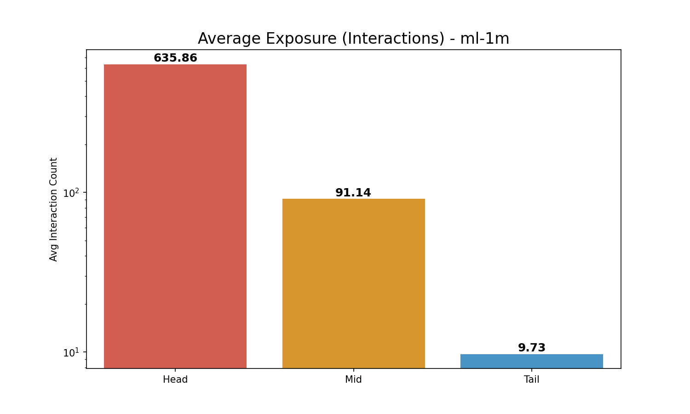
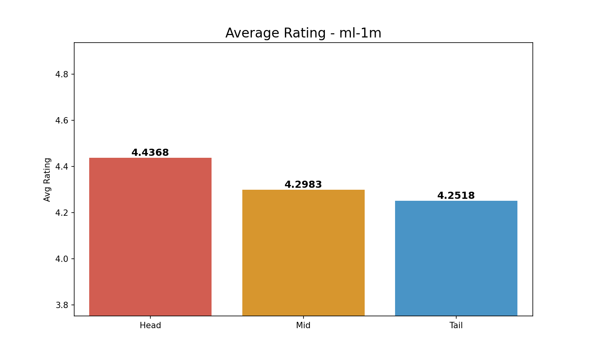

# Comprehensive Long-Tail Analysis (3-Group): ml-1m

**Split Criteria**:

- **Head (Top 20%)**: 625 items

- **Mid (Middle 60%)**: 1875 items

- **Tail (Bottom 20%)**: 625 items

## 1. Exposure (Interaction Count) Analysis

| Group   |   Avg Exposure |   Total Interactions |
|:--------|---------------:|---------------------:|
| Head    |       635.861  |               397413 |
| Mid     |        91.1376 |               170883 |
| Tail    |         9.728  |                 6080 |

> **Insight**: Head items (Top 20%) account for **69.2%** of all interactions.

## 2. Rating Analysis

| Group   |   Avg Rating |
|:--------|-------------:|
| Head    |      4.43675 |
| Mid     |      4.29827 |
| Tail    |      4.25181 |

*Average Exposure Comparison*

*Average Rating Comparison*
