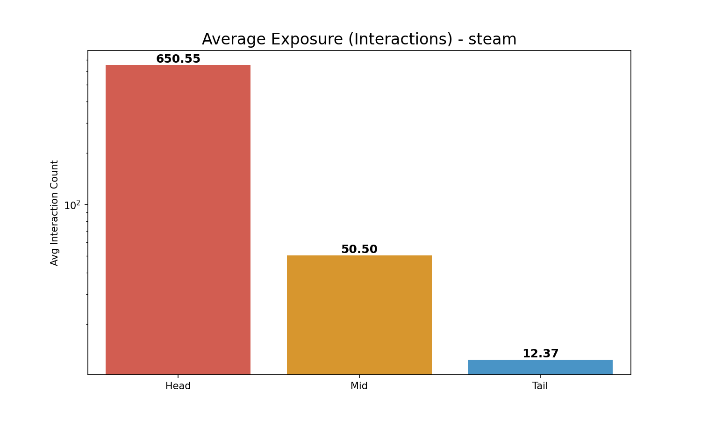
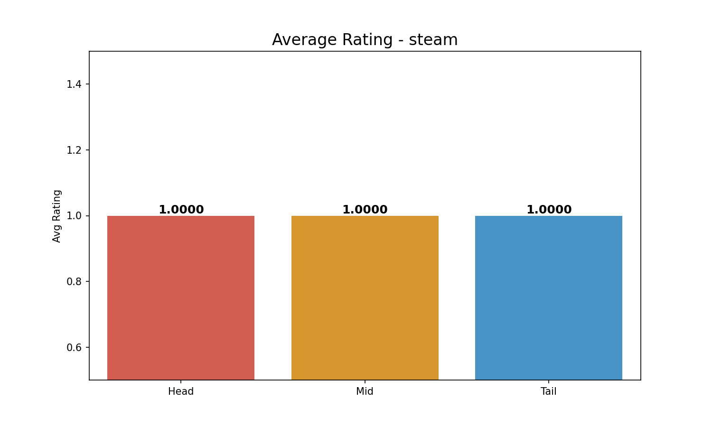

# Comprehensive Long-Tail Analysis (3-Group): steam

**Split Criteria**:

- **Head (Top 20%)**: 1179 items

- **Mid (Middle 60%)**: 3540 items

- **Tail (Bottom 20%)**: 1180 items

## 1. Exposure (Interaction Count) Analysis

| Group   |   Avg Exposure |   Total Interactions |
|:--------|---------------:|---------------------:|
| Head    |        650.554 |               767003 |
| Mid     |         50.496 |               178756 |
| Tail    |         12.372 |                14599 |

> **Insight**: Head items (Top 20%) account for **79.9%** of all interactions.

## 2. Rating Analysis

| Group   |   Avg Rating |
|:--------|-------------:|
| Head    |            1 |
| Mid     |            1 |
| Tail    |            1 |

*Average Exposure Comparison*

*Average Rating Comparison*
