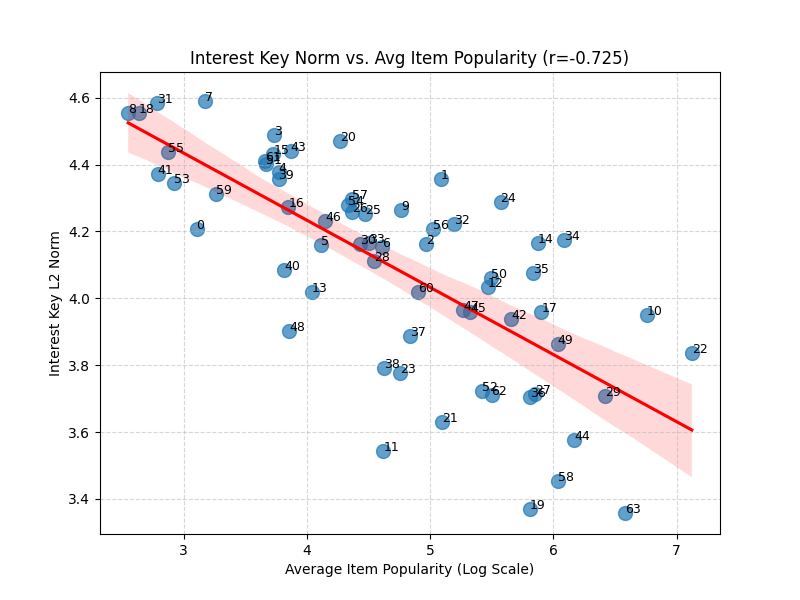

# Deep Semantic Analysis: csar-bpr__negative_sampling_strategy=popularity

### Interest #0 Deep Analysis

- **Key Norm:** `4.2066`

**Top 20 Items**

|   Rank | Title                                                       |   Year | Genres          | Director              |   Weight |
|-------:|:------------------------------------------------------------|-------:|:----------------|:----------------------|---------:|
|      1 | Goya in Bordeaux (Goya en Bodeos)                           |   1999 | Drama           |                       |   4.1062 |
|      2 | Fire Within, The (Le Feu Follet)                            |   1963 | Drama           | Louis Malle           |   3.9643 |
|      3 | Mirror, The (Zerkalo)                                       |   1975 | Drama           | Andrei Tarkovsky      |   3.9279 |
|      4 | I Stand Alone (Seul contre tous)                            |   1998 | Drama           | Gaspar Noé            |   3.8835 |
|      5 | Butterfly (La Lengua de las Mariposas)                      |   2000 | Drama, War      | José Luis Cuerda      |   3.869  |
|      6 | Solas                                                       |   1999 | Drama           | Benito Zambrano       |   3.8509 |
|      7 | Late August, Early September (Fin août, début septembre)    |   1998 | Drama           | Olivier Assayas       |   3.7204 |
|      8 | East-West (Est-ouest)                                       |   1999 | Drama, Romance  | Régis Wargnier        |   3.7086 |
|      9 | Seventh Heaven (Le Septième ciel)                           |   1997 | Drama, Romance  | Jean-Paul Lilienfeld  |   3.6784 |
|     10 | Freedom for Us (À nous la liberté )                         |   1931 | Comedy          | René Clair            |   3.6772 |
|     11 | Saragossa Manuscript, The (Rekopis znaleziony w Saragossie) |   1965 | Drama           | Wojciech Jerzy Has    |   3.6689 |
|     12 | Eternity and a Day (Mia eoniotita ke mia mera )             |   1998 | Drama           | Theo Angelopoulos     |   3.6335 |
|     13 | Urbania                                                     |   2000 | Drama           | Flávio Frederico      |   3.6274 |
|     14 | World of Apu, The (Apur Sansar)                             |   1959 | Drama           | Satyajit Ray          |   3.6255 |
|     15 | Other Side of Sunday, The (Søndagsengler)                   |   1996 | Comedy, Drama   | Berit Nesheim         |   3.6221 |
|     16 | Three Ages, The                                             |   1923 | Comedy          | Luan Monteiro de Lima |   3.5766 |
|     17 | Black Cat, White Cat (Crna macka, beli macor)               |   1998 | Comedy, Romance | Emir Kusturica        |   3.5086 |
|     18 | Shower (Xizhao)                                             |   1999 | Comedy          |                       |   3.4438 |
|     19 | Not One Less (Yi ge dou bu neng shao)                       |   1999 | Drama           | Zhang Yimou           |   3.3825 |
|     20 | Terrorist, The (Malli)                                      |   1998 | Drama           |                       |   3.38   |

**Significant Genres (p<0.05)**

| Feature   |   Count | Lift   |   p-value |
|:----------|--------:|:-------|----------:|
| Drama     |      16 | 2.6x   |         0 |

**Significant Keywords (p<0.05)**

| Feature   |   Count | Lift   |   p-value |
|:----------|--------:|:-------|----------:|
| teacher   |       3 | 17.0x  |         0 |

#### Qualitative Summary

Interest #0 captures ****Drama** genre, related to **'teacher'****.

### Interest #1 Deep Analysis

- **Key Norm:** `4.3564`

**Top 20 Items**

|   Rank | Title                                      |   Year | Genres               | Director           |   Weight |
|-------:|:-------------------------------------------|-------:|:---------------------|:-------------------|---------:|
|      1 | Star Trek IV: The Voyage Home              |   1986 | Action, Adventure    | Leonard Nimoy      |   3.2964 |
|      2 | Star Trek: The Wrath of Khan               |   1982 | Action, Adventure    | Nicholas Meyer     |   3.0749 |
|      3 | Star Trek III: The Search for Spock        |   1984 | Action, Adventure    | Leonard Nimoy      |   2.857  |
|      4 | Suburbans, The                             |   1999 | Drama                | Donal Lardner Ward |   2.6714 |
|      5 | Star Trek VI: The Undiscovered Country     |   1991 | Action, Adventure    | Nicholas Meyer     |   2.6087 |
|      6 | Who Framed Roger Rabbit?                   |   1988 | Adventure, Animation | Robert Zemeckis    |   2.5788 |
|      7 | Commandments                               |   1997 | Romance              | Daniel Taplitz     |   2.5387 |
|      8 | Live Flesh                                 |   1997 | Drama                | Pedro Almodóvar    |   2.5133 |
|      9 | Mating Habits of the Earthbound Human, The |   1998 | Comedy               | Jeff Abugov        |   2.503  |
|     10 | Blade Runner                               |   1982 | Film-Noir, Sci-Fi    | Ridley Scott       |   2.4816 |
|     11 | Threesome                                  |   1994 | Comedy, Romance      | Andrew Fleming     |   2.3975 |
|     12 | Mina Tannenbaum                            |   1994 | Drama                | Martine Dugowson   |   2.3477 |
|     13 | Star Trek: Generations                     |   1994 | Action, Adventure    | David Carson       |   2.3268 |
|     14 | Last Resort                                |   1994 | Comedy               | Paweł Pawlikowski  |   2.3098 |
|     15 | Native Son                                 |   1986 | Drama                | Jerrold Freedman   |   2.2711 |
|     16 | Star Trek V: The Final Frontier            |   1989 | Action, Adventure    | William Shatner    |   2.2567 |
|     17 | Hugo Pool                                  |   1997 | Romance              | Robert Downey Sr.  |   2.2421 |
|     18 | Back to the Future                         |   1985 | Comedy, Sci-Fi       | Robert Zemeckis    |   2.2313 |
|     19 | Savage Nights (Nuits fauves, Les)          |   1992 | Drama                | Cyril Collard      |   2.1733 |
|     20 | Airplane!                                  |   1980 | Comedy               | Jerry Zucker       |   2.1696 |

**Significant Genres (p<0.05)**

| Feature   |   Count | Lift   |   p-value |
|:----------|--------:|:-------|----------:|
| Sci-Fi    |       8 | 5.0x   |    0      |
| Adventure |       7 | 4.3x   |    0.0001 |
| Film-Noir |       2 | 7.9x   |    0.0129 |

**Significant Decades (p<0.05)**

|   Feature |   Count | Lift   |   p-value |
|----------:|--------:|:-------|----------:|
|      1980 |       9 | 2.9x   |    0.0008 |

**Significant Directors (p<0.05)**

| Feature         |   Count | Lift   |   p-value |
|:----------------|--------:|:-------|----------:|
| Leonard Nimoy   |       2 | 190.4x |         0 |
| Nicholas Meyer  |       2 | 127.0x |         0 |
| Robert Zemeckis |       2 | 38.1x  |         0 |

**Significant Cast (p<0.05)**

| Feature         |   Count | Lift   |   p-value |
|:----------------|--------:|:-------|----------:|
| William Shatner |       5 | 133.2x |         0 |
| Leonard Nimoy   |       4 | 124.3x |         0 |
| DeForest Kelley |       5 | 133.2x |         0 |
| James Doohan    |       5 | 133.2x |         0 |
| George Takei    |       3 | 139.9x |         0 |

**Significant Keywords (p<0.05)**

| Feature          |   Count | Lift   |   p-value |
|:-----------------|--------:|:-------|----------:|
| spacecraft       |       6 | 28.5x  |         0 |
| teleportation    |       6 | 52.8x  |         0 |
| starship         |       6 | 74.0x  |         0 |
| uss enterprise-a |       3 | 123.3x |         0 |
| space opera      |       6 | 33.6x  |         0 |

#### Qualitative Summary

Interest #1 captures **films by **Leonard Nimoy**, **Sci-Fi** genre, from the **1980s**, related to **'spacecraft'****.

### Interest #2 Deep Analysis

- **Key Norm:** `4.1629`

**Top 20 Items**

|   Rank | Title                                               |   Year | Genres                | Director                 |   Weight |
|-------:|:----------------------------------------------------|-------:|:----------------------|:-------------------------|---------:|
|      1 | Friday the 13th: The Final Chapter                  |   1984 | Horror                | Joseph Zito              |   3.3936 |
|      2 | Garbage Pail Kids Movie, The                        |   1987 | Adventure, Children's | Rod Amateau              |   3.2964 |
|      3 | Friday the 13th Part V: A New Beginning             |   1985 | Horror                | Danny Steinmann          |   3.1946 |
|      4 | Halloween 5: The Revenge of Michael Myers           |   1989 | Horror                | Dominique Othenin-Girard |   2.9269 |
|      5 | Nightmare on Elm Street 5: The Dream Child, A       |   1989 | Horror                | Stephen Hopkins          |   2.8954 |
|      6 | Friday the 13th Part VII: The New Blood             |   1988 | Horror                | John Carl Buechler       |   2.8857 |
|      7 | Friday the 13th Part VI: Jason Lives                |   1986 | Horror                | Tom McLoughlin           |   2.8809 |
|      8 | Friday the 13th Part 3: 3D                          |   1982 | Horror                | Steve Miner              |   2.8088 |
|      9 | Nightmare on Elm Street 3: Dream Warriors, A        |   1987 | Horror                | Chuck Russell            |   2.7017 |
|     10 | Nightmare on Elm Street Part 2: Freddy's Revenge, A |   1985 | Horror                | Jack Sholder             |   2.6714 |
|     11 | Iron Eagle II                                       |   1988 | Action, War           | Sidney J. Furie          |   2.5216 |
|     12 | Psycho III                                          |   1986 | Horror, Thriller      | Anthony Perkins          |   2.4226 |
|     13 | Halloween 4: The Return of Michael Myers            |   1988 | Horror                | Dwight H. Little         |   2.4171 |
|     14 | Friday the 13th Part 2                              |   1981 | Horror                | Steve Miner              |   2.3849 |
|     15 | Puppet Master 4                                     |   1993 | Horror, Sci-Fi        | Jeff Burr                |   2.3277 |
|     16 | Gumby: The Movie                                    |   1995 | Animation, Children's | Art Clokey               |   2.3081 |
|     17 | Rambo: First Blood Part II                          |   1985 | Action, War           | George P. Cosmatos       |   2.3053 |
|     18 | Sesame Street Presents Follow That Bird             |   1985 | Children's, Comedy    | Ken Kwapis               |   2.278  |
|     19 | Schindler's List                                    |   1993 | Drama, War            | Steven Spielberg         |   2.2724 |
|     20 | Rambo III                                           |   1988 | Action, War           | Peter MacDonald          |   2.2673 |

**Significant Genres (p<0.05)**

| Feature   |   Count | Lift   |   p-value |
|:----------|--------:|:-------|----------:|
| Horror    |      13 | 8.1x   |    0      |
| War       |       4 | 6.0x   |    0.0005 |

**Significant Decades (p<0.05)**

|   Feature |   Count | Lift   |   p-value |
|----------:|--------:|:-------|----------:|
|      1980 |      17 | 5.5x   |         0 |

**Significant Directors (p<0.05)**

| Feature     |   Count | Lift   |   p-value |
|:------------|--------:|:-------|----------:|
| Steve Miner |       2 | 54.4x  |         0 |

**Significant Cast (p<0.05)**

| Feature        |   Count | Lift   |   p-value |
|:---------------|--------:|:-------|----------:|
| Robert Englund |       3 | 62.2x  |         0 |

**Significant Keywords (p<0.05)**

| Feature             |   Count | Lift   |   p-value |
|:--------------------|--------:|:-------|----------:|
| lake                |       3 | 34.3x  |         0 |
| nightmare           |       3 | 16.2x  |         0 |
| evil                |       3 | 14.7x  |         0 |
| mask                |       3 | 23.7x  |         0 |
| supernatural horror |       8 | 34.3x  |         0 |

#### Qualitative Summary

Interest #2 captures **films by **Steve Miner**, **Horror** genre, from the **1980s**, related to **'lake'****.

### Interest #3 Deep Analysis

- **Key Norm:** `4.4875`

**Top 20 Items**

|   Rank | Title                                        |   Year | Genres                | Director             |   Weight |
|-------:|:---------------------------------------------|-------:|:----------------------|:---------------------|---------:|
|      1 | Parasite                                     |   1982 | Horror, Sci-Fi        | Charles Band         |   3.3724 |
|      2 | Sunset Strip                                 |   2000 | Comedy                | Adam Collis          |   3.0268 |
|      3 | Anatomy (Anatomie)                           |   2000 | Horror                | Justine Triet        |   2.746  |
|      4 | Niagara                                      |   1953 | Drama, Thriller       | Henry Hathaway       |   2.6987 |
|      5 | Ape, The                                     |   1940 | Horror, Sci-Fi        | William Nigh         |   2.6263 |
|      6 | Last Summer in the Hamptons                  |   1995 | Comedy, Drama         | Henry Jaglom         |   2.6228 |
|      7 | Blood Feast                                  |   1963 | Horror                | Marcel Walz          |   2.5162 |
|      8 | Shanghai Surprise                            |   1986 | Adventure             | Jim Goddard          |   2.47   |
|      9 | Surf Nazis Must Die                          |   1987 | Drama                 | Peter George         |   2.3901 |
|     10 | Death Wish II                                |   1982 | Action, Drama         | Michael Winner       |   2.3881 |
|     11 | Exorcist II: The Heretic                     |   1977 | Horror                | John Boorman         |   2.3769 |
|     12 | Killer (Bulletproof Heart)                   |   1994 | Thriller              | Mark Malone          |   2.3305 |
|     13 | Tingler, The                                 |   1959 | Horror                | William Castle       |   2.2916 |
|     14 | Faraway, So Close (In Weiter Ferne, So Nah!) |   1993 | Drama, Fantasy        | Wim Wenders          |   2.2717 |
|     15 | Alaska                                       |   1996 | Adventure, Children's | Fraser Clarke Heston |   2.2711 |
|     16 | Bride of Frankenstein                        |   1935 | Horror                | James Whale          |   2.2711 |
|     17 | Swamp Thing                                  |   1982 | Horror, Sci-Fi        | Wes Craven           |   2.2659 |
|     18 | Blob, The                                    |   1958 | Horror, Sci-Fi        | Chuck Russell        |   2.2621 |
|     19 | Switchblade Sisters                          |   1975 | Crime                 | Jack Hill            |   2.2581 |
|     20 | Barefoot Executive, The                      |   1971 | Children's, Comedy    | Susan Seidelman      |   2.2458 |

**Significant Genres (p<0.05)**

| Feature   |   Count | Lift   |   p-value |
|:----------|--------:|:-------|----------:|
| Horror    |       9 | 5.6x   |    0      |
| Sci-Fi    |       4 | 3.1x   |    0.0466 |

**Significant Keywords (p<0.05)**

| Feature   |   Count | Lift   |   p-value |
|:----------|--------:|:-------|----------:|
| 1970s     |       3 | 11.6x  |         0 |

#### Qualitative Summary

Interest #3 captures ****Horror** genre, related to **'1970s'****.

### Interest #4 Deep Analysis

- **Key Norm:** `4.3775`

**Top 20 Items**

|   Rank | Title                  |   Year | Genres          | Director             |   Weight |
|-------:|:-----------------------|-------:|:----------------|:---------------------|---------:|
|      1 | Pajama Party           |   1964 | Comedy          | Don Weis             |   2.8142 |
|      2 | Mummy, The             |   1959 | Horror          | Stephen Sommers      |   2.7831 |
|      3 | Tomb of Ligeia, The    |   1965 | Horror          | Roger Corman         |   2.7278 |
|      4 | Gnome-Mobile, The      |   1967 | Children's      | Robert Stevenson     |   2.6668 |
|      5 | Fighting Seabees, The  |   1944 | Action, Drama   | Edward Ludwig        |   2.6277 |
|      6 | Hamlet                 |   1964 | Drama           | Kenneth Branagh      |   2.5902 |
|      7 | Up at the Villa        |   2000 | Drama           | Philip Haas          |   2.588  |
|      8 | Mummy's Tomb, The      |   1942 | Horror          | Harold Young         |   2.5435 |
|      9 | Lawn Dogs              |   1997 | Drama           | John Duigan          |   2.5305 |
|     10 | Little Lord Fauntleroy |   1936 | Drama           | Jack Gold            |   2.4922 |
|     11 | Raise the Titanic      |   1980 | Drama, Thriller | Jerry Jameson        |   2.449  |
|     12 | Surviving Picasso      |   1996 | Drama           | James Ivory          |   2.4416 |
|     13 | Man from Laramie, The  |   1955 | Western         | Anthony Mann         |   2.4344 |
|     14 | Sandpiper, The         |   1965 | Drama, Romance  | Vincente Minnelli    |   2.4247 |
|     15 | Truman Show, The       |   1998 | Drama           | Peter Weir           |   2.4194 |
|     16 | Carpool                |   1996 | Comedy, Crime   | Arthur Hiller        |   2.4085 |
|     17 | White Christmas        |   1954 | Musical         | Michael Curtiz       |   2.3876 |
|     18 | 24-hour Woman          |   1998 | Drama           | Nancy Savoca         |   2.3776 |
|     19 | Conceiving Ada         |   1997 | Drama, Sci-Fi   | Lynn Hershman-Leeson |   2.3737 |
|     20 | Miracle on 34th Street |   1947 | Drama           | Les Mayfield         |   2.3712 |

**Significant Genres (p<0.05)**

| Feature   |   Count | Lift   |   p-value |
|:----------|--------:|:-------|----------:|
| Drama     |      12 | 1.8x   |    0.0234 |

**Significant Decades (p<0.05)**

|   Feature |   Count | Lift   |   p-value |
|----------:|--------:|:-------|----------:|
|      1960 |       5 | 5.1x   |    0.0003 |
|      1940 |       3 | 4.6x   |    0.0192 |

**Significant Keywords (p<0.05)**

| Feature    |   Count | Lift   |   p-value |
|:-----------|--------:|:-------|----------:|
| infidelity |       3 | 15.0x  |    0      |
| remake     |       3 | 6.9x   |    0.0017 |

#### Qualitative Summary

Interest #4 captures ****Drama** genre, from the **1960s**, related to **'infidelity'****.

### Interest #5 Deep Analysis

- **Key Norm:** `4.1599`

**Top 20 Items**

|   Rank | Title                                                         |   Year | Genres             | Director             |   Weight |
|-------:|:--------------------------------------------------------------|-------:|:-------------------|:---------------------|---------:|
|      1 | Killing of Sister George, The                                 |   1968 | Drama              | Robert Aldrich       |   3.339  |
|      2 | Mass Appeal                                                   |   1984 | Drama              | Glenn Jordan         |   2.9992 |
|      3 | Agnes Browne                                                  |   1999 | Comedy, Drama      | Anjelica Huston      |   2.9918 |
|      4 | Turtle Diary                                                  |   1985 | Drama              | John Irvin           |   2.9769 |
|      5 | Beans of Egypt, Maine, The                                    |   1994 | Drama              | Jennifer Warren      |   2.9186 |
|      6 | Man and a Woman, A (Un Homme et une Femme)                    |   1966 | Drama, Romance     | Dick Richards        |   2.8646 |
|      7 | They Shoot Horses, Don't They?                                |   1969 | Drama              | Sydney Pollack       |   2.8334 |
|      8 | Room at the Top                                               |   1959 | Drama              | Jack Clayton         |   2.8332 |
|      9 | Slipper and the Rose, The                                     |   1976 | Adventure, Musical | Bryan Forbes         |   2.8215 |
|     10 | Gypsy                                                         |   1962 | Musical            | Mervyn LeRoy         |   2.746  |
|     11 | 'Night Mother                                                 |   1986 | Drama              | Žarko Dragojević     |   2.7334 |
|     12 | Guys and Dolls                                                |   1955 | Musical            | Joseph L. Mankiewicz |   2.6851 |
|     13 | Last September, The                                           |   1999 | Drama              | Deborah Warner       |   2.6725 |
|     14 | Gigi                                                          |   1958 | Musical            | Vincente Minnelli    |   2.6662 |
|     15 | Garden of Finzi-Contini, The (Giardino dei Finzi-Contini, Il) |   1970 | Drama              | Vittorio De Sica     |   2.6631 |
|     16 | West Side Story                                               |   1961 | Musical, Romance   | Steven Spielberg     |   2.651  |
|     17 | Effect of Gamma Rays on Man-in-the-Moon Marigolds, The        |   1972 | Drama              | Paul Newman          |   2.6253 |
|     18 | Paris Is Burning                                              |   1990 | Documentary        | Jennie Livingston    |   2.6104 |
|     19 | Barry Lyndon                                                  |   1975 | Drama              | Stanley Kubrick      |   2.6008 |
|     20 | My Favorite Season                                            |   1993 | Drama              | Chen Kun-Hou         |   2.5934 |

**Significant Genres (p<0.05)**

| Feature   |   Count | Lift   |   p-value |
|:----------|--------:|:-------|----------:|
| Musical   |       5 | 11.2x  |    0      |
| Drama     |      14 | 2.2x   |    0.0008 |

**Significant Decades (p<0.05)**

|   Feature |   Count | Lift   |   p-value |
|----------:|--------:|:-------|----------:|
|      1960 |       5 | 5.1x   |    0.0003 |
|      1970 |       4 | 3.1x   |    0.0407 |

**Significant Keywords (p<0.05)**

| Feature                  |   Count | Lift   |   p-value |
|:-------------------------|--------:|:-------|----------:|
| based on play or musical |       4 | 8.7x   |    0      |
| musical                  |       4 | 6.5x   |    0.0002 |

#### Qualitative Summary

Interest #5 captures ****Musical** genre, from the **1960s**, related to **'based on play or musical'****.

### Interest #6 Deep Analysis

- **Key Norm:** `4.1532`

**Top 20 Items**

|   Rank | Title                                      |   Year | Genres            | Director              |   Weight |
|-------:|:-------------------------------------------|-------:|:------------------|:----------------------|---------:|
|      1 | Alan Smithee Film: Burn Hollywood Burn, An |   1997 | Comedy            | Alan Smithee          |   2.9607 |
|      2 | Being John Malkovich                       |   1999 | Comedy            | Spike Jonze           |   2.9171 |
|      3 | Belly                                      |   1998 | Crime, Drama      | Hype Williams         |   2.8508 |
|      4 | Castle, The                                |   1997 | Comedy            | Rob Sitch             |   2.7727 |
|      5 | Star Wars: Episode VI - Return of the Jedi |   1983 | Action, Adventure | Richard Marquand      |   2.6461 |
|      6 | Play it to the Bone                        |   1999 | Comedy, Drama     | Ron Shelton           |   2.5924 |
|      7 | Almost Heroes                              |   1998 | Adventure, Comedy | Christopher Guest     |   2.5525 |
|      8 | Time of the Gypsies (Dom za vesanje)       |   1989 | Drama             | Emir Kusturica        |   2.5407 |
|      9 | Henry: Portrait of a Serial Killer, Part 2 |   1996 | Crime, Horror     | Chuck Parello         |   2.5298 |
|     10 | Wrong Trousers, The                        |   1993 | Animation, Comedy | Nick Park             |   2.4894 |
|     11 | Man on the Moon                            |   1999 | Comedy, Drama     | Miloš Forman          |   2.4344 |
|     12 | Close Shave, A                             |   1995 | Animation, Comedy | Nick Park             |   2.4218 |
|     13 | Dirty Work                                 |   1998 | Comedy            | Bob Saget             |   2.4172 |
|     14 | Screwed                                    |   2000 | Comedy            | Scott Alexander       |   2.3944 |
|     15 | Acid House, The                            |   1998 | Comedy, Drama     | Paul McGuigan         |   2.3911 |
|     16 | Kids in the Hall: Brain Candy              |   1996 | Comedy            | Kelly Makin           |   2.3872 |
|     17 | Next Friday                                |   1999 | Comedy            | Steve Carr            |   2.3549 |
|     18 | Friday                                     |   1995 | Comedy            | F. Gary Gray          |   2.3486 |
|     19 | Quest, The                                 |   1996 | Action, Adventure | Jean-Claude Van Damme |   2.3261 |
|     20 | Gordy                                      |   1995 | Comedy            | Mark Lewis            |   2.3179 |

**Significant Genres (p<0.05)**

| Feature   |   Count | Lift   |   p-value |
|:----------|--------:|:-------|----------:|
| Comedy    |      15 | 2.4x   |    0.0003 |

**Significant Decades (p<0.05)**

|   Feature |   Count | Lift   |   p-value |
|----------:|--------:|:-------|----------:|
|      1990 |      17 | 1.4x   |    0.0308 |

**Significant Directors (p<0.05)**

| Feature   |   Count | Lift   |   p-value |
|:----------|--------:|:-------|----------:|
| Nick Park |       2 | 76.2x  |         0 |

**Significant Keywords (p<0.05)**

| Feature   |   Count | Lift   |   p-value |
|:----------|--------:|:-------|----------:|
| drugs     |       3 | 9.4x   |    0.0001 |

#### Qualitative Summary

Interest #6 captures **films by **Nick Park**, **Comedy** genre, from the **1990s**, related to **'drugs'****.

### Interest #7 Deep Analysis

- **Key Norm:** `4.5913`

**Top 20 Items**

|   Rank | Title                                           |   Year | Genres            | Director             |   Weight |
|-------:|:------------------------------------------------|-------:|:------------------|:---------------------|---------:|
|      1 | Stranger in the House                           |   1997 | Thriller          | Pierre Rouve         |   3.0977 |
|      2 | Cousin Bette                                    |   1998 | Comedy            | Des McAnuff          |   2.8758 |
|      3 | Dear Diary (Caro Diario)                        |   1994 | Comedy, Drama     | Nanni Moretti        |   2.8563 |
|      4 | Twice Upon a Yesterday                          |   1998 | Comedy, Drama     | María Ripoll         |   2.7911 |
|      5 | Grandfather, The (El Abuelo)                    |   1998 | Drama             | Gustavo Saavedra     |   2.7629 |
|      6 | Losing Chase                                    |   1996 | Drama             | Kevin Bacon          |   2.755  |
|      7 | Anatomy (Anatomie)                              |   2000 | Horror            | Justine Triet        |   2.721  |
|      8 | Wallace & Gromit: The Best of Aardman Animation |   1996 | Animation         | Luis Cook            |   2.6821 |
|      9 | Deadtime Stories                                |   1987 | Horror            | Michael Dougherty    |   2.6571 |
|     10 | Wrong Trousers, The                             |   1993 | Animation, Comedy | Nick Park            |   2.6559 |
|     11 | Germinal                                        |   1993 | Drama             | Yves Allégret        |   2.6457 |
|     12 | Nosferatu a Venezia                             |   1986 | Horror            | Augusto Caminito     |   2.581  |
|     13 | Love Is the Devil                               |   1998 | Drama             | John Maybury         |   2.5667 |
|     14 | Rendezvous in Paris (Rendez-vous de Paris, Les) |   1995 | Comedy, Romance   | Éric Rohmer          |   2.5459 |
|     15 | Firelight                                       |   1997 | Drama             | William Nicholson    |   2.5456 |
|     16 | Slingshot, The (Kådisbellan )                   |   1993 | Comedy, Drama     | Åke Sandgren         |   2.5402 |
|     17 | Widows' Peak                                    |   1994 | Drama             | John Irvin           |   2.5392 |
|     18 | Best of the Best 3: No Turning Back             |   1995 | Action            | Phillip Rhee         |   2.5384 |
|     19 | Go Now                                          |   1995 | Drama             | Michael Winterbottom |   2.5286 |
|     20 | Crimson Pirate, The                             |   1952 | Adventure, Comedy | Robert Siodmak       |   2.5172 |

#### Qualitative Summary

Interest #7 shows specific preferences.

### Interest #8 Deep Analysis

- **Key Norm:** `4.5546`

**Top 20 Items**

|   Rank | Title                                            |   Year | Genres           | Director            |   Weight |
|-------:|:-------------------------------------------------|-------:|:-----------------|:--------------------|---------:|
|      1 | Passion in the Desert                            |   1998 | Adventure, Drama | Lavinia Currier     |   3.4519 |
|      2 | Ripe                                             |   1996 | Drama            | Mo Ogrodnik         |   3.337  |
|      3 | Niagara, Niagara                                 |   1997 | Drama            | Oleksandr Vizyr     |   3.3254 |
|      4 | Story of Xinghua, The                            |   1993 | Drama            | Yin Li              |   3.2859 |
|      5 | Shopping                                         |   1994 | Action, Thriller | Paul W. S. Anderson |   3.2817 |
|      6 | Grandview, U.S.A.                                |   1984 | Drama            | Randal Kleiser      |   3.129  |
|      7 | Carried Away                                     |   1996 | Drama, Romance   | Tom Huckabee        |   3.1045 |
|      8 | Boys Life 2                                      |   1997 | Drama            | Mark Christopher    |   3.0638 |
|      9 | Federal Hill                                     |   1994 | Drama            | Michael Corrente    |   3.0573 |
|     10 | Faithful                                         |   1996 | Comedy           | D.W. Griffith       |   3.0387 |
|     11 | Black Tar Heroin: The Dark End of the Street     |   1999 | Documentary      | Steven Okazaki      |   2.9712 |
|     12 | Hugo Pool                                        |   1997 | Romance          | Robert Downey Sr.   |   2.8021 |
|     13 | Dream With the Fishes                            |   1997 | Drama            | Finn Taylor         |   2.7903 |
|     14 | Flower of My Secret, The (La Flor de Mi Secreto) |   1995 | Drama            | Pedro Almodóvar     |   2.7722 |
|     15 | Shattered Image                                  |   1998 | Drama, Thriller  | Raúl Ruiz           |   2.7693 |
|     16 | My Best Fiend (Mein liebster Feind)              |   1999 | Documentary      | Werner Herzog       |   2.7342 |
|     17 | Safe Men                                         |   1998 | Comedy           | John Hamburg        |   2.7303 |
|     18 | Female Perversions                               |   1996 | Drama            | Susan Streitfeld    |   2.7289 |
|     19 | Big Squeeze, The                                 |   1996 | Comedy, Drama    | Sam Black           |   2.7228 |
|     20 | Lulu on the Bridge                               |   1998 | Drama, Mystery   | Paul Auster         |   2.71   |

**Significant Genres (p<0.05)**

| Feature   |   Count | Lift   |   p-value |
|:----------|--------:|:-------|----------:|
| Drama     |      14 | 2.1x   |    0.0027 |

**Significant Decades (p<0.05)**

|   Feature |   Count | Lift   |   p-value |
|----------:|--------:|:-------|----------:|
|      1990 |      19 | 1.6x   |    0.0021 |

**Significant Keywords (p<0.05)**

| Feature        |   Count | Lift   |   p-value |
|:---------------|--------:|:-------|----------:|
| woman director |       3 | 4.6x   |    0.0214 |

#### Qualitative Summary

Interest #8 captures ****Drama** genre, from the **1990s**, related to **'woman director'****.

### Interest #9 Deep Analysis

- **Key Norm:** `4.2644`

**Top 20 Items**

|   Rank | Title                                               |   Year | Genres            | Director          |   Weight |
|-------:|:----------------------------------------------------|-------:|:------------------|:------------------|---------:|
|      1 | In Old California                                   |   1942 | Western           | D.W. Griffith     |   3.0288 |
|      2 | Pal Joey                                            |   1957 | Comedy, Musical   | George Sidney     |   2.7029 |
|      3 | Moonstruck                                          |   1987 | Comedy            | Norman Jewison    |   2.5481 |
|      4 | My Favorite Year                                    |   1982 | Comedy            | Richard Benjamin  |   2.5141 |
|      5 | Outlaw, The                                         |   1943 | Western           | Howard Hughes     |   2.4341 |
|      6 | Damsel in Distress, A                               |   1937 | Comedy, Musical   | George Stevens    |   2.412  |
|      7 | And God Created Woman (Et Dieu&#8230;Créa la Femme) |   1956 | Drama             |                   |   2.3961 |
|      8 | On the Town                                         |   1949 | Musical           | Christopher Swann |   2.3892 |
|      9 | Inspector General, The                              |   1949 | Musical           | Henry Koster      |   2.3857 |
|     10 | King in New York, A                                 |   1957 | Comedy, Drama     | Charlie Chaplin   |   2.3807 |
|     11 | Victor/Victoria                                     |   1982 | Comedy, Musical   | Blake Edwards     |   2.3525 |
|     12 | Ruthless People                                     |   1986 | Comedy            | David Zucker      |   2.2752 |
|     13 | Vibes                                               |   1988 | Adventure, Comedy | Ken Kwapis        |   2.2671 |
|     14 | Clara's Heart                                       |   1988 | Drama             | Robert Mulligan   |   2.2589 |
|     15 | Little Big Man                                      |   1970 | Comedy, Drama     | Arthur Penn       |   2.2572 |
|     16 | Popeye                                              |   1980 | Adventure, Comedy | Robert Altman     |   2.2467 |
|     17 | Spiral Staircase, The                               |   1946 | Thriller          | Peter Collinson   |   2.2374 |
|     18 | Fish Called Wanda, A                                |   1988 | Comedy            | Charles Crichton  |   2.2351 |
|     19 | Going My Way                                        |   1944 | Comedy            | Leo McCarey       |   2.2343 |
|     20 | Prizzi's Honor                                      |   1985 | Comedy, Drama     | John Huston       |   2.2335 |

**Significant Genres (p<0.05)**

| Feature   |   Count | Lift   |   p-value |
|:----------|--------:|:-------|----------:|
| Musical   |       6 | 10.2x  |    0      |
| Western   |       3 | 8.6x   |    0.0003 |
| Comedy    |      13 | 2.1x   |    0.0047 |

**Significant Decades (p<0.05)**

|   Feature |   Count | Lift   |   p-value |
|----------:|--------:|:-------|----------:|
|      1940 |       6 | 9.2x   |    0      |
|      1980 |       9 | 2.9x   |    0.0008 |

**Significant Keywords (p<0.05)**

| Feature         |   Count | Lift   |   p-value |
|:----------------|--------:|:-------|----------:|
| black and white |       4 | 6.3x   |    0.0003 |
| musical         |       3 | 6.1x   |    0.0039 |

#### Qualitative Summary

Interest #9 captures ****Musical** genre, from the **1940s**, related to **'black and white'****.

### Interest #10 Deep Analysis

- **Key Norm:** `3.9509`

**Top 20 Items**

|   Rank | Title                                      |   Year | Genres                | Director             |   Weight |
|-------:|:-------------------------------------------|-------:|:----------------------|:---------------------|---------:|
|      1 | Jurassic Park                              |   1993 | Action, Adventure     | Steven Spielberg     |   2.781  |
|      2 | Hunt for Red October, The                  |   1990 | Action, Thriller      | John McTiernan       |   2.7204 |
|      3 | Spy Who Loved Me, The                      |   1977 | Action                | Lewis Gilbert        |   2.6506 |
|      4 | Dr. No                                     |   1962 | Action                | Terence Young        |   2.6378 |
|      5 | Fugitive, The                              |   1993 | Action, Thriller      | Andrew Davis         |   2.4191 |
|      6 | From Russia with Love                      |   1963 | Action                | Terence Young        |   2.4082 |
|      7 | Man with the Golden Gun, The               |   1974 | Action                | Guy Hamilton         |   2.3983 |
|      8 | Patriot Games                              |   1992 | Action, Thriller      | Phillip Noyce        |   2.3484 |
|      9 | Star Wars: Episode VI - Return of the Jedi |   1983 | Action, Adventure     | Richard Marquand     |   2.3263 |
|     10 | Goldfinger                                 |   1964 | Action                | Guy Hamilton         |   2.3263 |
|     11 | Total Recall                               |   1990 | Action, Adventure     | Paul Verhoeven       |   2.3154 |
|     12 | Cinderella                                 |   1950 | Animation, Children's | Kay Cannon           |   2.2449 |
|     13 | Thunderball                                |   1965 | Action                | Terence Young        |   2.2366 |
|     14 | For Your Eyes Only                         |   1981 | Action                | John Glen            |   2.2221 |
|     15 | Lethal Weapon                              |   1987 | Action, Comedy        | Richard Donner       |   2.2063 |
|     16 | See the Sea (Regarde la mer)               |   1997 | Drama                 | François Ozon        |   2.1409 |
|     17 | Indiana Jones and the Last Crusade         |   1989 | Action, Adventure     | Steven Spielberg     |   2.1244 |
|     18 | Godfather, The                             |   1972 | Action, Crime         | Francis Ford Coppola |   2.1242 |
|     19 | Thelma & Louise                            |   1991 | Action, Drama         | Léni Mérat           |   2.1148 |
|     20 | Close Encounters of the Third Kind         |   1977 | Drama, Sci-Fi         | Steven Spielberg     |   2.1114 |

**Significant Genres (p<0.05)**

| Feature   |   Count | Lift   |   p-value |
|:----------|--------:|:-------|----------:|
| Action    |      17 | 5.2x   |         0 |

**Significant Decades (p<0.05)**

|   Feature |   Count | Lift   |   p-value |
|----------:|--------:|:-------|----------:|
|      1960 |       4 | 4.1x   |    0.0091 |
|      1970 |       4 | 3.1x   |    0.0407 |

**Significant Directors (p<0.05)**

| Feature          |   Count | Lift   |   p-value |
|:-----------------|--------:|:-------|----------:|
| Steven Spielberg |       3 | 47.6x  |         0 |
| Terence Young    |       3 | 142.8x |         0 |
| Guy Hamilton     |       2 | 95.2x  |         0 |

**Significant Cast (p<0.05)**

| Feature       |   Count | Lift   |   p-value |
|:--------------|--------:|:-------|----------:|
| Sean Connery  |       6 | 49.1x  |         0 |
| Roger Moore   |       3 | 70.6x  |         0 |
| Harrison Ford |       4 | 35.9x  |         0 |

**Significant Keywords (p<0.05)**

| Feature                |   Count | Lift   |   p-value |
|:-----------------------|--------:|:-------|----------:|
| exotic island          |       3 | 22.4x  |         0 |
| secret organization    |       4 | 51.3x  |         0 |
| secret mission         |       4 | 35.9x  |         0 |
| excited                |       5 | 15.5x  |         0 |
| british secret service |       4 | 39.9x  |         0 |

#### Qualitative Summary

Interest #10 captures **films by **Steven Spielberg**, **Action** genre, from the **1960s**, related to **'exotic island'****.

### Interest #11 Deep Analysis

- **Key Norm:** `3.5445`

**Top 20 Items**

|   Rank | Title                                               |   Year | Genres           | Director               |   Weight |
|-------:|:----------------------------------------------------|-------:|:-----------------|:-----------------------|---------:|
|      1 | Halloween III: Season of the Witch                  |   1983 | Horror           | Tommy Lee Wallace      |   4.1892 |
|      2 | Friday the 13th Part VII: The New Blood             |   1988 | Horror           | John Carl Buechler     |   3.9175 |
|      3 | Howling, The                                        |   1980 | Horror           | Joe Dante              |   3.913  |
|      4 | Hell Night                                          |   1981 | Horror           | Tom DeSimone           |   3.8347 |
|      5 | Nightmare on Elm Street, A                          |   1984 | Horror           | Wes Craven             |   3.796  |
|      6 | Fog, The                                            |   1980 | Horror           | John Carpenter         |   3.7426 |
|      7 | Fright Night Part II                                |   1989 | Horror           | Tommy Lee Wallace      |   3.7306 |
|      8 | Rawhead Rex                                         |   1986 | Horror, Thriller | George Pavlou          |   3.6519 |
|      9 | Prom Night                                          |   1980 | Horror           | Nelson McCormick       |   3.6141 |
|     10 | Blood Beach                                         |   1981 | Action, Horror   | Jeffrey Bloom          |   3.6067 |
|     11 | Friday the 13th Part 2                              |   1981 | Horror           | Steve Miner            |   3.5883 |
|     12 | Deadly Friend                                       |   1986 | Horror           | Wes Craven             |   3.5799 |
|     13 | Prom Night IV: Deliver Us From Evil                 |   1992 | Horror           | Clay Borris            |   3.5551 |
|     14 | Halloween                                           |   1978 | Horror           | John Carpenter         |   3.5417 |
|     15 | Nightmare on Elm Street Part 2: Freddy's Revenge, A |   1985 | Horror           | Jack Sholder           |   3.523  |
|     16 | Halloween II                                        |   1981 | Horror           | Rob Zombie             |   3.5222 |
|     17 | Tales From the Crypt Presents: Demon Knight         |   1995 | Horror           | Ernest R. Dickerson    |   3.5049 |
|     18 | Wes Craven's New Nightmare                          |   1994 | Horror           | Wes Craven             |   3.4923 |
|     19 | Nightmare on Elm Street 3: Dream Warriors, A        |   1987 | Horror           | Chuck Russell          |   3.4904 |
|     20 | Two Thousand Maniacs!                               |   1964 | Horror           | Herschell Gordon Lewis |   3.4891 |

**Significant Genres (p<0.05)**

| Feature   |   Count | Lift   |   p-value |
|:----------|--------:|:-------|----------:|
| Horror    |      20 | 17.0x  |         0 |

**Significant Decades (p<0.05)**

|   Feature |   Count | Lift   |   p-value |
|----------:|--------:|:-------|----------:|
|      1980 |      15 | 4.9x   |         0 |

**Significant Directors (p<0.05)**

| Feature           |   Count | Lift   |   p-value |
|:------------------|--------:|:-------|----------:|
| Tommy Lee Wallace |       2 | 190.4x |         0 |
| Wes Craven        |       3 | 63.5x  |         0 |
| John Carpenter    |       2 | 42.3x  |         0 |

**Significant Cast (p<0.05)**

| Feature            |   Count | Lift   |   p-value |
|:-------------------|--------:|:-------|----------:|
| Heather Langenkamp |       3 | 186.5x |         0 |
| Robert Englund     |       4 | 82.9x  |         0 |

**Significant Keywords (p<0.05)**

| Feature       |   Count | Lift   |   p-value |
|:--------------|--------:|:-------|----------:|
| mask          |       3 | 31.1x  |         0 |
| disfigurement |       4 | 59.9x  |         0 |
| alcoholic     |       3 | 17.6x  |         0 |
| ohio          |       3 | 40.5x  |         0 |
| supernatural  |       4 | 16.9x  |         0 |

#### Qualitative Summary

Interest #11 captures **films by **Tommy Lee Wallace**, **Horror** genre, from the **1980s**, related to **'mask'****.

### Interest #12 Deep Analysis

- **Key Norm:** `4.0348`

**Top 20 Items**

|   Rank | Title                                    |   Year | Genres                | Director          |   Weight |
|-------:|:-----------------------------------------|-------:|:----------------------|:------------------|---------:|
|      1 | Fugitive, The                            |   1993 | Action, Thriller      | Andrew Davis      |   2.7473 |
|      2 | Firelight                                |   1997 | Drama                 | William Nicholson |   2.6034 |
|      3 | Meet the Deedles                         |   1998 | Children's, Comedy    | Steve Boyum       |   2.4161 |
|      4 | Air Force One                            |   1997 | Action, Thriller      | Wolfgang Petersen |   2.3709 |
|      5 | Clear and Present Danger                 |   1994 | Action, Adventure     | Phillip Noyce     |   2.3275 |
|      6 | Alien Escape                             |   1995 | Horror, Sci-Fi        | Scott Harris      |   2.3225 |
|      7 | Barney's Great Adventure                 |   1998 | Adventure, Children's | Steve Gomer       |   2.2972 |
|      8 | Air Bud: Golden Receiver                 |   1998 | Children's, Comedy    | Richard Martin    |   2.244  |
|      9 | Toy Story 2                              |   1999 | Animation, Children's | John Lasseter     |   2.2404 |
|     10 | Deep Impact                              |   1998 | Action, Drama         | Mimi Leder        |   2.2088 |
|     11 | Hunt for Red October, The                |   1990 | Action, Thriller      | John McTiernan    |   2.2055 |
|     12 | Thomas Crown Affair, The                 |   1999 | Action, Thriller      | Michael B. Jordan |   2.2047 |
|     13 | Enemy of the State                       |   1998 | Action, Thriller      | Tony Scott        |   2.1898 |
|     14 | Man of the House                         |   1995 | Comedy                | Stephen Herek     |   2.1806 |
|     15 | Homeward Bound II: Lost in San Francisco |   1996 | Adventure, Children's | David R. Ellis    |   2.1782 |
|     16 | Patriot Games                            |   1992 | Action, Thriller      | Phillip Noyce     |   2.1664 |
|     17 | Halloween: H20                           |   1998 | Horror, Thriller      | Steve Miner       |   2.1483 |
|     18 | Pokémon: The First Movie                 |   1998 | Animation, Children's | Kunihiko Yuyama   |   2.0832 |
|     19 | Peacemaker, The                          |   1997 | Action, Thriller      | Mimi Leder        |   2.0812 |
|     20 | Volcano                                  |   1997 | Drama, Thriller       | Mick Jackson      |   2.0688 |

**Significant Genres (p<0.05)**

| Feature    |   Count | Lift   |   p-value |
|:-----------|--------:|:-------|----------:|
| Thriller   |      11 | 3.3x   |    0      |
| Children's |       6 | 3.6x   |    0.0026 |
| Action     |       9 | 2.7x   |    0.0036 |

**Significant Decades (p<0.05)**

|   Feature |   Count | Lift   |   p-value |
|----------:|--------:|:-------|----------:|
|      1990 |      20 | 1.7x   |    0.0004 |

**Significant Directors (p<0.05)**

| Feature       |   Count | Lift   |   p-value |
|:--------------|--------:|:-------|----------:|
| Phillip Noyce |       2 | 63.5x  |         0 |
| Mimi Leder    |       2 | 190.4x |         0 |

**Significant Cast (p<0.05)**

| Feature         |   Count | Lift   |   p-value |
|:----------------|--------:|:-------|----------:|
| Harrison Ford   |       4 | 35.5x  |         0 |
| Tommy Lee Jones |       3 | 32.9x  |         0 |

**Significant Keywords (p<0.05)**

| Feature            |   Count | Lift   |   p-value |
|:-------------------|--------:|:-------|----------:|
| usa president      |       3 | 15.6x  |         0 |
| washington dc, usa |       3 | 16.2x  |         0 |
| jack ryan          |       3 | 135.3x |         0 |
| ex military        |       3 | 101.5x |         0 |
| political thriller |       3 | 81.2x  |         0 |

#### Qualitative Summary

Interest #12 captures **films by **Phillip Noyce**, **Thriller** genre, from the **1990s**, related to **'usa president'****.

### Interest #13 Deep Analysis

- **Key Norm:** `4.0182`

**Top 20 Items**

|   Rank | Title                                             |   Year | Genres           | Director             |   Weight |
|-------:|:--------------------------------------------------|-------:|:-----------------|:---------------------|---------:|
|      1 | Reservoir Dogs                                    |   1992 | Crime, Thriller  | Quentin Tarantino    |   3.1342 |
|      2 | Eighth Day, The (Le Huitième jour )               |   1996 | Drama            | Marcel Hanoun        |   3.0889 |
|      3 | Go Now                                            |   1995 | Drama            | Michael Winterbottom |   3.0452 |
|      4 | Seven (Se7en)                                     |   1995 | Crime, Thriller  | David Fincher        |   2.936  |
|      5 | Gridlock'd                                        |   1997 | Crime            | Vondie Curtis-Hall   |   2.9008 |
|      6 | Usual Suspects, The                               |   1995 | Crime, Thriller  | Bryan Singer         |   2.8319 |
|      7 | New Jersey Drive                                  |   1995 | Crime, Drama     | Nick Gomez           |   2.8277 |
|      8 | Higher Learning                                   |   1995 | Drama            | John Singleton       |   2.6931 |
|      9 | Enfer, L'                                         |   1994 | Drama            | Claude Chabrol       |   2.6519 |
|     10 | Professional, The (a.k.a. Leon: The Professional) |   1994 | Crime, Drama     |                      |   2.61   |
|     11 | Hate (Haine, La)                                  |   1995 | Drama            | Mathieu Kassovitz    |   2.5591 |
|     12 | Quiet Room, The                                   |   1996 | Drama            | Sam Wineman          |   2.5531 |
|     13 | Boys, The                                         |   1997 | Drama            | Rowan Woods          |   2.5513 |
|     14 | Loaded                                            |   1994 | Drama, Thriller  | Anna Campion         |   2.5411 |
|     15 | Twin Town                                         |   1997 | Comedy, Crime    | Kevin Allen          |   2.4892 |
|     16 | Trainspotting                                     |   1996 | Drama            | Danny Boyle          |   2.4637 |
|     17 | Go                                                |   1999 | Crime            | Doug Liman           |   2.4486 |
|     18 | Monument Ave.                                     |   1998 | Crime            | Ted Demme            |   2.4441 |
|     19 | Taffin                                            |   1988 | Action, Thriller | Francis Megahy       |   2.4412 |
|     20 | Star Maker, The (Uomo delle stelle, L')           |   1995 | Drama            | Giuseppe Tornatore   |   2.4121 |

**Significant Genres (p<0.05)**

| Feature   |   Count | Lift   |   p-value |
|:----------|--------:|:-------|----------:|
| Crime     |       9 | 9.1x   |     0     |
| Thriller  |       6 | 2.6x   |     0.028 |

**Significant Decades (p<0.05)**

|   Feature |   Count | Lift   |   p-value |
|----------:|--------:|:-------|----------:|
|      1990 |      19 | 1.6x   |    0.0021 |

**Significant Keywords (p<0.05)**

| Feature    |   Count | Lift   |   p-value |
|:-----------|--------:|:-------|----------:|
| psychopath |       3 | 11.0x  |     0     |
| police     |       3 | 6.8x   |     0.002 |

#### Qualitative Summary

Interest #13 captures ****Crime** genre, from the **1990s**, related to **'psychopath'****.

### Interest #14 Deep Analysis

- **Key Norm:** `4.1643`

**Top 20 Items**

|   Rank | Title                                          |   Year | Genres               | Director         |   Weight |
|-------:|:-----------------------------------------------|-------:|:---------------------|:-----------------|---------:|
|      1 | Batman & Robin                                 |   1997 | Action, Adventure    | Joel Schumacher  |   2.7882 |
|      2 | Star Wars: Episode IV - A New Hope             |   1977 | Action, Adventure    | George Lucas     |   2.5747 |
|      3 | Batman Forever                                 |   1995 | Action, Adventure    | Joel Schumacher  |   2.4919 |
|      4 | Star Wars: Episode I - The Phantom Menace      |   1999 | Action, Adventure    | George Lucas     |   2.4484 |
|      5 | In God's Hands                                 |   1998 | Action, Drama        | Zalman King      |   2.4369 |
|      6 | Star Wars: Episode V - The Empire Strikes Back |   1980 | Action, Adventure    | Irvin Kershner   |   2.4306 |
|      7 | Princess Caraboo                               |   1994 | Drama                | Michael Austin   |   2.3819 |
|      8 | Star Wars: Episode VI - Return of the Jedi     |   1983 | Action, Adventure    | Richard Marquand |   2.3796 |
|      9 | Who Framed Roger Rabbit?                       |   1988 | Adventure, Animation | Robert Zemeckis  |   2.376  |
|     10 | Mighty Peking Man (Hsing hsing wang)           |   1977 | Adventure, Sci-Fi    |                  |   2.2242 |
|     11 | Tommy                                          |   1975 | Drama, Musical       | Ken Russell      |   2.2003 |
|     12 | Mortal Kombat: Annihilation                    |   1997 | Action, Adventure    | John R. Leonetti |   2.1865 |
|     13 | Young Frankenstein                             |   1974 | Comedy, Horror       | Mel Brooks       |   2.1748 |
|     14 | Radioland Murders                              |   1994 | Comedy, Mystery      | Mel Smith        |   2.1509 |
|     15 | Phantom, The                                   |   1996 | Adventure            | B. Reeves Eason  |   2.1236 |
|     16 | Batman Returns                                 |   1992 | Action, Adventure    | Tim Burton       |   2.0887 |
|     17 | General, The                                   |   1927 | Comedy               | Clyde Bruckman   |   2.0648 |
|     18 | Running Man, The                               |   1987 | Action, Adventure    | Edgar Wright     |   1.9978 |
|     19 | Citizen Kane                                   |   1941 | Drama                | Orson Welles     |   1.9893 |
|     20 | Sullivan's Travels                             |   1942 | Comedy               | Preston Sturges  |   1.9738 |

**Significant Genres (p<0.05)**

| Feature   |   Count | Lift   |   p-value |
|:----------|--------:|:-------|----------:|
| Adventure |      12 | 5.1x   |    0      |
| Action    |      10 | 2.4x   |    0.0062 |
| Sci-Fi    |       6 | 2.6x   |    0.0288 |

**Significant Decades (p<0.05)**

|   Feature |   Count | Lift   |   p-value |
|----------:|--------:|:-------|----------:|
|      1970 |       4 | 3.1x   |    0.0407 |

**Significant Directors (p<0.05)**

| Feature         |   Count | Lift   |   p-value |
|:----------------|--------:|:-------|----------:|
| Joel Schumacher |       2 | 40.1x  |         0 |
| George Lucas    |       2 | 133.6x |         0 |

**Significant Cast (p<0.05)**

| Feature       |   Count | Lift   |   p-value |
|:--------------|--------:|:-------|----------:|
| Mark Hamill   |       3 | 117.8x |         0 |
| Harrison Ford |       3 | 28.0x  |         0 |
| Carrie Fisher |       3 | 65.4x  |         0 |

**Significant Keywords (p<0.05)**

| Feature          |   Count | Lift   |   p-value |
|:-----------------|--------:|:-------|----------:|
| superhero        |       4 | 13.7x  |         0 |
| based on comic   |       4 | 12.7x  |         0 |
| super power      |       4 | 22.3x  |         0 |
| good versus evil |       4 | 11.9x  |         0 |
| rebel            |       3 | 50.2x  |         0 |

#### Qualitative Summary

Interest #14 captures **films by **Joel Schumacher**, **Adventure** genre, from the **1970s**, related to **'superhero'****.

### Interest #15 Deep Analysis

- **Key Norm:** `4.4316`

**Top 20 Items**

|   Rank | Title                        |   Year | Genres               | Director                 |   Weight |
|-------:|:-----------------------------|-------:|:---------------------|:-------------------------|---------:|
|      1 | Fatal Attraction             |   1987 | Thriller             | Adrian Lyne              |   2.6139 |
|      2 | Tic Code, The                |   1998 | Drama                | Gary Winick              |   2.6112 |
|      3 | Opportunists, The            |   1999 | Crime                | Myles Connell            |   2.5528 |
|      4 | Lucie Aubrac                 |   1997 | Romance, War         | Claude Berri             |   2.4735 |
|      5 | Golden Earrings              |   1947 | Adventure, Romance   | Mitchell Leisen          |   2.4305 |
|      6 | Faust                        |   1994 | Animation, Comedy    | Aleksandr Sokurov        |   2.4221 |
|      7 | Woo                          |   1998 | Comedy, Romance      | Daisy von Scherler Mayer |   2.3899 |
|      8 | Native Son                   |   1986 | Drama                | Jerrold Freedman         |   2.3517 |
|      9 | Madonna: Truth or Dare       |   1991 | Documentary          | Alek Keshishian          |   2.2993 |
|     10 | Substance of Fire, The       |   1996 | Drama                | Daniel J. Sullivan       |   2.2645 |
|     11 | Gulliver's Travels           |   1939 | Adventure, Animation | Rob Letterman            |   2.2479 |
|     12 | Dersu Uzala                  |   1974 | Adventure, Drama     | Akira Kurosawa           |   2.226  |
|     13 | Getaway, The                 |   1994 | Action               | Roger Donaldson          |   2.2118 |
|     14 | On the Ropes                 |   1999 | Documentary          | Manon Nammour            |   2.1987 |
|     15 | Jupiter's Wife               |   1994 | Documentary          | Michel Negroponte        |   2.1772 |
|     16 | Deliverance                  |   1972 | Adventure, Thriller  | John Boorman             |   2.1475 |
|     17 | Grandfather, The (El Abuelo) |   1998 | Drama                | Gustavo Saavedra         |   2.1334 |
|     18 | Kronos                       |   1957 | Sci-Fi               | Kurt Neumann             |   2.1324 |
|     19 | Con Air                      |   1997 | Action, Adventure    | Simon West               |   2.1208 |
|     20 | Hitch-Hiker, The             |   1953 | Film-Noir            | Ida Lupino               |   2.115  |

**Significant Genres (p<0.05)**

| Feature     |   Count | Lift   |   p-value |
|:------------|--------:|:-------|----------:|
| Adventure   |       5 | 3.7x   |    0.0061 |
| Documentary |       3 | 4.9x   |    0.0149 |

#### Qualitative Summary

Interest #15 captures ****Adventure** genre**.

### Interest #16 Deep Analysis

- **Key Norm:** `4.2727`

**Top 20 Items**

|   Rank | Title                                 |   Year | Genres              | Director          |   Weight |
|-------:|:--------------------------------------|-------:|:--------------------|:------------------|---------:|
|      1 | White Balloon, The (Badkonake Sefid ) |   1995 | Drama               | Jafar Panahi      |   2.8862 |
|      2 | Return with Honor                     |   1998 | Documentary         | Terry Sanders     |   2.837  |
|      3 | Felicia's Journey                     |   1999 | Thriller            | Atom Egoyan       |   2.6512 |
|      4 | Leading Man, The                      |   1996 | Romance             |                   |   2.6463 |
|      5 | Jupiter's Wife                        |   1994 | Documentary         | Michel Negroponte |   2.6264 |
|      6 | Anne Frank Remembered                 |   1995 | Documentary         | Jon Blair         |   2.6068 |
|      7 | From the Journals of Jean Seberg      |   1995 | Documentary         | Mark Rappaport    |   2.6011 |
|      8 | Apple, The (Sib)                      |   1998 | Drama               | Samira Makhmalbaf |   2.5822 |
|      9 | Wings of the Dove, The                |   1997 | Drama, Romance      | Iain Softley      |   2.5786 |
|     10 | Adventures of Sebastian Cole, The     |   1998 | Comedy, Drama       | Tod Williams      |   2.5584 |
|     11 | Strangers on a Train                  |   1951 | Film-Noir, Thriller | Alfred Hitchcock  |   2.5584 |
|     12 | Straight Story, The                   |   1999 | Drama               | David Lynch       |   2.5092 |
|     13 | Trust                                 |   1990 | Comedy, Drama       | Carlson Young     |   2.5065 |
|     14 | Saint of Fort Washington, The         |   1993 | Drama               | Tim Hunter        |   2.4966 |
|     15 | Brandon Teena Story, The              |   1998 | Documentary         | Susan Muska       |   2.4806 |
|     16 | Dreaming of Joseph Lees               |   1998 | Romance             | Eric Styles       |   2.4793 |
|     17 | Wild Man Blues                        |   1998 | Documentary         | Barbara Kopple    |   2.4774 |
|     18 | Fast, Cheap & Out of Control          |   1997 | Documentary         | Errol Morris      |   2.4712 |
|     19 | Roommates                             |   1995 | Comedy, Drama       | Peter Yates       |   2.4696 |
|     20 | Shadow of a Doubt                     |   1943 | Film-Noir, Thriller | Karen Arthur      |   2.4645 |

**Significant Genres (p<0.05)**

| Feature     |   Count | Lift   |   p-value |
|:------------|--------:|:-------|----------:|
| Documentary |       7 | 13.1x  |    0      |
| Film-Noir   |       2 | 10.8x  |    0.0021 |

**Significant Decades (p<0.05)**

|   Feature |   Count | Lift   |   p-value |
|----------:|--------:|:-------|----------:|
|      1990 |      18 | 1.5x   |    0.0089 |

**Significant Keywords (p<0.05)**

| Feature        |   Count | Lift   |   p-value |
|:---------------|--------:|:-------|----------:|
| woman director |       5 | 6.3x   |         0 |

#### Qualitative Summary

Interest #16 captures ****Documentary** genre, from the **1990s**, related to **'woman director'****.

### Interest #17 Deep Analysis

- **Key Norm:** `3.9591`

**Top 20 Items**

|   Rank | Title                              |   Year | Genres            | Director         |   Weight |
|-------:|:-----------------------------------|-------:|:------------------|:-----------------|---------:|
|      1 | Jaws                               |   1975 | Action, Horror    | Steven Spielberg |   3.3999 |
|      2 | Alien                              |   1979 | Action, Horror    | Ridley Scott     |   3.3228 |
|      3 | Close Encounters of the Third Kind |   1977 | Drama, Sci-Fi     | Steven Spielberg |   2.9749 |
|      4 | Omen, The                          |   1976 | Horror            | John Moore       |   2.8168 |
|      5 | Carrie                             |   1976 | Horror            | Brian De Palma   |   2.8079 |
|      6 | Exorcist, The                      |   1973 | Horror            | William Friedkin |   2.6449 |
|      7 | Family Plot                        |   1976 | Comedy, Thriller  | Alfred Hitchcock |   2.4954 |
|      8 | Interiors                          |   1978 | Drama             | Woody Allen      |   2.4568 |
|      9 | American Beauty                    |   1999 | Comedy, Drama     | Sam Mendes       |   2.4498 |
|     10 | Clockwork Orange, A                |   1971 | Sci-Fi            | Stanley Kubrick  |   2.4295 |
|     11 | Autumn Sonata (Höstsonaten )       |   1978 | Drama             | Ingmar Bergman   |   2.3987 |
|     12 | Superman                           |   1978 | Action, Adventure | James Gunn       |   2.3724 |
|     13 | Barry Lyndon                       |   1975 | Drama             | Stanley Kubrick  |   2.3625 |
|     14 | Jaws 2                             |   1978 | Action, Horror    | Jeannot Szwarc   |   2.3463 |
|     15 | Falling in Love Again              |   1980 | Comedy            | Steven Paul      |   2.31   |
|     16 | Ice Storm, The                     |   1997 | Drama             | Ang Lee          |   2.3097 |
|     17 | Earthquake                         |   1974 | Action            | Mark Robson      |   2.2955 |
|     18 | Halloween                          |   1978 | Horror            | John Carpenter   |   2.2697 |
|     19 | Towering Inferno, The              |   1974 | Action, Drama     | John Guillermin  |   2.2638 |
|     20 | King Kong                          |   1976 | Action, Adventure | Peter Jackson    |   2.2385 |

**Significant Genres (p<0.05)**

| Feature   |   Count | Lift   |   p-value |
|:----------|--------:|:-------|----------:|
| Horror    |       8 | 4.5x   |    0      |
| Action    |       7 | 2.7x   |    0.0112 |

**Significant Decades (p<0.05)**

|   Feature |   Count | Lift   |   p-value |
|----------:|--------:|:-------|----------:|
|      1970 |      17 | 13.4x  |         0 |

**Significant Directors (p<0.05)**

| Feature          |   Count | Lift   |   p-value |
|:-----------------|--------:|:-------|----------:|
| Steven Spielberg |       2 | 31.7x  |         0 |
| Stanley Kubrick  |       2 | 34.6x  |         0 |

**Significant Keywords (p<0.05)**

| Feature                      |   Count | Lift   |   p-value |
|:-----------------------------|--------:|:-------|----------:|
| animal attack                |       3 | 19.0x  |    0      |
| mother daughter relationship |       3 | 14.0x  |    0      |
| creature                     |       3 | 7.0x   |    0.0015 |
| suspenseful                  |       3 | 4.9x   |    0.0147 |

#### Qualitative Summary

Interest #17 captures **films by **Steven Spielberg**, **Horror** genre, from the **1970s**, related to **'animal attack'****.

### Interest #18 Deep Analysis

- **Key Norm:** `4.5552`

**Top 20 Items**

|   Rank | Title                                                         |   Year | Genres          | Director               |   Weight |
|-------:|:--------------------------------------------------------------|-------:|:----------------|:-----------------------|---------:|
|      1 | Grosse Fatigue                                                |   1994 | Comedy          | Michel Blanc           |   3.1066 |
|      2 | Retro Puppetmaster                                            |   1999 | Horror, Sci-Fi  | David DeCoteau         |   3.0023 |
|      3 | Deadtime Stories                                              |   1987 | Horror          | Michael Dougherty      |   2.9079 |
|      4 | Coldblooded                                                   |   1995 | Action          | Wallace Wolodarsky     |   2.7414 |
|      5 | City of the Living Dead (Paura nella città dei morti viventi) |   1980 | Horror          | Lucio Fulci            |   2.7097 |
|      6 | Great Day in Harlem, A                                        |   1994 | Documentary     | Jean Bach              |   2.6081 |
|      7 | Cement Garden, The                                            |   1993 | Drama           | Andrew Birkin          |   2.6077 |
|      8 | Two Much                                                      |   1996 | Comedy, Romance | Fernando Trueba        |   2.6036 |
|      9 | Repossessed                                                   |   1990 | Comedy          | Bob Logan              |   2.5743 |
|     10 | Love Stinks                                                   |   1999 | Comedy          | Alicia K. Harris       |   2.4938 |
|     11 | Suburbans, The                                                |   1999 | Drama           | Donal Lardner Ward     |   2.4545 |
|     12 | Dadetown                                                      |   1995 | Documentary     | Russ Hexter            |   2.4438 |
|     13 | Black Cat, White Cat (Crna macka, beli macor)                 |   1998 | Comedy, Romance | Emir Kusturica         |   2.3983 |
|     14 | Human Traffic                                                 |   1999 | Drama           | Justin Kerrigan        |   2.3959 |
|     15 | Ed's Next Move                                                |   1996 | Comedy          | John C. Walsh          |   2.3851 |
|     16 | Oxygen                                                        |   1999 | Thriller        | Richard Shepard        |   2.3641 |
|     17 | I Love You, I Love You Not                                    |   1996 | Romance         | Billy Hopkins          |   2.3299 |
|     18 | Silent Fall                                                   |   1994 | Drama, Thriller | Bruce Beresford        |   2.3278 |
|     19 | Dorado, El                                                    |   1967 | Western         | William Atticus Parker |   2.301  |
|     20 | Dog of Flanders, A                                            |   1999 | Drama           | James B. Clark         |   2.2949 |

**Significant Decades (p<0.05)**

|   Feature |   Count | Lift   |   p-value |
|----------:|--------:|:-------|----------:|
|      1990 |      17 | 1.4x   |    0.0308 |

#### Qualitative Summary

Interest #18 captures **from the **1990s****.

### Interest #19 Deep Analysis

- **Key Norm:** `3.3703`

**Top 20 Items**

|   Rank | Title                                |   Year | Genres            | Director           |   Weight |
|-------:|:-------------------------------------|-------:|:------------------|:-------------------|---------:|
|      1 | For Your Eyes Only                   |   1981 | Action            | John Glen          |   3.0216 |
|      2 | View to a Kill, A                    |   1985 | Action            | John Glen          |   2.9985 |
|      3 | Indiana Jones and the Temple of Doom |   1984 | Action, Adventure | Steven Spielberg   |   2.8422 |
|      4 | Shooter, The                         |   1995 | Action            | Ted Kotcheff       |   2.8409 |
|      5 | Glimmer Man, The                     |   1996 | Action, Thriller  | John Gray          |   2.7942 |
|      6 | Mortal Kombat                        |   1995 | Action, Adventure | Simon McQuoid      |   2.7742 |
|      7 | Rocky III                            |   1982 | Action, Drama     | Sylvester Stallone |   2.7597 |
|      8 | Die Hard 2                           |   1990 | Action, Thriller  | Renny Harlin       |   2.711  |
|      9 | Rocky V                              |   1990 | Action, Drama     | Aki Kaurismäki     |   2.6582 |
|     10 | Death Wish 3                         |   1985 | Action, Drama     | Michael Winner     |   2.6454 |
|     11 | Die Hard: With a Vengeance           |   1995 | Action, Thriller  | John McTiernan     |   2.6387 |
|     12 | Bloodsport                           |   1988 | Action            | Newt Arnold        |   2.6313 |
|     13 | Live and Let Die                     |   1973 | Action            | Guy Hamilton       |   2.6256 |
|     14 | Indiana Jones and the Last Crusade   |   1989 | Action, Adventure | Steven Spielberg   |   2.615  |
|     15 | Under Siege                          |   1992 | Action            | Andrew Davis       |   2.6113 |
|     16 | Rocky II                             |   1979 | Action, Drama     | Pierre Bismuth     |   2.6049 |
|     17 | First Blood                          |   1982 | Action            | Ted Kotcheff       |   2.5966 |
|     18 | Licence to Kill                      |   1989 | Action            | John Glen          |   2.5939 |
|     19 | Star Trek IV: The Voyage Home        |   1986 | Action, Adventure | Leonard Nimoy      |   2.5604 |
|     20 | Marked for Death                     |   1990 | Action, Drama     | Dwight H. Little   |   2.5592 |

**Significant Genres (p<0.05)**

| Feature   |   Count | Lift   |   p-value |
|:----------|--------:|:-------|----------:|
| Action    |      20 | 7.7x   |         0 |

**Significant Decades (p<0.05)**

|   Feature |   Count | Lift   |   p-value |
|----------:|--------:|:-------|----------:|
|      1980 |      10 | 3.2x   |    0.0001 |

**Significant Directors (p<0.05)**

| Feature          |   Count | Lift   |   p-value |
|:-----------------|--------:|:-------|----------:|
| John Glen        |       3 | 142.8x |         0 |
| Steven Spielberg |       2 | 31.7x  |         0 |
| Ted Kotcheff     |       2 | 95.2x  |         0 |

**Significant Cast (p<0.05)**

| Feature       |   Count | Lift   |   p-value |
|:--------------|--------:|:-------|----------:|
| Roger Moore   |       3 | 69.9x  |         0 |
| Steven Seagal |       3 | 111.9x |         0 |

**Significant Keywords (p<0.05)**

| Feature                |   Count | Lift   |   p-value |
|:-----------------------|--------:|:-------|----------:|
| drug trafficking       |       3 | 41.8x  |         0 |
| british secret service |       3 | 32.5x  |         0 |
| helicopter             |       3 | 11.3x  |         0 |
| secret identity        |       3 | 16.3x  |         0 |
| riddle                 |       3 | 32.5x  |         0 |

#### Qualitative Summary

Interest #19 captures **films by **John Glen**, **Action** genre, from the **1980s**, related to **'drug trafficking'****.

### Interest #20 Deep Analysis

- **Key Norm:** `4.4699`

**Top 20 Items**

|   Rank | Title                            |   Year | Genres            | Director          |   Weight |
|-------:|:---------------------------------|-------:|:------------------|:------------------|---------:|
|      1 | Gothic                           |   1986 | Drama, Horror     | Ken Russell       |   2.5979 |
|      2 | Two Moon Juction                 |   1988 | Drama             |                   |   2.5599 |
|      3 | From the Journals of Jean Seberg |   1995 | Documentary       | Mark Rappaport    |   2.554  |
|      4 | Batman Returns                   |   1992 | Action, Adventure | Tim Burton        |   2.498  |
|      5 | Batman Forever                   |   1995 | Action, Adventure | Joel Schumacher   |   2.448  |
|      6 | Last Dance                       |   1996 | Drama             | Tony Markes       |   2.4088 |
|      7 | Gypsy                            |   1962 | Musical           | Mervyn LeRoy      |   2.3138 |
|      8 | Holy Smoke                       |   1999 | Drama             | Jane Campion      |   2.307  |
|      9 | Mary Reilly                      |   1996 | Drama, Thriller   | Stephen Frears    |   2.2706 |
|     10 | Great Locomotive Chase, The      |   1956 | Adventure, War    | Francis D. Lyon   |   2.2438 |
|     11 | House of Dracula                 |   1945 | Horror            | Erle C. Kenton    |   2.2104 |
|     12 | Newton Boys, The                 |   1998 | Crime, Drama      | Richard Linklater |   2.1743 |
|     13 | Postman Always Rings Twice, The  |   1981 | Crime, Thriller   | Bob Rafelson      |   2.1552 |
|     14 | Nénette et Boni                  |   1996 | Drama             | Claire Denis      |   2.1439 |
|     15 | Batman & Robin                   |   1997 | Action, Adventure | Joel Schumacher   |   2.1351 |
|     16 | Anna Karenina                    |   1997 | Drama, Romance    | Ueda Keiko        |   2.1203 |
|     17 | Death Wish 4: The Crackdown      |   1987 | Action, Drama     | J. Lee Thompson   |   2.0984 |
|     18 | Jean de Florette                 |   1986 | Drama             | Claude Berri      |   2.098  |
|     19 | Blink                            |   1994 | Thriller          | Edmund Stenson    |   2.0959 |
|     20 | Crimes of the Heart              |   1986 | Comedy, Drama     | Bruce Beresford   |   2.0942 |

**Significant Genres (p<0.05)**

| Feature   |   Count | Lift   |   p-value |
|:----------|--------:|:-------|----------:|
| Crime     |       5 | 4.2x   |    0.0019 |

**Significant Directors (p<0.05)**

| Feature         |   Count | Lift   |   p-value |
|:----------------|--------:|:-------|----------:|
| Joel Schumacher |       2 | 40.1x  |         0 |

**Significant Keywords (p<0.05)**

| Feature          |   Count | Lift   |   p-value |
|:-----------------|--------:|:-------|----------:|
| superhero        |       3 | 15.9x  |         0 |
| based on comic   |       3 | 14.8x  |         0 |
| super power      |       3 | 25.9x  |         0 |
| good versus evil |       3 | 13.8x  |         0 |

#### Qualitative Summary

Interest #20 captures **films by **Joel Schumacher**, **Crime** genre, related to **'superhero'****.

### Interest #21 Deep Analysis

- **Key Norm:** `3.6315`

**Top 20 Items**

|   Rank | Title                      |   Year | Genres              | Director             |   Weight |
|-------:|:---------------------------|-------:|:--------------------|:---------------------|---------:|
|      1 | Foreign Correspondent      |   1940 | Thriller            | Alfred Hitchcock     |   4.2478 |
|      2 | They Made Me a Criminal    |   1939 | Crime, Drama        | Busby Berkeley       |   3.9969 |
|      3 | Strangers on a Train       |   1951 | Film-Noir, Thriller | Alfred Hitchcock     |   3.8099 |
|      4 | Suspicion                  |   1941 | Mystery, Thriller   | Alfred Hitchcock     |   3.7496 |
|      5 | Shadow of a Doubt          |   1943 | Film-Noir, Thriller | Karen Arthur         |   3.7324 |
|      6 | Notorious                  |   1946 | Film-Noir, Romance  | Alfred Hitchcock     |   3.6941 |
|      7 | Spellbound                 |   1945 | Mystery, Romance    | Vicky Jenson         |   3.5572 |
|      8 | I Confess                  |   1953 | Thriller            | Alfred Hitchcock     |   3.493  |
|      9 | Maltese Falcon, The        |   1941 | Film-Noir, Mystery  | Roy Del Ruth         |   3.4514 |
|     10 | Crossfire                  |   1947 | Crime, Film-Noir    | Claude Desrosiers    |   3.3891 |
|     11 | High Noon                  |   1952 | Western             | Fred Zinnemann       |   3.3579 |
|     12 | Double Indemnity           |   1944 | Crime, Film-Noir    | Billy Wilder         |   3.3116 |
|     13 | Searchers, The             |   1956 | Western             | John Ford            |   3.2821 |
|     14 | Wrong Man, The             |   1956 | Drama, Film-Noir    | Fred Kelsey          |   3.2419 |
|     15 | Rear Window                |   1954 | Mystery, Thriller   | Jeff Bleckner        |   3.2308 |
|     16 | Palm Beach Story, The      |   1942 | Comedy              | Preston Sturges      |   3.1573 |
|     17 | Lady Eve, The              |   1941 | Comedy, Romance     | Preston Sturges      |   3.137  |
|     18 | Man Who Knew Too Much, The |   1956 | Thriller            | Yadollah Samadi      |   3.1318 |
|     19 | Paradine Case, The         |   1947 | Drama               | Alfred Hitchcock     |   3.1251 |
|     20 | All About Eve              |   1950 | Drama               | Joseph L. Mankiewicz |   3.1124 |

**Significant Genres (p<0.05)**

| Feature   |   Count | Lift   |   p-value |
|:----------|--------:|:-------|----------:|
| Thriller  |      10 | 3.7x   |    0      |
| Film-Noir |       7 | 29.1x  |    0      |
| Mystery   |       4 | 6.9x   |    0.0001 |

**Significant Decades (p<0.05)**

|   Feature |   Count | Lift   |   p-value |
|----------:|--------:|:-------|----------:|
|      1940 |      11 | 16.9x  |         0 |
|      1950 |       8 | 9.2x   |         0 |

**Significant Directors (p<0.05)**

| Feature          |   Count | Lift   |   p-value |
|:-----------------|--------:|:-------|----------:|
| Alfred Hitchcock |       6 | 31.7x  |         0 |
| Preston Sturges  |       2 | 127.0x |         0 |

**Significant Keywords (p<0.05)**

| Feature         |   Count | Lift   |   p-value |
|:----------------|--------:|:-------|----------:|
| black and white |       9 | 9.3x   |    0      |
| film noir       |       6 | 26.5x  |    0      |
| money           |       3 | 11.1x  |    0      |
| femme fatale    |       3 | 29.9x  |    0      |
| detective       |       3 | 8.7x   |    0.0002 |

#### Qualitative Summary

Interest #21 captures **films by **Alfred Hitchcock**, **Thriller** genre, from the **1940s**, related to **'black and white'****.

### Interest #22 Deep Analysis

- **Key Norm:** `3.8368`

**Top 20 Items**

|   Rank | Title                                          |   Year | Genres                | Director             |   Weight |
|-------:|:-----------------------------------------------|-------:|:----------------------|:---------------------|---------:|
|      1 | Braveheart                                     |   1995 | Action, Drama         | Mel Gibson           |   3.0784 |
|      2 | Princess Bride, The                            |   1987 | Action, Adventure     | Rob Reiner           |   2.6746 |
|      3 | Terminator 2: Judgment Day                     |   1991 | Action, Sci-Fi        | James Cameron        |   2.6738 |
|      4 | Star Wars: Episode I - The Phantom Menace      |   1999 | Action, Adventure     | George Lucas         |   2.662  |
|      5 | Star Wars: Episode V - The Empire Strikes Back |   1980 | Action, Adventure     | Irvin Kershner       |   2.6316 |
|      6 | Dark Crystal, The                              |   1982 | Children's, Fantasy   | Frank Oz             |   2.5585 |
|      7 | Raiders of the Lost Ark                        |   1981 | Action, Adventure     | Steven Spielberg     |   2.466  |
|      8 | Labyrinth                                      |   1986 | Adventure, Children's | Jim Henson           |   2.4366 |
|      9 | Star Wars: Episode IV - A New Hope             |   1977 | Action, Adventure     | George Lucas         |   2.2684 |
|     10 | Alien                                          |   1979 | Action, Horror        | Ridley Scott         |   2.2397 |
|     11 | Aliens                                         |   1986 | Action, Sci-Fi        | James Cameron        |   2.2246 |
|     12 | Blade Runner                                   |   1982 | Film-Noir, Sci-Fi     | Ridley Scott         |   2.1766 |
|     13 | Ladyhawke                                      |   1985 | Adventure, Fantasy    | Richard Donner       |   2.1671 |
|     14 | Henry V                                        |   1989 | Drama, War            | Kenneth Branagh      |   2.0818 |
|     15 | Willow                                         |   1988 | Action, Adventure     | Ron Howard           |   2.0802 |
|     16 | Sixth Sense, The                               |   1999 | Thriller              | M. Night Shyamalan   |   2.0768 |
|     17 | Legend                                         |   1985 | Adventure, Fantasy    | Ridley Scott         |   2.0599 |
|     18 | National Lampoon's Senior Trip                 |   1995 | Comedy                | Kelly Makin          |   2.027  |
|     19 | Terminator, The                                |   1984 | Action, Sci-Fi        | James Cameron        |   2.0197 |
|     20 | Godfather, The                                 |   1972 | Action, Crime         | Francis Ford Coppola |   1.9821 |

**Significant Genres (p<0.05)**

| Feature   |   Count | Lift   |   p-value |
|:----------|--------:|:-------|----------:|
| Fantasy   |       7 | 11.0x  |    0      |
| Adventure |       9 | 3.4x   |    0.0002 |
| Sci-Fi    |       9 | 3.5x   |    0.0002 |
| Action    |      12 | 2.5x   |    0.0011 |

**Significant Decades (p<0.05)**

|   Feature |   Count | Lift   |   p-value |
|----------:|--------:|:-------|----------:|
|      1980 |      12 | 3.9x   |         0 |

**Significant Directors (p<0.05)**

| Feature       |   Count | Lift   |   p-value |
|:--------------|--------:|:-------|----------:|
| James Cameron |       3 | 81.6x  |         0 |
| George Lucas  |       2 | 127.0x |         0 |
| Ridley Scott  |       3 | 81.6x  |         0 |

**Significant Cast (p<0.05)**

| Feature       |   Count | Lift   |   p-value |
|:--------------|--------:|:-------|----------:|
| Harrison Ford |       4 | 35.5x  |         0 |

**Significant Keywords (p<0.05)**

| Feature     |   Count | Lift   |   p-value |
|:------------|--------:|:-------|----------:|
| exhilarated |       3 | 17.2x  |         0 |
| space opera |       4 | 18.8x  |         0 |
| android     |       5 | 32.2x  |         0 |
| rebel       |       3 | 38.7x  |         0 |
| excited     |       3 | 10.7x  |         0 |

#### Qualitative Summary

Interest #22 captures **films by **James Cameron**, **Fantasy** genre, from the **1980s**, related to **'exhilarated'****.

### Interest #23 Deep Analysis

- **Key Norm:** `3.7777`

**Top 20 Items**

|   Rank | Title                           |   Year | Genres             | Director             |   Weight |
|-------:|:--------------------------------|-------:|:-------------------|:---------------------|---------:|
|      1 | Home Alone 2: Lost in New York  |   1992 | Children's, Comedy | Chris Columbus       |   4.0438 |
|      2 | Blank Check                     |   1994 | Children's, Comedy | Rupert Wainwright    |   4.0228 |
|      3 | Problem Child 2                 |   1991 | Comedy             | Brian Levant         |   3.8838 |
|      4 | Little Rascals, The             |   1994 | Children's, Comedy | Penelope Spheeris    |   3.7567 |
|      5 | Leave It to Beaver              |   1997 | Comedy             | Andy Cadiff          |   3.7442 |
|      6 | Ace Ventura: When Nature Calls  |   1995 | Comedy             | Steve Oedekerk       |   3.7411 |
|      7 | Big Green, The                  |   1995 | Children's, Comedy | Holly Goldberg Sloan |   3.7234 |
|      8 | D2: The Mighty Ducks            |   1994 | Children's, Comedy | Sam Weisman          |   3.7166 |
|      9 | Heavyweights                    |   1994 | Children's, Comedy | Steven Brill         |   3.7046 |
|     10 | Flintstones, The                |   1994 | Children's, Comedy | Brian Levant         |   3.6085 |
|     11 | Problem Child                   |   1990 | Comedy             | Dennis Dugan         |   3.4882 |
|     12 | Richie Rich                     |   1994 | Children's, Comedy | Gautham Ramachandran |   3.4    |
|     13 | Home Alone 3                    |   1997 | Children's, Comedy | Raja Gosnell         |   3.3629 |
|     14 | North                           |   1994 | Comedy             | Rob Reiner           |   3.3588 |
|     15 | Gordy                           |   1995 | Comedy             | Mark Lewis           |   3.3536 |
|     16 | Angels in the Outfield          |   1994 | Children's, Comedy | William Dear         |   3.2999 |
|     17 | Sister Act 2: Back in the Habit |   1993 | Comedy             | Bill Duke            |   3.2962 |
|     18 | Kazaam                          |   1996 | Children's, Comedy | Paul Michael Glaser  |   3.2725 |
|     19 | Beverly Hillbillies, The        |   1993 | Comedy             | Penelope Spheeris    |   3.2618 |
|     20 | D3: The Mighty Ducks            |   1996 | Children's, Comedy | Rob Lieberman        |   3.2333 |

**Significant Genres (p<0.05)**

| Feature    |   Count | Lift   |   p-value |
|:-----------|--------:|:-------|----------:|
| Children's |      12 | 9.3x   |         0 |
| Comedy     |      20 | 3.2x   |         0 |

**Significant Decades (p<0.05)**

|   Feature |   Count | Lift   |   p-value |
|----------:|--------:|:-------|----------:|
|      1990 |      20 | 1.7x   |    0.0004 |

**Significant Directors (p<0.05)**

| Feature           |   Count | Lift   |   p-value |
|:------------------|--------:|:-------|----------:|
| Brian Levant      |       2 | 95.2x  |         0 |
| Penelope Spheeris |       2 | 54.4x  |         0 |

**Significant Keywords (p<0.05)**

| Feature           |   Count | Lift   |   p-value |
|:------------------|--------:|:-------|----------:|
| slapstick comedy  |       5 | 51.8x  |    0      |
| mischievous child |       4 | 182.3x |    0      |
| sports            |       3 | 8.7x   |    0.0002 |
| sequel            |       3 | 5.2x   |    0.0108 |

#### Qualitative Summary

Interest #23 captures **films by **Brian Levant**, **Children's** genre, from the **1990s**, related to **'slapstick comedy'****.

### Interest #24 Deep Analysis

- **Key Norm:** `4.2881`

**Top 20 Items**

|   Rank | Title                              |   Year | Genres                | Director             |   Weight |
|-------:|:-----------------------------------|-------:|:----------------------|:---------------------|---------:|
|      1 | Rough Magic                        |   1995 | Drama, Romance        | Clare Peploe         |   3.1351 |
|      2 | Escape to Witch Mountain           |   1975 | Adventure, Children's | Peter Rader          |   2.8248 |
|      3 | Star Wars: Episode IV - A New Hope |   1977 | Action, Adventure     | George Lucas         |   2.7028 |
|      4 | Darby O'Gill and the Little People |   1959 | Adventure, Children's | Robert Stevenson     |   2.6661 |
|      5 | Superman                           |   1978 | Action, Adventure     | James Gunn           |   2.5276 |
|      6 | Beneath the Planet of the Apes     |   1970 | Action, Sci-Fi        | Ted Post             |   2.5086 |
|      7 | Bed of Roses                       |   1996 | Drama, Romance        | Michael Goldenberg   |   2.4856 |
|      8 | Broadway Melody, The               |   1929 | Musical               | Harry Beaumont       |   2.4397 |
|      9 | Rocky                              |   1976 | Action, Drama         | John G. Avildsen     |   2.417  |
|     10 | Blow-Out (La Grande Bouffe)        |   1973 | Drama                 | Marco Ferreri        |   2.3544 |
|     11 | Maurice                            |   1987 | Drama, Romance        | James Ivory          |   2.354  |
|     12 | Swept from the Sea                 |   1997 | Romance               | Beeban Kidron        |   2.3357 |
|     13 | Bio-Dome                           |   1996 | Comedy                | Jason Bloom          |   2.3308 |
|     14 | Escape from the Planet of the Apes |   1971 | Action, Sci-Fi        | Don Taylor           |   2.3299 |
|     15 | Logan's Run                        |   1976 | Action, Adventure     | Michael Anderson     |   2.3242 |
|     16 | Bedknobs and Broomsticks           |   1971 | Adventure, Children's | Robert Stevenson     |   2.309  |
|     17 | Herbie Goes to Monte Carlo         |   1977 | Adventure, Children's | Vincent McEveety     |   2.2891 |
|     18 | Godfather, The                     |   1972 | Action, Crime         | Francis Ford Coppola |   2.2842 |
|     19 | Grease                             |   1978 | Comedy, Musical       | Randal Kleiser       |   2.2799 |
|     20 | E.T. the Extra-Terrestrial         |   1982 | Children's, Drama     | Steven Spielberg     |   2.271  |

**Significant Genres (p<0.05)**

| Feature   |   Count | Lift   |   p-value |
|:----------|--------:|:-------|----------:|
| Fantasy   |       4 | 7.9x   |    0      |
| Adventure |       7 | 3.3x   |    0.002  |
| Sci-Fi    |       6 | 2.9x   |    0.0143 |

**Significant Decades (p<0.05)**

|   Feature |   Count | Lift   |   p-value |
|----------:|--------:|:-------|----------:|
|      1970 |      12 | 9.4x   |         0 |

**Significant Directors (p<0.05)**

| Feature          |   Count | Lift   |   p-value |
|:-----------------|--------:|:-------|----------:|
| Robert Stevenson |       2 | 27.2x  |         0 |

**Significant Keywords (p<0.05)**

| Feature           |   Count | Lift   |   p-value |
|:------------------|--------:|:-------|----------:|
| super power       |       3 | 18.1x  |    0      |
| dystopia          |       3 | 7.5x   |    0.0008 |
| loss of loved one |       3 | 6.1x   |    0.0039 |

#### Qualitative Summary

Interest #24 captures **films by **Robert Stevenson**, **Fantasy** genre, from the **1970s**, related to **'super power'****.

### Interest #25 Deep Analysis

- **Key Norm:** `4.2534`

**Top 20 Items**

|   Rank | Title                             |   Year | Genres             | Director            |   Weight |
|-------:|:----------------------------------|-------:|:-------------------|:--------------------|---------:|
|      1 | Stonewall                         |   1995 | Drama              | Roland Emmerich     |   3.4296 |
|      2 | Sum of Us, The                    |   1994 | Comedy             | Geoff Burton        |   2.7767 |
|      3 | Jeffrey                           |   1995 | Comedy             | Christopher Ashley  |   2.665  |
|      4 | Trick                             |   1999 | Romance            | Jim Fall            |   2.602  |
|      5 | Twin Peaks: Fire Walk with Me     |   1992 | Drama, Mystery     | David Lynch         |   2.5628 |
|      6 | Diabolique                        |   1996 | Drama, Thriller    | Jeremiah S. Chechik |   2.468  |
|      7 | Billy's Hollywood Screen Kiss     |   1997 | Comedy, Romance    | Tommy O'Haver       |   2.4568 |
|      8 | Kiss Me, Guido                    |   1997 | Comedy             | Tony Vitale         |   2.3892 |
|      9 | Nowhere                           |   1997 | Drama              | Albert Pintó        |   2.3789 |
|     10 | Virus                             |   1999 | Horror, Sci-Fi     | Bruno Mattei        |   2.3145 |
|     11 | Close Shave, A                    |   1995 | Animation, Comedy  | Nick Park           |   2.3055 |
|     12 | Grand Day Out, A                  |   1992 | Animation, Comedy  | Nick Park           |   2.2885 |
|     13 | Get Real                          |   1998 | Drama              | Simon Shore         |   2.2681 |
|     14 | That Darn Cat!                    |   1965 | Children's, Comedy | Robert Stevenson    |   2.2665 |
|     15 | Steam: The Turkish Bath (Hamam)   |   1997 | Drama, Romance     | Ferzan Özpetek      |   2.2086 |
|     16 | Maurice                           |   1987 | Drama, Romance     | James Ivory         |   2.1551 |
|     17 | Alien³                            |   1992 | Action, Horror     | David Fincher       |   2.1442 |
|     18 | Odd Couple II, The                |   1998 | Comedy             | Howard Deutch       |   2.0984 |
|     19 | Savage Nights (Nuits fauves, Les) |   1992 | Drama              | Cyril Collard       |   2.0945 |
|     20 | Shaggy Dog, The                   |   1959 | Children's, Comedy | Brian Robbins       |   2.0881 |

**Significant Decades (p<0.05)**

|   Feature |   Count | Lift   |   p-value |
|----------:|--------:|:-------|----------:|
|      1990 |      17 | 1.4x   |    0.0308 |

**Significant Directors (p<0.05)**

| Feature   |   Count | Lift   |   p-value |
|:----------|--------:|:-------|----------:|
| Nick Park |       2 | 76.2x  |         0 |

**Significant Keywords (p<0.05)**

| Feature                  |   Count | Lift   |   p-value |
|:-------------------------|--------:|:-------|----------:|
| lgbt                     |       8 | 14.8x  |    0      |
| gay theme                |      10 | 15.5x  |    0      |
| coming out               |       4 | 36.0x  |    0      |
| dog                      |       3 | 8.0x   |    0.0005 |
| based on play or musical |       3 | 4.9x   |    0.0162 |

#### Qualitative Summary

Interest #25 captures **films by **Nick Park**, from the **1990s**, related to **'lgbt'****.

### Interest #26 Deep Analysis

- **Key Norm:** `4.2585`

**Top 20 Items**

|   Rank | Title                               |   Year | Genres           | Director          |   Weight |
|-------:|:------------------------------------|-------:|:-----------------|:------------------|---------:|
|      1 | American Beauty                     |   1999 | Comedy, Drama    | Sam Mendes        |   3.1499 |
|      2 | Head Above Water                    |   1996 | Comedy, Thriller | Margaux Bonhomme  |   2.7863 |
|      3 | Opportunists, The                   |   1999 | Crime            | Myles Connell     |   2.5275 |
|      4 | City of Industry                    |   1997 | Crime, Thriller  | John Irvin        |   2.5041 |
|      5 | About Adam                          |   2000 | Comedy           | Gerard Stembridge |   2.4628 |
|      6 | Reservoir Dogs                      |   1992 | Crime, Thriller  | Quentin Tarantino |   2.4198 |
|      7 | Striptease                          |   1996 | Comedy, Crime    | Andrew Bergman    |   2.3543 |
|      8 | Steel Magnolias                     |   1989 | Drama            | Kenny Leon        |   2.3216 |
|      9 | All the Rage (a.k.a. It's the Rage) |   1999 | Drama            |                   |   2.2458 |
|     10 | Life                                |   1999 | Comedy           | Daniel Espinosa   |   2.2399 |
|     11 | Pet Sematary II                     |   1992 | Horror           | Mary Lambert      |   2.229  |
|     12 | Carried Away                        |   1996 | Drama, Romance   | Tom Huckabee      |   2.2002 |
|     13 | Major League: Back to the Minors    |   1998 | Comedy           | John Warren       |   2.1563 |
|     14 | Where the Buffalo Roam              |   1980 | Comedy           | Art Linson        |   2.1342 |
|     15 | Golden Bowl, The                    |   2000 | Drama            | James Ivory       |   2.131  |
|     16 | Deceiver                            |   1997 | Crime            | Jonas Pate        |   2.1224 |
|     17 | Practical Magic                     |   1998 | Drama, Romance   | Griffin Dunne     |   2.0915 |
|     18 | Being Human                         |   1993 | Drama            | Bill Forsyth      |   2.0756 |
|     19 | Chill Factor                        |   1999 | Action, Thriller | Hugh Johnson      |   2.0552 |
|     20 | Boxing Helena                       |   1993 | Mystery, Romance | Jennifer Lynch    |   2.0365 |

**Significant Genres (p<0.05)**

| Feature   |   Count | Lift   |   p-value |
|:----------|--------:|:-------|----------:|
| Crime     |       5 | 5.1x   |    0.0003 |

#### Qualitative Summary

Interest #26 captures ****Crime** genre**.

### Interest #27 Deep Analysis

- **Key Norm:** `3.7136`

**Top 20 Items**

|   Rank | Title                                          |   Year | Genres            | Director              |   Weight |
|-------:|:-----------------------------------------------|-------:|:------------------|:----------------------|---------:|
|      1 | Scary Movie                                    |   2000 | Comedy, Horror    | Keenen Ivory Wayans   |   3.0856 |
|      2 | Shaft                                          |   2000 | Action, Crime     | John Singleton        |   3.0398 |
|      3 | Gladiator                                      |   2000 | Action, Drama     | Ridley Scott          |   2.9865 |
|      4 | U-571                                          |   2000 | Action, Thriller  | Jonathan Mostow       |   2.9253 |
|      5 | Mission: Impossible 2                          |   2000 | Action, Thriller  | Christopher McQuarrie |   2.9164 |
|      6 | Road Trip                                      |   2000 | Comedy            | Todd Phillips         |   2.859  |
|      7 | Gone in 60 Seconds                             |   2000 | Action, Crime     | H.B. Halicki          |   2.8277 |
|      8 | Loser                                          |   2000 | Comedy, Romance   | Amy Heckerling        |   2.7951 |
|      9 | X-Men                                          |   2000 | Action, Sci-Fi    | Bryan Singer          |   2.794  |
|     10 | Hollow Man                                     |   2000 | Horror, Sci-Fi    | Paul Verhoeven        |   2.6856 |
|     11 | Bait                                           |   2000 | Action, Comedy    | Kimble Rendall        |   2.6724 |
|     12 | Me, Myself and Irene                           |   2000 | Comedy            | Peter Farrelly        |   2.6239 |
|     13 | Bad Boys                                       |   1995 | Action            | Michael Bay           |   2.5953 |
|     14 | Nutty Professor II: The Klumps                 |   2000 | Comedy            | Peter Segal           |   2.5798 |
|     15 | Patriot, The                                   |   2000 | Action, Drama     | Roland Emmerich       |   2.5569 |
|     16 | Replacements, The                              |   2000 | Comedy            | Howard Deutch         |   2.5509 |
|     17 | Rules of Engagement                            |   2000 | Drama, Thriller   | William Friedkin      |   2.5473 |
|     18 | Reindeer Games                                 |   2000 | Action, Thriller  | John Frankenheimer    |   2.5184 |
|     19 | Wisdom of Crocodiles, The (a.k.a. Immortality) |   2000 | Romance, Thriller |                       |   2.5023 |
|     20 | In Too Deep                                    |   1999 | Action, Thriller  | Michael Rymer         |   2.4933 |

**Significant Genres (p<0.05)**

| Feature   |   Count | Lift   |   p-value |
|:----------|--------:|:-------|----------:|
| Action    |      11 | 3.8x   |    0      |
| Thriller  |       7 | 2.5x   |    0.0234 |

**Significant Decades (p<0.05)**

|   Feature |   Count | Lift   |   p-value |
|----------:|--------:|:-------|----------:|
|      2000 |      18 | 22.4x  |         0 |

**Significant Keywords (p<0.05)**

| Feature             |   Count | Lift   |   p-value |
|:--------------------|--------:|:-------|----------:|
| aftercreditsstinger |       3 | 10.7x  |         0 |

#### Qualitative Summary

Interest #27 captures ****Action** genre, from the **2000s**, related to **'aftercreditsstinger'****.

### Interest #28 Deep Analysis

- **Key Norm:** `4.1118`

**Top 20 Items**

|   Rank | Title                                          |   Year | Genres            | Director               |   Weight |
|-------:|:-----------------------------------------------|-------:|:------------------|:-----------------------|---------:|
|      1 | Spy Who Loved Me, The                          |   1977 | Action            | Lewis Gilbert          |   3.3903 |
|      2 | Man with the Golden Gun, The                   |   1974 | Action            | Guy Hamilton           |   3.2218 |
|      3 | Nekromantik                                    |   1987 | Comedy, Horror    | Jörg Buttgereit        |   3.217  |
|      4 | Asylum                                         |   1972 | Horror            | David R. Ellis         |   3.1705 |
|      5 | Everything You Always Wanted to Know About Sex |   1972 | Comedy            | Woody Allen            |   2.9598 |
|      6 | Kentucky Fried Movie, The                      |   1977 | Comedy            | John Landis            |   2.9591 |
|      7 | Black Sabbath (Tre Volti Della Paura, I)       |   1963 | Horror            | Mario Bava             |   2.9221 |
|      8 | House Party 2                                  |   1991 | Comedy            | Doug McHenry           |   2.8286 |
|      9 | On Her Majesty's Secret Service                |   1969 | Action            | Peter R. Hunt          |   2.8024 |
|     10 | Moonraker                                      |   1979 | Action, Romance   | Lewis Gilbert          |   2.7864 |
|     11 | Ilsa, She Wolf of the SS                       |   1974 | Horror            | Don Edmonds            |   2.7353 |
|     12 | Blood Feast                                    |   1963 | Horror            | Marcel Walz            |   2.7301 |
|     13 | Love and Death                                 |   1975 | Comedy            | Woody Allen            |   2.7273 |
|     14 | Eyes of Laura Mars                             |   1978 | Mystery, Thriller | Irvin Kershner         |   2.6657 |
|     15 | Interiors                                      |   1978 | Drama             | Woody Allen            |   2.6278 |
|     16 | Dr. No                                         |   1962 | Action            | Terence Young          |   2.6195 |
|     17 | Diamonds                                       |   1999 | Mystery           | Menahem Golan          |   2.6098 |
|     18 | F/X 2                                          |   1992 | Action, Crime     | Richard Franklin       |   2.5809 |
|     19 | Prince of the City                             |   1981 | Drama             | Sidney Lumet           |   2.5755 |
|     20 | Two Thousand Maniacs!                          |   1964 | Horror            | Herschell Gordon Lewis |   2.5555 |

**Significant Genres (p<0.05)**

| Feature   |   Count | Lift   |   p-value |
|:----------|--------:|:-------|----------:|
| Horror    |       6 | 4.3x   |    0.0003 |
| Action    |       6 | 2.9x   |    0.0115 |

**Significant Decades (p<0.05)**

|   Feature |   Count | Lift   |   p-value |
|----------:|--------:|:-------|----------:|
|      1970 |      10 | 7.9x   |    0      |
|      1960 |       5 | 5.1x   |    0.0003 |

**Significant Directors (p<0.05)**

| Feature       |   Count | Lift   |   p-value |
|:--------------|--------:|:-------|----------:|
| Lewis Gilbert |       2 | 190.4x |         0 |
| Woody Allen   |       3 | 27.2x  |         0 |

**Significant Cast (p<0.05)**

| Feature     |   Count | Lift   |   p-value |
|:------------|--------:|:-------|----------:|
| Roger Moore |       3 | 69.9x  |         0 |

**Significant Keywords (p<0.05)**

| Feature                |   Count | Lift   |   p-value |
|:-----------------------|--------:|:-------|----------:|
| england                |       4 | 18.5x  |    0      |
| villain                |       4 | 8.4x   |    0      |
| british secret service |       3 | 55.6x  |    0      |
| secret mission         |       3 | 50.0x  |    0      |
| london, england        |       3 | 6.9x   |    0.0016 |

#### Qualitative Summary

Interest #28 captures **films by **Lewis Gilbert**, **Horror** genre, from the **1970s**, related to **'england'****.

### Interest #29 Deep Analysis

- **Key Norm:** `3.7084`

**Top 20 Items**

|   Rank | Title                       |   Year | Genres                | Director         |   Weight |
|-------:|:----------------------------|-------:|:----------------------|:-----------------|---------:|
|      1 | While You Were Sleeping     |   1995 | Comedy, Romance       | Jon Turteltaub   |   2.6938 |
|      2 | Four Weddings and a Funeral |   1994 | Comedy, Romance       | Mike Newell      |   2.6589 |
|      3 | Clockwatchers               |   1997 | Comedy                | Jill Sprecher    |   2.6463 |
|      4 | Get Shorty                  |   1995 | Action, Comedy        | Barry Sonnenfeld |   2.5885 |
|      5 | Denise Calls Up             |   1995 | Comedy                | Hal Salwen       |   2.5759 |
|      6 | Forrest Gump                |   1994 | Comedy, Romance       | Robert Zemeckis  |   2.5218 |
|      7 | Kissing a Fool              |   1998 | Comedy, Romance       | Doug Ellin       |   2.5208 |
|      8 | Pleasantville               |   1998 | Comedy                | Gary Ross        |   2.5103 |
|      9 | You Can't Take It With You  |   1938 | Comedy                | Frank Capra      |   2.5006 |
|     10 | Wag the Dog                 |   1997 | Comedy, Drama         | Barry Levinson   |   2.4988 |
|     11 | Dave                        |   1993 | Comedy, Romance       | Ivan Reitman     |   2.484  |
|     12 | You've Got Mail             |   1998 | Comedy, Romance       | Nora Ephron      |   2.4714 |
|     13 | As Good As It Gets          |   1997 | Comedy, Drama         | James L. Brooks  |   2.4525 |
|     14 | Birdcage, The               |   1996 | Comedy                | Mike Nichols     |   2.4217 |
|     15 | That Thing You Do!          |   1996 | Comedy                | Tom Hanks        |   2.4058 |
|     16 | Bulworth                    |   1998 | Comedy                | Warren Beatty    |   2.3935 |
|     17 | Full Monty, The             |   1997 | Comedy                | Peter Cattaneo   |   2.3844 |
|     18 | Toy Story                   |   1995 | Animation, Children's | John Lasseter    |   2.3827 |
|     19 | Groundhog Day               |   1993 | Comedy, Romance       | Harold Ramis     |   2.3734 |
|     20 | League of Their Own, A      |   1992 | Comedy, Drama         | Penny Marshall   |   2.355  |

**Significant Genres (p<0.05)**

| Feature   |   Count | Lift   |   p-value |
|:----------|--------:|:-------|----------:|
| Comedy    |      20 | 3.1x   |    0      |
| Romance   |       7 | 2.7x   |    0.0107 |

**Significant Decades (p<0.05)**

|   Feature |   Count | Lift   |   p-value |
|----------:|--------:|:-------|----------:|
|      1990 |      19 | 1.6x   |    0.0021 |

**Significant Cast (p<0.05)**

| Feature   |   Count | Lift   |   p-value |
|:----------|--------:|:-------|----------:|
| Tom Hanks |       5 | 46.6x  |         0 |

**Significant Keywords (p<0.05)**

| Feature            |   Count | Lift   |   p-value |
|:-------------------|--------:|:-------|----------:|
| usa president      |       3 | 13.5x  |    0      |
| washington dc, usa |       3 | 14.0x  |    0      |
| friendship         |       4 | 5.5x   |    0.0011 |

#### Qualitative Summary

Interest #29 captures ****Comedy** genre, from the **1990s**, related to **'usa president'****.

### Interest #30 Deep Analysis

- **Key Norm:** `4.1613`

**Top 20 Items**

|   Rank | Title                                           |   Year | Genres            | Director            |   Weight |
|-------:|:------------------------------------------------|-------:|:------------------|:--------------------|---------:|
|      1 | Madame Butterfly                                |   1995 | Musical           | Frédéric Mitterrand |   2.5328 |
|      2 | Phantom of the Opera, The                       |   1943 | Drama, Thriller   | Al Guest            |   2.5321 |
|      3 | Son of Frankenstein                             |   1939 | Horror            | Rowland V. Lee      |   2.4481 |
|      4 | Star Maker, The (Uomo delle stelle, L')         |   1995 | Drama             | Giuseppe Tornatore  |   2.4319 |
|      5 | Shiloh                                          |   1997 | Children's, Drama | Chip Rosenbloom     |   2.4128 |
|      6 | Perfect Murder, A                               |   1998 | Mystery, Thriller | Andrew Davis        |   2.3908 |
|      7 | Glass Shield, The                               |   1994 | Crime, Drama      | Charles Burnett     |   2.332  |
|      8 | Just Cause                                      |   1995 | Mystery, Thriller | Arne Glimcher       |   2.331  |
|      9 | Green Mile, The                                 |   1999 | Drama, Thriller   | Frank Darabont      |   2.3085 |
|     10 | Rendezvous in Paris (Rendez-vous de Paris, Les) |   1995 | Comedy, Romance   | Éric Rohmer         |   2.2957 |
|     11 | Train of Life (Train De Vie)                    |   1998 | Comedy, Drama     | Radu Mihăileanu     |   2.2898 |
|     12 | What About Bob?                                 |   1991 | Comedy            | Frank Oz            |   2.247  |
|     13 | Turbulence                                      |   1997 | Thriller          | Claudio Fäh         |   2.2389 |
|     14 | City Lights                                     |   1931 | Comedy, Drama     | Charlie Chaplin     |   2.2154 |
|     15 | Blackmail                                       |   1929 | Thriller          | Alfred Hitchcock    |   2.2051 |
|     16 | Game, The                                       |   1997 | Mystery, Thriller | David Fincher       |   2.202  |
|     17 | Talented Mr. Ripley, The                        |   1999 | Drama, Mystery    | Anthony Minghella   |   2.1173 |
|     18 | Babysitter, The                                 |   1995 | Drama, Thriller   | McG                 |   2.112  |
|     19 | Escape from the Planet of the Apes              |   1971 | Action, Sci-Fi    | Don Taylor          |   2.106  |
|     20 | Gambler, The (A Játékos)                        |   1997 | Drama             | Károly Makk         |   2.0971 |

**Significant Genres (p<0.05)**

| Feature   |   Count | Lift   |   p-value |
|:----------|--------:|:-------|----------:|
| Mystery   |       4 | 6.9x   |    0.0001 |
| Thriller  |       9 | 3.3x   |    0.0002 |

**Significant Keywords (p<0.05)**

| Feature         |   Count | Lift   |   p-value |
|:----------------|--------:|:-------|----------:|
| black and white |       3 | 4.4x   |    0.0267 |

#### Qualitative Summary

Interest #30 captures ****Mystery** genre, related to **'black and white'****.

### Interest #31 Deep Analysis

- **Key Norm:** `4.5835`

**Top 20 Items**

|   Rank | Title                               |   Year | Genres                | Director            |   Weight |
|-------:|:------------------------------------|-------:|:----------------------|:--------------------|---------:|
|      1 | Train of Life (Train De Vie)        |   1998 | Comedy, Drama         | Radu Mihăileanu     |   3.6992 |
|      2 | Love in the Afternoon               |   1957 | Comedy, Romance       | Billy Wilder        |   3.5356 |
|      3 | Eighth Day, The (Le Huitième jour ) |   1996 | Drama                 | Marcel Hanoun       |   3.3116 |
|      4 | Kim                                 |   1950 | Children's, Drama     | John Howard Davies  |   3.1441 |
|      5 | Month by the Lake, A                |   1995 | Comedy, Drama         | John Irvin          |   3.0339 |
|      6 | Blood on the Sun                    |   1945 | Drama, War            | Frank Lloyd         |   2.8883 |
|      7 | Sunset Strip                        |   2000 | Comedy                | Adam Collis         |   2.8653 |
|      8 | Picnic                              |   1955 | Drama                 | Shunji Iwai         |   2.8526 |
|      9 | Machine, The                        |   1994 | Comedy, Horror        | Peter Atencio       |   2.8464 |
|     10 | Bandits                             |   1997 | Drama                 | Barry Levinson      |   2.7611 |
|     11 | How to Stuff a Wild Bikini          |   1965 | Comedy                | William Asher       |   2.7324 |
|     12 | So Dear to My Heart                 |   1949 | Children's, Drama     | Harold D. Schuster  |   2.7317 |
|     13 | Candleshoe                          |   1977 | Adventure, Children's | Norman Tokar        |   2.6947 |
|     14 | Last Resort                         |   1994 | Comedy                | Paweł Pawlikowski   |   2.6639 |
|     15 | Sarafina!                           |   1992 | Drama                 | Darrell James Roodt |   2.6211 |
|     16 | Different for Girls                 |   1996 | Comedy                | Richard Spence      |   2.6138 |
|     17 | Jamaica Inn                         |   1939 | Drama                 | Alfred Hitchcock    |   2.6017 |
|     18 | Shooting Fish                       |   1997 | Romance               | Stefan Schwartz     |   2.5987 |
|     19 | Overnight Delivery                  |   1996 | Romance               | Jason Bloom         |   2.5562 |
|     20 | Last Time I Saw Paris, The          |   1954 | Drama                 | Richard Brooks      |   2.5375 |

**Significant Decades (p<0.05)**

|   Feature |   Count | Lift   |   p-value |
|----------:|--------:|:-------|----------:|
|      1950 |       4 | 4.6x   |    0.0037 |

**Significant Keywords (p<0.05)**

| Feature   |   Count | Lift   |   p-value |
|:----------|--------:|:-------|----------:|
| love      |       4 | 14.1x  |         0 |

#### Qualitative Summary

Interest #31 captures **from the **1950s**, related to **'love'****.

### Interest #32 Deep Analysis

- **Key Norm:** `4.2230`

**Top 20 Items**

|   Rank | Title                                                            |   Year | Genres                | Director             |   Weight |
|-------:|:-----------------------------------------------------------------|-------:|:----------------------|:---------------------|---------:|
|      1 | One Magic Christmas                                              |   1985 | Drama, Fantasy        | Phillip Borsos       |   3.1065 |
|      2 | Beetlejuice                                                      |   1988 | Comedy, Fantasy       | Tim Burton           |   2.8211 |
|      3 | E.T. the Extra-Terrestrial                                       |   1982 | Children's, Drama     | Steven Spielberg     |   2.7711 |
|      4 | Nurse Betty                                                      |   2000 | Comedy, Thriller      | Neil LaBute          |   2.6928 |
|      5 | Specials, The                                                    |   2000 | Comedy                | Craig Mazin          |   2.6736 |
|      6 | Big                                                              |   1988 | Comedy, Fantasy       | Penny Marshall       |   2.6056 |
|      7 | NeverEnding Story, The                                           |   1984 | Adventure, Children's | Wolfgang Petersen    |   2.5772 |
|      8 | Willow                                                           |   1988 | Action, Adventure     | Ron Howard           |   2.4506 |
|      9 | Adventures of Sebastian Cole, The                                |   1998 | Comedy, Drama         | Tod Williams         |   2.394  |
|     10 | Indiana Jones and the Last Crusade                               |   1989 | Action, Adventure     | Steven Spielberg     |   2.3915 |
|     11 | Indiana Jones and the Temple of Doom                             |   1984 | Action, Adventure     | Steven Spielberg     |   2.3869 |
|     12 | Boy Who Could Fly, The                                           |   1986 | Drama, Fantasy        | Nick Castle          |   2.3709 |
|     13 | Labyrinth                                                        |   1986 | Adventure, Children's | Jim Henson           |   2.365  |
|     14 | Conceiving Ada                                                   |   1997 | Drama, Sci-Fi         | Lynn Hershman-Leeson |   2.248  |
|     15 | Ayn Rand: A Sense of Life                                        |   1997 | Documentary           | Michael Paxton       |   2.2175 |
|     16 | Bait                                                             |   2000 | Action, Comedy        | Kimble Rendall       |   2.2044 |
|     17 | Dark Crystal, The                                                |   1982 | Children's, Fantasy   | Frank Oz             |   2.2004 |
|     18 | Ladyhawke                                                        |   1985 | Adventure, Fantasy    | Richard Donner       |   2.181  |
|     19 | Lovers of the Arctic Circle, The (Los Amantes del Círculo Polar) |   1998 | Drama, Romance        | Julio Medem          |   2.1726 |
|     20 | Last Time I Committed Suicide, The                               |   1997 | Drama                 | Stephen Kay          |   2.1697 |

**Significant Genres (p<0.05)**

| Feature   |   Count | Lift   |   p-value |
|:----------|--------:|:-------|----------:|
| Fantasy   |      10 | 21.4x  |    0      |
| Adventure |       6 | 3.1x   |    0.0088 |

**Significant Decades (p<0.05)**

|   Feature |   Count | Lift   |   p-value |
|----------:|--------:|:-------|----------:|
|      1980 |      12 | 3.9x   |         0 |

**Significant Directors (p<0.05)**

| Feature          |   Count | Lift   |   p-value |
|:-----------------|--------:|:-------|----------:|
| Steven Spielberg |       3 | 47.6x  |         0 |

**Significant Keywords (p<0.05)**

| Feature                 |   Count | Lift   |   p-value |
|:------------------------|--------:|:-------|----------:|
| fantasy world           |       3 | 47.4x  |         0 |
| father son relationship |       3 | 14.2x  |         0 |
| castle                  |       3 | 18.6x  |         0 |

#### Qualitative Summary

Interest #32 captures **films by **Steven Spielberg**, **Fantasy** genre, from the **1980s**, related to **'fantasy world'****.

### Interest #33 Deep Analysis

- **Key Norm:** `4.1645`

**Top 20 Items**

|   Rank | Title                                           |   Year | Genres                | Director         |   Weight |
|-------:|:------------------------------------------------|-------:|:----------------------|:-----------------|---------:|
|      1 | American Beauty                                 |   1999 | Comedy, Drama         | Sam Mendes       |   3.665  |
|      2 | Slumber Party Massacre III, The                 |   1990 | Horror                | Sally Mattison   |   2.6379 |
|      3 | Designated Mourner, The                         |   1997 | Drama                 | David Hare       |   2.4892 |
|      4 | Star Wars: Episode VI - Return of the Jedi      |   1983 | Action, Adventure     | Richard Marquand |   2.4725 |
|      5 | Braveheart                                      |   1995 | Action, Drama         | Mel Gibson       |   2.4155 |
|      6 | Slumber Party Massacre, The                     |   1982 | Horror                | Amy Holden Jones |   2.3408 |
|      7 | Terminator 2: Judgment Day                      |   1991 | Action, Sci-Fi        | James Cameron    |   2.3087 |
|      8 | American Buffalo                                |   1996 | Drama                 | Michael Corrente |   2.2357 |
|      9 | Bewegte Mann, Der                               |   1994 | Comedy                | Sönke Wortmann   |   2.1695 |
|     10 | For the Love of Benji                           |   1977 | Adventure, Children's | Joe Camp         |   2.1683 |
|     11 | Alien Escape                                    |   1995 | Horror, Sci-Fi        | Scott Harris     |   2.1403 |
|     12 | Dadetown                                        |   1995 | Documentary           | Russ Hexter      |   2.1159 |
|     13 | Naked Gun: From the Files of Police Squad!, The |   1988 | Comedy                | David Zucker     |   2.096  |
|     14 | Naked Gun 33 1/3: The Final Insult              |   1994 | Comedy                | Peter Segal      |   2.0861 |
|     15 | Faraway, So Close (In Weiter Ferne, So Nah!)    |   1993 | Drama, Fantasy        | Wim Wenders      |   2.0653 |
|     16 | Kika                                            |   1993 | Drama                 | Pedro Almodóvar  |   2.0552 |
|     17 | Half Baked                                      |   1998 | Comedy                | Tamra Davis      |   2.0254 |
|     18 | West Beirut (West Beyrouth)                     |   1998 | Drama                 | Ziad Doueiri     |   2.0154 |
|     19 | Kentucky Fried Movie, The                       |   1977 | Comedy                | John Landis      |   2.0098 |
|     20 | Snows of Kilimanjaro, The                       |   1952 | Adventure             | Henry King       |   1.9995 |

**Significant Keywords (p<0.05)**

| Feature          |   Count | Lift   |   p-value |
|:-----------------|--------:|:-------|----------:|
| good versus evil |       3 | 11.8x  |         0 |

#### Qualitative Summary

Interest #33 captures **related to **'good versus evil'****.

### Interest #34 Deep Analysis

- **Key Norm:** `4.1749`

**Top 20 Items**

|   Rank | Title                      |   Year | Genres            | Director            |   Weight |
|-------:|:---------------------------|-------:|:------------------|:--------------------|---------:|
|      1 | Pulp Fiction               |   1994 | Crime, Drama      | Quentin Tarantino   |   2.3555 |
|      2 | Being John Malkovich       |   1999 | Comedy            | Spike Jonze         |   2.1885 |
|      3 | E.T. the Extra-Terrestrial |   1982 | Children's, Drama | Steven Spielberg    |   2.1684 |
|      4 | Truman Show, The           |   1998 | Drama             | Peter Weir          |   2.1253 |
|      5 | Reservoir Dogs             |   1992 | Crime, Thriller   | Quentin Tarantino   |   2.1224 |
|      6 | Bad Company                |   1995 | Action            | Joel Schumacher     |   2.0259 |
|      7 | Parasite                   |   1982 | Horror, Sci-Fi    | Charles Band        |   2.0204 |
|      8 | Trading Places             |   1983 | Comedy            | John Landis         |   2.0151 |
|      9 | Men in Black               |   1997 | Action, Adventure | Barry Sonnenfeld    |   2.0031 |
|     10 | Julien Donkey-Boy          |   1999 | Drama             | Harmony Korine      |   1.9841 |
|     11 | Blast from the Past        |   1999 | Comedy, Romance   | Hugh Wilson         |   1.9779 |
|     12 | Miracle on 34th Street     |   1947 | Drama             | Les Mayfield        |   1.9777 |
|     13 | Wag the Dog                |   1997 | Comedy, Drama     | Barry Levinson      |   1.9769 |
|     14 | Muse, The                  |   1999 | Comedy, Drama     | Tim Walker          |   1.9698 |
|     15 | Mediterraneo               |   1991 | Comedy, War       | Gabriele Salvatores |   1.9455 |
|     16 | Dancing at Lughnasa        |   1998 | Drama             | Pat O'Connor        |   1.9425 |
|     17 | Quiz Show                  |   1994 | Drama             | Robert Redford      |   1.9415 |
|     18 | Rain Man                   |   1988 | Drama             | Barry Levinson      |   1.9391 |
|     19 | Fight Club                 |   1999 | Drama             | David Fincher       |   1.9232 |
|     20 | Galaxy Quest               |   1999 | Adventure, Comedy | Dean Parisot        |   1.9205 |

**Significant Directors (p<0.05)**

| Feature           |   Count | Lift   |   p-value |
|:------------------|--------:|:-------|----------:|
| Quentin Tarantino |       2 | 127.0x |         0 |
| Barry Levinson    |       2 | 25.4x  |         0 |

**Significant Keywords (p<0.05)**

| Feature   |   Count | Lift   |   p-value |
|:----------|--------:|:-------|----------:|
| amused    |       3 | 6.5x   |    0.0027 |
| dystopia  |       3 | 6.4x   |    0.003  |

#### Qualitative Summary

Interest #34 captures **films by **Quentin Tarantino**, related to **'amused'****.

### Interest #35 Deep Analysis

- **Key Norm:** `4.0757`

**Top 20 Items**

|   Rank | Title                                    |   Year | Genres           | Director             |   Weight |
|-------:|:-----------------------------------------|-------:|:-----------------|:---------------------|---------:|
|      1 | Godfather, The                           |   1972 | Action, Crime    | Francis Ford Coppola |   3.2601 |
|      2 | Monument Ave.                            |   1998 | Crime            | Ted Demme            |   3.2066 |
|      3 | Godfather: Part II, The                  |   1974 | Action, Crime    | Francis Ford Coppola |   2.9868 |
|      4 | Godfather: Part III, The                 |   1990 | Action, Crime    | Francis Ford Coppola |   2.3618 |
|      5 | Casablanca                               |   1942 | Drama, Romance   | Michael Curtiz       |   2.3281 |
|      6 | Slaughterhouse                           |   1987 | Horror           | Matt Baker           |   2.2406 |
|      7 | L.A. Confidential                        |   1997 | Crime, Film-Noir | Curtis Hanson        |   2.2268 |
|      8 | Cross of Iron                            |   1977 | War              | Sam Peckinpah        |   2.1957 |
|      9 | GoodFellas                               |   1990 | Crime, Drama     | Martin Scorsese      |   2.1956 |
|     10 | Gambler, The (A Játékos)                 |   1997 | Drama            | Károly Makk          |   2.1802 |
|     11 | Lethal Weapon 4                          |   1998 | Action, Comedy   | Richard Donner       |   2.1624 |
|     12 | Color of Money, The                      |   1986 | Drama            | Martin Scorsese      |   2.1504 |
|     13 | Lawrence of Arabia                       |   1962 | Adventure, War   | David Lean           |   2.1493 |
|     14 | Lethal Weapon 2                          |   1989 | Action, Comedy   | Richard Donner       |   2.1353 |
|     15 | Bridge on the River Kwai, The            |   1957 | Drama, War       | David Lean           |   2.1127 |
|     16 | Hustler, The                             |   1961 | Drama            | Robert Rossen        |   2.0615 |
|     17 | Best Man, The (Il Testimone dello sposo) |   1997 | Comedy, Drama    | Pupi Avati           |   2.0443 |
|     18 | Carlito's Way                            |   1993 | Crime, Drama     | Brian De Palma       |   2.0214 |
|     19 | American Beauty                          |   1999 | Comedy, Drama    | Sam Mendes           |   1.9987 |
|     20 | Bonnie and Clyde                         |   1967 | Crime, Drama     | Laurent Bouzereau    |   1.9837 |

**Significant Genres (p<0.05)**

| Feature   |   Count | Lift   |   p-value |
|:----------|--------:|:-------|----------:|
| Crime     |      10 | 6.9x   |    0      |
| War       |       4 | 4.1x   |    0.0099 |

**Significant Directors (p<0.05)**

| Feature              |   Count | Lift   |   p-value |
|:---------------------|--------:|:-------|----------:|
| Francis Ford Coppola |       3 | 63.5x  |         0 |
| Martin Scorsese      |       2 | 47.6x  |         0 |
| Richard Donner       |       2 | 38.1x  |         0 |
| David Lean           |       2 | 95.2x  |         0 |

**Significant Cast (p<0.05)**

| Feature   |   Count | Lift   |   p-value |
|:----------|--------:|:-------|----------:|
| Al Pacino |       4 | 39.3x  |         0 |
| Joe Pesci |       3 | 43.0x  |         0 |

**Significant Keywords (p<0.05)**

| Feature         |   Count | Lift   |   p-value |
|:----------------|--------:|:-------|----------:|
| italy           |       3 | 19.0x  |         0 |
| gangster        |       5 | 14.2x  |         0 |
| symbolism       |       3 | 83.4x  |         0 |
| organized crime |       4 | 25.3x  |         0 |
| mafia           |       4 | 20.6x  |         0 |

#### Qualitative Summary

Interest #35 captures **films by **Francis Ford Coppola**, **Crime** genre, related to **'italy'****.

### Interest #36 Deep Analysis

- **Key Norm:** `3.7045`

**Top 20 Items**

|   Rank | Title                                     |   Year | Genres         | Director           |   Weight |
|-------:|:------------------------------------------|-------:|:---------------|:-------------------|---------:|
|      1 | Police Academy 6: City Under Siege        |   1989 | Comedy         | Peter Bonerz       |   3.848  |
|      2 | Police Academy 2: Their First Assignment  |   1985 | Comedy         | Jerry Paris        |   3.7825 |
|      3 | Police Academy 4: Citizens on Patrol      |   1987 | Comedy         | Jim Drake          |   3.6498 |
|      4 | Fletch Lives                              |   1989 | Comedy         | Michael Ritchie    |   3.625  |
|      5 | Police Academy                            |   1984 | Comedy         | Hugh Wilson        |   3.4377 |
|      6 | Police Academy 5: Assignment: Miami Beach |   1988 | Comedy         | Alan Myerson       |   3.4054 |
|      7 | Weird Science                             |   1985 | Comedy         | John Hughes        |   3.3841 |
|      8 | Funny Farm                                |   1988 | Comedy         | George Roy Hill    |   3.375  |
|      9 | Fletch                                    |   1985 | Comedy         | Michael Ritchie    |   3.3112 |
|     10 | Meatballs Part II                         |   1984 | Comedy         | Ken Wiederhorn     |   3.2979 |
|     11 | European Vacation                         |   1985 | Comedy         | Amy Heckerling     |   3.2888 |
|     12 | Ghostbusters II                           |   1989 | Comedy, Horror | Ivan Reitman       |   3.2555 |
|     13 | Stripes                                   |   1981 | Comedy         | Ivan Reitman       |   3.207  |
|     14 | Weekend at Bernie's                       |   1989 | Comedy         | Ted Kotcheff       |   3.0903 |
|     15 | Police Academy 3: Back in Training        |   1986 | Comedy         | Jerry Paris        |   3.0748 |
|     16 | Meatballs III                             |   1987 | Comedy         | George Mendeluk    |   3.0068 |
|     17 | Ferris Bueller's Day Off                  |   1986 | Comedy         | John Hughes        |   3.0053 |
|     18 | Ghostbusters                              |   1984 | Comedy, Horror | Ivan Reitman       |   2.9987 |
|     19 | Money Pit, The                            |   1986 | Comedy         | Richard Benjamin   |   2.9717 |
|     20 | Vacation                                  |   1983 | Comedy         | John Francis Daley |   2.9701 |

**Significant Genres (p<0.05)**

| Feature   |   Count | Lift   |   p-value |
|:----------|--------:|:-------|----------:|
| Comedy    |      20 | 4.9x   |         0 |

**Significant Decades (p<0.05)**

|   Feature |   Count | Lift   |   p-value |
|----------:|--------:|:-------|----------:|
|      1980 |      20 | 6.5x   |         0 |

**Significant Directors (p<0.05)**

| Feature         |   Count | Lift   |   p-value |
|:----------------|--------:|:-------|----------:|
| Jerry Paris     |       2 | 190.4x |         0 |
| Michael Ritchie |       2 | 63.5x  |         0 |
| John Hughes     |       2 | 95.2x  |         0 |
| Ivan Reitman    |       3 | 71.4x  |         0 |

**Significant Cast (p<0.05)**

| Feature          |   Count | Lift   |   p-value |
|:-----------------|--------:|:-------|----------:|
| Bubba Smith      |       6 | 186.5x |         0 |
| David Graf       |       5 | 186.5x |         0 |
| Michael Winslow  |       5 | 186.5x |         0 |
| Marion Ramsey    |       3 | 186.5x |         0 |
| Steve Guttenberg |       4 | 74.6x  |         0 |

**Significant Keywords (p<0.05)**

| Feature              |   Count | Lift   |   p-value |
|:---------------------|--------:|:-------|----------:|
| handcuffs            |       3 | 83.3x  |         0 |
| police operation     |       3 | 45.5x  |         0 |
| police everyday life |       3 | 125.0x |         0 |
| police academy       |       3 | 125.0x |         0 |
| sequel               |       5 | 6.4x   |         0 |

#### Qualitative Summary

Interest #36 captures **films by **Jerry Paris**, **Comedy** genre, from the **1980s**, related to **'handcuffs'****.

### Interest #37 Deep Analysis

- **Key Norm:** `3.8864`

**Top 20 Items**

|   Rank | Title                         |   Year | Genres          | Director           |   Weight |
|-------:|:------------------------------|-------:|:----------------|:-------------------|---------:|
|      1 | In Love and War               |   1996 | Romance, War    | Paul Aaron         |   3.0291 |
|      2 | Sense and Sensibility         |   1995 | Drama, Romance  | Ang Lee            |   2.8473 |
|      3 | Theory of Flight, The         |   1998 | Comedy, Drama   | Paul Greengrass    |   2.7452 |
|      4 | Persuasion                    |   1995 | Romance         | Adrian Shergold    |   2.7363 |
|      5 | Little City                   |   1998 | Comedy, Romance | Roberto Benabib    |   2.7017 |
|      6 | How to Make an American Quilt |   1995 | Drama, Romance  | Jocelyn Moorhouse  |   2.6229 |
|      7 | Fever Pitch                   |   1997 | Comedy, Romance | Richard Brooks     |   2.5943 |
|      8 | Jane Eyre                     |   1996 | Drama, Romance  | Cary Joji Fukunaga |   2.5846 |
|      9 | Love Affair                   |   1994 | Drama, Romance  | Nuel C. Naval      |   2.5572 |
|     10 | City of Angels                |   1998 | Romance         | Brad Silberling    |   2.513  |
|     11 | French Kiss                   |   1995 | Comedy, Romance | Lawrence Kasdan    |   2.5104 |
|     12 | Couch in New York, A          |   1996 | Comedy, Romance | Chantal Akerman    |   2.5031 |
|     13 | Nina Takes a Lover            |   1994 | Comedy, Romance | Alan Jacobs        |   2.4934 |
|     14 | Sliding Doors                 |   1998 | Drama, Romance  | Peter Howitt       |   2.4881 |
|     15 | Last of the Mohicans, The     |   1992 | Action, Romance | Michael Mann       |   2.4786 |
|     16 | Mirror Has Two Faces, The     |   1996 | Comedy, Romance | Barbra Streisand   |   2.4775 |
|     17 | Phenomenon                    |   1996 | Drama, Romance  | Jon Turteltaub     |   2.4534 |
|     18 | Sleepless in Seattle          |   1993 | Comedy, Romance | Nora Ephron        |   2.4469 |
|     19 | English Patient, The          |   1996 | Drama, Romance  | Anthony Minghella  |   2.4273 |
|     20 | Dreaming of Joseph Lees       |   1998 | Romance         | Eric Styles        |   2.4199 |

**Significant Genres (p<0.05)**

| Feature   |   Count | Lift   |   p-value |
|:----------|--------:|:-------|----------:|
| Romance   |      20 | 6.8x   |         0 |

**Significant Decades (p<0.05)**

|   Feature |   Count | Lift   |   p-value |
|----------:|--------:|:-------|----------:|
|      1990 |      20 | 1.7x   |    0.0004 |

**Significant Cast (p<0.05)**

| Feature   |   Count | Lift   |   p-value |
|:----------|--------:|:-------|----------:|
| Meg Ryan  |       3 | 35.0x  |         0 |

**Significant Keywords (p<0.05)**

| Feature        |   Count | Lift   |   p-value |
|:---------------|--------:|:-------|----------:|
| love           |       4 | 8.1x   |    0      |
| friendship     |       3 | 6.9x   |    0.0017 |
| woman director |       4 | 3.3x   |    0.0365 |

#### Qualitative Summary

Interest #37 captures ****Romance** genre, from the **1990s**, related to **'love'****.

### Interest #38 Deep Analysis

- **Key Norm:** `3.7919`

**Top 20 Items**

|   Rank | Title                                 |   Year | Genres                | Director          |   Weight |
|-------:|:--------------------------------------|-------:|:----------------------|:------------------|---------:|
|      1 | Voyage to the Bottom of the Sea       |   1961 | Adventure, Sci-Fi     | Irwin Allen       |   3.0397 |
|      2 | Snow Day                              |   2000 | Comedy                | Chris Koch        |   3.007  |
|      3 | Fantastic Voyage                      |   1966 | Adventure, Sci-Fi     | Richard Fleischer |   2.7825 |
|      4 | Three Wishes                          |   1995 | Drama                 | Martha Coolidge   |   2.774  |
|      5 | Return of the Fly                     |   1959 | Horror, Sci-Fi        | Edward Bernds     |   2.7627 |
|      6 | Get Carter                            |   1971 | Thriller              | Stephen Kay       |   2.7315 |
|      7 | Slumber Party Massacre, The           |   1982 | Horror                | Amy Holden Jones  |   2.7001 |
|      8 | Tigger Movie, The                     |   2000 | Animation, Children's | Jun Falkenstein   |   2.6969 |
|      9 | Screwed                               |   2000 | Comedy                | Scott Alexander   |   2.6949 |
|     10 | Hellraiser                            |   1987 | Horror                | Clive Barker      |   2.6806 |
|     11 | Final Destination                     |   2000 | Drama, Thriller       | James Wong        |   2.6566 |
|     12 | Full Tilt Boogie                      |   1997 | Documentary           | Sarah Kelly       |   2.6496 |
|     13 | Bait                                  |   2000 | Action, Comedy        | Kimble Rendall    |   2.6437 |
|     14 | Turn It Up                            |   2000 | Crime, Drama          | Tomás Portella    |   2.6412 |
|     15 | U-571                                 |   2000 | Action, Thriller      | Jonathan Mostow   |   2.6386 |
|     16 | Bikini Beach                          |   1964 | Comedy                | William Asher     |   2.6229 |
|     17 | Rudy                                  |   1993 | Drama                 | David Anspaugh    |   2.6194 |
|     18 | Phantom of the Opera, The             |   1943 | Drama, Thriller       | Al Guest          |   2.6129 |
|     19 | Abbott and Costello Meet Frankenstein |   1948 | Comedy, Horror        | Charles Barton    |   2.6028 |
|     20 | Skulls, The                           |   2000 | Thriller              | Rob Cohen         |   2.5507 |

**Significant Decades (p<0.05)**

|   Feature |   Count | Lift   |   p-value |
|----------:|--------:|:-------|----------:|
|      2000 |       8 | 10.0x  |         0 |

**Significant Keywords (p<0.05)**

| Feature   |   Count | Lift   |   p-value |
|:----------|--------:|:-------|----------:|
| adoring   |       3 | 14.3x  |         0 |

#### Qualitative Summary

Interest #38 captures **from the **2000s**, related to **'adoring'****.

### Interest #39 Deep Analysis

- **Key Norm:** `4.3556`

**Top 20 Items**

|   Rank | Title                                        |   Year | Genres            | Director         |   Weight |
|-------:|:---------------------------------------------|-------:|:------------------|:-----------------|---------:|
|      1 | Adventures of Sebastian Cole, The            |   1998 | Comedy, Drama     | Tod Williams     |   3.2545 |
|      2 | Best Men                                     |   1997 | Action, Comedy    | Tamra Davis      |   3.0625 |
|      3 | When Night Is Falling                        |   1995 | Drama, Romance    | Patricia Rozema  |   2.6695 |
|      4 | Black Tar Heroin: The Dark End of the Street |   1999 | Documentary       | Steven Okazaki   |   2.6649 |
|      5 | I Love You, I Love You Not                   |   1996 | Romance           | Billy Hopkins    |   2.5928 |
|      6 | Welcome to Woop-Woop                         |   1997 | Comedy            | Stephan Elliott  |   2.584  |
|      7 | Unhook the Stars                             |   1996 | Drama             | Nick Cassavetes  |   2.5413 |
|      8 | Cement Garden, The                           |   1993 | Drama             | Andrew Birkin    |   2.5411 |
|      9 | Kid, The                                     |   1921 | Action            | Jon Turteltaub   |   2.4989 |
|     10 | Lulu on the Bridge                           |   1998 | Drama, Mystery    | Paul Auster      |   2.4331 |
|     11 | Nénette et Boni                              |   1996 | Drama             | Claire Denis     |   2.4046 |
|     12 | Snow Day                                     |   2000 | Comedy            | Chris Koch       |   2.3865 |
|     13 | Metropolis                                   |   1926 | Sci-Fi            | Fritz Lang       |   2.3694 |
|     14 | Wonderland                                   |   1999 | Drama             | James Cox        |   2.3505 |
|     15 | Flirt                                        |   1995 | Drama             | Hal Hartley      |   2.3228 |
|     16 | Drunks                                       |   1997 | Drama             | Peter Cohn       |   2.3161 |
|     17 | Gun Shy                                      |   2000 | Comedy            | Eric Blakeney    |   2.2815 |
|     18 | Supernova                                    |   2000 | Adventure, Sci-Fi | Walter Hill      |   2.2795 |
|     19 | Raiders of the Lost Ark                      |   1981 | Action, Adventure | Steven Spielberg |   2.2677 |
|     20 | Mark of Zorro, The                           |   1940 | Adventure         | Fred Niblo       |   2.2551 |

**Significant Decades (p<0.05)**

|   Feature |   Count | Lift   |   p-value |
|----------:|--------:|:-------|----------:|
|      1920 |       2 | 11.4x  |    0.0014 |

#### Qualitative Summary

Interest #39 captures **from the **1920s****.

### Interest #40 Deep Analysis

- **Key Norm:** `4.0838`

**Top 20 Items**

|   Rank | Title                                      |   Year | Genres                | Director            |   Weight |
|-------:|:-------------------------------------------|-------:|:----------------------|:--------------------|---------:|
|      1 | Love Is the Devil                          |   1998 | Drama                 | John Maybury        |   3.5097 |
|      2 | Margaret's Museum                          |   1995 | Drama                 | Mort Ransen         |   3.4349 |
|      3 | Saving Private Ryan                        |   1998 | Action, Drama         | Steven Spielberg    |   3.2954 |
|      4 | Braveheart                                 |   1995 | Action, Drama         | Mel Gibson          |   2.9174 |
|      5 | Education of Little Tree, The              |   1997 | Drama                 | Richard Friedenberg |   2.8902 |
|      6 | NeverEnding Story III, The                 |   1994 | Adventure, Children's | Peter MacDonald     |   2.7063 |
|      7 | Quest for Camelot                          |   1998 | Adventure, Animation  | Frederik Du Chau    |   2.6804 |
|      8 | Simple Wish, A                             |   1997 | Children's, Fantasy   | Michael Ritchie     |   2.6371 |
|      9 | Gambler, The (A Játékos)                   |   1997 | Drama                 | Károly Makk         |   2.5965 |
|     10 | Indian in the Cupboard, The                |   1995 | Adventure, Children's | Frank Oz            |   2.5936 |
|     11 | Free Willy 3: The Rescue                   |   1997 | Adventure, Children's | Sam Pillsbury       |   2.5218 |
|     12 | Light It Up                                |   1999 | Drama                 | Craig Bolotin       |   2.4729 |
|     13 | City, The                                  |   1998 | Drama                 | I V Sasi            |   2.4418 |
|     14 | Rough Magic                                |   1995 | Drama, Romance        | Clare Peploe        |   2.4163 |
|     15 | I Can't Sleep (J'ai pas sommeil)           |   1994 | Drama, Thriller       | Claire Denis        |   2.3892 |
|     16 | Midaq Alley (Callejón de los milagros, El) |   1995 | Drama                 | Jorge Fons          |   2.3792 |
|     17 | Yards, The                                 |   1999 | Crime, Mystery        | James Gray          |   2.3697 |
|     18 | Tango                                      |   1998 | Drama                 | George Schnéevoigt  |   2.3483 |
|     19 | Center Stage                               |   2000 | Drama                 | Nicholas Hytner     |   2.3469 |
|     20 | Trial by Jury                              |   1994 | Thriller              | Heywood Gould       |   2.3374 |

**Significant Genres (p<0.05)**

| Feature    |   Count | Lift   |   p-value |
|:-----------|--------:|:-------|----------:|
| Fantasy    |       4 | 10.2x  |    0      |
| Children's |       5 | 3.4x   |    0.0095 |

**Significant Decades (p<0.05)**

|   Feature |   Count | Lift   |   p-value |
|----------:|--------:|:-------|----------:|
|      1990 |      19 | 1.6x   |    0.0021 |

**Significant Keywords (p<0.05)**

| Feature                |   Count | Lift   |   p-value |
|:-----------------------|--------:|:-------|----------:|
| based on true story    |       3 | 10.2x  |    0      |
| based on novel or book |       4 | 3.2x   |    0.0458 |

#### Qualitative Summary

Interest #40 captures ****Fantasy** genre, from the **1990s**, related to **'based on true story'****.

### Interest #41 Deep Analysis

- **Key Norm:** `4.3709`

**Top 20 Items**

|   Rank | Title                                         |   Year | Genres                | Director             |   Weight |
|-------:|:----------------------------------------------|-------:|:----------------------|:---------------------|---------:|
|      1 | Gabbeh                                        |   1996 | Drama                 | Mohsen Makhmalbaf    |   3.089  |
|      2 | 301, 302                                      |   1995 | Mystery               | Park Cheol-su        |   2.89   |
|      3 | Jail Bait                                     |   1954 | Crime, Drama          | Edward D. Wood Jr.   |   2.8728 |
|      4 | Monster, The (Il Mostro)                      |   1994 | Comedy                | Aaron Osborne        |   2.8135 |
|      5 | Broken English                                |   1996 | Drama                 | Zoe Cassavetes       |   2.6061 |
|      6 | Prisoner of the Mountains (Kavkazsky Plennik) |   1996 | War                   | Sergei Bodrov        |   2.5631 |
|      7 | Assignment, The                               |   1997 | Thriller              | Christian Duguay     |   2.5177 |
|      8 | Soft Fruit                                    |   1999 | Comedy, Drama         | Christina Andreef    |   2.5004 |
|      9 | Lucie Aubrac                                  |   1997 | Romance, War          | Claude Berri         |   2.449  |
|     10 | Baraka                                        |   1992 | Documentary           | Ron Fricke           |   2.372  |
|     11 | I Am Cuba (Soy Cuba/Ya Kuba)                  |   1964 | Drama                 | Mikhail Kalatozov    |   2.3572 |
|     12 | Cobra                                         |   1925 | Drama                 | George P. Cosmatos   |   2.324  |
|     13 | Rosetta                                       |   1999 | Drama                 | Jean-Pierre Dardenne |   2.2834 |
|     14 | Pandora and the Flying Dutchman               |   1951 | Drama                 | Albert Lewin         |   2.2833 |
|     15 | Under Suspicion                               |   2000 | Crime                 | Stephen Hopkins      |   2.2645 |
|     16 | Squanto: A Warrior's Tale                     |   1994 | Adventure, Drama      | Xavier Koller        |   2.2641 |
|     17 | Train of Life (Train De Vie)                  |   1998 | Comedy, Drama         | Radu Mihăileanu      |   2.2582 |
|     18 | Herbie Goes to Monte Carlo                    |   1977 | Adventure, Children's | Vincent McEveety     |   2.2576 |
|     19 | Ballad of Narayama, The (Narayama Bushiko)    |   1982 | Drama                 | Keisuke Kinoshita    |   2.253  |
|     20 | Brother, Can You Spare a Dime?                |   1975 | Documentary           | Philippe Mora        |   2.2313 |

#### Qualitative Summary

Interest #41 shows specific preferences.

### Interest #42 Deep Analysis

- **Key Norm:** `3.9382`

**Top 20 Items**

|   Rank | Title                   |   Year | Genres            | Director           |   Weight |
|-------:|:------------------------|-------:|:------------------|:-------------------|---------:|
|      1 | Some Kind of Wonderful  |   1987 | Drama, Romance    | Howard Deutch      |   3.0568 |
|      2 | Splash                  |   1984 | Comedy, Fantasy   | Ron Howard         |   2.8918 |
|      3 | Terminator, The         |   1984 | Action, Sci-Fi    | James Cameron      |   2.8719 |
|      4 | Raiders of the Lost Ark |   1981 | Action, Adventure | Steven Spielberg   |   2.8562 |
|      5 | Top Gun                 |   1986 | Action, Romance   | Tony Scott         |   2.8371 |
|      6 | That's Life!            |   1986 | Drama             | Kilian Riedhof     |   2.8196 |
|      7 | St. Elmo's Fire         |   1985 | Drama, Romance    | Joel Schumacher    |   2.7735 |
|      8 | Dirty Dancing           |   1987 | Musical, Romance  | Emile Ardolino     |   2.7175 |
|      9 | Pretty in Pink          |   1986 | Comedy, Drama     | Howard Deutch      |   2.6949 |
|     10 | Two Moon Juction        |   1988 | Drama             |                    |   2.634  |
|     11 | Firestarter             |   1984 | Horror, Thriller  | Mark L. Lester     |   2.4906 |
|     12 | Color of Money, The     |   1986 | Drama             | Martin Scorsese    |   2.483  |
|     13 | No Way Out              |   1987 | Thriller          | Roger Donaldson    |   2.4821 |
|     14 | Romancing the Stone     |   1984 | Action, Adventure | Robert Zemeckis    |   2.4347 |
|     15 | Who's That Girl?        |   1987 | Comedy            | Wenn V. Deramas    |   2.419  |
|     16 | No Small Affair         |   1984 | Comedy, Romance   | Jerry Schatzberg   |   2.4184 |
|     17 | Stealing Home           |   1988 | Drama             | Steven Kampmann    |   2.4157 |
|     18 | When Harry Met Sally... |   1989 | Comedy, Romance   | Rob Reiner         |   2.4055 |
|     19 | Idolmaker, The          |   1980 | Drama             | Taylor Hackford    |   2.4031 |
|     20 | Blind Date              |   1987 | Comedy, Romance   | Camiel Schouwenaar |   2.3916 |

**Significant Genres (p<0.05)**

| Feature   |   Count | Lift   |   p-value |
|:----------|--------:|:-------|----------:|
| Romance   |      10 | 3.6x   |         0 |

**Significant Decades (p<0.05)**

|   Feature |   Count | Lift   |   p-value |
|----------:|--------:|:-------|----------:|
|      1980 |      20 | 6.5x   |         0 |

**Significant Directors (p<0.05)**

| Feature       |   Count | Lift   |   p-value |
|:--------------|--------:|:-------|----------:|
| Howard Deutch |       2 | 66.8x  |         0 |

**Significant Keywords (p<0.05)**

| Feature    |   Count | Lift   |   p-value |
|:-----------|--------:|:-------|----------:|
| friendship |       3 | 5.8x   |    0.0058 |

#### Qualitative Summary

Interest #42 captures **films by **Howard Deutch**, **Romance** genre, from the **1980s**, related to **'friendship'****.

### Interest #43 Deep Analysis

- **Key Norm:** `4.4395`

**Top 20 Items**

|   Rank | Title                        |   Year | Genres                | Director               |   Weight |
|-------:|:-----------------------------|-------:|:----------------------|:-----------------------|---------:|
|      1 | Seven Chances                |   1925 | Comedy                | Buster Keaton          |   2.6551 |
|      2 | Frankie Starlight            |   1995 | Drama, Romance        | Michael Lindsay-Hogg   |   2.5918 |
|      3 | Stag                         |   1997 | Action, Thriller      | Jon Red                |   2.4832 |
|      4 | Fifth Element, The           |   1997 | Action, Sci-Fi        | Luc Besson             |   2.3518 |
|      5 | Good Mother, The             |   1988 | Drama                 | Miles Joris-Peyrafitte |   2.3396 |
|      6 | Exorcist, The                |   1973 | Horror                | William Friedkin       |   2.257  |
|      7 | Live Nude Girls              |   1995 | Comedy                | Jay Leggett            |   2.2096 |
|      8 | Godfather, The               |   1972 | Action, Crime         | Francis Ford Coppola   |   2.2011 |
|      9 | Chairman of the Board        |   1998 | Comedy                | Alex Zamm              |   2.1966 |
|     10 | Steal Big, Steal Little      |   1995 | Comedy                | Andrew Davis           |   2.1491 |
|     11 | That Darn Cat!               |   1997 | Children's, Comedy    | Robert Stevenson       |   2.1298 |
|     12 | Kids of the Round Table      |   1995 | Adventure, Children's | Robert Tinnell         |   2.1009 |
|     13 | They Might Be Giants         |   1971 | Comedy, Romance       | Anthony Harvey         |   2.0978 |
|     14 | Dadetown                     |   1995 | Documentary           | Russ Hexter            |   2.0933 |
|     15 | Orgazmo                      |   1997 | Comedy                | Trey Parker            |   2.0874 |
|     16 | I'm Not Rappaport            |   1996 | Comedy                | Herb Gardner           |   2.0423 |
|     17 | Doug's 1st Movie             |   1999 | Animation, Children's | Maurice Joyce          |   2.0266 |
|     18 | Tigerland                    |   2000 | Drama                 | Joel Schumacher        |   2.0211 |
|     19 | Moonlight and Valentino      |   1995 | Drama, Romance        | David Anspaugh         |   2.0054 |
|     20 | Stars Fell on Henrietta, The |   1995 | Drama                 | James Keach            |   2.004  |

#### Qualitative Summary

Interest #43 shows specific preferences.

### Interest #44 Deep Analysis

- **Key Norm:** `3.5767`

**Top 20 Items**

|   Rank | Title                           |   Year | Genres                | Director            |   Weight |
|-------:|:--------------------------------|-------:|:----------------------|:--------------------|---------:|
|      1 | Cinderella                      |   1950 | Animation, Children's | Kay Cannon          |   4.9384 |
|      2 | Beauty and the Beast            |   1991 | Animation, Children's | Gary Trousdale      |   4.644  |
|      3 | Snow White and the Seven Dwarfs |   1937 | Animation, Children's | David Hand          |   4.417  |
|      4 | Sleeping Beauty                 |   1959 | Animation, Children's | Clyde Geronimi      |   4.3658 |
|      5 | Dumbo                           |   1941 | Animation, Children's | Ben Sharpsteen      |   4.3032 |
|      6 | Lion King, The                  |   1994 | Animation, Children's | Roger Allers        |   4.1419 |
|      7 | Aladdin                         |   1992 | Animation, Children's | Ron Clements        |   4.0976 |
|      8 | Pinocchio                       |   1940 | Animation, Children's | Roberto Benigni     |   4.0027 |
|      9 | Alice in Wonderland             |   1951 | Animation, Children's | Tim Burton          |   3.9144 |
|     10 | Fox and the Hound, The          |   1981 | Animation, Children's | Richard Rich        |   3.8721 |
|     11 | Rescuers Down Under, The        |   1990 | Animation, Children's | Mike Gabriel        |   3.8713 |
|     12 | Sword in the Stone, The         |   1963 | Animation, Children's | Wolfgang Reitherman |   3.8642 |
|     13 | Peter Pan                       |   1953 | Animation, Children's | P.J. Hogan          |   3.7902 |
|     14 | Jungle Book, The                |   1967 | Animation, Children's | Wolfgang Reitherman |   3.7738 |
|     15 | Robin Hood                      |   1973 | Animation, Children's | Geoff Collins       |   3.7348 |
|     16 | 101 Dalmatians                  |   1961 | Animation, Children's | Stephen Herek       |   3.7182 |
|     17 | Bambi                           |   1942 | Animation, Children's | David Hand          |   3.6776 |
|     18 | Lady and the Tramp              |   1955 | Animation, Children's | Clyde Geronimi      |   3.6136 |
|     19 | Rescuers, The                   |   1977 | Animation, Children's | John Lounsbery      |   3.53   |
|     20 | Fun and Fancy Free              |   1947 | Animation, Children's | Hamilton Luske      |   3.5031 |

**Significant Genres (p<0.05)**

| Feature    |   Count | Lift   |   p-value |
|:-----------|--------:|:-------|----------:|
| Animation  |      20 | 21.4x  |         0 |
| Children's |      20 | 9.0x   |         0 |
| Musical    |      12 | 11.8x  |         0 |

**Significant Decades (p<0.05)**

|   Feature |   Count | Lift   |   p-value |
|----------:|--------:|:-------|----------:|
|      1950 |       5 | 5.8x   |    0.0001 |
|      1940 |       4 | 6.2x   |    0.0003 |

**Significant Directors (p<0.05)**

| Feature             |   Count | Lift   |   p-value |
|:--------------------|--------:|:-------|----------:|
| David Hand          |       2 | 190.4x |         0 |
| Clyde Geronimi      |       2 | 127.0x |         0 |
| Wolfgang Reitherman |       2 | 76.2x  |         0 |

**Significant Keywords (p<0.05)**

| Feature             |   Count | Lift   |   p-value |
|:--------------------|--------:|:-------|----------:|
| musical             |       6 | 6.6x   |         0 |
| princess            |       4 | 30.5x  |         0 |
| villain             |      12 | 19.7x  |         0 |
| based on fairy tale |       4 | 43.2x  |         0 |
| witch               |       3 | 14.4x  |         0 |

#### Qualitative Summary

Interest #44 captures **films by **David Hand**, **Animation** genre, from the **1950s**, related to **'musical'****.

### Interest #45 Deep Analysis

- **Key Norm:** `3.9606`

**Top 20 Items**

|   Rank | Title                         |   Year | Genres          | Director         |   Weight |
|-------:|:------------------------------|-------:|:----------------|:-----------------|---------:|
|      1 | Hero                          |   1992 | Comedy, Drama   | Stephen Frears   |   2.8317 |
|      2 | Mother Night                  |   1996 | Drama           | Keith Gordon     |   2.8267 |
|      3 | Cobb                          |   1994 | Drama           | Ron Shelton      |   2.5676 |
|      4 | Doors, The                    |   1991 | Drama, Musical  | Oliver Stone     |   2.5461 |
|      5 | White Man's Burden            |   1995 | Drama           | Desmond Nakano   |   2.5076 |
|      6 | Blue Chips                    |   1994 | Drama           | William Friedkin |   2.479  |
|      7 | Mo' Better Blues              |   1990 | Drama           | Spike Lee        |   2.4465 |
|      8 | JFK                           |   1991 | Drama, Mystery  | Oliver Stone     |   2.4288 |
|      9 | Clockers                      |   1995 | Drama           | Spike Lee        |   2.4255 |
|     10 | League of Their Own, A        |   1992 | Comedy, Drama   | Penny Marshall   |   2.4097 |
|     11 | Grand Canyon                  |   1991 | Crime, Drama    | Lawrence Kasdan  |   2.386  |
|     12 | Ransom                        |   1996 | Drama, Thriller | Ron Howard       |   2.3556 |
|     13 | Crossing Guard, The           |   1995 | Drama           | Sean Penn        |   2.3473 |
|     14 | Home for the Holidays         |   1995 | Drama           | Gary Harvey      |   2.3439 |
|     15 | Pacific Heights               |   1990 | Thriller        | John Schlesinger |   2.3201 |
|     16 | Falling Down                  |   1993 | Action, Drama   | Joel Schumacher  |   2.291  |
|     17 | Pump Up the Volume            |   1990 | Drama           | Allan Moyle      |   2.2803 |
|     18 | Paper, The                    |   1994 | Comedy, Drama   | Ron Howard       |   2.278  |
|     19 | Mr. Saturday Night            |   1992 | Comedy, Drama   | Matthew Diamond  |   2.2725 |
|     20 | Robin Hood: Prince of Thieves |   1991 | Drama           | Kevin Reynolds   |   2.2607 |

**Significant Genres (p<0.05)**

| Feature   |   Count | Lift   |   p-value |
|:----------|--------:|:-------|----------:|
| Drama     |      19 | 2.6x   |         0 |

**Significant Decades (p<0.05)**

|   Feature |   Count | Lift   |   p-value |
|----------:|--------:|:-------|----------:|
|      1990 |      20 | 1.7x   |    0.0004 |

**Significant Directors (p<0.05)**

| Feature      |   Count | Lift   |   p-value |
|:-------------|--------:|:-------|----------:|
| Oliver Stone |       2 | 54.4x  |         0 |
| Spike Lee    |       2 | 27.2x  |         0 |
| Ron Howard   |       2 | 31.7x  |         0 |

**Significant Keywords (p<0.05)**

| Feature      |   Count | Lift   |   p-value |
|:-------------|--------:|:-------|----------:|
| antagonistic |       3 | 18.5x  |    0      |
| sports       |       3 | 7.0x   |    0.0015 |

#### Qualitative Summary

Interest #45 captures **films by **Oliver Stone**, **Drama** genre, from the **1990s**, related to **'antagonistic'****.

### Interest #46 Deep Analysis

- **Key Norm:** `4.2313`

**Top 20 Items**

|   Rank | Title                               |   Year | Genres              | Director                 |   Weight |
|-------:|:------------------------------------|-------:|:--------------------|:-------------------------|---------:|
|      1 | Godfather, The                      |   1972 | Action, Crime       | Francis Ford Coppola     |   3.2461 |
|      2 | Godfather: Part II, The             |   1974 | Action, Crime       | Francis Ford Coppola     |   3.079  |
|      3 | Light of Day                        |   1987 | Drama               | Paul Schrader            |   2.5248 |
|      4 | Girls Town                          |   1996 | Drama               | Jim McKay                |   2.447  |
|      5 | Godfather: Part III, The            |   1990 | Action, Crime       | Francis Ford Coppola     |   2.3641 |
|      6 | Saltmen of Tibet, The               |   1997 | Documentary         | Ulrike Koch              |   2.2306 |
|      7 | Ayn Rand: A Sense of Life           |   1997 | Documentary         | Michael Paxton           |   2.2264 |
|      8 | Santa with Muscles                  |   1996 | Comedy              | John Murlowski           |   2.226  |
|      9 | Cool as Ice                         |   1991 | Drama               | David Kellogg            |   2.1435 |
|     10 | This Is Spinal Tap                  |   1984 | Comedy, Drama       | Rob Reiner               |   2.0662 |
|     11 | Chambermaid on the Titanic, The     |   1998 | Romance             | Bigas Luna               |   2.0659 |
|     12 | Broken Hearts Club, The             |   2000 | Drama               | Oh deok jae              |   2.0645 |
|     13 | Stop Making Sense                   |   1984 | Documentary         | Jonathan Demme           |   2.0204 |
|     14 | Sprung                              |   1997 | Comedy              | Rusty Cundieff           |   2.0054 |
|     15 | Cold Fever (Á köldum klaka)         |   1994 | Comedy, Drama       | Fridrik Thor Fridriksson |   1.9943 |
|     16 | Nobody Loves Me (Keiner liebt mich) |   1994 | Comedy, Drama       | Doris Dörrie             |   1.9783 |
|     17 | Original Kings of Comedy, The       |   2000 | Comedy, Documentary | Spike Lee                |   1.9725 |
|     18 | Paris Is Burning                    |   1990 | Documentary         | Jennie Livingston        |   1.9711 |
|     19 | Tie That Binds, The                 |   1995 | Thriller            | Wesley Strick            |   1.9708 |
|     20 | Rocky II                            |   1979 | Action, Drama       | Pierre Bismuth           |   1.9549 |

**Significant Genres (p<0.05)**

| Feature     |   Count | Lift   |   p-value |
|:------------|--------:|:-------|----------:|
| Documentary |       5 | 7.9x   |         0 |

**Significant Directors (p<0.05)**

| Feature              |   Count | Lift   |   p-value |
|:---------------------|--------:|:-------|----------:|
| Francis Ford Coppola |       3 | 63.5x  |         0 |

**Significant Cast (p<0.05)**

| Feature   |   Count | Lift   |   p-value |
|:----------|--------:|:-------|----------:|
| Al Pacino |       3 | 32.4x  |         0 |

**Significant Keywords (p<0.05)**

| Feature         |   Count | Lift   |   p-value |
|:----------------|--------:|:-------|----------:|
| italy           |       3 | 33.4x  |         0 |
| gangster        |       3 | 15.0x  |         0 |
| symbolism       |       3 | 146.9x |         0 |
| organized crime |       3 | 33.4x  |         0 |
| mafia           |       3 | 27.2x  |         0 |

#### Qualitative Summary

Interest #46 captures **films by **Francis Ford Coppola**, **Documentary** genre, related to **'italy'****.

### Interest #47 Deep Analysis

- **Key Norm:** `3.9637`

**Top 20 Items**

|   Rank | Title                                      |   Year | Genres                | Director         |   Weight |
|-------:|:-------------------------------------------|-------:|:----------------------|:-----------------|---------:|
|      1 | Indiana Jones and the Temple of Doom       |   1984 | Action, Adventure     | Steven Spielberg |   3.0918 |
|      2 | In Search of the Castaways                 |   1962 | Adventure, Children's | Robert Stevenson |   3.0916 |
|      3 | Raiders of the Lost Ark                    |   1981 | Action, Adventure     | Steven Spielberg |   3.0734 |
|      4 | Star Wars: Episode IV - A New Hope         |   1977 | Action, Adventure     | George Lucas     |   3.0391 |
|      5 | Indiana Jones and the Last Crusade         |   1989 | Action, Adventure     | Steven Spielberg |   3.0114 |
|      6 | Swiss Family Robinson                      |   1960 | Adventure, Children's | Ken Annakin      |   2.8989 |
|      7 | Squanto: A Warrior's Tale                  |   1994 | Adventure, Drama      | Xavier Koller    |   2.8715 |
|      8 | Star Wars: Episode VI - Return of the Jedi |   1983 | Action, Adventure     | Richard Marquand |   2.8204 |
|      9 | Incredible Journey, The                    |   1963 | Adventure, Children's | Fletcher Markle  |   2.5928 |
|     10 | Glass Bottom Boat, The                     |   1966 | Comedy, Romance       | Frank Tashlin    |   2.5676 |
|     11 | True Grit                                  |   1969 | Adventure, Western    | Ethan Coen       |   2.5659 |
|     12 | Last Days, The                             |   1998 | Documentary           | James Moll       |   2.4222 |
|     13 | Great Escape, The                          |   1963 | Adventure, War        | John Sturges     |   2.378  |
|     14 | Star Trek IV: The Voyage Home              |   1986 | Action, Adventure     | Leonard Nimoy    |   2.3066 |
|     15 | Romancing the Stone                        |   1984 | Action, Adventure     | Robert Zemeckis  |   2.2705 |
|     16 | Great Locomotive Chase, The                |   1956 | Adventure, War        | Francis D. Lyon  |   2.2309 |
|     17 | Song of the South                          |   1946 | Adventure, Animation  | Harve Foster     |   2.2198 |
|     18 | On Our Merry Way                           |   1948 | Comedy, Drama         | Leslie Fenton    |   2.1869 |
|     19 | Other Side of Sunday, The (Søndagsengler)  |   1996 | Comedy, Drama         | Berit Nesheim    |   2.1714 |
|     20 | Son of Flubber                             |   1963 | Children's, Comedy    | Robert Stevenson |   2.1619 |

**Significant Genres (p<0.05)**

| Feature   |   Count | Lift   |   p-value |
|:----------|--------:|:-------|----------:|
| Adventure |      15 | 6.9x   |         0 |

**Significant Decades (p<0.05)**

|   Feature |   Count | Lift   |   p-value |
|----------:|--------:|:-------|----------:|
|      1960 |       7 | 7.1x   |         0 |

**Significant Directors (p<0.05)**

| Feature          |   Count | Lift   |   p-value |
|:-----------------|--------:|:-------|----------:|
| Steven Spielberg |       3 | 47.6x  |         0 |
| Robert Stevenson |       2 | 27.2x  |         0 |

**Significant Cast (p<0.05)**

| Feature       |   Count | Lift   |   p-value |
|:--------------|--------:|:-------|----------:|
| Harrison Ford |       5 | 44.4x  |         0 |

**Significant Keywords (p<0.05)**

| Feature       |   Count | Lift   |   p-value |
|:--------------|--------:|:-------|----------:|
| riddle        |       3 | 42.7x  |         0 |
| treasure hunt |       3 | 38.4x  |         0 |
| archaeologist |       4 | 46.6x  |         0 |
| archeology    |       3 | 76.9x  |         0 |
| exhilarated   |       3 | 21.4x  |         0 |

#### Qualitative Summary

Interest #47 captures **films by **Steven Spielberg**, **Adventure** genre, from the **1960s**, related to **'riddle'****.

### Interest #48 Deep Analysis

- **Key Norm:** `3.9010`

**Top 20 Items**

|   Rank | Title                                     |   Year | Genres            | Director         |   Weight |
|-------:|:------------------------------------------|-------:|:------------------|:-----------------|---------:|
|      1 | Official Story, The (La Historia Oficial) |   1985 | Drama             | Luis Puenzo      |   2.9675 |
|      2 | Close Shave, A                            |   1995 | Animation, Comedy | Nick Park        |   2.7732 |
|      3 | Wrong Trousers, The                       |   1993 | Animation, Comedy | Nick Park        |   2.7494 |
|      4 | White Balloon, The (Badkonake Sefid )     |   1995 | Drama             | Jafar Panahi     |   2.7465 |
|      5 | Actor's Revenge, An (Yukinojo Henge)      |   1963 | Drama             | Masahiro Makino  |   2.718  |
|      6 | Carmen                                    |   1984 | Drama             | Francesco Rosi   |   2.6068 |
|      7 | Kaspar Hauser                             |   1993 | Drama             | Davide Manuli    |   2.5985 |
|      8 | Vie est belle, La (Life is Rosey)         |   1987 | Comedy, Drama     |                  |   2.5121 |
|      9 | Hearts and Minds                          |   1996 | Drama             | Peter Davis      |   2.5115 |
|     10 | Citizen's Band (a.k.a. Handle with Care)  |   1977 | Comedy            |                  |   2.494  |
|     11 | Browning Version, The                     |   1994 | Drama             | Mike Figgis      |   2.4826 |
|     12 | Seven Chances                             |   1925 | Comedy            | Buster Keaton    |   2.4625 |
|     13 | Grand Day Out, A                          |   1992 | Animation, Comedy | Nick Park        |   2.4619 |
|     14 | Promise, The (La Promesse)                |   1996 | Drama             | Terry George     |   2.4415 |
|     15 | To Live (Huozhe)                          |   1994 | Drama             | Zhang Yimou      |   2.4415 |
|     16 | Federal Hill                              |   1994 | Drama             | Michael Corrente |   2.4336 |
|     17 | Designated Mourner, The                   |   1997 | Drama             | David Hare       |   2.4285 |
|     18 | Right Stuff, The                          |   1983 | Drama             | Philip Kaufman   |   2.4146 |
|     19 | Otello                                    |   1986 | Drama             |                  |   2.4144 |
|     20 | Central Station (Central do Brasil)       |   1998 | Drama             | Walter Salles    |   2.4105 |

**Significant Genres (p<0.05)**

| Feature   |   Count | Lift   |   p-value |
|:----------|--------:|:-------|----------:|
| Drama     |      15 | 2.4x   |    0.0001 |
| Animation |       3 | 7.3x   |    0.001  |

**Significant Directors (p<0.05)**

| Feature   |   Count | Lift   |   p-value |
|:----------|--------:|:-------|----------:|
| Nick Park |       3 | 134.4x |         0 |

**Significant Cast (p<0.05)**

| Feature      |   Count | Lift   |   p-value |
|:-------------|--------:|:-------|----------:|
| Peter Sallis |       3 | 181.6x |         0 |

**Significant Keywords (p<0.05)**

| Feature                   |   Count | Lift   |   p-value |
|:--------------------------|--------:|:-------|----------:|
| inventor                  |       3 | 32.5x  |         0 |
| human animal relationship |       3 | 46.5x  |         0 |
| anthropomorphism          |       3 | 36.1x  |         0 |
| stop motion               |       3 | 40.7x  |         0 |
| dog                       |       3 | 12.0x  |         0 |

#### Qualitative Summary

Interest #48 captures **films by **Nick Park**, **Drama** genre, related to **'inventor'****.

### Interest #49 Deep Analysis

- **Key Norm:** `3.8642`

**Top 20 Items**

|   Rank | Title                                     |   Year | Genres           | Director           |   Weight |
|-------:|:------------------------------------------|-------:|:-----------------|:-------------------|---------:|
|      1 | American Beauty                           |   1999 | Comedy, Drama    | Sam Mendes         |   2.9431 |
|      2 | L.A. Confidential                         |   1997 | Crime, Film-Noir | Curtis Hanson      |   2.7489 |
|      3 | Sixth Sense, The                          |   1999 | Thriller         | M. Night Shyamalan |   2.6891 |
|      4 | There's Something About Mary              |   1998 | Comedy           | Peter Farrelly     |   2.5656 |
|      5 | Shakespeare in Love                       |   1998 | Comedy, Romance  | John Madden        |   2.5577 |
|      6 | Election                                  |   1999 | Comedy           | Alexander Payne    |   2.5018 |
|      7 | Being John Malkovich                      |   1999 | Comedy           | Spike Jonze        |   2.4377 |
|      8 | Trick                                     |   1999 | Romance          | Jim Fall           |   2.4103 |
|      9 | Good Will Hunting                         |   1997 | Drama            | Gus Van Sant       |   2.4031 |
|     10 | Relax... It's Just Sex                    |   1998 | Comedy           | P.J. Castellaneta  |   2.3962 |
|     11 | Matrix, The                               |   1999 | Action, Sci-Fi   | Lana Wachowski     |   2.3511 |
|     12 | Mansfield Park                            |   1999 | Drama            | Patricia Rozema    |   2.2521 |
|     13 | Pretty Woman                              |   1990 | Comedy, Romance  | Yeung Chi Kin      |   2.2328 |
|     14 | A Chef in Love                            |   1996 | Comedy           | Nana Dzhordzhadze  |   2.2252 |
|     15 | All About My Mother (Todo Sobre Mi Madre) |   1999 | Comedy, Drama    | Pedro Almodóvar    |   2.1844 |
|     16 | American Pie                              |   1999 | Comedy           | Paul Weitz         |   2.174  |
|     17 | Maybe, Maybe Not (Bewegte Mann, Der)      |   1994 | Comedy           | Sönke Wortmann     |   2.1661 |
|     18 | Urbania                                   |   2000 | Drama            | Flávio Frederico   |   2.1269 |
|     19 | Mrs. Doubtfire                            |   1993 | Comedy           | Chris Columbus     |   2.1097 |
|     20 | Johns                                     |   1996 | Drama            | Scott Silver       |   2.1017 |

**Significant Genres (p<0.05)**

| Feature   |   Count | Lift   |   p-value |
|:----------|--------:|:-------|----------:|
| Comedy    |      12 | 2.2x   |    0.0038 |

**Significant Decades (p<0.05)**

|   Feature |   Count | Lift   |   p-value |
|----------:|--------:|:-------|----------:|
|      1990 |      19 | 1.6x   |    0.0021 |

**Significant Keywords (p<0.05)**

| Feature      |   Count | Lift   |   p-value |
|:-------------|--------:|:-------|----------:|
| transvestism |       3 | 36.6x  |    0      |
| lgbt         |       5 | 8.6x   |    0      |
| infidelity   |       3 | 9.6x   |    0.0001 |
| gay theme    |       4 | 5.8x   |    0.0007 |

#### Qualitative Summary

Interest #49 captures ****Comedy** genre, from the **1990s**, related to **'transvestism'****.

### Interest #50 Deep Analysis

- **Key Norm:** `4.0622`

**Top 20 Items**

|   Rank | Title                                     |   Year | Genres               | Director            |   Weight |
|-------:|:------------------------------------------|-------:|:---------------------|:--------------------|---------:|
|      1 | Independence Day (ID4)                    |   1996 | Action, Sci-Fi       | Thomas C. Grane     |   2.4374 |
|      2 | Hot Shots! Part Deux                      |   1993 | Action, Comedy       | Jim Abrahams        |   2.3814 |
|      3 | Starship Troopers                         |   1997 | Action, Adventure    | Paul Verhoeven      |   2.3611 |
|      4 | Twister                                   |   1996 | Action, Adventure    | Jan de Bont         |   2.2279 |
|      5 | Toys                                      |   1992 | Action, Comedy       | Barry Levinson      |   2.2266 |
|      6 | Broken Arrow                              |   1996 | Action, Thriller     | John Woo            |   2.1913 |
|      7 | Sour Grapes                               |   1998 | Comedy               | Reuben Atlas        |   2.1798 |
|      8 | Mars Attacks!                             |   1996 | Action, Comedy       | Tim Burton          |   2.1516 |
|      9 | Stargate                                  |   1994 | Action, Adventure    | Roland Emmerich     |   2.1249 |
|     10 | Truth or Consequences, N.M.               |   1997 | Action, Crime        | Kiefer Sutherland   |   2.101  |
|     11 | Visitors, The (Les Visiteurs)             |   1993 | Comedy, Sci-Fi       | Elia Kazan          |   2.0936 |
|     12 | Who Framed Roger Rabbit?                  |   1988 | Adventure, Animation | Robert Zemeckis     |   2.0684 |
|     13 | Mystery Men                               |   1999 | Action, Adventure    | Kinka Usher         |   2.0601 |
|     14 | Fighting Seabees, The                     |   1944 | Action, Drama        | Edward Ludwig       |   2.0404 |
|     15 | Star Wars: Episode I - The Phantom Menace |   1999 | Action, Adventure    | George Lucas        |   2.0353 |
|     16 | Ayn Rand: A Sense of Life                 |   1997 | Documentary          | Michael Paxton      |   2.0327 |
|     17 | Roseanna's Grave (For Roseanna)           |   1997 | Comedy, Romance      | Paul Weiland        |   2.0173 |
|     18 | Event Horizon                             |   1997 | Action, Mystery      | Paul W. S. Anderson |   2.0148 |
|     19 | Better Living Through Circuitry           |   1999 | Documentary          | Jon Reiss           |   1.9947 |
|     20 | Vibes                                     |   1988 | Adventure, Comedy    | Ken Kwapis          |   1.9878 |

**Significant Genres (p<0.05)**

| Feature   |   Count | Lift   |   p-value |
|:----------|--------:|:-------|----------:|
| Action    |      13 | 3.0x   |    0      |
| War       |       5 | 4.1x   |    0.0027 |
| Sci-Fi    |       7 | 3.0x   |    0.0059 |
| Adventure |       7 | 2.9x   |    0.0073 |

**Significant Decades (p<0.05)**

|   Feature |   Count | Lift   |   p-value |
|----------:|--------:|:-------|----------:|
|      1990 |      17 | 1.4x   |    0.0308 |

**Significant Keywords (p<0.05)**

| Feature   |   Count | Lift   |   p-value |
|:----------|--------:|:-------|----------:|
| hostage   |       3 | 14.0x  |         0 |

#### Qualitative Summary

Interest #50 captures ****Action** genre, from the **1990s**, related to **'hostage'****.

### Interest #51 Deep Analysis

- **Key Norm:** `4.4007`

**Top 20 Items**

|   Rank | Title                                                                       |   Year | Genres                | Director           |   Weight |
|-------:|:----------------------------------------------------------------------------|-------:|:----------------------|:-------------------|---------:|
|      1 | Sprung                                                                      |   1997 | Comedy                | Rusty Cundieff     |   3.5339 |
|      2 | Grandfather, The (El Abuelo)                                                |   1998 | Drama                 | Gustavo Saavedra   |   2.9465 |
|      3 | Sixth Man, The                                                              |   1997 | Comedy                | Randall Miller     |   2.908  |
|      4 | B*A*P*S                                                                     |   1997 | Comedy                | Robert Townsend    |   2.7006 |
|      5 | Story of G.I. Joe, The                                                      |   1945 | War                   | William A. Wellman |   2.6877 |
|      6 | Wood, The                                                                   |   1999 | Drama                 | Rick Famuyiwa      |   2.6685 |
|      7 | Price Above Rubies, A                                                       |   1998 | Drama                 | Boaz Yakin         |   2.6526 |
|      8 | At First Sight                                                              |   1999 | Drama                 | J.A. Howe          |   2.6501 |
|      9 | I Love You, I Love You Not                                                  |   1996 | Romance               | Billy Hopkins      |   2.6396 |
|     10 | Drive Me Crazy                                                              |   1999 | Comedy, Romance       | John Schultz       |   2.5264 |
|     11 | Crazy in Alabama                                                            |   1999 | Comedy, Drama         | Antonio Banderas   |   2.4605 |
|     12 | Gabbeh                                                                      |   1996 | Drama                 | Mohsen Makhmalbaf  |   2.4546 |
|     13 | Volcano                                                                     |   1997 | Drama, Thriller       | Mick Jackson       |   2.3736 |
|     14 | Gone Fishin'                                                                |   1997 | Comedy                | Christopher Cain   |   2.3699 |
|     15 | Last Days of Disco, The                                                     |   1998 | Drama                 | Whit Stillman      |   2.3514 |
|     16 | Preacher's Wife, The                                                        |   1996 | Drama                 | Penny Marshall     |   2.3467 |
|     17 | Those Who Love Me Can Take the Train (Ceux qui m'aiment prendront le train) |   1998 | Drama                 | Patrice Chéreau    |   2.3071 |
|     18 | She's All That                                                              |   1999 | Comedy, Romance       | Robert Iscove      |   2.2947 |
|     19 | Second Jungle Book: Mowgli & Baloo, The                                     |   1997 | Adventure, Children's | Dee McLachlan      |   2.2641 |
|     20 | Bachelor, The                                                               |   1999 | Comedy, Romance       | Joseph Cates       |   2.2591 |

**Significant Decades (p<0.05)**

|   Feature |   Count | Lift   |   p-value |
|----------:|--------:|:-------|----------:|
|      1990 |      19 | 1.6x   |    0.0021 |

#### Qualitative Summary

Interest #51 captures **from the **1990s****.

### Interest #52 Deep Analysis

- **Key Norm:** `3.7220`

**Top 20 Items**

|   Rank | Title                           |   Year | Genres          | Director               |   Weight |
|-------:|:--------------------------------|-------:|:----------------|:-----------------------|---------:|
|      1 | High Plains Drifter             |   1972 | Western         | Clint Eastwood         |   4.388  |
|      2 | Outlaw Josey Wales, The         |   1976 | Western         | Clint Eastwood         |   4.0349 |
|      3 | Pale Rider                      |   1985 | Western         | Clint Eastwood         |   3.9409 |
|      4 | Devil's Brigade, The            |   1968 | War             | Andrew V. McLaglen     |   3.7895 |
|      5 | Hang 'em High                   |   1967 | Western         | Ted Post               |   3.6731 |
|      6 | Wild Bill                       |   1995 | Western         | Walter Hill            |   3.4066 |
|      7 | For a Few Dollars More          |   1965 | Western         | Sergio Leone           |   3.3604 |
|      8 | Fistful of Dollars, A           |   1964 | Action, Western | Sergio Leone           |   3.3533 |
|      9 | Dorado, El                      |   1967 | Western         | William Atticus Parker |   3.2172 |
|     10 | Angel and the Badman            |   1947 | Western         | James Edward Grant     |   3.1779 |
|     11 | Tombstone                       |   1993 | Western         | George P. Cosmatos     |   3.0599 |
|     12 | Wyatt Earp                      |   1994 | Western         | Lawrence Kasdan        |   3.0474 |
|     13 | Santa Fe Trail                  |   1940 | Drama, Romance  | Michael Curtiz         |   3.0072 |
|     14 | Good, The Bad and The Ugly, The |   1966 | Action, Western | Sergio Leone           |   2.9622 |
|     15 | Heartbreak Ridge                |   1986 | Action, War     | Clint Eastwood         |   2.9571 |
|     16 | Dirty Dozen, The                |   1967 | Action, War     | Robert Aldrich         |   2.9541 |
|     17 | Patton                          |   1970 | Drama, War      | Franklin J. Schaffner  |   2.9526 |
|     18 | Unforgiven                      |   1992 | Western         | Clint Eastwood         |   2.9097 |
|     19 | Jeremiah Johnson                |   1972 | Western         | Sydney Pollack         |   2.9037 |
|     20 | Flying Tigers                   |   1942 | Action, Drama   | David Miller           |   2.8308 |

**Significant Genres (p<0.05)**

| Feature   |   Count | Lift   |   p-value |
|:----------|--------:|:-------|----------:|
| Western   |      15 | 48.7x  |         0 |
| War       |       5 | 7.7x   |         0 |

**Significant Decades (p<0.05)**

|   Feature |   Count | Lift   |   p-value |
|----------:|--------:|:-------|----------:|
|      1960 |       7 | 7.1x   |    0      |
|      1940 |       3 | 4.6x   |    0.0192 |
|      1970 |       4 | 3.1x   |    0.0407 |

**Significant Directors (p<0.05)**

| Feature        |   Count | Lift   |   p-value |
|:---------------|--------:|:-------|----------:|
| Clint Eastwood |       5 | 86.6x  |         0 |
| Sergio Leone   |       3 | 114.3x |         0 |

**Significant Cast (p<0.05)**

| Feature        |   Count | Lift   |   p-value |
|:---------------|--------:|:-------|----------:|
| Clint Eastwood |       9 | 83.9x  |         0 |

**Significant Keywords (p<0.05)**

| Feature           |   Count | Lift   |   p-value |
|:------------------|--------:|:-------|----------:|
| gunslinger        |       4 | 69.3x  |         0 |
| showdown          |       3 | 16.7x  |         0 |
| gun battle        |       4 | 103.9x |         0 |
| 19th century      |       5 | 15.0x  |         0 |
| spaghetti western |       3 | 93.5x  |         0 |

#### Qualitative Summary

Interest #52 captures **films by **Clint Eastwood**, **Western** genre, from the **1960s**, related to **'gunslinger'****.

### Interest #53 Deep Analysis

- **Key Norm:** `4.3462`

**Top 20 Items**

|   Rank | Title                                                       |   Year | Genres           | Director               |   Weight |
|-------:|:------------------------------------------------------------|-------:|:-----------------|:-----------------------|---------:|
|      1 | Seventh Heaven (Le Septième ciel)                           |   1997 | Drama, Romance   | Jean-Paul Lilienfeld   |   3.6846 |
|      2 | Actor's Revenge, An (Yukinojo Henge)                        |   1963 | Drama            | Masahiro Makino        |   3.1696 |
|      3 | Saragossa Manuscript, The (Rekopis znaleziony w Saragossie) |   1965 | Drama            | Wojciech Jerzy Has     |   3.1662 |
|      4 | Lucie Aubrac                                                |   1997 | Romance, War     | Claude Berri           |   3.1358 |
|      5 | Two Thousand Maniacs!                                       |   1964 | Horror           | Herschell Gordon Lewis |   3.0867 |
|      6 | Substance of Fire, The                                      |   1996 | Drama            | Daniel J. Sullivan     |   3.0578 |
|      7 | Story of Xinghua, The                                       |   1993 | Drama            | Yin Li                 |   3.0483 |
|      8 | Two or Three Things I Know About Her                        |   1966 | Drama            | Jean-Luc Godard        |   3.0272 |
|      9 | Mephisto                                                    |   1981 | Drama, War       | István Szabó           |   3.0204 |
|     10 | Woman in the Dunes (Suna no onna)                           |   1964 | Drama            | Hiroshi Teshigahara    |   2.9462 |
|     11 | Eyes Without a Face                                         |   1959 | Horror           | Georges Franju         |   2.9387 |
|     12 | Ripe                                                        |   1996 | Drama            | Mo Ogrodnik            |   2.9058 |
|     13 | Other Side of Sunday, The (Søndagsengler)                   |   1996 | Comedy, Drama    | Berit Nesheim          |   2.8258 |
|     14 | Jonah Who Will Be 25 in the Year 2000                       |   1976 | Comedy           | Alain Tanner           |   2.7915 |
|     15 | Twin Town                                                   |   1997 | Comedy, Crime    | Kevin Allen            |   2.7732 |
|     16 | Contempt (Le Mépris)                                        |   1963 | Drama            | Antoine de Gaudemar    |   2.7538 |
|     17 | Dersu Uzala                                                 |   1974 | Adventure, Drama | Akira Kurosawa         |   2.7505 |
|     18 | Idiots, The (Idioterne)                                     |   1998 | Comedy, Drama    | Lars von Trier         |   2.7451 |
|     19 | Trial, The (Le Procès)                                      |   1963 | Drama            | Michaël Prazan         |   2.7356 |
|     20 | Night Porter, The (Il Portiere di notte)                    |   1974 | Drama            | Liliana Cavani         |   2.7233 |

**Significant Genres (p<0.05)**

| Feature   |   Count | Lift   |   p-value |
|:----------|--------:|:-------|----------:|
| Drama     |      15 | 2.2x   |    0.0006 |

**Significant Decades (p<0.05)**

|   Feature |   Count | Lift   |   p-value |
|----------:|--------:|:-------|----------:|
|      1960 |       7 | 7.1x   |         0 |

#### Qualitative Summary

Interest #53 captures ****Drama** genre, from the **1960s****.

### Interest #54 Deep Analysis

- **Key Norm:** `4.2788`

**Top 20 Items**

|   Rank | Title                        |   Year | Genres          | Director               |   Weight |
|-------:|:-----------------------------|-------:|:----------------|:-----------------------|---------:|
|      1 | Breakfast Club, The          |   1985 | Comedy, Drama   | John Hughes            |   3.5294 |
|      2 | Safe Passage                 |   1994 | Drama           | Robert Allan Ackerman  |   2.6474 |
|      3 | Pretty in Pink               |   1986 | Comedy, Drama   | Howard Deutch          |   2.6423 |
|      4 | Outsiders, The               |   1983 | Drama           | Francis Ford Coppola   |   2.5721 |
|      5 | Our Town                     |   1940 | Drama           | Delbert Mann           |   2.5692 |
|      6 | Dead Poets Society           |   1989 | Drama           | Peter Weir             |   2.5163 |
|      7 | Places in the Heart          |   1984 | Drama           | Robert Benton          |   2.4538 |
|      8 | Silent Fall                  |   1994 | Drama, Thriller | Bruce Beresford        |   2.4516 |
|      9 | Boys                         |   1996 | Drama           | Stacy Cochran          |   2.4201 |
|     10 | Country                      |   1984 | Drama           | Kevin Liddy            |   2.4061 |
|     11 | Girls Town                   |   1996 | Drama           | Jim McKay              |   2.3806 |
|     12 | Some Kind of Wonderful       |   1987 | Drama, Romance  | Howard Deutch          |   2.3493 |
|     13 | Amityville: A New Generation |   1993 | Horror          | John Murlowski         |   2.3419 |
|     14 | Madame Sousatzka             |   1988 | Drama           | John Schlesinger       |   2.3245 |
|     15 | Jupiter's Wife               |   1994 | Documentary     | Michel Negroponte      |   2.3222 |
|     16 | Good Mother, The             |   1988 | Drama           | Miles Joris-Peyrafitte |   2.3005 |
|     17 | Quiet Room, The              |   1996 | Drama           | Sam Wineman            |   2.2872 |
|     18 | Color Purple, The            |   1985 | Drama           | Blitz Bazawule         |   2.2497 |
|     19 | Steel Magnolias              |   1989 | Drama           | Kenny Leon             |   2.2208 |
|     20 | Cure, The                    |   1995 | Drama           | Peter Horton           |   2.2202 |

**Significant Genres (p<0.05)**

| Feature   |   Count | Lift   |   p-value |
|:----------|--------:|:-------|----------:|
| Drama     |      18 | 2.9x   |         0 |

**Significant Decades (p<0.05)**

|   Feature |   Count | Lift   |   p-value |
|----------:|--------:|:-------|----------:|
|      1980 |      11 | 3.6x   |         0 |

**Significant Directors (p<0.05)**

| Feature       |   Count | Lift   |   p-value |
|:--------------|--------:|:-------|----------:|
| Howard Deutch |       2 | 63.5x  |         0 |

**Significant Keywords (p<0.05)**

| Feature       |   Count | Lift   |   p-value |
|:--------------|--------:|:-------|----------:|
| teenager      |       3 | 28.9x  |    0      |
| high school   |       3 | 8.9x   |    0.0002 |
| coming of age |       3 | 7.4x   |    0.001  |

#### Qualitative Summary

Interest #54 captures **films by **Howard Deutch**, **Drama** genre, from the **1980s**, related to **'teenager'****.

### Interest #55 Deep Analysis

- **Key Norm:** `4.4378`

**Top 20 Items**

|   Rank | Title                                        |   Year | Genres        | Director              |   Weight |
|-------:|:---------------------------------------------|-------:|:--------------|:----------------------|---------:|
|      1 | Telling Lies in America                      |   1997 | Drama         | Guy Ferland           |   3.4673 |
|      2 | Conceiving Ada                               |   1997 | Drama, Sci-Fi | Lynn Hershman-Leeson  |   3.4204 |
|      3 | Last Summer in the Hamptons                  |   1995 | Comedy, Drama | Henry Jaglom          |   3.402  |
|      4 | Cry, the Beloved Country                     |   1995 | Drama         | Zoltan Korda          |   3.0919 |
|      5 | Marlene Dietrich: Shadow and Light           |   1996 | Documentary   |                       |   3.0374 |
|      6 | Jupiter's Wife                               |   1994 | Documentary   | Michel Negroponte     |   3.037  |
|      7 | Theory of Flight, The                        |   1998 | Comedy, Drama | Paul Greengrass       |   3.0227 |
|      8 | Relax... It's Just Sex                       |   1998 | Comedy        | P.J. Castellaneta     |   2.9904 |
|      9 | Love Serenade                                |   1996 | Comedy        | Shirley Barrett       |   2.9484 |
|     10 | Arguing the World                            |   1996 | Documentary   | Joseph Dorman         |   2.9292 |
|     11 | Castle, The                                  |   1997 | Comedy        | Rob Sitch             |   2.8982 |
|     12 | Ladybird Ladybird                            |   1994 | Drama         | Ken Loach             |   2.8907 |
|     13 | Strawberry and Chocolate (Fresa y chocolate) |   1993 | Drama         | Carlos Velo           |   2.8581 |
|     14 | Dear Jesse                                   |   1997 | Documentary   | Tim Kirkman           |   2.8478 |
|     15 | Man of No Importance, A                      |   1994 | Drama         | Suri Krishnamma       |   2.8037 |
|     16 | My Family                                    |   1995 | Drama         | Leo Scherman          |   2.773  |
|     17 | Boys Life 2                                  |   1997 | Drama         | Mark Christopher      |   2.746  |
|     18 | Nénette et Boni                              |   1996 | Drama         | Claire Denis          |   2.7333 |
|     19 | Safe Passage                                 |   1994 | Drama         | Robert Allan Ackerman |   2.7234 |
|     20 | Once Upon a Time... When We Were Colored     |   1995 | Drama         | Tim Reid              |   2.7085 |

**Significant Genres (p<0.05)**

| Feature     |   Count | Lift   |   p-value |
|:------------|--------:|:-------|----------:|
| Documentary |       4 | 8.4x   |    0      |
| Drama       |      13 | 2.2x   |    0.0022 |

**Significant Decades (p<0.05)**

|   Feature |   Count | Lift   |   p-value |
|----------:|--------:|:-------|----------:|
|      1990 |      20 | 1.7x   |    0.0004 |

**Significant Keywords (p<0.05)**

| Feature        |   Count | Lift   |   p-value |
|:---------------|--------:|:-------|----------:|
| gay theme      |       3 | 13.3x  |    0      |
| woman director |       3 | 5.2x   |    0.0105 |

#### Qualitative Summary

Interest #55 captures ****Documentary** genre, from the **1990s**, related to **'gay theme'****.

### Interest #56 Deep Analysis

- **Key Norm:** `4.2072`

**Top 20 Items**

|   Rank | Title                                    |   Year | Genres                | Director         |   Weight |
|-------:|:-----------------------------------------|-------:|:----------------------|:-----------------|---------:|
|      1 | Titanic                                  |   1997 | Drama, Romance        | James Cameron    |   2.6964 |
|      2 | Mighty Peking Man (Hsing hsing wang)     |   1977 | Adventure, Sci-Fi     |                  |   2.5925 |
|      3 | Inferno                                  |   1980 | Horror                | John G. Avildsen |   2.5529 |
|      4 | Dadetown                                 |   1995 | Documentary           | Russ Hexter      |   2.5216 |
|      5 | Gone Fishin'                             |   1997 | Comedy                | Christopher Cain |   2.44   |
|      6 | Black Sabbath (Tre Volti Della Paura, I) |   1963 | Horror                | Mario Bava       |   2.2603 |
|      7 | Power 98                                 |   1995 | Action, Mystery       | Jaime Hellman    |   2.2359 |
|      8 | Karate Kid, The                          |   1984 | Drama                 | Harald Zwart     |   2.2222 |
|      9 | Nutty Professor, The                     |   1963 | Comedy                | Tom Shadyac      |   2.2056 |
|     10 | Christmas Vacation                       |   1989 | Comedy                | Enrico Oldoini   |   2.2014 |
|     11 | Toy Story 2                              |   1999 | Animation, Children's | John Lasseter    |   2.1967 |
|     12 | Bug's Life, A                            |   1998 | Animation, Children's | John Lasseter    |   2.1648 |
|     13 | Prancer                                  |   1989 | Children's, Drama     | John D. Hancock  |   2.1534 |
|     14 | Robocop                                  |   1987 | Action, Crime         | José Padilha     |   2.1275 |
|     15 | On Golden Pond                           |   1981 | Drama                 | Mark Rydell      |   2.1083 |
|     16 | One Flew Over the Cuckoo's Nest          |   1975 | Drama                 | Miloš Forman     |   2.1053 |
|     17 | Don't Look in the Basement!              |   1973 | Horror                | Tony Brownrigg   |   2.0836 |
|     18 | Stuart Little                            |   1999 | Children's, Comedy    | Rob Minkoff      |   2.0482 |
|     19 | Shadrach                                 |   1998 | Drama                 | Susanna Styron   |   2.0426 |
|     20 | Forrest Gump                             |   1994 | Comedy, Romance       | Robert Zemeckis  |   2.0407 |

**Significant Directors (p<0.05)**

| Feature       |   Count | Lift   |   p-value |
|:--------------|--------:|:-------|----------:|
| John Lasseter |       2 | 133.6x |         0 |

**Significant Keywords (p<0.05)**

| Feature              |   Count | Lift   |   p-value |
|:---------------------|--------:|:-------|----------:|
| duringcreditsstinger |       4 | 13.8x  |    0      |
| friendship           |       3 | 6.0x   |    0.0047 |

#### Qualitative Summary

Interest #56 captures **films by **John Lasseter**, related to **'duringcreditsstinger'****.

### Interest #57 Deep Analysis

- **Key Norm:** `4.2981`

**Top 20 Items**

|   Rank | Title                            |   Year | Genres           | Director            |   Weight |
|-------:|:---------------------------------|-------:|:-----------------|:--------------------|---------:|
|      1 | Fall                             |   1997 | Romance          | Scott Mann          |   2.8896 |
|      2 | Back to the Future               |   1985 | Comedy, Sci-Fi   | Robert Zemeckis     |   2.5655 |
|      3 | Shopping                         |   1994 | Action, Thriller | Paul W. S. Anderson |   2.5575 |
|      4 | Chairman of the Board            |   1998 | Comedy           | Alex Zamm           |   2.5079 |
|      5 | Fever Pitch                      |   1997 | Comedy, Romance  | Richard Brooks      |   2.4899 |
|      6 | Who's Harry Crumb?               |   1989 | Comedy           | Paul Flaherty       |   2.416  |
|      7 | Celestial Clockwork              |   1994 | Comedy           | Fina Torres         |   2.2741 |
|      8 | Love and Other Catastrophes      |   1996 | Romance          | Emma-Kate Croghan   |   2.2335 |
|      9 | Bonnie and Clyde                 |   1967 | Crime, Drama     | Laurent Bouzereau   |   2.1989 |
|     10 | Haunting, The                    |   1999 | Horror, Thriller | Jan de Bont         |   2.1866 |
|     11 | Graduate, The                    |   1967 | Drama, Romance   | Mike Nichols        |   2.1782 |
|     12 | Candyman                         |   1992 | Horror           | Bernard Rose        |   2.1499 |
|     13 | Apartment, The                   |   1960 | Comedy, Drama    | Billy Wilder        |   2.1413 |
|     14 | Best Laid Plans                  |   1999 | Crime, Drama     | Mohamed Abdelaziz   |   2.1297 |
|     15 | Hotel de Love                    |   1996 | Comedy, Romance  | Craig Rosenberg     |   2.1141 |
|     16 | Blue Chips                       |   1994 | Drama            | William Friedkin    |   2.1108 |
|     17 | Cleo From 5 to 7 (Cléo de 5 à 7) |   1962 | Drama            | Agnès Varda         |   2.0992 |
|     18 | Boys, The                        |   1997 | Drama            | Rowan Woods         |   2.0751 |
|     19 | For Love or Money                |   1993 | Comedy           | Barry Sonnenfeld    |   2.0681 |
|     20 | Species                          |   1995 | Horror, Sci-Fi   | Roger Donaldson     |   2.0395 |

**Significant Decades (p<0.05)**

|   Feature |   Count | Lift   |   p-value |
|----------:|--------:|:-------|----------:|
|      1960 |       4 | 4.1x   |    0.0091 |

#### Qualitative Summary

Interest #57 captures **from the **1960s****.

### Interest #58 Deep Analysis

- **Key Norm:** `3.4540`

**Top 20 Items**

|   Rank | Title                                  |   Year | Genres               | Director          |   Weight |
|-------:|:---------------------------------------|-------:|:---------------------|:------------------|---------:|
|      1 | Austin Powers: The Spy Who Shagged Me  |   1999 | Comedy               | Jay Roach         |   3.2065 |
|      2 | Blair Witch Project, The               |   1999 | Horror               | Daniel Myrick     |   2.9592 |
|      3 | Civil Action, A                        |   1998 | Drama                | Steven Zaillian   |   2.9134 |
|      4 | Cruel Intentions                       |   1999 | Drama                | Roger Kumble      |   2.8183 |
|      5 | General's Daughter, The                |   1999 | Drama, Thriller      | Simon West        |   2.7912 |
|      6 | Mosquito Coast, The                    |   1986 | Drama                | Peter Weir        |   2.7883 |
|      7 | Entrapment                             |   1999 | Crime, Thriller      | Jon Amiel         |   2.7398 |
|      8 | Doctor Dolittle                        |   1998 | Comedy               | Betty Thomas      |   2.719  |
|      9 | Random Hearts                          |   1999 | Drama, Romance       | Sydney Pollack    |   2.67   |
|     10 | Ghostbusters                           |   1984 | Comedy, Horror       | Ivan Reitman      |   2.6537 |
|     11 | Clan of the Cave Bear, The             |   1986 | Drama                | Michael Chapman   |   2.6483 |
|     12 | Poseidon Adventure, The                |   1972 | Action, Adventure    | Ronald Neame      |   2.6473 |
|     13 | Down in the Delta                      |   1998 | Drama                | Maya Angelou      |   2.6443 |
|     14 | Pacific Heights                        |   1990 | Thriller             | John Schlesinger  |   2.6286 |
|     15 | Who Framed Roger Rabbit?               |   1988 | Adventure, Animation | Robert Zemeckis   |   2.6219 |
|     16 | Stigmata                               |   1999 | Thriller             | Rupert Wainwright |   2.6055 |
|     17 | Dead Calm                              |   1989 | Thriller             | Phillip Noyce     |   2.5846 |
|     18 | I Saw What You Did                     |   1965 | Thriller             | Fred Walton       |   2.575  |
|     19 | Romy and Michele's High School Reunion |   1997 | Comedy               | David Mirkin      |   2.5535 |
|     20 | Born American                          |   1986 | Action, Drama        | Renny Harlin      |   2.5169 |

**Significant Genres (p<0.05)**

| Feature   |   Count | Lift   |   p-value |
|:----------|--------:|:-------|----------:|
| Thriller  |       7 | 3.1x   |    0.0028 |

#### Qualitative Summary

Interest #58 captures ****Thriller** genre**.

### Interest #59 Deep Analysis

- **Key Norm:** `4.3117`

**Top 20 Items**

|   Rank | Title                            |   Year | Genres                | Director           |   Weight |
|-------:|:---------------------------------|-------:|:----------------------|:-------------------|---------:|
|      1 | Sunset Strip                     |   2000 | Comedy                | Adam Collis        |   3.194  |
|      2 | Abominable Snowman, The          |   1957 | Horror, Sci-Fi        | Val Guest          |   2.8379 |
|      3 | Walk in the Sun, A               |   1945 | Drama                 | Lewis Milestone    |   2.7028 |
|      4 | 'burbs, The                      |   1989 | Comedy                | Joe Dante          |   2.6822 |
|      5 | Action Jackson                   |   1988 | Action, Comedy        | Craig R. Baxley    |   2.6513 |
|      6 | Alien Escape                     |   1995 | Horror, Sci-Fi        | Scott Harris       |   2.6144 |
|      7 | Aces: Iron Eagle III             |   1992 | Action, War           | John Glen          |   2.6038 |
|      8 | Bustin' Loose                    |   1981 | Comedy                | Oz Scott           |   2.5934 |
|      9 | Across the Sea of Time           |   1995 | Documentary           | Stephen Low        |   2.5918 |
|     10 | Brenda Starr                     |   1989 | Adventure             | Mel Stuart         |   2.5845 |
|     11 | Adventures of Pinocchio, The     |   1996 | Adventure, Children's | Steve Barron       |   2.5755 |
|     12 | Cobra                            |   1925 | Drama                 | George P. Cosmatos |   2.5469 |
|     13 | Amityville 3-D                   |   1983 | Horror                | Richard Fleischer  |   2.5351 |
|     14 | 24 7: Twenty Four Seven          |   1997 | Comedy, Drama         |                    |   2.4552 |
|     15 | 101 Dalmatians                   |   1996 | Children's, Comedy    | Stephen Herek      |   2.4297 |
|     16 | Amityville 1992: It's About Time |   1992 | Horror                | Tony Randel        |   2.4105 |
|     17 | Baby-Sitters Club, The           |   1995 | Children's            | Melanie Mayron     |   2.3474 |
|     18 | Last Time I Saw Paris, The       |   1954 | Drama                 | Richard Brooks     |   2.3406 |
|     19 | Beach Party                      |   1963 | Comedy                | William Asher      |   2.3401 |
|     20 | Digging to China                 |   1998 | Drama                 | Timothy Hutton     |   2.3167 |

#### Qualitative Summary

Interest #59 shows specific preferences.

### Interest #60 Deep Analysis

- **Key Norm:** `4.0199`

**Top 20 Items**

|   Rank | Title                           |   Year | Genres            | Director          |   Weight |
|-------:|:--------------------------------|-------:|:------------------|:------------------|---------:|
|      1 | Mortal Thoughts                 |   1991 | Mystery, Thriller | Alan Rudolph      |   3.2625 |
|      2 | Shattered Image                 |   1998 | Drama, Thriller   | Raúl Ruiz         |   3.0104 |
|      3 | Suspicion                       |   1941 | Mystery, Thriller | Alfred Hitchcock  |   2.9891 |
|      4 | Incognito                       |   1997 | Crime, Thriller   | Julie Dash        |   2.9777 |
|      5 | Little Boy Blue                 |   1997 | Drama             | Antonio Tibaldi   |   2.9347 |
|      6 | L.A. Confidential               |   1997 | Crime, Film-Noir  | Curtis Hanson     |   2.925  |
|      7 | Dial M for Murder               |   1954 | Mystery, Thriller | Boris Sagal       |   2.9096 |
|      8 | Rear Window                     |   1954 | Mystery, Thriller | Jeff Bleckner     |   2.7715 |
|      9 | Perfect Murder, A               |   1998 | Mystery, Thriller | Andrew Davis      |   2.6834 |
|     10 | No Way Out                      |   1987 | Thriller          | Roger Donaldson   |   2.6704 |
|     11 | Rich Man's Wife, The            |   1996 | Thriller          | Amy Holden Jones  |   2.6181 |
|     12 | Trouble with Harry, The         |   1955 | Mystery, Thriller | Alfred Hitchcock  |   2.5925 |
|     13 | Gaslight                        |   1944 | Mystery, Thriller | George Cukor      |   2.5793 |
|     14 | Client, The                     |   1994 | Drama, Mystery    | Joel Schumacher   |   2.5555 |
|     15 | Thomas Crown Affair, The        |   1968 | Crime, Drama      | Michael B. Jordan |   2.547  |
|     16 | Game, The                       |   1997 | Mystery, Thriller | David Fincher     |   2.5084 |
|     17 | Jagged Edge                     |   1985 | Thriller          | Richard Marquand  |   2.5059 |
|     18 | Turbulence                      |   1997 | Thriller          | Claudio Fäh       |   2.5018 |
|     19 | Postman Always Rings Twice, The |   1981 | Crime, Thriller   | Bob Rafelson      |   2.5015 |
|     20 | Molly                           |   1999 | Comedy, Drama     | John Duigan       |   2.4901 |

**Significant Genres (p<0.05)**

| Feature   |   Count | Lift   |   p-value |
|:----------|--------:|:-------|----------:|
| Mystery   |      10 | 15.5x  |    0      |
| Thriller  |      18 | 6.0x   |    0      |
| Crime     |       4 | 3.1x   |    0.0461 |

**Significant Directors (p<0.05)**

| Feature          |   Count | Lift   |   p-value |
|:-----------------|--------:|:-------|----------:|
| Alfred Hitchcock |       2 | 10.6x  |    0.0024 |

**Significant Keywords (p<0.05)**

| Feature   |   Count | Lift   |   p-value |
|:----------|--------:|:-------|----------:|
| remake    |       4 | 8.1x   |    0      |
| murder    |       6 | 5.1x   |    0.0001 |
| neo-noir  |       3 | 8.6x   |    0.0003 |

#### Qualitative Summary

Interest #60 captures **films by **Alfred Hitchcock**, **Mystery** genre, related to **'remake'****.

### Interest #61 Deep Analysis

- **Key Norm:** `4.4106`

**Top 20 Items**

|   Rank | Title                                  |   Year | Genres            | Director            |   Weight |
|-------:|:---------------------------------------|-------:|:------------------|:--------------------|---------:|
|      1 | Public Access                          |   1993 | Drama, Thriller   | Bryan Singer        |   3.5532 |
|      2 | Adrenalin: Fear the Rush               |   1996 | Action, Sci-Fi    | Albert Pyun         |   2.8308 |
|      3 | Mirror, The (Zerkalo)                  |   1975 | Drama             | Andrei Tarkovsky    |   2.6862 |
|      4 | Bewegte Mann, Der                      |   1994 | Comedy            | Sönke Wortmann      |   2.6796 |
|      5 | Wild Bill                              |   1995 | Western           | Walter Hill         |   2.6724 |
|      6 | Mr. & Mrs. Smith                       |   1941 | Comedy            | Doug Liman          |   2.6349 |
|      7 | Illuminata                             |   1998 | Comedy            | John Turturro       |   2.5741 |
|      8 | Twin Dragons (Shuang long hui)         |   1992 | Action, Comedy    | Ringo Lam Ling-Tung |   2.5225 |
|      9 | Touch                                  |   1997 | Romance           | Noel Harris         |   2.4941 |
|     10 | Kull the Conqueror                     |   1997 | Action, Adventure | John Nicolella      |   2.3964 |
|     11 | Smile Like Yours, A                    |   1997 | Comedy, Romance   | Keith Samples       |   2.3878 |
|     12 | Star Trek VI: The Undiscovered Country |   1991 | Action, Adventure | Nicholas Meyer      |   2.3445 |
|     13 | Glimmer Man, The                       |   1996 | Action, Thriller  | John Gray           |   2.3431 |
|     14 | Friday the 13th: The Final Chapter     |   1984 | Horror            | Joseph Zito         |   2.3193 |
|     15 | In Old California                      |   1942 | Western           | D.W. Griffith       |   2.3092 |
|     16 | Quick and the Dead, The                |   1995 | Action, Adventure | Robert Day          |   2.2916 |
|     17 | End of Violence, The                   |   1997 | Drama, Thriller   | Wim Wenders         |   2.2892 |
|     18 | Land Girls, The                        |   1998 | Drama, War        | David Leland        |   2.2887 |
|     19 | Big Bully                              |   1996 | Comedy, Drama     | Steve Miner         |   2.2882 |
|     20 | Reckless                               |   1995 | Comedy            | James Foley         |   2.285  |

**Significant Genres (p<0.05)**

| Feature   |   Count | Lift   |   p-value |
|:----------|--------:|:-------|----------:|
| Western   |       3 | 8.6x   |    0.0003 |

**Significant Keywords (p<0.05)**

| Feature   |   Count | Lift   |   p-value |
|:----------|--------:|:-------|----------:|
| showdown  |       3 | 22.7x  |         0 |

#### Qualitative Summary

Interest #61 captures ****Western** genre, related to **'showdown'****.

### Interest #62 Deep Analysis

- **Key Norm:** `3.7111`

**Top 20 Items**

|   Rank | Title                                                |   Year | Genres           | Director             |   Weight |
|-------:|:-----------------------------------------------------|-------:|:-----------------|:---------------------|---------:|
|      1 | My Best Fiend (Mein liebster Feind)                  |   1999 | Documentary      | Werner Herzog        |   3.3495 |
|      2 | L.A. Confidential                                    |   1997 | Crime, Film-Noir | Curtis Hanson        |   3.3199 |
|      3 | Mr. Death: The Rise and Fall of Fred A. Leuchter Jr. |   1999 | Documentary      | Errol Morris         |   2.9068 |
|      4 | GoodFellas                                           |   1990 | Crime, Drama     | Martin Scorsese      |   2.8933 |
|      5 | Filth and the Fury, The                              |   2000 | Documentary      | Julien Temple        |   2.8249 |
|      6 | Fast, Cheap & Out of Control                         |   1997 | Documentary      | Errol Morris         |   2.7923 |
|      7 | Cruise, The                                          |   1998 | Documentary      | Bennett Miller       |   2.755  |
|      8 | Godfather: Part II, The                              |   1974 | Action, Crime    | Francis Ford Coppola |   2.7494 |
|      9 | Out of Sight                                         |   1998 | Action, Crime    | Brian Follmer        |   2.7115 |
|     10 | Godfather, The                                       |   1972 | Action, Crime    | Francis Ford Coppola |   2.6719 |
|     11 | Reservoir Dogs                                       |   1992 | Crime, Thriller  | Quentin Tarantino    |   2.6454 |
|     12 | Full Tilt Boogie                                     |   1997 | Documentary      | Sarah Kelly          |   2.6353 |
|     13 | Drugstore Cowboy                                     |   1989 | Crime, Drama     | Gus Van Sant         |   2.6105 |
|     14 | Wild Man Blues                                       |   1998 | Documentary      | Barbara Kopple       |   2.5939 |
|     15 | Killing, The                                         |   1956 | Crime, Film-Noir | Stanley Kubrick      |   2.5887 |
|     16 | One False Move                                       |   1991 | Thriller         | Carl Franklin        |   2.5739 |
|     17 | Paradise Lost: The Child Murders at Robin Hood Hills |   1996 | Documentary      | Bruce Sinofsky       |   2.5621 |
|     18 | Blood Simple                                         |   1984 | Drama, Film-Noir | Joel Coen            |   2.5604 |
|     19 | Hype!                                                |   1996 | Documentary      | Alan Calzatti        |   2.5371 |
|     20 | Usual Suspects, The                                  |   1995 | Crime, Thriller  | Bryan Singer         |   2.5166 |

**Significant Genres (p<0.05)**

| Feature     |   Count | Lift   |   p-value |
|:------------|--------:|:-------|----------:|
| Documentary |       9 | 13.0x  |         0 |
| Crime       |       9 | 7.8x   |         0 |
| Film-Noir   |       3 | 12.5x  |         0 |

**Significant Directors (p<0.05)**

| Feature              |   Count | Lift   |   p-value |
|:---------------------|--------:|:-------|----------:|
| Errol Morris         |       2 | 127.0x |         0 |
| Francis Ford Coppola |       2 | 42.3x  |         0 |

**Significant Keywords (p<0.05)**

| Feature         |   Count | Lift   |   p-value |
|:----------------|--------:|:-------|----------:|
| neo-noir        |       4 | 9.0x   |         0 |
| gangster        |       4 | 12.0x  |         0 |
| organized crime |       3 | 20.0x  |         0 |
| mafia           |       4 | 21.8x  |         0 |
| heist           |       3 | 17.0x  |         0 |

#### Qualitative Summary

Interest #62 captures **films by **Errol Morris**, **Documentary** genre, related to **'neo-noir'****.

### Interest #63 Deep Analysis

- **Key Norm:** `3.3580`

**Top 20 Items**

|   Rank | Title                                  |   Year | Genres            | Director            |   Weight |
|-------:|:---------------------------------------|-------:|:------------------|:--------------------|---------:|
|      1 | Species                                |   1995 | Horror, Sci-Fi    | Roger Donaldson     |   3.1914 |
|      2 | Star Trek: First Contact               |   1996 | Action, Adventure | Jonathan Frakes     |   3.0507 |
|      3 | Star Trek: Insurrection                |   1998 | Action, Sci-Fi    | Jonathan Frakes     |   3.043  |
|      4 | Gattaca                                |   1997 | Drama, Sci-Fi     | Andrew Niccol       |   3.01   |
|      5 | Star Trek: Generations                 |   1994 | Action, Adventure | David Carson        |   2.9615 |
|      6 | Blade Runner                           |   1982 | Film-Noir, Sci-Fi | Ridley Scott        |   2.9563 |
|      7 | Destination Moon                       |   1950 | Sci-Fi            | Irving Pichel       |   2.8988 |
|      8 | Close Encounters of the Third Kind     |   1977 | Drama, Sci-Fi     | Steven Spielberg    |   2.8887 |
|      9 | Earth Vs. the Flying Saucers           |   1956 | Sci-Fi            | Fred F. Sears       |   2.8588 |
|     10 | Fifth Element, The                     |   1997 | Action, Sci-Fi    | Luc Besson          |   2.8539 |
|     11 | Star Trek VI: The Undiscovered Country |   1991 | Action, Adventure | Nicholas Meyer      |   2.8526 |
|     12 | X-Files: Fight the Future, The         |   1998 | Mystery, Sci-Fi   | Rob Bowman          |   2.8502 |
|     13 | Contact                                |   1997 | Drama, Sci-Fi     | Robert Zemeckis     |   2.8226 |
|     14 | Independence Day (ID4)                 |   1996 | Action, Sci-Fi    | Thomas C. Grane     |   2.804  |
|     15 | Star Trek IV: The Voyage Home          |   1986 | Action, Adventure | Leonard Nimoy       |   2.7758 |
|     16 | 2010                                   |   1984 | Mystery, Sci-Fi   | Peter Hyams         |   2.7715 |
|     17 | Solar Crisis                           |   1993 | Sci-Fi, Thriller  | Richard C. Sarafian |   2.6998 |
|     18 | 2001: A Space Odyssey                  |   1968 | Drama, Mystery    | Stanley Kubrick     |   2.6858 |
|     19 | Matrix, The                            |   1999 | Action, Sci-Fi    | Lana Wachowski      |   2.6855 |
|     20 | Stargate                               |   1994 | Action, Adventure | Roland Emmerich     |   2.6832 |

**Significant Genres (p<0.05)**

| Feature   |   Count | Lift   |   p-value |
|:----------|--------:|:-------|----------:|
| Sci-Fi    |      20 | 9.5x   |    0      |
| Action    |       9 | 2.3x   |    0.0131 |

**Significant Directors (p<0.05)**

| Feature         |   Count | Lift   |   p-value |
|:----------------|--------:|:-------|----------:|
| Jonathan Frakes |       2 | 190.4x |         0 |

**Significant Cast (p<0.05)**

| Feature         |   Count | Lift   |   p-value |
|:----------------|--------:|:-------|----------:|
| Patrick Stewart |       3 | 79.9x  |         0 |
| Jonathan Frakes |       3 | 186.5x |         0 |
| Brent Spiner    |       3 | 139.9x |         0 |
| Michael Dorn    |       3 | 186.5x |         0 |

**Significant Keywords (p<0.05)**

| Feature                        |   Count | Lift   |   p-value |
|:-------------------------------|--------:|:-------|----------:|
| genetics                       |       3 | 47.9x  |         0 |
| cyberpunk                      |       3 | 13.7x  |         0 |
| artificial intelligence (a.i.) |       4 | 29.5x  |         0 |
| astronaut                      |       4 | 21.3x  |         0 |
| space                          |       4 | 20.2x  |         0 |

#### Qualitative Summary

Interest #63 captures **films by **Jonathan Frakes**, **Sci-Fi** genre, related to **'genetics'****.

## 3. Global Analysis: Adaptive Scaling Verification

- **Pearson Correlation (Norm vs Log-Pop):** `-0.7251`

- **P-value:** `1.2435e-11`

✅ **Result: Strong Negative Correlation.**

This confirms the **Adaptive Scaling Hypothesis**. The model automatically reduces the norm of interest keys associated with popular items (high magnitude embeddings) to maintain non-linearity in the Softplus activation function.

