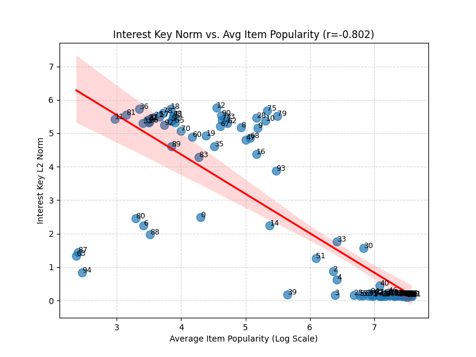

# Deep Semantic Analysis: csar-hard

# === Interest View Analysis ===

### Interest #0 Deep Analysis

- **Key Norm:** `2.4977`

**Top 20 Items**

|   Rank | Title                        |   Year | Genres          | Director/Author   |   Weight |
|-------:|:-----------------------------|-------:|:----------------|:------------------|---------:|
|      1 | Short Cuts                   |   1993 | Drama           | Laura Passalacqua |   3.0351 |
|      2 | Kika                         |   1993 | Drama           | Pedro Almodóvar   |   2.7803 |
|      3 | In the Company of Men        |   1997 | Drama           | Neil LaBute       |   2.6669 |
|      4 | Ice Storm, The               |   1997 | Drama           | Ang Lee           |   2.618  |
|      5 | Sweet Hereafter, The         |   1997 | Drama           | Atom Egoyan       |   2.5215 |
|      6 | Ladybird Ladybird            |   1994 | Drama           | Ken Loach         |   2.477  |
|      7 | Cabaret Balkan (Bure Baruta) |   1998 | Drama           | Goran Paskaljević |   2.4769 |
|      8 | Sugar Town                   |   1999 | Comedy          | Allison Anders    |   2.4517 |
|      9 | Naked                        |   1993 | Drama           | Mike Leigh        |   2.4414 |
|     10 | I Shot Andy Warhol           |   1996 | Drama           | Ovidie            |   2.4401 |
|     11 | Palookaville                 |   1996 | Action, Drama   | Alan Taylor       |   2.4333 |
|     12 | Big Night                    |   1996 | Drama           | Bong Ramos        |   2.4144 |
|     13 | Flirting With Disaster       |   1996 | Comedy          | David O. Russell  |   2.3729 |
|     14 | Girls Town                   |   1996 | Drama           | Jim McKay         |   2.3639 |
|     15 | Ed's Next Move               |   1996 | Comedy          | John C. Walsh     |   2.3452 |
|     16 | Player, The                  |   1992 | Comedy, Drama   | Robert Altman     |   2.323  |
|     17 | Glengarry Glen Ross          |   1992 | Drama           | James Foley       |   2.3152 |
|     18 | Traveller                    |   1997 | Drama           | Jack N. Green     |   2.3121 |
|     19 | Reservoir Dogs               |   1992 | Crime, Thriller | Quentin Tarantino |   2.2719 |
|     20 | Miller's Crossing            |   1990 | Drama           | Joel Coen         |   2.2639 |

**Significant Genres (p<0.05)**

| Feature   |   Count | Lift   |   p-value |
|:----------|--------:|:-------|----------:|
| Drama     |      16 | 3.0x   |         0 |

**Significant Decades (p<0.05)**

|   Feature |   Count | Lift   |   p-value |
|----------:|--------:|:-------|----------:|
|      1990 |      20 | 1.8x   |    0.0002 |

**Significant Keywords (p<0.05)**

| Feature   |   Count | Lift   |   p-value |
|:----------|--------:|:-------|----------:|
| betrayal  |       3 | 25.0x  |         0 |

#### Qualitative Summary

Interest #0 captures ****Drama** genre, from the **1990s**, related to **'betrayal'****.

### Interest #1 Deep Analysis

- **Key Norm:** `0.1271`

**Top 20 Items**

|   Rank | Title                                                                |   Year | Genres             | Director/Author      |   Weight |
|-------:|:---------------------------------------------------------------------|-------:|:-------------------|:---------------------|---------:|
|      1 | Monty Python and the Holy Grail                                      |   1974 | Comedy             | Terry Jones          |   0.7926 |
|      2 | Young Frankenstein                                                   |   1974 | Comedy, Horror     | Mel Brooks           |   0.7789 |
|      3 | Monty Python's Life of Brian                                         |   1979 | Comedy             | Terry Jones          |   0.7789 |
|      4 | Animal House                                                         |   1978 | Comedy             | John Landis          |   0.7781 |
|      5 | Fish Called Wanda, A                                                 |   1988 | Comedy             | Charles Crichton     |   0.7721 |
|      6 | Star Wars: Episode IV - A New Hope                                   |   1977 | Action, Adventure  | George Lucas         |   0.771  |
|      7 | This Is Spinal Tap                                                   |   1984 | Comedy, Drama      | Rob Reiner           |   0.7689 |
|      8 | Airplane!                                                            |   1980 | Comedy             | Jerry Zucker         |   0.7687 |
|      9 | Blazing Saddles                                                      |   1974 | Comedy, Western    | Mel Brooks           |   0.7685 |
|     10 | Blues Brothers, The                                                  |   1980 | Action, Comedy     | John Landis          |   0.7684 |
|     11 | M*A*S*H                                                              |   1970 | Comedy, War        | Robert Altman        |   0.7678 |
|     12 | Raiders of the Lost Ark                                              |   1981 | Action, Adventure  | Steven Spielberg     |   0.7657 |
|     13 | Sting, The                                                           |   1973 | Comedy, Crime      | George Roy Hill      |   0.7652 |
|     14 | Princess Bride, The                                                  |   1987 | Action, Adventure  | Rob Reiner           |   0.7642 |
|     15 | Raising Arizona                                                      |   1987 | Comedy             | Joel Coen            |   0.7636 |
|     16 | And Now for Something Completely Different                           |   1971 | Comedy             | Ian MacNaughton      |   0.7612 |
|     17 | Apocalypse Now                                                       |   1979 | Drama, War         | Francis Ford Coppola |   0.7611 |
|     18 | Dr. Strangelove or: How I Learned to Stop Worrying and Love the Bomb |   1963 | Sci-Fi, War        | Stanley Kubrick      |   0.7607 |
|     19 | Muppet Movie, The                                                    |   1979 | Children's, Comedy | James Frawley        |   0.7599 |
|     20 | Star Wars: Episode V - The Empire Strikes Back                       |   1980 | Action, Adventure  | Irvin Kershner       |   0.7598 |

**Significant Genres (p<0.05)**

| Feature   |   Count | Lift   |   p-value |
|:----------|--------:|:-------|----------:|
| Comedy    |      15 | 1.9x   |    0.0077 |
| War       |       4 | 3.8x   |    0.0147 |

**Significant Decades (p<0.05)**

|   Feature |   Count | Lift   |   p-value |
|----------:|--------:|:-------|----------:|
|      1970 |      11 | 8.0x   |    0      |
|      1980 |       8 | 2.3x   |    0.0154 |

**Significant Directors (p<0.05)**

| Feature     |   Count | Lift   |   p-value |
|:------------|--------:|:-------|----------:|
| Terry Jones |       2 | 154.1x |         0 |
| Mel Brooks  |       2 | 44.0x  |         0 |
| John Landis |       2 | 34.2x  |         0 |
| Rob Reiner  |       2 | 34.2x  |         0 |

**Significant Cast (p<0.05)**

| Feature        |   Count | Lift   |   p-value |
|:---------------|--------:|:-------|----------:|
| Graham Chapman |       3 | 151.6x |         0 |
| John Cleese    |       4 | 86.6x  |         0 |
| Eric Idle      |       3 | 91.0x  |         0 |
| Terry Gilliam  |       3 | 151.6x |         0 |
| Terry Jones    |       3 | 151.6x |         0 |

**Significant Keywords (p<0.05)**

| Feature         |   Count | Lift   |   p-value |
|:----------------|--------:|:-------|----------:|
| parody          |       6 | 21.7x  |    0      |
| anarchic comedy |       6 | 36.2x  |    0      |
| spoof           |       4 | 12.1x  |    0      |
| anti war        |       3 | 30.2x  |    0      |
| satire          |       4 | 7.1x   |    0.0001 |

#### Qualitative Summary

Interest #1 captures **films by **Terry Jones**, **Comedy** genre, from the **1970s**, related to **'parody'****.

### Interest #2 Deep Analysis

- **Key Norm:** `0.8805`

**Top 20 Items**

|   Rank | Title                                                                |   Year | Genres              | Director/Author   |   Weight |
|-------:|:---------------------------------------------------------------------|-------:|:--------------------|:------------------|---------:|
|      1 | Rear Window                                                          |   1954 | Mystery, Thriller   | Jeff Bleckner     |   1.4609 |
|      2 | Psycho                                                               |   1960 | Horror, Thriller    | Alfred Hitchcock  |   1.3923 |
|      3 | Vertigo                                                              |   1958 | Mystery, Thriller   | Alfred Hitchcock  |   1.3902 |
|      4 | Chinatown                                                            |   1974 | Film-Noir, Mystery  | Roman Polanski    |   1.3776 |
|      5 | Strangers on a Train                                                 |   1951 | Film-Noir, Thriller | Alfred Hitchcock  |   1.3773 |
|      6 | Third Man, The                                                       |   1949 | Mystery, Thriller   | Carol Reed        |   1.3493 |
|      7 | Double Indemnity                                                     |   1944 | Crime, Film-Noir    | Billy Wilder      |   1.3349 |
|      8 | Manchurian Candidate, The                                            |   1962 | Film-Noir, Thriller | Jonathan Demme    |   1.325  |
|      9 | Sunset Blvd. (a.k.a. Sunset Boulevard)                               |   1950 | Film-Noir           |                   |   1.3224 |
|     10 | North by Northwest                                                   |   1959 | Drama, Thriller     | Alfred Hitchcock  |   1.3193 |
|     11 | Citizen Kane                                                         |   1941 | Drama               | Orson Welles      |   1.2895 |
|     12 | Dial M for Murder                                                    |   1954 | Mystery, Thriller   | Boris Sagal       |   1.2839 |
|     13 | Touch of Evil                                                        |   1958 | Crime, Film-Noir    | Orson Welles      |   1.2751 |
|     14 | Treasure of the Sierra Madre, The                                    |   1948 | Adventure           | John Huston       |   1.2749 |
|     15 | Dr. Strangelove or: How I Learned to Stop Worrying and Love the Bomb |   1963 | Sci-Fi, War         | Stanley Kubrick   |   1.2705 |
|     16 | Maltese Falcon, The                                                  |   1941 | Film-Noir, Mystery  | Roy Del Ruth      |   1.2648 |
|     17 | On the Waterfront                                                    |   1954 | Crime, Drama        | Elia Kazan        |   1.26   |
|     18 | Notorious                                                            |   1946 | Film-Noir, Romance  | Alfred Hitchcock  |   1.2594 |
|     19 | Big Sleep, The                                                       |   1946 | Film-Noir, Mystery  | Howard Hawks      |   1.2389 |
|     20 | 39 Steps, The                                                        |   1935 | Thriller            | James Hawes       |   1.225  |

**Significant Genres (p<0.05)**

| Feature   |   Count | Lift   |   p-value |
|:----------|--------:|:-------|----------:|
| Mystery   |       7 | 10.1x  |         0 |
| Thriller  |      12 | 3.8x   |         0 |
| Film-Noir |       9 | 32.1x  |         0 |

**Significant Decades (p<0.05)**

|   Feature |   Count | Lift   |   p-value |
|----------:|--------:|:-------|----------:|
|      1950 |       8 | 8.9x   |         0 |
|      1940 |       7 | 10.4x  |         0 |

**Significant Directors (p<0.05)**

| Feature          |   Count | Lift   |   p-value |
|:-----------------|--------:|:-------|----------:|
| Alfred Hitchcock |       5 | 36.9x  |         0 |
| Orson Welles     |       2 | 162.2x |         0 |

**Significant Cast (p<0.05)**

| Feature      |   Count | Lift   |   p-value |
|:-------------|--------:|:-------|----------:|
| Orson Welles |       3 | 119.7x |         0 |

**Significant Keywords (p<0.05)**

| Feature           |   Count | Lift   |   p-value |
|:------------------|--------:|:-------|----------:|
| detective         |       5 | 10.4x  |         0 |
| black and white   |       9 | 6.6x   |         0 |
| private detective |       4 | 17.3x  |         0 |
| missing person    |       3 | 20.7x  |         0 |
| film noir         |       8 | 26.7x  |         0 |

#### Qualitative Summary

Interest #2 captures **films by **Alfred Hitchcock**, **Mystery** genre, from the **1950s**, related to **'detective'****.

### Interest #3 Deep Analysis

- **Key Norm:** `0.1679`

**Top 20 Items**

|   Rank | Title                                                                |   Year | Genres              | Director/Author      |   Weight |
|-------:|:---------------------------------------------------------------------|-------:|:--------------------|:---------------------|---------:|
|      1 | Chinatown                                                            |   1974 | Film-Noir, Mystery  | Roman Polanski       |   0.811  |
|      2 | Blood Simple                                                         |   1984 | Drama, Film-Noir    | Joel Coen            |   0.8045 |
|      3 | Raging Bull                                                          |   1980 | Drama               | Martin Scorsese      |   0.8001 |
|      4 | Taxi Driver                                                          |   1976 | Drama, Thriller     | Martin Scorsese      |   0.7996 |
|      5 | Blue Velvet                                                          |   1986 | Drama, Mystery      | David Lynch          |   0.7909 |
|      6 | Annie Hall                                                           |   1977 | Comedy, Romance     | Woody Allen          |   0.7896 |
|      7 | Conversation, The                                                    |   1974 | Drama, Mystery      | Dominik Sedlar       |   0.7886 |
|      8 | Apocalypse Now                                                       |   1979 | Drama, War          | Francis Ford Coppola |   0.7886 |
|      9 | Godfather, The                                                       |   1972 | Action, Crime       | Francis Ford Coppola |   0.7882 |
|     10 | Dr. Strangelove or: How I Learned to Stop Worrying and Love the Bomb |   1963 | Sci-Fi, War         | Stanley Kubrick      |   0.7844 |
|     11 | Midnight Cowboy                                                      |   1969 | Drama               | John Schlesinger     |   0.784  |
|     12 | Manhattan                                                            |   1979 | Comedy, Drama       | Woody Allen          |   0.7818 |
|     13 | Drugstore Cowboy                                                     |   1989 | Crime, Drama        | Gus Van Sant         |   0.7816 |
|     14 | Crimes and Misdemeanors                                              |   1989 | Comedy              | Woody Allen          |   0.7815 |
|     15 | Five Easy Pieces                                                     |   1970 | Drama               | Bob Rafelson         |   0.7802 |
|     16 | Stop Making Sense                                                    |   1984 | Documentary         | Jonathan Demme       |   0.7801 |
|     17 | Roger & Me                                                           |   1989 | Comedy, Documentary | Michael Moore        |   0.7792 |
|     18 | Manchurian Candidate, The                                            |   1962 | Film-Noir, Thriller | Jonathan Demme       |   0.7788 |
|     19 | Graduate, The                                                        |   1967 | Drama, Romance      | Mike Nichols         |   0.7783 |
|     20 | Hustler, The                                                         |   1961 | Drama               | Robert Rossen        |   0.778  |

**Significant Genres (p<0.05)**

| Feature   |   Count | Lift   |   p-value |
|:----------|--------:|:-------|----------:|
| Film-Noir |       3 | 11.3x  |    0      |
| Mystery   |       3 | 4.6x   |    0.0211 |

**Significant Decades (p<0.05)**

|   Feature |   Count | Lift   |   p-value |
|----------:|--------:|:-------|----------:|
|      1970 |       8 | 5.8x   |    0      |
|      1960 |       5 | 4.7x   |    0.0006 |

**Significant Directors (p<0.05)**

| Feature              |   Count | Lift   |   p-value |
|:---------------------|--------:|:-------|----------:|
| Martin Scorsese      |       2 | 38.5x  |         0 |
| Woody Allen          |       3 | 23.1x  |         0 |
| Francis Ford Coppola |       2 | 34.2x  |         0 |
| Jonathan Demme       |       2 | 51.4x  |         0 |

**Significant Cast (p<0.05)**

| Feature     |   Count | Lift   |   p-value |
|:------------|--------:|:-------|----------:|
| Woody Allen |       3 | 28.4x  |         0 |

**Significant Keywords (p<0.05)**

| Feature       |   Count | Lift   |   p-value |
|:--------------|--------:|:-------|----------:|
| audacious     |       4 | 17.1x  |    0      |
| cynical       |       3 | 32.1x  |    0      |
| neo-noir      |       4 | 6.8x   |    0.0001 |
| new york city |       7 | 4.4x   |    0.0001 |
| sports        |       3 | 4.6x   |    0.0219 |

#### Qualitative Summary

Interest #3 captures **films by **Martin Scorsese**, **Film-Noir** genre, from the **1970s**, related to **'audacious'****.

### Interest #4 Deep Analysis

- **Key Norm:** `0.6174`

**Top 20 Items**

|   Rank | Title                    |   Year | Genres                | Director/Author   |   Weight |
|-------:|:-------------------------|-------:|:----------------------|:------------------|---------:|
|      1 | Pretty Woman             |   1990 | Comedy, Romance       | Yeung Chi Kin     |   1.1073 |
|      2 | Forrest Gump             |   1994 | Comedy, Romance       | Robert Zemeckis   |   1.0984 |
|      3 | Sleepless in Seattle     |   1993 | Comedy, Romance       | Nora Ephron       |   1.0848 |
|      4 | Notting Hill             |   1999 | Comedy, Romance       | Roger Michell     |   1.0615 |
|      5 | Ghost                    |   1990 | Comedy, Romance       | Jerry Zucker      |   1.0542 |
|      6 | You've Got Mail          |   1998 | Comedy, Romance       | Nora Ephron       |   1.0529 |
|      7 | My Best Friend's Wedding |   1997 | Comedy, Romance       | Chen Feihong      |   1.0345 |
|      8 | League of Their Own, A   |   1992 | Comedy, Drama         | Penny Marshall    |   1.0332 |
|      9 | Jerry Maguire            |   1996 | Drama, Romance        | Cameron Crowe     |   1.0279 |
|     10 | American President, The  |   1995 | Comedy, Drama         | Rob Reiner        |   1.0265 |
|     11 | Wedding Singer, The      |   1998 | Comedy, Romance       | Frank Coraci      |   1.0206 |
|     12 | As Good As It Gets       |   1997 | Comedy, Drama         | James L. Brooks   |   1.0115 |
|     13 | Mrs. Doubtfire           |   1993 | Comedy                | Chris Columbus    |   1.0049 |
|     14 | Liar Liar                |   1997 | Comedy                | Hiroaki Matsuyama |   0.9961 |
|     15 | While You Were Sleeping  |   1995 | Comedy, Romance       | Jon Turteltaub    |   0.9957 |
|     16 | Runaway Bride            |   1999 | Comedy, Romance       | Garry Marshall    |   0.991  |
|     17 | Toy Story                |   1995 | Animation, Children's | John Lasseter     |   0.9905 |
|     18 | Titanic                  |   1997 | Drama, Romance        | James Cameron     |   0.9889 |
|     19 | Dave                     |   1993 | Comedy, Romance       | Ivan Reitman      |   0.9888 |
|     20 | True Lies                |   1994 | Action, Adventure     | James Cameron     |   0.9858 |

**Significant Genres (p<0.05)**

| Feature   |   Count | Lift   |   p-value |
|:----------|--------:|:-------|----------:|
| Romance   |      15 | 4.4x   |    0      |
| Comedy    |      18 | 2.2x   |    0.0003 |

**Significant Decades (p<0.05)**

|   Feature |   Count | Lift   |   p-value |
|----------:|--------:|:-------|----------:|
|      1990 |      20 | 1.8x   |    0.0002 |

**Significant Directors (p<0.05)**

| Feature       |   Count | Lift   |   p-value |
|:--------------|--------:|:-------|----------:|
| Nora Ephron   |       2 | 77.0x  |         0 |
| James Cameron |       2 | 44.0x  |         0 |

**Significant Cast (p<0.05)**

| Feature   |   Count | Lift   |   p-value |
|:----------|--------:|:-------|----------:|
| Tom Hanks |       5 | 39.9x  |         0 |

**Significant Keywords (p<0.05)**

| Feature            |   Count | Lift   |   p-value |
|:-------------------|--------:|:-------|----------:|
| usa president      |       3 | 13.2x  |         0 |
| single mother      |       3 | 17.4x  |         0 |
| love of one's life |       3 | 13.2x  |         0 |
| romcom             |       3 | 15.7x  |         0 |
| falling in love    |       3 | 13.8x  |         0 |

#### Qualitative Summary

Interest #4 captures **films by **Nora Ephron**, **Romance** genre, from the **1990s**, related to **'usa president'****.

### Interest #5 Deep Analysis

- **Key Norm:** `5.3726`

**Top 20 Items**

|   Rank | Title                                       |   Year | Genres                | Director/Author      |   Weight |
|-------:|:--------------------------------------------|-------:|:----------------------|:---------------------|---------:|
|      1 | Hard Core Logo                              |   1996 | Comedy                | Bruce McDonald       |   3.6392 |
|      2 | Close Shave, A                              |   1995 | Animation, Comedy     | Nick Park            |   3.3839 |
|      3 | Trust                                       |   1990 | Comedy, Drama         | Carlson Young        |   3.1788 |
|      4 | Wrong Trousers, The                         |   1993 | Animation, Comedy     | Nick Park            |   3.1196 |
|      5 | Grand Day Out, A                            |   1992 | Animation, Comedy     | Nick Park            |   3.0629 |
|      6 | Day of the Beast, The (El Día de la bestia) |   1995 | Comedy, Horror        | Álex de la Iglesia   |   2.9151 |
|      7 | Nobody Loves Me (Keiner liebt mich)         |   1994 | Comedy, Drama         | Doris Dörrie         |   2.9058 |
|      8 | Besieged (L' Assedio)                       |   1998 | Drama                 | Bernardo Bertolucci  |   2.883  |
|      9 | New Jersey Drive                            |   1995 | Crime, Drama          | Nick Gomez           |   2.8636 |
|     10 | Hard-Boiled (Lashou shentan)                |   1992 | Action, Crime         | John Woo             |   2.8207 |
|     11 | City of Lost Children, The                  |   1995 | Adventure, Sci-Fi     | Jean-Pierre Jeunet   |   2.8028 |
|     12 | Creature Comforts                           |   1990 | Animation, Comedy     | Nick Park            |   2.7988 |
|     13 | Celestial Clockwork                         |   1994 | Comedy                | Fina Torres          |   2.6803 |
|     14 | Celebration, The (Festen)                   |   1998 | Drama                 | Thomas Vinterberg    |   2.6597 |
|     15 | Dream With the Fishes                       |   1997 | Drama                 | Finn Taylor          |   2.6595 |
|     16 | Lamerica                                    |   1994 | Drama                 | Gianni Amelio        |   2.6389 |
|     17 | Taste of Cherry                             |   1997 | Drama                 | Abbas Kiarostami     |   2.5838 |
|     18 | Apple, The (Sib)                            |   1998 | Drama                 | Samira Makhmalbaf    |   2.5604 |
|     19 | Three Colors: Red                           |   1994 | Drama                 | Krzysztof Kieślowski |   2.527  |
|     20 | Secret Adventures of Tom Thumb, The         |   1993 | Adventure, Children's | Dave Borthwick       |   2.5013 |

**Significant Genres (p<0.05)**

| Feature   |   Count | Lift   |   p-value |
|:----------|--------:|:-------|----------:|
| Animation |       4 | 6.4x   |    0.0002 |

**Significant Decades (p<0.05)**

|   Feature |   Count | Lift   |   p-value |
|----------:|--------:|:-------|----------:|
|      1990 |      20 | 1.8x   |    0.0002 |

**Significant Directors (p<0.05)**

| Feature   |   Count | Lift   |   p-value |
|:----------|--------:|:-------|----------:|
| Nick Park |       4 | 123.2x |         0 |

**Significant Cast (p<0.05)**

| Feature      |   Count | Lift   |   p-value |
|:-------------|--------:|:-------|----------:|
| Peter Sallis |       3 | 137.0x |         0 |

**Significant Keywords (p<0.05)**

| Feature                   |   Count | Lift   |   p-value |
|:--------------------------|--------:|:-------|----------:|
| inventor                  |       3 | 27.5x  |         0 |
| human animal relationship |       3 | 37.4x  |         0 |
| surrealism                |       3 | 17.4x  |         0 |
| anthropomorphism          |       4 | 38.7x  |         0 |
| stop motion               |       5 | 58.1x  |         0 |

#### Qualitative Summary

Interest #5 captures **films by **Nick Park**, **Animation** genre, from the **1990s**, related to **'inventor'****.

### Interest #6 Deep Analysis

- **Key Norm:** `2.2412`

**Top 20 Items**

|   Rank | Title                                                         |   Year | Genres        | Director/Author     |   Weight |
|-------:|:--------------------------------------------------------------|-------:|:--------------|:--------------------|---------:|
|      1 | Mirror, The (Zerkalo)                                         |   1975 | Drama         | Andrei Tarkovsky    |   3.6387 |
|      2 | Contempt (Le Mépris)                                          |   1963 | Drama         | Antoine de Gaudemar |   3.484  |
|      3 | Saragossa Manuscript, The (Rekopis znaleziony w Saragossie)   |   1965 | Drama         | Wojciech Jerzy Has  |   3.1938 |
|      4 | Conformist, The (Il Conformista)                              |   1970 | Drama         | Bernardo Bertolucci |   3.1104 |
|      5 | Pather Panchali                                               |   1955 | Drama         | Satyajit Ray        |   3.0819 |
|      6 | And the Ship Sails On (E la nave va)                          |   1984 | Comedy, War   | Federico Fellini    |   3.0276 |
|      7 | Eternity and a Day (Mia eoniotita ke mia mera )               |   1998 | Drama         | Theo Angelopoulos   |   3.0055 |
|      8 | Jonah Who Will Be 25 in the Year 2000                         |   1976 | Comedy        | Alain Tanner        |   2.9993 |
|      9 | Nights of Cabiria (Le Notti di Cabiria)                       |   1957 | Drama         | Federico Fellini    |   2.9451 |
|     10 | Aparajito                                                     |   1956 | Drama         | Anik Dutta          |   2.9145 |
|     11 | Alphaville                                                    |   1965 | Sci-Fi        | Jean-Luc Godard     |   2.9022 |
|     12 | Ballad of Narayama, The (Narayama Bushiko)                    |   1958 | Drama         | Keisuke Kinoshita   |   2.9019 |
|     13 | Yojimbo                                                       |   1961 | Comedy, Drama | Akira Kurosawa      |   2.872  |
|     14 | Blue Angel, The (Blaue Engel, Der)                            |   1930 | Drama         | Edward Dmytryk      |   2.8292 |
|     15 | Clean Slate (Coup de Torchon)                                 |   1981 | Crime         | Bertrand Tavernier  |   2.8267 |
|     16 | Grand Illusion (Grande illusion, La)                          |   1937 | Drama, War    | Jean Renoir         |   2.8152 |
|     17 | Garden of Finzi-Contini, The (Giardino dei Finzi-Contini, Il) |   1970 | Drama         | Vittorio De Sica    |   2.8142 |
|     18 | Jules and Jim (Jules et Jim)                                  |   1961 | Drama         | François Truffaut   |   2.8085 |
|     19 | 400 Blows, The (Les Quatre cents coups)                       |   1959 | Drama         | François Truffaut   |   2.7966 |
|     20 | Cérémonie, La                                                 |   1995 | Drama         | Claude Chabrol      |   2.7933 |

**Significant Genres (p<0.05)**

| Feature   |   Count | Lift   |   p-value |
|:----------|--------:|:-------|----------:|
| Drama     |      16 | 2.9x   |         0 |

**Significant Decades (p<0.05)**

|   Feature |   Count | Lift   |   p-value |
|----------:|--------:|:-------|----------:|
|      1950 |       5 | 5.5x   |    0.0001 |
|      1960 |       5 | 4.7x   |    0.0006 |

**Significant Directors (p<0.05)**

| Feature           |   Count | Lift   |   p-value |
|:------------------|--------:|:-------|----------:|
| Federico Fellini  |       2 | 154.1x |         0 |
| François Truffaut |       2 | 154.1x |         0 |

**Significant Keywords (p<0.05)**

| Feature       |   Count | Lift   |   p-value |
|:--------------|--------:|:-------|----------:|
| paris, france |       3 | 7.9x   |    0.0006 |

#### Qualitative Summary

Interest #6 captures **films by **Federico Fellini**, **Drama** genre, from the **1950s**, related to **'paris, france'****.

### Interest #7 Deep Analysis

- **Key Norm:** `5.3403`

**Top 20 Items**

|   Rank | Title                                     |   Year | Genres          | Director/Author   |   Weight |
|-------:|:------------------------------------------|-------:|:----------------|:------------------|---------:|
|      1 | Police Academy 5: Assignment: Miami Beach |   1988 | Comedy          | Alan Myerson      |   3.9182 |
|      2 | Police Academy 3: Back in Training        |   1986 | Comedy          | Jerry Paris       |   3.8821 |
|      3 | Police Academy 6: City Under Siege        |   1989 | Comedy          | Peter Bonerz      |   3.7461 |
|      4 | Meet Wally Sparks                         |   1997 | Comedy          | Peter Baldwin     |   3.6403 |
|      5 | Celtic Pride                              |   1996 | Comedy          | Tom DeCerchio     |   3.4252 |
|      6 | Police Academy 2: Their First Assignment  |   1985 | Comedy          | Jerry Paris       |   3.3836 |
|      7 | Police Academy 4: Citizens on Patrol      |   1987 | Comedy          | Jim Drake         |   3.3316 |
|      8 | Cabin Boy                                 |   1994 | Comedy          | Adam Resnick      |   3.2201 |
|      9 | Bio-Dome                                  |   1996 | Comedy          | Jason Bloom       |   3.2098 |
|     10 | Porky's II: The Next Day                  |   1983 | Comedy          | Bob Clark         |   3.1513 |
|     11 | Jury Duty                                 |   1995 | Comedy          | John Fortenberry  |   3.0581 |
|     12 | European Vacation                         |   1985 | Comedy          | Amy Heckerling    |   2.9268 |
|     13 | Black Sheep                               |   1996 | Comedy          | Jonathan King     |   2.9008 |
|     14 | Spaceballs                                |   1987 | Comedy, Sci-Fi  | Mel Brooks        |   2.8979 |
|     15 | Jerky Boys, The                           |   1994 | Comedy          | James Melkonian   |   2.8875 |
|     16 | Christmas Vacation                        |   1989 | Comedy          | Enrico Oldoini    |   2.8838 |
|     17 | Back to School                            |   1986 | Comedy          | Alan Metter       |   2.8146 |
|     18 | Dumb & Dumber                             |   1994 | Comedy          | Bobby Farrelly    |   2.7658 |
|     19 | Stupids, The                              |   1996 | Comedy          | John Landis       |   2.7621 |
|     20 | Three Amigos!                             |   1986 | Comedy, Western | John Landis       |   2.7556 |

**Significant Genres (p<0.05)**

| Feature   |   Count | Lift   |   p-value |
|:----------|--------:|:-------|----------:|
| Comedy    |      20 | 4.9x   |         0 |

**Significant Decades (p<0.05)**

|   Feature |   Count | Lift   |   p-value |
|----------:|--------:|:-------|----------:|
|      1980 |      11 | 3.2x   |         0 |

**Significant Directors (p<0.05)**

| Feature     |   Count | Lift   |   p-value |
|:------------|--------:|:-------|----------:|
| Jerry Paris |       2 | 154.1x |         0 |
| John Landis |       2 | 34.2x  |         0 |

**Significant Cast (p<0.05)**

| Feature          |   Count | Lift   |   p-value |
|:-----------------|--------:|:-------|----------:|
| Bubba Smith      |       5 | 126.3x |         0 |
| David Graf       |       5 | 151.6x |         0 |
| Michael Winslow  |       5 | 151.6x |         0 |
| Marion Ramsey    |       3 | 151.6x |         0 |
| Steve Guttenberg |       3 | 50.5x  |         0 |

**Significant Keywords (p<0.05)**

| Feature              |   Count | Lift   |   p-value |
|:---------------------|--------:|:-------|----------:|
| handcuffs            |       3 | 133.6x |         0 |
| investigation        |       3 | 15.4x  |         0 |
| police operation     |       3 | 72.9x  |         0 |
| police everyday life |       3 | 200.3x |         0 |

#### Qualitative Summary

Interest #7 captures **films by **Jerry Paris**, **Comedy** genre, from the **1980s**, related to **'handcuffs'****.

### Interest #8 Deep Analysis

- **Key Norm:** `5.1708`

**Top 20 Items**

|   Rank | Title                                          |   Year | Genres        | Director/Author     |   Weight |
|-------:|:-----------------------------------------------|-------:|:--------------|:--------------------|---------:|
|      1 | Crew, The                                      |   2000 | Comedy        | Michael Dinner      |   2.6657 |
|      2 | Under the Rainbow                              |   1981 | Comedy        | Steve Rash          |   2.6546 |
|      3 | Take the Money and Run                         |   1969 | Comedy        | Woody Allen         |   2.5838 |
|      4 | History of the World: Part I                   |   1981 | Comedy        | Mel Brooks          |   2.4673 |
|      5 | Last Detail, The                               |   1973 | Comedy, Drama | Hal Ashby           |   2.4017 |
|      6 | Odd Couple, The                                |   1968 | Comedy        | Gene Saks           |   2.3959 |
|      7 | How I Won the War                              |   1967 | Comedy, War   | Richard Lester      |   2.3786 |
|      8 | Gods Must Be Crazy, The                        |   1980 | Comedy        | Billy Chan Wui-Ngai |   2.3421 |
|      9 | Fish Called Wanda, A                           |   1988 | Comedy        | Charles Crichton    |   2.3329 |
|     10 | Local Hero                                     |   1983 | Comedy        | Bill Forsyth        |   2.3158 |
|     11 | Everything You Always Wanted to Know About Sex |   1972 | Comedy        | Woody Allen         |   2.3073 |
|     12 | Trading Places                                 |   1983 | Comedy        | John Landis         |   2.2878 |
|     13 | Radio Days                                     |   1987 | Comedy, Drama | Woody Allen         |   2.2844 |
|     14 | Bananas                                        |   1971 | Comedy, War   | Woody Allen         |   2.2774 |
|     15 | Ruthless People                                |   1986 | Comedy        | David Zucker        |   2.2759 |
|     16 | My Man Godfrey                                 |   1957 | Comedy        | Gregory La Cava     |   2.269  |
|     17 | Crimes and Misdemeanors                        |   1989 | Comedy        | Woody Allen         |   2.2658 |
|     18 | Amityville II: The Possession                  |   1982 | Horror        | Damiano Damiani     |   2.2486 |
|     19 | My Favorite Year                               |   1982 | Comedy        | Richard Benjamin    |   2.2444 |
|     20 | Ferris Bueller's Day Off                       |   1986 | Comedy        | John Hughes         |   2.24   |

**Significant Genres (p<0.05)**

| Feature   |   Count | Lift   |   p-value |
|:----------|--------:|:-------|----------:|
| Comedy    |      19 | 4.3x   |         0 |

**Significant Decades (p<0.05)**

|   Feature |   Count | Lift   |   p-value |
|----------:|--------:|:-------|----------:|
|      1980 |      12 | 3.5x   |         0 |

**Significant Directors (p<0.05)**

| Feature     |   Count | Lift   |   p-value |
|:------------|--------:|:-------|----------:|
| Woody Allen |       5 | 38.5x  |         0 |

**Significant Cast (p<0.05)**

| Feature     |   Count | Lift   |   p-value |
|:------------|--------:|:-------|----------:|
| Woody Allen |       4 | 37.9x  |         0 |

#### Qualitative Summary

Interest #8 captures **films by **Woody Allen**, **Comedy** genre, from the **1980s****.

### Interest #9 Deep Analysis

- **Key Norm:** `5.1660`

**Top 20 Items**

|   Rank | Title                                |   Year | Genres             | Director/Author   |   Weight |
|-------:|:-------------------------------------|-------:|:-------------------|:------------------|---------:|
|      1 | Raiders of the Lost Ark              |   1981 | Action, Adventure  | Steven Spielberg  |   3.2    |
|      2 | Jewel of the Nile, The               |   1985 | Action, Adventure  | Lewis Teague      |   3.0374 |
|      3 | Crocodile Dundee                     |   1986 | Adventure, Comedy  | Peter Faiman      |   3.0151 |
|      4 | Romancing the Stone                  |   1984 | Action, Adventure  | Robert Zemeckis   |   2.7816 |
|      5 | Indiana Jones and the Temple of Doom |   1984 | Action, Adventure  | Steven Spielberg  |   2.7415 |
|      6 | Indiana Jones and the Last Crusade   |   1989 | Action, Adventure  | Steven Spielberg  |   2.7328 |
|      7 | True Grit                            |   1969 | Adventure, Western | Ethan Coen        |   2.7147 |
|      8 | Fatal Beauty                         |   1987 | Action, Crime      | Joel Soisson      |   2.5876 |
|      9 | Next Karate Kid, The                 |   1994 | Action, Children's | Christopher Cain  |   2.5557 |
|     10 | Harry and the Hendersons             |   1987 | Comedy             | William Dear      |   2.5071 |
|     11 | Star Trek III: The Search for Spock  |   1984 | Action, Adventure  | Leonard Nimoy     |   2.428  |
|     12 | Around the World in 80 Days          |   1956 | Adventure, Comedy  | Bengt Lagerkvist  |   2.4091 |
|     13 | Crocodile Dundee II                  |   1988 | Adventure, Comedy  | John Cornell      |   2.397  |
|     14 | Superman IV: The Quest for Peace     |   1987 | Action, Adventure  | Sidney J. Furie   |   2.3788 |
|     15 | View to a Kill, A                    |   1985 | Action             | John Glen         |   2.3556 |
|     16 | Sister Act 2: Back in the Habit      |   1993 | Comedy             | Bill Duke         |   2.3471 |
|     17 | Terminal Velocity                    |   1994 | Action             | Deran Sarafian    |   2.3248 |
|     18 | Star Trek: The Wrath of Khan         |   1982 | Action, Adventure  | Nicholas Meyer    |   2.3057 |
|     19 | Batman                               |   1989 | Action, Adventure  | Tim Burton        |   2.2872 |
|     20 | Highlander                           |   1986 | Action, Adventure  | Russell Mulcahy   |   2.2829 |

**Significant Genres (p<0.05)**

| Feature   |   Count | Lift   |   p-value |
|:----------|--------:|:-------|----------:|
| Action    |      14 | 3.7x   |         0 |
| Adventure |      14 | 6.5x   |         0 |

**Significant Decades (p<0.05)**

|   Feature |   Count | Lift   |   p-value |
|----------:|--------:|:-------|----------:|
|      1980 |      15 | 4.4x   |         0 |

**Significant Directors (p<0.05)**

| Feature          |   Count | Lift   |   p-value |
|:-----------------|--------:|:-------|----------:|
| Steven Spielberg |       3 | 38.5x  |         0 |

**Significant Cast (p<0.05)**

| Feature       |   Count | Lift   |   p-value |
|:--------------|--------:|:-------|----------:|
| Harrison Ford |       3 | 21.7x  |         0 |

**Significant Keywords (p<0.05)**

| Feature          |   Count | Lift   |   p-value |
|:-----------------|--------:|:-------|----------:|
| treasure         |       3 | 35.7x  |         0 |
| saving the world |       3 | 17.8x  |         0 |
| riddle           |       4 | 42.3x  |         0 |
| treasure hunt    |       4 | 42.3x  |         0 |
| archaeologist    |       4 | 34.6x  |         0 |

#### Qualitative Summary

Interest #9 captures **films by **Steven Spielberg**, **Action** genre, from the **1980s**, related to **'treasure'****.

### Interest #10 Deep Analysis

- **Key Norm:** `5.3769`

**Top 20 Items**

|   Rank | Title                                  |   Year | Genres              | Director/Author   |   Weight |
|-------:|:---------------------------------------|-------:|:--------------------|:------------------|---------:|
|      1 | Double Indemnity                       |   1944 | Crime, Film-Noir    | Billy Wilder      |   4.1242 |
|      2 | Out of the Past                        |   1947 | Film-Noir           | Jacques Tourneur  |   4.1152 |
|      3 | Crossfire                              |   1947 | Crime, Film-Noir    | Claude Desrosiers |   3.9938 |
|      4 | Laura                                  |   1944 | Crime, Film-Noir    | Hanung Bramantyo  |   3.7884 |
|      5 | Maltese Falcon, The                    |   1941 | Film-Noir, Mystery  | Roy Del Ruth      |   3.6895 |
|      6 | Gilda                                  |   1946 | Film-Noir           | Charles Vidor     |   3.559  |
|      7 | Notorious                              |   1946 | Film-Noir, Romance  | Alfred Hitchcock  |   3.5203 |
|      8 | Murder, My Sweet                       |   1944 | Film-Noir, Thriller | Edward Dmytryk    |   3.3833 |
|      9 | Sunset Blvd. (a.k.a. Sunset Boulevard) |   1950 | Film-Noir           |                   |   3.3828 |
|     10 | Strangers on a Train                   |   1951 | Film-Noir, Thriller | Alfred Hitchcock  |   3.3617 |
|     11 | Killing, The                           |   1956 | Crime, Film-Noir    | Stanley Kubrick   |   3.3294 |
|     12 | Key Largo                              |   1948 | Crime, Drama        | John Huston       |   3.2532 |
|     13 | Shadow of a Doubt                      |   1943 | Film-Noir, Thriller | Karen Arthur      |   3.2223 |
|     14 | Chinatown                              |   1974 | Film-Noir, Mystery  | Roman Polanski    |   3.1281 |
|     15 | Touch of Evil                          |   1958 | Crime, Film-Noir    | Orson Welles      |   3.1268 |
|     16 | Asphalt Jungle, The                    |   1950 | Crime, Film-Noir    | John Huston       |   3.1231 |
|     17 | Big Sleep, The                         |   1946 | Film-Noir, Mystery  | Howard Hawks      |   3.1206 |
|     18 | Force of Evil                          |   1948 | Film-Noir           | Abraham Polonsky  |   3.0757 |
|     19 | Wrong Man, The                         |   1956 | Drama, Film-Noir    | Fred Kelsey       |   2.8777 |
|     20 | Manchurian Candidate, The              |   1962 | Film-Noir, Thriller | Jonathan Demme    |   2.7186 |

**Significant Genres (p<0.05)**

| Feature   |   Count | Lift   |   p-value |
|:----------|--------:|:-------|----------:|
| Crime     |       7 | 5.0x   |    0      |
| Film-Noir |      20 | 64.6x  |    0      |
| Mystery   |       4 | 5.3x   |    0.0015 |
| Thriller  |       9 | 2.6x   |    0.0048 |

**Significant Decades (p<0.05)**

|   Feature |   Count | Lift   |   p-value |
|----------:|--------:|:-------|----------:|
|      1940 |      12 | 17.9x  |         0 |
|      1950 |       6 | 6.6x   |         0 |

**Significant Directors (p<0.05)**

| Feature          |   Count | Lift   |   p-value |
|:-----------------|--------:|:-------|----------:|
| John Huston      |       2 | 54.1x  |    0      |
| Alfred Hitchcock |       2 | 14.7x  |    0.0002 |

**Significant Keywords (p<0.05)**

| Feature         |   Count | Lift   |   p-value |
|:----------------|--------:|:-------|----------:|
| femme fatale    |       6 | 57.0x  |         0 |
| film noir       |      13 | 63.7x  |         0 |
| black and white |       7 | 7.5x   |         0 |
| gangster        |       5 | 16.5x  |         0 |
| detective       |       5 | 15.2x  |         0 |

#### Qualitative Summary

Interest #10 captures **films by **John Huston**, **Crime** genre, from the **1940s**, related to **'femme fatale'****.

### Interest #11 Deep Analysis

- **Key Norm:** `5.4191`

**Top 20 Items**

|   Rank | Title                                            |   Year | Genres                | Director/Author          |   Weight |
|-------:|:-------------------------------------------------|-------:|:----------------------|:-------------------------|---------:|
|      1 | Friday the 13th Part VIII: Jason Takes Manhattan |   1989 | Horror                | Rob Hedden               |   3.4986 |
|      2 | Scream 2                                         |   1997 | Horror, Thriller      | Wes Craven               |   3.2985 |
|      3 | Scream                                           |   1996 | Horror, Thriller      | Wes Craven               |   3.2258 |
|      4 | Gold Diggers: The Secret of Bear Mountain        |   1995 | Adventure, Children's | Kevin James Dobson       |   3.0775 |
|      5 | Friday the 13th Part VII: The New Blood          |   1988 | Horror                | John Carl Buechler       |   2.9735 |
|      6 | Child's Play 3                                   |   1992 | Horror                | Jack Bender              |   2.9017 |
|      7 | Bad Girls                                        |   1994 | Western               | Jonathan Kaplan          |   2.864  |
|      8 | Puppet Master 4                                  |   1993 | Horror, Sci-Fi        | Jeff Burr                |   2.8265 |
|      9 | Friday the 13th Part 3: 3D                       |   1982 | Horror                | Steve Miner              |   2.8098 |
|     10 | Baby Geniuses                                    |   1999 | Comedy                | Bob Clark                |   2.7933 |
|     11 | Another Day in Paradise                          |   1998 | Drama                 | Larry Clark              |   2.7839 |
|     12 | Friday the 13th Part 2                           |   1981 | Horror                | Steve Miner              |   2.7655 |
|     13 | Love Stinks                                      |   1999 | Comedy                | Alicia K. Harris         |   2.7452 |
|     14 | Minnie and Moskowitz                             |   1971 | Action                | John Cassavetes          |   2.7228 |
|     15 | Kissing a Fool                                   |   1998 | Comedy, Romance       | Doug Ellin               |   2.7225 |
|     16 | Hush                                             |   1998 | Thriller              | Jonathan Darby           |   2.6645 |
|     17 | Friday the 13th Part V: A New Beginning          |   1985 | Horror                | Danny Steinmann          |   2.6642 |
|     18 | I Know What You Did Last Summer                  |   1997 | Horror, Mystery       | Jennifer Kaytin Robinson |   2.6402 |
|     19 | Maybe, Maybe Not (Bewegte Mann, Der)             |   1994 | Comedy                | Sönke Wortmann           |   2.6401 |
|     20 | Urban Legend                                     |   1998 | Horror, Thriller      | Jamie Blanks             |   2.6332 |

**Significant Genres (p<0.05)**

| Feature   |   Count | Lift   |   p-value |
|:----------|--------:|:-------|----------:|
| Horror    |      11 | 7.7x   |    0      |
| Thriller  |       6 | 2.6x   |    0.0311 |

**Significant Directors (p<0.05)**

| Feature     |   Count | Lift   |   p-value |
|:------------|--------:|:-------|----------:|
| Wes Craven  |       2 | 38.5x  |         0 |
| Steve Miner |       2 | 51.4x  |         0 |

**Significant Keywords (p<0.05)**

| Feature    |   Count | Lift   |   p-value |
|:-----------|--------:|:-------|----------:|
| mask       |       4 | 47.6x  |         0 |
| new jersey |       4 | 25.8x  |         0 |
| sadism     |       4 | 28.1x  |         0 |
| psychopath |       5 | 14.9x  |         0 |
| sequel     |       8 | 10.9x  |         0 |

#### Qualitative Summary

Interest #11 captures **films by **Wes Craven**, **Horror** genre, related to **'mask'****.

### Interest #12 Deep Analysis

- **Key Norm:** `5.7567`

**Top 20 Items**

|   Rank | Title                                     |   Year | Genres             | Director/Author          |   Weight |
|-------:|:------------------------------------------|-------:|:-------------------|:-------------------------|---------:|
|      1 | Conquest of the Planet of the Apes        |   1972 | Action, Sci-Fi     | J. Lee Thompson          |   3.2393 |
|      2 | Escape from the Planet of the Apes        |   1971 | Action, Sci-Fi     | Don Taylor               |   3.2002 |
|      3 | Beneath the Planet of the Apes            |   1970 | Action, Sci-Fi     | Ted Post                 |   3.0564 |
|      4 | Shaggy D.A., The                          |   1976 | Children's, Comedy | Robert Stevenson         |   2.9371 |
|      5 | Breathless                                |   1983 | Action, Drama      | Jim McBride              |   2.8376 |
|      6 | Battle for the Planet of the Apes         |   1973 | Action, Sci-Fi     | J. Lee Thompson          |   2.5304 |
|      7 | Madonna: Truth or Dare                    |   1991 | Documentary        | Alek Keshishian          |   2.5061 |
|      8 | Sixteen Candles                           |   1984 | Comedy             | John Hughes              |   2.5026 |
|      9 | Night Shift                               |   1982 | Comedy             | Stephen Hall             |   2.4482 |
|     10 | Peggy Sue Got Married                     |   1986 | Comedy, Romance    | Francis Ford Coppola     |   2.4423 |
|     11 | Halloween 5: The Revenge of Michael Myers |   1989 | Horror             | Dominique Othenin-Girard |   2.4032 |
|     12 | Pretty in Pink                            |   1986 | Comedy, Drama      | Howard Deutch            |   2.3643 |
|     13 | Men Don't Leave                           |   1990 | Drama              | Paul Brickman            |   2.3404 |
|     14 | Halloween 4: The Return of Michael Myers  |   1988 | Horror             | Dwight H. Little         |   2.3226 |
|     15 | Titanic                                   |   1997 | Drama, Romance     | James Cameron            |   2.2993 |
|     16 | Jennifer 8                                |   1992 | Thriller           | Bruce Robinson           |   2.2402 |
|     17 | Heaven Can Wait                           |   1978 | Comedy             | Ernst Lubitsch           |   2.2347 |
|     18 | Way We Were, The                          |   1973 | Drama              | Sydney Pollack           |   2.2333 |
|     19 | Tequila Sunrise                           |   1988 | Action, Romance    | Robert Towne             |   2.2225 |
|     20 | Carnal Knowledge                          |   1971 | Drama              | Mike Nichols             |   2.2216 |

**Significant Decades (p<0.05)**

|   Feature |   Count | Lift   |   p-value |
|----------:|--------:|:-------|----------:|
|      1970 |       8 | 5.8x   |    0      |
|      1980 |       8 | 2.3x   |    0.0154 |

**Significant Directors (p<0.05)**

| Feature         |   Count | Lift   |   p-value |
|:----------------|--------:|:-------|----------:|
| J. Lee Thompson |       2 | 44.0x  |         0 |

**Significant Cast (p<0.05)**

| Feature        |   Count | Lift   |   p-value |
|:---------------|--------:|:-------|----------:|
| Roddy McDowall |       3 | 37.9x  |         0 |

**Significant Keywords (p<0.05)**

| Feature   |   Count | Lift   |   p-value |
|:----------|--------:|:-------|----------:|
| dystopia  |       4 | 10.8x  |    0      |
| ape       |       3 | 115.0x |    0      |
| eroticism |       3 | 20.0x  |    0      |
| sequel    |       3 | 4.0x   |    0.0406 |

#### Qualitative Summary

Interest #12 captures **films by **J. Lee Thompson**, from the **1970s**, related to **'dystopia'****.

### Interest #13 Deep Analysis

- **Key Norm:** `0.1785`

**Top 20 Items**

|   Rank | Title                                          |   Year | Genres            | Director/Author   |   Weight |
|-------:|:-----------------------------------------------|-------:|:------------------|:------------------|---------:|
|      1 | Star Wars: Episode VI - Return of the Jedi     |   1983 | Action, Adventure | Richard Marquand  |   0.8524 |
|      2 | Star Wars: Episode IV - A New Hope             |   1977 | Action, Adventure | George Lucas      |   0.8505 |
|      3 | Star Wars: Episode V - The Empire Strikes Back |   1980 | Action, Adventure | Irvin Kershner    |   0.8461 |
|      4 | Matrix, The                                    |   1999 | Action, Sci-Fi    | Lana Wachowski    |   0.8119 |
|      5 | Star Wars: Episode I - The Phantom Menace      |   1999 | Action, Adventure | George Lucas      |   0.8082 |
|      6 | Jurassic Park                                  |   1993 | Action, Adventure | Steven Spielberg  |   0.8043 |
|      7 | Raiders of the Lost Ark                        |   1981 | Action, Adventure | Steven Spielberg  |   0.8018 |
|      8 | Indiana Jones and the Last Crusade             |   1989 | Action, Adventure | Steven Spielberg  |   0.7997 |
|      9 | Men in Black                                   |   1997 | Action, Adventure | Barry Sonnenfeld  |   0.7966 |
|     10 | Terminator 2: Judgment Day                     |   1991 | Action, Sci-Fi    | James Cameron     |   0.7963 |
|     11 | Willow                                         |   1988 | Action, Adventure | Ron Howard        |   0.7948 |
|     12 | Terminator, The                                |   1984 | Action, Sci-Fi    | James Cameron     |   0.7935 |
|     13 | Back to the Future                             |   1985 | Comedy, Sci-Fi    | Robert Zemeckis   |   0.7931 |
|     14 | Princess Bride, The                            |   1987 | Action, Adventure | Rob Reiner        |   0.7924 |
|     15 | Star Trek: First Contact                       |   1996 | Action, Adventure | Jonathan Frakes   |   0.7915 |
|     16 | Tron                                           |   1982 | Action, Adventure | Steven Lisberger  |   0.7914 |
|     17 | Predator                                       |   1987 | Action, Sci-Fi    | John McTiernan    |   0.7913 |
|     18 | Star Trek: The Wrath of Khan                   |   1982 | Action, Adventure | Nicholas Meyer    |   0.7907 |
|     19 | Total Recall                                   |   1990 | Action, Adventure | Paul Verhoeven    |   0.7906 |
|     20 | Aliens                                         |   1986 | Action, Sci-Fi    | James Cameron     |   0.7892 |

**Significant Genres (p<0.05)**

| Feature   |   Count | Lift   |   p-value |
|:----------|--------:|:-------|----------:|
| Action    |      19 | 3.3x   |    0      |
| Adventure |      14 | 4.3x   |    0      |
| Sci-Fi    |      16 | 5.1x   |    0      |
| Fantasy   |       4 | 4.9x   |    0.0026 |

**Significant Decades (p<0.05)**

|   Feature |   Count | Lift   |   p-value |
|----------:|--------:|:-------|----------:|
|      1980 |      12 | 3.5x   |         0 |

**Significant Directors (p<0.05)**

| Feature          |   Count | Lift   |   p-value |
|:-----------------|--------:|:-------|----------:|
| George Lucas     |       2 | 102.7x |         0 |
| Steven Spielberg |       3 | 38.5x  |         0 |
| James Cameron    |       3 | 66.0x  |         0 |

**Significant Cast (p<0.05)**

| Feature               |   Count | Lift   |   p-value |
|:----------------------|--------:|:-------|----------:|
| Mark Hamill           |       3 | 113.7x |         0 |
| Harrison Ford         |       5 | 36.1x  |         0 |
| Carrie Fisher         |       3 | 50.5x  |         0 |
| Arnold Schwarzenegger |       4 | 43.3x  |         0 |

**Significant Keywords (p<0.05)**

| Feature          |   Count | Lift   |   p-value |
|:-----------------|--------:|:-------|----------:|
| spacecraft       |       4 | 12.6x  |         0 |
| cyborg           |       3 | 27.3x  |         0 |
| dystopia         |       5 | 7.2x   |         0 |
| prophecy         |       3 | 18.9x  |         0 |
| saving the world |       4 | 20.4x  |         0 |

#### Qualitative Summary

Interest #13 captures **films by **George Lucas**, **Action** genre, from the **1980s**, related to **'spacecraft'****.

### Interest #14 Deep Analysis

- **Key Norm:** `2.2459`

**Top 20 Items**

|   Rank | Title                                 |   Year | Genres            | Director/Author   |   Weight |
|-------:|:--------------------------------------|-------:|:------------------|:------------------|---------:|
|      1 | American Pie                          |   1999 | Comedy            | Paul Weitz        |   2.6821 |
|      2 | Clerks                                |   1994 | Comedy            | Kevin Smith       |   2.4615 |
|      3 | Mallrats                              |   1995 | Comedy            | Kevin Smith       |   2.3948 |
|      4 | Drive Me Crazy                        |   1999 | Comedy, Romance   | John Schultz      |   2.232  |
|      5 | 10 Things I Hate About You            |   1999 | Comedy, Romance   | Gil Junger        |   2.2285 |
|      6 | Austin Powers: The Spy Who Shagged Me |   1999 | Comedy            | Jay Roach         |   2.2147 |
|      7 | South Park: Bigger, Longer and Uncut  |   1999 | Animation, Comedy | Trey Parker       |   2.2097 |
|      8 | Can't Hardly Wait                     |   1998 | Comedy, Drama     | Harry Elfont      |   2.1874 |
|      9 | Big Daddy                             |   1999 | Comedy            | Dennis Dugan      |   2.1427 |
|     10 | Cruel Intentions                      |   1999 | Drama             | Roger Kumble      |   2.1418 |
|     11 | Office Space                          |   1999 | Comedy, Romance   | Mike Judge        |   2.1169 |
|     12 | Dogma                                 |   1999 | Comedy            | Kevin Smith       |   2.0887 |
|     13 | Loser                                 |   2000 | Comedy, Romance   | Amy Heckerling    |   2.0644 |
|     14 | Billy Madison                         |   1995 | Comedy            | Tamra Davis       |   2.058  |
|     15 | Half Baked                            |   1998 | Comedy            | Tamra Davis       |   2.0519 |
|     16 | Road Trip                             |   2000 | Comedy            | Todd Phillips     |   2.046  |
|     17 | Detroit Rock City                     |   1999 | Comedy            | Adam Rifkin       |   2.0157 |
|     18 | Me, Myself and Irene                  |   2000 | Comedy            | Peter Farrelly    |   2.0092 |
|     19 | Empire Records                        |   1995 | Comedy, Drama     | Allan Moyle       |   2.007  |
|     20 | Idle Hands                            |   1999 | Comedy, Horror    | Rodman Flender    |   2.0045 |

**Significant Genres (p<0.05)**

| Feature   |   Count | Lift   |   p-value |
|:----------|--------:|:-------|----------:|
| Comedy    |      19 | 3.5x   |         0 |

**Significant Decades (p<0.05)**

|   Feature |   Count | Lift   |   p-value |
|----------:|--------:|:-------|----------:|
|      1990 |      17 | 1.5x   |     0.018 |

**Significant Directors (p<0.05)**

| Feature     |   Count | Lift   |   p-value |
|:------------|--------:|:-------|----------:|
| Kevin Smith |       3 | 115.5x |         0 |
| Tamra Davis |       2 | 102.7x |         0 |

**Significant Keywords (p<0.05)**

| Feature              |   Count | Lift   |   p-value |
|:---------------------|--------:|:-------|----------:|
| aftercreditsstinger  |       6 | 17.6x  |    0      |
| duringcreditsstinger |       5 | 14.1x  |    0      |
| college              |       3 | 14.0x  |    0      |
| high school          |       3 | 7.1x   |    0.0013 |
| coming of age        |       3 | 5.6x   |    0.0067 |

#### Qualitative Summary

Interest #14 captures **films by **Kevin Smith**, **Comedy** genre, from the **1990s**, related to **'aftercreditsstinger'****.

### Interest #15 Deep Analysis

- **Key Norm:** `0.1510`

**Top 20 Items**

|   Rank | Title                        |   Year | Genres           | Director/Author    |   Weight |
|-------:|:-----------------------------|-------:|:-----------------|:-------------------|---------:|
|      1 | Good Will Hunting            |   1997 | Drama            | Gus Van Sant       |   0.8068 |
|      2 | Shawshank Redemption, The    |   1994 | Drama            | Frank Darabont     |   0.8021 |
|      3 | Pulp Fiction                 |   1994 | Crime, Drama     | Quentin Tarantino  |   0.7993 |
|      4 | Saving Private Ryan          |   1998 | Action, Drama    | Steven Spielberg   |   0.7987 |
|      5 | American Beauty              |   1999 | Comedy, Drama    | Sam Mendes         |   0.7955 |
|      6 | Fargo                        |   1996 | Crime, Drama     | Joel Coen          |   0.7885 |
|      7 | Jerry Maguire                |   1996 | Drama, Romance   | Cameron Crowe      |   0.7879 |
|      8 | Few Good Men, A              |   1992 | Crime, Drama     | Rob Reiner         |   0.7844 |
|      9 | Apollo 13                    |   1995 | Drama            | Ron Howard         |   0.7825 |
|     10 | Silence of the Lambs, The    |   1991 | Drama, Thriller  | Jonathan Demme     |   0.7818 |
|     11 | Sixth Sense, The             |   1999 | Thriller         | M. Night Shyamalan |   0.781  |
|     12 | As Good As It Gets           |   1997 | Comedy, Drama    | James L. Brooks    |   0.7802 |
|     13 | Usual Suspects, The          |   1995 | Crime, Thriller  | Bryan Singer       |   0.78   |
|     14 | Matrix, The                  |   1999 | Action, Sci-Fi   | Lana Wachowski     |   0.7787 |
|     15 | Schindler's List             |   1993 | Drama, War       | Steven Spielberg   |   0.7782 |
|     16 | Braveheart                   |   1995 | Action, Drama    | Mel Gibson         |   0.778  |
|     17 | GoodFellas                   |   1990 | Crime, Drama     | Martin Scorsese    |   0.7764 |
|     18 | Fugitive, The                |   1993 | Action, Thriller | Andrew Davis       |   0.7764 |
|     19 | There's Something About Mary |   1998 | Comedy           | Peter Farrelly     |   0.7752 |
|     20 | Forrest Gump                 |   1994 | Comedy, Romance  | Robert Zemeckis    |   0.7738 |

**Significant Genres (p<0.05)**

| Feature   |   Count | Lift   |   p-value |
|:----------|--------:|:-------|----------:|
| Crime     |       5 | 3.8x   |    0.0046 |
| War       |       4 | 4.0x   |    0.0108 |

**Significant Decades (p<0.05)**

|   Feature |   Count | Lift   |   p-value |
|----------:|--------:|:-------|----------:|
|      1990 |      20 | 1.8x   |    0.0002 |

**Significant Directors (p<0.05)**

| Feature          |   Count | Lift   |   p-value |
|:-----------------|--------:|:-------|----------:|
| Steven Spielberg |       2 | 25.7x  |         0 |

**Significant Cast (p<0.05)**

| Feature   |   Count | Lift   |   p-value |
|:----------|--------:|:-------|----------:|
| Tom Hanks |       3 | 23.9x  |         0 |

**Significant Keywords (p<0.05)**

| Feature             |   Count | Lift   |   p-value |
|:--------------------|--------:|:-------|----------:|
| flashback           |       4 | 9.3x   |    0      |
| single mother       |       4 | 17.6x  |    0      |
| based on true story |       5 | 4.9x   |    0.0005 |
| neo-noir            |       4 | 5.3x   |    0.0014 |
| dying and death     |       3 | 6.3x   |    0.0032 |

#### Qualitative Summary

Interest #15 captures **films by **Steven Spielberg**, **Crime** genre, from the **1990s**, related to **'flashback'****.

### Interest #16 Deep Analysis

- **Key Norm:** `4.3842`

**Top 20 Items**

|   Rank | Title                   |   Year | Genres           | Director/Author      |   Weight |
|-------:|:------------------------|-------:|:-----------------|:---------------------|---------:|
|      1 | Gay Divorcee, The       |   1934 | Comedy, Musical  | Mark Sandrich        |   3.6423 |
|      2 | Singin' in the Rain     |   1952 | Musical, Romance | Gene Kelly           |   3.6264 |
|      3 | King and I, The         |   1956 | Musical          | Richard Rich         |   3.4299 |
|      4 | American in Paris, An   |   1951 | Musical, Romance | Vincente Minnelli    |   3.3991 |
|      5 | Meet Me in St. Louis    |   1944 | Musical          | Vincente Minnelli    |   3.1972 |
|      6 | Top Hat                 |   1935 | Comedy, Musical  | Saitou Yoshimasa     |   3.1374 |
|      7 | Anchors Aweigh          |   1945 | Comedy, Musical  | George Sidney        |   3.0199 |
|      8 | Gigi                    |   1958 | Musical          | Vincente Minnelli    |   3.0083 |
|      9 | Band Wagon, The         |   1953 | Comedy, Musical  | Vincente Minnelli    |   2.9898 |
|     10 | Some Like It Hot        |   1959 | Comedy, Crime    | Billy Wilder         |   2.975  |
|     11 | It Happened One Night   |   1934 | Comedy           | Henry Barakat        |   2.9402 |
|     12 | Roman Holiday           |   1953 | Comedy, Romance  | William Wyler        |   2.8795 |
|     13 | Funny Face              |   1957 | Comedy, Musical  | Stanley Donen        |   2.8546 |
|     14 | Damsel in Distress, A   |   1937 | Comedy, Musical  | George Stevens       |   2.7667 |
|     15 | Philadelphia Story, The |   1940 | Comedy, Romance  | George Cukor         |   2.6989 |
|     16 | White Christmas         |   1954 | Musical          | Michael Curtiz       |   2.6817 |
|     17 | My Fair Lady            |   1964 | Musical, Romance | George Cukor         |   2.6535 |
|     18 | Holiday Inn             |   1942 | Comedy, Musical  | Mark Sandrich        |   2.6496 |
|     19 | Guys and Dolls          |   1955 | Musical          | Joseph L. Mankiewicz |   2.6453 |
|     20 | My Man Godfrey          |   1936 | Comedy           | Gregory La Cava      |   2.6088 |

**Significant Genres (p<0.05)**

| Feature   |   Count | Lift   |   p-value |
|:----------|--------:|:-------|----------:|
| Musical   |      15 | 21.3x  |    0      |
| Romance   |       8 | 2.9x   |    0.0029 |
| Comedy    |      12 | 1.8x   |    0.0386 |

**Significant Decades (p<0.05)**

|   Feature |   Count | Lift   |   p-value |
|----------:|--------:|:-------|----------:|
|      1930 |       5 | 13.2x  |    0      |
|      1950 |      10 | 11.1x  |    0      |
|      1940 |       4 | 6.0x   |    0.0004 |

**Significant Directors (p<0.05)**

| Feature           |   Count | Lift   |   p-value |
|:------------------|--------:|:-------|----------:|
| Mark Sandrich     |       2 | 154.1x |         0 |
| Vincente Minnelli |       4 | 123.2x |         0 |
| George Cukor      |       2 | 102.7x |         0 |

**Significant Cast (p<0.05)**

| Feature        |   Count | Lift   |   p-value |
|:---------------|--------:|:-------|----------:|
| Fred Astaire   |       5 | 108.3x |         0 |
| Gene Kelly     |       3 | 113.7x |         0 |
| Audrey Hepburn |       3 | 75.8x  |         0 |

**Significant Keywords (p<0.05)**

| Feature        |   Count | Lift   |   p-value |
|:---------------|--------:|:-------|----------:|
| dancing        |       3 | 18.5x  |         0 |
| musical        |      14 | 16.6x  |         0 |
| singing        |       4 | 57.5x  |         0 |
| song and dance |       3 | 129.4x |         0 |
| technicolor    |       5 | 19.6x  |         0 |

#### Qualitative Summary

Interest #16 captures **films by **Mark Sandrich**, **Musical** genre, from the **1930s**, related to **'dancing'****.

### Interest #17 Deep Analysis

- **Key Norm:** `0.1617`

**Top 20 Items**

|   Rank | Title                                               |   Year | Genres             | Director/Author   |   Weight |
|-------:|:----------------------------------------------------|-------:|:-------------------|:------------------|---------:|
|      1 | American Beauty                                     |   1999 | Comedy, Drama      | Sam Mendes        |   0.8065 |
|      2 | Shakespeare in Love                                 |   1998 | Comedy, Romance    | John Madden       |   0.8039 |
|      3 | Life Is Beautiful (La Vita è bella)                 |   1997 | Comedy, Drama      | Roberto Benigni   |   0.7933 |
|      4 | Pulp Fiction                                        |   1994 | Crime, Drama       | Quentin Tarantino |   0.7918 |
|      5 | Shawshank Redemption, The                           |   1994 | Drama              | Frank Darabont    |   0.7908 |
|      6 | Fargo                                               |   1996 | Crime, Drama       | Joel Coen         |   0.7901 |
|      7 | Good Will Hunting                                   |   1997 | Drama              | Gus Van Sant      |   0.7899 |
|      8 | Being John Malkovich                                |   1999 | Comedy             | Spike Jonze       |   0.7897 |
|      9 | Schindler's List                                    |   1993 | Drama, War         | Steven Spielberg  |   0.7851 |
|     10 | Full Monty, The                                     |   1997 | Comedy             | Peter Cattaneo    |   0.7848 |
|     11 | When Harry Met Sally...                             |   1989 | Comedy, Romance    | Rob Reiner        |   0.7838 |
|     12 | Four Weddings and a Funeral                         |   1994 | Comedy, Romance    | Mike Newell       |   0.7829 |
|     13 | Saving Private Ryan                                 |   1998 | Action, Drama      | Steven Spielberg  |   0.7818 |
|     14 | Groundhog Day                                       |   1993 | Comedy, Romance    | Harold Ramis      |   0.7814 |
|     15 | L.A. Confidential                                   |   1997 | Crime, Film-Noir   | Curtis Hanson     |   0.7811 |
|     16 | Jerry Maguire                                       |   1996 | Drama, Romance     | Cameron Crowe     |   0.7781 |
|     17 | Elizabeth                                           |   1998 | Drama              | Tony Cayado       |   0.7756 |
|     18 | Babe                                                |   1995 | Children's, Comedy | Chris Noonan      |   0.7747 |
|     19 | As Good As It Gets                                  |   1997 | Comedy, Drama      | James L. Brooks   |   0.7747 |
|     20 | Like Water for Chocolate (Como agua para chocolate) |   1992 | Drama, Romance     | Ross MacGibbon    |   0.7739 |

**Significant Decades (p<0.05)**

|   Feature |   Count | Lift   |   p-value |
|----------:|--------:|:-------|----------:|
|      1990 |      19 | 1.7x   |    0.0011 |

**Significant Directors (p<0.05)**

| Feature          |   Count | Lift   |   p-value |
|:-----------------|--------:|:-------|----------:|
| Steven Spielberg |       2 | 25.7x  |         0 |

**Significant Keywords (p<0.05)**

| Feature      |   Count | Lift   |   p-value |
|:-------------|--------:|:-------|----------:|
| admiring     |       4 | 9.1x   |    0      |
| friendship   |       4 | 4.8x   |    0.0034 |
| dark comedy  |       3 | 5.2x   |    0.0106 |
| world war ii |       3 | 4.6x   |    0.0223 |
| neo-noir     |       3 | 4.6x   |    0.0223 |

#### Qualitative Summary

Interest #17 captures **films by **Steven Spielberg**, from the **1990s**, related to **'admiring'****.

### Interest #18 Deep Analysis

- **Key Norm:** `5.7310`

**Top 20 Items**

|   Rank | Title                         |   Year | Genres                | Director/Author   |   Weight |
|-------:|:------------------------------|-------:|:----------------------|:------------------|---------:|
|      1 | Grease 2                      |   1982 | Comedy, Musical       | Patricia Birch    |   2.6354 |
|      2 | Dead Again                    |   1991 | Mystery, Romance      | Son Hyeon-woo     |   2.6333 |
|      3 | Gigi                          |   1958 | Musical               | Vincente Minnelli |   2.5014 |
|      4 | G. I. Blues                   |   1960 | Musical               | Norman Taurog     |   2.4918 |
|      5 | Down to You                   |   2000 | Comedy, Romance       | Kris Isacsson     |   2.3871 |
|      6 | Raise the Titanic             |   1980 | Drama, Thriller       | Jerry Jameson     |   2.3699 |
|      7 | My Fair Lady                  |   1964 | Musical, Romance      | George Cukor      |   2.3457 |
|      8 | Rough Magic                   |   1995 | Drama, Romance        | Clare Peploe      |   2.3373 |
|      9 | Blue Hawaii                   |   1961 | Comedy, Musical       | Norman Taurog     |   2.2721 |
|     10 | Dirty Dancing                 |   1987 | Musical, Romance      | Emile Ardolino    |   2.2531 |
|     11 | Dangerous Liaisons            |   1988 | Drama, Romance        | Stephen Frears    |   2.221  |
|     12 | Hello Mary Lou: Prom Night II |   1987 | Horror                | Bruce Pittman     |   2.2036 |
|     13 | Funny Face                    |   1957 | Comedy, Musical       | Stanley Donen     |   2.1865 |
|     14 | Anastasia                     |   1997 | Animation, Children's | Don Bluth         |   2.184  |
|     15 | Déjà Vu                       |   1997 | Drama, Romance        | Jorge Hoogland    |   2.1806 |
|     16 | Persuasion                    |   1995 | Romance               | Adrian Shergold   |   2.166  |
|     17 | In Love and War               |   1996 | Romance, War          | Paul Aaron        |   2.129  |
|     18 | Violets Are Blue...           |   1986 | Drama, Romance        | Talia Pura        |   2.1203 |
|     19 | Broadway Melody, The          |   1929 | Musical               | Harry Beaumont    |   2.1164 |
|     20 | Gypsy                         |   1962 | Musical               | Mervyn LeRoy      |   2.0919 |

**Significant Genres (p<0.05)**

| Feature   |   Count | Lift   |   p-value |
|:----------|--------:|:-------|----------:|
| Musical   |      10 | 13.8x  |         0 |
| Romance   |      11 | 3.9x   |         0 |

**Significant Decades (p<0.05)**

|   Feature |   Count | Lift   |   p-value |
|----------:|--------:|:-------|----------:|
|      1960 |       4 | 3.8x   |    0.0142 |

**Significant Directors (p<0.05)**

| Feature       |   Count | Lift   |   p-value |
|:--------------|--------:|:-------|----------:|
| Norman Taurog |       2 | 154.1x |         0 |

**Significant Keywords (p<0.05)**

| Feature           |   Count | Lift   |   p-value |
|:------------------|--------:|:-------|----------:|
| musical           |       8 | 12.5x  |    0      |
| class differences |       3 | 34.0x  |    0      |
| paris, france     |       3 | 9.3x   |    0.0001 |
| love              |       3 | 6.0x   |    0.0045 |

#### Qualitative Summary

Interest #18 captures **films by **Norman Taurog**, **Musical** genre, from the **1960s**, related to **'musical'****.

### Interest #19 Deep Analysis

- **Key Norm:** `4.9193`

**Top 20 Items**

|   Rank | Title                                                        |   Year | Genres          | Director/Author      |   Weight |
|-------:|:-------------------------------------------------------------|-------:|:----------------|:---------------------|---------:|
|      1 | While You Were Sleeping                                      |   1995 | Comedy, Romance | Jon Turteltaub       |   3.217  |
|      2 | Beautician and the Beast, The                                |   1997 | Comedy, Romance | Ken Kwapis           |   2.917  |
|      3 | Kissing a Fool                                               |   1998 | Comedy, Romance | Doug Ellin           |   2.8859 |
|      4 | MatchMaker, The                                              |   1997 | Comedy, Romance | Joseph Anthony       |   2.8012 |
|      5 | Englishman Who Went Up a Hill, But Came Down a Mountain, The |   1995 | Comedy, Romance | Christopher Monger   |   2.7665 |
|      6 | French Kiss                                                  |   1995 | Comedy, Romance | Lawrence Kasdan      |   2.7633 |
|      7 | Emma                                                         |   1996 | Comedy, Drama   | Diarmuid Lawrence    |   2.7496 |
|      8 | Sleepless in Seattle                                         |   1993 | Comedy, Romance | Nora Ephron          |   2.5907 |
|      9 | Picture Perfect                                              |   1997 | Comedy, Romance | Glenn Gordon Caron   |   2.5571 |
|     10 | Persuasion                                                   |   1995 | Romance         | Adrian Shergold      |   2.5509 |
|     11 | Milk Money                                                   |   1994 | Comedy, Romance | Richard Benjamin     |   2.5446 |
|     12 | Bye Bye, Love                                                |   1995 | Comedy          | Aleksandr Tsypkin    |   2.5406 |
|     13 | That Old Feeling                                             |   1997 | Comedy, Romance | Carl Reiner          |   2.5379 |
|     14 | Fools Rush In                                                |   1997 | Comedy, Romance | John Paddy Carstairs |   2.5301 |
|     15 | Truth About Cats & Dogs, The                                 |   1996 | Comedy, Romance | Michael Lehmann      |   2.5208 |
|     16 | Clueless                                                     |   1995 | Comedy, Romance | Amy Heckerling       |   2.5095 |
|     17 | Last Summer in the Hamptons                                  |   1995 | Comedy, Drama   | Henry Jaglom         |   2.4921 |
|     18 | Barcelona                                                    |   1994 | Comedy, Romance | Whit Stillman        |   2.4778 |
|     19 | Object of My Affection, The                                  |   1998 | Comedy, Romance | Nicholas Hytner      |   2.4334 |
|     20 | Forget Paris                                                 |   1995 | Comedy, Romance | Billy Crystal        |   2.4173 |

**Significant Genres (p<0.05)**

| Feature   |   Count | Lift   |   p-value |
|:----------|--------:|:-------|----------:|
| Comedy    |      19 | 2.6x   |         0 |
| Romance   |      18 | 6.0x   |         0 |

**Significant Decades (p<0.05)**

|   Feature |   Count | Lift   |   p-value |
|----------:|--------:|:-------|----------:|
|      1990 |      20 | 1.8x   |    0.0002 |

**Significant Keywords (p<0.05)**

| Feature      |   Count | Lift   |   p-value |
|:-------------|--------:|:-------|----------:|
| love         |       4 | 9.4x   |         0 |
| fiancé       |       3 | 86.0x  |         0 |
| make a match |       3 | 150.6x |         0 |

#### Qualitative Summary

Interest #19 captures ****Comedy** genre, from the **1990s**, related to **'love'****.

### Interest #20 Deep Analysis

- **Key Norm:** `0.1268`

**Top 20 Items**

|   Rank | Title                                          |   Year | Genres                | Director/Author    |   Weight |
|-------:|:-----------------------------------------------|-------:|:----------------------|:-------------------|---------:|
|      1 | Shawshank Redemption, The                      |   1994 | Drama                 | Frank Darabont     |   0.7965 |
|      2 | Pulp Fiction                                   |   1994 | Crime, Drama          | Quentin Tarantino  |   0.7949 |
|      3 | Saving Private Ryan                            |   1998 | Action, Drama         | Steven Spielberg   |   0.7895 |
|      4 | Fargo                                          |   1996 | Crime, Drama          | Joel Coen          |   0.7877 |
|      5 | Silence of the Lambs, The                      |   1991 | Drama, Thriller       | Jonathan Demme     |   0.7873 |
|      6 | American Beauty                                |   1999 | Comedy, Drama         | Sam Mendes         |   0.7836 |
|      7 | Matrix, The                                    |   1999 | Action, Sci-Fi        | Lana Wachowski     |   0.7825 |
|      8 | Sixth Sense, The                               |   1999 | Thriller              | M. Night Shyamalan |   0.7823 |
|      9 | Good Will Hunting                              |   1997 | Drama                 | Gus Van Sant       |   0.7803 |
|     10 | Usual Suspects, The                            |   1995 | Crime, Thriller       | Bryan Singer       |   0.779  |
|     11 | Schindler's List                               |   1993 | Drama, War            | Steven Spielberg   |   0.7771 |
|     12 | Raiders of the Lost Ark                        |   1981 | Action, Adventure     | Steven Spielberg   |   0.7737 |
|     13 | L.A. Confidential                              |   1997 | Crime, Film-Noir      | Curtis Hanson      |   0.7735 |
|     14 | Braveheart                                     |   1995 | Action, Drama         | Mel Gibson         |   0.7734 |
|     15 | Star Wars: Episode V - The Empire Strikes Back |   1980 | Action, Adventure     | Irvin Kershner     |   0.7721 |
|     16 | GoodFellas                                     |   1990 | Crime, Drama          | Martin Scorsese    |   0.7708 |
|     17 | Fugitive, The                                  |   1993 | Action, Thriller      | Andrew Davis       |   0.7701 |
|     18 | Twelve Monkeys                                 |   1995 | Drama, Sci-Fi         | Terry Gilliam      |   0.7681 |
|     19 | Star Wars: Episode IV - A New Hope             |   1977 | Action, Adventure     | George Lucas       |   0.7674 |
|     20 | Toy Story                                      |   1995 | Animation, Children's | John Lasseter      |   0.7659 |

**Significant Genres (p<0.05)**

| Feature   |   Count | Lift   |   p-value |
|:----------|--------:|:-------|----------:|
| Crime     |       5 | 3.1x   |    0.02   |
| War       |       4 | 3.3x   |    0.0358 |

**Significant Decades (p<0.05)**

|   Feature |   Count | Lift   |   p-value |
|----------:|--------:|:-------|----------:|
|      1990 |      17 | 1.5x   |     0.018 |

**Significant Directors (p<0.05)**

| Feature          |   Count | Lift   |   p-value |
|:-----------------|--------:|:-------|----------:|
| Steven Spielberg |       3 | 38.5x  |         0 |

**Significant Cast (p<0.05)**

| Feature       |   Count | Lift   |   p-value |
|:--------------|--------:|:-------|----------:|
| Bruce Willis  |       3 | 17.5x  |         0 |
| Kevin Spacey  |       3 | 35.0x  |         0 |
| Harrison Ford |       4 | 28.9x  |         0 |

**Significant Keywords (p<0.05)**

| Feature             |   Count | Lift   |   p-value |
|:--------------------|--------:|:-------|----------:|
| flashback           |       4 | 8.3x   |    0      |
| neo-noir            |       5 | 5.9x   |    0.0001 |
| excited             |       3 | 7.7x   |    0.0007 |
| based on true story |       4 | 3.5x   |    0.0261 |

#### Qualitative Summary

Interest #20 captures **films by **Steven Spielberg**, **Crime** genre, from the **1990s**, related to **'flashback'****.

### Interest #21 Deep Analysis

- **Key Norm:** `5.3773`

**Top 20 Items**

|   Rank | Title                                      |   Year | Genres                | Director/Author       |   Weight |
|-------:|:-------------------------------------------|-------:|:----------------------|:----------------------|---------:|
|      1 | Ghost in the Shell (Kokaku kidotai)        |   1995 | Animation, Sci-Fi     | Mamoru Oshii          |   3.3176 |
|      2 | Drunken Master (Zui quan)                  |   1979 | Action, Comedy        | Lau Kar-Leung         |   2.9438 |
|      3 | Operation Condor 2 (Longxiong hudi)        |   1990 | Action, Adventure     |                       |   2.9049 |
|      4 | Black Mask (Hak hap)                       |   1996 | Action                | Daniel Lee            |   2.8994 |
|      5 | Akira                                      |   1988 | Adventure, Animation  | Katsuhiro Otomo       |   2.8641 |
|      6 | Six-String Samurai                         |   1998 | Action, Adventure     | Lance Mungia          |   2.772  |
|      7 | Warriors of Virtue                         |   1997 | Action, Adventure     | Ronny Yu              |   2.7275 |
|      8 | Transformers: The Movie, The               |   1986 | Action, Animation     | Nelson Shin           |   2.6842 |
|      9 | Perfect Blue                               |   1997 | Animation, Mystery    | Satoshi Kon           |   2.6764 |
|     10 | Kama Sutra: A Tale of Love                 |   1996 | Romance               | Mira Nair             |   2.6276 |
|     11 | Army of Darkness                           |   1993 | Action, Adventure     | Sam Raimi             |   2.6247 |
|     12 | Cemetery Man (Dellamorte Dellamore)        |   1994 | Comedy, Horror        | Michele Soavi         |   2.6088 |
|     13 | Friday the 13th Part V: A New Beginning    |   1985 | Horror                | Danny Steinmann       |   2.5854 |
|     14 | Phantoms                                   |   1998 | Horror                | Joe Chappelle         |   2.5556 |
|     15 | Batman: Mask of the Phantasm               |   1993 | Animation, Children's | Bruce Timm            |   2.5142 |
|     16 | Fantastic Planet, The (La Planète sauvage) |   1973 | Animation, Sci-Fi     | René Laloux           |   2.4998 |
|     17 | Careful                                    |   1992 | Comedy                | V. K. Prakash         |   2.4831 |
|     18 | Police Story 4: Project S (Chao ji ji hua) |   1993 | Action                | Stanley Tong Gwai-Lai |   2.4807 |
|     19 | Princess Mononoke, The (Mononoke Hime)     |   1997 | Action, Adventure     | Toshiro Uratani       |   2.4631 |
|     20 | Poltergeist III                            |   1988 | Horror, Thriller      | Gary Sherman          |   2.453  |

**Significant Genres (p<0.05)**

| Feature   |   Count | Lift   |   p-value |
|:----------|--------:|:-------|----------:|
| Animation |       7 | 7.7x   |    0      |
| Action    |       9 | 2.2x   |    0.0191 |
| Sci-Fi    |       6 | 2.7x   |    0.0238 |
| Adventure |       6 | 2.6x   |    0.0286 |

**Significant Keywords (p<0.05)**

| Feature         |   Count | Lift   |   p-value |
|:----------------|--------:|:-------|----------:|
| anime           |       3 | 69.9x  |         0 |
| adult animation |       4 | 65.3x  |         0 |

#### Qualitative Summary

Interest #21 captures ****Animation** genre, related to **'anime'****.

### Interest #22 Deep Analysis

- **Key Norm:** `5.3961`

**Top 20 Items**

|   Rank | Title                                       |   Year | Genres                | Director/Author    |   Weight |
|-------:|:--------------------------------------------|-------:|:----------------------|:-------------------|---------:|
|      1 | Willy Wonka and the Chocolate Factory       |   1971 | Adventure, Children's | Spike Brandt       |   2.9874 |
|      2 | Jupiter's Wife                              |   1994 | Documentary           | Michel Negroponte  |   2.4571 |
|      3 | Spice World                                 |   1997 | Comedy, Musical       | Bob Spiers         |   2.4546 |
|      4 | NeverEnding Story, The                      |   1984 | Adventure, Children's | Wolfgang Petersen  |   2.4483 |
|      5 | Kurt & Courtney                             |   1998 | Documentary, Musical  | Nick Broomfield    |   2.3856 |
|      6 | Goonies, The                                |   1985 | Adventure, Children's | Richard Donner     |   2.3835 |
|      7 | Bastard Out of Carolina                     |   1996 | Drama                 | Anjelica Huston    |   2.3135 |
|      8 | Soft Fruit                                  |   1999 | Comedy, Drama         | Christina Andreef  |   2.3009 |
|      9 | Niagara, Niagara                            |   1997 | Drama                 | Oleksandr Vizyr    |   2.2959 |
|     10 | Loss of Sexual Innocence, The               |   1999 | Drama                 | Mike Figgis        |   2.2835 |
|     11 | All Over Me                                 |   1997 | Drama                 | Alex Sichel        |   2.2704 |
|     12 | Switchblade Sisters                         |   1975 | Crime                 | Jack Hill          |   2.2464 |
|     13 | Passion in the Desert                       |   1998 | Adventure, Drama      | Lavinia Currier    |   2.233  |
|     14 | Office Killer                               |   1997 | Thriller              | Cindy Sherman      |   2.211  |
|     15 | Wizard of Oz, The                           |   1939 | Adventure, Children's | Victor Fleming     |   2.1751 |
|     16 | Gold Diggers: The Secret of Bear Mountain   |   1995 | Adventure, Children's | Kevin James Dobson |   2.1733 |
|     17 | Stand by Me                                 |   1986 | Adventure, Comedy     | Takashi Yamazaki   |   2.1709 |
|     18 | Message to Love: The Isle of Wight Festival |   1996 | Documentary           | Murray Lerner      |   2.1564 |
|     19 | Dog Park                                    |   1998 | Comedy, Romance       | Bruce McCulloch    |   2.1304 |
|     20 | Unzipped                                    |   1995 | Documentary           | Douglas Keeve      |   2.1229 |

**Significant Genres (p<0.05)**

| Feature     |   Count | Lift   |   p-value |
|:------------|--------:|:-------|----------:|
| Documentary |       4 | 7.4x   |    0      |
| Adventure   |       7 | 3.9x   |    0.0003 |
| Fantasy     |       3 | 6.6x   |    0.0022 |
| Children's  |       5 | 3.0x   |    0.022  |
| Musical     |       3 | 4.0x   |    0.0389 |

**Significant Keywords (p<0.05)**

| Feature        |   Count | Lift   |   p-value |
|:---------------|--------:|:-------|----------:|
| woman director |       4 | 5.3x   |    0.0014 |

#### Qualitative Summary

Interest #22 captures ****Documentary** genre, related to **'woman director'****.

### Interest #23 Deep Analysis

- **Key Norm:** `0.1682`

**Top 20 Items**

|   Rank | Title                               |   Year | Genres           | Director/Author      |   Weight |
|-------:|:------------------------------------|-------:|:-----------------|:---------------------|---------:|
|      1 | American Beauty                     |   1999 | Comedy, Drama    | Sam Mendes           |   0.8367 |
|      2 | Being John Malkovich                |   1999 | Comedy           | Spike Jonze          |   0.824  |
|      3 | Pulp Fiction                        |   1994 | Crime, Drama     | Quentin Tarantino    |   0.8128 |
|      4 | Fargo                               |   1996 | Crime, Drama     | Joel Coen            |   0.8059 |
|      5 | Election                            |   1999 | Comedy           | Alexander Payne      |   0.8    |
|      6 | L.A. Confidential                   |   1997 | Crime, Film-Noir | Curtis Hanson        |   0.7991 |
|      7 | Shakespeare in Love                 |   1998 | Comedy, Romance  | John Madden          |   0.7956 |
|      8 | Saving Private Ryan                 |   1998 | Action, Drama    | Steven Spielberg     |   0.7927 |
|      9 | Magnolia                            |   1999 | Drama            | Paul Thomas Anderson |   0.7926 |
|     10 | Fight Club                          |   1999 | Drama            | David Fincher        |   0.7905 |
|     11 | Sixth Sense, The                    |   1999 | Thriller         | M. Night Shyamalan   |   0.7903 |
|     12 | Matrix, The                         |   1999 | Action, Sci-Fi   | Lana Wachowski       |   0.7903 |
|     13 | High Fidelity                       |   2000 | Comedy           | Stephen Frears       |   0.7897 |
|     14 | Shawshank Redemption, The           |   1994 | Drama            | Frank Darabont       |   0.7896 |
|     15 | Rushmore                            |   1998 | Comedy           | Wes Anderson         |   0.7895 |
|     16 | Good Will Hunting                   |   1997 | Drama            | Gus Van Sant         |   0.7882 |
|     17 | Almost Famous                       |   2000 | Comedy, Drama    | Cameron Crowe        |   0.7878 |
|     18 | Usual Suspects, The                 |   1995 | Crime, Thriller  | Bryan Singer         |   0.7878 |
|     19 | Gladiator                           |   2000 | Action, Drama    | Ridley Scott         |   0.785  |
|     20 | Life Is Beautiful (La Vita è bella) |   1997 | Comedy, Drama    | Roberto Benigni      |   0.7849 |

**Significant Genres (p<0.05)**

| Feature   |   Count | Lift   |   p-value |
|:----------|--------:|:-------|----------:|
| Crime     |       4 | 3.4x   |    0.0297 |

**Significant Decades (p<0.05)**

|   Feature |   Count | Lift   |   p-value |
|----------:|--------:|:-------|----------:|
|      1990 |      17 | 1.5x   |     0.018 |

**Significant Cast (p<0.05)**

| Feature      |   Count | Lift   |   p-value |
|:-------------|--------:|:-------|----------:|
| Kevin Spacey |       3 | 35.0x  |         0 |

**Significant Keywords (p<0.05)**

| Feature         |   Count | Lift   |   p-value |
|:----------------|--------:|:-------|----------:|
| teenager        |       3 | 13.9x  |    0      |
| dying and death |       4 | 8.3x   |    0      |
| self sacrifice  |       3 | 25.0x  |    0      |
| dark comedy     |       4 | 6.1x   |    0.0004 |
| neo-noir        |       4 | 5.3x   |    0.0015 |

#### Qualitative Summary

Interest #23 captures ****Crime** genre, from the **1990s**, related to **'teenager'****.

### Interest #24 Deep Analysis

- **Key Norm:** `0.1283`

**Top 20 Items**

|   Rank | Title                     |   Year | Genres           | Director/Author      |   Weight |
|-------:|:--------------------------|-------:|:-----------------|:---------------------|---------:|
|      1 | Pulp Fiction              |   1994 | Crime, Drama     | Quentin Tarantino    |   0.8053 |
|      2 | Fargo                     |   1996 | Crime, Drama     | Joel Coen            |   0.8033 |
|      3 | GoodFellas                |   1990 | Crime, Drama     | Martin Scorsese      |   0.7866 |
|      4 | American Beauty           |   1999 | Comedy, Drama    | Sam Mendes           |   0.7836 |
|      5 | L.A. Confidential         |   1997 | Crime, Film-Noir | Curtis Hanson        |   0.7831 |
|      6 | Shawshank Redemption, The |   1994 | Drama            | Frank Darabont       |   0.7814 |
|      7 | Usual Suspects, The       |   1995 | Crime, Thriller  | Bryan Singer         |   0.779  |
|      8 | Silence of the Lambs, The |   1991 | Drama, Thriller  | Jonathan Demme       |   0.777  |
|      9 | Saving Private Ryan       |   1998 | Action, Drama    | Steven Spielberg     |   0.7754 |
|     10 | Reservoir Dogs            |   1992 | Crime, Thriller  | Quentin Tarantino    |   0.7736 |
|     11 | Being John Malkovich      |   1999 | Comedy           | Spike Jonze          |   0.7704 |
|     12 | Good Will Hunting         |   1997 | Drama            | Gus Van Sant         |   0.7703 |
|     13 | Schindler's List          |   1993 | Drama, War       | Steven Spielberg     |   0.7698 |
|     14 | Sling Blade               |   1996 | Drama, Thriller  | Billy Bob Thornton   |   0.7693 |
|     15 | Twelve Monkeys            |   1995 | Drama, Sci-Fi    | Terry Gilliam        |   0.7658 |
|     16 | Boogie Nights             |   1997 | Drama            | Paul Thomas Anderson |   0.7651 |
|     17 | Glengarry Glen Ross       |   1992 | Drama            | James Foley          |   0.7647 |
|     18 | Player, The               |   1992 | Comedy, Drama    | Robert Altman        |   0.763  |
|     19 | Leaving Las Vegas         |   1995 | Drama, Romance   | Mike Figgis          |   0.763  |
|     20 | Three Kings               |   1999 | Drama, War       | David O. Russell     |   0.7624 |

**Significant Genres (p<0.05)**

| Feature   |   Count | Lift   |   p-value |
|:----------|--------:|:-------|----------:|
| Crime     |       6 | 4.7x   |    0.0001 |
| Drama     |      16 | 1.8x   |    0.0115 |

**Significant Decades (p<0.05)**

|   Feature |   Count | Lift   |   p-value |
|----------:|--------:|:-------|----------:|
|      1990 |      20 | 1.8x   |    0.0002 |

**Significant Directors (p<0.05)**

| Feature           |   Count | Lift   |   p-value |
|:------------------|--------:|:-------|----------:|
| Quentin Tarantino |       2 | 102.7x |         0 |
| Steven Spielberg  |       2 | 25.7x  |         0 |

**Significant Cast (p<0.05)**

| Feature      |   Count | Lift   |   p-value |
|:-------------|--------:|:-------|----------:|
| Kevin Spacey |       3 | 35.0x  |         0 |

**Significant Keywords (p<0.05)**

| Feature            |   Count | Lift   |   p-value |
|:-------------------|--------:|:-------|----------:|
| nonlinear timeline |       3 | 58.9x  |    0      |
| neo-noir           |       6 | 7.5x   |    0      |
| flashback          |       3 | 6.5x   |    0.0024 |
| robbery            |       3 | 5.2x   |    0.0104 |

#### Qualitative Summary

Interest #24 captures **films by **Quentin Tarantino**, **Crime** genre, from the **1990s**, related to **'nonlinear timeline'****.

### Interest #25 Deep Analysis

- **Key Norm:** `0.1658`

**Top 20 Items**

|   Rank | Title                                                                |   Year | Genres            | Director/Author       |   Weight |
|-------:|:---------------------------------------------------------------------|-------:|:------------------|:----------------------|---------:|
|      1 | Bridge on the River Kwai, The                                        |   1957 | Drama, War        | David Lean            |   0.8042 |
|      2 | Great Escape, The                                                    |   1963 | Adventure, War    | John Sturges          |   0.8041 |
|      3 | African Queen, The                                                   |   1951 | Action, Adventure | John Huston           |   0.7974 |
|      4 | Patton                                                               |   1970 | Drama, War        | Franklin J. Schaffner |   0.7953 |
|      5 | Lawrence of Arabia                                                   |   1962 | Adventure, War    | David Lean            |   0.7943 |
|      6 | Apocalypse Now                                                       |   1979 | Drama, War        | Francis Ford Coppola  |   0.7892 |
|      7 | Dirty Dozen, The                                                     |   1967 | Action, War       | Robert Aldrich        |   0.7863 |
|      8 | Dr. Strangelove or: How I Learned to Stop Worrying and Love the Bomb |   1963 | Sci-Fi, War       | Stanley Kubrick       |   0.7862 |
|      9 | M*A*S*H                                                              |   1970 | Comedy, War       | Robert Altman         |   0.7843 |
|     10 | Sting, The                                                           |   1973 | Comedy, Crime     | George Roy Hill       |   0.784  |
|     11 | Ben-Hur                                                              |   1959 | Action, Adventure | William Wyler         |   0.7826 |
|     12 | Star Wars: Episode IV - A New Hope                                   |   1977 | Action, Adventure | George Lucas          |   0.7822 |
|     13 | Butch Cassidy and the Sundance Kid                                   |   1969 | Action, Comedy    | George Roy Hill       |   0.7805 |
|     14 | Guns of Navarone, The                                                |   1961 | Action, Drama     | J. Lee Thompson       |   0.7792 |
|     15 | French Connection, The                                               |   1971 | Action, Crime     | William Friedkin      |   0.7791 |
|     16 | Alien                                                                |   1979 | Action, Horror    | Ridley Scott          |   0.7789 |
|     17 | Mister Roberts                                                       |   1955 | Comedy, Drama     | John Ford             |   0.7778 |
|     18 | Longest Day, The                                                     |   1962 | Action, Drama     | Ken Annakin           |   0.7772 |
|     19 | Blade Runner                                                         |   1982 | Film-Noir, Sci-Fi | Ridley Scott          |   0.7752 |
|     20 | 2001: A Space Odyssey                                                |   1968 | Drama, Mystery    | Stanley Kubrick       |   0.7749 |

**Significant Genres (p<0.05)**

| Feature   |   Count | Lift   |   p-value |
|:----------|--------:|:-------|----------:|
| War       |      12 | 8.8x   |         0 |

**Significant Decades (p<0.05)**

|   Feature |   Count | Lift   |   p-value |
|----------:|--------:|:-------|----------:|
|      1960 |       8 | 7.6x   |     0     |
|      1970 |       7 | 5.1x   |     0     |
|      1950 |       4 | 4.4x   |     0.005 |

**Significant Directors (p<0.05)**

| Feature         |   Count | Lift   |   p-value |
|:----------------|--------:|:-------|----------:|
| David Lean      |       2 | 77.0x  |         0 |
| Stanley Kubrick |       2 | 28.0x  |         0 |
| George Roy Hill |       2 | 102.7x |         0 |
| Ridley Scott    |       2 | 44.0x  |         0 |

**Significant Cast (p<0.05)**

| Feature       |   Count | Lift   |   p-value |
|:--------------|--------:|:-------|----------:|
| Alec Guinness |       3 | 75.8x  |         0 |
| Jack Hawkins  |       3 | 151.6x |         0 |

**Significant Keywords (p<0.05)**

| Feature            |   Count | Lift   |   p-value |
|:-------------------|--------:|:-------|----------:|
| world war ii       |       7 | 10.2x  |         0 |
| allies             |       3 | 92.0x  |         0 |
| commanding         |       3 | 19.7x  |         0 |
| historical fiction |       3 | 25.1x  |         0 |
| anti war           |       3 | 30.7x  |         0 |

#### Qualitative Summary

Interest #25 captures **films by **David Lean**, **War** genre, from the **1960s**, related to **'world war ii'****.

### Interest #26 Deep Analysis

- **Key Norm:** `0.1464`

**Top 20 Items**

|   Rank | Title                                          |   Year | Genres                | Director/Author    |   Weight |
|-------:|:-----------------------------------------------|-------:|:----------------------|:-------------------|---------:|
|      1 | Toy Story                                      |   1995 | Animation, Children's | John Lasseter      |   0.8088 |
|      2 | Toy Story 2                                    |   1999 | Animation, Children's | John Lasseter      |   0.7991 |
|      3 | Bug's Life, A                                  |   1998 | Animation, Children's | John Lasseter      |   0.7926 |
|      4 | Matrix, The                                    |   1999 | Action, Sci-Fi        | Lana Wachowski     |   0.7908 |
|      5 | Aladdin                                        |   1992 | Animation, Children's | Ron Clements       |   0.7837 |
|      6 | Saving Private Ryan                            |   1998 | Action, Drama         | Steven Spielberg   |   0.7835 |
|      7 | Jurassic Park                                  |   1993 | Action, Adventure     | Steven Spielberg   |   0.7772 |
|      8 | Shakespeare in Love                            |   1998 | Comedy, Romance       | John Madden        |   0.7772 |
|      9 | American Beauty                                |   1999 | Comedy, Drama         | Sam Mendes         |   0.7753 |
|     10 | Sixth Sense, The                               |   1999 | Thriller              | M. Night Shyamalan |   0.7745 |
|     11 | Princess Bride, The                            |   1987 | Action, Adventure     | Rob Reiner         |   0.7743 |
|     12 | Braveheart                                     |   1995 | Action, Drama         | Mel Gibson         |   0.7734 |
|     13 | Star Wars: Episode V - The Empire Strikes Back |   1980 | Action, Adventure     | Irvin Kershner     |   0.7717 |
|     14 | Men in Black                                   |   1997 | Action, Adventure     | Barry Sonnenfeld   |   0.7716 |
|     15 | Raiders of the Lost Ark                        |   1981 | Action, Adventure     | Steven Spielberg   |   0.7713 |
|     16 | Shawshank Redemption, The                      |   1994 | Drama                 | Frank Darabont     |   0.771  |
|     17 | Lion King, The                                 |   1994 | Animation, Children's | Roger Allers       |   0.7708 |
|     18 | Beauty and the Beast                           |   1991 | Animation, Children's | Gary Trousdale     |   0.7706 |
|     19 | Back to the Future                             |   1985 | Comedy, Sci-Fi        | Robert Zemeckis    |   0.7702 |
|     20 | Pleasantville                                  |   1998 | Comedy                | Gary Ross          |   0.7687 |

**Significant Genres (p<0.05)**

| Feature    |   Count | Lift   |   p-value |
|:-----------|--------:|:-------|----------:|
| Animation  |       6 | 5.8x   |    0      |
| Children's |       6 | 2.5x   |    0.0372 |

**Significant Directors (p<0.05)**

| Feature          |   Count | Lift   |   p-value |
|:-----------------|--------:|:-------|----------:|
| John Lasseter    |       3 | 154.0x |         0 |
| Steven Spielberg |       3 | 38.5x  |         0 |

**Significant Cast (p<0.05)**

| Feature   |   Count | Lift   |   p-value |
|:----------|--------:|:-------|----------:|
| Tom Hanks |       3 | 23.9x  |         0 |

**Significant Keywords (p<0.05)**

| Feature   |   Count | Lift   |   p-value |
|:----------|--------:|:-------|----------:|
| villain   |       6 | 6.6x   |         0 |

#### Qualitative Summary

Interest #26 captures **films by **John Lasseter**, **Animation** genre, related to **'villain'****.

### Interest #27 Deep Analysis

- **Key Norm:** `0.1447`

**Top 20 Items**

|   Rank | Title                                                                |   Year | Genres             | Director/Author      |   Weight |
|-------:|:---------------------------------------------------------------------|-------:|:-------------------|:---------------------|---------:|
|      1 | Graduate, The                                                        |   1967 | Drama, Romance     | Mike Nichols         |   0.7936 |
|      2 | Amadeus                                                              |   1984 | Drama              | Miloš Forman         |   0.7819 |
|      3 | Dr. Strangelove or: How I Learned to Stop Worrying and Love the Bomb |   1963 | Sci-Fi, War        | Stanley Kubrick      |   0.7814 |
|      4 | Citizen Kane                                                         |   1941 | Drama              | Orson Welles         |   0.7809 |
|      5 | Annie Hall                                                           |   1977 | Comedy, Romance    | Woody Allen          |   0.7802 |
|      6 | Godfather, The                                                       |   1972 | Action, Crime      | Francis Ford Coppola |   0.7785 |
|      7 | Chinatown                                                            |   1974 | Film-Noir, Mystery | Roman Polanski       |   0.7781 |
|      8 | Fargo                                                                |   1996 | Crime, Drama       | Joel Coen            |   0.7779 |
|      9 | Apocalypse Now                                                       |   1979 | Drama, War         | Francis Ford Coppola |   0.7775 |
|     10 | To Kill a Mockingbird                                                |   1962 | Drama              | Robert Mulligan      |   0.7765 |
|     11 | Casablanca                                                           |   1942 | Drama, Romance     | Michael Curtiz       |   0.7765 |
|     12 | Pulp Fiction                                                         |   1994 | Crime, Drama       | Quentin Tarantino    |   0.774  |
|     13 | One Flew Over the Cuckoo's Nest                                      |   1975 | Drama              | Miloš Forman         |   0.7735 |
|     14 | Taxi Driver                                                          |   1976 | Drama, Thriller    | Martin Scorsese      |   0.7732 |
|     15 | Raising Arizona                                                      |   1987 | Comedy             | Joel Coen            |   0.7723 |
|     16 | Right Stuff, The                                                     |   1983 | Drama              | Philip Kaufman       |   0.7721 |
|     17 | Raging Bull                                                          |   1980 | Drama              | Martin Scorsese      |   0.7717 |
|     18 | North by Northwest                                                   |   1959 | Drama, Thriller    | Alfred Hitchcock     |   0.7709 |
|     19 | Bridge on the River Kwai, The                                        |   1957 | Drama, War         | David Lean           |   0.7701 |
|     20 | This Is Spinal Tap                                                   |   1984 | Comedy, Drama      | Rob Reiner           |   0.7698 |

**Significant Genres (p<0.05)**

| Feature   |   Count | Lift   |   p-value |
|:----------|--------:|:-------|----------:|
| War       |       4 | 4.2x   |    0.0077 |
| Drama     |      16 | 1.8x   |    0.0081 |

**Significant Decades (p<0.05)**

|   Feature |   Count | Lift   |   p-value |
|----------:|--------:|:-------|----------:|
|      1970 |       6 | 4.4x   |    0.0002 |

**Significant Directors (p<0.05)**

| Feature              |   Count | Lift   |   p-value |
|:---------------------|--------:|:-------|----------:|
| Miloš Forman         |       2 | 77.0x  |         0 |
| Francis Ford Coppola |       2 | 34.2x  |         0 |
| Joel Coen            |       2 | 51.4x  |         0 |
| Martin Scorsese      |       2 | 38.5x  |         0 |

**Significant Keywords (p<0.05)**

| Feature   |   Count | Lift   |   p-value |
|:----------|--------:|:-------|----------:|
| audacious |       4 | 13.7x  |    0      |
| cold war  |       3 | 16.1x  |    0      |
| absurd    |       4 | 5.8x   |    0.0006 |
| neo-noir  |       4 | 5.4x   |    0.0012 |

#### Qualitative Summary

Interest #27 captures **films by **Miloš Forman**, **War** genre, from the **1970s**, related to **'audacious'****.

### Interest #28 Deep Analysis

- **Key Norm:** `5.4606`

**Top 20 Items**

|   Rank | Title                                      |   Year | Genres                | Director/Author   |   Weight |
|-------:|:-------------------------------------------|-------:|:----------------------|:------------------|---------:|
|      1 | Star Trek: Generations                     |   1994 | Action, Adventure     | David Carson      |   3.8603 |
|      2 | Star Trek: First Contact                   |   1996 | Action, Adventure     | Jonathan Frakes   |   3.5017 |
|      3 | Star Trek V: The Final Frontier            |   1989 | Action, Adventure     | William Shatner   |   3.4561 |
|      4 | Star Trek: Insurrection                    |   1998 | Action, Sci-Fi        | Jonathan Frakes   |   3.3814 |
|      5 | Star Trek IV: The Voyage Home              |   1986 | Action, Adventure     | Leonard Nimoy     |   3.2903 |
|      6 | Star Trek III: The Search for Spock        |   1984 | Action, Adventure     | Leonard Nimoy     |   3.2451 |
|      7 | Star Trek VI: The Undiscovered Country     |   1991 | Action, Adventure     | Nicholas Meyer    |   3.1932 |
|      8 | Star Trek: The Wrath of Khan               |   1982 | Action, Adventure     | Nicholas Meyer    |   2.6829 |
|      9 | Star Wars: Episode I - The Phantom Menace  |   1999 | Action, Adventure     | George Lucas      |   2.6789 |
|     10 | Lassie                                     |   1994 | Adventure, Children's | Charles Sturridge |   2.5961 |
|     11 | Tom & Viv                                  |   1994 | Drama                 | Brian Gilbert     |   2.563  |
|     12 | Star Trek: The Motion Picture              |   1979 | Action, Adventure     | Robert Wise       |   2.5412 |
|     13 | Airport '77                                |   1977 | Drama                 | Jerry Jameson     |   2.4931 |
|     14 | Superman IV: The Quest for Peace           |   1987 | Action, Adventure     | Sidney J. Furie   |   2.493  |
|     15 | Superman III                               |   1983 | Action, Adventure     | Richard Lester    |   2.4837 |
|     16 | Pokémon the Movie 2000                     |   2000 | Animation, Children's | Kunihiko Yuyama   |   2.3784 |
|     17 | Black Hole, The                            |   1979 | Sci-Fi                | Mark Steven Grove |   2.3104 |
|     18 | Superman II                                |   1980 | Action, Adventure     | Richard Lester    |   2.3078 |
|     19 | Star Wars: Episode IV - A New Hope         |   1977 | Action, Adventure     | George Lucas      |   2.2705 |
|     20 | Star Wars: Episode VI - Return of the Jedi |   1983 | Action, Adventure     | Richard Marquand  |   2.2348 |

**Significant Genres (p<0.05)**

| Feature   |   Count | Lift   |   p-value |
|:----------|--------:|:-------|----------:|
| Action    |      15 | 3.3x   |         0 |
| Adventure |      15 | 5.7x   |         0 |
| Sci-Fi    |      16 | 6.3x   |         0 |

**Significant Decades (p<0.05)**

|   Feature |   Count | Lift   |   p-value |
|----------:|--------:|:-------|----------:|
|      1980 |       8 | 2.3x   |    0.0154 |

**Significant Directors (p<0.05)**

| Feature         |   Count | Lift   |   p-value |
|:----------------|--------:|:-------|----------:|
| Jonathan Frakes |       2 | 154.1x |         0 |
| Leonard Nimoy   |       2 | 154.1x |         0 |
| Nicholas Meyer  |       2 | 102.7x |         0 |
| George Lucas    |       2 | 102.7x |         0 |
| Richard Lester  |       2 | 51.4x  |         0 |

**Significant Cast (p<0.05)**

| Feature         |   Count | Lift   |   p-value |
|:----------------|--------:|:-------|----------:|
| Patrick Stewart |       3 | 65.0x  |         0 |
| Jonathan Frakes |       3 | 151.6x |         0 |
| Brent Spiner    |       3 | 113.7x |         0 |
| Michael Dorn    |       3 | 151.6x |         0 |
| William Shatner |       6 | 129.9x |         0 |

**Significant Keywords (p<0.05)**

| Feature       |   Count | Lift   |   p-value |
|:--------------|--------:|:-------|----------:|
| spacecraft    |      10 | 39.6x  |         0 |
| teleportation |       9 | 66.1x  |         0 |
| starship      |       9 | 92.6x  |         0 |
| space opera   |      12 | 56.1x  |         0 |
| outer space   |       9 | 84.2x  |         0 |

#### Qualitative Summary

Interest #28 captures **films by **Jonathan Frakes**, **Action** genre, from the **1980s**, related to **'spacecraft'****.

### Interest #29 Deep Analysis

- **Key Norm:** `0.1280`

**Top 20 Items**

|   Rank | Title                           |   Year | Genres              | Director/Author      |   Weight |
|-------:|:--------------------------------|-------:|:--------------------|:---------------------|---------:|
|      1 | Raising Arizona                 |   1987 | Comedy              | Joel Coen            |   0.7841 |
|      2 | Fish Called Wanda, A            |   1988 | Comedy              | Charles Crichton     |   0.7797 |
|      3 | Pulp Fiction                    |   1994 | Crime, Drama        | Quentin Tarantino    |   0.7793 |
|      4 | This Is Spinal Tap              |   1984 | Comedy, Drama       | Rob Reiner           |   0.7782 |
|      5 | Fargo                           |   1996 | Crime, Drama        | Joel Coen            |   0.7777 |
|      6 | When Harry Met Sally...         |   1989 | Comedy, Romance     | Rob Reiner           |   0.7683 |
|      7 | Roger & Me                      |   1989 | Comedy, Documentary | Michael Moore        |   0.7678 |
|      8 | American Beauty                 |   1999 | Comedy, Drama       | Sam Mendes           |   0.7677 |
|      9 | Bull Durham                     |   1988 | Comedy              | Ron Shelton          |   0.7658 |
|     10 | Do the Right Thing              |   1989 | Comedy, Drama       | Spike Lee            |   0.7654 |
|     11 | Apocalypse Now                  |   1979 | Drama, War          | Francis Ford Coppola |   0.7647 |
|     12 | Big Chill, The                  |   1983 | Comedy, Drama       | Lawrence Kasdan      |   0.7636 |
|     13 | Blade Runner                    |   1982 | Film-Noir, Sci-Fi   | Ridley Scott         |   0.7632 |
|     14 | Amadeus                         |   1984 | Drama               | Miloš Forman         |   0.7631 |
|     15 | Monty Python and the Holy Grail |   1974 | Comedy              | Terry Jones          |   0.7629 |
|     16 | Being John Malkovich            |   1999 | Comedy              | Spike Jonze          |   0.7627 |
|     17 | L.A. Confidential               |   1997 | Crime, Film-Noir    | Curtis Hanson        |   0.7623 |
|     18 | Raiders of the Lost Ark         |   1981 | Action, Adventure   | Steven Spielberg     |   0.7614 |
|     19 | Shawshank Redemption, The       |   1994 | Drama               | Frank Darabont       |   0.7614 |
|     20 | Graduate, The                   |   1967 | Drama, Romance      | Mike Nichols         |   0.7608 |

**Significant Genres (p<0.05)**

| Feature   |   Count | Lift   |   p-value |
|:----------|--------:|:-------|----------:|
| Film-Noir |       2 | 7.5x   |    0.0161 |

**Significant Decades (p<0.05)**

|   Feature |   Count | Lift   |   p-value |
|----------:|--------:|:-------|----------:|
|      1980 |      11 | 3.2x   |         0 |

**Significant Directors (p<0.05)**

| Feature    |   Count | Lift   |   p-value |
|:-----------|--------:|:-------|----------:|
| Joel Coen  |       2 | 51.4x  |         0 |
| Rob Reiner |       2 | 34.2x  |         0 |

**Significant Keywords (p<0.05)**

| Feature   |   Count | Lift   |   p-value |
|:----------|--------:|:-------|----------:|
| cheating  |       3 | 21.0x  |    0      |
| neo-noir  |       4 | 5.8x   |    0.0007 |
| satire    |       3 | 5.4x   |    0.0091 |
| amused    |       3 | 5.2x   |    0.0115 |

#### Qualitative Summary

Interest #29 captures **films by **Joel Coen**, **Film-Noir** genre, from the **1980s**, related to **'cheating'****.

### Interest #30 Deep Analysis

- **Key Norm:** `1.5687`

**Top 20 Items**

|   Rank | Title                              |   Year | Genres            | Director/Author     |   Weight |
|-------:|:-----------------------------------|-------:|:------------------|:--------------------|---------:|
|      1 | When Harry Met Sally...            |   1989 | Comedy, Romance   | Rob Reiner          |   2.1414 |
|      2 | Bull Durham                        |   1988 | Comedy            | Ron Shelton         |   1.9075 |
|      3 | Witness                            |   1985 | Drama, Romance    | Peter Weir          |   1.8747 |
|      4 | Right Stuff, The                   |   1983 | Drama             | Philip Kaufman      |   1.7608 |
|      5 | Ferris Bueller's Day Off           |   1986 | Comedy            | John Hughes         |   1.7397 |
|      6 | Raiders of the Lost Ark            |   1981 | Action, Adventure | Steven Spielberg    |   1.737  |
|      7 | Die Hard                           |   1988 | Action, Thriller  | John McTiernan      |   1.6885 |
|      8 | Big                                |   1988 | Comedy, Fantasy   | Penny Marshall      |   1.6769 |
|      9 | Back to the Future                 |   1985 | Comedy, Sci-Fi    | Robert Zemeckis     |   1.6717 |
|     10 | Field of Dreams                    |   1989 | Drama             | Phil Alden Robinson |   1.6617 |
|     11 | Stripes                            |   1981 | Comedy            | Ivan Reitman        |   1.6571 |
|     12 | Hoosiers                           |   1986 | Drama             | David Anspaugh      |   1.6319 |
|     13 | Caddyshack                         |   1980 | Comedy            | Harold Ramis        |   1.614  |
|     14 | Untouchables, The                  |   1987 | Action, Crime     | Brian De Palma      |   1.6115 |
|     15 | Star Wars: Episode IV - A New Hope |   1977 | Action, Adventure | George Lucas        |   1.6098 |
|     16 | Animal House                       |   1978 | Comedy            | John Landis         |   1.6096 |
|     17 | Parenthood                         |   1989 | Comedy, Drama     | Ron Howard          |   1.6094 |
|     18 | Princess Bride, The                |   1987 | Action, Adventure | Rob Reiner          |   1.6076 |
|     19 | Sting, The                         |   1973 | Comedy, Crime     | George Roy Hill     |   1.5977 |
|     20 | Risky Business                     |   1983 | Comedy            | Imam Darto          |   1.5935 |

**Significant Genres (p<0.05)**

| Feature   |   Count | Lift   |   p-value |
|:----------|--------:|:-------|----------:|
| Comedy    |      12 | 1.7x   |    0.0499 |

**Significant Decades (p<0.05)**

|   Feature |   Count | Lift   |   p-value |
|----------:|--------:|:-------|----------:|
|      1980 |      17 | 5.0x   |         0 |

**Significant Directors (p<0.05)**

| Feature    |   Count | Lift   |   p-value |
|:-----------|--------:|:-------|----------:|
| Rob Reiner |       2 | 34.2x  |         0 |

**Significant Cast (p<0.05)**

| Feature       |   Count | Lift   |   p-value |
|:--------------|--------:|:-------|----------:|
| Kevin Costner |       3 | 28.4x  |         0 |
| Harrison Ford |       3 | 21.7x  |         0 |

**Significant Keywords (p<0.05)**

| Feature           |   Count | Lift   |   p-value |
|:------------------|--------:|:-------|----------:|
| baseball          |       3 | 17.8x  |    0      |
| heist             |       3 | 14.6x  |    0      |
| chicago, illinois |       3 | 10.0x  |    0.0001 |
| sports            |       4 | 6.1x   |    0.0004 |
| 1930s             |       3 | 8.2x   |    0.0004 |

#### Qualitative Summary

Interest #30 captures **films by **Rob Reiner**, **Comedy** genre, from the **1980s**, related to **'baseball'****.

### Interest #31 Deep Analysis

- **Key Norm:** `5.4058`

**Top 20 Items**

|   Rank | Title                                            |   Year | Genres            | Director/Author   |   Weight |
|-------:|:-------------------------------------------------|-------:|:------------------|:------------------|---------:|
|      1 | Rain Man                                         |   1988 | Drama             | Barry Levinson    |   2.9046 |
|      2 | My Life as a Dog (Mitt liv som hund)             |   1985 | Drama             | Lasse Hallström   |   2.6602 |
|      3 | Belizaire the Cajun                              |   1986 | Drama             | Glen Pitre        |   2.5631 |
|      4 | One Magic Christmas                              |   1985 | Drama, Fantasy    | Phillip Borsos    |   2.5315 |
|      5 | Vibes                                            |   1988 | Adventure, Comedy | Ken Kwapis        |   2.504  |
|      6 | River, The                                       |   1984 | Drama             | Sam Handel        |   2.4975 |
|      7 | Nelly & Monsieur Arnaud                          |   1995 | Drama             | Claude Sautet     |   2.4916 |
|      8 | M. Butterfly                                     |   1993 | Drama             | David Cronenberg  |   2.4702 |
|      9 | Man Facing Southeast (Hombre Mirando al Sudeste) |   1986 | Drama             | Eliseo Subiela    |   2.4639 |
|     10 | Manon of the Spring (Manon des sources)          |   1986 | Drama             | Marcel Pagnol     |   2.4544 |
|     11 | Date with an Angel                               |   1987 | Comedy, Fantasy   | Tom McLoughlin    |   2.4374 |
|     12 | Ballad of Narayama, The (Narayama Bushiko)       |   1982 | Drama             | Keisuke Kinoshita |   2.4054 |
|     13 | Light of Day                                     |   1987 | Drama             | Paul Schrader     |   2.3789 |
|     14 | Freedom for Us (À nous la liberté )              |   1931 | Comedy            | René Clair        |   2.327  |
|     15 | Last September, The                              |   1999 | Drama             | Deborah Warner    |   2.3191 |
|     16 | My Left Foot                                     |   1989 | Drama             | Jim Sheridan      |   2.3186 |
|     17 | Pale Rider                                       |   1985 | Western           | Clint Eastwood    |   2.2968 |
|     18 | Draughtsman's Contract, The                      |   1982 | Drama             | Peter Greenaway   |   2.2964 |
|     19 | Tex                                              |   1982 | Drama             | Tim Hunter        |   2.2767 |
|     20 | Jean de Florette                                 |   1986 | Drama             | Claude Berri      |   2.2756 |

**Significant Genres (p<0.05)**

| Feature   |   Count | Lift   |   p-value |
|:----------|--------:|:-------|----------:|
| Drama     |      16 | 3.0x   |    0      |
| Fantasy   |       2 | 7.2x   |    0.0188 |

**Significant Decades (p<0.05)**

|   Feature |   Count | Lift   |   p-value |
|----------:|--------:|:-------|----------:|
|      1980 |      16 | 4.7x   |         0 |

#### Qualitative Summary

Interest #31 captures ****Drama** genre, from the **1980s****.

### Interest #32 Deep Analysis

- **Key Norm:** `5.3061`

**Top 20 Items**

|   Rank | Title                              |   Year | Genres            | Director/Author    |   Weight |
|-------:|:-----------------------------------|-------:|:------------------|:-------------------|---------:|
|      1 | Double Team                        |   1997 | Action            | Tsui Hark          |   3.6201 |
|      2 | Fire Down Below                    |   1997 | Action, Drama     | Robert Parrish     |   3.4893 |
|      3 | Under Siege 2: Dark Territory      |   1995 | Action            | Geoff Murphy       |   3.3364 |
|      4 | Firestorm                          |   1998 | Action, Adventure | Dean Semler        |   3.2874 |
|      5 | Glimmer Man, The                   |   1996 | Action, Thriller  | John Gray          |   3.1134 |
|      6 | Rambo III                          |   1988 | Action, War       | Peter MacDonald    |   3.0703 |
|      7 | Street Fighter                     |   1994 | Action            | Steven E. de Souza |   3.0545 |
|      8 | Eraser                             |   1996 | Action, Thriller  | Chuck Russell      |   3.0167 |
|      9 | Missing in Action 2: The Beginning |   1985 | Action, War       | Lance Hool         |   2.9186 |
|     10 | Fair Game                          |   1995 | Action            | Andrew Sipes       |   2.9028 |
|     11 | Marked for Death                   |   1990 | Action, Drama     | Dwight H. Little   |   2.85   |
|     12 | Specialist, The                    |   1994 | Action            | Luis Llosa         |   2.8214 |
|     13 | Death Wish 3                       |   1985 | Action, Drama     | Michael Winner     |   2.7589 |
|     14 | Sudden Death                       |   1995 | Action            | Harley Longstaff   |   2.7416 |
|     15 | Black Dog                          |   1998 | Action, Thriller  | Guan Hu            |   2.6831 |
|     16 | Broken Arrow                       |   1996 | Action, Thriller  | John Woo           |   2.6236 |
|     17 | Death Wish 4: The Crackdown        |   1987 | Action, Drama     | J. Lee Thompson    |   2.6214 |
|     18 | Mercury Rising                     |   1998 | Action, Drama     | Harold Becker      |   2.62   |
|     19 | Hard Rain                          |   1998 | Action, Thriller  | Mikael Salomon     |   2.5386 |
|     20 | Die Hard: With a Vengeance         |   1995 | Action, Thriller  | John McTiernan     |   2.5349 |

**Significant Genres (p<0.05)**

| Feature   |   Count | Lift   |   p-value |
|:----------|--------:|:-------|----------:|
| Action    |      20 | 6.5x   |    0      |
| Thriller  |       9 | 3.0x   |    0.0009 |

**Significant Cast (p<0.05)**

| Feature       |   Count | Lift   |   p-value |
|:--------------|--------:|:-------|----------:|
| Steven Seagal |       3 | 94.8x  |         0 |

**Significant Keywords (p<0.05)**

| Feature      |   Count | Lift   |   p-value |
|:-------------|--------:|:-------|----------:|
| martial arts |       4 | 9.6x   |         0 |
| revenge      |       6 | 7.2x   |         0 |
| action hero  |       8 | 18.5x  |         0 |
| train        |       3 | 21.2x  |         0 |
| hostage      |       3 | 10.9x  |         0 |

#### Qualitative Summary

Interest #32 captures ****Action** genre, related to **'martial arts'****.

### Interest #33 Deep Analysis

- **Key Norm:** `1.7583`

**Top 20 Items**

|   Rank | Title                      |   Year | Genres            | Director/Author   |   Weight |
|-------:|:---------------------------|-------:|:------------------|:------------------|---------:|
|      1 | Die Hard 2                 |   1990 | Action, Thriller  | Renny Harlin      |   2.1058 |
|      2 | Rock, The                  |   1996 | Action, Adventure | Michael Bay       |   2.0036 |
|      3 | Die Hard: With a Vengeance |   1995 | Action, Thriller  | John McTiernan    |   1.9319 |
|      4 | Air Force One              |   1997 | Action, Thriller  | Wolfgang Petersen |   1.9185 |
|      5 | Backdraft                  |   1991 | Action, Drama     | Ron Howard        |   1.8169 |
|      6 | Hunt for Red October, The  |   1990 | Action, Thriller  | John McTiernan    |   1.8031 |
|      7 | Lethal Weapon 3            |   1992 | Action, Comedy    | Richard Donner    |   1.8014 |
|      8 | Fugitive, The              |   1993 | Action, Thriller  | Andrew Davis      |   1.7726 |
|      9 | Negotiator, The            |   1998 | Action, Thriller  | F. Gary Gray      |   1.7691 |
|     10 | Lethal Weapon 4            |   1998 | Action, Comedy    | Richard Donner    |   1.7626 |
|     11 | Enemy of the State         |   1998 | Action, Thriller  | Tony Scott        |   1.746  |
|     12 | Die Hard                   |   1988 | Action, Thriller  | John McTiernan    |   1.7182 |
|     13 | Patriot Games              |   1992 | Action, Thriller  | Phillip Noyce     |   1.7147 |
|     14 | True Lies                  |   1994 | Action, Adventure | James Cameron     |   1.7099 |
|     15 | Under Siege                |   1992 | Action            | Andrew Davis      |   1.7072 |
|     16 | Lethal Weapon              |   1987 | Action, Comedy    | Richard Donner    |   1.6734 |
|     17 | Ransom                     |   1996 | Drama, Thriller   | Ron Howard        |   1.6637 |
|     18 | Terminator 2: Judgment Day |   1991 | Action, Sci-Fi    | James Cameron     |   1.6606 |
|     19 | Executive Decision         |   1996 | Action, Thriller  | Stuart Baird      |   1.6527 |
|     20 | Clear and Present Danger   |   1994 | Action, Adventure | Phillip Noyce     |   1.645  |

**Significant Genres (p<0.05)**

| Feature   |   Count | Lift   |   p-value |
|:----------|--------:|:-------|----------:|
| Action    |      19 | 4.5x   |         0 |
| Thriller  |      14 | 3.5x   |         0 |

**Significant Decades (p<0.05)**

|   Feature |   Count | Lift   |   p-value |
|----------:|--------:|:-------|----------:|
|      1990 |      18 | 1.6x   |    0.0048 |

**Significant Directors (p<0.05)**

| Feature        |   Count | Lift   |   p-value |
|:---------------|--------:|:-------|----------:|
| John McTiernan |       3 | 66.0x  |         0 |
| Ron Howard     |       2 | 28.0x  |         0 |
| Richard Donner |       3 | 46.2x  |         0 |
| Andrew Davis   |       2 | 77.0x  |         0 |
| Phillip Noyce  |       2 | 51.4x  |         0 |

**Significant Cast (p<0.05)**

| Feature       |   Count | Lift   |   p-value |
|:--------------|--------:|:-------|----------:|
| Bruce Willis  |       3 | 17.5x  |         0 |
| Harrison Ford |       4 | 28.9x  |         0 |
| Mel Gibson    |       4 | 33.7x  |         0 |
| Danny Glover  |       3 | 32.5x  |         0 |
| Rene Russo    |       3 | 56.9x  |         0 |

**Significant Keywords (p<0.05)**

| Feature                  |   Count | Lift   |   p-value |
|:-------------------------|--------:|:-------|----------:|
| commanding               |       3 | 17.1x  |         0 |
| ex military              |       3 | 59.7x  |         0 |
| jack ryan                |       3 | 79.6x  |         0 |
| cia analyst              |       3 | 79.6x  |         0 |
| mixed martial arts (mma) |       3 | 39.8x  |         0 |

#### Qualitative Summary

Interest #33 captures **films by **John McTiernan**, **Action** genre, from the **1990s**, related to **'commanding'****.

### Interest #34 Deep Analysis

- **Key Norm:** `0.1356`

**Top 20 Items**

|   Rank | Title                                          |   Year | Genres            | Director/Author      |   Weight |
|-------:|:-----------------------------------------------|-------:|:------------------|:---------------------|---------:|
|      1 | Alien                                          |   1979 | Action, Horror    | Ridley Scott         |   0.8154 |
|      2 | Aliens                                         |   1986 | Action, Sci-Fi    | James Cameron        |   0.8052 |
|      3 | Star Wars: Episode IV - A New Hope             |   1977 | Action, Adventure | George Lucas         |   0.8034 |
|      4 | Star Wars: Episode V - The Empire Strikes Back |   1980 | Action, Adventure | Irvin Kershner       |   0.7982 |
|      5 | Raiders of the Lost Ark                        |   1981 | Action, Adventure | Steven Spielberg     |   0.7896 |
|      6 | Terminator, The                                |   1984 | Action, Sci-Fi    | James Cameron        |   0.7877 |
|      7 | Blade Runner                                   |   1982 | Film-Noir, Sci-Fi | Ridley Scott         |   0.7864 |
|      8 | Matrix, The                                    |   1999 | Action, Sci-Fi    | Lana Wachowski       |   0.7849 |
|      9 | Terminator 2: Judgment Day                     |   1991 | Action, Sci-Fi    | James Cameron        |   0.7817 |
|     10 | Die Hard                                       |   1988 | Action, Thriller  | John McTiernan       |   0.7788 |
|     11 | Jaws                                           |   1975 | Action, Horror    | Steven Spielberg     |   0.7771 |
|     12 | Predator                                       |   1987 | Action, Sci-Fi    | John McTiernan       |   0.7765 |
|     13 | Star Trek: The Wrath of Khan                   |   1982 | Action, Adventure | Nicholas Meyer       |   0.7708 |
|     14 | Star Wars: Episode VI - Return of the Jedi     |   1983 | Action, Adventure | Richard Marquand     |   0.77   |
|     15 | Jurassic Park                                  |   1993 | Action, Adventure | Steven Spielberg     |   0.7694 |
|     16 | Saving Private Ryan                            |   1998 | Action, Drama     | Steven Spielberg     |   0.7679 |
|     17 | Back to the Future                             |   1985 | Comedy, Sci-Fi    | Robert Zemeckis      |   0.7679 |
|     18 | Pulp Fiction                                   |   1994 | Crime, Drama      | Quentin Tarantino    |   0.7668 |
|     19 | Apocalypse Now                                 |   1979 | Drama, War        | Francis Ford Coppola |   0.7667 |
|     20 | Untouchables, The                              |   1987 | Action, Crime     | Brian De Palma       |   0.7664 |

**Significant Genres (p<0.05)**

| Feature   |   Count | Lift   |   p-value |
|:----------|--------:|:-------|----------:|
| Action    |      16 | 3.2x   |    0      |
| Sci-Fi    |      13 | 4.7x   |    0      |
| War       |       5 | 3.3x   |    0.0123 |

**Significant Decades (p<0.05)**

|   Feature |   Count | Lift   |   p-value |
|----------:|--------:|:-------|----------:|
|      1980 |      11 | 3.2x   |         0 |

**Significant Directors (p<0.05)**

| Feature          |   Count | Lift   |   p-value |
|:-----------------|--------:|:-------|----------:|
| Ridley Scott     |       2 | 44.0x  |         0 |
| James Cameron    |       3 | 66.0x  |         0 |
| Steven Spielberg |       4 | 51.4x  |         0 |
| John McTiernan   |       2 | 44.0x  |         0 |

**Significant Cast (p<0.05)**

| Feature               |   Count | Lift   |   p-value |
|:----------------------|--------:|:-------|----------:|
| Mark Hamill           |       3 | 113.7x |         0 |
| Harrison Ford         |       5 | 36.1x  |         0 |
| Carrie Fisher         |       3 | 50.5x  |         0 |
| Arnold Schwarzenegger |       3 | 32.5x  |         0 |

**Significant Keywords (p<0.05)**

| Feature                        |   Count | Lift   |   p-value |
|:-------------------------------|--------:|:-------|----------:|
| android                        |       5 | 24.9x  |         0 |
| artificial intelligence (a.i.) |       3 | 20.0x  |         0 |
| man vs machine                 |       3 | 26.6x  |         0 |
| saving the world               |       3 | 15.0x  |         0 |
| excited                        |       5 | 13.8x  |         0 |

#### Qualitative Summary

Interest #34 captures **films by **Ridley Scott**, **Action** genre, from the **1980s**, related to **'android'****.

### Interest #35 Deep Analysis

- **Key Norm:** `4.6157`

**Top 20 Items**

|   Rank | Title                            |   Year | Genres          | Director/Author        |   Weight |
|-------:|:---------------------------------|-------:|:----------------|:-----------------------|---------:|
|      1 | Country                          |   1984 | Drama           | Kevin Liddy            |   3.3871 |
|      2 | Driving Miss Daisy               |   1989 | Drama           | Peter Ots              |   2.9274 |
|      3 | Sophie's Choice                  |   1982 | Drama           | Alan J. Pakula         |   2.7782 |
|      4 | Dead Poets Society               |   1989 | Drama           | Peter Weir             |   2.7265 |
|      5 | Idolmaker, The                   |   1980 | Drama           | Taylor Hackford        |   2.7204 |
|      6 | To Sir with Love                 |   1967 | Drama           | James Clavell          |   2.6916 |
|      7 | Children of a Lesser God         |   1986 | Drama           | Randa Haines           |   2.6614 |
|      8 | Good Mother, The                 |   1988 | Drama           | Miles Joris-Peyrafitte |   2.6552 |
|      9 | Color Purple, The                |   1985 | Drama           | Blitz Bazawule         |   2.5659 |
|     10 | Big Chill, The                   |   1983 | Comedy, Drama   | Lawrence Kasdan        |   2.5597 |
|     11 | What Ever Happened to Baby Jane? |   1962 | Drama, Thriller | David Greene           |   2.5302 |
|     12 | Ordinary People                  |   1980 | Drama           | Jennifer Rutherford    |   2.5259 |
|     13 | River, The                       |   1984 | Drama           | Sam Handel             |   2.5194 |
|     14 | American Flyers                  |   1985 | Drama           | John Badham            |   2.5127 |
|     15 | Great Santini, The               |   1979 | Drama           | Lewis John Carlino     |   2.4986 |
|     16 | Extremities                      |   1986 | Drama, Thriller | Robert M. Young        |   2.4264 |
|     17 | Fatal Attraction                 |   1987 | Thriller        | Adrian Lyne            |   2.4137 |
|     18 | Mass Appeal                      |   1984 | Drama           | Glenn Jordan           |   2.3935 |
|     19 | Bad Seed, The                    |   1956 | Drama, Thriller | Rob Lowe               |   2.3909 |
|     20 | G. I. Blues                      |   1960 | Musical         | Norman Taurog          |   2.3802 |

**Significant Genres (p<0.05)**

| Feature   |   Count | Lift   |   p-value |
|:----------|--------:|:-------|----------:|
| Drama     |      18 | 3.3x   |         0 |

**Significant Decades (p<0.05)**

|   Feature |   Count | Lift   |   p-value |
|----------:|--------:|:-------|----------:|
|      1980 |      15 | 4.4x   |         0 |

**Significant Keywords (p<0.05)**

| Feature   |   Count | Lift   |   p-value |
|:----------|--------:|:-------|----------:|
| teacher   |       3 | 14.5x  |    0      |
| musical   |       3 | 4.9x   |    0.0149 |

#### Qualitative Summary

Interest #35 captures ****Drama** genre, from the **1980s**, related to **'teacher'****.

### Interest #36 Deep Analysis

- **Key Norm:** `5.7220`

**Top 20 Items**

|   Rank | Title                          |   Year | Genres                | Director/Author   |   Weight |
|-------:|:-------------------------------|-------:|:----------------------|:------------------|---------:|
|      1 | That Darn Cat!                 |   1997 | Children's, Comedy    | Robert Stevenson  |   2.8511 |
|      2 | Buddy                          |   1997 | Adventure, Children's | Michael Herbig    |   2.8354 |
|      3 | Lassie                         |   1994 | Adventure, Children's | Charles Sturridge |   2.7189 |
|      4 | Secret Garden, The             |   1993 | Children's, Drama     | Marc Munden       |   2.6927 |
|      5 | Babe                           |   1995 | Children's, Comedy    | Chris Noonan      |   2.6561 |
|      6 | Baby Geniuses                  |   1999 | Comedy                | Bob Clark         |   2.6455 |
|      7 | All Dogs Go to Heaven 2        |   1996 | Animation, Children's | Larry Leker       |   2.6223 |
|      8 | Wild America                   |   1997 | Adventure, Children's | William Dear      |   2.6081 |
|      9 | Amazing Panda Adventure, The   |   1995 | Adventure, Children's | Christopher Cain  |   2.6081 |
|     10 | Little Princess, A             |   1995 | Children's, Drama     | Alfonso Cuarón    |   2.5846 |
|     11 | Babe: Pig in the City          |   1998 | Children's, Comedy    | George Miller     |   2.54   |
|     12 | That Darn Cat!                 |   1965 | Children's, Comedy    | Robert Stevenson  |   2.5303 |
|     13 | Home Alone 3                   |   1997 | Children's, Comedy    | Raja Gosnell      |   2.5144 |
|     14 | My Giant                       |   1998 | Comedy                | Michael Lehmann   |   2.5016 |
|     15 | We're Back! A Dinosaur's Story |   1993 | Animation, Children's | Ralph Zondag      |   2.4787 |
|     16 | Dudley Do-Right                |   1999 | Children's, Comedy    | Hugh Wilson       |   2.4514 |
|     17 | Eddie                          |   1996 | Comedy                | Steve Rash        |   2.418  |
|     18 | Matilda                        |   1996 | Children's, Comedy    | Danny DeVito      |   2.4031 |
|     19 | Saint of Fort Washington, The  |   1993 | Drama                 | Tim Hunter        |   2.3802 |
|     20 | FairyTale: A True Story        |   1997 | Children's, Drama     | Charles Sturridge |   2.376  |

**Significant Genres (p<0.05)**

| Feature    |   Count | Lift   |   p-value |
|:-----------|--------:|:-------|----------:|
| Children's |      16 | 8.8x   |         0 |

**Significant Decades (p<0.05)**

|   Feature |   Count | Lift   |   p-value |
|----------:|--------:|:-------|----------:|
|      1990 |      19 | 1.7x   |    0.0011 |

**Significant Directors (p<0.05)**

| Feature           |   Count | Lift   |   p-value |
|:------------------|--------:|:-------|----------:|
| Robert Stevenson  |       2 | 22.0x  |         0 |
| Charles Sturridge |       2 | 154.1x |         0 |

**Significant Keywords (p<0.05)**

| Feature   |   Count | Lift   |   p-value |
|:----------|--------:|:-------|----------:|
| cat       |       3 | 27.5x  |         0 |
| dog       |       4 | 16.9x  |         0 |
| animals   |       3 | 52.7x  |         0 |

#### Qualitative Summary

Interest #36 captures **films by **Robert Stevenson**, **Children's** genre, from the **1990s**, related to **'cat'****.

### Interest #37 Deep Analysis

- **Key Norm:** `0.1797`

**Top 20 Items**

|   Rank | Title                                             |   Year | Genres            | Director/Author   |   Weight |
|-------:|:--------------------------------------------------|-------:|:------------------|:------------------|---------:|
|      1 | Batman                                            |   1989 | Action, Adventure | Tim Burton        |   0.8865 |
|      2 | Professional, The (a.k.a. Leon: The Professional) |   1994 | Crime, Drama      |                   |   0.8562 |
|      3 | Face/Off                                          |   1997 | Action, Sci-Fi    | John Woo          |   0.8241 |
|      4 | Searching for Bobby Fischer                       |   1993 | Drama             | Steven Zaillian   |   0.8131 |
|      5 | Stargate                                          |   1994 | Action, Adventure | Roland Emmerich   |   0.8099 |
|      6 | Cider House Rules, The                            |   1999 | Drama             | Lasse Hallström   |   0.797  |
|      7 | Spanish Prisoner, The                             |   1997 | Drama, Thriller   | David Mamet       |   0.7839 |
|      8 | Star Wars: Episode V - The Empire Strikes Back    |   1980 | Action, Adventure | Irvin Kershner    |   0.7661 |
|      9 | Matrix, The                                       |   1999 | Action, Sci-Fi    | Lana Wachowski    |   0.7646 |
|     10 | Pulp Fiction                                      |   1994 | Crime, Drama      | Quentin Tarantino |   0.7612 |
|     11 | Princess Mononoke, The (Mononoke Hime)            |   1997 | Action, Adventure | Toshiro Uratani   |   0.7602 |
|     12 | Star Wars: Episode IV - A New Hope                |   1977 | Action, Adventure | George Lucas      |   0.7598 |
|     13 | Raiders of the Lost Ark                           |   1981 | Action, Adventure | Steven Spielberg  |   0.7577 |
|     14 | Saving Private Ryan                               |   1998 | Action, Drama     | Steven Spielberg  |   0.7541 |
|     15 | Indiana Jones and the Last Crusade                |   1989 | Action, Adventure | Steven Spielberg  |   0.7529 |
|     16 | Jurassic Park                                     |   1993 | Action, Adventure | Steven Spielberg  |   0.7523 |
|     17 | Star Wars: Episode VI - Return of the Jedi        |   1983 | Action, Adventure | Richard Marquand  |   0.7522 |
|     18 | Terminator 2: Judgment Day                        |   1991 | Action, Sci-Fi    | James Cameron     |   0.7519 |
|     19 | Twelve Monkeys                                    |   1995 | Drama, Sci-Fi     | Terry Gilliam     |   0.7513 |
|     20 | Romancing the Stone                               |   1984 | Action, Adventure | Robert Zemeckis   |   0.7489 |

**Significant Genres (p<0.05)**

| Feature   |   Count | Lift   |   p-value |
|:----------|--------:|:-------|----------:|
| Adventure |      10 | 3.6x   |    0      |
| Action    |      14 | 2.8x   |    0.0001 |
| Sci-Fi    |       9 | 3.3x   |    0.0003 |

**Significant Directors (p<0.05)**

| Feature          |   Count | Lift   |   p-value |
|:-----------------|--------:|:-------|----------:|
| Steven Spielberg |       4 | 54.1x  |         0 |

**Significant Cast (p<0.05)**

| Feature       |   Count | Lift   |   p-value |
|:--------------|--------:|:-------|----------:|
| Mark Hamill   |       3 | 124.9x |         0 |
| Harrison Ford |       5 | 39.7x  |         0 |
| Carrie Fisher |       3 | 55.5x  |         0 |

**Significant Keywords (p<0.05)**

| Feature          |   Count | Lift   |   p-value |
|:-----------------|--------:|:-------|----------:|
| excited          |       6 | 17.3x  |         0 |
| space opera      |       4 | 15.2x  |         0 |
| rebel            |       3 | 31.4x  |         0 |
| saving the world |       3 | 15.7x  |         0 |
| archaeologist    |       3 | 22.8x  |         0 |

#### Qualitative Summary

Interest #37 captures **films by **Steven Spielberg**, **Adventure** genre, related to **'excited'****.

### Interest #38 Deep Analysis

- **Key Norm:** `0.1126`

**Top 20 Items**

|   Rank | Title                                          |   Year | Genres            | Director/Author    |   Weight |
|-------:|:-----------------------------------------------|-------:|:------------------|:-------------------|---------:|
|      1 | Pulp Fiction                                   |   1994 | Crime, Drama      | Quentin Tarantino  |   0.7954 |
|      2 | Fargo                                          |   1996 | Crime, Drama      | Joel Coen          |   0.7858 |
|      3 | Usual Suspects, The                            |   1995 | Crime, Thriller   | Bryan Singer       |   0.78   |
|      4 | Reservoir Dogs                                 |   1992 | Crime, Thriller   | Quentin Tarantino  |   0.7752 |
|      5 | L.A. Confidential                              |   1997 | Crime, Film-Noir  | Curtis Hanson      |   0.775  |
|      6 | GoodFellas                                     |   1990 | Crime, Drama      | Martin Scorsese    |   0.7733 |
|      7 | American Beauty                                |   1999 | Comedy, Drama     | Sam Mendes         |   0.7714 |
|      8 | Shawshank Redemption, The                      |   1994 | Drama             | Frank Darabont     |   0.7695 |
|      9 | Silence of the Lambs, The                      |   1991 | Drama, Thriller   | Jonathan Demme     |   0.7681 |
|     10 | Saving Private Ryan                            |   1998 | Action, Drama     | Steven Spielberg   |   0.7677 |
|     11 | Matrix, The                                    |   1999 | Action, Sci-Fi    | Lana Wachowski     |   0.7659 |
|     12 | Raiders of the Lost Ark                        |   1981 | Action, Adventure | Steven Spielberg   |   0.7632 |
|     13 | Twelve Monkeys                                 |   1995 | Drama, Sci-Fi     | Terry Gilliam      |   0.7617 |
|     14 | Star Wars: Episode V - The Empire Strikes Back |   1980 | Action, Adventure | Irvin Kershner     |   0.7607 |
|     15 | Good Will Hunting                              |   1997 | Drama             | Gus Van Sant       |   0.7602 |
|     16 | Being John Malkovich                           |   1999 | Comedy            | Spike Jonze        |   0.76   |
|     17 | Schindler's List                               |   1993 | Drama, War        | Steven Spielberg   |   0.7575 |
|     18 | Sixth Sense, The                               |   1999 | Thriller          | M. Night Shyamalan |   0.7572 |
|     19 | Star Wars: Episode IV - A New Hope             |   1977 | Action, Adventure | George Lucas       |   0.7568 |
|     20 | Seven (Se7en)                                  |   1995 | Crime, Thriller   | David Fincher      |   0.7563 |

**Significant Genres (p<0.05)**

| Feature   |   Count | Lift   |   p-value |
|:----------|--------:|:-------|----------:|
| Crime     |       7 | 4.6x   |    0      |
| Thriller  |       8 | 2.2x   |    0.0399 |

**Significant Decades (p<0.05)**

|   Feature |   Count | Lift   |   p-value |
|----------:|--------:|:-------|----------:|
|      1990 |      17 | 1.5x   |     0.018 |

**Significant Directors (p<0.05)**

| Feature           |   Count | Lift   |   p-value |
|:------------------|--------:|:-------|----------:|
| Quentin Tarantino |       2 | 102.7x |         0 |
| Steven Spielberg  |       3 | 38.5x  |         0 |

**Significant Cast (p<0.05)**

| Feature       |   Count | Lift   |   p-value |
|:--------------|--------:|:-------|----------:|
| Bruce Willis  |       3 | 17.5x  |         0 |
| Kevin Spacey  |       3 | 35.0x  |         0 |
| Harrison Ford |       3 | 21.7x  |         0 |

**Significant Keywords (p<0.05)**

| Feature            |   Count | Lift   |   p-value |
|:-------------------|--------:|:-------|----------:|
| nonlinear timeline |       3 | 56.1x  |    0      |
| neo-noir           |       6 | 7.1x   |    0      |
| excited            |       3 | 7.7x   |    0.0006 |
| flashback          |       3 | 6.2x   |    0.0034 |
| psychopath         |       3 | 4.3x   |    0.0292 |

#### Qualitative Summary

Interest #38 captures **films by **Quentin Tarantino**, **Crime** genre, from the **1990s**, related to **'nonlinear timeline'****.

### Interest #39 Deep Analysis

- **Key Norm:** `0.1843`

**Top 20 Items**

|   Rank | Title                                                         |   Year | Genres             | Director/Author      |   Weight |
|-------:|:--------------------------------------------------------------|-------:|:-------------------|:---------------------|---------:|
|      1 | My Left Foot                                                  |   1989 | Drama              | Jim Sheridan         |   0.8085 |
|      2 | Year of Living Dangerously                                    |   1982 | Drama, Romance     | Peter Weir           |   0.8083 |
|      3 | Midnight Cowboy                                               |   1969 | Drama              | John Schlesinger     |   0.807  |
|      4 | Five Easy Pieces                                              |   1970 | Drama              | Bob Rafelson         |   0.8019 |
|      5 | Killing Fields, The                                           |   1984 | Drama, War         | Roland Joffé         |   0.8013 |
|      6 | Fanny and Alexander                                           |   1982 | Drama              | Ingmar Bergman       |   0.8005 |
|      7 | Gandhi                                                        |   1982 | Drama              | Richard Attenborough |   0.8005 |
|      8 | Last Picture Show, The                                        |   1971 | Drama              | Peter Bogdanovich    |   0.7995 |
|      9 | Right Stuff, The                                              |   1983 | Drama              | Philip Kaufman       |   0.7983 |
|     10 | Crimes and Misdemeanors                                       |   1989 | Comedy             | Woody Allen          |   0.7976 |
|     11 | Seven Beauties (Pasqualino Settebellezze)                     |   1976 | Comedy, Drama      | Lina Wertmüller      |   0.7968 |
|     12 | Hustler, The                                                  |   1961 | Drama              | Robert Rossen        |   0.7951 |
|     13 | Sex, Lies, and Videotape                                      |   1989 | Drama              | Steven Soderbergh    |   0.7948 |
|     14 | Graduate, The                                                 |   1967 | Drama, Romance     | Mike Nichols         |   0.7946 |
|     15 | Local Hero                                                    |   1983 | Comedy             | Bill Forsyth         |   0.7944 |
|     16 | Chinatown                                                     |   1974 | Film-Noir, Mystery | Roman Polanski       |   0.7942 |
|     17 | My Life as a Dog (Mitt liv som hund)                          |   1985 | Drama              | Lasse Hallström      |   0.7938 |
|     18 | Days of Heaven                                                |   1978 | Drama              | Terrence Malick      |   0.7934 |
|     19 | Klute                                                         |   1971 | Drama, Mystery     | Alan J. Pakula       |   0.7925 |
|     20 | Garden of Finzi-Contini, The (Giardino dei Finzi-Contini, Il) |   1970 | Drama              | Vittorio De Sica     |   0.792  |

**Significant Genres (p<0.05)**

| Feature   |   Count | Lift   |   p-value |
|:----------|--------:|:-------|----------:|
| Drama     |      17 | 2.8x   |         0 |

**Significant Decades (p<0.05)**

|   Feature |   Count | Lift   |   p-value |
|----------:|--------:|:-------|----------:|
|      1970 |       7 | 5.1x   |    0      |
|      1980 |      10 | 2.9x   |    0.0003 |

**Significant Keywords (p<0.05)**

| Feature                |   Count | Lift   |   p-value |
|:-----------------------|--------:|:-------|----------:|
| texas                  |       3 | 10.0x  |    0.0001 |
| 1960s                  |       3 | 7.5x   |    0.0008 |
| 1950s                  |       3 | 7.1x   |    0.0014 |
| world war ii           |       3 | 5.7x   |    0.0061 |
| based on novel or book |       7 | 2.4x   |    0.0309 |

#### Qualitative Summary

Interest #39 captures ****Drama** genre, from the **1970s**, related to **'texas'****.

### Interest #40 Deep Analysis

- **Key Norm:** `0.4415`

**Top 20 Items**

|   Rank | Title                                          |   Year | Genres            | Director/Author   |   Weight |
|-------:|:-----------------------------------------------|-------:|:------------------|:------------------|---------:|
|      1 | Alien                                          |   1979 | Action, Horror    | Ridley Scott      |   1.0432 |
|      2 | Star Wars: Episode IV - A New Hope             |   1977 | Action, Adventure | George Lucas      |   1.0429 |
|      3 | Aliens                                         |   1986 | Action, Sci-Fi    | James Cameron     |   1.0425 |
|      4 | Star Wars: Episode V - The Empire Strikes Back |   1980 | Action, Adventure | Irvin Kershner    |   1.0265 |
|      5 | Predator                                       |   1987 | Action, Sci-Fi    | John McTiernan    |   1.0258 |
|      6 | Terminator, The                                |   1984 | Action, Sci-Fi    | James Cameron     |   1.0249 |
|      7 | Star Trek: The Wrath of Khan                   |   1982 | Action, Adventure | Nicholas Meyer    |   1.0163 |
|      8 | Escape from New York                           |   1981 | Action, Adventure | John Carpenter    |   0.9869 |
|      9 | Star Wars: Episode VI - Return of the Jedi     |   1983 | Action, Adventure | Richard Marquand  |   0.9848 |
|     10 | Terminator 2: Judgment Day                     |   1991 | Action, Sci-Fi    | James Cameron     |   0.9809 |
|     11 | Mad Max 2 (a.k.a. The Road Warrior)            |   1981 | Action, Sci-Fi    |                   |   0.9706 |
|     12 | Robocop                                        |   1987 | Action, Crime     | José Padilha      |   0.9701 |
|     13 | Mad Max                                        |   1979 | Action, Sci-Fi    | George Miller     |   0.965  |
|     14 | Star Trek IV: The Voyage Home                  |   1986 | Action, Adventure | Leonard Nimoy     |   0.9618 |
|     15 | Blade Runner                                   |   1982 | Film-Noir, Sci-Fi | Ridley Scott      |   0.9556 |
|     16 | Matrix, The                                    |   1999 | Action, Sci-Fi    | Lana Wachowski    |   0.9514 |
|     17 | Raiders of the Lost Ark                        |   1981 | Action, Adventure | Steven Spielberg  |   0.9486 |
|     18 | Total Recall                                   |   1990 | Action, Adventure | Paul Verhoeven    |   0.9473 |
|     19 | Die Hard                                       |   1988 | Action, Thriller  | John McTiernan    |   0.9464 |
|     20 | Tron                                           |   1982 | Action, Adventure | Steven Lisberger  |   0.9365 |

**Significant Genres (p<0.05)**

| Feature   |   Count | Lift   |   p-value |
|:----------|--------:|:-------|----------:|
| Action    |      19 | 3.5x   |    0      |
| Sci-Fi    |      18 | 6.0x   |    0      |
| Adventure |       9 | 2.9x   |    0.0015 |

**Significant Decades (p<0.05)**

|   Feature |   Count | Lift   |   p-value |
|----------:|--------:|:-------|----------:|
|      1980 |      14 | 4.1x   |         0 |

**Significant Directors (p<0.05)**

| Feature        |   Count | Lift   |   p-value |
|:---------------|--------:|:-------|----------:|
| Ridley Scott   |       2 | 46.3x  |         0 |
| James Cameron  |       3 | 69.5x  |         0 |
| John McTiernan |       2 | 46.3x  |         0 |

**Significant Cast (p<0.05)**

| Feature               |   Count | Lift   |   p-value |
|:----------------------|--------:|:-------|----------:|
| Mark Hamill           |       3 | 119.7x |         0 |
| Harrison Ford         |       5 | 38.0x  |         0 |
| Carrie Fisher         |       3 | 53.2x  |         0 |
| Arnold Schwarzenegger |       4 | 45.6x  |         0 |

**Significant Keywords (p<0.05)**

| Feature          |   Count | Lift   |   p-value |
|:-----------------|--------:|:-------|----------:|
| android          |       5 | 24.6x  |         0 |
| action hero      |       6 | 9.1x   |         0 |
| urban setting    |       3 | 13.1x  |         0 |
| cyborg           |       3 | 26.3x  |         0 |
| saving the world |       4 | 19.7x  |         0 |

#### Qualitative Summary

Interest #40 captures **films by **Ridley Scott**, **Action** genre, from the **1980s**, related to **'android'****.

### Interest #41 Deep Analysis

- **Key Norm:** `0.1144`

**Top 20 Items**

|   Rank | Title                                          |   Year | Genres            | Director/Author    |   Weight |
|-------:|:-----------------------------------------------|-------:|:------------------|:-------------------|---------:|
|      1 | Pulp Fiction                                   |   1994 | Crime, Drama      | Quentin Tarantino  |   0.7958 |
|      2 | Fargo                                          |   1996 | Crime, Drama      | Joel Coen          |   0.7888 |
|      3 | L.A. Confidential                              |   1997 | Crime, Film-Noir  | Curtis Hanson      |   0.7806 |
|      4 | American Beauty                                |   1999 | Comedy, Drama     | Sam Mendes         |   0.7756 |
|      5 | Usual Suspects, The                            |   1995 | Crime, Thriller   | Bryan Singer       |   0.7752 |
|      6 | GoodFellas                                     |   1990 | Crime, Drama      | Martin Scorsese    |   0.7718 |
|      7 | Matrix, The                                    |   1999 | Action, Sci-Fi    | Lana Wachowski     |   0.7691 |
|      8 | Reservoir Dogs                                 |   1992 | Crime, Thriller   | Quentin Tarantino  |   0.7688 |
|      9 | Saving Private Ryan                            |   1998 | Action, Drama     | Steven Spielberg   |   0.7684 |
|     10 | Shawshank Redemption, The                      |   1994 | Drama             | Frank Darabont     |   0.7683 |
|     11 | Silence of the Lambs, The                      |   1991 | Drama, Thriller   | Jonathan Demme     |   0.7661 |
|     12 | Raiders of the Lost Ark                        |   1981 | Action, Adventure | Steven Spielberg   |   0.7655 |
|     13 | Being John Malkovich                           |   1999 | Comedy            | Spike Jonze        |   0.7655 |
|     14 | Twelve Monkeys                                 |   1995 | Drama, Sci-Fi     | Terry Gilliam      |   0.7649 |
|     15 | Star Wars: Episode V - The Empire Strikes Back |   1980 | Action, Adventure | Irvin Kershner     |   0.7625 |
|     16 | Schindler's List                               |   1993 | Drama, War        | Steven Spielberg   |   0.76   |
|     17 | Blade Runner                                   |   1982 | Film-Noir, Sci-Fi | Ridley Scott       |   0.7595 |
|     18 | Good Will Hunting                              |   1997 | Drama             | Gus Van Sant       |   0.7584 |
|     19 | Star Wars: Episode IV - A New Hope             |   1977 | Action, Adventure | George Lucas       |   0.758  |
|     20 | Sixth Sense, The                               |   1999 | Thriller          | M. Night Shyamalan |   0.7576 |

**Significant Genres (p<0.05)**

| Feature   |   Count | Lift   |   p-value |
|:----------|--------:|:-------|----------:|
| Crime     |       6 | 4.0x   |    0.0009 |
| Film-Noir |       2 | 6.0x   |    0.0406 |

**Significant Directors (p<0.05)**

| Feature           |   Count | Lift   |   p-value |
|:------------------|--------:|:-------|----------:|
| Quentin Tarantino |       2 | 102.7x |         0 |
| Steven Spielberg  |       3 | 38.5x  |         0 |

**Significant Cast (p<0.05)**

| Feature       |   Count | Lift   |   p-value |
|:--------------|--------:|:-------|----------:|
| Bruce Willis  |       3 | 17.5x  |         0 |
| Kevin Spacey  |       3 | 35.0x  |         0 |
| Harrison Ford |       4 | 28.9x  |         0 |

**Significant Keywords (p<0.05)**

| Feature            |   Count | Lift   |   p-value |
|:-------------------|--------:|:-------|----------:|
| nonlinear timeline |       3 | 56.0x  |    0      |
| neo-noir           |       6 | 7.1x   |    0      |
| android            |       3 | 14.0x  |    0      |
| excited            |       3 | 7.7x   |    0.0006 |
| flashback          |       3 | 6.2x   |    0.0034 |

#### Qualitative Summary

Interest #41 captures **films by **Quentin Tarantino**, **Crime** genre, related to **'nonlinear timeline'****.

### Interest #42 Deep Analysis

- **Key Norm:** `0.1301`

**Top 20 Items**

|   Rank | Title                                          |   Year | Genres            | Director/Author   |   Weight |
|-------:|:-----------------------------------------------|-------:|:------------------|:------------------|---------:|
|      1 | Terminator 2: Judgment Day                     |   1991 | Action, Sci-Fi    | James Cameron     |   0.8061 |
|      2 | Matrix, The                                    |   1999 | Action, Sci-Fi    | Lana Wachowski    |   0.8011 |
|      3 | Terminator, The                                |   1984 | Action, Sci-Fi    | James Cameron     |   0.7909 |
|      4 | Star Wars: Episode IV - A New Hope             |   1977 | Action, Adventure | George Lucas      |   0.7907 |
|      5 | Star Wars: Episode V - The Empire Strikes Back |   1980 | Action, Adventure | Irvin Kershner    |   0.7901 |
|      6 | Total Recall                                   |   1990 | Action, Adventure | Paul Verhoeven    |   0.7884 |
|      7 | Jurassic Park                                  |   1993 | Action, Adventure | Steven Spielberg  |   0.7843 |
|      8 | Aliens                                         |   1986 | Action, Sci-Fi    | James Cameron     |   0.7805 |
|      9 | Raiders of the Lost Ark                        |   1981 | Action, Adventure | Steven Spielberg  |   0.7801 |
|     10 | Men in Black                                   |   1997 | Action, Adventure | Barry Sonnenfeld  |   0.7795 |
|     11 | Alien                                          |   1979 | Action, Horror    | Ridley Scott      |   0.7794 |
|     12 | Star Wars: Episode VI - Return of the Jedi     |   1983 | Action, Adventure | Richard Marquand  |   0.7751 |
|     13 | Fugitive, The                                  |   1993 | Action, Thriller  | Andrew Davis      |   0.7746 |
|     14 | Saving Private Ryan                            |   1998 | Action, Drama     | Steven Spielberg  |   0.7738 |
|     15 | Predator                                       |   1987 | Action, Sci-Fi    | John McTiernan    |   0.7735 |
|     16 | Die Hard                                       |   1988 | Action, Thriller  | John McTiernan    |   0.7733 |
|     17 | Braveheart                                     |   1995 | Action, Drama     | Mel Gibson        |   0.7732 |
|     18 | Hunt for Red October, The                      |   1990 | Action, Thriller  | John McTiernan    |   0.7704 |
|     19 | Back to the Future                             |   1985 | Comedy, Sci-Fi    | Robert Zemeckis   |   0.7682 |
|     20 | Independence Day (ID4)                         |   1996 | Action, Sci-Fi    | Thomas C. Grane   |   0.7664 |

**Significant Genres (p<0.05)**

| Feature   |   Count | Lift   |   p-value |
|:----------|--------:|:-------|----------:|
| Action    |      19 | 3.5x   |    0      |
| Sci-Fi    |      14 | 4.7x   |    0      |
| War       |       6 | 3.8x   |    0.0016 |
| Adventure |       7 | 2.3x   |    0.0414 |
| Thriller  |      10 | 1.9x   |    0.0459 |

**Significant Decades (p<0.05)**

|   Feature |   Count | Lift   |   p-value |
|----------:|--------:|:-------|----------:|
|      1980 |       8 | 2.3x   |    0.0154 |

**Significant Directors (p<0.05)**

| Feature          |   Count | Lift   |   p-value |
|:-----------------|--------:|:-------|----------:|
| James Cameron    |       3 | 66.0x  |         0 |
| Steven Spielberg |       3 | 38.5x  |         0 |
| John McTiernan   |       3 | 66.0x  |         0 |

**Significant Cast (p<0.05)**

| Feature               |   Count | Lift   |   p-value |
|:----------------------|--------:|:-------|----------:|
| Arnold Schwarzenegger |       4 | 43.3x  |         0 |
| Mark Hamill           |       3 | 113.7x |         0 |
| Harrison Ford         |       5 | 36.1x  |         0 |
| Carrie Fisher         |       3 | 50.5x  |         0 |

**Significant Keywords (p<0.05)**

| Feature        |   Count | Lift   |   p-value |
|:---------------|--------:|:-------|----------:|
| man vs machine |       3 | 28.9x  |         0 |
| space travel   |       3 | 10.8x  |         0 |
| space colony   |       3 | 65.0x  |         0 |
| excited        |       4 | 12.0x  |         0 |
| space opera    |       4 | 15.8x  |         0 |

#### Qualitative Summary

Interest #42 captures **films by **James Cameron**, **Action** genre, from the **1980s**, related to **'man vs machine'****.

### Interest #43 Deep Analysis

- **Key Norm:** `0.1309`

**Top 20 Items**

|   Rank | Title                                                                |   Year | Genres             | Director/Author       |   Weight |
|-------:|:---------------------------------------------------------------------|-------:|:-------------------|:----------------------|---------:|
|      1 | Apocalypse Now                                                       |   1979 | Drama, War         | Francis Ford Coppola  |   0.7953 |
|      2 | Blade Runner                                                         |   1982 | Film-Noir, Sci-Fi  | Ridley Scott          |   0.781  |
|      3 | Godfather, The                                                       |   1972 | Action, Crime      | Francis Ford Coppola  |   0.7778 |
|      4 | Pulp Fiction                                                         |   1994 | Crime, Drama       | Quentin Tarantino     |   0.7775 |
|      5 | Alien                                                                |   1979 | Action, Horror     | Ridley Scott          |   0.7749 |
|      6 | Fargo                                                                |   1996 | Crime, Drama       | Joel Coen             |   0.7746 |
|      7 | Dr. Strangelove or: How I Learned to Stop Worrying and Love the Bomb |   1963 | Sci-Fi, War        | Stanley Kubrick       |   0.7745 |
|      8 | Deer Hunter, The                                                     |   1978 | Drama, War         | Michael Cimino        |   0.7723 |
|      9 | Platoon                                                              |   1986 | Drama, War         | Oliver Stone          |   0.7696 |
|     10 | Bridge on the River Kwai, The                                        |   1957 | Drama, War         | David Lean            |   0.7679 |
|     11 | Full Metal Jacket                                                    |   1987 | Action, Drama      | Stanley Kubrick       |   0.7672 |
|     12 | 2001: A Space Odyssey                                                |   1968 | Drama, Mystery     | Stanley Kubrick       |   0.7658 |
|     13 | Taxi Driver                                                          |   1976 | Drama, Thriller    | Martin Scorsese       |   0.7656 |
|     14 | Raising Arizona                                                      |   1987 | Comedy             | Joel Coen             |   0.7652 |
|     15 | Aliens                                                               |   1986 | Action, Sci-Fi     | James Cameron         |   0.7649 |
|     16 | Godfather: Part II, The                                              |   1974 | Action, Crime      | Francis Ford Coppola  |   0.7642 |
|     17 | L.A. Confidential                                                    |   1997 | Crime, Film-Noir   | Curtis Hanson         |   0.7639 |
|     18 | Chinatown                                                            |   1974 | Film-Noir, Mystery | Roman Polanski        |   0.7638 |
|     19 | Patton                                                               |   1970 | Drama, War         | Franklin J. Schaffner |   0.7635 |
|     20 | GoodFellas                                                           |   1990 | Crime, Drama       | Martin Scorsese       |   0.7627 |

**Significant Genres (p<0.05)**

| Feature   |   Count | Lift   |   p-value |
|:----------|--------:|:-------|----------:|
| War       |       8 | 6.2x   |    0      |
| Film-Noir |       3 | 8.0x   |    0.0005 |
| Crime     |       6 | 3.5x   |    0.003  |

**Significant Decades (p<0.05)**

|   Feature |   Count | Lift   |   p-value |
|----------:|--------:|:-------|----------:|
|      1970 |       8 | 5.8x   |         0 |

**Significant Directors (p<0.05)**

| Feature              |   Count | Lift   |   p-value |
|:---------------------|--------:|:-------|----------:|
| Francis Ford Coppola |       3 | 51.4x  |         0 |
| Ridley Scott         |       2 | 44.0x  |         0 |
| Joel Coen            |       2 | 51.4x  |         0 |
| Stanley Kubrick      |       3 | 42.0x  |         0 |
| Martin Scorsese      |       2 | 38.5x  |         0 |

**Significant Cast (p<0.05)**

| Feature        |   Count | Lift   |   p-value |
|:---------------|--------:|:-------|----------:|
| Robert De Niro |       4 | 23.3x  |         0 |

**Significant Keywords (p<0.05)**

| Feature     |   Count | Lift   |   p-value |
|:------------|--------:|:-------|----------:|
| vietnam war |       4 | 16.8x  |         0 |
| vietnam     |       3 | 14.2x  |         0 |
| jungle      |       3 | 11.9x  |         0 |
| anti war    |       5 | 42.0x  |         0 |
| commanding  |       3 | 16.2x  |         0 |

#### Qualitative Summary

Interest #43 captures **films by **Francis Ford Coppola**, **War** genre, from the **1970s**, related to **'vietnam war'****.

### Interest #44 Deep Analysis

- **Key Norm:** `0.1216`

**Top 20 Items**

|   Rank | Title                                          |   Year | Genres            | Director/Author   |   Weight |
|-------:|:-----------------------------------------------|-------:|:------------------|:------------------|---------:|
|      1 | Star Wars: Episode V - The Empire Strikes Back |   1980 | Action, Adventure | Irvin Kershner    |   0.7808 |
|      2 | Raiders of the Lost Ark                        |   1981 | Action, Adventure | Steven Spielberg  |   0.7804 |
|      3 | Pulp Fiction                                   |   1994 | Crime, Drama      | Quentin Tarantino |   0.779  |
|      4 | Untouchables, The                              |   1987 | Action, Crime     | Brian De Palma    |   0.7787 |
|      5 | Star Wars: Episode IV - A New Hope             |   1977 | Action, Adventure | George Lucas      |   0.7768 |
|      6 | Saving Private Ryan                            |   1998 | Action, Drama     | Steven Spielberg  |   0.7735 |
|      7 | Fargo                                          |   1996 | Crime, Drama      | Joel Coen         |   0.7717 |
|      8 | Die Hard                                       |   1988 | Action, Thriller  | John McTiernan    |   0.7678 |
|      9 | Shawshank Redemption, The                      |   1994 | Drama             | Frank Darabont    |   0.7662 |
|     10 | Princess Bride, The                            |   1987 | Action, Adventure | Rob Reiner        |   0.7656 |
|     11 | When Harry Met Sally...                        |   1989 | Comedy, Romance   | Rob Reiner        |   0.7654 |
|     12 | Alien                                          |   1979 | Action, Horror    | Ridley Scott      |   0.765  |
|     13 | Usual Suspects, The                            |   1995 | Crime, Thriller   | Bryan Singer      |   0.7649 |
|     14 | Raising Arizona                                |   1987 | Comedy            | Joel Coen         |   0.7641 |
|     15 | Fugitive, The                                  |   1993 | Action, Thriller  | Andrew Davis      |   0.7638 |
|     16 | Fish Called Wanda, A                           |   1988 | Comedy            | Charles Crichton  |   0.7636 |
|     17 | American Beauty                                |   1999 | Comedy, Drama     | Sam Mendes        |   0.7635 |
|     18 | Matrix, The                                    |   1999 | Action, Sci-Fi    | Lana Wachowski    |   0.7633 |
|     19 | L.A. Confidential                              |   1997 | Crime, Film-Noir  | Curtis Hanson     |   0.7633 |
|     20 | Terminator, The                                |   1984 | Action, Sci-Fi    | James Cameron     |   0.7633 |

**Significant Genres (p<0.05)**

| Feature   |   Count | Lift   |   p-value |
|:----------|--------:|:-------|----------:|
| Action    |      11 | 2.5x   |    0.0025 |
| Crime     |       5 | 2.9x   |    0.0326 |

**Significant Decades (p<0.05)**

|   Feature |   Count | Lift   |   p-value |
|----------:|--------:|:-------|----------:|
|      1980 |       9 | 2.6x   |    0.0026 |

**Significant Directors (p<0.05)**

| Feature          |   Count | Lift   |   p-value |
|:-----------------|--------:|:-------|----------:|
| Steven Spielberg |       2 | 25.7x  |         0 |
| Joel Coen        |       2 | 51.4x  |         0 |
| Rob Reiner       |       2 | 34.2x  |         0 |

**Significant Cast (p<0.05)**

| Feature       |   Count | Lift   |   p-value |
|:--------------|--------:|:-------|----------:|
| Harrison Ford |       4 | 28.9x  |         0 |
| Carrie Fisher |       3 | 50.5x  |         0 |
| Kevin Spacey  |       3 | 35.0x  |         0 |

**Significant Keywords (p<0.05)**

| Feature          |   Count | Lift   |   p-value |
|:-----------------|--------:|:-------|----------:|
| android          |       3 | 16.0x  |         0 |
| rebel            |       3 | 31.9x  |         0 |
| space opera      |       3 | 11.6x  |         0 |
| saving the world |       3 | 16.0x  |         0 |
| cheating         |       3 | 19.7x  |         0 |

#### Qualitative Summary

Interest #44 captures **films by **Steven Spielberg**, **Action** genre, from the **1980s**, related to **'android'****.

### Interest #45 Deep Analysis

- **Key Norm:** `0.1195`

**Top 20 Items**

|   Rank | Title                                          |   Year | Genres            | Director/Author   |   Weight |
|-------:|:-----------------------------------------------|-------:|:------------------|:------------------|---------:|
|      1 | Pulp Fiction                                   |   1994 | Crime, Drama      | Quentin Tarantino |   0.7995 |
|      2 | Fargo                                          |   1996 | Crime, Drama      | Joel Coen         |   0.7906 |
|      3 | American Beauty                                |   1999 | Comedy, Drama     | Sam Mendes        |   0.7751 |
|      4 | L.A. Confidential                              |   1997 | Crime, Film-Noir  | Curtis Hanson     |   0.7748 |
|      5 | Matrix, The                                    |   1999 | Action, Sci-Fi    | Lana Wachowski    |   0.7728 |
|      6 | Usual Suspects, The                            |   1995 | Crime, Thriller   | Bryan Singer      |   0.7724 |
|      7 | Shawshank Redemption, The                      |   1994 | Drama             | Frank Darabont    |   0.7721 |
|      8 | Twelve Monkeys                                 |   1995 | Drama, Sci-Fi     | Terry Gilliam     |   0.771  |
|      9 | GoodFellas                                     |   1990 | Crime, Drama      | Martin Scorsese   |   0.7709 |
|     10 | Star Wars: Episode V - The Empire Strikes Back |   1980 | Action, Adventure | Irvin Kershner    |   0.7705 |
|     11 | Saving Private Ryan                            |   1998 | Action, Drama     | Steven Spielberg  |   0.7696 |
|     12 | Raiders of the Lost Ark                        |   1981 | Action, Adventure | Steven Spielberg  |   0.7692 |
|     13 | Reservoir Dogs                                 |   1992 | Crime, Thriller   | Quentin Tarantino |   0.7688 |
|     14 | Being John Malkovich                           |   1999 | Comedy            | Spike Jonze       |   0.7652 |
|     15 | Silence of the Lambs, The                      |   1991 | Drama, Thriller   | Jonathan Demme    |   0.7646 |
|     16 | Star Wars: Episode IV - A New Hope             |   1977 | Action, Adventure | George Lucas      |   0.7631 |
|     17 | Good Will Hunting                              |   1997 | Drama             | Gus Van Sant      |   0.7625 |
|     18 | Schindler's List                               |   1993 | Drama, War        | Steven Spielberg  |   0.76   |
|     19 | Raising Arizona                                |   1987 | Comedy            | Joel Coen         |   0.7598 |
|     20 | Princess Bride, The                            |   1987 | Action, Adventure | Rob Reiner        |   0.7591 |

**Significant Genres (p<0.05)**

| Feature   |   Count | Lift   |   p-value |
|:----------|--------:|:-------|----------:|
| Crime     |       6 | 3.8x   |    0.0014 |

**Significant Directors (p<0.05)**

| Feature           |   Count | Lift   |   p-value |
|:------------------|--------:|:-------|----------:|
| Quentin Tarantino |       2 | 102.7x |         0 |
| Joel Coen         |       2 | 51.4x  |         0 |
| Steven Spielberg  |       3 | 38.5x  |         0 |

**Significant Cast (p<0.05)**

| Feature       |   Count | Lift   |   p-value |
|:--------------|--------:|:-------|----------:|
| Kevin Spacey  |       3 | 35.0x  |         0 |
| Harrison Ford |       3 | 21.7x  |         0 |

**Significant Keywords (p<0.05)**

| Feature            |   Count | Lift   |   p-value |
|:-------------------|--------:|:-------|----------:|
| nonlinear timeline |       3 | 57.2x  |    0      |
| neo-noir           |       5 | 6.1x   |    0      |
| excited            |       3 | 7.9x   |    0.0005 |
| flashback          |       3 | 6.4x   |    0.0029 |
| absurd             |       3 | 3.9x   |    0.0478 |

#### Qualitative Summary

Interest #45 captures **films by **Quentin Tarantino**, **Crime** genre, related to **'nonlinear timeline'****.

### Interest #46 Deep Analysis

- **Key Norm:** `0.2238`

**Top 20 Items**

|   Rank | Title                                          |   Year | Genres            | Director/Author   |   Weight |
|-------:|:-----------------------------------------------|-------:|:------------------|:------------------|---------:|
|      1 | Lethal Weapon                                  |   1987 | Action, Comedy    | Richard Donner    |   0.8501 |
|      2 | Hunt for Red October, The                      |   1990 | Action, Thriller  | John McTiernan    |   0.8179 |
|      3 | Star Wars: Episode IV - A New Hope             |   1977 | Action, Adventure | George Lucas      |   0.8134 |
|      4 | Jurassic Park                                  |   1993 | Action, Adventure | Steven Spielberg  |   0.8131 |
|      5 | Lethal Weapon 2                                |   1989 | Action, Comedy    | Richard Donner    |   0.8127 |
|      6 | Star Wars: Episode V - The Empire Strikes Back |   1980 | Action, Adventure | Irvin Kershner    |   0.8127 |
|      7 | Die Hard                                       |   1988 | Action, Thriller  | John McTiernan    |   0.8121 |
|      8 | Star Wars: Episode VI - Return of the Jedi     |   1983 | Action, Adventure | Richard Marquand  |   0.8087 |
|      9 | Back to the Future                             |   1985 | Comedy, Sci-Fi    | Robert Zemeckis   |   0.8064 |
|     10 | Independence Day (ID4)                         |   1996 | Action, Sci-Fi    | Thomas C. Grane   |   0.8049 |
|     11 | Terminator 2: Judgment Day                     |   1991 | Action, Sci-Fi    | James Cameron     |   0.8044 |
|     12 | Raiders of the Lost Ark                        |   1981 | Action, Adventure | Steven Spielberg  |   0.8039 |
|     13 | Terminator, The                                |   1984 | Action, Sci-Fi    | James Cameron     |   0.8035 |
|     14 | Aliens                                         |   1986 | Action, Sci-Fi    | James Cameron     |   0.8025 |
|     15 | Fugitive, The                                  |   1993 | Action, Thriller  | Andrew Davis      |   0.8014 |
|     16 | Star Trek: The Wrath of Khan                   |   1982 | Action, Adventure | Nicholas Meyer    |   0.8002 |
|     17 | Predator                                       |   1987 | Action, Sci-Fi    | John McTiernan    |   0.7993 |
|     18 | Romancing the Stone                            |   1984 | Action, Adventure | Robert Zemeckis   |   0.7984 |
|     19 | Indiana Jones and the Last Crusade             |   1989 | Action, Adventure | Steven Spielberg  |   0.7983 |
|     20 | Clear and Present Danger                       |   1994 | Action, Adventure | Phillip Noyce     |   0.7978 |

**Significant Genres (p<0.05)**

| Feature   |   Count | Lift   |   p-value |
|:----------|--------:|:-------|----------:|
| Action    |      19 | 3.6x   |    0      |
| Sci-Fi    |      11 | 3.8x   |    0      |
| Adventure |       9 | 3.0x   |    0.0011 |

**Significant Decades (p<0.05)**

|   Feature |   Count | Lift   |   p-value |
|----------:|--------:|:-------|----------:|
|      1980 |      13 | 3.8x   |         0 |

**Significant Directors (p<0.05)**

| Feature          |   Count | Lift   |   p-value |
|:-----------------|--------:|:-------|----------:|
| Richard Donner   |       2 | 30.8x  |         0 |
| John McTiernan   |       3 | 66.0x  |         0 |
| Steven Spielberg |       3 | 38.5x  |         0 |
| Robert Zemeckis  |       2 | 30.8x  |         0 |
| James Cameron    |       3 | 66.0x  |         0 |

**Significant Cast (p<0.05)**

| Feature               |   Count | Lift   |   p-value |
|:----------------------|--------:|:-------|----------:|
| Mark Hamill           |       3 | 113.7x |         0 |
| Harrison Ford         |       7 | 50.5x  |         0 |
| Carrie Fisher         |       3 | 50.5x  |         0 |
| Arnold Schwarzenegger |       3 | 32.5x  |         0 |

**Significant Keywords (p<0.05)**

| Feature     |   Count | Lift   |   p-value |
|:------------|--------:|:-------|----------:|
| lapd        |       3 | 33.5x  |         0 |
| action hero |       6 | 9.0x   |         0 |
| exhilarated |       4 | 17.4x  |         0 |
| android     |       3 | 14.6x  |         0 |
| rebel       |       4 | 39.1x  |         0 |

#### Qualitative Summary

Interest #46 captures **films by **Richard Donner**, **Action** genre, from the **1980s**, related to **'lapd'****.

### Interest #47 Deep Analysis

- **Key Norm:** `4.7999`

**Top 20 Items**

|   Rank | Title                                             |   Year | Genres           | Director/Author   |   Weight |
|-------:|:--------------------------------------------------|-------:|:-----------------|:------------------|---------:|
|      1 | Communion (a.k.a. Alice, Sweet Alice/Holy Terror) |   1977 | Horror           |                   |   2.8357 |
|      2 | General's Daughter, The                           |   1999 | Drama, Thriller  | Simon West        |   2.7063 |
|      3 | Mosquito Coast, The                               |   1986 | Drama            | Peter Weir        |   2.7047 |
|      4 | Bone Collector, The                               |   1999 | Thriller         | Phillip Noyce     |   2.656  |
|      5 | Entrapment                                        |   1999 | Crime, Thriller  | Jon Amiel         |   2.6492 |
|      6 | Pacific Heights                                   |   1990 | Thriller         | John Schlesinger  |   2.6011 |
|      7 | Dead Calm                                         |   1989 | Thriller         | Phillip Noyce     |   2.6    |
|      8 | Doors, The                                        |   1991 | Drama, Musical   | Oliver Stone      |   2.5841 |
|      9 | Civil Action, A                                   |   1998 | Drama            | Steven Zaillian   |   2.5713 |
|     10 | Arlington Road                                    |   1999 | Thriller         | Mark Pellington   |   2.5101 |
|     11 | Jakob the Liar                                    |   1999 | Drama            | Peter Kassovitz   |   2.4744 |
|     12 | Brokedown Palace                                  |   1999 | Drama            | Jonathan Kaplan   |   2.4552 |
|     13 | Out-of-Towners, The                               |   1999 | Comedy           | Arthur Hiller     |   2.4497 |
|     14 | Stigmata                                          |   1999 | Thriller         | Rupert Wainwright |   2.4446 |
|     15 | Stir of Echoes                                    |   1999 | Thriller         | David Koepp       |   2.4437 |
|     16 | Random Hearts                                     |   1999 | Drama, Romance   | Sydney Pollack    |   2.4399 |
|     17 | Double Jeopardy                                   |   1999 | Action, Thriller | Bruce Beresford   |   2.4343 |
|     18 | Pushing Tin                                       |   1999 | Comedy           | Mike Newell       |   2.4232 |
|     19 | Doctor Dolittle                                   |   1998 | Comedy           | Betty Thomas      |   2.4163 |
|     20 | Out of Africa                                     |   1985 | Drama, Romance   | Sydney Pollack    |   2.4019 |

**Significant Genres (p<0.05)**

| Feature   |   Count | Lift   |   p-value |
|:----------|--------:|:-------|----------:|
| Thriller  |       9 | 4.3x   |         0 |

**Significant Directors (p<0.05)**

| Feature        |   Count | Lift   |   p-value |
|:---------------|--------:|:-------|----------:|
| Phillip Noyce  |       2 | 54.1x  |         0 |
| Sydney Pollack |       2 | 36.0x  |         0 |

#### Qualitative Summary

Interest #47 captures **films by **Phillip Noyce**, **Thriller** genre**.

### Interest #48 Deep Analysis

- **Key Norm:** `5.5157`

**Top 20 Items**

|   Rank | Title                                |   Year | Genres            | Director/Author   |   Weight |
|-------:|:-------------------------------------|-------:|:------------------|:------------------|---------:|
|      1 | Blink                                |   1994 | Thriller          | Edmund Stenson    |   3.0015 |
|      2 | Topaz                                |   1969 | Thriller          | Alfred Hitchcock  |   2.7133 |
|      3 | Ipcress File, The                    |   1965 | Thriller          | Sidney J. Furie   |   2.5823 |
|      4 | Fluke                                |   1995 | Children's, Drama | Carlo Carlei      |   2.5199 |
|      5 | Client, The                          |   1994 | Drama, Mystery    | Joel Schumacher   |   2.5176 |
|      6 | Land and Freedom (Tierra y libertad) |   1995 | War               | Maurice Bulbulian |   2.4663 |
|      7 | Gingerbread Man, The                 |   1998 | Drama, Thriller   | Robert Altman     |   2.368  |
|      8 | Odessa File, The                     |   1974 | Thriller          | Ronald Neame      |   2.341  |
|      9 | Mortal Thoughts                      |   1991 | Mystery, Thriller | Alan Rudolph      |   2.3349 |
|     10 | Switchback                           |   1997 | Thriller          | Jeb Stuart        |   2.3191 |
|     11 | Playing God                          |   1997 | Crime, Thriller   | Scott Brignac     |   2.3128 |
|     12 | Suspicion                            |   1941 | Mystery, Thriller | Alfred Hitchcock  |   2.2842 |
|     13 | True Crime                           |   1995 | Mystery, Thriller | Pat Verducci      |   2.2777 |
|     14 | Body Heat                            |   1981 | Crime, Thriller   | Lawrence Kasdan   |   2.2558 |
|     15 | Parasite                             |   1982 | Horror, Sci-Fi    | Charles Band      |   2.2373 |
|     16 | Absolute Power                       |   1997 | Mystery, Thriller | Clint Eastwood    |   2.2336 |
|     17 | Red Rock West                        |   1992 | Thriller          | John Dahl         |   2.2325 |
|     18 | Dolores Claiborne                    |   1994 | Drama, Thriller   | Taylor Hackford   |   2.2221 |
|     19 | Zero Effect                          |   1998 | Comedy, Thriller  | Jake Kasdan       |   2.2095 |
|     20 | Underneath, The                      |   1995 | Mystery, Thriller | Steven Soderbergh |   2.1976 |

**Significant Genres (p<0.05)**

| Feature   |   Count | Lift   |   p-value |
|:----------|--------:|:-------|----------:|
| Thriller  |      17 | 6.2x   |         0 |
| Mystery   |       6 | 10.0x  |         0 |

**Significant Directors (p<0.05)**

| Feature          |   Count | Lift   |   p-value |
|:-----------------|--------:|:-------|----------:|
| Alfred Hitchcock |       2 | 14.0x  |    0.0003 |

**Significant Keywords (p<0.05)**

| Feature       |   Count | Lift   |   p-value |
|:--------------|--------:|:-------|----------:|
| investigation |       4 | 13.1x  |    0      |
| murder        |       6 | 5.1x   |    0.0001 |
| neo-noir      |       3 | 8.1x   |    0.0004 |

#### Qualitative Summary

Interest #48 captures **films by **Alfred Hitchcock**, **Thriller** genre, related to **'investigation'****.

### Interest #49 Deep Analysis

- **Key Norm:** `0.1292`

**Top 20 Items**

|   Rank | Title                     |   Year | Genres           | Director/Author    |   Weight |
|-------:|:--------------------------|-------:|:-----------------|:-------------------|---------:|
|      1 | Pulp Fiction              |   1994 | Crime, Drama     | Quentin Tarantino  |   0.8065 |
|      2 | Fargo                     |   1996 | Crime, Drama     | Joel Coen          |   0.7967 |
|      3 | American Beauty           |   1999 | Comedy, Drama    | Sam Mendes         |   0.7852 |
|      4 | L.A. Confidential         |   1997 | Crime, Film-Noir | Curtis Hanson      |   0.785  |
|      5 | GoodFellas                |   1990 | Crime, Drama     | Martin Scorsese    |   0.7815 |
|      6 | Usual Suspects, The       |   1995 | Crime, Thriller  | Bryan Singer       |   0.7807 |
|      7 | Saving Private Ryan       |   1998 | Action, Drama    | Steven Spielberg   |   0.7806 |
|      8 | Reservoir Dogs            |   1992 | Crime, Thriller  | Quentin Tarantino  |   0.7787 |
|      9 | Matrix, The               |   1999 | Action, Sci-Fi   | Lana Wachowski     |   0.7776 |
|     10 | Shawshank Redemption, The |   1994 | Drama            | Frank Darabont     |   0.775  |
|     11 | Being John Malkovich      |   1999 | Comedy           | Spike Jonze        |   0.7727 |
|     12 | Twelve Monkeys            |   1995 | Drama, Sci-Fi    | Terry Gilliam      |   0.7726 |
|     13 | Heat                      |   1995 | Action, Crime    | Michael Mann       |   0.7715 |
|     14 | Silence of the Lambs, The |   1991 | Drama, Thriller  | Jonathan Demme     |   0.7698 |
|     15 | Three Kings               |   1999 | Drama, War       | David O. Russell   |   0.7682 |
|     16 | Good Will Hunting         |   1997 | Drama            | Gus Van Sant       |   0.7676 |
|     17 | Get Shorty                |   1995 | Action, Comedy   | Barry Sonnenfeld   |   0.7649 |
|     18 | Schindler's List          |   1993 | Drama, War       | Steven Spielberg   |   0.7634 |
|     19 | Sixth Sense, The          |   1999 | Thriller         | M. Night Shyamalan |   0.7625 |
|     20 | Sling Blade               |   1996 | Drama, Thriller  | Billy Bob Thornton |   0.7624 |

**Significant Genres (p<0.05)**

| Feature   |   Count | Lift   |   p-value |
|:----------|--------:|:-------|----------:|
| Crime     |       7 | 5.0x   |    0      |
| Thriller  |       9 | 2.6x   |    0.0048 |

**Significant Decades (p<0.05)**

|   Feature |   Count | Lift   |   p-value |
|----------:|--------:|:-------|----------:|
|      1990 |      20 | 1.8x   |    0.0002 |

**Significant Directors (p<0.05)**

| Feature           |   Count | Lift   |   p-value |
|:------------------|--------:|:-------|----------:|
| Quentin Tarantino |       2 | 102.7x |         0 |
| Steven Spielberg  |       2 | 25.7x  |         0 |

**Significant Cast (p<0.05)**

| Feature      |   Count | Lift   |   p-value |
|:-------------|--------:|:-------|----------:|
| Bruce Willis |       3 | 17.5x  |         0 |
| Kevin Spacey |       3 | 35.0x  |         0 |

**Significant Keywords (p<0.05)**

| Feature            |   Count | Lift   |   p-value |
|:-------------------|--------:|:-------|----------:|
| nonlinear timeline |       3 | 57.4x  |    0      |
| neo-noir           |       6 | 7.3x   |    0      |
| heist              |       3 | 10.4x  |    0      |
| mafia              |       3 | 9.2x   |    0.0001 |
| flashback          |       3 | 6.4x   |    0.0029 |

#### Qualitative Summary

Interest #49 captures **films by **Quentin Tarantino**, **Crime** genre, from the **1990s**, related to **'nonlinear timeline'****.

### Interest #50 Deep Analysis

- **Key Norm:** `0.1221`

**Top 20 Items**

|   Rank | Title                                          |   Year | Genres            | Director/Author   |   Weight |
|-------:|:-----------------------------------------------|-------:|:------------------|:------------------|---------:|
|      1 | Raiders of the Lost Ark                        |   1981 | Action, Adventure | Steven Spielberg  |   0.8103 |
|      2 | Star Wars: Episode IV - A New Hope             |   1977 | Action, Adventure | George Lucas      |   0.8006 |
|      3 | Star Wars: Episode V - The Empire Strikes Back |   1980 | Action, Adventure | Irvin Kershner    |   0.799  |
|      4 | Indiana Jones and the Last Crusade             |   1989 | Action, Adventure | Steven Spielberg  |   0.7836 |
|      5 | Matrix, The                                    |   1999 | Action, Sci-Fi    | Lana Wachowski    |   0.7824 |
|      6 | Princess Bride, The                            |   1987 | Action, Adventure | Rob Reiner        |   0.781  |
|      7 | Star Wars: Episode VI - Return of the Jedi     |   1983 | Action, Adventure | Richard Marquand  |   0.7783 |
|      8 | Die Hard                                       |   1988 | Action, Thriller  | John McTiernan    |   0.7772 |
|      9 | Terminator, The                                |   1984 | Action, Sci-Fi    | James Cameron     |   0.7724 |
|     10 | Terminator 2: Judgment Day                     |   1991 | Action, Sci-Fi    | James Cameron     |   0.772  |
|     11 | Jurassic Park                                  |   1993 | Action, Adventure | Steven Spielberg  |   0.7714 |
|     12 | Alien                                          |   1979 | Action, Horror    | Ridley Scott      |   0.7695 |
|     13 | Saving Private Ryan                            |   1998 | Action, Drama     | Steven Spielberg  |   0.7691 |
|     14 | Aliens                                         |   1986 | Action, Sci-Fi    | James Cameron     |   0.7689 |
|     15 | Pulp Fiction                                   |   1994 | Crime, Drama      | Quentin Tarantino |   0.7677 |
|     16 | Hunt for Red October, The                      |   1990 | Action, Thriller  | John McTiernan    |   0.7665 |
|     17 | Fugitive, The                                  |   1993 | Action, Thriller  | Andrew Davis      |   0.7661 |
|     18 | Braveheart                                     |   1995 | Action, Drama     | Mel Gibson        |   0.7657 |
|     19 | Back to the Future                             |   1985 | Comedy, Sci-Fi    | Robert Zemeckis   |   0.7651 |
|     20 | Untouchables, The                              |   1987 | Action, Crime     | Brian De Palma    |   0.7643 |

**Significant Genres (p<0.05)**

| Feature   |   Count | Lift   |   p-value |
|:----------|--------:|:-------|----------:|
| Action    |      18 | 3.5x   |    0      |
| Sci-Fi    |      10 | 3.5x   |    0      |
| War       |       5 | 3.3x   |    0.0138 |
| Adventure |       7 | 2.4x   |    0.0297 |

**Significant Decades (p<0.05)**

|   Feature |   Count | Lift   |   p-value |
|----------:|--------:|:-------|----------:|
|      1980 |      10 | 2.9x   |    0.0003 |

**Significant Directors (p<0.05)**

| Feature          |   Count | Lift   |   p-value |
|:-----------------|--------:|:-------|----------:|
| Steven Spielberg |       4 | 51.4x  |         0 |
| John McTiernan   |       2 | 44.0x  |         0 |
| James Cameron    |       3 | 66.0x  |         0 |

**Significant Cast (p<0.05)**

| Feature       |   Count | Lift   |   p-value |
|:--------------|--------:|:-------|----------:|
| Harrison Ford |       6 | 43.3x  |         0 |
| Mark Hamill   |       3 | 113.7x |         0 |
| Carrie Fisher |       3 | 50.5x  |         0 |
| Sean Connery  |       3 | 19.8x  |         0 |

**Significant Keywords (p<0.05)**

| Feature          |   Count | Lift   |   p-value |
|:-----------------|--------:|:-------|----------:|
| saving the world |       4 | 20.7x  |         0 |
| sinister         |       3 | 31.1x  |         0 |
| excited          |       4 | 11.4x  |         0 |
| android          |       4 | 20.7x  |         0 |
| rebel            |       4 | 41.4x  |         0 |

#### Qualitative Summary

Interest #50 captures **films by **Steven Spielberg**, **Action** genre, from the **1980s**, related to **'saving the world'****.

### Interest #51 Deep Analysis

- **Key Norm:** `1.2643`

**Top 20 Items**

|   Rank | Title                                                                |   Year | Genres             | Director/Author   |   Weight |
|-------:|:---------------------------------------------------------------------|-------:|:-------------------|:------------------|---------:|
|      1 | Annie Hall                                                           |   1977 | Comedy, Romance    | Woody Allen       |   1.9518 |
|      2 | Producers, The                                                       |   1968 | Comedy, Musical    | Mel Brooks        |   1.7592 |
|      3 | Manhattan                                                            |   1979 | Comedy, Drama      | Woody Allen       |   1.7493 |
|      4 | Chinatown                                                            |   1974 | Film-Noir, Mystery | Roman Polanski    |   1.6106 |
|      5 | Being There                                                          |   1979 | Comedy             | Hal Ashby         |   1.6011 |
|      6 | Network                                                              |   1976 | Comedy, Drama      | Sidney Lumet      |   1.5995 |
|      7 | Sleeper                                                              |   1973 | Comedy, Sci-Fi     | Woody Allen       |   1.559  |
|      8 | My Favorite Year                                                     |   1982 | Comedy             | Richard Benjamin  |   1.5534 |
|      9 | Take the Money and Run                                               |   1969 | Comedy             | Woody Allen       |   1.5514 |
|     10 | Dr. Strangelove or: How I Learned to Stop Worrying and Love the Bomb |   1963 | Sci-Fi, War        | Stanley Kubrick   |   1.5141 |
|     11 | Crimes and Misdemeanors                                              |   1989 | Comedy             | Woody Allen       |   1.4905 |
|     12 | Sunset Blvd. (a.k.a. Sunset Boulevard)                               |   1950 | Film-Noir          |                   |   1.4725 |
|     13 | Some Like It Hot                                                     |   1959 | Comedy, Crime      | Billy Wilder      |   1.4651 |
|     14 | Double Indemnity                                                     |   1944 | Crime, Film-Noir   | Billy Wilder      |   1.4481 |
|     15 | Love and Death                                                       |   1975 | Comedy             | Woody Allen       |   1.4465 |
|     16 | Local Hero                                                           |   1983 | Comedy             | Bill Forsyth      |   1.4369 |
|     17 | Bananas                                                              |   1971 | Comedy, War        | Woody Allen       |   1.4212 |
|     18 | Cabaret                                                              |   1972 | Musical, War       | Bob Fosse         |   1.4165 |
|     19 | Five Easy Pieces                                                     |   1970 | Drama              | Bob Rafelson      |   1.4144 |
|     20 | This Is Spinal Tap                                                   |   1984 | Comedy, Drama      | Rob Reiner        |   1.4116 |

**Significant Genres (p<0.05)**

| Feature   |   Count | Lift   |   p-value |
|:----------|--------:|:-------|----------:|
| Film-Noir |       3 | 11.9x  |    0      |
| Comedy    |      14 | 2.2x   |    0.0023 |
| Musical   |       3 | 4.4x   |    0.0262 |

**Significant Decades (p<0.05)**

|   Feature |   Count | Lift   |   p-value |
|----------:|--------:|:-------|----------:|
|      1970 |      10 | 7.3x   |         0 |

**Significant Directors (p<0.05)**

| Feature      |   Count | Lift   |   p-value |
|:-------------|--------:|:-------|----------:|
| Woody Allen  |       7 | 56.8x  |         0 |
| Billy Wilder |       2 | 46.3x  |         0 |

**Significant Cast (p<0.05)**

| Feature      |   Count | Lift   |   p-value |
|:-------------|--------:|:-------|----------:|
| Woody Allen  |       7 | 69.8x  |         0 |
| Diane Keaton |       4 | 39.9x  |         0 |

**Significant Keywords (p<0.05)**

| Feature         |   Count | Lift   |   p-value |
|:----------------|--------:|:-------|----------:|
| satire          |       4 | 11.0x  |    0      |
| adultery        |       3 | 11.0x  |    0      |
| anarchic comedy |       3 | 28.0x  |    0      |
| new york city   |       5 | 4.1x   |    0.0029 |
| black and white |       4 | 3.9x   |    0.0132 |

#### Qualitative Summary

Interest #51 captures **films by **Woody Allen**, **Film-Noir** genre, from the **1970s**, related to **'satire'****.

### Interest #52 Deep Analysis

- **Key Norm:** `0.1349`

**Top 20 Items**

|   Rank | Title                                          |   Year | Genres            | Director/Author   |   Weight |
|-------:|:-----------------------------------------------|-------:|:------------------|:------------------|---------:|
|      1 | Hunt for Red October, The                      |   1990 | Action, Thriller  | John McTiernan    |   0.7965 |
|      2 | Fugitive, The                                  |   1993 | Action, Thriller  | Andrew Davis      |   0.7945 |
|      3 | Matrix, The                                    |   1999 | Action, Sci-Fi    | Lana Wachowski    |   0.7934 |
|      4 | Saving Private Ryan                            |   1998 | Action, Drama     | Steven Spielberg  |   0.7924 |
|      5 | Raiders of the Lost Ark                        |   1981 | Action, Adventure | Steven Spielberg  |   0.7844 |
|      6 | Braveheart                                     |   1995 | Action, Drama     | Mel Gibson        |   0.7841 |
|      7 | Jurassic Park                                  |   1993 | Action, Adventure | Steven Spielberg  |   0.783  |
|      8 | Terminator 2: Judgment Day                     |   1991 | Action, Sci-Fi    | James Cameron     |   0.7823 |
|      9 | Star Wars: Episode V - The Empire Strikes Back |   1980 | Action, Adventure | Irvin Kershner    |   0.7817 |
|     10 | Star Wars: Episode IV - A New Hope             |   1977 | Action, Adventure | George Lucas      |   0.78   |
|     11 | Patriot Games                                  |   1992 | Action, Thriller  | Phillip Noyce     |   0.7766 |
|     12 | Clear and Present Danger                       |   1994 | Action, Adventure | Phillip Noyce     |   0.7752 |
|     13 | Total Recall                                   |   1990 | Action, Adventure | Paul Verhoeven    |   0.7746 |
|     14 | Men in Black                                   |   1997 | Action, Adventure | Barry Sonnenfeld  |   0.773  |
|     15 | Rock, The                                      |   1996 | Action, Adventure | Michael Bay       |   0.7725 |
|     16 | Die Hard                                       |   1988 | Action, Thriller  | John McTiernan    |   0.7719 |
|     17 | Shawshank Redemption, The                      |   1994 | Drama             | Frank Darabont    |   0.7706 |
|     18 | Untouchables, The                              |   1987 | Action, Crime     | Brian De Palma    |   0.7702 |
|     19 | True Lies                                      |   1994 | Action, Adventure | James Cameron     |   0.7691 |
|     20 | Pulp Fiction                                   |   1994 | Crime, Drama      | Quentin Tarantino |   0.769  |

**Significant Genres (p<0.05)**

| Feature   |   Count | Lift   |   p-value |
|:----------|--------:|:-------|----------:|
| Action    |      18 | 3.7x   |    0      |
| Adventure |       9 | 3.3x   |    0.0004 |
| Sci-Fi    |       7 | 2.6x   |    0.0166 |

**Significant Directors (p<0.05)**

| Feature          |   Count | Lift   |   p-value |
|:-----------------|--------:|:-------|----------:|
| John McTiernan   |       2 | 44.0x  |         0 |
| Steven Spielberg |       3 | 38.5x  |         0 |
| James Cameron    |       2 | 44.0x  |         0 |
| Phillip Noyce    |       2 | 51.4x  |         0 |

**Significant Cast (p<0.05)**

| Feature               |   Count | Lift   |   p-value |
|:----------------------|--------:|:-------|----------:|
| Sean Connery          |       3 | 19.8x  |         0 |
| Harrison Ford         |       6 | 43.3x  |         0 |
| Arnold Schwarzenegger |       3 | 32.5x  |         0 |

**Significant Keywords (p<0.05)**

| Feature              |   Count | Lift   |   p-value |
|:---------------------|--------:|:-------|----------:|
| jack ryan            |       3 | 83.6x  |         0 |
| ex military          |       3 | 62.7x  |         0 |
| political thriller   |       3 | 50.2x  |         0 |
| intelligence service |       3 | 83.6x  |         0 |
| exhilarated          |       3 | 13.9x  |         0 |

#### Qualitative Summary

Interest #52 captures **films by **John McTiernan**, **Action** genre, related to **'jack ryan'****.

### Interest #53 Deep Analysis

- **Key Norm:** `0.1361`

**Top 20 Items**

|   Rank | Title                                                                |   Year | Genres             | Director/Author      |   Weight |
|-------:|:---------------------------------------------------------------------|-------:|:-------------------|:---------------------|---------:|
|      1 | M*A*S*H                                                              |   1970 | Comedy, War        | Robert Altman        |   0.7828 |
|      2 | Sting, The                                                           |   1973 | Comedy, Crime      | George Roy Hill      |   0.7799 |
|      3 | Butch Cassidy and the Sundance Kid                                   |   1969 | Action, Comedy     | George Roy Hill      |   0.7786 |
|      4 | Dr. Strangelove or: How I Learned to Stop Worrying and Love the Bomb |   1963 | Sci-Fi, War        | Stanley Kubrick      |   0.7764 |
|      5 | Apocalypse Now                                                       |   1979 | Drama, War         | Francis Ford Coppola |   0.7757 |
|      6 | American Graffiti                                                    |   1973 | Comedy, Drama      | George Lucas         |   0.7743 |
|      7 | Graduate, The                                                        |   1967 | Drama, Romance     | Mike Nichols         |   0.7739 |
|      8 | Great Escape, The                                                    |   1963 | Adventure, War     | John Sturges         |   0.7726 |
|      9 | Young Frankenstein                                                   |   1974 | Comedy, Horror     | Mel Brooks           |   0.7722 |
|     10 | Cool Hand Luke                                                       |   1967 | Comedy, Drama      | Stuart Rosenberg     |   0.7715 |
|     11 | Godfather, The                                                       |   1972 | Action, Crime      | Francis Ford Coppola |   0.7715 |
|     12 | Bridge on the River Kwai, The                                        |   1957 | Drama, War         | David Lean           |   0.7709 |
|     13 | Chinatown                                                            |   1974 | Film-Noir, Mystery | Roman Polanski       |   0.7703 |
|     14 | Animal House                                                         |   1978 | Comedy             | John Landis          |   0.7691 |
|     15 | Annie Hall                                                           |   1977 | Comedy, Romance    | Woody Allen          |   0.7687 |
|     16 | African Queen, The                                                   |   1951 | Action, Adventure  | John Huston          |   0.7682 |
|     17 | Lawrence of Arabia                                                   |   1962 | Adventure, War     | David Lean           |   0.7676 |
|     18 | Monty Python and the Holy Grail                                      |   1974 | Comedy             | Terry Jones          |   0.7673 |
|     19 | Network                                                              |   1976 | Comedy, Drama      | Sidney Lumet         |   0.7668 |
|     20 | French Connection, The                                               |   1971 | Action, Crime      | William Friedkin     |   0.7657 |

**Significant Genres (p<0.05)**

| Feature   |   Count | Lift   |   p-value |
|:----------|--------:|:-------|----------:|
| War       |       7 | 6.2x   |         0 |

**Significant Decades (p<0.05)**

|   Feature |   Count | Lift   |   p-value |
|----------:|--------:|:-------|----------:|
|      1970 |      12 | 8.8x   |         0 |
|      1960 |       6 | 5.7x   |         0 |

**Significant Directors (p<0.05)**

| Feature              |   Count | Lift   |   p-value |
|:---------------------|--------:|:-------|----------:|
| George Roy Hill      |       2 | 102.7x |         0 |
| Francis Ford Coppola |       2 | 34.2x  |         0 |
| David Lean           |       2 | 77.0x  |         0 |

**Significant Cast (p<0.05)**

| Feature       |   Count | Lift   |   p-value |
|:--------------|--------:|:-------|----------:|
| Robert Duvall |       3 | 22.7x  |         0 |
| Paul Newman   |       3 | 32.5x  |         0 |

**Significant Keywords (p<0.05)**

| Feature   |   Count | Lift   |   p-value |
|:----------|--------:|:-------|----------:|
| anti war  |       3 | 31.1x  |    0      |
| river     |       3 | 28.0x  |    0      |
| satire    |       3 | 5.5x   |    0.0078 |

#### Qualitative Summary

Interest #53 captures **films by **George Roy Hill**, **War** genre, from the **1970s**, related to **'anti war'****.

### Interest #54 Deep Analysis

- **Key Norm:** `0.1254`

**Top 20 Items**

|   Rank | Title                                          |   Year | Genres            | Director/Author   |   Weight |
|-------:|:-----------------------------------------------|-------:|:------------------|:------------------|---------:|
|      1 | Star Wars: Episode IV - A New Hope             |   1977 | Action, Adventure | George Lucas      |   0.8195 |
|      2 | Star Wars: Episode V - The Empire Strikes Back |   1980 | Action, Adventure | Irvin Kershner    |   0.8163 |
|      3 | Star Wars: Episode VI - Return of the Jedi     |   1983 | Action, Adventure | Richard Marquand  |   0.7957 |
|      4 | Raiders of the Lost Ark                        |   1981 | Action, Adventure | Steven Spielberg  |   0.7946 |
|      5 | Matrix, The                                    |   1999 | Action, Sci-Fi    | Lana Wachowski    |   0.7858 |
|      6 | Alien                                          |   1979 | Action, Horror    | Ridley Scott      |   0.7796 |
|      7 | Aliens                                         |   1986 | Action, Sci-Fi    | James Cameron     |   0.7778 |
|      8 | Terminator, The                                |   1984 | Action, Sci-Fi    | James Cameron     |   0.7741 |
|      9 | Jurassic Park                                  |   1993 | Action, Adventure | Steven Spielberg  |   0.7727 |
|     10 | Indiana Jones and the Last Crusade             |   1989 | Action, Adventure | Steven Spielberg  |   0.7726 |
|     11 | Princess Bride, The                            |   1987 | Action, Adventure | Rob Reiner        |   0.7723 |
|     12 | Terminator 2: Judgment Day                     |   1991 | Action, Sci-Fi    | James Cameron     |   0.7721 |
|     13 | Pulp Fiction                                   |   1994 | Crime, Drama      | Quentin Tarantino |   0.7697 |
|     14 | Back to the Future                             |   1985 | Comedy, Sci-Fi    | Robert Zemeckis   |   0.7697 |
|     15 | Blade Runner                                   |   1982 | Film-Noir, Sci-Fi | Ridley Scott      |   0.768  |
|     16 | Saving Private Ryan                            |   1998 | Action, Drama     | Steven Spielberg  |   0.7661 |
|     17 | Total Recall                                   |   1990 | Action, Adventure | Paul Verhoeven    |   0.7649 |
|     18 | Braveheart                                     |   1995 | Action, Drama     | Mel Gibson        |   0.7648 |
|     19 | Men in Black                                   |   1997 | Action, Adventure | Barry Sonnenfeld  |   0.7634 |
|     20 | Die Hard                                       |   1988 | Action, Thriller  | John McTiernan    |   0.7628 |

**Significant Genres (p<0.05)**

| Feature   |   Count | Lift   |   p-value |
|:----------|--------:|:-------|----------:|
| Action    |      17 | 3.2x   |    0      |
| Sci-Fi    |      13 | 4.4x   |    0      |
| Adventure |       9 | 3.0x   |    0.0013 |
| War       |       5 | 3.1x   |    0.0191 |

**Significant Decades (p<0.05)**

|   Feature |   Count | Lift   |   p-value |
|----------:|--------:|:-------|----------:|
|      1980 |      10 | 2.9x   |    0.0003 |

**Significant Directors (p<0.05)**

| Feature          |   Count | Lift   |   p-value |
|:-----------------|--------:|:-------|----------:|
| Steven Spielberg |       4 | 51.4x  |         0 |
| Ridley Scott     |       2 | 44.0x  |         0 |
| James Cameron    |       3 | 66.0x  |         0 |

**Significant Cast (p<0.05)**

| Feature               |   Count | Lift   |   p-value |
|:----------------------|--------:|:-------|----------:|
| Mark Hamill           |       3 | 113.7x |         0 |
| Harrison Ford         |       6 | 43.3x  |         0 |
| Carrie Fisher         |       3 | 50.5x  |         0 |
| Arnold Schwarzenegger |       3 | 32.5x  |         0 |

**Significant Keywords (p<0.05)**

| Feature      |   Count | Lift   |   p-value |
|:-------------|--------:|:-------|----------:|
| android      |       5 | 25.4x  |         0 |
| commanding   |       3 | 17.4x  |         0 |
| space travel |       3 | 10.1x  |         0 |
| space marine |       3 | 12.2x  |         0 |
| action hero  |       5 | 7.8x   |         0 |

#### Qualitative Summary

Interest #54 captures **films by **Steven Spielberg**, **Action** genre, from the **1980s**, related to **'android'****.

### Interest #55 Deep Analysis

- **Key Norm:** `5.3200`

**Top 20 Items**

|   Rank | Title                                           |   Year | Genres                | Director/Author       |   Weight |
|-------:|:------------------------------------------------|-------:|:----------------------|:----------------------|---------:|
|      1 | Wrong Trousers, The                             |   1993 | Animation, Comedy     | Nick Park             |   5.5527 |
|      2 | Close Shave, A                                  |   1995 | Animation, Comedy     | Nick Park             |   5.5329 |
|      3 | Grand Day Out, A                                |   1992 | Animation, Comedy     | Nick Park             |   4.9663 |
|      4 | Wallace & Gromit: The Best of Aardman Animation |   1996 | Animation             | Luis Cook             |   4.2897 |
|      5 | Creature Comforts                               |   1990 | Animation, Comedy     | Nick Park             |   3.6774 |
|      6 | Air Bud: Golden Receiver                        |   1998 | Children's, Comedy    | Richard Martin        |   2.8118 |
|      7 | Citizen's Band (a.k.a. Handle with Care)        |   1977 | Comedy                |                       |   2.5738 |
|      8 | Roadside Prophets                               |   1992 | Comedy, Drama         | Abbe Wool             |   2.5209 |
|      9 | Wife, The                                       |   1995 | Comedy, Drama         | Björn Runge           |   2.5067 |
|     10 | Devil Girl From Mars                            |   1954 | Sci-Fi                | David MacDonald       |   2.4878 |
|     11 | Mr. Nice Guy                                    |   1997 | Action, Comedy        | Sammo Hung Kam-Bo     |   2.4455 |
|     12 | Message to Love: The Isle of Wight Festival     |   1996 | Documentary           | Murray Lerner         |   2.4226 |
|     13 | Operation Condor 2 (Longxiong hudi)             |   1990 | Action, Adventure     |                       |   2.4168 |
|     14 | Inspector Gadget                                |   1999 | Action, Adventure     | David Kellogg         |   2.3926 |
|     15 | Switchblade Sisters                             |   1975 | Crime                 | Jack Hill             |   2.343  |
|     16 | Twin Dragons (Shuang long hui)                  |   1992 | Action, Comedy        | Ringo Lam Ling-Tung   |   2.3369 |
|     17 | Kronos                                          |   1957 | Sci-Fi                | Kurt Neumann          |   2.309  |
|     18 | Supercop                                        |   1992 | Action, Thriller      | Stanley Tong Gwai-Lai |   2.3042 |
|     19 | Toy Story                                       |   1995 | Animation, Children's | John Lasseter         |   2.2728 |
|     20 | McHale's Navy                                   |   1997 | Comedy, War           | Bryan Spicer          |   2.2513 |

**Significant Genres (p<0.05)**

| Feature   |   Count | Lift   |   p-value |
|:----------|--------:|:-------|----------:|
| Animation |       6 | 8.2x   |    0      |
| Comedy    |      14 | 1.9x   |    0.0098 |

**Significant Directors (p<0.05)**

| Feature   |   Count | Lift   |   p-value |
|:----------|--------:|:-------|----------:|
| Nick Park |       4 | 136.9x |         0 |

**Significant Cast (p<0.05)**

| Feature      |   Count | Lift   |   p-value |
|:-------------|--------:|:-------|----------:|
| Peter Sallis |       4 | 210.6x |         0 |

**Significant Keywords (p<0.05)**

| Feature                   |   Count | Lift   |   p-value |
|:--------------------------|--------:|:-------|----------:|
| inventor                  |       3 | 29.9x  |         0 |
| human animal relationship |       3 | 40.6x  |         0 |
| villain                   |       4 | 9.8x   |         0 |
| anthropomorphism          |       5 | 52.6x  |         0 |
| stop motion               |       5 | 63.1x  |         0 |

#### Qualitative Summary

Interest #55 captures **films by **Nick Park**, **Animation** genre, related to **'inventor'****.

### Interest #56 Deep Analysis

- **Key Norm:** `0.1480`

**Top 20 Items**

|   Rank | Title                        |   Year | Genres            | Director/Author   |   Weight |
|-------:|:-----------------------------|-------:|:------------------|:------------------|---------:|
|      1 | Ferris Bueller's Day Off     |   1986 | Comedy            | John Hughes       |   0.8042 |
|      2 | When Harry Met Sally...      |   1989 | Comedy, Romance   | Rob Reiner        |   0.8039 |
|      3 | Bull Durham                  |   1988 | Comedy            | Ron Shelton       |   0.7861 |
|      4 | Stripes                      |   1981 | Comedy            | Ivan Reitman      |   0.7814 |
|      5 | Fast Times at Ridgemont High |   1982 | Comedy            | Amy Heckerling    |   0.781  |
|      6 | Fish Called Wanda, A         |   1988 | Comedy            | Charles Crichton  |   0.7808 |
|      7 | Back to the Future           |   1985 | Comedy, Sci-Fi    | Robert Zemeckis   |   0.7806 |
|      8 | Breakfast Club, The          |   1985 | Comedy, Drama     | John Hughes       |   0.7804 |
|      9 | Raising Arizona              |   1987 | Comedy            | Joel Coen         |   0.7791 |
|     10 | Caddyshack                   |   1980 | Comedy            | Harold Ramis      |   0.7789 |
|     11 | Parenthood                   |   1989 | Comedy, Drama     | Ron Howard        |   0.7788 |
|     12 | Princess Bride, The          |   1987 | Action, Adventure | Rob Reiner        |   0.778  |
|     13 | Trading Places               |   1983 | Comedy            | John Landis       |   0.7754 |
|     14 | Risky Business               |   1983 | Comedy            | Imam Darto        |   0.7743 |
|     15 | Big                          |   1988 | Comedy, Fantasy   | Penny Marshall    |   0.7731 |
|     16 | Christmas Story, A           |   1983 | Comedy, Drama     | Joseph Barbera    |   0.7716 |
|     17 | Animal House                 |   1978 | Comedy            | John Landis       |   0.7707 |
|     18 | Big Chill, The               |   1983 | Comedy, Drama     | Lawrence Kasdan   |   0.7704 |
|     19 | Shawshank Redemption, The    |   1994 | Drama             | Frank Darabont    |   0.7703 |
|     20 | Sixteen Candles              |   1984 | Comedy            | John Hughes       |   0.77   |

**Significant Genres (p<0.05)**

| Feature   |   Count | Lift   |   p-value |
|:----------|--------:|:-------|----------:|
| Comedy    |      19 | 3.4x   |         0 |

**Significant Decades (p<0.05)**

|   Feature |   Count | Lift   |   p-value |
|----------:|--------:|:-------|----------:|
|      1980 |      18 | 5.2x   |         0 |

**Significant Directors (p<0.05)**

| Feature     |   Count | Lift   |   p-value |
|:------------|--------:|:-------|----------:|
| John Hughes |       3 | 115.5x |         0 |
| Rob Reiner  |       2 | 34.2x  |         0 |
| John Landis |       2 | 34.2x  |         0 |

**Significant Keywords (p<0.05)**

| Feature       |   Count | Lift   |   p-value |
|:--------------|--------:|:-------|----------:|
| high school   |       4 | 8.0x   |    0      |
| coming of age |       5 | 7.9x   |    0      |
| irreverent    |       3 | 48.8x  |    0      |
| teenager      |       3 | 19.0x  |    0      |
| friendship    |       4 | 5.7x   |    0.0008 |

#### Qualitative Summary

Interest #56 captures **films by **John Hughes**, **Comedy** genre, from the **1980s**, related to **'high school'****.

### Interest #57 Deep Analysis

- **Key Norm:** `5.4984`

**Top 20 Items**

|   Rank | Title                      |   Year | Genres                | Director/Author   |   Weight |
|-------:|:---------------------------|-------:|:----------------------|:------------------|---------:|
|      1 | Ghost of Frankenstein, The |   1942 | Horror                | Erle C. Kenton    |   2.8393 |
|      2 | Queens Logic               |   1991 | Comedy, Drama         | Steve Rash        |   2.8355 |
|      3 | Palm Beach Story, The      |   1942 | Comedy                | Preston Sturges   |   2.8245 |
|      4 | Crossfire                  |   1947 | Crime, Film-Noir      | Claude Desrosiers |   2.747  |
|      5 | Shadow of a Doubt          |   1943 | Film-Noir, Thriller   | Karen Arthur      |   2.7138 |
|      6 | Philadelphia Story, The    |   1940 | Comedy, Romance       | George Cukor      |   2.6257 |
|      7 | Sullivan's Travels         |   1942 | Comedy                | Preston Sturges   |   2.5946 |
|      8 | Son of Dracula             |   1943 | Horror                | Freddie Francis   |   2.5911 |
|      9 | Limelight                  |   1952 | Drama                 | Charlie Chaplin   |   2.5178 |
|     10 | Paradine Case, The         |   1947 | Drama                 | Alfred Hitchcock  |   2.4701 |
|     11 | Drunks                     |   1997 | Drama                 | Peter Cohn        |   2.4357 |
|     12 | Suspicion                  |   1941 | Mystery, Thriller     | Alfred Hitchcock  |   2.4317 |
|     13 | Kissing a Fool             |   1998 | Comedy, Romance       | Doug Ellin        |   2.3995 |
|     14 | You Can't Take It With You |   1938 | Comedy                | Frank Capra       |   2.3482 |
|     15 | Lady Vanishes, The         |   1938 | Comedy, Mystery       | Diarmuid Lawrence |   2.3411 |
|     16 | Lady Eve, The              |   1941 | Comedy, Romance       | Preston Sturges   |   2.3264 |
|     17 | Mildred Pierce             |   1945 | Drama                 | Michael Curtiz    |   2.3237 |
|     18 | Doug's 1st Movie           |   1999 | Animation, Children's | Maurice Joyce     |   2.3051 |
|     19 | Lost Weekend, The          |   1945 | Drama                 | Billy Wilder      |   2.2955 |
|     20 | Hard Core Logo             |   1996 | Comedy                | Bruce McDonald    |   2.2789 |

**Significant Genres (p<0.05)**

| Feature   |   Count | Lift   |   p-value |
|:----------|--------:|:-------|----------:|
| Film-Noir |       2 | 9.0x   |    0.0065 |

**Significant Decades (p<0.05)**

|   Feature |   Count | Lift   |   p-value |
|----------:|--------:|:-------|----------:|
|      1940 |      12 | 17.9x  |         0 |

**Significant Directors (p<0.05)**

| Feature          |   Count | Lift   |   p-value |
|:-----------------|--------:|:-------|----------:|
| Preston Sturges  |       3 | 154.0x |    0      |
| Alfred Hitchcock |       2 | 14.0x  |    0.0003 |

**Significant Keywords (p<0.05)**

| Feature          |   Count | Lift   |   p-value |
|:-----------------|--------:|:-------|----------:|
| black and white  |       9 | 11.0x  |         0 |
| marriage         |       3 | 19.3x  |         0 |
| money            |       3 | 13.0x  |         0 |
| screwball comedy |       4 | 38.5x  |         0 |
| film noir        |       3 | 16.8x  |         0 |

#### Qualitative Summary

Interest #57 captures **films by **Preston Sturges**, **Film-Noir** genre, from the **1940s**, related to **'black and white'****.

### Interest #58 Deep Analysis

- **Key Norm:** `0.1407`

**Top 20 Items**

|   Rank | Title                                          |   Year | Genres            | Director/Author    |   Weight |
|-------:|:-----------------------------------------------|-------:|:------------------|:-------------------|---------:|
|      1 | Matrix, The                                    |   1999 | Action, Sci-Fi    | Lana Wachowski     |   0.8207 |
|      2 | Star Wars: Episode V - The Empire Strikes Back |   1980 | Action, Adventure | Irvin Kershner     |   0.8012 |
|      3 | Star Wars: Episode IV - A New Hope             |   1977 | Action, Adventure | George Lucas       |   0.7977 |
|      4 | Terminator 2: Judgment Day                     |   1991 | Action, Sci-Fi    | James Cameron      |   0.7915 |
|      5 | Jurassic Park                                  |   1993 | Action, Adventure | Steven Spielberg   |   0.7913 |
|      6 | Saving Private Ryan                            |   1998 | Action, Drama     | Steven Spielberg   |   0.7912 |
|      7 | Braveheart                                     |   1995 | Action, Drama     | Mel Gibson         |   0.7877 |
|      8 | Star Wars: Episode VI - Return of the Jedi     |   1983 | Action, Adventure | Richard Marquand   |   0.7877 |
|      9 | Raiders of the Lost Ark                        |   1981 | Action, Adventure | Steven Spielberg   |   0.7871 |
|     10 | Men in Black                                   |   1997 | Action, Adventure | Barry Sonnenfeld   |   0.7866 |
|     11 | Pulp Fiction                                   |   1994 | Crime, Drama      | Quentin Tarantino  |   0.7799 |
|     12 | Total Recall                                   |   1990 | Action, Adventure | Paul Verhoeven     |   0.7796 |
|     13 | Gladiator                                      |   2000 | Action, Drama     | Ridley Scott       |   0.7796 |
|     14 | Princess Bride, The                            |   1987 | Action, Adventure | Rob Reiner         |   0.7784 |
|     15 | X-Men                                          |   2000 | Action, Sci-Fi    | Bryan Singer       |   0.7781 |
|     16 | Twelve Monkeys                                 |   1995 | Drama, Sci-Fi     | Terry Gilliam      |   0.7781 |
|     17 | Fugitive, The                                  |   1993 | Action, Thriller  | Andrew Davis       |   0.7767 |
|     18 | Fifth Element, The                             |   1997 | Action, Sci-Fi    | Luc Besson         |   0.7767 |
|     19 | Sixth Sense, The                               |   1999 | Thriller          | M. Night Shyamalan |   0.7753 |
|     20 | Hunt for Red October, The                      |   1990 | Action, Thriller  | John McTiernan     |   0.774  |

**Significant Genres (p<0.05)**

| Feature   |   Count | Lift   |   p-value |
|:----------|--------:|:-------|----------:|
| Action    |      17 | 3.5x   |    0      |
| Sci-Fi    |      11 | 4.1x   |    0      |
| Adventure |       8 | 2.9x   |    0.0033 |

**Significant Directors (p<0.05)**

| Feature          |   Count | Lift   |   p-value |
|:-----------------|--------:|:-------|----------:|
| Steven Spielberg |       3 | 38.5x  |         0 |

**Significant Cast (p<0.05)**

| Feature       |   Count | Lift   |   p-value |
|:--------------|--------:|:-------|----------:|
| Mark Hamill   |       3 | 113.7x |         0 |
| Harrison Ford |       5 | 36.1x  |         0 |
| Carrie Fisher |       3 | 50.5x  |         0 |
| Bruce Willis  |       4 | 23.3x  |         0 |

**Significant Keywords (p<0.05)**

| Feature          |   Count | Lift   |   p-value |
|:-----------------|--------:|:-------|----------:|
| saving the world |       3 | 14.2x  |         0 |
| dystopia         |       5 | 6.6x   |         0 |
| cyberpunk        |       3 | 12.0x  |         0 |
| rebel            |       3 | 28.4x  |         0 |
| space opera      |       4 | 13.8x  |         0 |

#### Qualitative Summary

Interest #58 captures **films by **Steven Spielberg**, **Action** genre, related to **'saving the world'****.

### Interest #59 Deep Analysis

- **Key Norm:** `0.1648`

**Top 20 Items**

|   Rank | Title                                       |   Year | Genres                | Director/Author        |   Weight |
|-------:|:--------------------------------------------|-------:|:----------------------|:-----------------------|---------:|
|      1 | There's Something About Mary                |   1998 | Comedy                | Peter Farrelly         |   0.8058 |
|      2 | American Beauty                             |   1999 | Comedy, Drama         | Sam Mendes             |   0.8045 |
|      3 | Wayne's World                               |   1992 | Comedy                | Penelope Spheeris      |   0.7993 |
|      4 | Pulp Fiction                                |   1994 | Crime, Drama          | Quentin Tarantino      |   0.7972 |
|      5 | Groundhog Day                               |   1993 | Comedy, Romance       | Harold Ramis           |   0.7969 |
|      6 | Matrix, The                                 |   1999 | Action, Sci-Fi        | Lana Wachowski         |   0.7964 |
|      7 | Toy Story                                   |   1995 | Animation, Children's | John Lasseter          |   0.7958 |
|      8 | Saving Private Ryan                         |   1998 | Action, Drama         | Steven Spielberg       |   0.7957 |
|      9 | As Good As It Gets                          |   1997 | Comedy, Drama         | James L. Brooks        |   0.7945 |
|     10 | Swingers                                    |   1996 | Comedy, Drama         | Stephan Brenninkmeijer |   0.7919 |
|     11 | Austin Powers: International Man of Mystery |   1997 | Comedy                | Jay Roach              |   0.7912 |
|     12 | Shawshank Redemption, The                   |   1994 | Drama                 | Frank Darabont         |   0.7904 |
|     13 | Grosse Pointe Blank                         |   1997 | Comedy, Crime         | George Armitage        |   0.7889 |
|     14 | Full Monty, The                             |   1997 | Comedy                | Peter Cattaneo         |   0.7887 |
|     15 | Pleasantville                               |   1998 | Comedy                | Gary Ross              |   0.7885 |
|     16 | Good Will Hunting                           |   1997 | Drama                 | Gus Van Sant           |   0.7885 |
|     17 | Being John Malkovich                        |   1999 | Comedy                | Spike Jonze            |   0.7877 |
|     18 | Shakespeare in Love                         |   1998 | Comedy, Romance       | John Madden            |   0.7865 |
|     19 | Forrest Gump                                |   1994 | Comedy, Romance       | Robert Zemeckis        |   0.7861 |
|     20 | Jerry Maguire                               |   1996 | Drama, Romance        | Cameron Crowe          |   0.7848 |

**Significant Genres (p<0.05)**

| Feature   |   Count | Lift   |   p-value |
|:----------|--------:|:-------|----------:|
| Comedy    |      14 | 2.1x   |    0.0034 |

**Significant Decades (p<0.05)**

|   Feature |   Count | Lift   |   p-value |
|----------:|--------:|:-------|----------:|
|      1990 |      20 | 1.8x   |    0.0002 |

**Significant Cast (p<0.05)**

| Feature   |   Count | Lift   |   p-value |
|:----------|--------:|:-------|----------:|
| Tom Hanks |       3 | 23.9x  |         0 |

**Significant Keywords (p<0.05)**

| Feature       |   Count | Lift   |   p-value |
|:--------------|--------:|:-------|----------:|
| single mother |       3 | 14.9x  |    0      |
| friendship    |       4 | 4.7x   |    0.0038 |

#### Qualitative Summary

Interest #59 captures ****Comedy** genre, from the **1990s**, related to **'single mother'****.

### Interest #60 Deep Analysis

- **Key Norm:** `4.8962`

**Top 20 Items**

|   Rank | Title                           |   Year | Genres                | Director/Author    |   Weight |
|-------:|:--------------------------------|-------:|:----------------------|:-------------------|---------:|
|      1 | Goldfinger                      |   1964 | Action                | Guy Hamilton       |   4.736  |
|      2 | Spy Who Loved Me, The           |   1977 | Action                | Lewis Gilbert      |   4.7038 |
|      3 | Man with the Golden Gun, The    |   1974 | Action                | Guy Hamilton       |   4.6208 |
|      4 | Thunderball                     |   1965 | Action                | Terence Young      |   4.5798 |
|      5 | Dr. No                          |   1962 | Action                | Terence Young      |   4.5122 |
|      6 | From Russia with Love           |   1963 | Action                | Terence Young      |   4.1693 |
|      7 | On Her Majesty's Secret Service |   1969 | Action                | Peter R. Hunt      |   3.7564 |
|      8 | Assassination                   |   1987 | Action                | Emilio P. Miraglia |   3.6927 |
|      9 | Live and Let Die                |   1973 | Action                | Guy Hamilton       |   3.579  |
|     10 | For Your Eyes Only              |   1981 | Action                | John Glen          |   3.5113 |
|     11 | Dog Park                        |   1998 | Comedy, Romance       | Bruce McCulloch    |   3.1991 |
|     12 | Doug's 1st Movie                |   1999 | Animation, Children's | Maurice Joyce      |   3.1157 |
|     13 | Rough Night in Jericho          |   1967 | Western               | Arnold Laven       |   3.0118 |
|     14 | Moonraker                       |   1979 | Action, Romance       | Lewis Gilbert      |   3.0107 |
|     15 | Real Blonde, The                |   1997 | Comedy                | Tom DiCillo        |   2.986  |
|     16 | Ilsa, She Wolf of the SS        |   1974 | Horror                | Don Edmonds        |   2.923  |
|     17 | View to a Kill, A               |   1985 | Action                | John Glen          |   2.8874 |
|     18 | Wanted: Dead or Alive           |   1987 | Action                | Ambrish Sangal     |   2.8733 |
|     19 | Herbie Rides Again              |   1974 | Adventure, Children's | Robert Stevenson   |   2.7887 |
|     20 | Character (Karakter)            |   1997 | Drama                 | Mike van Diem      |   2.7562 |

**Significant Genres (p<0.05)**

| Feature   |   Count | Lift   |   p-value |
|:----------|--------:|:-------|----------:|
| Action    |      13 | 6.0x   |         0 |

**Significant Decades (p<0.05)**

|   Feature |   Count | Lift   |   p-value |
|----------:|--------:|:-------|----------:|
|      1960 |       6 | 5.7x   |    0      |
|      1970 |       6 | 4.4x   |    0.0002 |

**Significant Directors (p<0.05)**

| Feature       |   Count | Lift   |   p-value |
|:--------------|--------:|:-------|----------:|
| Guy Hamilton  |       3 | 115.5x |         0 |
| Lewis Gilbert |       2 | 154.1x |         0 |
| Terence Young |       3 | 154.0x |         0 |
| John Glen     |       2 | 77.0x  |         0 |

**Significant Cast (p<0.05)**

| Feature      |   Count | Lift   |   p-value |
|:-------------|--------:|:-------|----------:|
| Sean Connery |       4 | 26.4x  |         0 |
| Roger Moore  |       6 | 113.7x |         0 |

**Significant Keywords (p<0.05)**

| Feature         |   Count | Lift   |   p-value |
|:----------------|--------:|:-------|----------:|
| spy             |       6 | 20.8x  |         0 |
| secret mission  |       6 | 68.8x  |         0 |
| london, england |       7 | 12.2x  |         0 |
| assassin        |       3 | 18.1x  |         0 |
| snow skiing     |       4 | 114.6x |         0 |

#### Qualitative Summary

Interest #60 captures **films by **Guy Hamilton**, **Action** genre, from the **1960s**, related to **'spy'****.

### Interest #61 Deep Analysis

- **Key Norm:** `0.1147`

**Top 20 Items**

|   Rank | Title                                          |   Year | Genres            | Director/Author   |   Weight |
|-------:|:-----------------------------------------------|-------:|:------------------|:------------------|---------:|
|      1 | Pulp Fiction                                   |   1994 | Crime, Drama      | Quentin Tarantino |   0.7965 |
|      2 | Fargo                                          |   1996 | Crime, Drama      | Joel Coen         |   0.7877 |
|      3 | L.A. Confidential                              |   1997 | Crime, Film-Noir  | Curtis Hanson     |   0.7755 |
|      4 | Usual Suspects, The                            |   1995 | Crime, Thriller   | Bryan Singer      |   0.7739 |
|      5 | American Beauty                                |   1999 | Comedy, Drama     | Sam Mendes        |   0.7738 |
|      6 | GoodFellas                                     |   1990 | Crime, Drama      | Martin Scorsese   |   0.7731 |
|      7 | Shawshank Redemption, The                      |   1994 | Drama             | Frank Darabont    |   0.7728 |
|      8 | Saving Private Ryan                            |   1998 | Action, Drama     | Steven Spielberg  |   0.7706 |
|      9 | Raiders of the Lost Ark                        |   1981 | Action, Adventure | Steven Spielberg  |   0.7703 |
|     10 | Star Wars: Episode V - The Empire Strikes Back |   1980 | Action, Adventure | Irvin Kershner    |   0.7687 |
|     11 | Matrix, The                                    |   1999 | Action, Sci-Fi    | Lana Wachowski    |   0.7681 |
|     12 | Reservoir Dogs                                 |   1992 | Crime, Thriller   | Quentin Tarantino |   0.768  |
|     13 | Silence of the Lambs, The                      |   1991 | Drama, Thriller   | Jonathan Demme    |   0.7667 |
|     14 | Twelve Monkeys                                 |   1995 | Drama, Sci-Fi     | Terry Gilliam     |   0.7638 |
|     15 | Star Wars: Episode IV - A New Hope             |   1977 | Action, Adventure | George Lucas      |   0.7634 |
|     16 | Being John Malkovich                           |   1999 | Comedy            | Spike Jonze       |   0.7629 |
|     17 | Good Will Hunting                              |   1997 | Drama             | Gus Van Sant      |   0.762  |
|     18 | Schindler's List                               |   1993 | Drama, War        | Steven Spielberg  |   0.7611 |
|     19 | Raising Arizona                                |   1987 | Comedy            | Joel Coen         |   0.7579 |
|     20 | Blade Runner                                   |   1982 | Film-Noir, Sci-Fi | Ridley Scott      |   0.7578 |

**Significant Genres (p<0.05)**

| Feature   |   Count | Lift   |   p-value |
|:----------|--------:|:-------|----------:|
| Crime     |       6 | 4.0x   |    0.0009 |
| Film-Noir |       2 | 6.0x   |    0.0406 |

**Significant Directors (p<0.05)**

| Feature           |   Count | Lift   |   p-value |
|:------------------|--------:|:-------|----------:|
| Quentin Tarantino |       2 | 102.7x |         0 |
| Joel Coen         |       2 | 51.4x  |         0 |
| Steven Spielberg  |       3 | 38.5x  |         0 |

**Significant Cast (p<0.05)**

| Feature       |   Count | Lift   |   p-value |
|:--------------|--------:|:-------|----------:|
| Kevin Spacey  |       3 | 35.0x  |         0 |
| Harrison Ford |       4 | 28.9x  |         0 |

**Significant Keywords (p<0.05)**

| Feature            |   Count | Lift   |   p-value |
|:-------------------|--------:|:-------|----------:|
| nonlinear timeline |       3 | 57.2x  |    0      |
| neo-noir           |       6 | 7.3x   |    0      |
| android            |       3 | 14.3x  |    0      |
| excited            |       3 | 7.9x   |    0.0005 |
| flashback          |       3 | 6.4x   |    0.0029 |

#### Qualitative Summary

Interest #61 captures **films by **Quentin Tarantino**, **Crime** genre, related to **'nonlinear timeline'****.

### Interest #62 Deep Analysis

- **Key Norm:** `5.2943`

**Top 20 Items**

|   Rank | Title                                     |   Year | Genres           | Director/Author      |   Weight |
|-------:|:------------------------------------------|-------:|:-----------------|:---------------------|---------:|
|      1 | Agnes Browne                              |   1999 | Comedy, Drama    | Anjelica Huston      |   2.5086 |
|      2 | Any Given Sunday                          |   1999 | Drama            | Oliver Stone         |   2.4778 |
|      3 | Smiling Fish and Goat on Fire             |   1999 | Drama            |                      |   2.3849 |
|      4 | Sound of Music, The                       |   1965 | Musical          | Robert Wise          |   2.3562 |
|      5 | Black and White                           |   1999 | Drama            | Craig Lahiff         |   2.3451 |
|      6 | Crew, The                                 |   2000 | Comedy           | Michael Dinner       |   2.3304 |
|      7 | Best in Show                              |   2000 | Comedy           | Christopher Guest    |   2.3094 |
|      8 | Magnolia                                  |   1999 | Drama            | Paul Thomas Anderson |   2.2598 |
|      9 | Airplane!                                 |   1980 | Comedy           | Jerry Zucker         |   2.2285 |
|     10 | Blood For Dracula (Andy Warhol's Dracula) |   1974 | Horror           | Paul Morrissey       |   2.2267 |
|     11 | Airplane II: The Sequel                   |   1982 | Comedy           | Ken Finkleman        |   2.2222 |
|     12 | Get Carter                                |   1971 | Thriller         | Stephen Kay          |   2.2107 |
|     13 | Invisible Man, The                        |   1933 | Horror, Sci-Fi   | Leigh Whannell       |   2.1977 |
|     14 | Bank Dick, The                            |   1940 | Comedy           | Edward F. Cline      |   2.1964 |
|     15 | Boogie Nights                             |   1997 | Drama            | Paul Thomas Anderson |   2.1894 |
|     16 | From Russia with Love                     |   1963 | Action           | Terence Young        |   2.1762 |
|     17 | Rudy                                      |   1993 | Drama            | David Anspaugh       |   2.1661 |
|     18 | Amityville Horror, The                    |   1979 | Horror           | Stuart Rosenberg     |   2.148  |
|     19 | Psycho Beach Party                        |   2000 | Comedy, Horror   | Robert Lee King      |   2.148  |
|     20 | Nurse Betty                               |   2000 | Comedy, Thriller | Neil LaBute          |   2.1342 |

**Significant Genres (p<0.05)**

| Feature   |   Count | Lift   |   p-value |
|:----------|--------:|:-------|----------:|
| Horror    |       4 | 3.3x   |     0.035 |

**Significant Decades (p<0.05)**

|   Feature |   Count | Lift   |   p-value |
|----------:|--------:|:-------|----------:|
|      2000 |       4 | 4.9x   |    0.0023 |

**Significant Directors (p<0.05)**

| Feature              |   Count | Lift   |   p-value |
|:---------------------|--------:|:-------|----------:|
| Paul Thomas Anderson |       2 | 162.2x |         0 |

**Significant Keywords (p<0.05)**

| Feature   |   Count | Lift   |   p-value |
|:----------|--------:|:-------|----------:|
| spoof     |       3 | 14.0x  |         0 |

#### Qualitative Summary

Interest #62 captures **films by **Paul Thomas Anderson**, **Horror** genre, from the **2000s**, related to **'spoof'****.

### Interest #63 Deep Analysis

- **Key Norm:** `1.3373`

**Top 20 Items**

|   Rank | Title                                              |   Year | Genres                | Director/Author    |   Weight |
|-------:|:---------------------------------------------------|-------:|:----------------------|:-------------------|---------:|
|      1 | It Takes Two                                       |   1995 | Comedy                | Andy Tennant       |   3.4737 |
|      2 | Child's Play 3                                     |   1992 | Horror                | Jack Bender        |   3.3414 |
|      3 | Death Wish V: The Face of Death                    |   1994 | Action, Drama         | Allan A. Goldstein |   3.2217 |
|      4 | Bloodsport 2                                       |   1995 | Action                | Alan Mehrez        |   3.1939 |
|      5 | Children of the Corn IV: The Gathering             |   1996 | Horror                | Greg Spence        |   3.1285 |
|      6 | National Lampoon's Senior Trip                     |   1995 | Comedy                | Kelly Makin        |   3.1196 |
|      7 | House Arrest                                       |   1996 | Comedy                | Harry Winer        |   3.084  |
|      8 | Friday the 13th Part VIII: Jason Takes Manhattan   |   1989 | Horror                | Rob Hedden         |   3.0725 |
|      9 | Problem Child                                      |   1990 | Comedy                | Dennis Dugan       |   3.0299 |
|     10 | Poetic Justice                                     |   1993 | Drama                 | John Singleton     |   3.0234 |
|     11 | Death Wish 4: The Crackdown                        |   1987 | Action, Drama         | J. Lee Thompson    |   3.0111 |
|     12 | Friday the 13th Part VI: Jason Lives               |   1986 | Horror                | Tom McLoughlin     |   2.9598 |
|     13 | Last Summer in the Hamptons                        |   1995 | Comedy, Drama         | Henry Jaglom       |   2.958  |
|     14 | Bio-Dome                                           |   1996 | Comedy                | Jason Bloom        |   2.9539 |
|     15 | Land Before Time III: The Time of the Great Giving |   1995 | Animation, Children's | Roy Allen Smith    |   2.9436 |
|     16 | Problem Child 2                                    |   1991 | Comedy                | Brian Levant       |   2.9338 |
|     17 | Street Fighter                                     |   1994 | Action                | Steven E. de Souza |   2.9232 |
|     18 | D3: The Mighty Ducks                               |   1996 | Children's, Comedy    | Rob Lieberman      |   2.92   |
|     19 | Friday the 13th Part VII: The New Blood            |   1988 | Horror                | John Carl Buechler |   2.9144 |
|     20 | House II: The Second Story                         |   1987 | Comedy, Horror        | Ethan Wiley        |   2.9075 |

**Significant Genres (p<0.05)**

| Feature   |   Count | Lift   |   p-value |
|:----------|--------:|:-------|----------:|
| Horror    |       6 | 4.7x   |    0.0001 |

**Significant Keywords (p<0.05)**

| Feature       |   Count | Lift   |   p-value |
|:--------------|--------:|:-------|----------:|
| serial killer |       5 | 12.2x  |         0 |
| slasher       |       5 | 20.0x  |         0 |
| mask          |       3 | 38.8x  |         0 |
| new jersey    |       3 | 21.0x  |         0 |
| sadism        |       3 | 22.9x  |         0 |

#### Qualitative Summary

Interest #63 captures ****Horror** genre, related to **'serial killer'****.

### Interest #64 Deep Analysis

- **Key Norm:** `0.1199`

**Top 20 Items**

|   Rank | Title                                                                |   Year | Genres             | Director/Author      |   Weight |
|-------:|:---------------------------------------------------------------------|-------:|:-------------------|:---------------------|---------:|
|      1 | Godfather, The                                                       |   1972 | Action, Crime      | Francis Ford Coppola |   0.7962 |
|      2 | Godfather: Part II, The                                              |   1974 | Action, Crime      | Francis Ford Coppola |   0.7859 |
|      3 | Apocalypse Now                                                       |   1979 | Drama, War         | Francis Ford Coppola |   0.7654 |
|      4 | Taxi Driver                                                          |   1976 | Drama, Thriller    | Martin Scorsese      |   0.7652 |
|      5 | Alien                                                                |   1979 | Action, Horror     | Ridley Scott         |   0.7594 |
|      6 | Pulp Fiction                                                         |   1994 | Crime, Drama       | Quentin Tarantino    |   0.759  |
|      7 | Fargo                                                                |   1996 | Crime, Drama       | Joel Coen            |   0.7589 |
|      8 | GoodFellas                                                           |   1990 | Crime, Drama       | Martin Scorsese      |   0.758  |
|      9 | Chinatown                                                            |   1974 | Film-Noir, Mystery | Roman Polanski       |   0.7541 |
|     10 | Dr. Strangelove or: How I Learned to Stop Worrying and Love the Bomb |   1963 | Sci-Fi, War        | Stanley Kubrick      |   0.7538 |
|     11 | L.A. Confidential                                                    |   1997 | Crime, Film-Noir   | Curtis Hanson        |   0.7535 |
|     12 | Reservoir Dogs                                                       |   1992 | Crime, Thriller    | Quentin Tarantino    |   0.7531 |
|     13 | Silence of the Lambs, The                                            |   1991 | Drama, Thriller    | Jonathan Demme       |   0.7528 |
|     14 | Usual Suspects, The                                                  |   1995 | Crime, Thriller    | Bryan Singer         |   0.7521 |
|     15 | Deer Hunter, The                                                     |   1978 | Drama, War         | Michael Cimino       |   0.751  |
|     16 | French Connection, The                                               |   1971 | Action, Crime      | William Friedkin     |   0.7509 |
|     17 | 2001: A Space Odyssey                                                |   1968 | Drama, Mystery     | Stanley Kubrick      |   0.7507 |
|     18 | Dog Day Afternoon                                                    |   1975 | Comedy, Crime      | Sidney Lumet         |   0.75   |
|     19 | Untouchables, The                                                    |   1987 | Action, Crime      | Brian De Palma       |   0.7494 |
|     20 | Butch Cassidy and the Sundance Kid                                   |   1969 | Action, Comedy     | George Roy Hill      |   0.7491 |

**Significant Genres (p<0.05)**

| Feature   |   Count | Lift   |   p-value |
|:----------|--------:|:-------|----------:|
| Crime     |      11 | 6.1x   |     0     |
| Thriller  |      10 | 2.2x   |     0.012 |

**Significant Decades (p<0.05)**

|   Feature |   Count | Lift   |   p-value |
|----------:|--------:|:-------|----------:|
|      1970 |       9 | 6.6x   |         0 |

**Significant Directors (p<0.05)**

| Feature              |   Count | Lift   |   p-value |
|:---------------------|--------:|:-------|----------:|
| Francis Ford Coppola |       3 | 51.4x  |         0 |
| Martin Scorsese      |       2 | 38.5x  |         0 |
| Quentin Tarantino    |       2 | 102.7x |         0 |
| Stanley Kubrick      |       2 | 28.0x  |         0 |

**Significant Cast (p<0.05)**

| Feature        |   Count | Lift   |   p-value |
|:---------------|--------:|:-------|----------:|
| Al Pacino      |       3 | 25.3x  |         0 |
| Robert De Niro |       5 | 29.2x  |         0 |
| John Cazale    |       3 | 151.6x |         0 |

**Significant Keywords (p<0.05)**

| Feature         |   Count | Lift   |   p-value |
|:----------------|--------:|:-------|----------:|
| gangster        |       5 | 9.3x   |         0 |
| organized crime |       3 | 12.2x  |         0 |
| mafia           |       4 | 13.7x  |         0 |
| anti war        |       3 | 28.5x  |         0 |
| drug dealer     |       3 | 11.1x  |         0 |

#### Qualitative Summary

Interest #64 captures **films by **Francis Ford Coppola**, **Crime** genre, from the **1970s**, related to **'gangster'****.

### Interest #65 Deep Analysis

- **Key Norm:** `0.1348`

**Top 20 Items**

|   Rank | Title                                          |   Year | Genres            | Director/Author    |   Weight |
|-------:|:-----------------------------------------------|-------:|:------------------|:-------------------|---------:|
|      1 | Saving Private Ryan                            |   1998 | Action, Drama     | Steven Spielberg   |   0.8004 |
|      2 | Matrix, The                                    |   1999 | Action, Sci-Fi    | Lana Wachowski     |   0.7973 |
|      3 | Pulp Fiction                                   |   1994 | Crime, Drama      | Quentin Tarantino  |   0.7897 |
|      4 | Braveheart                                     |   1995 | Action, Drama     | Mel Gibson         |   0.7863 |
|      5 | Star Wars: Episode V - The Empire Strikes Back |   1980 | Action, Adventure | Irvin Kershner     |   0.7831 |
|      6 | Fugitive, The                                  |   1993 | Action, Thriller  | Andrew Davis       |   0.7811 |
|      7 | Shawshank Redemption, The                      |   1994 | Drama             | Frank Darabont     |   0.7807 |
|      8 | Hunt for Red October, The                      |   1990 | Action, Thriller  | John McTiernan     |   0.7792 |
|      9 | American Beauty                                |   1999 | Comedy, Drama     | Sam Mendes         |   0.7791 |
|     10 | Jurassic Park                                  |   1993 | Action, Adventure | Steven Spielberg   |   0.7778 |
|     11 | Raiders of the Lost Ark                        |   1981 | Action, Adventure | Steven Spielberg   |   0.7767 |
|     12 | Fargo                                          |   1996 | Crime, Drama      | Joel Coen          |   0.7765 |
|     13 | Terminator 2: Judgment Day                     |   1991 | Action, Sci-Fi    | James Cameron      |   0.7764 |
|     14 | Star Wars: Episode IV - A New Hope             |   1977 | Action, Adventure | George Lucas       |   0.7748 |
|     15 | Silence of the Lambs, The                      |   1991 | Drama, Thriller   | Jonathan Demme     |   0.7742 |
|     16 | Good Will Hunting                              |   1997 | Drama             | Gus Van Sant       |   0.7735 |
|     17 | Sixth Sense, The                               |   1999 | Thriller          | M. Night Shyamalan |   0.7717 |
|     18 | Total Recall                                   |   1990 | Action, Adventure | Paul Verhoeven     |   0.7712 |
|     19 | Usual Suspects, The                            |   1995 | Crime, Thriller   | Bryan Singer       |   0.7706 |
|     20 | Twelve Monkeys                                 |   1995 | Drama, Sci-Fi     | Terry Gilliam      |   0.7695 |

**Significant Genres (p<0.05)**

| Feature   |   Count | Lift   |   p-value |
|:----------|--------:|:-------|----------:|
| Action    |      11 | 2.6x   |    0.0012 |
| Sci-Fi    |       7 | 3.0x   |    0.0047 |
| Thriller  |       9 | 2.2x   |    0.0201 |

**Significant Decades (p<0.05)**

|   Feature |   Count | Lift   |   p-value |
|----------:|--------:|:-------|----------:|
|      1990 |      17 | 1.5x   |     0.018 |

**Significant Directors (p<0.05)**

| Feature          |   Count | Lift   |   p-value |
|:-----------------|--------:|:-------|----------:|
| Steven Spielberg |       3 | 38.5x  |         0 |

**Significant Cast (p<0.05)**

| Feature       |   Count | Lift   |   p-value |
|:--------------|--------:|:-------|----------:|
| Bruce Willis  |       3 | 17.5x  |         0 |
| Harrison Ford |       4 | 28.9x  |         0 |

**Significant Keywords (p<0.05)**

| Feature     |   Count | Lift   |   p-value |
|:------------|--------:|:-------|----------:|
| flashback   |       4 | 8.3x   |    0      |
| exhilarated |       3 | 12.4x  |    0      |
| action hero |       4 | 5.7x   |    0.0007 |
| excited     |       3 | 7.7x   |    0.0007 |
| dystopia    |       4 | 5.2x   |    0.0016 |

#### Qualitative Summary

Interest #65 captures **films by **Steven Spielberg**, **Action** genre, from the **1990s**, related to **'flashback'****.

### Interest #66 Deep Analysis

- **Key Norm:** `0.1030`

**Top 20 Items**

|   Rank | Title                                          |   Year | Genres            | Director/Author    |   Weight |
|-------:|:-----------------------------------------------|-------:|:------------------|:-------------------|---------:|
|      1 | Pulp Fiction                                   |   1994 | Crime, Drama      | Quentin Tarantino  |   0.787  |
|      2 | Fargo                                          |   1996 | Crime, Drama      | Joel Coen          |   0.7793 |
|      3 | L.A. Confidential                              |   1997 | Crime, Film-Noir  | Curtis Hanson      |   0.7677 |
|      4 | American Beauty                                |   1999 | Comedy, Drama     | Sam Mendes         |   0.766  |
|      5 | GoodFellas                                     |   1990 | Crime, Drama      | Martin Scorsese    |   0.7656 |
|      6 | Usual Suspects, The                            |   1995 | Crime, Thriller   | Bryan Singer       |   0.7655 |
|      7 | Shawshank Redemption, The                      |   1994 | Drama             | Frank Darabont     |   0.7633 |
|      8 | Saving Private Ryan                            |   1998 | Action, Drama     | Steven Spielberg   |   0.7617 |
|      9 | Reservoir Dogs                                 |   1992 | Crime, Thriller   | Quentin Tarantino  |   0.7611 |
|     10 | Matrix, The                                    |   1999 | Action, Sci-Fi    | Lana Wachowski     |   0.7603 |
|     11 | Silence of the Lambs, The                      |   1991 | Drama, Thriller   | Jonathan Demme     |   0.7592 |
|     12 | Raiders of the Lost Ark                        |   1981 | Action, Adventure | Steven Spielberg   |   0.7582 |
|     13 | Twelve Monkeys                                 |   1995 | Drama, Sci-Fi     | Terry Gilliam      |   0.7574 |
|     14 | Star Wars: Episode V - The Empire Strikes Back |   1980 | Action, Adventure | Irvin Kershner     |   0.7567 |
|     15 | Being John Malkovich                           |   1999 | Comedy            | Spike Jonze        |   0.7561 |
|     16 | Good Will Hunting                              |   1997 | Drama             | Gus Van Sant       |   0.7544 |
|     17 | Schindler's List                               |   1993 | Drama, War        | Steven Spielberg   |   0.7534 |
|     18 | Star Wars: Episode IV - A New Hope             |   1977 | Action, Adventure | George Lucas       |   0.7518 |
|     19 | Sixth Sense, The                               |   1999 | Thriller          | M. Night Shyamalan |   0.7506 |
|     20 | Raising Arizona                                |   1987 | Comedy            | Joel Coen          |   0.7493 |

**Significant Genres (p<0.05)**

| Feature   |   Count | Lift   |   p-value |
|:----------|--------:|:-------|----------:|
| Crime     |       6 | 4.1x   |    0.0007 |

**Significant Directors (p<0.05)**

| Feature           |   Count | Lift   |   p-value |
|:------------------|--------:|:-------|----------:|
| Quentin Tarantino |       2 | 102.7x |         0 |
| Joel Coen         |       2 | 51.4x  |         0 |
| Steven Spielberg  |       3 | 38.5x  |         0 |

**Significant Cast (p<0.05)**

| Feature       |   Count | Lift   |   p-value |
|:--------------|--------:|:-------|----------:|
| Bruce Willis  |       3 | 17.5x  |         0 |
| Kevin Spacey  |       3 | 35.0x  |         0 |
| Harrison Ford |       3 | 21.7x  |         0 |

**Significant Keywords (p<0.05)**

| Feature            |   Count | Lift   |   p-value |
|:-------------------|--------:|:-------|----------:|
| nonlinear timeline |       3 | 57.4x  |    0      |
| neo-noir           |       5 | 6.1x   |    0      |
| excited            |       3 | 7.9x   |    0.0005 |
| flashback          |       3 | 6.4x   |    0.0029 |
| absurd             |       3 | 3.9x   |    0.0473 |

#### Qualitative Summary

Interest #66 captures **films by **Quentin Tarantino**, **Crime** genre, related to **'nonlinear timeline'****.

### Interest #67 Deep Analysis

- **Key Norm:** `5.2195`

**Top 20 Items**

|   Rank | Title                           |   Year | Genres          | Director/Author        |   Weight |
|-------:|:--------------------------------|-------:|:----------------|:-----------------------|---------:|
|      1 | Hang 'em High                   |   1967 | Western         | Ted Post               |   5.0696 |
|      2 | For a Few Dollars More          |   1965 | Western         | Sergio Leone           |   5.0106 |
|      3 | High Plains Drifter             |   1972 | Western         | Clint Eastwood         |   4.8192 |
|      4 | Outlaw Josey Wales, The         |   1976 | Western         | Clint Eastwood         |   4.6205 |
|      5 | Fistful of Dollars, A           |   1964 | Action, Western | Sergio Leone           |   4.2874 |
|      6 | Pale Rider                      |   1985 | Western         | Clint Eastwood         |   4.2343 |
|      7 | Good, The Bad and The Ugly, The |   1966 | Action, Western | Sergio Leone           |   4.1091 |
|      8 | Angel and the Badman            |   1947 | Western         | James Edward Grant     |   3.8943 |
|      9 | Dorado, El                      |   1967 | Western         | William Atticus Parker |   3.6757 |
|     10 | Wild Bill                       |   1995 | Western         | Walter Hill            |   3.6017 |
|     11 | Searchers, The                  |   1956 | Western         | John Ford              |   3.4676 |
|     12 | Unforgiven                      |   1992 | Western         | Clint Eastwood         |   3.301  |
|     13 | Once Upon a Time in the West    |   1969 | Western         | Sergio Leone           |   3.2793 |
|     14 | Hot Lead and Cold Feet          |   1978 | Comedy, Western | Robert Butler          |   3.2658 |
|     15 | Rough Night in Jericho          |   1967 | Western         | Arnold Laven           |   3.253  |
|     16 | Man from Laramie, The           |   1955 | Western         | Anthony Mann           |   3.2164 |
|     17 | Wild Bunch, The                 |   1969 | Western         | Sam Peckinpah          |   3.1734 |
|     18 | Jeremiah Johnson                |   1972 | Western         | Sydney Pollack         |   3.1165 |
|     19 | Tombstone                       |   1993 | Western         | George P. Cosmatos     |   3.1131 |
|     20 | Devil's Brigade, The            |   1968 | War             | Andrew V. McLaglen     |   3.1002 |

**Significant Genres (p<0.05)**

| Feature   |   Count | Lift   |   p-value |
|:----------|--------:|:-------|----------:|
| Western   |      19 | 74.6x  |         0 |

**Significant Decades (p<0.05)**

|   Feature |   Count | Lift   |   p-value |
|----------:|--------:|:-------|----------:|
|      1960 |       9 | 8.5x   |         0 |

**Significant Directors (p<0.05)**

| Feature        |   Count | Lift   |   p-value |
|:---------------|--------:|:-------|----------:|
| Sergio Leone   |       4 | 123.2x |         0 |
| Clint Eastwood |       4 | 56.0x  |         0 |

**Significant Cast (p<0.05)**

| Feature        |   Count | Lift   |   p-value |
|:---------------|--------:|:-------|----------:|
| Clint Eastwood |       8 | 60.6x  |         0 |

**Significant Keywords (p<0.05)**

| Feature           |   Count | Lift   |   p-value |
|:------------------|--------:|:-------|----------:|
| bounty hunter     |       3 | 45.0x  |         0 |
| spaghetti western |       4 | 119.9x |         0 |
| gunslinger        |       3 | 50.0x  |         0 |
| showdown          |       3 | 18.0x  |         0 |
| gun battle        |       3 | 74.9x  |         0 |

#### Qualitative Summary

Interest #67 captures **films by **Sergio Leone**, **Western** genre, from the **1960s**, related to **'bounty hunter'****.

### Interest #68 Deep Analysis

- **Key Norm:** `4.8501`

**Top 20 Items**

|   Rank | Title                                                                |   Year | Genres            | Director/Author       |   Weight |
|-------:|:---------------------------------------------------------------------|-------:|:------------------|:----------------------|---------:|
|      1 | Day the Earth Stood Still, The                                       |   1951 | Drama, Sci-Fi     | Scott Derrickson      |   3.9398 |
|      2 | Forbidden Planet                                                     |   1956 | Sci-Fi            | Fred M. Wilcox        |   3.7803 |
|      3 | War of the Worlds, The                                               |   1953 | Action, Sci-Fi    | Rich Lee              |   3.4789 |
|      4 | Earth Vs. the Flying Saucers                                         |   1956 | Sci-Fi            | Fred F. Sears         |   3.3786 |
|      5 | Destination Moon                                                     |   1950 | Sci-Fi            | Irving Pichel         |   3.0752 |
|      6 | Thing From Another World, The                                        |   1951 | Sci-Fi            | Christian Nyby        |   2.9431 |
|      7 | It Came from Outer Space                                             |   1953 | Sci-Fi            | Jack Arnold           |   2.8853 |
|      8 | Them!                                                                |   1954 | Sci-Fi, Thriller  | Gordon Douglas        |   2.8194 |
|      9 | Dr. Strangelove or: How I Learned to Stop Worrying and Love the Bomb |   1963 | Sci-Fi, War       | Stanley Kubrick       |   2.7618 |
|     10 | Metropolis                                                           |   1926 | Sci-Fi            | Fritz Lang            |   2.7357 |
|     11 | Blade Runner                                                         |   1982 | Film-Noir, Sci-Fi | Ridley Scott          |   2.7243 |
|     12 | Mole People, The                                                     |   1956 | Sci-Fi            | Virgil W. Vogel       |   2.7014 |
|     13 | 2001: A Space Odyssey                                                |   1968 | Drama, Mystery    | Stanley Kubrick       |   2.6575 |
|     14 | It Came from Beneath the Sea                                         |   1955 | Sci-Fi            | Robert Gordon         |   2.6005 |
|     15 | Blob, The                                                            |   1958 | Horror, Sci-Fi    | Chuck Russell         |   2.5884 |
|     16 | Tarantula                                                            |   1955 | Horror, Sci-Fi    | Jack Arnold           |   2.571  |
|     17 | Nineteen Eighty-Four                                                 |   1984 | Drama, Sci-Fi     | Rudolph Cartier       |   2.526  |
|     18 | Godzilla (Gojira)                                                    |   1954 | Action, Sci-Fi    | Takashi Yamazaki      |   2.4875 |
|     19 | Planet of the Apes                                                   |   1968 | Action, Sci-Fi    | Franklin J. Schaffner |   2.4743 |
|     20 | Invasion of the Body Snatchers                                       |   1956 | Horror, Sci-Fi    | Don Siegel            |   2.4693 |

**Significant Genres (p<0.05)**

| Feature   |   Count | Lift   |   p-value |
|:----------|--------:|:-------|----------:|
| Sci-Fi    |      20 | 12.0x  |         0 |

**Significant Decades (p<0.05)**

|   Feature |   Count | Lift   |   p-value |
|----------:|--------:|:-------|----------:|
|      1950 |      14 | 15.5x  |         0 |

**Significant Directors (p<0.05)**

| Feature         |   Count | Lift   |   p-value |
|:----------------|--------:|:-------|----------:|
| Jack Arnold     |       2 | 154.1x |         0 |
| Stanley Kubrick |       2 | 28.0x  |         0 |

**Significant Keywords (p<0.05)**

| Feature        |   Count | Lift   |   p-value |
|:---------------|--------:|:-------|----------:|
| government     |       3 | 16.1x  |         0 |
| flying saucer  |       3 | 21.5x  |         0 |
| alien invasion |       3 | 17.2x  |         0 |
| space travel   |       3 | 10.8x  |         0 |
| monster        |       4 | 8.2x   |         0 |

#### Qualitative Summary

Interest #68 captures **films by **Jack Arnold**, **Sci-Fi** genre, from the **1950s**, related to **'government'****.

### Interest #69 Deep Analysis

- **Key Norm:** `0.1388`

**Top 20 Items**

|   Rank | Title                                          |   Year | Genres                | Director/Author   |   Weight |
|-------:|:-----------------------------------------------|-------:|:----------------------|:------------------|---------:|
|      1 | Back to the Future                             |   1985 | Comedy, Sci-Fi        | Robert Zemeckis   |   0.8073 |
|      2 | Star Wars: Episode IV - A New Hope             |   1977 | Action, Adventure     | George Lucas      |   0.8027 |
|      3 | Star Wars: Episode V - The Empire Strikes Back |   1980 | Action, Adventure     | Irvin Kershner    |   0.7981 |
|      4 | Star Wars: Episode VI - Return of the Jedi     |   1983 | Action, Adventure     | Richard Marquand  |   0.7853 |
|      5 | Raiders of the Lost Ark                        |   1981 | Action, Adventure     | Steven Spielberg  |   0.7843 |
|      6 | E.T. the Extra-Terrestrial                     |   1982 | Children's, Drama     | Steven Spielberg  |   0.7835 |
|      7 | Big                                            |   1988 | Comedy, Fantasy       | Penny Marshall    |   0.7809 |
|      8 | Ghostbusters                                   |   1984 | Comedy, Horror        | Ivan Reitman      |   0.7795 |
|      9 | Matrix, The                                    |   1999 | Action, Sci-Fi        | Lana Wachowski    |   0.7792 |
|     10 | Princess Bride, The                            |   1987 | Action, Adventure     | Rob Reiner        |   0.7785 |
|     11 | Jurassic Park                                  |   1993 | Action, Adventure     | Steven Spielberg  |   0.7784 |
|     12 | Alien                                          |   1979 | Action, Horror        | Ridley Scott      |   0.7766 |
|     13 | Terminator, The                                |   1984 | Action, Sci-Fi        | James Cameron     |   0.7756 |
|     14 | When Harry Met Sally...                        |   1989 | Comedy, Romance       | Rob Reiner        |   0.7756 |
|     15 | Terminator 2: Judgment Day                     |   1991 | Action, Sci-Fi        | James Cameron     |   0.7725 |
|     16 | Men in Black                                   |   1997 | Action, Adventure     | Barry Sonnenfeld  |   0.7723 |
|     17 | Toy Story                                      |   1995 | Animation, Children's | John Lasseter     |   0.7715 |
|     18 | Die Hard                                       |   1988 | Action, Thriller      | John McTiernan    |   0.771  |
|     19 | Close Encounters of the Third Kind             |   1977 | Drama, Sci-Fi         | Steven Spielberg  |   0.7705 |
|     20 | Indiana Jones and the Last Crusade             |   1989 | Action, Adventure     | Steven Spielberg  |   0.7704 |

**Significant Genres (p<0.05)**

| Feature   |   Count | Lift   |   p-value |
|:----------|--------:|:-------|----------:|
| Sci-Fi    |      12 | 4.2x   |    0      |
| Action    |      13 | 2.5x   |    0.0006 |
| Adventure |       8 | 2.8x   |    0.0055 |
| Fantasy   |       3 | 4.1x   |    0.0365 |

**Significant Decades (p<0.05)**

|   Feature |   Count | Lift   |   p-value |
|----------:|--------:|:-------|----------:|
|      1980 |      12 | 3.5x   |         0 |

**Significant Directors (p<0.05)**

| Feature          |   Count | Lift   |   p-value |
|:-----------------|--------:|:-------|----------:|
| Steven Spielberg |       5 | 64.2x  |         0 |
| Rob Reiner       |       2 | 34.2x  |         0 |
| James Cameron    |       2 | 44.0x  |         0 |

**Significant Cast (p<0.05)**

| Feature       |   Count | Lift   |   p-value |
|:--------------|--------:|:-------|----------:|
| Mark Hamill   |       3 | 113.7x |         0 |
| Harrison Ford |       5 | 36.1x  |         0 |
| Carrie Fisher |       4 | 67.4x  |         0 |

**Significant Keywords (p<0.05)**

| Feature          |   Count | Lift   |   p-value |
|:-----------------|--------:|:-------|----------:|
| android          |       3 | 14.4x  |         0 |
| rebel            |       4 | 38.4x  |         0 |
| space opera      |       4 | 14.0x  |         0 |
| excited          |       4 | 10.6x  |         0 |
| saving the world |       4 | 19.2x  |         0 |

#### Qualitative Summary

Interest #69 captures **films by **Steven Spielberg**, **Sci-Fi** genre, from the **1980s**, related to **'android'****.

### Interest #70 Deep Analysis

- **Key Norm:** `5.0656`

**Top 20 Items**

|   Rank | Title                                          |   Year | Genres         | Director/Author   |   Weight |
|-------:|:-----------------------------------------------|-------:|:---------------|:------------------|---------:|
|      1 | Alice and Martin (Alice et Martin)             |   1998 | Drama          | André Téchiné     |   2.9057 |
|      2 | Topsy-Turvy                                    |   1999 | Drama          | Mike Leigh        |   2.8886 |
|      3 | Gods and Monsters                              |   1998 | Drama          | Bill Condon       |   2.8656 |
|      4 | Central Station (Central do Brasil)            |   1998 | Drama          | Walter Salles     |   2.7957 |
|      5 | Sweet Hereafter, The                           |   1997 | Drama          | Atom Egoyan       |   2.6748 |
|      6 | All About My Mother (Todo Sobre Mi Madre)      |   1999 | Comedy, Drama  | Pedro Almodóvar   |   2.6519 |
|      7 | Johns                                          |   1996 | Drama          | Scott Silver      |   2.6382 |
|      8 | Sunshine                                       |   1999 | Drama          | Danny Boyle       |   2.628  |
|      9 | Girl on the Bridge, The (La Fille sur le Pont) |   1999 | Drama, Romance | Patrice Leconte   |   2.5846 |
|     10 | Solas                                          |   1999 | Drama          | Benito Zambrano   |   2.5178 |
|     11 | West Beirut (West Beyrouth)                    |   1998 | Drama          | Ziad Doueiri      |   2.464  |
|     12 | Butterfly (La Lengua de las Mariposas)         |   2000 | Drama, War     | José Luis Cuerda  |   2.4588 |
|     13 | Hilary and Jackie                              |   1998 | Drama          | Anand Tucker      |   2.4499 |
|     14 | Nights of Cabiria (Le Notti di Cabiria)        |   1957 | Drama          | Federico Fellini  |   2.4433 |
|     15 | Soft Fruit                                     |   1999 | Comedy, Drama  | Christina Andreef |   2.4287 |
|     16 | Wonderland                                     |   1999 | Drama          | James Cox         |   2.3971 |
|     17 | Breaking the Waves                             |   1996 | Drama          | Lars von Trier    |   2.3787 |
|     18 | Secrets & Lies                                 |   1996 | Drama          | Mike Leigh        |   2.3778 |
|     19 | Yards, The                                     |   1999 | Crime, Mystery | James Gray        |   2.3351 |
|     20 | All the Rage (a.k.a. It's the Rage)            |   1999 | Drama          |                   |   2.3331 |

**Significant Genres (p<0.05)**

| Feature   |   Count | Lift   |   p-value |
|:----------|--------:|:-------|----------:|
| Drama     |      19 | 3.3x   |         0 |

**Significant Decades (p<0.05)**

|   Feature |   Count | Lift   |   p-value |
|----------:|--------:|:-------|----------:|
|      1990 |      18 | 1.6x   |    0.0048 |

**Significant Directors (p<0.05)**

| Feature    |   Count | Lift   |   p-value |
|:-----------|--------:|:-------|----------:|
| Mike Leigh |       2 | 81.1x  |         0 |

**Significant Keywords (p<0.05)**

| Feature         |   Count | Lift   |   p-value |
|:----------------|--------:|:-------|----------:|
| london, england |       3 | 6.9x   |    0.0017 |

#### Qualitative Summary

Interest #70 captures **films by **Mike Leigh**, **Drama** genre, from the **1990s**, related to **'london, england'****.

### Interest #71 Deep Analysis

- **Key Norm:** `5.5010`

**Top 20 Items**

|   Rank | Title                                           |   Year | Genres            | Director/Author    |   Weight |
|-------:|:------------------------------------------------|-------:|:------------------|:-------------------|---------:|
|      1 | Great Locomotive Chase, The                     |   1956 | Adventure, War    | Francis D. Lyon    |   3.0316 |
|      2 | Good Man in Africa, A                           |   1994 | Action, Adventure | Bruce Beresford    |   2.7894 |
|      3 | Captain Horatio Hornblower                      |   1951 | Action, Adventure | Raoul Walsh        |   2.7488 |
|      4 | Eternity and a Day (Mia eoniotita ke mia mera ) |   1998 | Drama             | Theo Angelopoulos  |   2.6607 |
|      5 | Story of G.I. Joe, The                          |   1945 | War               | William A. Wellman |   2.645  |
|      6 | Pork Chop Hill                                  |   1959 | War               | Lewis Milestone    |   2.6079 |
|      7 | Tora! Tora! Tora!                               |   1970 | War               | Toshio Masuda      |   2.6034 |
|      8 | U-571                                           |   2000 | Action, Thriller  | Jonathan Mostow    |   2.456  |
|      9 | Airport 1975                                    |   1974 | Drama             | Jack Smight        |   2.4208 |
|     10 | Wild Reeds                                      |   1994 | Drama             | André Téchiné      |   2.398  |
|     11 | Devil's Brigade, The                            |   1968 | War               | Andrew V. McLaglen |   2.3712 |
|     12 | Longest Day, The                                |   1962 | Action, Drama     | Ken Annakin        |   2.3614 |
|     13 | Bridge at Remagen, The                          |   1969 | Action, War       | John Guillermin    |   2.3563 |
|     14 | Saltmen of Tibet, The                           |   1997 | Documentary       | Ulrike Koch        |   2.3453 |
|     15 | Run Silent, Run Deep                            |   1958 | War               | Robert Wise        |   2.3423 |
|     16 | I Dreamed of Africa                             |   2000 | Drama             | Hugh Hudson        |   2.3383 |
|     17 | Blue Lagoon, The                                |   1980 | Adventure, Drama  | Randal Kleiser     |   2.3342 |
|     18 | Saving Private Ryan                             |   1998 | Action, Drama     | Steven Spielberg   |   2.3332 |
|     19 | Boat, The (Das Boot)                            |   1981 | Action, Drama     | Frank Beyer        |   2.3076 |
|     20 | Cross of Iron                                   |   1977 | War               | Sam Peckinpah      |   2.2919 |

**Significant Genres (p<0.05)**

| Feature   |   Count | Lift   |   p-value |
|:----------|--------:|:-------|----------:|
| War       |      12 | 14.2x  |    0      |
| Action    |       7 | 2.5x   |    0.0234 |

**Significant Decades (p<0.05)**

|   Feature |   Count | Lift   |   p-value |
|----------:|--------:|:-------|----------:|
|      1950 |       4 | 4.4x   |     0.005 |

**Significant Keywords (p<0.05)**

| Feature      |   Count | Lift   |   p-value |
|:-------------|--------:|:-------|----------:|
| world war ii |       8 | 26.5x  |         0 |
| soldier      |       3 | 25.0x  |         0 |
| dramatic     |       3 | 14.9x  |         0 |
| commanding   |       3 | 44.6x  |         0 |
| submarine    |       3 | 41.7x  |         0 |

#### Qualitative Summary

Interest #71 captures ****War** genre, from the **1950s**, related to **'world war ii'****.

### Interest #72 Deep Analysis

- **Key Norm:** `5.4832`

**Top 20 Items**

|   Rank | Title                                               |   Year | Genres         | Director/Author       |   Weight |
|-------:|:----------------------------------------------------|-------:|:---------------|:----------------------|---------:|
|      1 | Dying Young                                         |   1991 | Drama, Romance | Joel Schumacher       |   2.844  |
|      2 | How Stella Got Her Groove Back                      |   1998 | Drama, Romance | Kevin Rodney Sullivan |   2.4868 |
|      3 | Bridges of Madison County, The                      |   1995 | Drama, Romance | Clint Eastwood        |   2.379  |
|      4 | Piano, The                                          |   1993 | Drama, Romance | Jane Campion          |   2.3645 |
|      5 | Carnal Knowledge                                    |   1971 | Drama          | Mike Nichols          |   2.3557 |
|      6 | Tom & Viv                                           |   1994 | Drama          | Brian Gilbert         |   2.3403 |
|      7 | And God Created Woman                               |   1988 | Comedy, Drama  | Roger Vadim           |   2.293  |
|      8 | Sandpiper, The                                      |   1965 | Drama, Romance | Vincente Minnelli     |   2.2549 |
|      9 | Mod Squad, The                                      |   1999 | Action, Crime  | Scott Silver          |   2.2058 |
|     10 | Feeling Minnesota                                   |   1996 | Drama, Romance | Steven Baigelman      |   2.1642 |
|     11 | Jade                                                |   1995 | Thriller       | William Friedkin      |   2.1614 |
|     12 | Like Water for Chocolate (Como agua para chocolate) |   1992 | Drama, Romance | Ross MacGibbon        |   2.1383 |
|     13 | Wonderland                                          |   1997 | Documentary    | James Cox             |   2.132  |
|     14 | Two Moon Juction                                    |   1988 | Drama          |                       |   2.1248 |
|     15 | High Art                                            |   1998 | Drama, Romance | Lisa Cholodenko       |   2.1197 |
|     16 | Graduate, The                                       |   1967 | Drama, Romance | Mike Nichols          |   2.1146 |
|     17 | Open Your Eyes (Abre los ojos)                      |   1997 | Drama, Romance | Irene Taylor          |   2.1076 |
|     18 | Blood Feast                                         |   1963 | Horror         | Marcel Walz           |   2.0554 |
|     19 | Tango Lesson, The                                   |   1997 | Romance        | Sally Potter          |   2.0506 |
|     20 | Sliver                                              |   1993 | Thriller       | Phillip Noyce         |   2.0462 |

**Significant Genres (p<0.05)**

| Feature   |   Count | Lift   |   p-value |
|:----------|--------:|:-------|----------:|
| Romance   |      12 | 4.6x   |    0      |
| Drama     |      14 | 1.8x   |    0.0187 |

**Significant Directors (p<0.05)**

| Feature      |   Count | Lift   |   p-value |
|:-------------|--------:|:-------|----------:|
| Mike Nichols |       2 | 40.5x  |         0 |

**Significant Keywords (p<0.05)**

| Feature        |   Count | Lift   |   p-value |
|:---------------|--------:|:-------|----------:|
| adultery       |       3 | 13.5x  |    0      |
| eroticism      |       3 | 22.3x  |    0      |
| love           |       3 | 6.0x   |    0.0044 |
| woman director |       4 | 4.0x   |    0.0116 |
| murder         |       4 | 3.4x   |    0.0296 |

#### Qualitative Summary

Interest #72 captures **films by **Mike Nichols**, **Romance** genre, related to **'adultery'****.

### Interest #73 Deep Analysis

- **Key Norm:** `5.4237`

**Top 20 Items**

|   Rank | Title                                  |   Year | Genres           | Director/Author      |   Weight |
|-------:|:---------------------------------------|-------:|:-----------------|:---------------------|---------:|
|      1 | Exorcist, The                          |   1973 | Horror           | William Friedkin     |   3.4066 |
|      2 | Carrie                                 |   1976 | Horror           | Brian De Palma       |   3.1466 |
|      3 | American Werewolf in London, An        |   1981 | Horror           | John Landis          |   2.9501 |
|      4 | Omen, The                              |   1976 | Horror           | John Moore           |   2.8303 |
|      5 | Shining, The                           |   1980 | Horror           | Stanley Kubrick      |   2.7527 |
|      6 | Believers, The                         |   1987 | Horror, Thriller | John Schlesinger     |   2.6061 |
|      7 | Cat People                             |   1982 | Horror           | Paul Schrader        |   2.5406 |
|      8 | Dead Zone, The                         |   1983 | Horror, Thriller | David Cronenberg     |   2.5225 |
|      9 | Children of the Corn IV: The Gathering |   1996 | Horror           | Greg Spence          |   2.4698 |
|     10 | Jaws                                   |   1975 | Action, Horror   | Steven Spielberg     |   2.4472 |
|     11 | Burnt Offerings                        |   1976 | Horror           | Dan Curtis           |   2.422  |
|     12 | Young Frankenstein                     |   1974 | Comedy, Horror   | Mel Brooks           |   2.4163 |
|     13 | Pet Sematary II                        |   1992 | Horror           | Mary Lambert         |   2.3184 |
|     14 | Exorcist III, The                      |   1990 | Horror           | William Peter Blatty |   2.3029 |
|     15 | Poltergeist                            |   1982 | Horror, Thriller | Tobe Hooper          |   2.2944 |
|     16 | Phantasm III: Lord of the Dead         |   1994 | Horror           | Don Coscarelli       |   2.2765 |
|     17 | Alien                                  |   1979 | Action, Horror   | Ridley Scott         |   2.2529 |
|     18 | Halloween III: Season of the Witch     |   1983 | Horror           | Tommy Lee Wallace    |   2.239  |
|     19 | Problem Child                          |   1990 | Comedy           | Dennis Dugan         |   2.2292 |
|     20 | Pet Sematary                           |   1989 | Horror           | Dennis Widmyer       |   2.1863 |

**Significant Genres (p<0.05)**

| Feature   |   Count | Lift   |   p-value |
|:----------|--------:|:-------|----------:|
| Horror    |      19 | 13.8x  |         0 |

**Significant Decades (p<0.05)**

|   Feature |   Count | Lift   |   p-value |
|----------:|--------:|:-------|----------:|
|      1970 |       7 | 5.1x   |    0      |
|      1980 |       8 | 2.3x   |    0.0154 |

**Significant Keywords (p<0.05)**

| Feature             |   Count | Lift   |   p-value |
|:--------------------|--------:|:-------|----------:|
| possession          |       3 | 20.2x  |         0 |
| supernatural horror |       4 | 14.1x  |         0 |
| suspenseful         |       5 | 7.6x   |         0 |
| horrified           |       3 | 16.2x  |         0 |
| child abuse         |       3 | 11.6x  |         0 |

#### Qualitative Summary

Interest #73 captures ****Horror** genre, from the **1970s**, related to **'possession'****.

### Interest #74 Deep Analysis

- **Key Norm:** `0.1420`

**Top 20 Items**

|   Rank | Title                                                                |   Year | Genres             | Director/Author      |   Weight |
|-------:|:---------------------------------------------------------------------|-------:|:-------------------|:---------------------|---------:|
|      1 | Blade Runner                                                         |   1982 | Film-Noir, Sci-Fi  | Ridley Scott         |   0.81   |
|      2 | Dr. Strangelove or: How I Learned to Stop Worrying and Love the Bomb |   1963 | Sci-Fi, War        | Stanley Kubrick      |   0.7983 |
|      3 | Alien                                                                |   1979 | Action, Horror     | Ridley Scott         |   0.7962 |
|      4 | Star Wars: Episode IV - A New Hope                                   |   1977 | Action, Adventure  | George Lucas         |   0.7933 |
|      5 | Brazil                                                               |   1985 | Sci-Fi             | Terry Gilliam        |   0.7882 |
|      6 | 2001: A Space Odyssey                                                |   1968 | Drama, Mystery     | Stanley Kubrick      |   0.7879 |
|      7 | Star Wars: Episode V - The Empire Strikes Back                       |   1980 | Action, Adventure  | Irvin Kershner       |   0.7858 |
|      8 | Apocalypse Now                                                       |   1979 | Drama, War         | Francis Ford Coppola |   0.7853 |
|      9 | Clockwork Orange, A                                                  |   1971 | Sci-Fi             | Stanley Kubrick      |   0.7799 |
|     10 | Aliens                                                               |   1986 | Action, Sci-Fi     | James Cameron        |   0.7798 |
|     11 | Pulp Fiction                                                         |   1994 | Crime, Drama       | Quentin Tarantino    |   0.7739 |
|     12 | Time Bandits                                                         |   1981 | Adventure, Fantasy | Terry Gilliam        |   0.7735 |
|     13 | Raiders of the Lost Ark                                              |   1981 | Action, Adventure  | Steven Spielberg     |   0.7725 |
|     14 | Fargo                                                                |   1996 | Crime, Drama       | Joel Coen            |   0.7725 |
|     15 | Terminator, The                                                      |   1984 | Action, Sci-Fi     | James Cameron        |   0.7714 |
|     16 | Godfather, The                                                       |   1972 | Action, Crime      | Francis Ford Coppola |   0.7702 |
|     17 | Matrix, The                                                          |   1999 | Action, Sci-Fi     | Lana Wachowski       |   0.7688 |
|     18 | Twelve Monkeys                                                       |   1995 | Drama, Sci-Fi      | Terry Gilliam        |   0.7685 |
|     19 | This Is Spinal Tap                                                   |   1984 | Comedy, Drama      | Rob Reiner           |   0.7661 |
|     20 | Close Encounters of the Third Kind                                   |   1977 | Drama, Sci-Fi      | Steven Spielberg     |   0.7652 |

**Significant Genres (p<0.05)**

| Feature   |   Count | Lift   |   p-value |
|:----------|--------:|:-------|----------:|
| Sci-Fi    |      14 | 5.5x   |         0 |

**Significant Decades (p<0.05)**

|   Feature |   Count | Lift   |   p-value |
|----------:|--------:|:-------|----------:|
|      1970 |       6 | 4.4x   |    0.0002 |
|      1980 |       8 | 2.3x   |    0.0154 |

**Significant Directors (p<0.05)**

| Feature              |   Count | Lift   |   p-value |
|:---------------------|--------:|:-------|----------:|
| Ridley Scott         |       2 | 44.0x  |         0 |
| Stanley Kubrick      |       3 | 42.0x  |         0 |
| Terry Gilliam        |       3 | 92.4x  |         0 |
| Francis Ford Coppola |       2 | 34.2x  |         0 |
| James Cameron        |       2 | 44.0x  |         0 |

**Significant Cast (p<0.05)**

| Feature       |   Count | Lift   |   p-value |
|:--------------|--------:|:-------|----------:|
| Harrison Ford |       4 | 28.9x  |         0 |

**Significant Keywords (p<0.05)**

| Feature        |   Count | Lift   |   p-value |
|:---------------|--------:|:-------|----------:|
| android        |       5 | 21.2x  |         0 |
| man vs machine |       3 | 22.6x  |         0 |
| rebel          |       3 | 25.5x  |         0 |
| space opera    |       4 | 12.3x  |         0 |
| space          |       3 | 10.7x  |         0 |

#### Qualitative Summary

Interest #74 captures **films by **Ridley Scott**, **Sci-Fi** genre, from the **1970s**, related to **'android'****.

### Interest #75 Deep Analysis

- **Key Norm:** `5.6755`

**Top 20 Items**

|   Rank | Title                                                        |   Year | Genres                | Director/Author       |   Weight |
|-------:|:-------------------------------------------------------------|-------:|:----------------------|:----------------------|---------:|
|      1 | Amazing Panda Adventure, The                                 |   1995 | Adventure, Children's | Christopher Cain      |   2.8312 |
|      2 | Seven Samurai (The Magnificent Seven) (Shichinin no samurai) |   1954 | Action, Drama         | Akira Kurosawa        |   2.6777 |
|      3 | Executive Decision                                           |   1996 | Action, Thriller      | Stuart Baird          |   2.5878 |
|      4 | In the Line of Fire                                          |   1993 | Action, Thriller      | Wolfgang Petersen     |   2.4907 |
|      5 | In Too Deep                                                  |   1999 | Action, Thriller      | Michael Rymer         |   2.4724 |
|      6 | Thelma & Louise                                              |   1991 | Action, Drama         | Léni Mérat            |   2.4697 |
|      7 | Godfather, The                                               |   1972 | Action, Crime         | Francis Ford Coppola  |   2.4513 |
|      8 | Godfather: Part II, The                                      |   1974 | Action, Crime         | Francis Ford Coppola  |   2.4393 |
|      9 | Alaska                                                       |   1996 | Adventure, Children's | Fraser Clarke Heston  |   2.4338 |
|     10 | Perfect World, A                                             |   1993 | Action, Drama         | Clint Eastwood        |   2.3388 |
|     11 | Fugitive, The                                                |   1993 | Action, Thriller      | Andrew Davis          |   2.2735 |
|     12 | River Wild, The                                              |   1994 | Action, Thriller      | Curtis Hanson         |   2.2191 |
|     13 | French Connection, The                                       |   1971 | Action, Crime         | William Friedkin      |   2.2098 |
|     14 | Baby-Sitters Club, The                                       |   1995 | Children's            | Melanie Mayron        |   2.1803 |
|     15 | Police Story 4: Project S (Chao ji ji hua)                   |   1993 | Action                | Stanley Tong Gwai-Lai |   2.1487 |
|     16 | Speed                                                        |   1994 | Action, Romance       | Jan de Bont           |   2.1334 |
|     17 | Men With Guns                                                |   1997 | Action, Drama         | Kari Skogland         |   2.1148 |
|     18 | Patriot Games                                                |   1992 | Action, Thriller      | Phillip Noyce         |   2.1147 |
|     19 | Out of Sight                                                 |   1998 | Action, Crime         | Brian Follmer         |   2.106  |
|     20 | Rocky                                                        |   1976 | Action, Drama         | John G. Avildsen      |   2.0908 |

**Significant Genres (p<0.05)**

| Feature   |   Count | Lift   |   p-value |
|:----------|--------:|:-------|----------:|
| Action    |      17 | 4.6x   |    0      |
| Thriller  |       8 | 2.2x   |    0.0285 |

**Significant Directors (p<0.05)**

| Feature              |   Count | Lift   |   p-value |
|:---------------------|--------:|:-------|----------:|
| Francis Ford Coppola |       2 | 34.2x  |         0 |

**Significant Keywords (p<0.05)**

| Feature     |   Count | Lift   |   p-value |
|:------------|--------:|:-------|----------:|
| gangster    |       3 | 7.2x   |    0.0011 |
| suspenseful |       3 | 6.3x   |    0.0033 |

#### Qualitative Summary

Interest #75 captures **films by **Francis Ford Coppola**, **Action** genre, related to **'gangster'****.

### Interest #76 Deep Analysis

- **Key Norm:** `0.1456`

**Top 20 Items**

|   Rank | Title                                          |   Year | Genres            | Director/Author    |   Weight |
|-------:|:-----------------------------------------------|-------:|:------------------|:-------------------|---------:|
|      1 | Matrix, The                                    |   1999 | Action, Sci-Fi    | Lana Wachowski     |   0.8285 |
|      2 | Twelve Monkeys                                 |   1995 | Drama, Sci-Fi     | Terry Gilliam      |   0.7978 |
|      3 | Star Wars: Episode V - The Empire Strikes Back |   1980 | Action, Adventure | Irvin Kershner     |   0.7968 |
|      4 | Terminator 2: Judgment Day                     |   1991 | Action, Sci-Fi    | James Cameron      |   0.7964 |
|      5 | Saving Private Ryan                            |   1998 | Action, Drama     | Steven Spielberg   |   0.7942 |
|      6 | Star Wars: Episode IV - A New Hope             |   1977 | Action, Adventure | George Lucas       |   0.7929 |
|      7 | Pulp Fiction                                   |   1994 | Crime, Drama      | Quentin Tarantino  |   0.7912 |
|      8 | Jurassic Park                                  |   1993 | Action, Adventure | Steven Spielberg   |   0.7899 |
|      9 | Men in Black                                   |   1997 | Action, Adventure | Barry Sonnenfeld   |   0.7893 |
|     10 | Total Recall                                   |   1990 | Action, Adventure | Paul Verhoeven     |   0.7872 |
|     11 | Fifth Element, The                             |   1997 | Action, Sci-Fi    | Luc Besson         |   0.7859 |
|     12 | Braveheart                                     |   1995 | Action, Drama     | Mel Gibson         |   0.785  |
|     13 | American Beauty                                |   1999 | Comedy, Drama     | Sam Mendes         |   0.781  |
|     14 | Sixth Sense, The                               |   1999 | Thriller          | M. Night Shyamalan |   0.7797 |
|     15 | Fargo                                          |   1996 | Crime, Drama      | Joel Coen          |   0.7797 |
|     16 | Star Wars: Episode VI - Return of the Jedi     |   1983 | Action, Adventure | Richard Marquand   |   0.7776 |
|     17 | Fugitive, The                                  |   1993 | Action, Thriller  | Andrew Davis       |   0.7774 |
|     18 | Raiders of the Lost Ark                        |   1981 | Action, Adventure | Steven Spielberg   |   0.7772 |
|     19 | Gladiator                                      |   2000 | Action, Drama     | Ridley Scott       |   0.7761 |
|     20 | Contact                                        |   1997 | Drama, Sci-Fi     | Robert Zemeckis    |   0.776  |

**Significant Genres (p<0.05)**

| Feature   |   Count | Lift   |   p-value |
|:----------|--------:|:-------|----------:|
| Action    |      14 | 2.9x   |    0      |
| Sci-Fi    |      11 | 4.2x   |    0      |
| Adventure |       7 | 2.6x   |    0.0179 |

**Significant Directors (p<0.05)**

| Feature          |   Count | Lift   |   p-value |
|:-----------------|--------:|:-------|----------:|
| Steven Spielberg |       3 | 38.5x  |         0 |

**Significant Cast (p<0.05)**

| Feature       |   Count | Lift   |   p-value |
|:--------------|--------:|:-------|----------:|
| Bruce Willis  |       4 | 23.3x  |         0 |
| Mark Hamill   |       3 | 113.7x |         0 |
| Harrison Ford |       5 | 36.1x  |         0 |
| Carrie Fisher |       3 | 50.5x  |         0 |

**Significant Keywords (p<0.05)**

| Feature          |   Count | Lift   |   p-value |
|:-----------------|--------:|:-------|----------:|
| saving the world |       3 | 13.5x  |         0 |
| dystopia         |       5 | 6.3x   |         0 |
| cyberpunk        |       3 | 11.3x  |         0 |
| rebel            |       3 | 26.9x  |         0 |
| space opera      |       4 | 13.1x  |         0 |

#### Qualitative Summary

Interest #76 captures **films by **Steven Spielberg**, **Action** genre, related to **'saving the world'****.

### Interest #77 Deep Analysis

- **Key Norm:** `5.3971`

**Top 20 Items**

|   Rank | Title                           |   Year | Genres                | Director/Author      |   Weight |
|-------:|:--------------------------------|-------:|:----------------------|:---------------------|---------:|
|      1 | Godfather: Part II, The         |   1974 | Action, Crime         | Francis Ford Coppola |   3.702  |
|      2 | Godfather, The                  |   1972 | Action, Crime         | Francis Ford Coppola |   3.3703 |
|      3 | Fled                            |   1996 | Action, Adventure     | Kevin Hooks          |   2.6891 |
|      4 | Taxi Driver                     |   1976 | Drama, Thriller       | Martin Scorsese      |   2.5893 |
|      5 | Charlie, the Lonesome Cougar    |   1967 | Adventure, Children's | Winston Hibler       |   2.5076 |
|      6 | Serpico                         |   1973 | Crime, Drama          | Sidney Lumet         |   2.4541 |
|      7 | One Flew Over the Cuckoo's Nest |   1975 | Drama                 | Miloš Forman         |   2.308  |
|      8 | Native Son                      |   1986 | Drama                 | Jerrold Freedman     |   2.2993 |
|      9 | Meet Wally Sparks               |   1997 | Comedy                | Peter Baldwin        |   2.2686 |
|     10 | Silence of the Lambs, The       |   1991 | Drama, Thriller       | Jonathan Demme       |   2.218  |
|     11 | Tales from the Hood             |   1995 | Comedy, Horror        | Rusty Cundieff       |   2.2068 |
|     12 | Hustler, The                    |   1961 | Drama                 | Robert Rossen        |   2.1592 |
|     13 | Pawnbroker, The                 |   1965 | Drama                 | Sidney Lumet         |   2.1518 |
|     14 | Midnight Cowboy                 |   1969 | Drama                 | John Schlesinger     |   2.1422 |
|     15 | Blue Streak                     |   1999 | Comedy                | Les Mayfield         |   2.1273 |
|     16 | Better Living Through Circuitry |   1999 | Documentary           | Jon Reiss            |   2.1187 |
|     17 | Senseless                       |   1998 | Comedy                | Penelope Spheeris    |   2.109  |
|     18 | Flipper                         |   1996 | Adventure, Children's | Alan Shapiro         |   2.0399 |
|     19 | Hud                             |   1963 | Drama, Western        | Martin Ritt          |   2.0118 |
|     20 | Picture Bride                   |   1995 | Drama, Romance        | Kayo Hatta           |   2.0116 |

**Significant Decades (p<0.05)**

|   Feature |   Count | Lift   |   p-value |
|----------:|--------:|:-------|----------:|
|      1960 |       5 | 4.7x   |    0.0006 |
|      1970 |       5 | 3.7x   |    0.0054 |

**Significant Directors (p<0.05)**

| Feature              |   Count | Lift   |   p-value |
|:---------------------|--------:|:-------|----------:|
| Francis Ford Coppola |       2 | 34.2x  |         0 |
| Sidney Lumet         |       2 | 30.8x  |         0 |

**Significant Cast (p<0.05)**

| Feature   |   Count | Lift   |   p-value |
|:----------|--------:|:-------|----------:|
| Al Pacino |       3 | 25.3x  |         0 |

**Significant Keywords (p<0.05)**

| Feature                |   Count | Lift   |   p-value |
|:-----------------------|--------:|:-------|----------:|
| mafia                  |       3 | 15.3x  |    0      |
| based on novel or book |       9 | 3.3x   |    0.0004 |
| new york city          |       5 | 3.7x   |    0.0059 |
| friendship             |       3 | 4.8x   |    0.0172 |

#### Qualitative Summary

Interest #77 captures **films by **Francis Ford Coppola**, from the **1960s**, related to **'mafia'****.

### Interest #78 Deep Analysis

- **Key Norm:** `5.6034`

**Top 20 Items**

|   Rank | Title                                             |   Year | Genres          | Director/Author    |   Weight |
|-------:|:--------------------------------------------------|-------:|:----------------|:-------------------|---------:|
|      1 | Broken Hearts Club, The                           |   2000 | Drama           | Oh deok jae        |   3.368  |
|      2 | Stonewall                                         |   1995 | Drama           | Roland Emmerich    |   3.3265 |
|      3 | Jeffrey                                           |   1995 | Comedy          | Christopher Ashley |   3.3076 |
|      4 | Paris Is Burning                                  |   1990 | Documentary     | Jennie Livingston  |   3.2399 |
|      5 | It's My Party                                     |   1995 | Drama           | Randal Kleiser     |   3.2003 |
|      6 | Beautiful Thing                                   |   1996 | Drama, Romance  | Robert Delamere    |   3.1914 |
|      7 | Bedrooms & Hallways                               |   1998 | Comedy, Romance | Rose Troche        |   3.11   |
|      8 | Maurice                                           |   1987 | Drama, Romance  | James Ivory        |   2.8107 |
|      9 | Different for Girls                               |   1996 | Comedy          | Richard Spence     |   2.7802 |
|     10 | Adventures of Priscilla, Queen of the Desert, The |   1994 | Comedy, Drama   | Stephan Elliott    |   2.7477 |
|     11 | Edge of Seventeen                                 |   1998 | Comedy, Drama   | David Moreton      |   2.7297 |
|     12 | Trick                                             |   1999 | Romance         | Jim Fall           |   2.7164 |
|     13 | Sum of Us, The                                    |   1994 | Comedy          | Geoff Burton       |   2.7095 |
|     14 | Billy's Hollywood Screen Kiss                     |   1997 | Comedy, Romance | Tommy O'Haver      |   2.6854 |
|     15 | Thelma & Louise                                   |   1991 | Action, Drama   | Léni Mérat         |   2.6413 |
|     16 | Wild Reeds                                        |   1994 | Drama           | André Téchiné      |   2.6392 |
|     17 | Poetic Justice                                    |   1993 | Drama           | John Singleton     |   2.5635 |
|     18 | Kiss Me, Guido                                    |   1997 | Comedy          | Tony Vitale        |   2.5326 |
|     19 | Go Fish                                           |   1994 | Drama, Romance  | Rose Troche        |   2.5226 |
|     20 | Celluloid Closet, The                             |   1995 | Documentary     | Rob Epstein        |   2.4872 |

**Significant Genres (p<0.05)**

| Feature   |   Count | Lift   |   p-value |
|:----------|--------:|:-------|----------:|
| Romance   |       7 | 3.1x   |    0.0028 |

**Significant Decades (p<0.05)**

|   Feature |   Count | Lift   |   p-value |
|----------:|--------:|:-------|----------:|
|      1990 |      18 | 1.6x   |    0.0048 |

**Significant Directors (p<0.05)**

| Feature     |   Count | Lift   |   p-value |
|:------------|--------:|:-------|----------:|
| Rose Troche |       2 | 154.1x |         0 |

**Significant Keywords (p<0.05)**

| Feature    |   Count | Lift   |   p-value |
|:-----------|--------:|:-------|----------:|
| lgbt       |      14 | 37.5x  |         0 |
| gay theme  |      11 | 27.0x  |         0 |
| admiring   |       3 | 10.7x  |         0 |
| aids       |       3 | 34.6x  |         0 |
| homophobia |       3 | 40.9x  |         0 |

#### Qualitative Summary

Interest #78 captures **films by **Rose Troche**, **Romance** genre, from the **1990s**, related to **'lgbt'****.

### Interest #79 Deep Analysis

- **Key Norm:** `5.5193`

**Top 20 Items**

|   Rank | Title                           |   Year | Genres                | Director/Author     |   Weight |
|-------:|:--------------------------------|-------:|:----------------------|:--------------------|---------:|
|      1 | Dumbo                           |   1941 | Animation, Children's | Ben Sharpsteen      |   3.8801 |
|      2 | Pinocchio                       |   1940 | Animation, Children's | Roberto Benigni     |   3.8047 |
|      3 | Bambi                           |   1942 | Animation, Children's | David Hand          |   3.7112 |
|      4 | 101 Dalmatians                  |   1961 | Animation, Children's | Stephen Herek       |   3.4798 |
|      5 | Snow White and the Seven Dwarfs |   1937 | Animation, Children's | David Hand          |   3.2701 |
|      6 | Sleeping Beauty                 |   1959 | Animation, Children's | Clyde Geronimi      |   3.1333 |
|      7 | Cinderella                      |   1950 | Animation, Children's | Kay Cannon          |   3.0094 |
|      8 | Rescuers Down Under, The        |   1990 | Animation, Children's | Mike Gabriel        |   2.7659 |
|      9 | Mulan                           |   1998 | Animation, Children's | Tony Bancroft       |   2.7372 |
|     10 | Aristocats, The                 |   1970 | Animation, Children's | Wolfgang Reitherman |   2.6241 |
|     11 | Lion King, The                  |   1994 | Animation, Children's | Roger Allers        |   2.5101 |
|     12 | Peter Pan                       |   1953 | Animation, Children's | P.J. Hogan          |   2.5009 |
|     13 | Beauty and the Beast            |   1991 | Animation, Children's | Gary Trousdale      |   2.4739 |
|     14 | Fox and the Hound, The          |   1981 | Animation, Children's | Richard Rich        |   2.43   |
|     15 | Robin Hood                      |   1973 | Animation, Children's | Geoff Collins       |   2.323  |
|     16 | Lady and the Tramp              |   1955 | Animation, Children's | Clyde Geronimi      |   2.3225 |
|     17 | Oliver & Company                |   1988 | Animation, Children's | George Scribner     |   2.272  |
|     18 | Alice in Wonderland             |   1951 | Animation, Children's | Tim Burton          |   2.234  |
|     19 | Rescuers, The                   |   1977 | Animation, Children's | John Lounsbery      |   2.2214 |
|     20 | Adventures of Pinocchio, The    |   1996 | Adventure, Children's | Steve Barron        |   2.2211 |

**Significant Genres (p<0.05)**

| Feature    |   Count | Lift   |   p-value |
|:-----------|--------:|:-------|----------:|
| Animation  |      19 | 19.4x  |         0 |
| Children's |      20 | 8.9x   |         0 |
| Musical    |       9 | 8.8x   |         0 |

**Significant Decades (p<0.05)**

|   Feature |   Count | Lift   |   p-value |
|----------:|--------:|:-------|----------:|
|      1950 |       5 | 5.5x   |    0.0001 |
|      1940 |       3 | 4.5x   |    0.0229 |

**Significant Directors (p<0.05)**

| Feature        |   Count | Lift   |   p-value |
|:---------------|--------:|:-------|----------:|
| David Hand     |       2 | 154.1x |         0 |
| Clyde Geronimi |       2 | 102.7x |         0 |

**Significant Cast (p<0.05)**

| Feature   |   Count | Lift   |   p-value |
|:----------|--------:|:-------|----------:|
| Eva Gabor |       3 | 113.7x |         0 |

**Significant Keywords (p<0.05)**

| Feature        |   Count | Lift   |   p-value |
|:---------------|--------:|:-------|----------:|
| cartoon        |       9 | 35.2x  |         0 |
| musical        |       6 | 6.7x   |         0 |
| technicolor    |       5 | 18.4x  |         0 |
| female villain |       3 | 45.5x  |         0 |
| pets           |       3 | 13.5x  |         0 |

#### Qualitative Summary

Interest #79 captures **films by **David Hand**, **Animation** genre, from the **1950s**, related to **'cartoon'****.

### Interest #80 Deep Analysis

- **Key Norm:** `2.4510`

**Top 20 Items**

|   Rank | Title                                                   |   Year | Genres                | Director/Author       |   Weight |
|-------:|:--------------------------------------------------------|-------:|:----------------------|:----------------------|---------:|
|      1 | Kid in King Arthur's Court, A                           |   1995 | Adventure, Children's | Michael Gottlieb      |   2.8981 |
|      2 | First Kid                                               |   1996 | Children's, Comedy    | David Mickey Evans    |   2.729  |
|      3 | Street Fighter                                          |   1994 | Action                | Steven E. de Souza    |   2.6852 |
|      4 | Solo                                                    |   1996 | Action, Sci-Fi        | Parasuram Petla       |   2.5615 |
|      5 | Godzilla                                                |   1998 | Action, Sci-Fi        | Roland Emmerich       |   2.5497 |
|      6 | Baby... Secret of the Lost Legend                       |   1985 | Adventure, Sci-Fi     | Bill L. Norton        |   2.5186 |
|      7 | My Favorite Martian                                     |   1999 | Comedy, Sci-Fi        | Donald Petrie         |   2.4909 |
|      8 | Lost in Space                                           |   1998 | Action, Sci-Fi        | Stephen Hopkins       |   2.4339 |
|      9 | Super Mario Bros.                                       |   1993 | Action, Adventure     | Aaron Horvath         |   2.4277 |
|     10 | Wild Wild West                                          |   1999 | Action, Sci-Fi        | Barry Sonnenfeld      |   2.4141 |
|     11 | Honey, I Blew Up the Kid                                |   1992 | Children's, Comedy    | Randal Kleiser        |   2.3976 |
|     12 | Teenage Mutant Ninja Turtles II: The Secret of the Ooze |   1991 | Action, Children's    | Michael Pressman      |   2.3584 |
|     13 | Jingle All the Way                                      |   1996 | Adventure, Children's | Brian Levant          |   2.3529 |
|     14 | Next Karate Kid, The                                    |   1994 | Action, Children's    | Christopher Cain      |   2.3522 |
|     15 | D3: The Mighty Ducks                                    |   1996 | Children's, Comedy    | Rob Lieberman         |   2.3469 |
|     16 | Quest, The                                              |   1996 | Action, Adventure     | Jean-Claude Van Damme |   2.34   |
|     17 | Tall Tale                                               |   1994 | Adventure, Children's | Attila Szász          |   2.3364 |
|     18 | Armageddon                                              |   1998 | Action, Adventure     | Michael Bay           |   2.3339 |
|     19 | Stop! Or My Mom Will Shoot                              |   1992 | Action, Comedy        | Roger Spottiswoode    |   2.3264 |
|     20 | Braddock: Missing in Action III                         |   1988 | Action, War           | Aaron Norris          |   2.3165 |

**Significant Genres (p<0.05)**

| Feature    |   Count | Lift   |   p-value |
|:-----------|--------:|:-------|----------:|
| Children's |       9 | 4.0x   |    0      |
| Sci-Fi     |       9 | 3.7x   |    0.0001 |
| Action     |      12 | 2.8x   |    0.0003 |
| Adventure  |       7 | 2.8x   |    0.0085 |

**Significant Decades (p<0.05)**

|   Feature |   Count | Lift   |   p-value |
|----------:|--------:|:-------|----------:|
|      1990 |      18 | 1.6x   |    0.0048 |

**Significant Keywords (p<0.05)**

| Feature      |   Count | Lift   |   p-value |
|:-------------|--------:|:-------|----------:|
| martial arts |       5 | 18.1x  |         0 |

#### Qualitative Summary

Interest #80 captures ****Children's** genre, from the **1990s**, related to **'martial arts'****.

### Interest #81 Deep Analysis

- **Key Norm:** `5.5458`

**Top 20 Items**

|   Rank | Title                                             |   Year | Genres                | Director/Author     |   Weight |
|-------:|:--------------------------------------------------|-------:|:----------------------|:--------------------|---------:|
|      1 | Airport '77                                       |   1977 | Drama                 | Jerry Jameson       |   2.6422 |
|      2 | Allan Quartermain and the Lost City of Gold       |   1987 | Action, Adventure     |                     |   2.553  |
|      3 | Heavyweights                                      |   1994 | Children's, Comedy    | Steven Brill        |   2.489  |
|      4 | Underground                                       |   1995 | War                   | Anthony Asquith     |   2.3494 |
|      5 | Dracula: Dead and Loving It                       |   1995 | Comedy, Horror        | Mel Brooks          |   2.3213 |
|      6 | Jonah Who Will Be 25 in the Year 2000             |   1976 | Comedy                | Alain Tanner        |   2.2939 |
|      7 | Body Snatcher, The                                |   1945 | Horror                | Robert Wise         |   2.2595 |
|      8 | Sleepwalkers                                      |   1992 | Horror                | Mick Garris         |   2.2156 |
|      9 | Bad Girls                                         |   1994 | Western               | Jonathan Kaplan     |   2.2007 |
|     10 | Poltergeist II: The Other Side                    |   1986 | Horror, Thriller      | Brian Gibson        |   2.154  |
|     11 | Perez Family, The                                 |   1995 | Comedy, Romance       | Mira Nair           |   2.1191 |
|     12 | Interview with the Vampire                        |   1994 | Drama, Horror         | Neil Jordan         |   2.0957 |
|     13 | Hook                                              |   1991 | Adventure, Fantasy    | Andrea M. Catinella |   2.0905 |
|     14 | Child's Play 3                                    |   1992 | Horror                | Jack Bender         |   2.0816 |
|     15 | All the Vermeers in New York                      |   1990 | Comedy, Drama         | Jon Jost            |   2.0757 |
|     16 | Casper                                            |   1995 | Adventure, Children's | Brad Silberling     |   2.0606 |
|     17 | Nosferatu (Nosferatu, eine Symphonie des Grauens) |   1922 | Horror                | F. W. Murnau        |   2.0581 |
|     18 | Lamerica                                          |   1994 | Drama                 | Gianni Amelio       |   2.0559 |
|     19 | Bogus                                             |   1996 | Children's, Drama     | Norman Jewison      |   2.046  |
|     20 | Swept from the Sea                                |   1997 | Romance               | Beeban Kidron       |   2.0331 |

**Significant Genres (p<0.05)**

| Feature   |   Count | Lift   |   p-value |
|:----------|--------:|:-------|----------:|
| Horror    |       7 | 4.5x   |    0.0001 |

**Significant Keywords (p<0.05)**

| Feature   |   Count | Lift   |   p-value |
|:----------|--------:|:-------|----------:|
| vampire   |       3 | 19.4x  |         0 |

#### Qualitative Summary

Interest #81 captures ****Horror** genre, related to **'vampire'****.

### Interest #82 Deep Analysis

- **Key Norm:** `0.1708`

**Top 20 Items**

|   Rank | Title                                             |   Year | Genres            | Director/Author    |   Weight |
|-------:|:--------------------------------------------------|-------:|:------------------|:-------------------|---------:|
|      1 | Professional, The (a.k.a. Leon: The Professional) |   1994 | Crime, Drama      |                    |   0.8581 |
|      2 | Batman                                            |   1989 | Action, Adventure | Tim Burton         |   0.8542 |
|      3 | Searching for Bobby Fischer                       |   1993 | Drama             | Steven Zaillian    |   0.8224 |
|      4 | Face/Off                                          |   1997 | Action, Sci-Fi    | John Woo           |   0.8079 |
|      5 | Cider House Rules, The                            |   1999 | Drama             | Lasse Hallström    |   0.8041 |
|      6 | Spanish Prisoner, The                             |   1997 | Drama, Thriller   | David Mamet        |   0.7976 |
|      7 | Stargate                                          |   1994 | Action, Adventure | Roland Emmerich    |   0.7878 |
|      8 | Pulp Fiction                                      |   1994 | Crime, Drama      | Quentin Tarantino  |   0.7636 |
|      9 | Fargo                                             |   1996 | Crime, Drama      | Joel Coen          |   0.7553 |
|     10 | Princess Mononoke, The (Mononoke Hime)            |   1997 | Action, Adventure | Toshiro Uratani    |   0.751  |
|     11 | Shawshank Redemption, The                         |   1994 | Drama             | Frank Darabont     |   0.7506 |
|     12 | Saving Private Ryan                               |   1998 | Action, Drama     | Steven Spielberg   |   0.7501 |
|     13 | Matrix, The                                       |   1999 | Action, Sci-Fi    | Lana Wachowski     |   0.749  |
|     14 | Three Kings                                       |   1999 | Drama, War        | David O. Russell   |   0.749  |
|     15 | Sixth Sense, The                                  |   1999 | Thriller          | M. Night Shyamalan |   0.749  |
|     16 | Usual Suspects, The                               |   1995 | Crime, Thriller   | Bryan Singer       |   0.747  |
|     17 | Silence of the Lambs, The                         |   1991 | Drama, Thriller   | Jonathan Demme     |   0.7453 |
|     18 | Twelve Monkeys                                    |   1995 | Drama, Sci-Fi     | Terry Gilliam      |   0.7453 |
|     19 | Good Will Hunting                                 |   1997 | Drama             | Gus Van Sant       |   0.7443 |
|     20 | Star Wars: Episode V - The Empire Strikes Back    |   1980 | Action, Adventure | Irvin Kershner     |   0.7437 |

**Significant Genres (p<0.05)**

| Feature   |   Count | Lift   |   p-value |
|:----------|--------:|:-------|----------:|
| Crime     |       5 | 3.2x   |    0.0174 |

**Significant Decades (p<0.05)**

|   Feature |   Count | Lift   |   p-value |
|----------:|--------:|:-------|----------:|
|      1990 |      18 | 1.6x   |    0.0048 |

**Significant Cast (p<0.05)**

| Feature      |   Count | Lift   |   p-value |
|:-------------|--------:|:-------|----------:|
| Bruce Willis |       3 | 19.2x  |         0 |

**Significant Keywords (p<0.05)**

| Feature   |   Count | Lift   |   p-value |
|:----------|--------:|:-------|----------:|
| flashback |       4 | 9.8x   |     0     |
| neo-noir  |       5 | 7.0x   |     0     |
| 1940s     |       3 | 5.9x   |     0.005 |

#### Qualitative Summary

Interest #82 captures ****Crime** genre, from the **1990s**, related to **'flashback'****.

### Interest #83 Deep Analysis

- **Key Norm:** `4.2864`

**Top 20 Items**

|   Rank | Title                   |   Year | Genres         | Director/Author       |   Weight |
|-------:|:------------------------|-------:|:---------------|:----------------------|---------:|
|      1 | Mr. Holland's Opus      |   1995 | Drama          | Stephen Herek         |   3.4803 |
|      2 | Scent of a Woman        |   1992 | Drama          | Martin Brest          |   3.3921 |
|      3 | Fried Green Tomatoes    |   1991 | Drama          | Jon Avnet             |   3.0521 |
|      4 | Before and After        |   1996 | Drama, Mystery | Barbet Schroeder      |   2.9845 |
|      5 | Rainmaker, The          |   1997 | Drama          | Francis Ford Coppola  |   2.9085 |
|      6 | Spitfire Grill, The     |   1996 | Drama          | Lee David Zlotoff     |   2.7432 |
|      7 | Message in a Bottle     |   1999 | Romance        | Luis Mandoki          |   2.7424 |
|      8 | Pump Up the Volume      |   1990 | Drama          | Allan Moyle           |   2.7398 |
|      9 | Horse Whisperer, The    |   1998 | Drama          | Robert Redford        |   2.7371 |
|     10 | 8 Seconds               |   1994 | Drama          | Ömer Faruk Sorak      |   2.6747 |
|     11 | Dying Young             |   1991 | Drama, Romance | Joel Schumacher       |   2.6652 |
|     12 | Preacher's Wife, The    |   1996 | Drama          | Penny Marshall        |   2.6525 |
|     13 | Man Without a Face, The |   1993 | Drama          | Mel Gibson            |   2.6047 |
|     14 | Above the Rim           |   1994 | Drama          | Jeff Pollack          |   2.6019 |
|     15 | Celtic Pride            |   1996 | Comedy         | Tom DeCerchio         |   2.5842 |
|     16 | Losing Isaiah           |   1995 | Drama          | Stephen Gyllenhaal    |   2.5705 |
|     17 | Safe Passage            |   1994 | Drama          | Robert Allan Ackerman |   2.5408 |
|     18 | Philadelphia            |   1993 | Drama          | Jonathan Demme        |   2.5251 |
|     19 | Good Will Hunting       |   1997 | Drama          | Gus Van Sant          |   2.5069 |
|     20 | My Life                 |   1993 | Drama          | Junichi Yamamoto      |   2.4995 |

**Significant Genres (p<0.05)**

| Feature   |   Count | Lift   |   p-value |
|:----------|--------:|:-------|----------:|
| Drama     |      18 | 3.6x   |         0 |

**Significant Decades (p<0.05)**

|   Feature |   Count | Lift   |   p-value |
|----------:|--------:|:-------|----------:|
|      1990 |      20 | 1.8x   |    0.0002 |

#### Qualitative Summary

Interest #83 captures ****Drama** genre, from the **1990s****.

### Interest #84 Deep Analysis

- **Key Norm:** `0.2172`

**Top 20 Items**

|   Rank | Title                                     |   Year | Genres            | Director/Author       |   Weight |
|-------:|:------------------------------------------|-------:|:------------------|:----------------------|---------:|
|      1 | Matrix, The                               |   1999 | Action, Sci-Fi    | Lana Wachowski        |   0.8415 |
|      2 | Rock, The                                 |   1996 | Action, Adventure | Michael Bay           |   0.8342 |
|      3 | Jurassic Park                             |   1993 | Action, Adventure | Steven Spielberg      |   0.8298 |
|      4 | Independence Day (ID4)                    |   1996 | Action, Sci-Fi    | Thomas C. Grane       |   0.8225 |
|      5 | Men in Black                              |   1997 | Action, Adventure | Barry Sonnenfeld      |   0.8204 |
|      6 | True Lies                                 |   1994 | Action, Adventure | James Cameron         |   0.8193 |
|      7 | Saving Private Ryan                       |   1998 | Action, Drama     | Steven Spielberg      |   0.8163 |
|      8 | Enemy of the State                        |   1998 | Action, Thriller  | Tony Scott            |   0.8141 |
|      9 | Braveheart                                |   1995 | Action, Drama     | Mel Gibson            |   0.8135 |
|     10 | Mission: Impossible                       |   1996 | Action, Adventure | Christopher McQuarrie |   0.8126 |
|     11 | Terminator 2: Judgment Day                |   1991 | Action, Sci-Fi    | James Cameron         |   0.812  |
|     12 | Hunt for Red October, The                 |   1990 | Action, Thriller  | John McTiernan        |   0.8086 |
|     13 | Armageddon                                |   1998 | Action, Adventure | Michael Bay           |   0.807  |
|     14 | Star Wars: Episode I - The Phantom Menace |   1999 | Action, Adventure | George Lucas          |   0.8065 |
|     15 | Fugitive, The                             |   1993 | Action, Thriller  | Andrew Davis          |   0.8065 |
|     16 | Clear and Present Danger                  |   1994 | Action, Adventure | Phillip Noyce         |   0.8063 |
|     17 | Mask of Zorro, The                        |   1998 | Action, Adventure | Martin Campbell       |   0.8053 |
|     18 | Total Recall                              |   1990 | Action, Adventure | Paul Verhoeven        |   0.805  |
|     19 | Negotiator, The                           |   1998 | Action, Thriller  | F. Gary Gray          |   0.8045 |
|     20 | Con Air                                   |   1997 | Action, Adventure | Simon West            |   0.804  |

**Significant Genres (p<0.05)**

| Feature   |   Count | Lift   |   p-value |
|:----------|--------:|:-------|----------:|
| Action    |      20 | 3.9x   |    0      |
| Adventure |      11 | 3.8x   |    0      |
| Sci-Fi    |       8 | 2.8x   |    0.0042 |
| Thriller  |      11 | 2.2x   |    0.0085 |

**Significant Decades (p<0.05)**

|   Feature |   Count | Lift   |   p-value |
|----------:|--------:|:-------|----------:|
|      1990 |      20 | 1.8x   |    0.0002 |

**Significant Directors (p<0.05)**

| Feature          |   Count | Lift   |   p-value |
|:-----------------|--------:|:-------|----------:|
| Michael Bay      |       2 | 102.7x |         0 |
| Steven Spielberg |       2 | 25.7x  |         0 |
| James Cameron    |       2 | 44.0x  |         0 |

**Significant Cast (p<0.05)**

| Feature               |   Count | Lift   |   p-value |
|:----------------------|--------:|:-------|----------:|
| Will Smith            |       3 | 65.0x  |         0 |
| Arnold Schwarzenegger |       3 | 32.5x  |         0 |

**Significant Keywords (p<0.05)**

| Feature        |   Count | Lift   |   p-value |
|:---------------|--------:|:-------|----------:|
| self sacrifice |       3 | 25.2x  |    0      |
| action hero    |       6 | 9.7x   |    0      |
| secret agent   |       3 | 15.8x  |    0      |
| spy            |       3 | 7.6x   |    0.0007 |
| shootout       |       3 | 7.0x   |    0.0014 |

#### Qualitative Summary

Interest #84 captures **films by **Michael Bay**, **Action** genre, from the **1990s**, related to **'self sacrifice'****.

### Interest #85 Deep Analysis

- **Key Norm:** `0.1451`

**Top 20 Items**

|   Rank | Title                                          |   Year | Genres            | Director/Author       |   Weight |
|-------:|:-----------------------------------------------|-------:|:------------------|:----------------------|---------:|
|      1 | Matrix, The                                    |   1999 | Action, Sci-Fi    | Lana Wachowski        |   0.8141 |
|      2 | Jurassic Park                                  |   1993 | Action, Adventure | Steven Spielberg      |   0.8077 |
|      3 | Men in Black                                   |   1997 | Action, Adventure | Barry Sonnenfeld      |   0.8041 |
|      4 | Terminator 2: Judgment Day                     |   1991 | Action, Sci-Fi    | James Cameron         |   0.7986 |
|      5 | Star Wars: Episode V - The Empire Strikes Back |   1980 | Action, Adventure | Irvin Kershner        |   0.7971 |
|      6 | Star Wars: Episode IV - A New Hope             |   1977 | Action, Adventure | George Lucas          |   0.794  |
|      7 | Total Recall                                   |   1990 | Action, Adventure | Paul Verhoeven        |   0.7899 |
|      8 | Star Wars: Episode VI - Return of the Jedi     |   1983 | Action, Adventure | Richard Marquand      |   0.7888 |
|      9 | Saving Private Ryan                            |   1998 | Action, Drama     | Steven Spielberg      |   0.7879 |
|     10 | Independence Day (ID4)                         |   1996 | Action, Sci-Fi    | Thomas C. Grane       |   0.7868 |
|     11 | Raiders of the Lost Ark                        |   1981 | Action, Adventure | Steven Spielberg      |   0.7834 |
|     12 | Braveheart                                     |   1995 | Action, Drama     | Mel Gibson            |   0.7833 |
|     13 | Fifth Element, The                             |   1997 | Action, Sci-Fi    | Luc Besson            |   0.7829 |
|     14 | True Lies                                      |   1994 | Action, Adventure | James Cameron         |   0.7826 |
|     15 | Back to the Future                             |   1985 | Comedy, Sci-Fi    | Robert Zemeckis       |   0.7781 |
|     16 | Fugitive, The                                  |   1993 | Action, Thriller  | Andrew Davis          |   0.7781 |
|     17 | Mission: Impossible                            |   1996 | Action, Adventure | Christopher McQuarrie |   0.7772 |
|     18 | Hunt for Red October, The                      |   1990 | Action, Thriller  | John McTiernan        |   0.7771 |
|     19 | Star Wars: Episode I - The Phantom Menace      |   1999 | Action, Adventure | George Lucas          |   0.7769 |
|     20 | Abyss, The                                     |   1989 | Action, Adventure | James Cameron         |   0.7769 |

**Significant Genres (p<0.05)**

| Feature   |   Count | Lift   |   p-value |
|:----------|--------:|:-------|----------:|
| Action    |      19 | 3.5x   |    0      |
| Sci-Fi    |      13 | 4.3x   |    0      |
| Adventure |      11 | 3.6x   |    0      |
| War       |       5 | 3.1x   |    0.0211 |

**Significant Directors (p<0.05)**

| Feature          |   Count | Lift   |   p-value |
|:-----------------|--------:|:-------|----------:|
| Steven Spielberg |       3 | 38.5x  |         0 |
| James Cameron    |       3 | 66.0x  |         0 |
| George Lucas     |       2 | 102.7x |         0 |

**Significant Cast (p<0.05)**

| Feature               |   Count | Lift   |   p-value |
|:----------------------|--------:|:-------|----------:|
| Arnold Schwarzenegger |       3 | 32.5x  |         0 |
| Mark Hamill           |       3 | 113.7x |         0 |
| Harrison Ford         |       5 | 36.1x  |         0 |
| Carrie Fisher         |       3 | 50.5x  |         0 |

**Significant Keywords (p<0.05)**

| Feature          |   Count | Lift   |   p-value |
|:-----------------|--------:|:-------|----------:|
| saving the world |       3 | 16.6x  |         0 |
| cyberpunk        |       3 | 14.0x  |         0 |
| exhilarated      |       3 | 14.8x  |         0 |
| rebel            |       3 | 33.2x  |         0 |
| space opera      |       5 | 20.1x  |         0 |

#### Qualitative Summary

Interest #85 captures **films by **Steven Spielberg**, **Action** genre, related to **'saving the world'****.

### Interest #86 Deep Analysis

- **Key Norm:** `5.3112`

**Top 20 Items**

|   Rank | Title                   |   Year | Genres           | Director/Author       |   Weight |
|-------:|:------------------------|-------:|:-----------------|:----------------------|---------:|
|      1 | Ready to Rumble         |   2000 | Comedy           | Brian Robbins         |   3.5463 |
|      2 | Where the Money Is      |   2000 | Comedy, Drama    | Hou Yiyang            |   3.4561 |
|      3 | Bless the Child         |   2000 | Thriller         | Chuck Russell         |   3.2992 |
|      4 | Bait                    |   2000 | Action, Comedy   | Kimble Rendall        |   3.2432 |
|      5 | Big Momma's House       |   2000 | Comedy           | Raja Gosnell          |   3.2392 |
|      6 | Remember the Titans     |   2000 | Drama            | Boaz Yakin            |   3.2083 |
|      7 | Replacements, The       |   2000 | Comedy           | Howard Deutch         |   3.1474 |
|      8 | Kid, The                |   2000 | Comedy           | Jon Turteltaub        |   3.121  |
|      9 | Snow Day                |   2000 | Comedy           | Chris Koch            |   3.0768 |
|     10 | Loser                   |   2000 | Comedy, Romance  | Amy Heckerling        |   2.9933 |
|     11 | Meet the Parents        |   2000 | Comedy           | Jay Roach             |   2.9796 |
|     12 | Road Trip               |   2000 | Comedy           | Todd Phillips         |   2.9715 |
|     13 | Deterrence              |   1998 | Thriller         | Rod Lurie             |   2.9712 |
|     14 | Broken Hearts Club, The |   2000 | Drama            | Oh deok jae           |   2.9696 |
|     15 | Love and Basketball     |   2000 | Drama, Romance   | Gina Prince-Bythewood |   2.9337 |
|     16 | Chill Factor            |   1999 | Action, Thriller | Hugh Johnson          |   2.9117 |
|     17 | Here on Earth           |   2000 | Drama, Romance   | Mark Piznarski        |   2.8824 |
|     18 | Boys and Girls          |   2000 | Comedy, Romance  | Robert Iscove         |   2.8776 |
|     19 | Crew, The               |   2000 | Comedy           | Michael Dinner        |   2.8558 |
|     20 | Watcher, The            |   2000 | Crime, Thriller  | Joe Charbanic         |   2.8448 |

**Significant Genres (p<0.05)**

| Feature   |   Count | Lift   |   p-value |
|:----------|--------:|:-------|----------:|
| Comedy    |      12 | 2.3x   |    0.0022 |

**Significant Decades (p<0.05)**

|   Feature |   Count | Lift   |   p-value |
|----------:|--------:|:-------|----------:|
|      2000 |      18 | 22.1x  |         0 |

**Significant Keywords (p<0.05)**

| Feature     |   Count | Lift   |   p-value |
|:------------|--------:|:-------|----------:|
| sports      |       4 | 12.3x  |         0 |
| high school |       4 | 15.1x  |         0 |
| college     |       3 | 22.3x  |         0 |

#### Qualitative Summary

Interest #86 captures ****Comedy** genre, from the **2000s**, related to **'sports'****.

### Interest #87 Deep Analysis

- **Key Norm:** `1.4438`

**Top 20 Items**

|   Rank | Title                                               |   Year | Genres         | Director/Author   |   Weight |
|-------:|:----------------------------------------------------|-------:|:---------------|:------------------|---------:|
|      1 | Last Summer in the Hamptons                         |   1995 | Comedy, Drama  | Henry Jaglom      |   3.7601 |
|      2 | Kika                                                |   1993 | Drama          | Pedro Almodóvar   |   3.3602 |
|      3 | Wife, The                                           |   1995 | Comedy, Drama  | Björn Runge       |   3.3103 |
|      4 | Eternity and a Day (Mia eoniotita ke mia mera )     |   1998 | Drama          | Theo Angelopoulos |   3.1575 |
|      5 | Ballad of Ramblin' Jack, The                        |   2000 | Documentary    | Aiyana Elliott    |   2.8973 |
|      6 | Cérémonie, La                                       |   1995 | Drama          | Claude Chabrol    |   2.8751 |
|      7 | Alice and Martin (Alice et Martin)                  |   1998 | Drama          | André Téchiné     |   2.8458 |
|      8 | Lovers on the Bridge, The (Les Amants du Pont-Neuf) |   1991 | Drama, Romance | Leos Carax        |   2.8376 |
|      9 | What Happened Was...                                |   1994 | Comedy, Drama  | Tom Noonan        |   2.7957 |
|     10 | Niagara, Niagara                                    |   1997 | Drama          | Oleksandr Vizyr   |   2.7621 |
|     11 | Celestial Clockwork                                 |   1994 | Comedy         | Fina Torres       |   2.7512 |
|     12 | Judy Berlin                                         |   1999 | Drama          | Eric Mendelsohn   |   2.7445 |
|     13 | From the Journals of Jean Seberg                    |   1995 | Documentary    | Mark Rappaport    |   2.7432 |
|     14 | Washington Square                                   |   1997 | Drama          | Agnieszka Holland |   2.6907 |
|     15 | Ladybird Ladybird                                   |   1994 | Drama          | Ken Loach         |   2.667  |
|     16 | Wild Reeds                                          |   1994 | Drama          | André Téchiné     |   2.6071 |
|     17 | Fire Within, The (Le Feu Follet)                    |   1963 | Drama          | Louis Malle       |   2.5909 |
|     18 | When Night Is Falling                               |   1995 | Drama, Romance | Patricia Rozema   |   2.5793 |
|     19 | Denise Calls Up                                     |   1995 | Comedy         | Hal Salwen        |   2.5774 |
|     20 | Flower of My Secret, The (La Flor de Mi Secreto)    |   1995 | Drama          | Pedro Almodóvar   |   2.5723 |

**Significant Genres (p<0.05)**

| Feature   |   Count | Lift   |   p-value |
|:----------|--------:|:-------|----------:|
| Drama     |      16 | 2.7x   |         0 |

**Significant Decades (p<0.05)**

|   Feature |   Count | Lift   |   p-value |
|----------:|--------:|:-------|----------:|
|      1990 |      18 | 1.6x   |    0.0048 |

**Significant Directors (p<0.05)**

| Feature         |   Count | Lift   |   p-value |
|:----------------|--------:|:-------|----------:|
| Pedro Almodóvar |       2 | 51.4x  |         0 |
| André Téchiné   |       2 | 154.1x |         0 |

**Significant Keywords (p<0.05)**

| Feature        |   Count | Lift   |   p-value |
|:---------------|--------:|:-------|----------:|
| paris, france  |       3 | 13.9x  |    0      |
| woman director |       3 | 4.5x   |    0.0242 |

#### Qualitative Summary

Interest #87 captures **films by **Pedro Almodóvar**, **Drama** genre, from the **1990s**, related to **'paris, france'****.

### Interest #88 Deep Analysis

- **Key Norm:** `1.9667`

**Top 20 Items**

|   Rank | Title                                                   |   Year | Genres             | Director/Author     |   Weight |
|-------:|:--------------------------------------------------------|-------:|:-------------------|:--------------------|---------:|
|      1 | Mortal Kombat: Annihilation                             |   1997 | Action, Adventure  | John R. Leonetti    |   2.5205 |
|      2 | Tetsuo II: Body Hammer                                  |   1992 | Sci-Fi             | Shinya Tsukamoto    |   2.2912 |
|      3 | Puppet Master III: Toulon's Revenge                     |   1991 | Horror, Sci-Fi     | David DeCoteau      |   2.2531 |
|      4 | Screamers                                               |   1995 | Sci-Fi, Thriller   | Christian Duguay    |   2.2065 |
|      5 | Candyman: Farewell to the Flesh                         |   1995 | Horror             | Bill Condon         |   2.2023 |
|      6 | Tales From the Crypt Presents: Demon Knight             |   1995 | Horror             | Ernest R. Dickerson |   2.1645 |
|      7 | Hellraiser: Bloodline                                   |   1996 | Action, Horror     | Alan Smithee        |   2.1281 |
|      8 | From Dusk Till Dawn                                     |   1996 | Action, Comedy     | Robert Rodriguez    |   2.0661 |
|      9 | Teenage Mutant Ninja Turtles II: The Secret of the Ooze |   1991 | Action, Children's | Michael Pressman    |   2.0177 |
|     10 | Predator 2                                              |   1990 | Action, Sci-Fi     | Stephen Hopkins     |   2.0069 |
|     11 | Night of the Creeps                                     |   1986 | Comedy, Horror     | Fred Dekker         |   1.9966 |
|     12 | Solo                                                    |   1996 | Action, Sci-Fi     | Parasuram Petla     |   1.9838 |
|     13 | Species                                                 |   1995 | Horror, Sci-Fi     | Roger Donaldson     |   1.9671 |
|     14 | Hellraiser III: Hell on Earth                           |   1992 | Horror             | Anthony Hickox      |   1.9577 |
|     15 | Friday the 13th Part VI: Jason Lives                    |   1986 | Horror             | Tom McLoughlin      |   1.953  |
|     16 | Lord of Illusions                                       |   1995 | Horror             | Clive Barker        |   1.9394 |
|     17 | Puppet Master II                                        |   1990 | Horror, Sci-Fi     | David Allen         |   1.9268 |
|     18 | Urban Legends: Final Cut                                |   2000 | Horror             | John Ottman         |   1.9189 |
|     19 | Kull the Conqueror                                      |   1997 | Action, Adventure  | John Nicolella      |   1.9169 |
|     20 | Blade                                                   |   1998 | Action, Adventure  | Stephen Norrington  |   1.9151 |

**Significant Genres (p<0.05)**

| Feature   |   Count | Lift   |   p-value |
|:----------|--------:|:-------|----------:|
| Sci-Fi    |       9 | 4.4x   |    0      |
| Horror    |      13 | 6.0x   |    0      |
| Action    |       8 | 2.2x   |    0.0372 |

**Significant Decades (p<0.05)**

|   Feature |   Count | Lift   |   p-value |
|----------:|--------:|:-------|----------:|
|      1990 |      17 | 1.5x   |     0.018 |

**Significant Keywords (p<0.05)**

| Feature        |   Count | Lift   |   p-value |
|:---------------|--------:|:-------|----------:|
| martial arts   |       4 | 11.9x  |         0 |
| sequel         |       6 | 7.8x   |         0 |
| serial killer  |       4 | 8.6x   |         0 |
| slasher        |       3 | 10.6x  |         0 |
| based on comic |       3 | 11.1x  |         0 |

#### Qualitative Summary

Interest #88 captures ****Sci-Fi** genre, from the **1990s**, related to **'martial arts'****.

### Interest #89 Deep Analysis

- **Key Norm:** `4.6112`

**Top 20 Items**

|   Rank | Title                                     |   Year | Genres   | Director/Author    |   Weight |
|-------:|:------------------------------------------|-------:|:---------|:-------------------|---------:|
|      1 | House of Dracula                          |   1945 | Horror   | Erle C. Kenton     |   3.8254 |
|      2 | Masque of the Red Death, The              |   1964 | Horror   | Roger Corman       |   3.7537 |
|      3 | Halloween III: Season of the Witch        |   1983 | Horror   | Tommy Lee Wallace  |   3.6109 |
|      4 | Pit and the Pendulum                      |   1961 | Horror   | Jan Švankmajer     |   3.5606 |
|      5 | Funhouse, The                             |   1981 | Horror   | Tobe Hooper        |   3.5528 |
|      6 | House of Frankenstein                     |   1944 | Horror   | Erle C. Kenton     |   3.526  |
|      7 | Curse of Frankenstein, The                |   1957 | Horror   | Terence Fisher     |   3.4822 |
|      8 | Frankenstein                              |   1931 | Horror   | Guillermo del Toro |   3.4632 |
|      9 | Dracula                                   |   1931 | Horror   | Luc Besson         |   3.4424 |
|     10 | Black Sabbath (Tre Volti Della Paura, I)  |   1963 | Horror   | Mario Bava         |   3.4273 |
|     11 | Wolf Man, The                             |   1941 | Horror   | George Waggner     |   3.4224 |
|     12 | Ghost of Frankenstein, The                |   1942 | Horror   | Erle C. Kenton     |   3.3945 |
|     13 | Blood For Dracula (Andy Warhol's Dracula) |   1974 | Horror   | Paul Morrissey     |   3.3805 |
|     14 | Bride of Frankenstein                     |   1935 | Horror   | James Whale        |   3.3633 |
|     15 | Tingler, The                              |   1959 | Horror   | William Castle     |   3.3412 |
|     16 | Frankenstein Meets the Wolf Man           |   1943 | Horror   | Roy William Neill  |   3.3314 |
|     17 | Halloween                                 |   1978 | Horror   | John Carpenter     |   3.3186 |
|     18 | Nightmare on Elm Street, A                |   1984 | Horror   | Wes Craven         |   3.2735 |
|     19 | Friday the 13th                           |   1980 | Horror   | Sean S. Cunningham |   3.2535 |
|     20 | Re-Animator                               |   1985 | Horror   | Stuart Gordon      |   3.2172 |

**Significant Genres (p<0.05)**

| Feature   |   Count | Lift   |   p-value |
|:----------|--------:|:-------|----------:|
| Horror    |      20 | 20.4x  |         0 |

**Significant Decades (p<0.05)**

|   Feature |   Count | Lift   |   p-value |
|----------:|--------:|:-------|----------:|
|      1940 |       5 | 7.4x   |    0      |
|      1930 |       3 | 7.9x   |    0.0005 |

**Significant Directors (p<0.05)**

| Feature        |   Count | Lift   |   p-value |
|:---------------|--------:|:-------|----------:|
| Erle C. Kenton |       3 | 154.0x |         0 |

**Significant Cast (p<0.05)**

| Feature        |   Count | Lift   |   p-value |
|:---------------|--------:|:-------|----------:|
| Lon Chaney Jr. |       4 | 90.2x  |         0 |
| Boris Karloff  |       3 | 79.0x  |         0 |

**Significant Keywords (p<0.05)**

| Feature       |   Count | Lift   |   p-value |
|:--------------|--------:|:-------|----------:|
| vampire       |       5 | 22.7x  |         0 |
| mad scientist |       6 | 39.3x  |         0 |
| reanimation   |       3 | 70.7x  |         0 |
| wolfman       |       4 | 94.3x  |         0 |
| frankenstein  |       6 | 64.3x  |         0 |

#### Qualitative Summary

Interest #89 captures **films by **Erle C. Kenton**, **Horror** genre, from the **1940s**, related to **'vampire'****.

### Interest #90 Deep Analysis

- **Key Norm:** `5.5256`

**Top 20 Items**

|   Rank | Title                        |   Year | Genres            | Director/Author     |   Weight |
|-------:|:-----------------------------|-------:|:------------------|:--------------------|---------:|
|      1 | Man Who Knew Too Much, The   |   1934 | Thriller          | Yadollah Samadi     |   2.7898 |
|      2 | Raise the Titanic            |   1980 | Drama, Thriller   | Jerry Jameson       |   2.783  |
|      3 | Name of the Rose, The        |   1986 | Mystery           | Jean-Jacques Annaud |   2.6627 |
|      4 | Very Thought of You, The     |   1998 | Comedy, Romance   | Nick Hamm           |   2.6512 |
|      5 | Vertigo                      |   1958 | Mystery, Thriller | Alfred Hitchcock    |   2.5982 |
|      6 | Sabotage                     |   1936 | Thriller          | David Ayer          |   2.5774 |
|      7 | Spellbound                   |   1945 | Mystery, Romance  | Vicky Jenson        |   2.5686 |
|      8 | Saboteur                     |   1942 | Thriller          | Colin Kozachuk      |   2.5311 |
|      9 | Rope                         |   1948 | Thriller          | Alfred Hitchcock    |   2.5224 |
|     10 | Man with the Golden Gun, The |   1974 | Action            | Guy Hamilton        |   2.5151 |
|     11 | Tomorrow Never Dies          |   1997 | Action, Romance   | Roger Spottiswoode  |   2.4987 |
|     12 | Spy Who Loved Me, The        |   1977 | Action            | Lewis Gilbert       |   2.4876 |
|     13 | Man Who Knew Too Much, The   |   1956 | Thriller          | Yadollah Samadi     |   2.4859 |
|     14 | Suspicion                    |   1941 | Mystery, Thriller | Alfred Hitchcock    |   2.4843 |
|     15 | View to a Kill, A            |   1985 | Action            | John Glen           |   2.4793 |
|     16 | Dial M for Murder            |   1954 | Mystery, Thriller | Boris Sagal         |   2.4597 |
|     17 | For Your Eyes Only           |   1981 | Action            | John Glen           |   2.4049 |
|     18 | Mod Squad, The               |   1999 | Action, Crime     | Scott Silver        |   2.3427 |
|     19 | Thunderball                  |   1965 | Action            | Terence Young       |   2.3112 |
|     20 | Topaz                        |   1969 | Thriller          | Alfred Hitchcock    |   2.2988 |

**Significant Genres (p<0.05)**

| Feature   |   Count | Lift   |   p-value |
|:----------|--------:|:-------|----------:|
| Thriller  |      12 | 4.9x   |    0      |
| Mystery   |       5 | 9.4x   |    0      |
| Action    |       7 | 2.8x   |    0.0084 |

**Significant Decades (p<0.05)**

|   Feature |   Count | Lift   |   p-value |
|----------:|--------:|:-------|----------:|
|      1940 |       4 | 6.0x   |    0.0004 |

**Significant Directors (p<0.05)**

| Feature          |   Count | Lift   |   p-value |
|:-----------------|--------:|:-------|----------:|
| Yadollah Samadi  |       2 | 154.1x |         0 |
| Alfred Hitchcock |       4 | 28.0x  |         0 |
| John Glen        |       2 | 77.0x  |         0 |

**Significant Cast (p<0.05)**

| Feature     |   Count | Lift   |   p-value |
|:------------|--------:|:-------|----------:|
| Roger Moore |       4 | 76.6x  |         0 |

**Significant Keywords (p<0.05)**

| Feature                     |   Count | Lift   |   p-value |
|:----------------------------|--------:|:-------|----------:|
| london, england             |       5 | 10.5x  |         0 |
| england                     |       5 | 19.8x  |         0 |
| spy                         |       3 | 12.6x  |         0 |
| secret intelligence service |       3 | 52.0x  |         0 |
| sea                         |       3 | 26.0x  |         0 |

#### Qualitative Summary

Interest #90 captures **films by **Yadollah Samadi**, **Thriller** genre, from the **1940s**, related to **'london, england'****.

### Interest #91 Deep Analysis

- **Key Norm:** `0.1201`

**Top 20 Items**

|   Rank | Title                                          |   Year | Genres            | Director/Author    |   Weight |
|-------:|:-----------------------------------------------|-------:|:------------------|:-------------------|---------:|
|      1 | Saving Private Ryan                            |   1998 | Action, Drama     | Steven Spielberg   |   0.7954 |
|      2 | Matrix, The                                    |   1999 | Action, Sci-Fi    | Lana Wachowski     |   0.7901 |
|      3 | Braveheart                                     |   1995 | Action, Drama     | Mel Gibson         |   0.7821 |
|      4 | Pulp Fiction                                   |   1994 | Crime, Drama      | Quentin Tarantino  |   0.7789 |
|      5 | American Beauty                                |   1999 | Comedy, Drama     | Sam Mendes         |   0.7765 |
|      6 | Shawshank Redemption, The                      |   1994 | Drama             | Frank Darabont     |   0.7725 |
|      7 | Jurassic Park                                  |   1993 | Action, Adventure | Steven Spielberg   |   0.7721 |
|      8 | Star Wars: Episode V - The Empire Strikes Back |   1980 | Action, Adventure | Irvin Kershner     |   0.7719 |
|      9 | Fargo                                          |   1996 | Crime, Drama      | Joel Coen          |   0.7708 |
|     10 | Fugitive, The                                  |   1993 | Action, Thriller  | Andrew Davis       |   0.7698 |
|     11 | Gladiator                                      |   2000 | Action, Drama     | Ridley Scott       |   0.769  |
|     12 | Hunt for Red October, The                      |   1990 | Action, Thriller  | John McTiernan     |   0.7676 |
|     13 | Raiders of the Lost Ark                        |   1981 | Action, Adventure | Steven Spielberg   |   0.7673 |
|     14 | Star Wars: Episode IV - A New Hope             |   1977 | Action, Adventure | George Lucas       |   0.7668 |
|     15 | Good Will Hunting                              |   1997 | Drama             | Gus Van Sant       |   0.7667 |
|     16 | Silence of the Lambs, The                      |   1991 | Drama, Thriller   | Jonathan Demme     |   0.7666 |
|     17 | Terminator 2: Judgment Day                     |   1991 | Action, Sci-Fi    | James Cameron      |   0.7663 |
|     18 | Sixth Sense, The                               |   1999 | Thriller          | M. Night Shyamalan |   0.7663 |
|     19 | Men in Black                                   |   1997 | Action, Adventure | Barry Sonnenfeld   |   0.7648 |
|     20 | Schindler's List                               |   1993 | Drama, War        | Steven Spielberg   |   0.7632 |

**Significant Genres (p<0.05)**

| Feature   |   Count | Lift   |   p-value |
|:----------|--------:|:-------|----------:|
| Action    |      12 | 2.9x   |    0.0002 |
| Sci-Fi    |       6 | 2.6x   |    0.0314 |
| War       |       4 | 3.2x   |    0.0399 |

**Significant Directors (p<0.05)**

| Feature          |   Count | Lift   |   p-value |
|:-----------------|--------:|:-------|----------:|
| Steven Spielberg |       4 | 51.4x  |         0 |

**Significant Cast (p<0.05)**

| Feature       |   Count | Lift   |   p-value |
|:--------------|--------:|:-------|----------:|
| Harrison Ford |       4 | 28.9x  |         0 |

**Significant Keywords (p<0.05)**

| Feature     |   Count | Lift   |   p-value |
|:------------|--------:|:-------|----------:|
| exhilarated |       3 | 13.9x  |    0      |
| excited     |       3 | 8.6x   |    0.0002 |
| action hero |       3 | 4.8x   |    0.0167 |
| neo-noir    |       3 | 4.0x   |    0.0432 |

#### Qualitative Summary

Interest #91 captures **films by **Steven Spielberg**, **Action** genre, related to **'exhilarated'****.

### Interest #92 Deep Analysis

- **Key Norm:** `5.2504`

**Top 20 Items**

|   Rank | Title                        |   Year | Genres          | Director/Author   |   Weight |
|-------:|:-----------------------------|-------:|:----------------|:------------------|---------:|
|      1 | Suicide Kings                |   1997 | Crime, Drama    | Peter O'Fallon    |   2.9699 |
|      2 | Rounders                     |   1998 | Crime, Drama    | John Dahl         |   2.8316 |
|      3 | Monument Ave.                |   1998 | Crime           | Ted Demme         |   2.7324 |
|      4 | Albino Alligator             |   1996 | Crime, Thriller | Kevin Spacey      |   2.7134 |
|      5 | Kiss of Death                |   1995 | Crime, Drama    | Barbet Schroeder  |   2.6544 |
|      6 | Jade                         |   1995 | Thriller        | William Friedkin  |   2.653  |
|      7 | Jackie Brown                 |   1997 | Crime, Drama    | Quentin Tarantino |   2.6446 |
|      8 | Death Wish 3                 |   1985 | Action, Drama   | Michael Winner    |   2.6392 |
|      9 | Very Bad Things              |   1998 | Comedy, Crime   | Peter Berg        |   2.6224 |
|     10 | Stars Fell on Henrietta, The |   1995 | Drama           | James Keach       |   2.5943 |
|     11 | Shadrach                     |   1998 | Drama           | Susanna Styron    |   2.577  |
|     12 | Killer (Bulletproof Heart)   |   1994 | Thriller        | Mark Malone       |   2.5598 |
|     13 | Bad Lieutenant               |   1992 | Crime, Drama    | Abel Ferrara      |   2.534  |
|     14 | Friends & Lovers             |   1999 | Comedy, Drama   | George Haas       |   2.5111 |
|     15 | Reservoir Dogs               |   1992 | Crime, Thriller | Quentin Tarantino |   2.5013 |
|     16 | Clay Pigeons                 |   1998 | Crime           | David Dobkin      |   2.4946 |
|     17 | 2 Days in the Valley         |   1996 | Crime           | John Herzfeld     |   2.4906 |
|     18 | Carlito's Way                |   1993 | Crime, Drama    | Brian De Palma    |   2.4685 |
|     19 | Drunks                       |   1997 | Drama           | Peter Cohn        |   2.4506 |
|     20 | Where the Buffalo Roam       |   1980 | Comedy          | Art Linson        |   2.4434 |

**Significant Genres (p<0.05)**

| Feature   |   Count | Lift   |   p-value |
|:----------|--------:|:-------|----------:|
| Crime     |      12 | 11.1x  |         0 |

**Significant Decades (p<0.05)**

|   Feature |   Count | Lift   |   p-value |
|----------:|--------:|:-------|----------:|
|      1990 |      18 | 1.6x   |    0.0048 |

**Significant Directors (p<0.05)**

| Feature           |   Count | Lift   |   p-value |
|:------------------|--------:|:-------|----------:|
| Quentin Tarantino |       2 | 102.7x |         0 |

**Significant Cast (p<0.05)**

| Feature       |   Count | Lift   |   p-value |
|:--------------|--------:|:-------|----------:|
| Harvey Keitel |       3 | 21.7x  |         0 |

**Significant Keywords (p<0.05)**

| Feature   |   Count | Lift   |   p-value |
|:----------|--------:|:-------|----------:|
| hostage   |       3 | 13.4x  |    0      |
| neo-noir  |       5 | 11.7x  |    0      |
| cocaine   |       3 | 31.5x  |    0      |
| police    |       4 | 6.8x   |    0.0001 |
| gangster  |       3 | 9.6x   |    0.0001 |

#### Qualitative Summary

Interest #92 captures **films by **Quentin Tarantino**, **Crime** genre, from the **1990s**, related to **'hostage'****.

### Interest #93 Deep Analysis

- **Key Norm:** `3.8722`

**Top 20 Items**

|   Rank | Title                                |   Year | Genres                | Director/Author     |   Weight |
|-------:|:-------------------------------------|-------:|:----------------------|:--------------------|---------:|
|      1 | Cinderella                           |   1950 | Animation, Children's | Kay Cannon          |   4.2422 |
|      2 | Little Mermaid, The                  |   1989 | Animation, Children's | Rob Marshall        |   3.9058 |
|      3 | Peter Pan                            |   1953 | Animation, Children's | P.J. Hogan          |   3.749  |
|      4 | Sword in the Stone, The              |   1963 | Animation, Children's | Wolfgang Reitherman |   3.6939 |
|      5 | Lady and the Tramp                   |   1955 | Animation, Children's | Clyde Geronimi      |   3.6169 |
|      6 | Sleeping Beauty                      |   1959 | Animation, Children's | Clyde Geronimi      |   3.5893 |
|      7 | Rescuers, The                        |   1977 | Animation, Children's | John Lounsbery      |   3.5241 |
|      8 | Jungle Book, The                     |   1967 | Animation, Children's | Wolfgang Reitherman |   3.4793 |
|      9 | Mary Poppins                         |   1964 | Children's, Comedy    | Robert Stevenson    |   3.2975 |
|     10 | Alice in Wonderland                  |   1951 | Animation, Children's | Tim Burton          |   3.2776 |
|     11 | Rescuers Down Under, The             |   1990 | Animation, Children's | Mike Gabriel        |   3.2766 |
|     12 | Pinocchio                            |   1940 | Animation, Children's | Roberto Benigni     |   3.2714 |
|     13 | Winnie the Pooh and the Blustery Day |   1968 | Animation, Children's | Wolfgang Reitherman |   3.2513 |
|     14 | Muppets Take Manhattan, The          |   1984 | Children's, Comedy    | Frank Oz            |   3.2422 |
|     15 | Beauty and the Beast                 |   1991 | Animation, Children's | Gary Trousdale      |   3.1738 |
|     16 | Dumbo                                |   1941 | Animation, Children's | Ben Sharpsteen      |   3.118  |
|     17 | Snow White and the Seven Dwarfs      |   1937 | Animation, Children's | David Hand          |   3.1064 |
|     18 | Great Mouse Detective, The           |   1986 | Animation, Children's | Ron Clements        |   3.0483 |
|     19 | Robin Hood                           |   1973 | Animation, Children's | Geoff Collins       |   3.01   |
|     20 | Doug's 1st Movie                     |   1999 | Animation, Children's | Maurice Joyce       |   3.0075 |

**Significant Genres (p<0.05)**

| Feature    |   Count | Lift   |   p-value |
|:-----------|--------:|:-------|----------:|
| Animation  |      18 | 16.8x  |         0 |
| Children's |      20 | 8.1x   |         0 |
| Musical    |      11 | 9.9x   |         0 |

**Significant Decades (p<0.05)**

|   Feature |   Count | Lift   |   p-value |
|----------:|--------:|:-------|----------:|
|      1950 |       5 | 5.5x   |    0.0001 |
|      1960 |       4 | 3.8x   |    0.0142 |

**Significant Directors (p<0.05)**

| Feature             |   Count | Lift   |   p-value |
|:--------------------|--------:|:-------|----------:|
| Wolfgang Reitherman |       3 | 92.4x  |         0 |
| Clyde Geronimi      |       2 | 102.7x |         0 |

**Significant Keywords (p<0.05)**

| Feature             |   Count | Lift   |   p-value |
|:--------------------|--------:|:-------|----------:|
| musical             |       7 | 8.5x   |         0 |
| witch               |       4 | 20.5x  |         0 |
| based on fairy tale |       4 | 48.4x  |         0 |
| live action remake  |       3 | 79.8x  |         0 |
| magic               |       3 | 12.5x  |         0 |

#### Qualitative Summary

Interest #93 captures **films by **Wolfgang Reitherman**, **Animation** genre, from the **1950s**, related to **'musical'****.

### Interest #94 Deep Analysis

- **Key Norm:** `0.8431`

**Top 20 Items**

|   Rank | Title                                                       |   Year | Genres             | Director/Author    |   Weight |
|-------:|:------------------------------------------------------------|-------:|:-------------------|:-------------------|---------:|
|      1 | Lady of Burlesque                                           |   1943 | Comedy, Mystery    | William A. Wellman |   2.2846 |
|      2 | Palm Beach Story, The                                       |   1942 | Comedy             | Preston Sturges    |   2.0952 |
|      3 | Last Summer in the Hamptons                                 |   1995 | Comedy, Drama      | Henry Jaglom       |   2.092  |
|      4 | Pajama Party                                                |   1964 | Comedy             | Don Weis           |   2.0557 |
|      5 | King in New York, A                                         |   1957 | Comedy, Drama      | Charlie Chaplin    |   2.0496 |
|      6 | Eternity and a Day (Mia eoniotita ke mia mera )             |   1998 | Drama              | Theo Angelopoulos  |   2.0451 |
|      7 | Band Wagon, The                                             |   1953 | Comedy, Musical    | Vincente Minnelli  |   2.0412 |
|      8 | Mole People, The                                            |   1956 | Sci-Fi             | Virgil W. Vogel    |   2.04   |
|      9 | Beat the Devil                                              |   1954 | Comedy, Drama      | Tony Scott         |   2.0341 |
|     10 | Paradine Case, The                                          |   1947 | Drama              | Alfred Hitchcock   |   2.014  |
|     11 | Devil Girl From Mars                                        |   1954 | Sci-Fi             | David MacDonald    |   1.9923 |
|     12 | Damsel in Distress, A                                       |   1937 | Comedy, Musical    | George Stevens     |   1.9721 |
|     13 | Rain                                                        |   1932 | Drama              | Louise Narboni     |   1.9699 |
|     14 | Saragossa Manuscript, The (Rekopis znaleziony w Saragossie) |   1965 | Drama              | Wojciech Jerzy Has |   1.9495 |
|     15 | Man from Laramie, The                                       |   1955 | Western            | Anthony Mann       |   1.9306 |
|     16 | Minnie and Moskowitz                                        |   1971 | Action             | John Cassavetes    |   1.9166 |
|     17 | Alice and Martin (Alice et Martin)                          |   1998 | Drama              | André Téchiné      |   1.9095 |
|     18 | Jonah Who Will Be 25 in the Year 2000                       |   1976 | Comedy             | Alain Tanner       |   1.9083 |
|     19 | Room at the Top                                             |   1959 | Drama              | Jack Clayton       |   1.9012 |
|     20 | Golden Earrings                                             |   1947 | Adventure, Romance | Mitchell Leisen    |   1.8605 |

**Significant Decades (p<0.05)**

|   Feature |   Count | Lift   |   p-value |
|----------:|--------:|:-------|----------:|
|      1950 |       7 | 7.8x   |    0      |
|      1940 |       4 | 6.0x   |    0.0004 |

**Significant Keywords (p<0.05)**

| Feature         |   Count | Lift   |   p-value |
|:----------------|--------:|:-------|----------:|
| black and white |       4 | 6.3x   |    0.0003 |
| musical         |       3 | 6.2x   |    0.0036 |

#### Qualitative Summary

Interest #94 captures **from the **1950s**, related to **'black and white'****.

### Interest #95 Deep Analysis

- **Key Norm:** `0.1445`

**Top 20 Items**

|   Rank | Title                           |   Year | Genres                | Director/Author      |   Weight |
|-------:|:--------------------------------|-------:|:----------------------|:---------------------|---------:|
|      1 | Graduate, The                   |   1967 | Drama, Romance        | Mike Nichols         |   0.7871 |
|      2 | To Kill a Mockingbird           |   1962 | Drama                 | Robert Mulligan      |   0.7806 |
|      3 | Amadeus                         |   1984 | Drama                 | Miloš Forman         |   0.7786 |
|      4 | When Harry Met Sally...         |   1989 | Comedy, Romance       | Rob Reiner           |   0.7737 |
|      5 | Wizard of Oz, The               |   1939 | Adventure, Children's | Victor Fleming       |   0.7735 |
|      6 | Casablanca                      |   1942 | Drama, Romance        | Michael Curtiz       |   0.7729 |
|      7 | Citizen Kane                    |   1941 | Drama                 | Orson Welles         |   0.7709 |
|      8 | One Flew Over the Cuckoo's Nest |   1975 | Drama                 | Miloš Forman         |   0.7675 |
|      9 | Right Stuff, The                |   1983 | Drama                 | Philip Kaufman       |   0.7665 |
|     10 | M*A*S*H                         |   1970 | Comedy, War           | Robert Altman        |   0.7652 |
|     11 | Raising Arizona                 |   1987 | Comedy                | Joel Coen            |   0.7651 |
|     12 | American Graffiti               |   1973 | Comedy, Drama         | George Lucas         |   0.7651 |
|     13 | Gandhi                          |   1982 | Drama                 | Richard Attenborough |   0.765  |
|     14 | Bridge on the River Kwai, The   |   1957 | Drama, War            | David Lean           |   0.7648 |
|     15 | It's a Wonderful Life           |   1946 | Drama                 | Frank Capra          |   0.7642 |
|     16 | Fish Called Wanda, A            |   1988 | Comedy                | Charles Crichton     |   0.7642 |
|     17 | Bull Durham                     |   1988 | Comedy                | Ron Shelton          |   0.7635 |
|     18 | Sting, The                      |   1973 | Comedy, Crime         | George Roy Hill      |   0.7634 |
|     19 | Shawshank Redemption, The       |   1994 | Drama                 | Frank Darabont       |   0.7628 |
|     20 | Schindler's List                |   1993 | Drama, War            | Steven Spielberg     |   0.7627 |

**Significant Genres (p<0.05)**

| Feature   |   Count | Lift   |   p-value |
|:----------|--------:|:-------|----------:|
| War       |       4 | 5.0x   |    0.0021 |
| Drama     |      14 | 1.9x   |    0.0089 |

**Significant Decades (p<0.05)**

|   Feature |   Count | Lift   |   p-value |
|----------:|--------:|:-------|----------:|
|      1940 |       3 | 4.5x   |    0.0229 |

**Significant Directors (p<0.05)**

| Feature      |   Count | Lift   |   p-value |
|:-------------|--------:|:-------|----------:|
| Miloš Forman |       2 | 77.0x  |         0 |

**Significant Keywords (p<0.05)**

| Feature       |   Count | Lift   |   p-value |
|:--------------|--------:|:-------|----------:|
| kids          |       3 | 19.6x  |    0      |
| love triangle |       3 | 8.9x   |    0.0002 |
| world war ii  |       4 | 5.8x   |    0.0006 |
| robbery       |       3 | 6.1x   |    0.004  |

#### Qualitative Summary

Interest #95 captures **films by **Miloš Forman**, **War** genre, from the **1940s**, related to **'kids'****.

## 3. Global Analysis: Adaptive Scaling Verification

- **Pearson Correlation (Norm vs Log-Pop):** `-0.8017`

- **P-value:** `9.8807e-23`

✅ **Result: Strong Negative Correlation.**

This confirms the **Adaptive Scaling Hypothesis**. The model automatically reduces the norm of interest keys associated with popular items (high magnitude embeddings) to maintain non-linearity in the Softplus activation function.

